# Chapter 1: Trade-Offs in Data Systems Architecture

This chapter introduces the core vocabulary used throughout the book and surveys four cross-cutting trade-offs that shape every data system you will ever design. There are no universally correct answers in data systems architecture; the goal of this chapter is to give you a framework for asking the right questions rather than a checklist of "best practices."

We will compare operational and analytical systems, weigh cloud services against self-hosting, decide when (and when not) to distribute a system, and acknowledge the legal and ethical obligations that increasingly constrain our technical choices. The terminology introduced here — frontends, backends, systems of record, derived data, microservices — is reused in every subsequent chapter.

Modern applications are assembled from standard building blocks: databases, caches, search indexes, stream processors, and batch frameworks. Each building block is highly optimized for a specific access pattern. The hard part is choosing among them and gluing them together without ending up with a brittle Rube-Goldberg machine. This book is a guide to those choices.

> "No one approach is fundamentally better than others; everything has pros and cons." — Martin Kleppmann

---

## 1. Terminology: Frontends and Backends

Most of what we discuss in this book relates to **backend development**. To set the stage, we need a few terms.

A **frontend** is the client-side code that runs in a web browser or on a mobile device. It renders user interfaces and often calls out to remote services over the internet. A mobile app behaves like a frontend: it provides UI, but the heavy data work usually happens server-side.

A **backend** is the server-side code that handles requests, runs business logic, and reads or writes data. Backends are typically reachable via HTTP or WebSocket, are usually stateless between requests, and orchestrate calls to one or more databases, caches, or message queues. Collectively, the storage and messaging systems behind the backend are called **data infrastructure**.

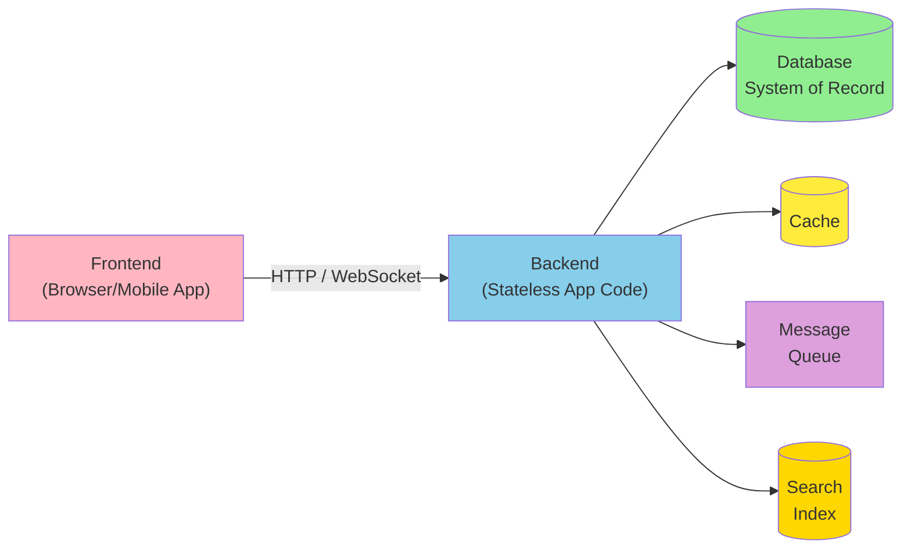

The biggest infrastructure challenges usually lie in the backend, because the backend handles data on behalf of every user, while a frontend typically deals only with one user's local data. Local-first software [2] flips this assumption — see the discussion in Chapter 14 — but for most web and mobile apps today, the backend is where data gravity lives.

A backend's application code is often **stateless**: when a request finishes, the process forgets everything about it. Any state that needs to survive between requests is persisted on the client (browser localStorage, mobile SQLite) or in server-side data infrastructure. Stateless backends are easy to scale horizontally — you can spin up more copies behind a load balancer — but every cross-request fact must live in some data system.

### 1.1 Code Example: A Minimal Stateless Backend Endpoint

```python
"""
A stateless backend handler for a social-network "post" endpoint.

The handler accepts a request, validates it, persists a new post
to the system of record, and returns a response. It holds no
state between requests — everything durable lives in the database.
"""

import time
import uuid
from dataclasses import dataclass
from typing import Optional


@dataclass
class PostRequest:
    """Incoming payload from the frontend."""
    user_id: str
    text: str


@dataclass
class PostResponse:
    """What we return to the frontend."""
    post_id: str
    user_id: str
    created_at: float


class PostHandler:
    """
    Stateless handler. The only state is the injected data store
    reference, which lives for the lifetime of the process — not
    the lifetime of a single request.
    """

    def __init__(self, datastore):
        # `datastore` is a thin wrapper around the system of record
        # (e.g., PostgreSQL, DynamoDB, or MongoDB).
        self.datastore = datastore

    def create_post(self, req: PostRequest) -> PostResponse:
        # Validation is business logic — cheap, in-process, no I/O.
        if not req.text or len(req.text) > 4000:
            raise ValueError("Post text must be 1..4000 characters")

        post_id = str(uuid.uuid4())
        created_at = time.time()

        # The actual side effect: write to durable storage.
        self.datastore.insert(
            table="posts",
            row={
                "post_id": post_id,
                "user_id": req.user_id,
                "text": req.text,
                "created_at": created_at,
            },
        )

        # We return immediately. We don't remember this request;
        # if we crash, the next instance can serve the same user
        # without missing a beat.
        return PostResponse(
            post_id=post_id,
            user_id=req.user_id,
            created_at=created_at,
        )


# Usage (simplified — in production, the framework calls the handler):
# handler = PostHandler(datastore=PostgresClient(...))
# response = handler.create_post(PostRequest(user_id="u_42", text="hello"))
```

The crucial property of this design is that **any** instance of `PostHandler` can serve **any** request, because the request carries all the information needed and the response depends only on the database. This is why stateless backends scale so well: the load balancer doesn't need sticky sessions, and you can replace unhealthy instances freely.

---

## 2. Operational Versus Analytical Systems

In any non-trivial organization, at least three groups of people interact with data, and each group wants different things from it:

1. **Backend engineers** build services that handle reads and writes on behalf of users (and sometimes on behalf of other services). They care about latency, throughput, and correctness for individual records.
2. **Business analysts** generate reports that help management make decisions (business intelligence, or **BI**). They care about aggregations across many records: totals, averages, breakdowns by region, cohort retention, and so on.
3. **Data scientists** look for novel insights in data or build user-facing features enabled by ML/AI — recommendations, fraud detection, search ranking. They care about feature engineering, exploratory analysis, and feeding training pipelines.

Analysts and data scientists have different tools and workflows, but they share two practices: they **perform analytics** (reading data generated elsewhere) and they **generally do not modify the source data** (except for occasional corrections or for producing new derived datasets).

This split has produced two distinct kinds of systems, and we will use the distinction throughout the book:

- **Operational systems** consist of the backend services and the data infrastructure where data is *created*. Application code reads and writes the data based on user actions.
- **Analytical systems** serve analysts and data scientists. They contain a read-only copy of the data from operational systems, optimized for analytics-style queries.

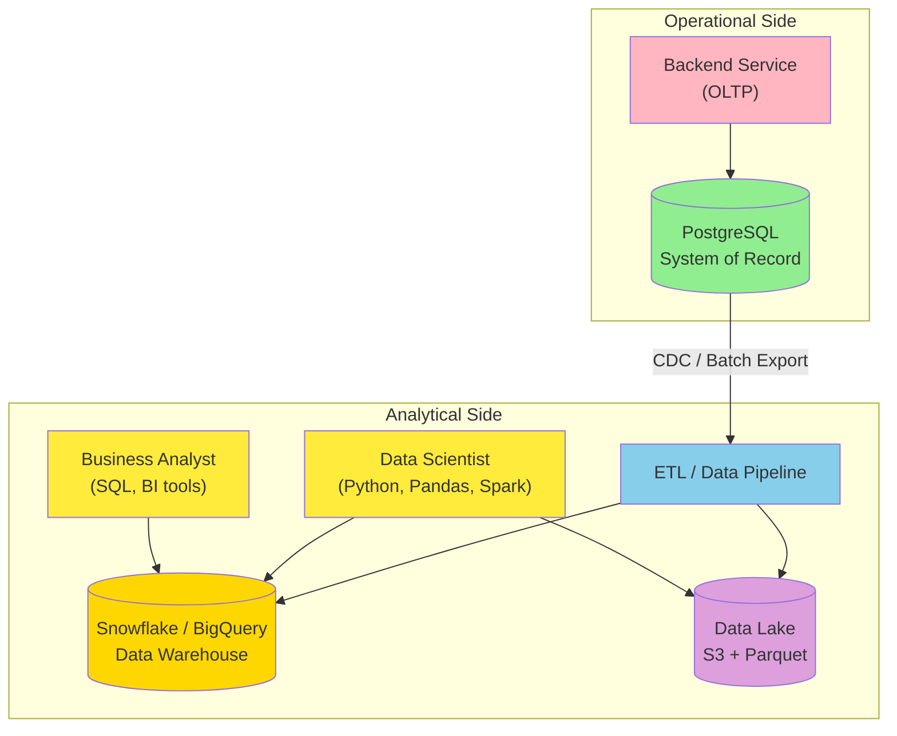

As these systems have matured, two new specialized roles have emerged: **data engineers**, who integrate the operational and analytical sides and own the data infrastructure; and **analytics engineers**, who model and transform data so it is useful for analysts and data scientists [3, 4]. Many engineers specialize in one side or the other, but understanding both is essential — the rest of this book covers them in equal depth.

### 2.1 Characterizing Transaction Processing and Analytics

In the early days of business data processing, a database write usually corresponded to a commercial transaction: a sale, an order, a salary payment. As databases expanded into areas unrelated to money, the word **transaction** stuck, but its meaning loosened to "a group of reads and writes that form a logical unit." Chapter 8 explores transactions in detail; this chapter uses the term loosely to mean "low-latency reads and writes."

Even as the kinds of data stored exploded — social-media posts, game moves, address-book contacts, sensor readings — the basic access pattern of operational systems remained similar to processing business transactions. An operational system typically:

- Looks up a small number of records by key (a **point query**).
- Inserts, updates, or deletes individual records based on user input.

Because these applications are interactive, this access pattern became known as **online transaction processing (OLTP)**.

Analytical workloads look very different. A typical analytical query scans over a huge number of records and computes aggregate statistics (count, sum, average) rather than returning individual records. Consider a supermarket analyst asking:

- What was the total revenue of each store in January?
- How many more bananas than usual did we sell during our latest promotion?
- Which brand of baby food is most often bought together with brand X diapers?

These reports drive BI decisions, so the access pattern became known as **online analytical processing (OLAP)** [5]. The line between OLTP and OLAP is fuzzy, but typical characteristics are listed in Table 1-1.

### 2.2 Table 1-1: Comparing Operational and Analytical Systems

| Property | Operational systems (OLTP) | Analytical systems (OLAP) |
|---|---|---|
| Main read pattern | Point queries (fetch records by key) | Aggregate over large number of records |
| Main write pattern | Create, update, delete individual records | Bulk import (ETL) or event stream |
| Human user example | End user of web/mobile app | Internal analyst, decision support |
| Machine use example | Checking if an action is authorized | Detecting fraud/abuse patterns |
| Type of queries | Fixed, predefined by application | Arbitrary, ad-hoc exploration |
| Query volume | Lots of small queries | Few queries, each complex |
| Data represents | Latest state of data (current point in time) | History of events that happened over time |
| Dataset size | Gigabytes to terabytes | Terabytes to petabytes |

> Note: "Online" in OLAP probably indicates that queries are not just predefined reports — analysts use the OLAP system interactively for exploratory queries.

In operational systems, end users are generally not allowed to construct custom SQL and run it on the production database. Doing so could expose data they shouldn't see, or run an expensive query that tanks performance for everyone. Operational databases therefore mostly run a fixed set of queries that are baked into application code; one-off queries are reserved for maintenance and troubleshooting.

Analytical databases take the opposite approach: they give analysts the freedom to write arbitrary SQL by hand or to generate queries automatically through BI and visualization tools such as Tableau, Looker, or Microsoft Power BI.

A third category — **product analytics** or **real-time analytics** — is designed for analytical workloads embedded directly into user-facing products. Systems such as **Apache Pinot**, **Apache Druid**, and **ClickHouse** [6] ingest data in real time and optimize for low-latency query responses. They sit between classical OLAP (batch ingest, throughput-optimized) and OLTP (point queries, low latency on individual records) — handling "lots of small aggregation queries" rather than "few large ones."

### 2.3 A Concrete OLTP vs OLAP Example

To make the difference tangible, imagine the following illustrative scenario (numbers are typical for a large social network, not drawn from any specific company):

- 500 million posts created per day.
- 500,000,000 / 86,400 ≈ **5,800 posts/sec** average.
- Peak rate during major events: **150,000 posts/sec**.

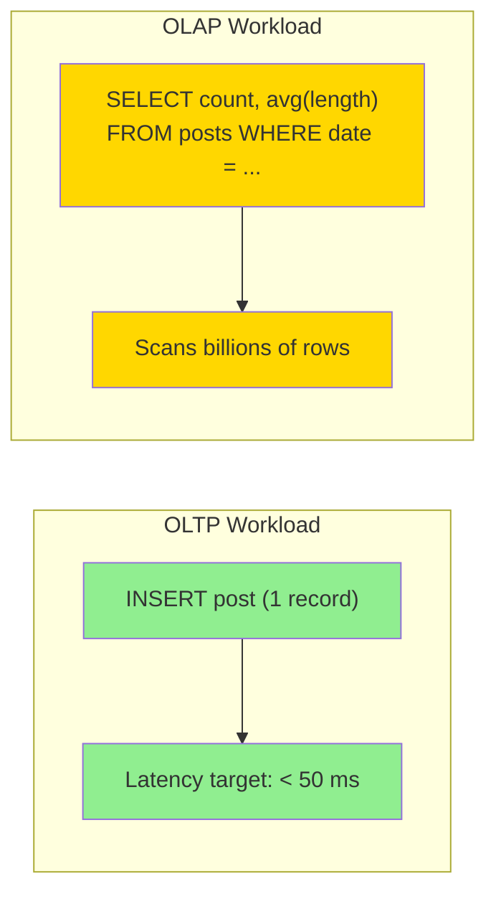

An OLTP query like `INSERT INTO posts (...) VALUES (...)` should complete in tens of milliseconds. An OLAP query like "average post length by hour for the last 30 days" scans billions of rows and may take minutes — but it answers a question no OLTP query could.

---

## 3. Data Warehousing

At first, the same databases were used for both transaction processing and analytical queries. SQL turned out to be quite flexible: it works well for both. But in the late 1980s and early 1990s, a trend emerged: companies stopped running analytics on their OLTP systems and moved that work to a separate database called a **data warehouse**.

A large enterprise may have dozens — even hundreds — of OLTP systems: customer-facing web properties, point-of-sale checkout systems, warehouse inventory, vehicle routing, supplier management, payroll, and more. Each system is complex, has its own team, and operates largely independently.

It is undesirable for analysts and data scientists to query these OLTP systems directly, for several reasons:

1. **Data silos**: The data of interest may be spread across multiple operational systems, making joins painful or impossible.
2. **Schema mismatch**: Schemas and layouts that are good for OLTP are often poorly suited for analytics (see "Stars and Snowflakes: Schemas for Analytics" in Chapter 3).
3. **Performance interference**: A heavy analytical query can starve the OLTP database's normal traffic.
4. **Access control**: OLTP systems may live in networks that analysts aren't allowed to reach, for security or compliance reasons.

A data warehouse solves all of these problems. It is a separate database analysts can query freely, without affecting OLTP operations [7]. As we will see in Chapter 4, data warehouses often store data very differently from OLTP databases to optimize for analytical access patterns.

### 3.1 ETL: Extract, Transform, Load

The data warehouse contains a read-only copy of data from all the various OLTP systems. Getting data into the warehouse is a multi-step pipeline known as **extract–transform–load (ETL)**:

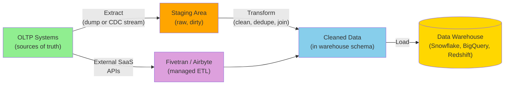

Sometimes the order of the last two steps is swapped — load first, transform inside the warehouse — yielding **ELT**. ELT has become popular because modern cloud data warehouses can run transforms in parallel at high speed, and because it preserves the raw data for later re-processing.

When the data sources are external SaaS products (CRM, email marketing, payment processing), you typically don't have direct access to the original database; the vendor exposes an API. ETL for SaaS APIs is often implemented by specialist data connector services such as **Fivetran**, **Singer**, or **Airbyte**.

### 3.2 HTAP: Hybrid Transactional/Analytical Processing

Some database systems offer **hybrid transactional/analytical processing (HTAP)**, which aims to support OLTP and analytics in a single system without ETL between them [8, 9]. However, many HTAP systems internally consist of an OLTP system coupled with a separate analytical system, hidden behind a common interface — so the distinction between the two remains important for understanding how they work.

HTAP does not replace data warehouses. It is useful when the same application needs to perform analytical queries that scan a large number of rows *and* read and update individual records with low latency. **Fraud detection** is a textbook example [10]: every new transaction triggers both a fast point read against customer history and a heavy aggregation scan over recent activity patterns.

The separation between operational and analytical systems reflects a wider trend. As workloads have grown more demanding, systems have become more specialized and optimized for particular workloads. General-purpose systems handle small data volumes comfortably, but at greater scale, more specialized systems tend to win [11].

### 3.3 From Data Warehouse to Data Lake

A data warehouse often uses a relational data model queried through SQL, with BI software on top. This works well for analysts, but is less suited for data scientists doing things like:

- **Feature engineering**: turning rows and columns of a database table into a vector or matrix of numerical values that an ML model can consume.
- **NLP on text**: extracting sentiment, topics, or entities from product reviews.
- **Computer vision**: extracting structured information from images.

Although there have been efforts to add ML operators to SQL [12] and to build efficient ML systems on top of a relational foundation [13], many data scientists prefer not to work in a relational warehouse. Instead, they reach for **Pandas** and **scikit-learn**, statistical languages like **R**, and distributed analytics frameworks like **Spark** [14]. We discuss these tools further in Chapter 4 ("DataFrames, Matrices, and Arrays").

The answer to "make data available in a form data scientists can use" is a **data lake**: a centralized data repository that holds a copy of any data that might be useful for analysis, obtained from operational systems via ETL pipelines. The difference from a data warehouse is that a data lake contains *files*, with no enforced file format, data model, or schema [15]. Files might be collections of database records encoded in **Avro** or **Parquet**, but a data lake can equally well contain text, images, video, sensor readings, sparse matrices, feature vectors, or genome sequences [16]. Data lakes are also usually cheaper than relational warehouses, because they use commoditized object storage (see "Cloud Native System Architecture" below).

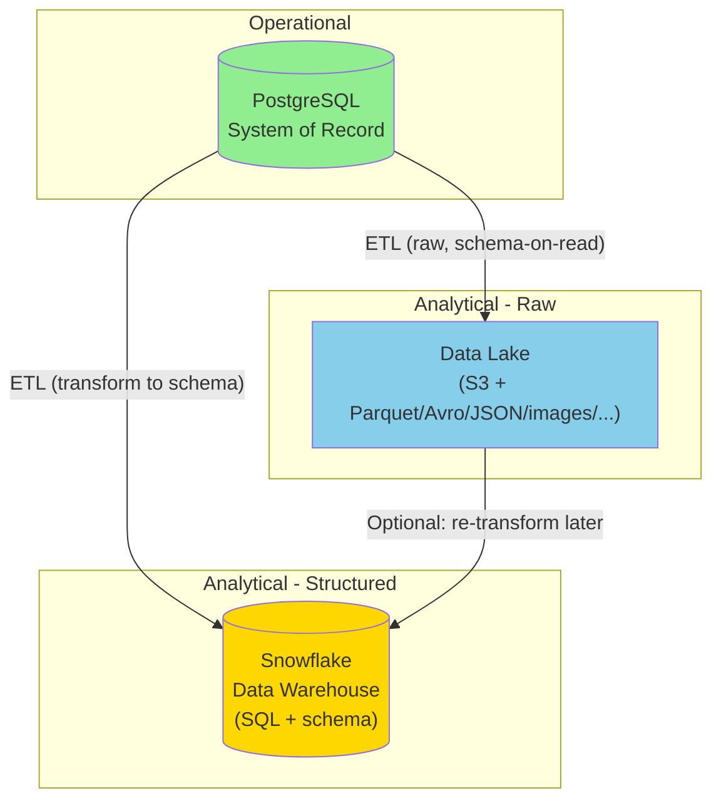

ETL pipelines have been generalized to **data pipelines**, and the data lake often becomes an intermediate stop between operational systems and the data warehouse. The lake holds data in its raw form, and each consumer transforms it into the form that best suits them. This is sometimes called the **sushi principle**: "raw data is better" [17].

### 3.4 Beyond the Data Lake

As analytics practices have matured, organizations have paid increasing attention to the management and operations of analytical systems and data pipelines, captured, for example, in the **DataOps Manifesto** [18]. This has been driven partly by:

- **Governance, privacy, and compliance** with regulations such as GDPR and CCPA (see "Data Systems, Law, and Society" below, and Chapter 14).
- **The shift from files to event streams**: data for analytics is increasingly delivered as streams, not just file dumps. Stream processing allows analytical systems to respond to events in seconds rather than waiting for the next batch run. Fraud and abuse detection are typical beneficiaries.

In some cases, the outputs of analytical systems are fed back into operational systems, a process sometimes known as **reverse ETL** [19]. For example, an ML model trained on warehouse data may be deployed to production to generate recommendations for end users. Tools such as **TFX**, **Kubeflow**, and **MLflow** specialize in this deployment path.

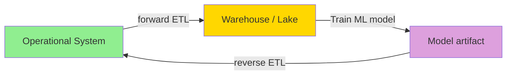

---

## 4. Systems of Record and Derived Data

Related to the operational/analytical distinction, the book uses two further terms that clarify how data flows through a system: **systems of record** and **derived data systems**.

### 4.1 Systems of Record

A **system of record** — also called a **source of truth** — holds the authoritative, canonical version of data. When new data arrives (e.g., from a user), it is first written here. Each fact is represented exactly once, and the representation is typically normalized (see Chapter 3, "Normalization, Denormalization, and Joins"). If there is ever a discrepancy between another system and the system of record, the system of record wins — by definition.

### 4.2 Derived Data Systems

A **derived data system** holds data that is the result of taking existing data from another system and transforming or processing it. If you lose derived data, you can re-create it from the original source. Classic examples include:

- A **cache**: serve from cache if present, fall back to the underlying database.
- **Indexes** (search, secondary, covering) built on top of a primary database.
- **Materialized views**: pre-computed aggregations of base tables.
- **Denormalized projections**: data shaped for fast reads.
- **ML models trained on a dataset**: the model is a lossy compression of the source data.

Technically, derived data is redundant — it duplicates information. But this redundancy is often essential for read performance. You can derive several datasets from a single source, each offering a different viewpoint.

Analytical systems are usually derived data systems, because they consume data created elsewhere. Operational services may mix both: the primary database is a system of record, while the indexes and caches that accelerate reads are derived.

Most databases, storage engines, and query languages are not inherently one or the other. A database is just a tool; what matters is how you use it. By being explicit about which data is derived from which other data, you bring clarity to an otherwise confusing architecture.

When one system's data is derived from another's, you need a process to update the derived data when the source changes. Unfortunately, many databases assume your application will only ever use that one database, and make multi-system integration painful. Chapter 11 discusses **data pipelines** as an approach to composing multiple data systems to achieve things one system alone cannot.

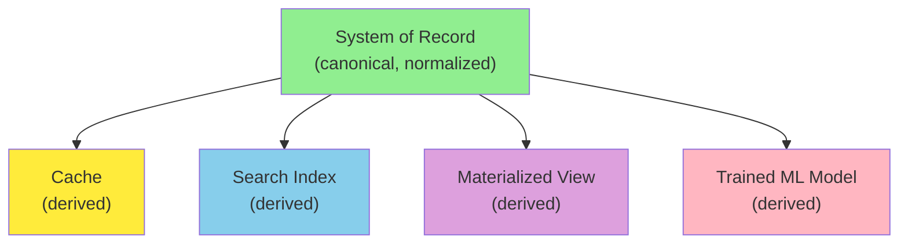

### 4.3 Code Example: Modeling System of Record vs Derived Data

```python
"""
Demonstrates the relationship between a system of record and
several derived data structures built on top of it.

The point: losing derived data is recoverable; losing the
system of record is catastrophic.
"""

import time
from dataclasses import dataclass, field
from typing import Optional


@dataclass
class User:
    """Authoritative user record — the system of record."""
    user_id: str
    email: str
    name: str
    created_at: float


@dataclass
class UserCache:
    """Derived: an in-memory cache keyed by user_id."""
    _entries: dict = field(default_factory=dict)

    def put(self, user: User) -> None:
        self._entries[user.user_id] = user

    def get(self, user_id: str) -> Optional[User]:
        return self._entries.get(user_id)

    # We can always rebuild the cache by replaying the system of record.
    def rebuild_from(self, system_of_record: list[User]) -> None:
        self._entries.clear()
        for user in system_of_record:
            self.put(user)


@dataclass
class UserSearchIndex:
    """Derived: a tiny inverted index over user names for search."""
    _inverted: dict = field(default_factory=dict)

    def index(self, user: User) -> None:
        for token in user.name.lower().split():
            self._inverted.setdefault(token, set()).add(user.user_id)

    def search(self, query: str) -> set:
        return self._inverted.get(query.lower(), set())


# Imagine these live in completely different storage systems.
sor: list[User] = []
cache = UserCache()
index = UserSearchIndex()

# A new user arrives. We write to the system of record FIRST.
new_user = User(
    user_id="u_42",
    email="alice@example.com",
    name="Alice Example",
    created_at=time.time(),
)
sor.append(new_user)

# Then we propagate to derived systems.
cache.put(new_user)
index.index(new_user)

# If the cache is lost, we rebuild it from the system of record:
cache.rebuild_from(sor)

# If the index is lost, we rebuild it the same way:
index = UserSearchIndex()
for user in sor:
    index.index(user)
```

The pattern is uniform: **write to the system of record, propagate to derived systems**. If any derived system is lost, you can always reconstruct it by replaying the system of record. This is the foundational principle behind event-sourced architectures and change-data-capture pipelines (which we will explore in detail in later chapters).

---

## 5. Cloud Versus Self-Hosting

With anything an organization needs to do, one of the first questions is whether it should be done in-house or outsourced: **build or buy?** Ultimately, this is a question about business priorities. A common rule of thumb:

- Things that are a **core competency** or **competitive advantage** should be done in-house.
- Things that are **non-core, routine, or commonplace** should be left to a vendor [20].

For an extreme example, most companies do not fabricate their own CPUs — it is far cheaper to buy them from semiconductor manufacturers.

With software, two important decisions are **who builds it** and **who deploys it**. The spectrum is illustrated below.

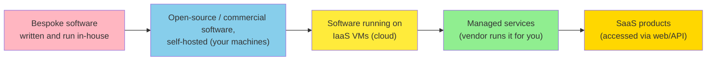

A related question is **how** you deploy services — for example, with Kubernetes or another orchestrator. Choice of deployment tooling is beyond the scope of this book; other factors have a bigger influence on data-systems architecture.

### 5.1 Pros and Cons of Cloud Services

Using a cloud service rather than running comparable software yourself essentially **outsources the operation** of that software to the cloud provider. Cloud vendors claim this saves you time and money and lets you move faster. Whether that is actually true depends on your skills and workload.

**Arguments for cloud services:**

- If you already know how to deploy and operate the system you need, and your load is predictable, then buying your own machines is often cheaper [21, 22].
- If you need a system you don't already know how to run, adopting a cloud service is often quicker than learning to operate it. Hiring and training staff to maintain a system is expensive.
- Outsourcing operation to a specialist provider can yield better service: the provider gains operational expertise from serving many customers.
- Cloud services are particularly valuable when **load varies a lot over time**. If you provision machines for peak load but they sit idle most of the time, your cost-effectiveness drops. Cloud services make it easier to scale resources up or down with demand.
- Analytical systems often have extremely variable load. Running a large analytical query quickly requires lots of parallel compute, but once the query finishes those resources sit idle until the next query. Predefined queries (e.g., daily reports) can be scheduled to smooth load, but interactive queries are inherently bursty. Returning unused resources to the provider saves money.

**Arguments against cloud services — the "no control" problem:**

- If the service lacks a feature you need, you can only politely ask the vendor; you cannot implement it yourself.
- If the service goes down, you wait.
- Diagnosing bugs and performance issues is hard: you usually can't see server logs, OS metrics, or internals.
- If the vendor shuts down the service, raises prices, or changes the product in an incompatible way, you are at their mercy. Continuing to run an old version is usually not an option, so you must migrate. **Vendor lock-in** is mitigated when alternative services expose compatible APIs, but for many cloud services there is no standard.
- If the cloud provider is in another country and political conflict arises, you risk being locked out by sanctions.
- Trusting the provider with your data complicates compliance with privacy and security regulations.

Despite these risks, it has become more common for organizations to build new applications on top of cloud services, or to adopt a hybrid approach in which cloud services are used for some parts of a system. But cloud services will not subsume all in-house data systems. Many older systems predate the cloud, and specialist requirements (e.g., the microsecond latencies of high-frequency trading) demand full control of the hardware.

### 5.2 Table 1-2: Self-Hosted vs Cloud Native Systems

This is a representative (not exhaustive) comparison. Systems designed from the ground up for the cloud tend to have advantages in performance, recovery, scaling, and dataset size [24, 25, 26].

| Category | Self-hosted systems | Cloud native systems |
|---|---|---|
| Operational/OLTP | MySQL, PostgreSQL, MongoDB | AWS Aurora [24], Azure SQL DB Hyperscale [25], Google Cloud Spanner |
| Analytical/OLAP | Teradata, ClickHouse, Spark | Snowflake [26], Google BigQuery, Azure Synapse Analytics |

---

## 6. Cloud Native System Architecture

Besides the economic shift (subscription vs capital expense), the rise of the cloud has had a **profound effect on how data systems are implemented** at a technical level. The term **cloud native** describes architectures designed to take advantage of cloud services.

In principle, almost any self-hostable software can be provided as a cloud service, and managed services are now available for many popular data systems. However, systems designed from the ground up to be cloud native have shown several advantages [24, 25, 26]:

- Better performance on the same hardware.
- Faster recovery from failures.
- Quick scaling of compute resources to match load.
- Support for larger datasets.

### 6.1 Layering of Cloud Services

Many self-hosted data systems have simple requirements: a conventional OS (Linux/Windows), files on a filesystem, and standard networking (TCP/IP). A few systems depend on special hardware (GPUs for ML, RDMA network interfaces), but self-hosted software mostly uses generic CPUs, RAM, a filesystem, and an IP network.

In a cloud, this kind of software can run in an **IaaS** environment: one or more VMs (instances) with a certain allocation of CPU, memory, disk, and network bandwidth. Compared to physical machines, cloud instances can be provisioned faster and come in more sizes, but otherwise they look like traditional computers — you can run any software you like, but you administer it yourself.

The key idea of cloud native services is to **build on lower-level cloud services to create higher-level services**. Examples:

- **Object storage** (Amazon S3, Azure Blob Storage, Cloudflare R2) stores large files. Its API is more limited than a typical filesystem (basic reads and writes), but it hides the underlying machines and automatically distributes data across them. Even if individual machines or disks fail entirely, no data is lost.
- Many higher-level services are built on top of object storage. **Snowflake** is a cloud-based analytical database that relies on S3 for data storage [26]; other services, in turn, build on Snowflake.

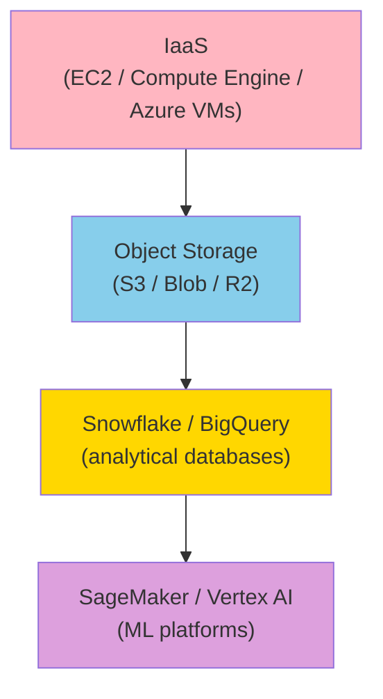

Higher-level abstractions tend to be more oriented toward particular use cases. If your needs match what a higher-level system is designed for, using it will save you enormous effort. If no high-level system meets your needs, building from lower-level components is the only option.

### 6.2 Separation of Storage and Compute

In traditional computing, disk storage is treated as durable: once written, the data persists. To tolerate individual disk failures, **RAID** (redundant array of independent disks) maintains copies on several disks attached to the same machine, transparent to the application.

In the cloud, compute instances may have local disks, but cloud native systems typically treat these disks as an **ephemeral cache** rather than long-term storage. The local disk becomes inaccessible if the associated instance fails or is replaced (e.g., to scale up to a bigger instance type on a different physical machine).

An alternative is **virtual disk storage**: cloud-managed block devices (Amazon EBS, Azure managed disks, Google persistent disks) that can be detached from one instance and attached to another. A virtual disk isn't a physical disk; it's a service provided by a separate set of machines that emulates a block device (typically 4 KiB blocks). This lets you run traditional disk-based software in the cloud, but the block-device emulation adds overhead that cloud-native designs avoid [24]. Every I/O operation on a virtual disk is also a network call, making the application very sensitive to network glitches [27].

Cloud native services avoid virtual disks and instead use **dedicated storage services** optimized for particular workloads:

- Object storage (S3, Blob) is designed for long-term storage of large files (hundreds of KB to several GB).
- Individual rows or values in a database are typically much smaller than that. Cloud databases manage small values in a separate service and store larger data blocks (containing many values) in an object store [25, 28]. Chapter 4 covers the details.

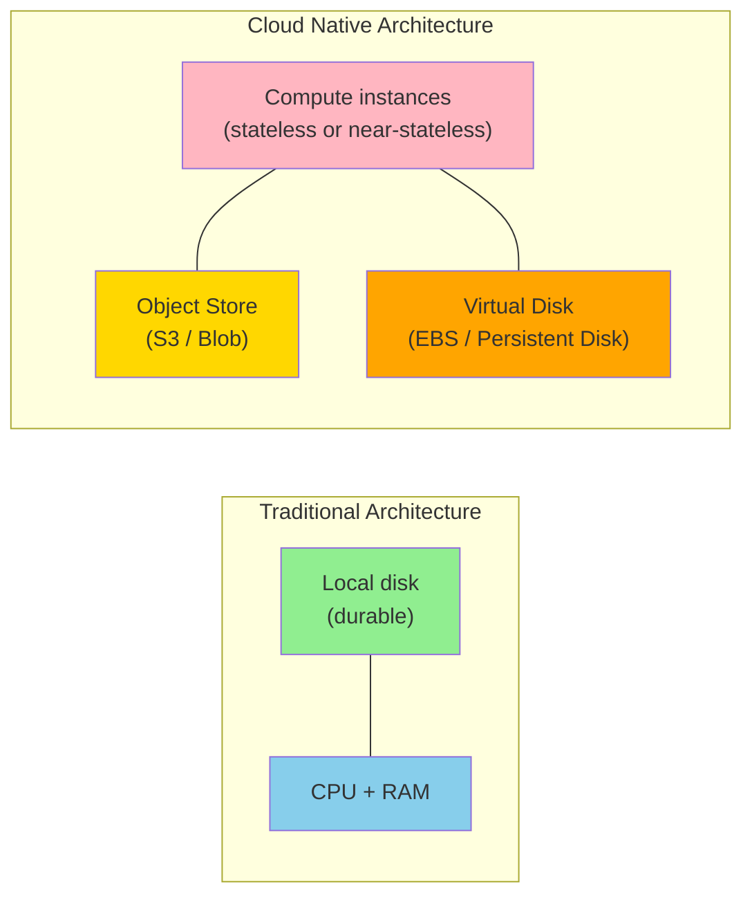

In a traditional architecture, the same computer handles both storage and compute. In cloud native systems, these responsibilities have become **disaggregated** [9, 26, 29, 30]: S3 only stores files, and if you want to analyze that data, you must run analysis code somewhere else. This implies transferring data over the network — see "Distributed Versus Single-Node Systems" below.

Cloud native systems are also often **multitenant**: rather than dedicating a machine per customer, several customers share hardware within the same service [31]. Multitenancy enables better utilization, easier scalability, and easier management, but it requires careful engineering to ensure one customer's activity does not affect another's performance or security [32].

---

## 7. Operations in the Cloud Era

Traditionally, the people managing server-side data infrastructure were known as **database administrators (DBAs)** or **system administrators (sysadmins)**. More recently, many organizations have integrated development and operations into teams with shared responsibility for both backend services and data infrastructure; the **DevOps** philosophy has guided this trend. **Site reliability engineers (SREs)** are Google's implementation of this idea [33].

The role of operations is to ensure that services are reliably delivered to users — including configuring infrastructure, deploying applications, and maintaining a stable production environment through monitoring and diagnosis. For self-hosted systems, operations traditionally involved a lot of work at the level of individual machines:

- Capacity planning (e.g., monitoring disk space and adding more disks before you run out).
- Provisioning new machines.
- Moving services between machines.
- Installing OS patches.

Many cloud services present an API that hides the individual machines implementing the service. Cloud storage replaces fixed-size disks with **metered billing** (pay for what you use). Many cloud services remain highly available even when individual machines fail (see "Reliability and Fault Tolerance" in Chapter 3).

This shift from individual machines to services has been accompanied by a change in the role of operations. The high-level goal — provide a reliable service — remains the same, but the processes and tools have evolved.

### 7.1 The DevOps/SRE Philosophy

Modern DevOps/SRE practices place greater emphasis on:

- **Automation**: prefer repeatable processes over one-off manual jobs.
- **Ephemeral infrastructure**: use short-lived VMs and services rather than long-running servers.
- **Frequent updates**: enable rapid application deployment.
- **Learning from incidents**: treat outages as learning opportunities.
- **Preserving organizational knowledge**: even as individual people come and go [34].

With the rise of cloud services, a **bifurcation of roles** has occurred. Operations teams at infrastructure companies specialize in providing reliable services to many customers; customers of those services spend as little time as possible on infrastructure [35].

Cloud-service customers still need operations, but they focus on different aspects:

- Choosing the most appropriate service for a given task.
- Integrating services with each other.
- Migrating from one service to another.

Metered billing removes the need for capacity planning in the traditional sense, but it is still important to know what resources you are using and why — so that you don't waste money on resources you don't need. **Capacity planning becomes financial planning**, and **performance optimization becomes cost optimization** [36]. Cloud services also have resource limits and quotas (e.g., max concurrent processes) that you must plan for [37].

Adopting a cloud service is easier and quicker than provisioning your own infrastructure, though you still have to learn how to use the service and work around its limits. Integration among services is a particular challenge as a growing number of vendors offer ever more services targeting different use cases [38, 39]. ETL is only part of the story; operational cloud services also need to be integrated with each other. Standards for this kind of integration are still emerging, and significant manual effort is often required.

Other operational concerns that cannot be fully outsourced include:

- Maintaining the security of an application and its dependencies.
- Managing interactions between your own services.
- Monitoring load on your services.
- Tracking down the cause of performance degradations or outages.

While the cloud is changing the role of operations, the need for operations is as great as ever.

### 7.2 Code Example: Modeling Cloud Cost as an Operational Concern

```python
"""
A small model showing why 'capacity planning becomes financial
planning' in the cloud era. With on-prem hardware, you provision
once for peak; with cloud, every GB-hour and CPU-hour is a line item.
"""

from dataclasses import dataclass


@dataclass
class OnPremCost:
    """Fixed cost model: buy hardware sized for peak."""
    hardware_capex: float            # USD, upfront
    annual_power_and_colo: float     # USD/year
    peak_capacity_units: int         # e.g., servers

    def cost_per_unused_unit_year(self) -> float:
        # If you provision for peak but average load is much lower,
        # the unused capacity is a sunk cost you cannot recover.
        return self.annual_power_and_colo / self.peak_capacity_units


@dataclass
class CloudCost:
    """Variable cost model: pay per use."""
    cpu_hour_usd: float              # e.g., 0.04
    gb_month_usd: float              # e.g., 0.023
    avg_cpu_hours_per_month: float
    avg_storage_gb: float
    peak_cpu_hours_per_month: float  # bursty workload

    def avg_monthly_cost(self) -> float:
        return (
            self.cpu_hour_usd * self.avg_cpu_hours_per_month
            + self.gb_month_usd * self.avg_storage_gb
        )

    def peak_monthly_cost(self) -> float:
        return (
            self.cpu_hour_usd * self.peak_cpu_hours_per_month
            + self.gb_month_usd * self.avg_storage_gb
        )


# Same workload, two cost structures.
on_prem = OnPremCost(
    hardware_capex=200_000,
    annual_power_and_colo=60_000,
    peak_capacity_units=20,
)
cloud = CloudCost(
    cpu_hour_usd=0.04,
    gb_month_usd=0.023,
    avg_cpu_hours_per_month=20 * 24 * 30 * 0.20,   # 20% of peak
    avg_storage_gb=10_000,
    peak_cpu_hours_per_month=20 * 24 * 30,
)

# In the cloud, you only pay for what you actually use.
# In the on-prem world, you pay for the peak machine whether or not it's busy.
# This is why the cloud is most attractive for *variable* workloads.
print(f"On-prem unused-unit cost: ${on_prem.cost_per_unused_unit_year():,.0f}/unit-year")
print(f"Cloud avg monthly cost:   ${cloud.avg_monthly_cost():,.0f}")
print(f"Cloud peak monthly cost:  ${cloud.peak_monthly_cost():,.0f}")
```

The point is not that cloud is always cheaper — for steady-state workloads at scale, on-prem hardware can win — but that with the cloud, the **operational question becomes "what is each resource costing me, and is the spend justified?"** rather than "do I have enough iron?"

---

## 8. Distributed Versus Single-Node Systems

A system that involves several machines communicating via a network is a **distributed system**. Each participating process is a **node**. There are many reasons you might want a distributed system.

### 8.1 Reasons to Distribute

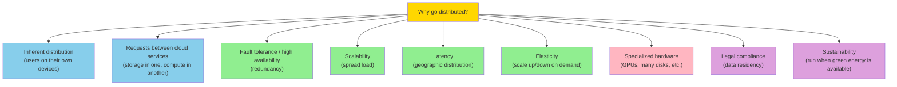

Let's unpack each:

1. **Inherent distribution**: if an application involves two or more interacting users on different devices, the system is unavoidably distributed.
2. **Requests between cloud services**: if data is stored in one service and processed in another, the data must travel over the network. Cloud native systems and microservices (see "Microservices and Serverless" below) are therefore distributed.
3. **Fault tolerance / high availability**: if your application must keep working even when individual machines (or whole datacenters) fail, you need multiple machines for redundancy.
4. **Scalability**: if data volume or compute requirements outgrow one machine, you can spread the load.
5. **Latency**: if you have users around the world, you want servers in multiple regions so each user is served from a nearby one.
6. **Elasticity**: if the workload is busy at some times and idle at others, a cloud deployment can scale up or down to match demand, so you pay only for what you actively use. On a single machine, you must provision for peak.
7. **Specialized hardware**: different parts of the system can use different hardware — an object store on machines with many disks but few CPUs, a data analysis system on machines with lots of CPU and memory but no disks, an ML system on machines with GPUs.
8. **Legal compliance**: some countries have data-residency laws requiring data about people in their jurisdiction to be stored and processed within that country [40]. A service with users in several such jurisdictions must distribute its data across multiple regions.
9. **Sustainability**: with flexibility on where and when you run jobs, you can run them where and when renewable electricity is plentiful, reducing carbon emissions and taking advantage of cheap power [41, 42].

These reasons apply both to code you write yourself and to off-the-shelf software (databases, message queues, etc.).

### 8.2 Problems with Distributed Systems

Distributed systems also have downsides. Every request that traverses the network must handle the possibility of failure: the network may be interrupted, the service may be overloaded, or it may crash. Any request may time out without a response, and we don't know whether the service received it — a naive retry may not be safe. Chapter 9 explores these failure modes in detail.

Datacenter networks are fast, but a network call to another service is still **vastly slower** than calling a function in the same process [43]. When operating on large volumes of data, transferring data from storage to a separate processing machine can be slower than bringing the computation to the data [44]. More nodes are not always faster: a simple single-threaded program on one computer can outperform a cluster with over 100 CPU cores [45].

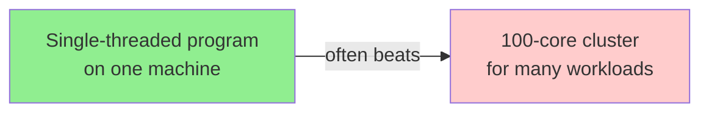

Troubleshooting a distributed system is often difficult. If the system is slow to respond, where is the problem? The discipline of **observability** [46, 47] addresses this by collecting data about a system's execution and exposing it for both high-level metrics and individual events. Tracing tools such as **OpenTelemetry**, **Zipkin**, and **Jaeger** let you track which client called which server for which operation and how long each call took [48].

Databases provide various mechanisms for ensuring data consistency (Chapters 6 and 8), but when each service has its own database, maintaining consistency across services becomes the **application's** problem. Distributed transactions (Chapter 8) are a possible solution, but they are rarely used in microservices contexts because they run counter to the goal of service independence, and many databases don't support them [49].

For all these reasons, performing a task on a single machine is often simpler and cheaper than setting up a distributed system [22, 45, 50]. CPUs, memory, and disks have grown larger, faster, and more reliable. Combined with single-node databases such as **DuckDB**, **SQLite**, and **KùzuDB**, many workloads can now run on a single node. We will explore this further in Chapter 4.

### 8.3 Code Example: Latency Numbers Every Engineer Should Know

```python
"""
A toy model of the "latency numbers" that motivate moving
computation to data (or accepting distributed systems only when
forced to). Values are rough orders of magnitude drawn from
publicly cited figures (cf. [43]).
"""

import time


# Approximate order-of-magnitude latencies.
L1_CACHE_REF       = 1   # ns
L2_CACHE_REF       = 5   # ns
MAIN_MEMORY_REF    = 100 # ns
SSD_RANDOM_READ    = 100_000      # ~100 µs
HDD_RANDOM_READ    = 10_000_000   # ~10 ms
NETWORK_RTT_SAME_DC = 500_000     # ~0.5 ms
NETWORK_RTT_CROSS_DC = 30_000_000  # ~30 ms
NETWORK_RTT_CROSS_CONT = 150_000_000  # ~150 ms


def relative_ratio(a_ns: int, b_ns: int) -> int:
    return a_ns // b_ns


# How many L1-cache references fit in one network round-trip
# across the same datacenter?
print(
    "Same-DC RTT in L1 refs:",
    relative_ratio(NETWORK_RTT_SAME_DC, L1_CACHE_REF),
)
# How about a cross-continent RTT?
print(
    "Cross-continent RTT in L1 refs:",
    relative_ratio(NETWORK_RTT_CROSS_CONT, L1_CACHE_REF),
)
# Random SSD read vs random memory access?
print(
    "SSD random read in DRAM refs:",
    relative_ratio(SSD_RANDOM_READ, MAIN_MEMORY_REF),
)
```

The takeaway: every cross-machine hop is orders of magnitude more expensive than an in-process function call. Distributed systems buy you scalability, fault tolerance, and geographic reach — but only if you genuinely need those properties.

---

## 9. Microservices and Serverless

The most common way to distribute a system is the **client–server** model: clients make requests to servers over the network, usually via HTTP. The same process may act as both server (handling inbound requests) and client (making outbound calls).

This style of building applications has traditionally been called a **service-oriented architecture (SOA)**; more recently it has been refined into a **microservices** architecture [51, 52]. In a microservices architecture:

- Each service has one well-defined purpose (e.g., S3's purpose is file storage).
- Each service exposes an API callable over the network.
- Each service has one team responsible for its maintenance.

A complex application can thus be decomposed into multiple interacting services, each managed by a separate team. Cloud native systems lean heavily on decomposition; on-premises systems can also be service-oriented.

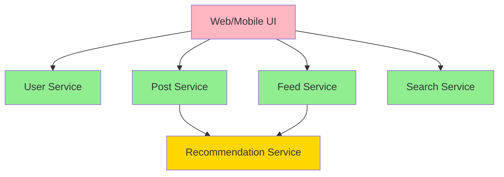

### 9.1 Trade-offs of Microservices

Dividing a complex piece of software into multiple services has several advantages:

- Each service can be **updated independently**, reducing coordination effort across teams.
- Each service can be **assigned the hardware it needs** (CPU-heavy vs memory-heavy vs GPU-heavy).
- Hiding implementation details behind an API means service owners can change internals without affecting clients.
- In terms of data storage, it is common for each service to have its own databases and not share them. Sharing would effectively make the database schema part of the service's API, which would be hard to change, and one service's queries could negatively impact another's performance.

But there are downsides:

- **Testing in development is complicated**, because you also need to run all dependent services.
- **Each service needs its own infrastructure** for deployment, scaling, log collection, monitoring, and on-call alerting. Orchestration frameworks such as **Kubernetes** have become popular because they provide a foundation for this infrastructure.
- **API evolution is hard**. Clients expect certain fields. Adding or removing fields can break clients, and failures are often discovered late in the deployment cycle. API description standards such as **OpenAPI** and **gRPC** help manage this; we discuss them further in Chapter 5.

The deepest truth about microservices is that they are **primarily a technical solution to a people problem**: allowing different teams to make progress independently without coordinating. This is valuable in a large company. In a small company with fewer teams, microservices are usually unnecessary overhead, and the simplest implementation is preferable [51].

### 9.2 Serverless and FaaS

**Serverless** (or **function as a service, FaaS**) is another approach to deploying services, in which infrastructure management is outsourced to a cloud vendor [32].

With VMs, you explicitly choose when to start or shut down an instance. With the serverless model, the cloud provider automatically allocates and frees hardware based on incoming requests [53]. Just as cloud storage replaced capacity planning with metered billing, serverless brings metered billing to code execution: you pay only for the time your application code is actually running.

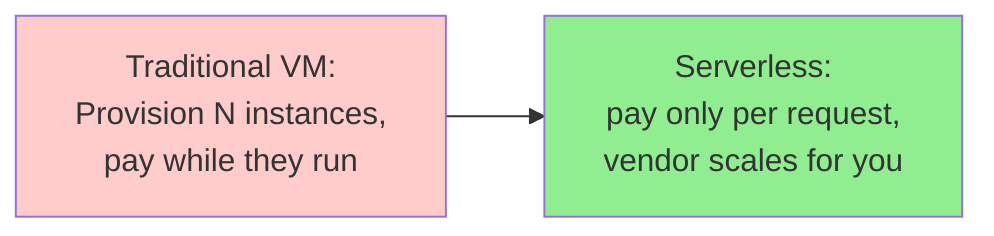

To offer these benefits, serverless providers impose limits: time limits on function execution, restricted runtime environments, and potentially slow cold-start times. The term "serverless" can also be misleading — each function execution still runs on a server, but a subsequent execution might run on a different one. Infrastructure services such as BigQuery and various Kafka offerings have adopted "serverless" terminology to signal that they autoscale and bill by usage rather than machine instances.

---

## 10. Cloud Computing Versus Supercomputing

Cloud computing is not the only way to build large-scale computing systems. An alternative is **high-performance computing (HPC)**, also known as **supercomputing**. There is some overlap, but HPC often has different priorities and uses different techniques than cloud computing and enterprise datacenter systems.

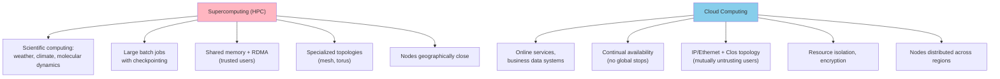

Key differences:

- **Workloads**: Supercomputers typically run computationally intensive scientific tasks — weather forecasting, climate modeling, molecular dynamics, complex optimization, partial differential equations. Cloud computing tends to serve online services and business data systems that need high availability.
- **Failure handling**: A supercomputer typically runs large batch jobs that **checkpoint** state to disk periodically. If a node fails, a common solution is to stop the entire cluster workload, repair the faulty node, and restart from the last checkpoint [54, 55]. With cloud services, stopping the entire cluster is undesirable because services must continually serve users.
- **Interconnect**: Supercomputer nodes often communicate through **shared memory and RDMA**, which support high bandwidth and low latency but assume a high level of trust among users [56]. Cloud networks use IP and Ethernet, arranged in **Clos topologies** to provide high bisection bandwidth [54, 57]. They also require stronger isolation (VMs, encryption, authentication) because the network and machines are shared by mutually untrusting organizations.
- **Topology**: Supercomputers often use specialized topologies (multidimensional meshes and toruses [58]) that yield better performance for HPC workloads with known communication patterns.
- **Geography**: Cloud nodes can be distributed across regions; supercomputers assume all nodes are close.

Large-scale analytical systems sometimes share characteristics with supercomputing, which is why knowing about these techniques is useful if you work in that area. However, this book is mostly concerned with services that need to be continually available.

---

## 11. Data Systems, Law, and Society

Data-systems architecture is shaped not only by technical goals and business requirements but also by the human needs of the organizations that data systems support. Increasingly, data-systems engineers recognize that serving their own business is not enough; we also have a responsibility toward society at large.

One particular concern is systems that store data about people and their behavior. Since 2018, the GDPR has given European residents greater control and legal rights over their personal data; similar privacy regulations have been adopted in many other jurisdictions (including the CCPA in California). Regulations around AI, such as the EU AI Act, impose further restrictions on how personal data may be used.

Even in areas not directly subject to regulation, there is increasing recognition of the effects computer systems have on people and society. Social media has changed how individuals consume news, which influences political opinions and may affect elections. Automated systems increasingly make decisions with profound consequences for individuals: who gets a loan or insurance, who gets invited to a job interview, who is suspected of a crime [59].

Everyone who works on such systems shares a responsibility for considering the ethical impact of their decisions and ensuring compliance with relevant laws. Not everyone needs to become an expert in law and ethics, but a basic awareness of legal and ethical principles is just as important as foundational knowledge in distributed systems.

### 11.1 How Law Is Reshaping System Design

Legal considerations are influencing the very foundations of data-system design [60]. For example:

- The GDPR grants individuals the **right to erasure** (the "right to be forgotten"). But many data systems rely on **immutable constructs** such as append-only logs. How do you erase data in the middle of a file that is supposed to be immutable? How do you handle erasure of data that has been incorporated into derived datasets (see "Systems of Record and Derived Data" above), such as training data for ML models? These questions create new engineering challenges.

We don't yet have clear guidelines on which particular technologies or architectures are GDPR-compliant. The regulation deliberately avoids mandating technologies, since these change quickly. Instead, it sets high-level principles subject to interpretation. There is no simple answer to "how do we comply?", but we will examine technologies through this lens in Chapter 14.

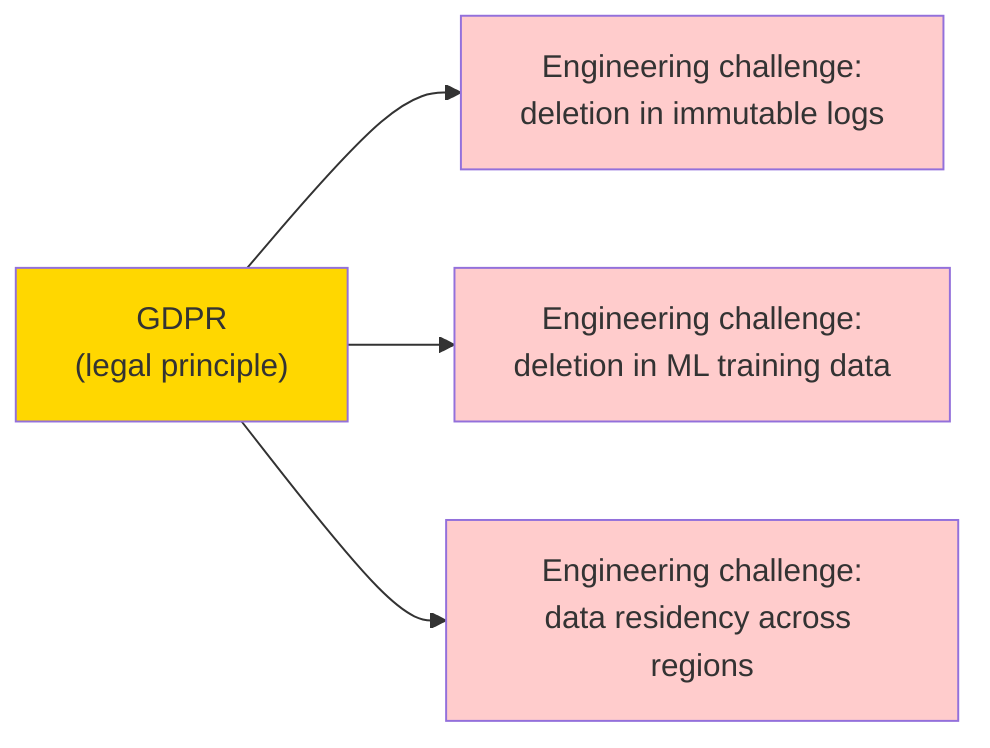

### 11.2 Data Minimization

We store data because we think its value exceeds the cost of storage. But the cost of storage extends beyond the S3 bill. The cost-benefit calculation should also account for:

- The risk of liability and reputational damage if data is leaked or compromised by adversaries.
- The risk of legal costs and fines if data storage and processing are found non-compliant [50].
- The risk that governments or police forces compel companies to hand over data. When data could reveal criminalized behaviors (homosexuality in several Middle Eastern and African countries, seeking an abortion in several US states), storing it creates real safety risks. Travel to an abortion clinic can be revealed by location data or even a log of IP addresses.

Once all risks are taken into account, it may be reasonable to conclude that **some data is simply not worth storing** and should therefore be deleted. This principle of **data minimization** (sometimes called **Datensparsamkeit** in German) runs counter to the "big data" philosophy of storing lots of data speculatively in case it turns out useful. Data minimization fits with the GDPR, which mandates that personal data may be collected only for a specified, explicit purpose; cannot later be used for any other purpose; and must not be kept longer than necessary [62].

### 11.3 Industry Compliance

Businesses have also taken notice of privacy and safety concerns:

- **Credit card companies** require payment processors to adhere to strict **PCI (Payment Card Industry)** standards. Processors undergo frequent third-party audits to verify continued compliance.
- **Software vendors** face increased scrutiny. Many buyers now require compliance with **SOC (Service Organization Control) Type 2** standards. As with PCI, vendors undergo third-party audits.

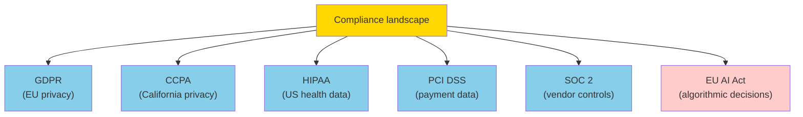

It is important to balance the needs of your business against the needs of the people whose data you collect and process. There is much more to this topic; Chapter 14 goes deeper into ethics and legal compliance, including the problems of bias and discrimination.

---

## 12. Summary

The theme of this chapter has been to understand **trade-offs**: to recognize that many questions do not have one right answer, but several possibilities each with their own pros and cons. We explored some of the most important choices that affect the architecture of data systems, and we introduced terminology used throughout the rest of the book.

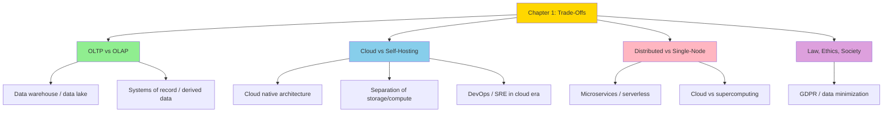

### 12.1 Key Takeaways

1. **OLTP vs OLAP**: Operational systems handle many small interactive reads and writes; analytical systems handle fewer, larger queries that aggregate across many records. Different access patterns justify different storage engines and often different databases.
2. **Data warehouses and data lakes**: Warehouses give analysts a SQL-friendly view of normalized data; lakes preserve raw data for diverse consumers (data scientists, ML pipelines, ad-hoc exploration).
3. **Systems of record vs derived data**: The system of record holds the canonical data; everything else is derived and can be reconstructed. This distinction clarifies data flow and helps you reason about consistency.
4. **Cloud vs self-hosting**: Cloud services trade operational control for elasticity and reduced operational toil. The right answer depends on workload variability, team skills, regulatory constraints, and strategic priorities.
5. **Cloud native architecture**: Storage and compute are disaggregated; object storage holds the durable bytes; compute instances are near-stateless; multitenancy is the norm.
6. **Distributed vs single-node**: Distributed systems give you scalability, fault tolerance, and geographic reach — at the cost of complexity, network failures, and hard debugging. Reach for them only when you genuinely need them.
7. **Microservices and serverless**: Both are technical answers to people and operational problems. Useful at scale, overkill for small teams.
8. **Law and ethics**: Data systems affect real people. GDPR, CCPA, the EU AI Act, and similar frameworks make legal compliance an architectural concern, not just a policy afterthought.

### 12.2 What Comes Next

- **Chapter 2** (Defining Nonfunctional Requirements) formalizes the metrics by which we judge data systems: reliability, scalability, maintainability, performance.
- **Chapter 3** (the first of the "data" chapters) goes deep on relational data models, schemas, and transactions.
- **Chapter 4** examines storage and retrieval in detail, including how OLTP and OLAP databases organize data on disk.
- **Chapter 9** returns to distributed systems with the rigorous treatment of failure modes and consensus.
- **Chapter 14** revisits ethics and legal compliance in depth.

Throughout the rest of the book, we will keep returning to the theme of this chapter: every data-systems decision involves trade-offs, and choosing wisely requires understanding both the technology and the human context in which it operates.

A useful frame: every architecture diagram is a hypothesis about which trade-offs matter most for your workload. As workloads change, the right architecture changes too. The discipline is in noticing when your hypothesis no longer holds and revising accordingly — not in defending the architecture you chose last quarter.

The rest of the book gives you the technical vocabulary to make those revisions: how to measure reliability, how to reason about consistency, how to choose storage and replication strategies, and how to assemble streaming and batch pipelines. But none of that technical machinery substitutes for the simple, ongoing question: *given what we know today, is this still the right shape for this system?*

---

### 12.3 A Mental Checklist for Chapter 1

Use this checklist when starting any new data-systems project:

1. **Who creates the data, and who reads it?** If the answer is "different teams with different priorities," plan for an operational/analytical split.
2. **Is your workload steady or bursty?** Bursty workloads favor cloud elasticity; steady workloads can be cheaper on-prem.
3. **Where does the canonical version of each fact live?** Every derived system must trace back to a system of record.
4. **Must data stay within a specific geography?** If yes, your distributed design is partly dictated by law, not just engineering.
5. **What is your rollback plan if a cloud vendor disappears?** Compatible APIs reduce lock-in; portability tests prove it.
6. **Are you solving a people problem or a technical problem with microservices?** If only the latter, you may not need them.
7. **What data could you delete today and never miss?** Apply data minimization early; deleting later is much harder.
8. **Where does the cost grow linearly with usage?** In a metered-billing cloud, that becomes a financial-planning question, not a procurement one.
9. **Who owns the schema?** If nobody does, schema drift will eventually break the analytics. Pick a steward.
10. **What is your blast radius if a region goes down?** Active-active multi-region is expensive; a tested failover runbook is often enough.

We will return to each of these questions in subsequent chapters, with concrete techniques for answering them. The order in which you discover the answers matters less than the discipline of asking the questions regularly. A good architecture is one that survives contact with the next quarter's reality; trade-off literacy is what gets you there.

If you are reading this book linearly, you may find it helpful to skim this checklist once now, return to it after each subsequent chapter, and ask yourself which items have become more concrete (and which have become more complicated) as your understanding of the technical material deepened. If an item has become *less* clear, that is usually a sign the chapter introduced nuance you had not previously considered — and that is exactly the kind of progress this book is designed to enable.

---

### 12.4 Further Reading by Topic

If you want to dig deeper into specific topics introduced in this chapter, the following threads are good starting points (full citations in the References section below):

- **OLTP vs OLAP**: Codd's original OLAP paper [5]; Stonebraker and Çetintemel's "One Size Fits All" [11] for the argument that specialized systems win at scale.
- **Data warehousing and lakes**: Chaudhuri and Dayal [7]; Hai et al. [15]; Fowler's "Data Lake" essay [16].
- **HTAP**: Özcan et al. [8]; Prout et al. on SingleStore [9]; Zhang et al.'s 2024 survey [10].
- **Cloud economics**: Hansson on leaving the cloud [21]; Badizadegan's "Use One Big Server" [22]; Cherkasky on (over-)paying for your datastore [36].
- **Cloud native architecture**: Verbitski et al. on Aurora [24]; Antonopoulos et al. on Socrates/SQL Server Hyperscale [25]; Vuppalapati et al. on Snowflake's disaggregated storage [26].
- **Distributed systems costs**: McSherry et al.'s "Scalability! But at What COST?" [45] is a classic.
- **Microservices**: Newman's *Building Microservices* [51] and Richardson's InfoQ piece [52].
- **Serverless**: Jonas et al.'s Berkeley view [32]; Hellerstein et al.'s "Serverless Computing: One Step Forward, Two Steps Back" [44].
- **Ethics, GDPR, data minimization**: O'Neil's *Weapons of Math Destruction* [59]; Shastri et al. on GDPR's impact on database systems [60]; Fowler on Datensparsamkeit [61].

Many of these references are blog posts and conference papers rather than textbooks; the field evolves faster than any book can capture, and primary sources are often the most reliable way to stay current.

---

## References (selected, from chapter)

1. Kouzes, R. T., et al. "The Changing Paradigm of Data-Intensive Computing." *IEEE Computer*, 42(1), Jan 2009.
2. Kleppmann, M., et al. "Local-First Software: You Own Your Data, in Spite of the Cloud." *Onward!*, 2019.
3. Reis, J. & Housley, M. *Fundamentals of Data Engineering*. O'Reilly, 2022.
4. Machado, R. P. & Russa, H. *Analytics Engineering with SQL and dbt*. O'Reilly, 2023.
5. Codd, E. F., et al. "Providing OLAP to User-Analysts: An IT Mandate." 1993.
6. Soman, C. & Pawar, N. "Comparing Three Real-Time OLAP Databases." startree.ai, 2023.
7. Chaudhuri, S. & Dayal, U. "An Overview of Data Warehousing and OLAP Technology." *ACM SIGMOD Record*, 1997.
8. Özcan, F., Tian, Y., Tözün, P. "Hybrid Transactional/Analytical Processing: A Survey." *SIGMOD*, 2017.
9. Prout, A., et al. "Cloud-Native Transactions and Analytics in SingleStore." *SIGMOD*, 2022.
10. Zhang, C., et al. "HTAP Databases: A Survey." *IEEE TKDE*, 2024.
11. Stonebraker, M. & Çetintemel, U. "'One Size Fits All': An Idea Whose Time Has Come and Gone." *ICDE*, 2005.
12. Cohen, J., et al. "MAD Skills: New Analysis Practices for Big Data." *PVLDB*, 2009.
13. Olteanu, D. "The Relational Data Borg Is Learning." *PVLDB*, 2020.
14. Bornstein, M., Casado, M., Li, J. "Emerging Architectures for Modern Data Infrastructure." future.a16z.com, 2020.
15. Hai, R., et al. "Data Lakes: A Survey of Functions and Systems." *IEEE TKDE*, 2023.
16. Fowler, M. "Data Lake." martinfowler.com, 2015.
17. Johnson, B. & Adler, J. "The Sushi Principle: Raw Data Is Better." Strata+Hadoop World, 2015.
18. DataKitchen, Inc. "The DataOps Manifesto." dataopsmanifesto.org, 2017.
19. Manohar, T. "What Is Reverse ETL." hightouch.io, 2021.
20. Fournier, C. "Why Is It So Hard to Decide to Buy?" skamille.medium.com, 2021.
21. Hansson, D. H. "Why We're Leaving the Cloud." world.hey.com, 2022.
22. Badizadegan, N. "Use One Big Server." specbranch.com, 2022.
23. Yegge, S. "Dear Google Cloud: Your Deprecation Policy Is Killing You." 2020.
24. Verbitski, A., et al. "Amazon Aurora: Design Considerations." *SIGMOD*, 2017.
25. Antonopoulos, P., et al. "Socrates: The New SQL Server in the Cloud." *SIGMOD*, 2019.
26. Vuppalapati, M., et al. "Building an Elastic Query Engine on Disaggregated Storage." *NSDI*, 2020.
27. Van Wiggeren, N. "The Real Failure Rate of EBS." planetscale.com, 2025.
28. Breck, C. "Predicting the Future of Distributed Systems." blog.colinbreck.com, 2024.
29. Shapira, G. "Compute-Storage Separation Explained." thenile.dev, 2023.
30. Murthy, R. & Goindi, G. "AlloyDB for PostgreSQL Under the Hood." cloud.google.com, 2022.
31. Vanlightly, J. "The Architecture of Serverless Data Systems." 2023.
32. Jonas, E., et al. "Cloud Programming Simplified: A Berkeley View on Serverless Computing." arXiv:1902.03383, 2019.
33. Beyer, B., et al. *Site Reliability Engineering*. O'Reilly, 2016.
34. Limoncelli, T. "The Time I Stole $10,000 from Bell Labs." *ACM Queue*, 2020.
35. Majors, C. "The Future of Ops Jobs." acloudguru.com, 2020.
36. Cherkasky, B. "(Over)Pay as You Go for Your Datastore." medium.com, 2021.
37. Kushchi, S. "Serverless Doesn't Mean DevOpsLess or NoOps." thenewstack.io, 2023.
38. Bernhardsson, E. "Storm in the Stratosphere." erikbern.com, 2021.
39. Stancil, B. "The Data OS." benn.substack.com, 2021.
40. Korolov, M. "Data Residency Laws Pushing Companies Toward Residency as a Service." csoonline.com, 2022.
41. Borenstein, S. "Can Data Centers Flex Their Power Demand?" 2025.
42. Acun, B., et al. "Carbon Dependencies in Datacenter Design and Management." *ACM SIGENERGY*, 2023.
43. Nath, K. "These Are the Numbers Every Computer Engineer Should Know." freecodecamp.org, 2019.
44. Hellerstein, J. M., et al. "Serverless Computing: One Step Forward, Two Steps Back." arXiv:1812.03651, 2018.
45. McSherry, F., Isard, M., Murray, D. G. "Scalability! But at What COST?" *HotOS*, 2015.
46. Sridharan, C. *Distributed Systems Observability*. O'Reilly, 2018.
47. Majors, C. "Observability—A 3-Year Retrospective." thenewstack.io, 2019.
48. Sigelman, B. H., et al. "Dapper, a Large-Scale Distributed Systems Tracing Infrastructure." Google, 2010.
49. Laigner, R., et al. "Data Management in Microservices." *PVLDB*, 2021.
50. Tigani, J. "Big Data Is Dead." motherduck.com, 2023.
51. Newman, S. *Building Microservices*, 2nd ed. O'Reilly, 2021.
52. Richardson, C. "Microservices: Decomposing Applications for Deployability and Scalability." infoq.com, 2014.
53. Shahrad, M., et al. "Serverless in the Wild." *USENIX ATC*, 2020.
54. Barroso, L. A., Hölzle, U., Ranganathan, P. *The Datacenter as a Computer*, 3rd ed. Springer, 2019.
55. Fiala, D., et al. "Detection and Correction of Silent Data Corruption for Large-Scale HPC." *SC*, 2012.
56. Simpson, A. K., et al. "Securing RDMA for High-Performance Datacenter Storage Systems." *HotCloud*, 2020.
57. Singh, A., et al. "Jupiter Rising: A Decade of Clos Topologies." *SIGCOMM*, 2015.
58. Lockwood, G. K. "Hadoop's Uncomfortable Fit in HPC." 2014.
59. O'Neil, C. *Weapons of Math Destruction*. Crown, 2016.
60. Shastri, S., et al. "Understanding and Benchmarking the Impact of GDPR on Database Systems." *PVLDB*, 2020.
61. Fowler, M. "Datensparsamkeit." martinfowler.com, 2013.
62. "Regulation (EU) 2016/679 (GDPR)." *Official Journal of the European Union*, 2016.

---

## Notes on This Synthesis

This chapter note is a structured synthesis of the published 2nd-edition Chapter 1, intended for readers who want a navigable, diagram-rich companion while working through the printed text. Diagrams and code examples were created specifically for this synthesis and are not part of the original book. Specific product names (Snowflake, BigQuery, Aurora, ClickHouse, DuckDB, SQLite, KùzuDB, etc.) are mentioned as in the original text to illustrate the points being made; inclusion here does not imply endorsement. The example traffic numbers (500M posts/day, 5,800 posts/sec average, 150,000 posts/sec peak) are presented as a representative illustration of a large social-network workload, not as figures drawn from any specific company's published benchmarks. Readers are encouraged to verify any specific performance claim against the primary sources cited in the References section above before relying on it for production decisions.
