# Chapter 2: Defining Nonfunctional Requirements

## TL;DR

- Performance, reliability, scalability, and maintainability are the four nonfunctional requirements that recur throughout the book; this chapter defines them using a Twitter-style home-timeline case study.
- Performance is described by **throughput** (work per unit time) and **response-time** distributions; **percentiles** (p50/p95/p99/p999) are preferred over averages for understanding user experience.
- **Tail latency amplification**: a small fraction of slow backend calls dominates end-user latency when calls run in parallel. Design for p99/p999, not just the median.
- **Reliability** means "continuing to work correctly, even when things go wrong." Distinguish **faults** (one component fails) from **failures** (system stops serving users). Defend against retry storms and metastable failures with exponential backoff with jitter, circuit breakers, load shedding, and backpressure.
- **Scalability** is multidimensional — say along which axis you can grow (CPU, memory, disk, network, geography, request rate, data volume). **Shared-nothing** architectures scale most linearly but pay distributed-systems complexity. **Maintainability** is mostly about the organization: operability, simplicity, evolvability, and blameless postmortems.

## Introduction

The terminology introduced in this chapter will also be useful in the following chapters, when we go into the details of how data-intensive systems are implemented. However, abstract definitions can be quite dry; to make the ideas more concrete, we will start this chapter with a case study of a social networking service, which will provide practical examples of performance and scalability.

Throughout this chapter we will examine several examples of **nonfunctional requirements**:

1. **Performance** — measurable behavior under load (latency, throughput, percentiles)
2. **Reliability** — continuing to work correctly when things go wrong
3. **Scalability** — coping with growth in load, data, or users
4. **Maintainability** — making the system operable, simple, and evolvable over time

These topics recur throughout the rest of the book. The aim is not just to define terms, but to build the intuition for choosing one design over another in concrete engineering situations.

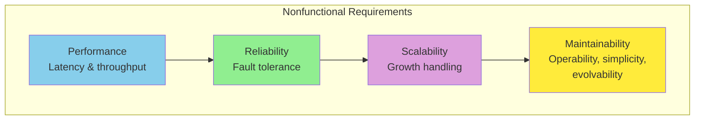

---

## Case Study: Social Network Home Timelines

Imagine we have been given the task of implementing a social network in the style of X (formerly Twitter), where users can post messages and follow other users. This will be a huge simplification of how such a service actually works, but it will help illustrate some of the issues that arise in large-scale systems.

**Workload assumptions**:

| Metric | Average | Peak |
| --- | --- | --- |
| Posts per day | 500 million | — |
| Posts per second | 5,800 | 150,000 |
| Followers per user | 200 | tens of thousands |
| Follows per user | 200 | varies widely |
| Online users | 10 million | — |

> Most users have only a handful of followers, but a few celebrities, such as Barack Obama, have over 100 million followers. This **long tail** is what makes the design interesting.

### Representing Users, Posts, and Follows

We keep all the data in a relational database, with one table each for users, posts, and follow relationships.

```sql
-- Users: identity and profile data
CREATE TABLE users (
    id           BIGINT PRIMARY KEY,
    handle       TEXT NOT NULL UNIQUE,
    display_name TEXT NOT NULL,
    created_at   TIMESTAMPTZ NOT NULL DEFAULT now()
);

-- Posts: each row is one message authored by a user.
CREATE TABLE posts (
    id         BIGINT PRIMARY KEY,
    sender_id  BIGINT NOT NULL REFERENCES users(id),
    body       TEXT NOT NULL,
    timestamp  TIMESTAMPTZ NOT NULL DEFAULT now()
);
CREATE INDEX posts_sender_ts_idx ON posts (sender_id, timestamp DESC);

-- Follows: directed edge from follower to followee.
-- A row exists for each (follower, followee) pair.
CREATE TABLE follows (
    follower_id BIGINT NOT NULL REFERENCES users(id),
    followee_id BIGINT NOT NULL REFERENCES users(id),
    PRIMARY KEY (follower_id, followee_id)
);
CREATE INDEX follows_followee_idx ON follows (followee_id);
```

Notice the secondary indexes: `(sender_id, timestamp DESC)` makes "recent posts by a user" cheap, and `(followee_id)` makes the fan-out lookup — "who follows this person?" — cheap. The shape of the indexes is determined by the queries we plan to run.

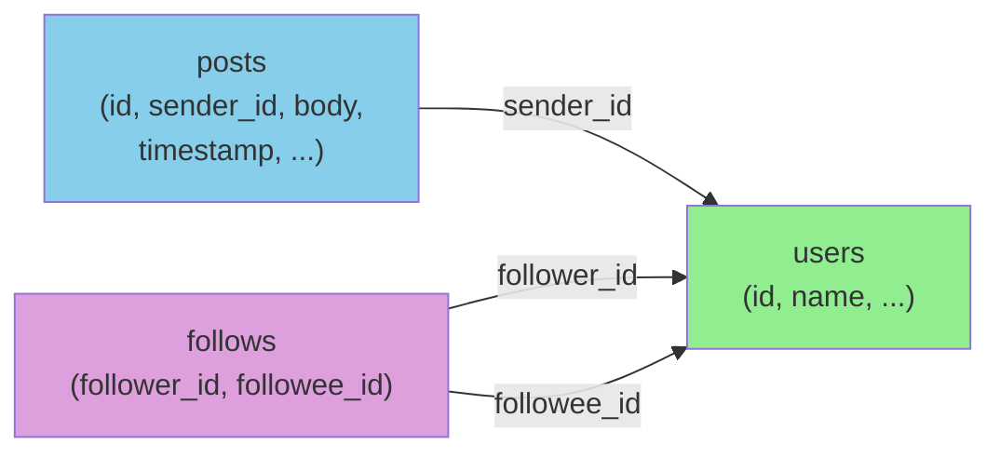

Let's say the main read operation that our social network must support is the **home timeline**, which displays recent posts by people the user is following (for simplicity we will ignore ads, suggested posts from people they are not following, and other extensions). We could write the following SQL query to get the home timeline for a particular user:

```sql
SELECT posts.*, users.* FROM posts
JOIN follows ON posts.sender_id = follows.followee_id
JOIN users   ON posts.sender_id = users.id
WHERE follows.follower_id = current_user
ORDER BY posts.timestamp DESC
LIMIT 1000
```

To execute this query, the database will use the `follows` table to find everybody who `current_user` is following, look up recent posts by those users, and sort them by timestamp to get the most recent 1,000 posts by any of the followed users.

Posts are supposed to be timely, so let's assume that after somebody makes a post, we want their followers to be able to see it within five seconds. One approach is for the user's client to repeat the preceding query every five seconds while the user is online (this is known as **polling**). If we assume that 10 million users are online and logged in at the same time, that would mean running the query 2 million times per second. Even if we were to poll less frequently, this is a lot.

This query is also quite expensive: if a user is following 200 people, the query needs to fetch a list of recent posts by each of those 200 people and merge those lists. **Two million timeline queries per second times 200 followed accounts makes 400 million lookups per second** — a huge number. And that's the average case. Some users follow tens of thousands of accounts; for them, this query is very expensive to execute and difficult to make fast.

#### A quick poll-vs-push comparison

| Property | Polling (read-side) | Pushing / fan-out on write |
| --- | --- | --- |
| Cost per write | Zero | Proportional to fan-out factor |
| Cost per read | High (full query) | Low (cache lookup) |
| Freshness | Limited by poll interval | Near-real-time |
| Worst case | Users following tens of thousands | Celebrity with millions of followers |
| Best fit for | Low write rate, simple system | High write rate, latency-sensitive reads |

### Materializing and Updating Timelines

How can we do better? First, instead of polling, it would be better if the server actively pushed new posts to any followers who are currently online. Second, we should precompute the results of the query so that a user's request for their home timeline can be served from a cache.

Imagine that for each user, we store a data structure containing their home timeline (i.e., the recent posts by people they are following). Every time a user makes a post, we look up all their followers and insert that post into the home timeline of each follower — like delivering a message to a mailbox. Now when a user logs in, we can simply give them this precomputed home timeline. Moreover, to receive a notification about any new posts on their timeline, the user's client simply needs to subscribe to the stream of posts being added to their home timeline.

The downside of this approach is that we now need to do more work every time a user makes a post, because the home timelines are derived data that needs to be updated. When one initial request results in several downstream requests being carried out, we use the term **fan-out** to describe the factor by which the number of requests increases.

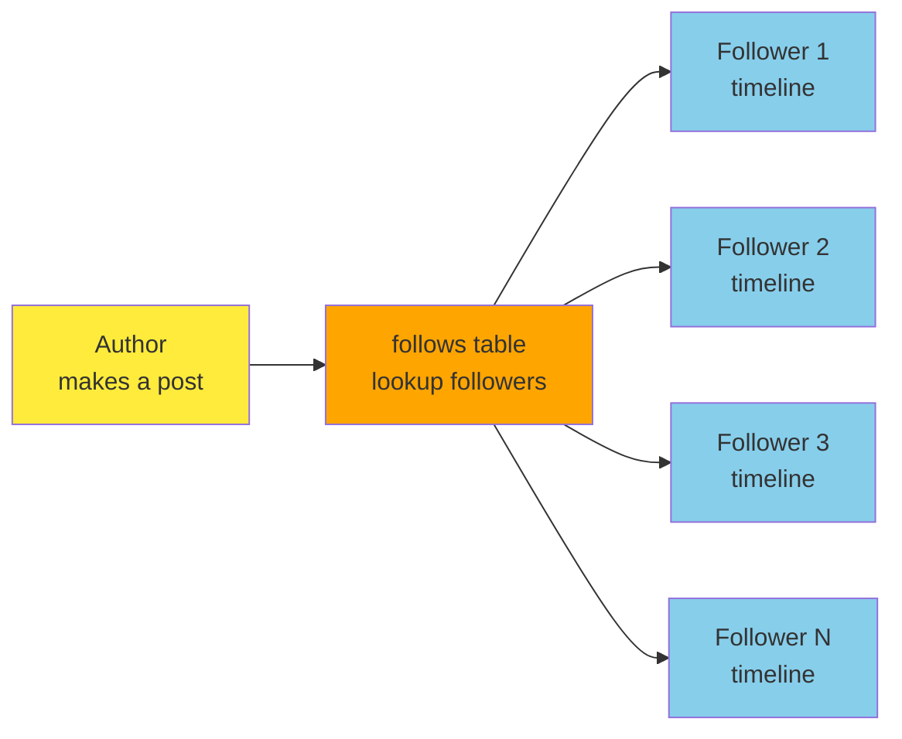

At a rate of 5,800 posts per second, if the average post reaches 200 followers (i.e., a fan-out factor of 200), we will need to do just over **1 million home timeline writes per second**. This is a lot, but it's still a significant saving compared to the 400 million per-sender post lookups per second that we would otherwise have to do.

If the rate of posts spikes because of a special event, we don't have to do the timeline deliveries immediately — we can enqueue them and accept that it will temporarily take a bit longer for posts to show up in followers' timelines. Even during such load spikes, timelines remain fast to load, since we simply serve them from a cache.

This process of precomputing and updating the results of a query is called **materialization**, and the timeline cache is an example of a **materialized view** (a concept we will discuss further in later chapters). The materialized view speeds up reads, but in return we have to do more work on writes. The cost of writes for most users is modest, but a social network also has to consider some extreme cases:

- If a user is following a very large number of accounts, and those accounts post a lot, that user will have a high rate of writes to their materialized timeline. However, that user is not likely reading all the posts in their timeline, so it's OK to simply drop some of their timeline writes and show the user only a sample of the posts from the accounts they're following.
- When a celebrity account with a very large number of followers makes a post, we have to do a lot of work to insert that post into the home timelines of each of their millions of followers. In this case, dropping some of those writes is not OK. One way of solving this problem is to handle celebrity posts separately from everyone else's posts: we can save ourselves the effort of adding celebrity posts to millions of timelines by storing them separately and merging them with the materialized timeline when it is read. Despite such optimizations, handling celebrities on a social network can require a lot of infrastructure.

**Example: Twitter's scaling challenge** — When the site was just starting out, the home timeline was computed on read using the SQL query shown earlier. As load grew, this became untenable: even with aggressive caching, the SQL join plus merge-sort over potentially thousands of followed users was too slow at p99. Twitter moved to a hybrid: most posts are fan-out-on-write into per-user timeline caches, while posts from celebrities are merged in at read time. This is the same shape as the case study in this chapter.

A second, less-appreciated reason fan-out-on-write often wins is **predictable cost at read time**: serving a home timeline becomes a single cache read regardless of how many people the user follows, which makes p99 latency easy to control. Compute-on-read has the opposite property — the cost grows with the user's follow graph, and the user with 30,000 follows becomes a "hot customer" whose slow requests ruin everyone else's percentiles. When in doubt, push cost to writes (where you have many small, parallel tasks) rather than reads (where one slow request is one user-visible failure).

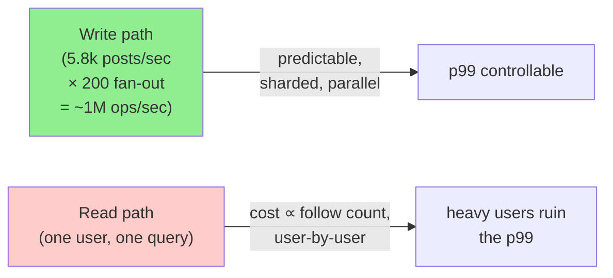

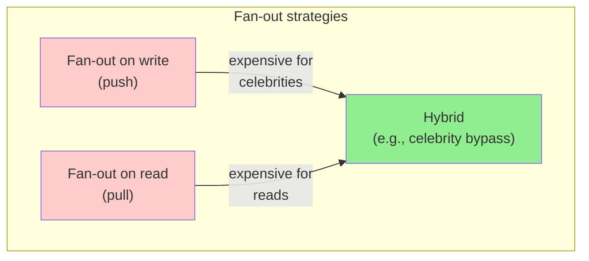

**Key takeaway**: The choice between computing on read vs. computing on write is a recurring theme in data systems. There is no universal answer; it depends on the read/write ratio, latency budget, and the shape of the workload (including the long tail).

### Throughput Metrics, in Practice

The book introduces two metric families — **response time** and **throughput** — and they show up in different places depending on what you are measuring:

- **QPS / RPS** (queries/requests per second): the most common unit for a service endpoint.
- **IOPS** (I/O operations per second): for storage subsystems, especially disks.
- **Bandwidth** (MB/s, Gb/s): for systems dominated by payload size, like analytics pipelines or video.
- **Fan-out factor**: how many downstream requests a single user-facing request triggers (e.g., 200 follower-timeline updates per post).
- **Peak vs. average**: the social network averages 5,800 posts/sec but spikes to 150,000. Capacity planning must be done against the peak (or the headroom you can tolerate below the peak), not the average.

---

## Describing Performance

Most discussions of software performance consider two main types of metric:

- **Response time**: The elapsed time from the moment when a user makes a request until they receive the requested answer. The unit of measurement is seconds (or milliseconds, or microseconds).
- **Throughput**: The number of requests per second, or the data volume per second, that the system is processing. For a given allocation of hardware resources, there is a maximum throughput that can be handled. The unit of measurement is "somethings per second."

In the social network case study, "posts per second" and "timeline writes per second" are throughput metrics, whereas "time it takes to load the home timeline" and "time until a post is delivered to followers" are response time metrics.

Throughput and response time are often related. The service has a low response time when request throughput is low, but response time increases as load increases. This is because of **queueing**: when a request arrives on a highly loaded system, the CPU is likely already in the process of handling an earlier request, and therefore the incoming request needs to wait until the earlier request has been completed. As throughput approaches the maximum that the hardware can handle, queueing delays increase sharply.

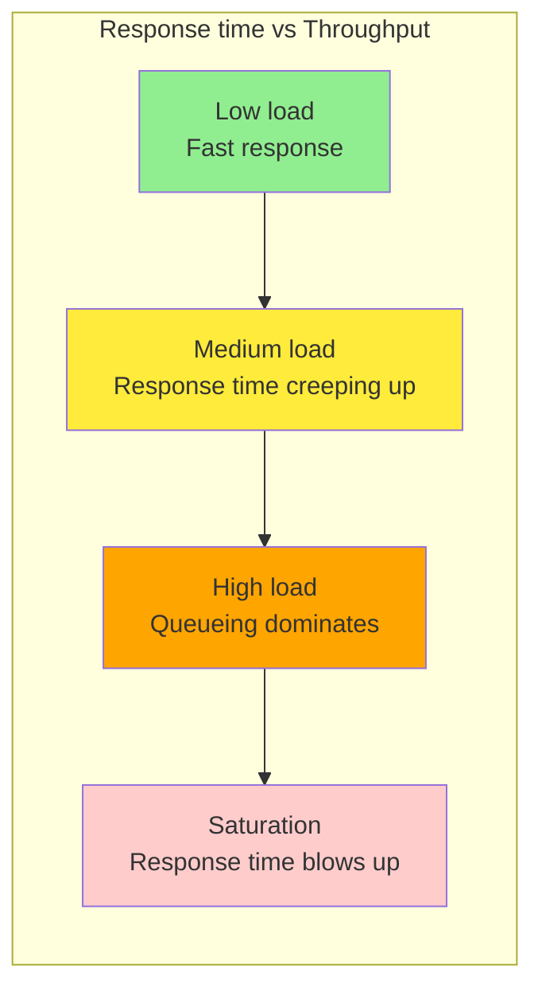

### When an Overloaded System Won't Recover

If a system is close to overload, with throughput pushed close to the limit, it can sometimes enter a vicious cycle where it becomes less efficient and hence even more overloaded. For example, if a long queue of requests is waiting to be handled, response times may increase so much that clients time out and resend their requests. This causes the rate of requests to increase even further, making the problem worse — a **retry storm**. Even when the load is reduced again, such a system may remain in an overloaded state until it is rebooted or otherwise reset. This phenomenon is called a **metastable failure**, and it can cause serious outages in production systems.

The combination of three ingredients is what makes a system **metastable** rather than merely overloaded:

1. A positive feedback loop (e.g., retries on timeout increasing load)
2. A cost asymmetry where the overloaded state is more expensive per request than the healthy state (e.g., extra GC, context switches, lock contention)
3. Lack of automatic reset back to the healthy state when the external load subsides

A real-world recipe for metastability: an SLO breach causes clients to retry → request rate doubles → average response time grows → more clients hit their timeouts → more retries. The system stabilizes not because the load dropped, but because so many clients gave up that the surviving load is small enough to be served by the now-degraded fleet. Once it tips, it does not tip back.

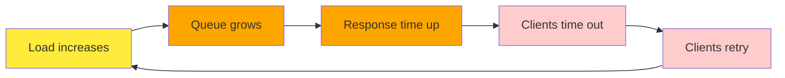

To avoid retries overloading a service, you can:

- Increase and randomize the time between successive retries on the client side (**exponential backoff** with jitter)
- Temporarily stop sending requests to a service that has returned errors or timed out recently (using a **circuit breaker** or **token bucket** algorithm)
- Server-side: detect when it is approaching overload and start proactively rejecting requests (**load shedding**)
- Server-side: send back responses asking clients to slow down (**backpressure**)
- Choose queueing and load-balancing algorithms with care (e.g., least-loaded, not just round-robin)

In terms of performance metrics, the response time is usually what users care about the most, whereas the throughput determines the required computing resources (e.g., how many servers you need) and hence the cost of serving a particular workload. If throughput is likely to increase beyond the current hardware's capability, the capacity needs to be expanded; a system is said to be **scalable** if its maximum throughput can be significantly increased by adding computing resources.

### Latency and Response Time

"Latency" and "response time" are sometimes used interchangeably. The sequence diagram below shows the specific way this book uses these and related terms.

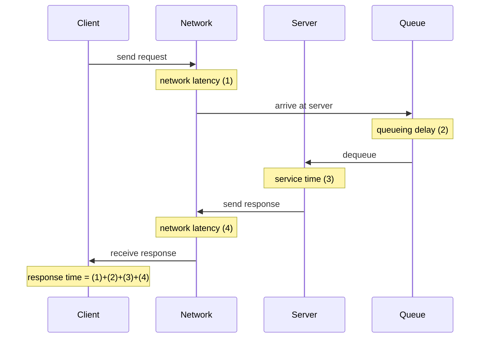

The response time can vary significantly from one request to the next, even if you keep making the same request over and over again. Many factors can add random delays — for example, a context switch to a background process, the loss of a network packet and TCP retransmission, a garbage collection pause, a page fault forcing a read from disk, or mechanical vibrations in the server rack. Variation in network delay is also known as **jitter**.

Queueing delays often account for a large part of the variability in response times. As a server can process only a small number of things in parallel (limited, for example, by its number of CPU cores), it takes only a small number of slow requests to hold up the processing of subsequent requests — an effect known as **head-of-line blocking**. Even if those subsequent requests have fast service times, the client will see a slow overall response time due to the time waiting for the prior request to complete. The queueing delay is not part of the service time, and for this reason it is important to measure response times on the client side.

### Average, Median, and Percentiles

Because the response time varies from one request to the next, we need to think of it not as a single number, but as a distribution of values that we can measure. Most requests are reasonably fast, but occasional outliers take much longer.

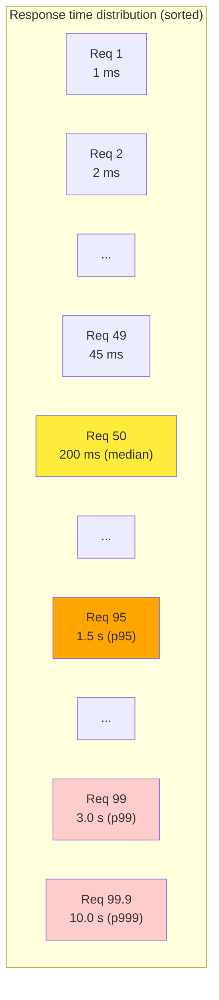

It's common to report the **average response time** of a service (technically, the arithmetic mean, which you find by summing all the response times and dividing by the number of requests). The mean response time is useful for estimating throughput limits. However, the mean is not a very good metric if you want to know your "typical" response time, because it doesn't tell you how many users actually experienced that delay.

Usually it's better to use **percentiles**. If you take your list of response times and sort it from fastest to slowest:

- The **median** is the halfway point — for example, if your median response time is 200 ms, that means half your requests return in less than 200 milliseconds (ms), and half your requests take longer. This makes the median a good metric if you want to know how long users typically have to wait. The median is also known as the 50th percentile, sometimes abbreviated as **p50**.
- To figure out how bad your outliers are, you can look at higher percentiles: the 95th, 99th, and 99.9th percentiles are common (abbreviated **p95**, **p99**, and **p999**). For example, if the 95th percentile response time is 1.5 seconds, that means 95 out of 100 requests take less than 1.5 seconds, and 5 out of 100 requests take 1.5 seconds or more.

High response-time percentiles, also known as **tail latencies**, are important because they directly affect users' experience of the service. For example, **Amazon describes response time requirements for internal services in terms of the 99.9th percentile**, even though this affects only 1 in 1,000 requests. This is because the customers with the slowest requests are often those who have the most data on their accounts, as they have made many purchases — that is, they're the most valuable customers. It's important to keep those customers happy by ensuring the website is fast for them.

Optimizing the 99.99th percentile (the slowest 1 in 10,000 requests) was deemed too expensive and found to not yield enough benefit for Amazon's purposes. Reducing response times at very high percentiles is difficult because they are easily affected by random events outside of your control, and the benefits are diminishing.

### The User Impact of Response Times

It seems obvious that a fast service is better for users than a slow service. However, it is surprisingly difficult to get hold of reliable data to quantify the effect that latency has on user behavior.

Some often-cited statistics are unreliable. In 2006, for example, Google reported that a slowdown in search results from 400 ms to 900 ms was associated with a 20% drop in traffic and revenue. However, another Google study from 2009 reported that a 400 ms increase in latency resulted in only 0.6% fewer searches per day, and in the same year Bing found that a two-second increase in load time reduced ad revenue by 4.3%. Newer data from these companies appears not to be publicly available.

A more recent Akamai study claims that a 100 ms increase in response time reduced the conversion rate of ecommerce sites by up to 7%; on closer inspection, though, the same study reveals that very fast page load times are also correlated with lower conversion rates! This seemingly paradoxical result is explained by the fact that the pages that load fastest are often those that have no useful content (e.g., 404 error pages). However, since the study makes no effort to separate the effects of page content from the effects of load time, its results are probably not meaningful.

A study by Yahoo conducted the following year compared click-through rates on fast-loading versus slow-loading search results, controlling for quality of search results. It reports 20%–30% more clicks on fast searches when the difference between fast and slow responses is 1.25 seconds or more.

### Use of Response Time Metrics

High percentiles are especially important in **backend services that are called multiple times as part of serving a single end-user request**. Even if you make the calls in parallel, the request still needs to wait for the slowest of the parallel calls to complete. It takes just one slow call to make the entire end-user request slow. Even if only a small percentage of backend calls are slow, the chance of getting a slow call increases if an end-user request requires multiple backend calls, so a higher proportion of such end-user requests end up being slow — an effect known as **tail latency amplification**.

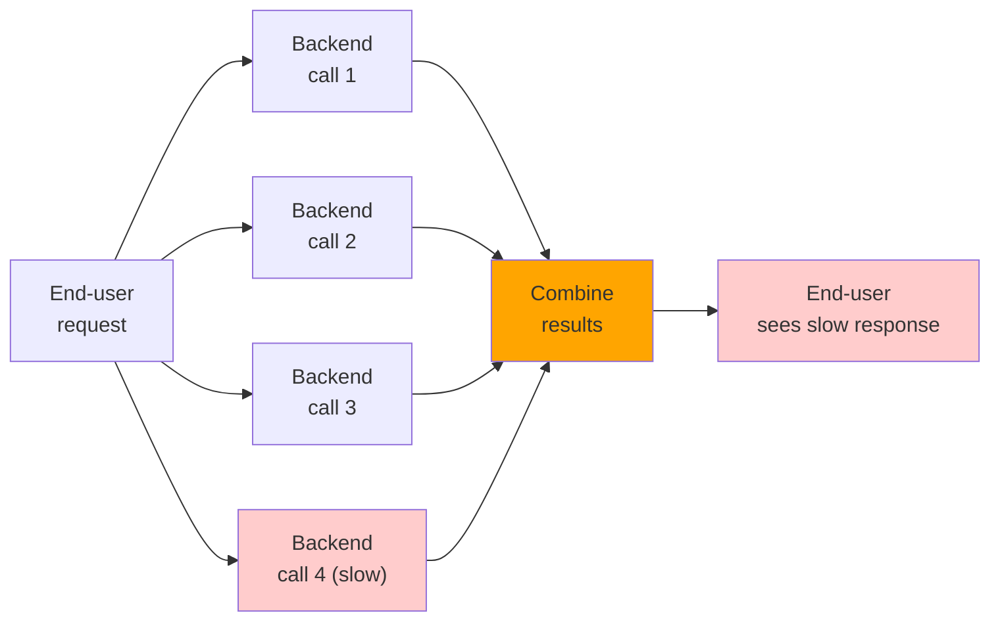

Percentiles are often used in **service level objectives (SLOs)** and **service level agreements (SLAs)** as ways of defining the expected performance and availability of a service. For example, an SLO may set a target for a service to have a median response time of less than 200 ms and a 99th percentile under 1 second, and a target that at least 99.9% of valid requests result in non-error responses. An SLA is a contract that specifies what happens if the SLO is not met (e.g., customers may be entitled to a refund). That's the basic idea, at least; in practice, defining good availability metrics for SLOs and SLAs is not straightforward.

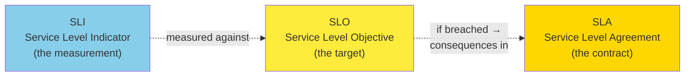

A useful mental model:

- **SLI** is what you measure (e.g., "ratio of successful requests in a 30-day window" or "p99 latency for `POST /timeline`").
- **SLO** is the target value of that measurement (e.g., "99.9% success over 30 days", "p99 latency < 1 s").
- **SLA** is what happens if you miss the SLO (e.g., service credits). Not every SLO has an SLA behind it; many internal SLOs are aspirational.

### Computing Percentiles

If you want to add response time percentiles to the monitoring dashboards for your services, you need to efficiently calculate them on an ongoing basis. For example, you may want to keep a rolling window of response times for requests in the last 10 minutes. Every minute, you calculate the median and various percentiles over the values in that window and plot those metrics on a graph.

The simplest implementation is to keep a list of response times for all requests within the time window and sort that list every minute. If that is too inefficient for you, there are algorithms that can calculate a good approximation of percentiles at minimal CPU and memory cost. Open source percentile estimation libraries include **HdrHistogram**, **t-digest**, **OpenHistogram** (Circllhist), and **DDSketch**.

> **Beware** that averaging percentiles (e.g., to reduce the time resolution or to combine data from several machines) is mathematically meaningless. The right way of aggregating response time data is to add the histograms.

#### Patterns in code

The following short examples illustrate the patterns discussed above.

**Computing response-time percentiles (NumPy):**

The following example shows how to compute the mean, median, p95, p99, and p999 of a synthetic response-time distribution using NumPy. It also demonstrates the pitfall of averaging percentiles.

```python
import numpy as np

# A realistic-ish response-time distribution:
# Most requests are fast (~50 ms), with a long tail.
rng = np.random.default_rng(seed=42)
n = 100_000
fast = rng.normal(loc=50.0, scale=10.0, size=n)            # 100k ~N(50, 10) ms
outliers = rng.exponential(scale=500.0, size=1_000)         # 1k rare, very slow
response_times_ms = np.concatenate([fast, outliers])

def summarize(label: str, arr: np.ndarray) -> None:
    print(f"--- {label} ---")
    print(f"  mean : {arr.mean():8.2f} ms")
    print(f"  p50  : {np.percentile(arr, 50):8.2f} ms")
    print(f"  p95  : {np.percentile(arr, 95):8.2f} ms")
    print(f"  p99  : {np.percentile(arr, 99):8.2f} ms")
    print(f"  p999 : {np.percentile(arr, 99.9):8.2f} ms")

summarize("Whole distribution", response_times_ms)

# Anti-pattern: averaging percentiles from two shards.
shard_a = response_times_ms[: n // 2]
shard_b = response_times_ms[n // 2 :]

p99_a = np.percentile(shard_a, 99)
p99_b = np.percentile(shard_b, 99)
print(f"\nshard A p99 = {p99_a:.2f} ms, shard B p99 = {p99_b:.2f} ms")
print(f"naive avg of p99 = {(p99_a + p99_b) / 2:.2f} ms  <-- misleading")
print(f"true combined p99 = {np.percentile(response_times_ms, 99):.2f} ms")
```

The two shards look healthy in isolation (each has its own p99), but naively averaging them gives a number that does not correspond to any percentile of the actual combined workload. The right way to combine is to merge the underlying **histograms**, not to average the summary statistics.

**Estimating percentiles with HdrHistogram:**

Sketch of how HdrHistogram is used in practice (real API; see the library docs for details).

```python
from hdrh.histogram import HdrHistogram

# 1 == lowest discernible value, 100_000_000 == highest value (in ms)
# 3 == number of significant digits (so 0.1% precision)
hist = HdrHistogram(1, 100_000_000, 3)

# Record some observations (would normally come from your service).
samples_ms = [42, 55, 60, 80, 95, 110, 130, 200, 1500, 3500]
for r in samples_ms:
    hist.record_value(r)

# Cheap percentile queries on a possibly enormous stream of values.
print(f"p50  : {hist.get_value_at_percentile(50.0)} ms")
print(f"p95  : {hist.get_value_at_percentile(95.0)} ms")
print(f"p99  : {hist.get_value_at_percentile(99.0)} ms")
print(f"p999 : {hist.get_value_at_percentile(99.9)} ms")

# Percentiles can also be merged across machines, unlike naive averaging.
```

HdrHistogram supports merging two histograms, which lets you aggregate percentile data from multiple machines without losing accuracy. This is the key insight behind the book's warning about averaging percentiles.

**Exponential backoff with jitter:**

Once you have response-time metrics, you can act on them. A common pattern when a downstream service is slow is to **back off** the client. The retry storm discussed earlier happens when naive clients hammer a struggling service; adding jitter to exponential backoff breaks the synchrony.

```python
import random
import time
from typing import Callable, TypeVar

T = TypeVar("T")

def with_retries(
    operation: Callable[[], T],
    *,
    max_attempts: int = 6,
    base_delay_s: float = 0.1,
    max_delay_s: float = 30.0,
) -> T:
    """Call `operation` with exponential backoff and full jitter.

    Full jitter (random.uniform(0, delay)) is preferred over additive jitter
    because it gives better spread across many clients.
    """
    last_exc: Exception | None = None
    for attempt in range(1, max_attempts + 1):
        try:
            return operation()
        except Exception as exc:  # noqa: BLE001 — illustrative
            last_exc = exc
            if attempt == max_attempts:
                break
            cap = min(max_delay_s, base_delay_s * (2 ** (attempt - 1)))
            sleep_for = random.uniform(0, cap)   # full jitter
            print(f"  attempt {attempt} failed: {exc!r}; sleeping {sleep_for:.2f}s")
            time.sleep(sleep_for)
    assert last_exc is not None
    raise last_exc
```

When thousands of clients all see the same failure at the same time, the key is to **de-synchronize** their retries. Full jitter (`uniform(0, delay)`) is one of the most effective ways to do this; equal jitter (`delay/2 + uniform(0, delay/2)`) is another.

**A simple circuit breaker:**

To prevent retries from pounding a known-failing downstream, you wrap the call in a **circuit breaker**. While the breaker is open, calls fail fast instead of timing out — which reduces tail latency for the caller and gives the downstream time to recover.

```python
import time
from enum import Enum
from typing import Callable, TypeVar

T = TypeVar("T")


class CircuitState(Enum):
    CLOSED = "closed"          # normal: calls pass through
    OPEN = "open"              # broken: calls fail fast
    HALF_OPEN = "half_open"    # probing: allow one call to test


class CircuitBreaker:
    def __init__(
        self,
        failure_threshold: int = 5,
        reset_timeout_s: float = 30.0,
        clock: Callable[[], float] = time.monotonic,
    ) -> None:
        self.failure_threshold = failure_threshold
        self.reset_timeout_s = reset_timeout_s
        self._clock = clock
        self._failures = 0
        self._state = CircuitState.CLOSED
        self._opened_at: float | None = None

    def call(self, fn: Callable[[], T], /, *, fallback: T | None = None) -> T | None:
        now = self._clock()
        if self._state is CircuitState.OPEN:
            assert self._opened_at is not None
            if now - self._opened_at < self.reset_timeout_s:
                return fallback                       # fail fast
            self._state = CircuitState.HALF_OPEN      # probe

        try:
            result = fn()
        except Exception:
            self._on_failure(now)
            raise
        else:
            self._on_success()
            return result

    def _on_success(self) -> None:
        self._failures = 0
        self._state = CircuitState.CLOSED
        self._opened_at = None

    def _on_failure(self, now: float) -> None:
        self._failures += 1
        if self._failures >= self.failure_threshold:
            self._state = CircuitState.OPEN
            self._opened_at = now
```

When the breaker is open, callers get a fast fallback (e.g., a cached or default value) instead of waiting for a 30-second timeout. After a cooldown, the breaker lets a single probe call through; if it succeeds, the breaker closes again.

**A sliding-window percentile monitor:**

A real-world monitoring loop roughly looks like this: tick every minute, record response times into a histogram, and emit summary metrics.

```python
import time
from collections import deque
from dataclasses import dataclass, field

import numpy as np


@dataclass
class PercentileMonitor:
    """Rolling-window percentile monitor over the last `window_s` seconds.

    Stores individual observations rather than a histogram so the example
    is self-contained; for production, swap in HdrHistogram / t-digest.
    """
    window_s: float = 600.0
    samples: deque = field(default_factory=deque)

    def record(self, value_ms: float, *, now: float | None = None) -> None:
        t = now if now is not None else time.monotonic()
        self.samples.append((t, value_ms))
        self._evict(t)

    def _evict(self, now: float) -> None:
        cutoff = now - self.window_s
        while self.samples and self.samples[0][0] < cutoff:
            self.samples.popleft()

    def snapshot(self) -> dict[str, float]:
        if not self.samples:
            return {"p50": 0.0, "p95": 0.0, "p99": 0.0}
        values = np.fromiter((v for _, v in self.samples), dtype=float)
        return {
            "p50": float(np.percentile(values, 50)),
            "p95": float(np.percentile(values, 95)),
            "p99": float(np.percentile(values, 99)),
        }


if __name__ == "__main__":
    mon = PercentileMonitor(window_s=60.0)
    for v in [50, 55, 60, 80, 95, 110, 130, 200, 1500, 3500]:
        mon.record(v)
    print(mon.snapshot())    # {'p50': 95.0, 'p95': 1500.0, 'p99': 3500.0}
```

This is a toy, but it captures the structure: every observation is timestamped, the window is bounded, and querying the percentile is a single sort over the buffered values. The trade-off you make in production is between memory (keep raw samples), CPU (sort on read), and accuracy (use a sketch like t-digest or DDSketch).

**Tail-latency amplification, simulated:**

The book points out that even a small percentage of slow backend calls dominates end-user latency when several calls are made in parallel. Here's a tiny simulation that shows the effect:

```python
import numpy as np

rng = np.random.default_rng(seed=0)
n_requests = 100_000

# Backend p50 ~30 ms, p99 ~250 ms, p999 ~3 s.
backend_ms = np.where(
    rng.random(n_requests) < 0.99,                     # 99% of calls
    rng.normal(30, 5, size=n_requests),                #   fast
    rng.exponential(800, size=n_requests),             # 1% slow
)
backend_ms = np.clip(backend_ms, 1, None)

# An end-user request fans out to 4 parallel backend calls.
parallel_calls = 4
sample_idx = rng.integers(0, n_requests, size=(n_requests, parallel_calls))
end_user_ms = backend_ms[sample_idx].max(axis=1)      # user waits for slowest

print(f"backend p50/p99/p999 = "
      f"{np.percentile(backend_ms, 50):.1f}/"
      f"{np.percentile(backend_ms, 99):.1f}/"
      f"{np.percentile(backend_ms, 99.9):.1f} ms")
print(f"end-user p50/p99/p999 = "
      f"{np.percentile(end_user_ms, 50):.1f}/"
      f"{np.percentile(end_user_ms, 99):.1f}/"
      f"{np.percentile(end_user_ms, 99.9):.1f} ms")
```

Running this you should see something like: backend p99 = ~250 ms, but end-user p99 ≈ ~700 ms and p999 ≈ ~2.5 s — a *huge* amplification even though only 1% of backend calls are slow. With 8 parallel calls the amplification is even worse. This is exactly the dynamic Jeff Dean and Luiz Barroso called "the tail at scale."

---

## Reliability and Fault Tolerance

Everybody has an intuitive idea of what it means for something to be reliable or unreliable. For software, typical expectations include the following:

- The application performs the function that the user expected.
- The application can tolerate the user making mistakes or using the software in unexpected ways.
- Its performance is good enough for the required use case, under the expected load and data volume.
- The system prevents any unauthorized access and abuse.

If all those things together mean "working correctly," then we can understand **reliability** as meaning, roughly, "continuing to work correctly, even when things go wrong."

To be more precise about things going wrong, we will distinguish between **faults** and **failures**:

- **Fault**: A fault occurs when a particular part of a system stops working correctly — for example, if a single hard drive malfunctions, or a single machine crashes, or an external service (that the system depends on) has an outage.
- **Failure**: A failure occurs when the system as a whole stops providing the required service to the user — when it does not meet the SLO.

The distinction between faults and failures can be confusing because they are the same thing, just at different levels. For example, if a hard drive stops working, we say that the hard drive has failed; if the system consists of only that one hard drive, it has stopped providing the required service and thus has also failed. However, if the system consists of multiple hard drives, the failure of a single hard drive is only a fault from the point of view of the bigger system, and the bigger system might be able to tolerate that fault by having a copy of the data on another hard drive.

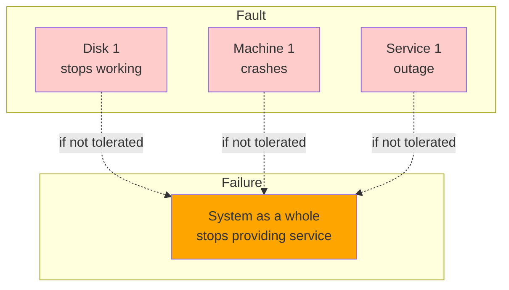

### Fault Tolerance

We call a system **fault-tolerant** if it continues providing the required service to users in spite of certain faults occurring. If a system cannot tolerate a certain part becoming faulty, we call that part a **single point of failure (SPOF)**, because a fault in that part escalates to cause the failure of the whole system.

For example, in the social network case study, a fault that might happen is that during the fan-out process, a machine involved in updating the materialized timelines crashes or becomes unavailable. To make this process fault-tolerant, we would need to ensure that another machine can take over this task without missing any posts that should have been delivered, and without duplicating any posts. (This idea is known as **exactly-once semantics**, and we will examine it in detail in Chapter 12.)

Fault tolerance is always limited to a certain number of certain types of faults. For example, a system might be able to tolerate a maximum of two hard drives failing at the same time, or a maximum of one out of three nodes crashing. It would not make sense to tolerate any number of faults; if all nodes crash, nothing can be done. If the entire planet Earth (and all servers on it) were swallowed by a black hole, tolerance of that fault would require web hosting in space — good luck getting that budget item approved.

| System | What it tolerates | What it doesn't |
| --- | --- | --- |
| Single-machine DB | (None — the machine is the SPOF) | Disk failure, OS crash, kernel panic |
| 3-node replicated DB | 1 node crash | 2 simultaneous node crashes, network partition if not handled |
| Multi-AZ deployment | 1 AZ outage | Region-wide outage |
| Multi-region active-active | 1 region outage | Worldwide network partition |

The point is not to maximize the table — each row has a cost in money, complexity, and consistency (we will return to these trade-offs in later chapters).

Counterintuitively, in such fault-tolerant systems, it can make sense to increase the rate of faults by triggering them deliberately — for example, by randomly killing individual processes without warning. This is called **fault injection**. Many critical bugs are actually due to poor error handling; by deliberately inducing faults, you ensure that the fault-tolerance machinery is continually exercised and tested, which can increase your confidence that faults will be handled correctly when they occur naturally. **Chaos engineering** is a discipline that aims to improve confidence in fault-tolerance mechanisms through experiments such as deliberately injecting faults.

Although we generally prefer tolerating faults over preventing faults, in some cases prevention is better than cure (e.g., because no cure exists). This is the case with security matters, for example; if an attacker has compromised a system and gained access to sensitive data, that event cannot be undone. However, this book mostly deals with the kinds of faults that can be cured, as described in the following sections.

### Hardware and Software Faults

When we think of causes of system failure, hardware faults quickly come to mind:

- Approximately **2%–5% of magnetic hard drives fail per year**; in a storage cluster with 10,000 disks, we should therefore expect on average one disk failure per day. Recent data suggests that disks are getting more reliable, but failure rates remain significant.
- Approximately **0.5%–1% of solid state drives (SSDs) fail per year**. Small numbers of bit errors are corrected automatically, but uncorrectable errors occur approximately once per year per drive, even in drives that are fairly new (i.e., that have experienced little wear). This error rate is higher than that of magnetic hard drives.
- Other hardware components (such as power supplies, RAID controllers, and memory modules) also fail, although less frequently than hard drives.
- **Approximately 1 in 1,000 machines has a CPU core that occasionally computes the wrong result**, likely because of manufacturing defects. In some cases an erroneous computation leads to a crash, but in other cases it leads to a program simply returning the wrong result.
- **Data in RAM can be corrupted**, either because of random events such as cosmic rays or because of permanent physical defects. Even when memory with error-correcting codes (ECC) is used, more than 1% of machines encounter an uncorrectable error in a given year, which typically leads to a crash of the machine and the affected memory module needing to be replaced. Furthermore, certain pathological memory access patterns can flip bits with high probability.
- **An entire datacenter might become unavailable** (e.g., because of a power outage or network misconfiguration) or even be permanently destroyed (e.g., by fire, flood, or earthquake). A solar storm, which induces large electrical currents in long-distance wires when the sun ejects a large mass of charged particles, could damage power grids and undersea network cables. Although such large-scale failures are rare, their impact can be catastrophic if a service cannot tolerate the loss of a datacenter.

These events are rare enough that you often don't need to worry about them when working on a small system, as long as you can easily replace hardware that becomes faulty. However, in a large-scale system, hardware faults happen often enough that they become part of normal system operation.

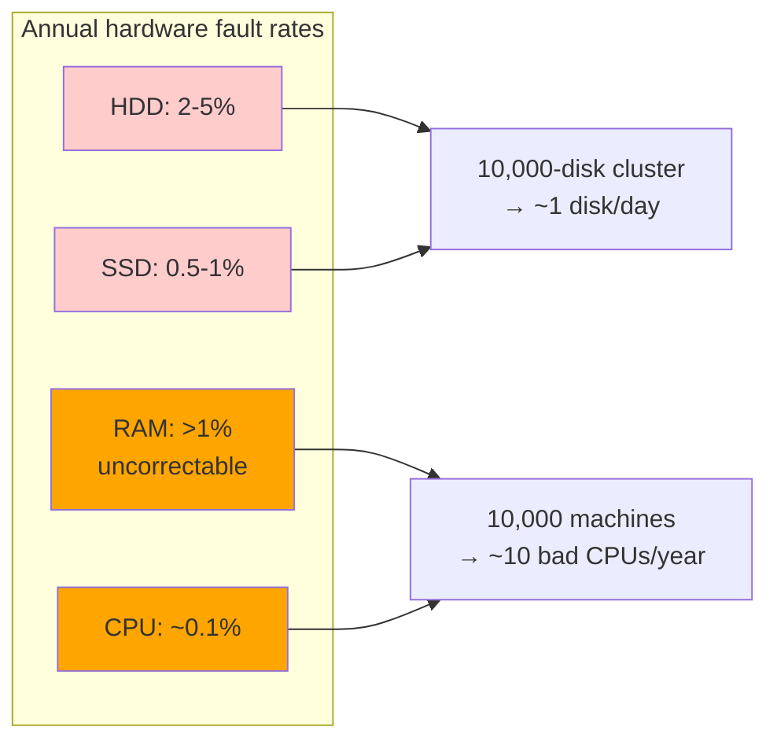

#### Tolerating hardware faults through redundancy

Our first response to unreliable hardware is usually to add redundancy to the individual hardware components in order to reduce the failure rate of the system. Disks may be set up in a RAID configuration (spreading data across multiple disks in the same machine so that a failed disk does not cause data loss), servers may have dual power supplies and hot-swappable CPUs, and datacenters may have batteries and diesel generators for backup power. Such redundancy can often keep a machine running uninterrupted for years.

Redundancy is most effective when component faults are **independent** — that is, when the occurrence of one fault does not change the likelihood that another fault will occur. However, experience has shown significant correlations between component failures. Unavailability of an entire server rack or an entire datacenter still happens more often than we would like.

Hardware redundancy increases the uptime of a single machine; however, using a distributed system has advantages, such as being able to tolerate a complete outage of one datacenter. For this reason, cloud systems tend to focus less on the reliability of individual machines and instead aim to make services highly available by tolerating faulty nodes at the software level. Cloud providers use **availability zones** to identify which resources are physically co-located; resources in the same place are more likely to fail at the same time than geographically separated resources.

The fault-tolerance techniques we discuss in this book are designed to tolerate the loss of entire machines, racks, or availability zones. They generally work by allowing a machine in one datacenter to take over when a machine in another datacenter fails or becomes unreachable.

Systems that can tolerate the loss of entire machines also have operational advantages. A single-server system requires planned downtime if you need to reboot the machine (to apply operating system security patches, for example), whereas a multi-node fault-tolerant system can be patched by restarting one node at a time, without affecting the service for users. This is called a **rolling upgrade**.

### Software Faults

Although hardware failures can be weakly correlated, they are still mostly independent — for example, if one disk fails, other disks in the same machine will likely be fine, at least for a while. On the other hand, **software faults are often very highly correlated**, because it is common for many nodes to run the same software and thus have the same bugs. Such faults are harder to anticipate, and they tend to cause many more system failures than uncorrelated hardware faults. Examples include:

- A software bug that causes every node to fail at the same time in particular circumstances. For instance, on June 30, 2012, a **leap second caused many Java applications to hang simultaneously** because of a bug in the Linux kernel, bringing down several internet services. And because of a firmware bug, all SSDs of certain models suddenly fail after precisely 32,768 hours of operation (less than four years), rendering the data on them unrecoverable.
- A runaway process that uses up a shared, limited resource, such as CPU time, memory, disk space, network bandwidth, or threads. For instance, a process that consumes too much memory while processing a large request may be killed by the operating system, or a bug in a client library could cause a much higher request volume than anticipated.
- A service that the system depends on slows down, becomes unresponsive, or starts returning corrupted responses.
- An interaction between different systems results in emergent behavior that does not occur when each system is tested in isolation.
- **Cascading failures**, where a problem in one component causes another component to become overloaded and slow down, which in turn brings down another component.

The bugs that cause these kinds of software faults often lie dormant for a long time until they are triggered by an unusual set of circumstances. In those circumstances, it is revealed that the software is making some kind of assumption about its environment — and while that assumption is usually true, it eventually stops being true for some reason.

The problem of systematic faults in software has no quick solution. The following table combines the engineering practices most teams rely on, drawn from the discussion of correlated software faults above and from operator mistakes below.

| Practice | What it addresses |
| --- | --- |
| Careful reasoning about assumptions and interactions | Surfaces implicit dependencies before they bite |
| Thorough testing (handwritten + property-based on random inputs) | Catches dormant bugs that lie in wait for unusual inputs |
| Process isolation | Contains runaway resource use to one process |
| Allowing processes to crash and restart | Limits blast radius of correlated software bugs |
| Avoiding retry-storm feedback loops | Prevents clients amplifying load on a degraded service |
| Production measurement, monitoring, and analysis | Detects drift between assumptions and reality |
| Rollback mechanisms for configuration changes | Reverts operator mistakes quickly |
| Gradual rollouts of new code | Limits the blast radius of a bad release |
| Detailed monitoring and observability tooling | Diagnoses production issues |
| Interfaces that encourage "the right thing" | Reduces the chance of operator mistakes |

The last row, blameless postmortems, is cultural rather than technical, but it is the mechanism by which the rest of the practices get stronger over time.

Increasingly, organizations are adopting a culture of **blameless postmortems**: after an incident, the people involved are encouraged to share full details about what happened, without fear of punishment, since this allows others in the organization to learn how to prevent similar problems in the future. This process may uncover a need to change business priorities, invest in areas that have been neglected, change the incentives for the people involved, or bring another systemic issue to management's attention.

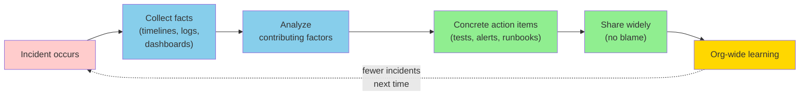

As a general principle, when investigating an incident, you should be suspicious of simplistic answers. "Bob should have been more careful when deploying that change" is not productive, but neither is "We must rewrite the backend in Haskell." Instead, management should take the opportunity to learn the details of how the sociotechnical system works from the point of view of the people who work with it every day, and take steps to improve it based on this feedback.

### How Important Is Reliability?

Reliability is not just for nuclear power stations and air traffic control; more mundane applications are also expected to work reliably. Bugs in business applications lead to lost productivity (and legal risks if figures are reported incorrectly), and outages of ecommerce sites can have huge costs in terms of lost revenue and damage to reputation.

In many applications, a temporary outage of a few minutes or even a few hours is tolerable, but **permanent data loss or corruption would be catastrophic**. Consider a parent who stores all their pictures and videos of their children in your photo application. How would they feel if that database was suddenly corrupted? Would they know how to restore their collection from a backup?

As another example of how unreliable software can harm people, consider the **Post Office Horizon scandal**. Between 1999 and 2019, hundreds of people managing Post Office branches in Britain were convicted of theft or fraud because the accounting software showed a shortfall in their accounts. Eventually it became clear that many of these shortfalls were due to bugs in the software, resulting in many of these convictions being overturned. What led to this, probably the largest miscarriage of justice in British history, is an assumption by English law that computers operate correctly (and hence, evidence produced by computers is reliable) unless evidence exists to the contrary. Software engineers may laugh at the idea that software could ever be bug-free, but this is little solace to the people who were wrongfully imprisoned, declared bankruptcy, or even committed suicide as a result of a wrongful conviction due to an unreliable computer system.

In some situations we may choose to sacrifice reliability in order to reduce development cost (e.g., when developing a prototype product for an unproven market) — but we should be very conscious of when we are cutting corners and keep in mind the potential consequences.

### Reliability vs. Cost: An Explicit Trade-off

It is useful to remember that "reliability" is not free. Adding redundancy — replicas, cross-region replication, automated failover — multiplies infrastructure cost, adds operational complexity, and frequently forces you to make consistency compromises (which we will revisit in Chapter 9). The honest engineering question is: **how much reliability is this workload worth?**

A few heuristics from real-world systems:

- **Tier-1 user-facing writes** (e.g., payment, message-sent, photo-uploaded): expect ~99.99% availability, multi-region failover, and strong durability. The cost is justified by direct revenue or trust impact.
- **Tier-2 user-facing reads** (e.g., home timeline, search results): 99.9% is typical; can degrade gracefully (serve a stale cached result, show a "try again" UI).
- **Internal batch jobs**: 99% is fine; retries and idempotence absorb the rest.
- **Analytics / telemetry**: best-effort is acceptable; data loss is annoying but not catastrophic.

The danger is treating every system as tier-1, or — the more common failure mode — under-investing in tier-1 systems because "the simple version worked in staging." The book's recurring theme is that the cost of reliability work is paid up front, and the cost of an outage is paid later, often by people who had no voice in the architecture decision.

---

## Scalability

Even if a system is working reliably today, that doesn't mean it will necessarily work reliably in the future. One common reason for degradation is increased load. Perhaps the system has grown from 10,000 concurrent users to 100,000 concurrent users, or from 1 million to 10 million. Perhaps it is processing much larger volumes of data than it did before.

**Scalability** is the term we use to describe a system's ability to cope with increased load. Sometimes, when discussing scalability, people make comments along the lines of, "You're not Google or Amazon. Stop worrying about scale and just use a relational database." Whether this maxim applies to you depends on the type of application you are building.

If you are building a new product that currently has only a small number of users, perhaps at a startup, the overriding engineering goal is usually to keep the system as simple and flexible as possible so that you can easily modify and adapt the features of your product as you learn more about customers' needs. In such an environment, it is counterproductive to worry about hypothetical scale that might be needed in the future. In the best case, investments in scalability are wasted effort and premature optimization; in the worst case, they lock you into an inflexible design and make it harder to evolve your application.

**Scalability is not a one-dimensional label** — it is meaningless to say "X is scalable" or "Y doesn't scale." Rather, discussing scalability means considering questions like these:

- If the system grows in a particular way, what are our options for coping with the growth?
- How can we add computing resources to handle the additional load?
- Based on current growth projections, when will we hit the limits of our current architecture?

If you succeed in making your application popular, and therefore are handling a growing amount of load, you will learn where your performance bottlenecks lie and along which dimensions you need to scale. At that point, it's time to start worrying about techniques for scalability.

### Understanding Load

First, you need a clear understanding of the current load on the system. Only then can you discuss growth questions ("What happens if our load doubles?"). Often this will be a measure of throughput — for example, the number of requests per second to a service, the number of gigabytes of new data arriving per day, or the number of shopping cart checkouts per hour. Sometimes you care about the peak of a variable quantity, such as the number of simultaneously online users in our social network case study.

Often other statistical characteristics of the load affect the access patterns and hence the scalability requirements. For example, you may need to know the ratio of reads to writes in a database, the hit rate on a cache, or the number of data items per user (followers, in our case study). Perhaps the average case is what matters for you, or perhaps your bottleneck is dominated by a small number of extreme cases. It all depends on the details of your particular application.

Once you understand the load on your system, you can investigate what happens when the load increases. You can look at this in two ways:

- When you increase the load in a certain way and keep the system resources (CPUs, memory, network bandwidth, etc.) unchanged, how is the performance of your system affected?
- When you increase the load in a particular way, how much do you need to increase the resources if you want to keep performance unchanged?

Usually the goal is to keep the performance of the system within the requirements of the SLA while also minimizing the cost of running the system. The greater the required computing resources, the higher the cost. Some types of hardware might be more cost-effective than others, and these factors may change over time as new types of hardware become available.

If doubling the resources will enable you to handle twice the load while keeping performance the same, we say that you have **linear scalability**, and this is considered a good thing. Occasionally it is possible to handle twice the load with less than double the resources, because of economies of scale or a better distribution of peak load. Much more likely is that the cost grows faster than linearly. There may be many reasons for the inefficiency; for example, if you have a lot of data, processing a single write request may involve more work than if you have a small amount of data, even if the size of the request is the same.

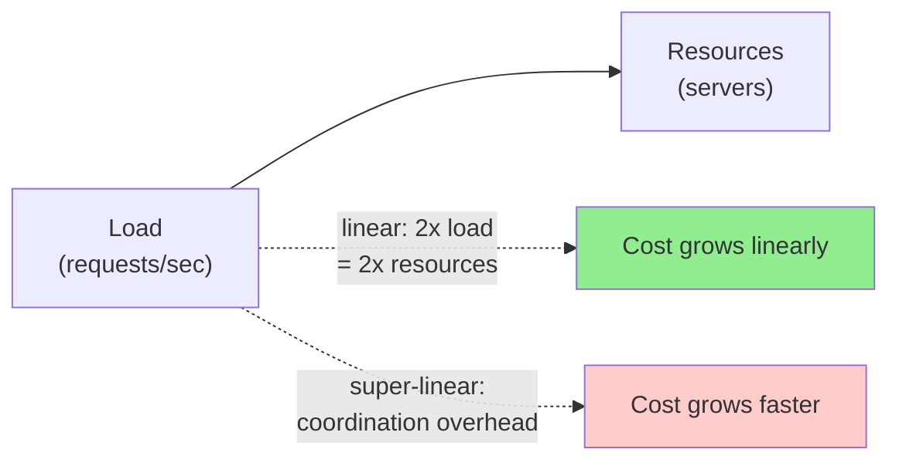

### Shared-Memory, Shared-Disk, and Shared-Nothing Architectures

The simplest way of increasing the hardware resources of a service is to move it to a more powerful machine. Individual CPU cores are no longer getting significantly faster, but you can buy a machine (or rent a cloud instance) with more CPU cores, more RAM, and more disk space. This approach is called **vertical scaling** or **scaling up**.

You can get parallelism on a single machine by using multiple processes or threads. All the threads belonging to the same process can access the same RAM, and hence this approach is also called a **shared-memory architecture**. The problem with a shared-memory approach is that the cost grows faster than linearly; a high-end machine with twice the hardware resources of a lower-spec machine typically costs significantly more than twice as much. And because of bottlenecks, that machine is unlikely to actually be able to handle twice the load.

Another approach is the **shared-disk architecture**, which uses several machines with independent CPUs and RAM but stores data on an array of disks that is shared among the machines, which are connected via a fast network: network-attached storage (NAS) or a storage area network (SAN). This architecture has traditionally been used for on-premises data warehousing workloads, but contention and the overhead of locking limit the scalability of the shared-disk approach.

By contrast, the **shared-nothing architecture** (also called **horizontal scaling** or **scaling out**) involves a distributed system with multiple nodes, each of which has its own CPUs, RAM, and disks. Any coordination between nodes is done at the software level, via a conventional network.

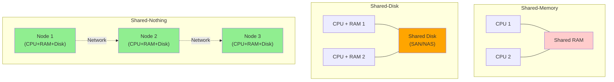

The advantages of the shared-nothing approach, which has gained popularity in recent years, are that it has the potential to scale linearly, it can use whatever hardware offers the best price/performance ratio (especially in the cloud), it can more easily adjust its hardware resources as load increases or decreases, and it can achieve greater fault tolerance by distributing the system across multiple datacenters and regions. The downsides are that it requires explicit sharding (see Chapter 7) and incurs all the complexity of distributed systems (discussed in Chapter 9).

Some cloud native database systems use separate services for storage and transaction execution, with multiple compute nodes sharing access to the same storage service. This model has some similarity to a shared-disk architecture, but it avoids the scalability problems of older systems. Instead of providing a filesystem (NAS) or block device (SAN) abstraction, the storage service offers a specialized API that is designed for the specific needs of the database.

| Architecture | Coordination | Cost growth | Typical use |
| --- | --- | --- | --- |
| Shared-memory | Implicit (RAM) | Super-linear | Single-machine parallelism |
| Shared-disk | Locking over network storage | Super-linear at scale | Traditional data warehouses |
| Shared-nothing | Software-level over network | Approximately linear | Modern cloud-native systems |

### Principles for Scalability

The architecture of systems that operate at large scale is usually highly specific to the application. There is no such thing as a generic, one-size-fits-all scalable architecture (informally known as *magic scaling sauce*). For example, a system designed to handle 100,000 requests per second, each 1 kB in size, looks very different from a system designed for 3 requests per minute, each 2 GB in size — even though the two systems have the same data throughput (100 MB/second).

Moreover, an architecture that is appropriate for one level of load is unlikely to cope with 10 times that load. If you are working on a fast-growing service, it is therefore probable that you will need to rethink your architecture on every order of magnitude load increase. As the needs of the application are likely to evolve, it is usually not worth planning future scaling needs more than one order of magnitude in advance.

A good general principle for scalability is to **break a system into smaller components that can operate largely independently from one another**. This is the underlying principle behind microservices, sharding, stream processing, and shared-nothing architectures. The challenge lies in knowing where to draw the line between things that should be together and things that should be apart.

Another good principle is **not to make things more complicated than necessary**. If a single-machine database will do the job, it's probably preferable to a complicated distributed setup. Autoscaling systems (which automatically add or remove resources in response to demand) are cool, but if your load is fairly predictable, a manually scaled system may have fewer operational surprises. A system with 5 services is simpler than one with 50. Good architectures usually involve a pragmatic mixture of approaches.

### A pragmatic scaling checklist

When you find yourself asking "do I need to scale now?", it helps to be explicit about the answers:

1. **Where is the bottleneck?** CPU, memory, disk I/O, network bandwidth, single-node lock contention, single-shard hot key?
2. **Is the bottleneck linear in load?** If not, the cost of doing nothing grows over time even if absolute load doesn't.
3. **Is the bottleneck independent of load?** (e.g., a third-party API with a fixed quota). Then "scaling" is really "redesigning to remove the dependency."
4. **What's the headroom on the cheapest fix?** Adding RAM to a single machine is cheap; redesigning the data model is expensive. Pick the cheapest thing that buys you another order of magnitude.
5. **Is the change reversible?** If you can try a fix and roll back, the cost of being wrong is low — try it. If not, prototype on a non-critical path first.

A common anti-pattern is to design for the load the system *might* have in three years, while spending engineering time you don't have. As Dan McKinley puts it: *choose boring technology*. Boring systems are easier to scale when you actually need to.

---

## Maintainability

Software does not wear out or suffer material fatigue, so it does not break in the same ways as mechanical objects do. But the requirements for an application frequently evolve, the environment that the software runs in changes (such as its dependencies and the underlying platform), and it may have bugs that need fixing.

It is widely recognized that **the majority of the cost of software is not in its initial development but in its ongoing maintenance** — fixing bugs, keeping its systems operational, investigating failures, adapting it to new platforms, modifying it for new use cases, repaying technical debt, and adding new features.

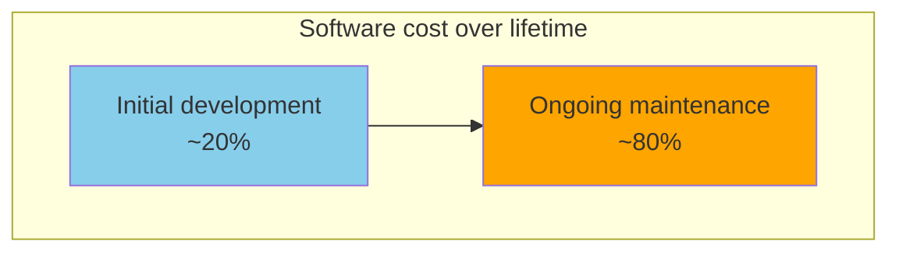

Maintenance can be complex, especially for legacy systems. A system that has been successfully running for a long time may well use outdated technologies that not many engineers understand today (such as mainframes and COBOL code), and institutional knowledge of how and why the system was designed in a certain way may have been lost as people have left the organization. Fixing other people's mistakes might also be necessary. Because computer systems are often intertwined with the human organizations they support, maintenance of such systems is as much a people problem as a technical one.

**Every system we create today will one day become a legacy system** if it is valuable enough to survive for a long time. To minimize the pain for future generations who need to maintain our software, we should design it with maintenance in mind. Although we cannot always predict which decisions might create maintenance headaches in the future, in this book we will pay attention to several principles that are widely applicable:

- **Operability**: Make it easy for the organization to keep the system running smoothly.
- **Simplicity**: Make it easy for new engineers to understand the system, by implementing it using well-understood, consistent patterns and structures and avoiding unnecessary complexity.
- **Evolvability**: Make it easy for engineers to make changes to the system in the future, adapting it and extending it for unanticipated use cases as requirements change.

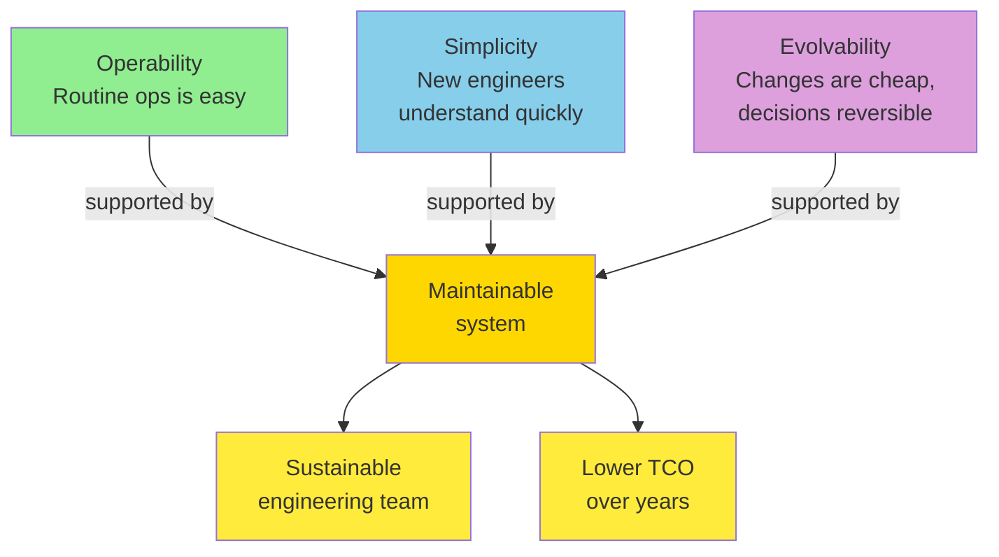

### Operability: Making Life Easy for Operations

We previously discussed the role of operations in "Operations in the Cloud Era," and we saw that human processes are at least as important for reliable operations as software tools. It has been suggested that "good operations can often work around the limitations of bad (or incomplete) software, but good software cannot run reliably with bad operations."

In large-scale systems consisting of many thousands of machines, manual maintenance would be unreasonably expensive, and automation is essential. However, automation can be a two-edged sword. There will always be edge cases (such as rare failure scenarios) that require manual intervention from the operations team, and since the cases that cannot be handled automatically tend to be the most complex, greater automation requires a more skilled operations team that can resolve those issues.

Additionally, an automated system that goes wrong is often harder to troubleshoot than a system that relies on an operator to perform some actions manually. For that reason, more automation is not always better for operability. However, some amount of automation is important — the sweet spot will depend on the specifics of your particular application and organization.

Good operability means making routine tasks easy, allowing the operations team to focus on high-value activities. Data systems can help by doing the following:

- Allowing monitoring tools to check the system's key metrics and supporting observability tools to give insights into the system's runtime behavior.
- Avoiding dependency on individual machines (allowing machines to be taken down for maintenance while the system as a whole continues running uninterrupted).
- Providing good documentation and an easy-to-understand operational model ("If I do X, Y will happen").
- Providing good default behavior, but also giving administrators the freedom to override defaults when needed.
- Self-healing where appropriate, but also giving administrators manual control over the system state when needed.
- Exhibiting predictable behavior, minimizing surprises.

### Simplicity: Managing Complexity

Small software projects can have delightfully simple and expressive code, but as projects get larger, they often become very complex and difficult to understand. This complexity slows down everyone who needs to work on the system, further increasing the cost of maintenance. A software project mired in complexity is sometimes described as a **big ball of mud**.

When complexity makes maintenance hard, budgets and schedules are often overrun. In complex software, there is also a greater risk of introducing bugs when making a change. When the system is harder for developers to understand and reason about, hidden assumptions, unintended consequences, and unexpected interactions are more easily overlooked. Conversely, reducing complexity greatly improves the maintainability of software, and thus simplicity should be a key goal for the systems we build.

Simple systems are easier to understand, so we should try to solve a given problem in the simplest way possible. Unfortunately, this is easier said than done. Whether something is simple is often a subjective matter, as there is no objective standard of simplicity. For example, one system may hide a complex implementation behind a simple interface, whereas another may have a simple implementation that exposes more internal detail to its users — which one is simpler?

One attempt at reasoning about complexity breaks it into two categories: **essential** and **accidental**. The idea is that essential complexity is inherent in the problem domain of the application, while accidental complexity arises only because of limitations of our tooling. Unfortunately, this distinction is also flawed, because boundaries between the essential and the accidental shift as our tooling evolves.

One of the best tools we have for managing complexity is **abstraction**. A good abstraction can hide a great deal of implementation detail behind a clean, simple-to-understand façade. A good abstraction can also be used for a wide range of applications. Not only is this reuse more efficient than reimplementing a similar thing multiple times, but it also leads to higher-quality software, as quality improvements in the abstracted component benefit all applications that use it.

For example, high-level programming languages are abstractions that hide machine code, CPU registers, and system calls. SQL is an abstraction that hides complex on-disk and in-memory data structures, concurrent requests from other clients, and inconsistencies after crashes. Of course, when programming in a high-level language, we are still using machine code; we are just not using it directly, because the programming language abstraction saves us from having to think about it.

Abstractions for application code that aim to reduce its complexity can be created using methodologies such as design patterns and domain-driven design (DDD). This book is not about such application-specific abstractions, but rather about general-purpose abstractions on top of which you can build your applications, such as database transactions, indexes, and event logs.

### Evolvability: Making Change Easy

It's extremely unlikely that your system's requirements will remain unchanged forever. They are much more likely to be in constant flux: you learn new facts, previously unanticipated use cases emerge, business priorities change, users request new features, new platforms replace old platforms, legal or regulatory requirements change, growth of the system forces architectural changes, etc.

In terms of organizational processes, Agile working patterns provide a framework for adapting to change. The Agile community has also developed technical tools and processes that are helpful when building software in a frequently changing environment, such as test-driven development (TDD) and refactoring. In this book, we search for ways of increasing agility at the level of a system consisting of several applications or services with different characteristics.

The ease with which you can modify a data system and adapt it to changing requirements is closely linked to its simplicity and its abstractions. Loosely coupled, simple systems are usually easier to modify than tightly coupled, complex ones. Since this is such an important idea, we will use a different word to refer to agility on a data system level: **evolvability**.

One major factor that makes change difficult in large systems is **irreversibility**. For example, say you are migrating from one database to another. If you cannot switch back to the old system in case of problems with the new one, the stakes are much higher than if you can easily go back. Therefore, irreversible actions need to be taken very carefully. Minimizing irreversibility improves flexibility.

A few practical techniques for keeping decisions reversible:

- **Dual-write or shadow mode** for migrations: run the new system in parallel, compare outputs, but only the old system's results are user-visible.
- **Feature flags** that can be toggled without a deploy.
- **Schema migrations that are backward- and forward-compatible** (add a column, dual-write, backfill, switch reads, drop the old column — never "rename a column" in a single deploy).
- **Export/import** of data so you are not locked into a vendor's format.
- **Documented rollback procedures** that have actually been rehearsed, not just imagined.

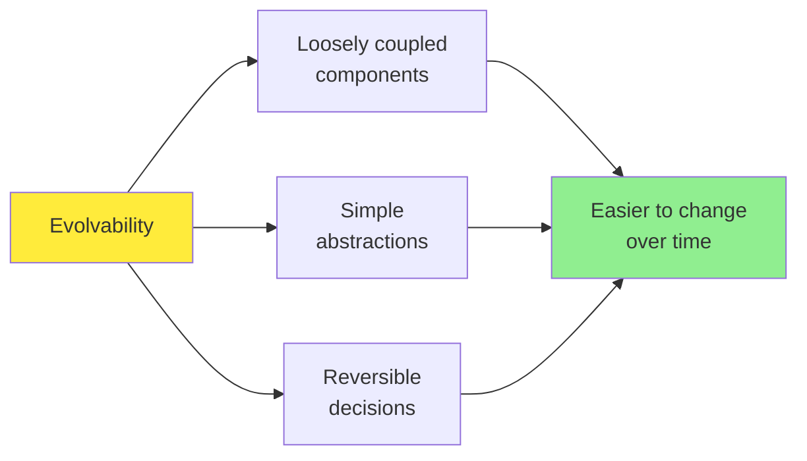

#### Code Example: Modeling Maintainability Trade-offs

A small example that captures how the three facets of maintainability interact in code review:

```python
from dataclasses import dataclass
from typing import Protocol


# Simplicity: a small, focused interface. Easy to read, easy to test.
class Storage(Protocol):
    def put(self, key: str, value: bytes) -> None: ...
    def get(self, key: str) -> bytes | None: ...


# Operability: the implementation exposes what it needs from the operator.
@dataclass
class S3Storage:
    bucket: str
    region: str
    timeout_s: float = 5.0      # operator-tunable
    max_retries: int = 3        # surfaced as a config, not a constant

    def put(self, key: str, value: bytes) -> None:
        # explicit timeouts + retries -> no surprise hangs in production
        ...


# Evolvability: callers depend on the Storage protocol, not the concrete class.
# We can swap S3Storage for GcsStorage or an in-memory mock without touching
# business logic -- a reversible decision with low blast radius.
class UserCache:
    def __init__(self, storage: Storage) -> None:
        self._storage = storage
```

Three maintainability goals are realized in this short snippet: the `Storage` protocol is **simple**, the `S3Storage` dataclass is **operable** (defaults and limits are explicit), and depending on the protocol instead of the concrete class keeps the choice **evolvable**.

---

## Summary

In this chapter we examined several examples of nonfunctional requirements: performance, reliability, scalability, and maintainability. Through these topics, we also encountered principles and terminology that will be relevant throughout the rest of the book.

We started with a case study of implementing home timelines in a social network, which illustrated some of the challenges that arise at scale. We then discussed how to measure performance (e.g., using response time percentiles) and the load on a system (e.g., using throughput metrics), and how these metrics are used in SLAs. Scalability is a closely related concept: it focuses on ensuring that performance stays the same when the load grows. We saw some general principles for scalability, such as breaking a task into smaller parts that can operate independently, and we will dive into greater technical detail on scalability techniques in the following chapters.

To achieve reliability, you can use fault-tolerance techniques, which allow a system to continue providing its services even if a component (e.g., a disk, a machine, or another service) is faulty. We saw examples of hardware faults that can occur and distinguished them from software faults, which can be harder to deal with because they are often strongly correlated. Another aspect of achieving reliability is to build resilience against humans making mistakes, and we saw blameless postmortems as a technique for learning from incidents.

Finally, we examined several facets of maintainability, including supporting the work of operations teams, managing complexity, and making it easy to evolve an application's functionality over time. There are no easy answers to how to achieve these goals, but one approach that can help is to build applications using well-understood building blocks that provide useful abstractions. The rest of this book will cover a selection of building blocks that have proved to be valuable in practice.

### Key Takeaways

1. **Performance** is not a single number; describe it with both throughput (work per second) and response time (delay per request), and prefer percentiles over averages for understanding user experience.
2. **Tail latency amplification** means a small fraction of slow backend calls can dominate end-user latency when multiple calls are made in parallel; design for the p99 (or p999), not just the median.
3. **Reliability** is "continuing to work correctly when things go wrong." Distinguish **faults** (one component fails) from **failures** (system as a whole stops serving users), and design redundancy for the components whose faults would cascade.
4. **Software faults are correlated**; "10,000 machines running the same binary" means a single bug can take them all down at once. Hardware faults are mostly independent.
5. **Retry storms** and **metastable failures** are a common cause of outages: clients with naive retries amplify load on an overloaded service. Defend with exponential backoff with jitter, circuit breakers, load shedding, and backpressure.
6. **Scalability** is multidimensional — say along which axis you can grow (CPU, memory, disk, network, geography, request rate, data volume). Shared-nothing architectures scale most linearly but pay the price of distributed-systems complexity.
7. **SLOs and SLAs** are how teams make performance and reliability commitments measurable. A useful SLO picks the user-visible metric that matters, sets a percentile target (e.g., p99 < 1 s), and is achievable.
8. **Maintainability** is mostly about the **organization**: make routine work easy, minimize complexity, keep decisions reversible, and learn from incidents with blameless postmortems.

### The vocabulary at a glance

| Term | One-line definition |
| --- | --- |
| Latency | Time a request is not being actively worked on (includes queueing + network) |
| Response time | What the client observes end-to-end (the most user-relevant number) |
| Service time | Time the server is actively processing the request |
| Throughput | Work done per unit time (requests/s, MB/s, IOPS) |
| Fan-out | Factor by which one request grows into many downstream requests |
| Median / p50 | Half of observations are below this |
| p95 / p99 / p999 | 5% / 1% / 0.1% of observations are above this (the "tail") |
| Tail latency amplification | The user sees a much worse tail than any individual backend |
| SLI / SLO / SLA | Indicator (measurement), Objective (target), Agreement (contract) |
| Fault / Failure | One component breaks / the whole system stops serving users |
| Single point of failure | A component whose fault becomes a failure |
| Retry storm | Clients retrying faster than the server can recover |
| Circuit breaker | Client-side: fail fast when downstream is known-bad |
| Load shedding | Server-side: reject requests before you become overloaded |
| Backpressure | Server signals "slow down" to clients |
| Shared-nothing | Each node has its own CPU, RAM, disk; coordination over network |
| Operability | Making routine operations easy |
| Evolvability | Making change cheap and reversible |

---

## Further Reading

A small selection of the references cited in the chapter:

- Raffi Krikorian, *Timelines at Scale* (QCon 2012) — the original Twitter architecture talk that inspired our case study
- Nathan Bronson et al., *Metastable Failures in Distributed Systems* (HotOS 2021)
- Jeffrey Dean and Luiz André Barroso, *The Tail at Scale* (CACM 2013) — the canonical treatment of tail latency amplification
- Marc Brooker, *Exponential Backoff and Jitter* (AWS Builder's Library, 2015) and *Fixing Retries with Token Buckets and Circuit Breakers* (2022)
- Michael Nygard, *Release It!* (2nd ed., Pragmatic Bookshelf, 2018) — the book that popularized the circuit-breaker pattern
- Greg Linden, *Marissa Mayer at Web 2.0* — the (controversial) 20% revenue-per-400 ms claim
- Jake Brutlag, *Speed Matters for Google Web Search* (2009)
- Eric Schurman and Jake Brutlag, *Performance Related Changes and Their User Impact* (Velocity 2009)
- Xiao Bai et al., *Understanding and Leveraging the Impact of Response Latency on User Behaviour in Web Search* (TOIS 2018) — the Yahoo study controlling for result quality
- Gil Tene, *HdrHistogram* and Charles Masson et al., *DDSketch* — practical percentile-estimation libraries
- Alex Hidalgo, *Implementing Service Level Objectives* (O'Reilly, 2020) — a hands-on SLO guide
- Daniel Ford et al., *Availability in Globally Distributed Storage Systems* (OSDI 2010) — hardware fault rates at Google
- Michael Stonebraker, *The Case for Shared Nothing* (HP Labs, 1986) — the original shared-nothing manifesto
- Sidney Dekker, *Drift into Failure* and *The Field Guide to Understanding "Human Error"* — the sociotechnical view of reliability
