# Chapter 3: Data Models and Query Languages

## Introduction

Data models sit at the heart of every data system. They define how we structure information, how we query it, and ultimately how we reason about the problem domain. In a complex application, layers of abstraction stack on top of each other, with each layer hiding the complexity of the layers below it by providing a clean data model.

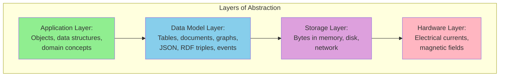

This chapter explores the major data models in use today: the **relational model**, the **document model**, **graph-based data models**, **event sourcing**, and **DataFrames**. For each, we will look at associated query languages (SQL, Cypher, SPARQL, Datalog, GraphQL) and the trade-offs that determine when each model is the best fit.

> **Terminology: Declarative Query Languages** — Many of the query languages discussed in this chapter (SQL, Cypher, SPARQL, Datalog) are *declarative*. You specify the *pattern* of the data you want — what conditions the results must meet and how to transform them — but not *how* to achieve it. The database's query optimizer decides which indexes and join algorithms to use and in what order to execute the query.
>
> This is in contrast to imperative programming languages (Python, Java), where you write an algorithm telling the computer which operations to perform in which order. Declarative languages are typically more concise, hide implementation details, and make it possible for the database to introduce performance improvements (such as parallel execution across multiple CPU cores and machines) without requiring query changes.

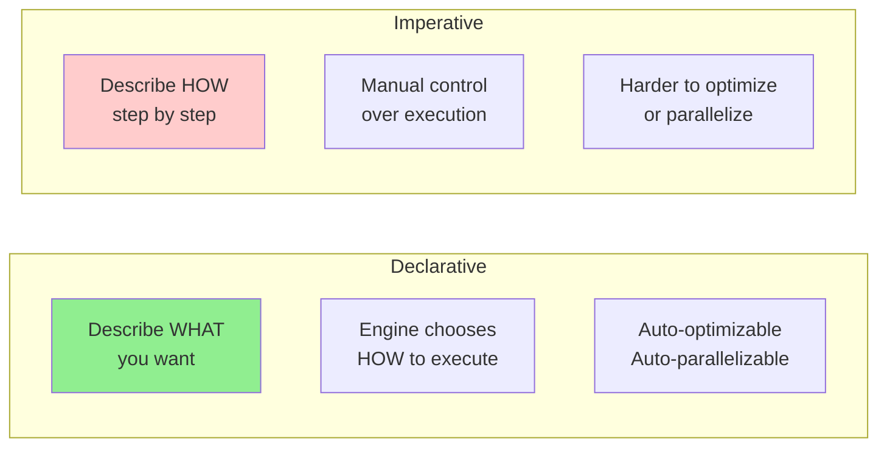

---

## 1. Relational Versus Document Models

The best-known data model today is **SQL**, based on the relational model proposed by Edgar Codd in 1970 [Codd, 1970]. Data is organized into **relations** (tables), where each relation is an unordered collection of **tuples** (rows). The relational model was originally a theoretical proposal; many doubted it could be implemented efficiently. By the mid-1980s, RDBMSs and SQL had become the tools of choice for most people who needed to store and query data with regular structure.

Over the decades, several alternatives have come and gone:

| Era | Challenger | Outcome |
|-----|-----------|---------|
| 1970s–80s | Network model, hierarchical model | Relational model dominated |
| Late 1980s–90s | Object databases | Came and went |
| Early 2000s | XML databases | Only niche adoption |
| 2010s | NoSQL ("Not Only SQL") | Lasting impact: the **document model** |

> **NoSQL** was a loose umbrella term for new data models, schema flexibility, scalability, and open-source licensing. Some databases branded themselves **NewSQL**, aiming to combine NoSQL scalability with relational transactional guarantees. The terminology has faded, but the ideas deeply influence modern data systems.

The lasting effect of the NoSQL movement is the popularity of the **document model**, which usually represents data as JSON. Originally popularized by MongoDB and Couchbase, JSON support is now common in relational databases too. Compared to relational tables — often perceived as rigid — JSON documents are considered more flexible.

### The Object-Relational Mismatch

Most modern application development uses object-oriented programming languages. A common criticism of SQL is that when data is stored in relational tables, an awkward translation layer is required between application objects and database rows, columns, and tables. This disconnect is sometimes called an **impedance mismatch**, a term borrowed from electronics describing signal reflections when circuit impedances don't match.

**Object-relational mapping (ORM)** frameworks like ActiveRecord and Hibernate reduce boilerplate, but they are also widely criticized:

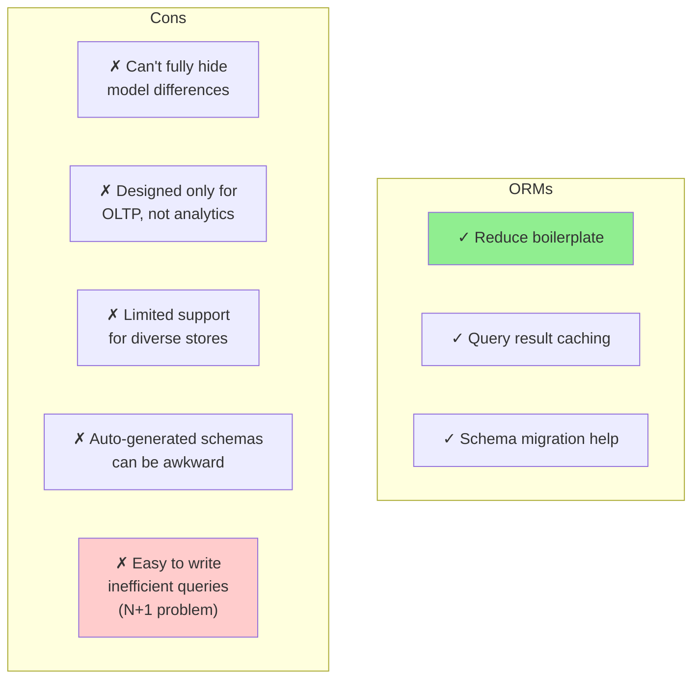

**The N+1 Query Problem** — Consider displaying user comments on a page. You run one query that returns N comments, each with an author ID. To show the author's name, you look up the ID in the users table. In handwritten SQL you would join author info into the main query. With an ORM, however, you might end up running a *separate* query per comment, resulting in **N+1 queries total**, which is much slower than one joined query.

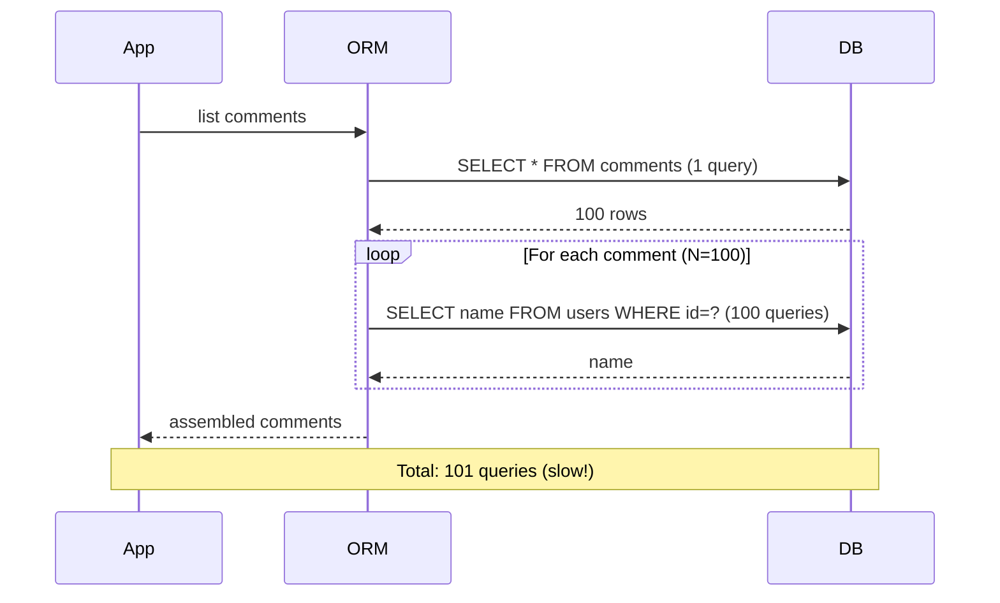

In handwritten SQL, one query with a join suffices:

```sql
SELECT comments.*, users.full_name AS author_name
FROM comments
JOIN users ON comments.author_id = users.id
WHERE comments.post_id = 42;
```

ORMs do help with simple, repetitive cases and provide query caching and migration tooling. But for analytics workflows where you need the underlying relational representation, ORMs don't help.

### The Document Data Model for One-to-Many Relationships

Not all data lends itself well to a relational representation. Take the example of a LinkedIn profile (résumé):

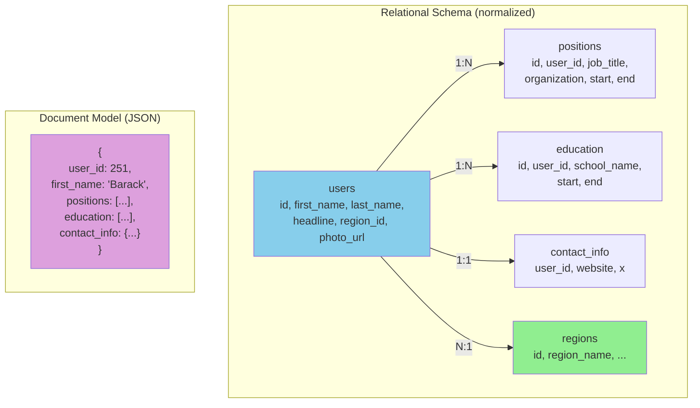

The same information as a single JSON document:

```json
{
  "user_id": 251,
  "first_name": "Barack",
  "last_name": "Obama",
  "headline": "Former President of the United States of America",
  "region_id": "us:91",
  "photo_url": "/p/7/000/253/05b/308dd6e.jpg",
  "positions": [
    {"job_title": "President", "organization": "United States of America"},
    {"job_title": "US Senator (D-IL)", "organization": "United States Senate"}
  ],
  "education": [
    {"school_name": "Harvard University", "start": 1988, "end": 1991},
    {"school_name": "Columbia University", "start": 1981, "end": 1983}
  ],
  "contact_info": {
    "website": "https://barackobama.com",
    "x": "https://x.com/barackobama"
  }
}
```

Some developers feel that the JSON model reduces the impedance mismatch between application code and the storage layer. The JSON representation has better **locality** than the multi-table schema: to fetch a profile in the relational case you need either multiple queries or a messy multi-way join. In the JSON case, all the relevant information is in one place.

The one-to-many relationships from a user profile to positions, education, and contact info form a **tree structure** in the data, and the JSON representation makes this tree structure explicit:

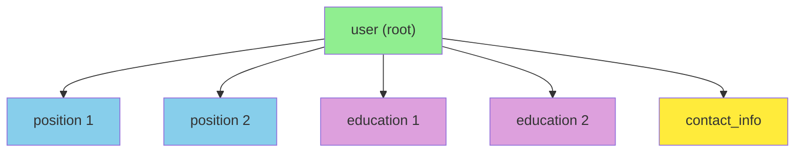

> A one-to-many relationship is sometimes called **one-to-few** because a résumé typically has a small number of positions. If you have a genuinely large number of related items — say, thousands of comments on a celebrity's social media post — embedding them all in one document becomes unwieldy, and the relational approach is preferable.

---

## 2. Normalization, Denormalization, and Joins

In the résumé example, `region_id` is stored as an ID, not as the plain-text string "Washington, DC, United States". Why? Using a standardized list of regions (referenced by ID) provides several advantages:

- **Consistent style and spelling** across profiles
- **Avoids ambiguity** if several places share the same name
- **Ease of updating** — the name is stored in only one place
- **Localization support** — the lists can be translated
- **Better search functionality** — regions can encode hierarchy (e.g., "US East Coast")

Whether you store an ID or a text string is a question of **normalization**.

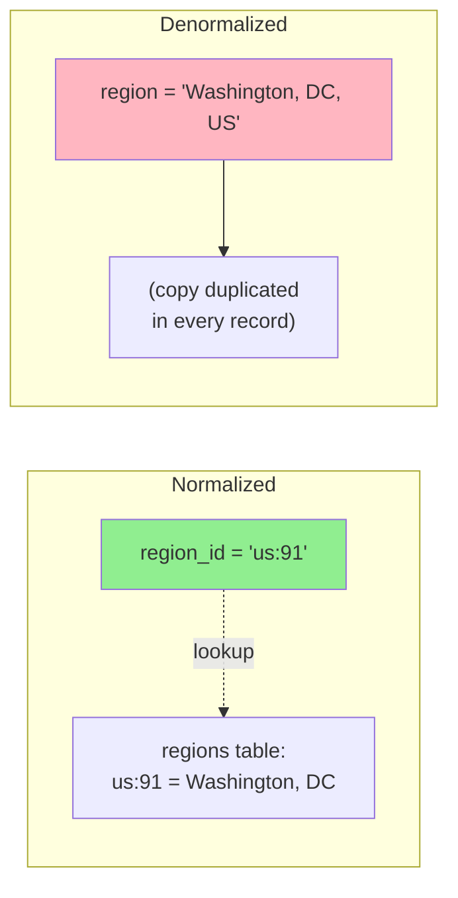

> **Normalized** data stores meaningful human-readable information in one place; everything else uses an ID (meaningless to humans, so it never needs to change).
> **Denormalized** data duplicates the human-meaningful information in every record that uses it.

The advantage of using an ID is that it has no meaning to humans and never needs to change. If information is duplicated, all redundant copies must be updated together — more code, more write operations, more disk space, and risk of inconsistency.

The downside of normalization is that every time you display a record containing an ID, you must do an additional lookup. In the relational model, this is done with a **join**:

```sql
SELECT users.*, regions.region_name
FROM users
JOIN regions ON users.region_id = regions.id
WHERE users.id = 251;
```

Document databases can store both normalized and denormalized data. They are often associated with denormalization because the JSON model makes additional denormalized fields easy to store, and weak join support in many document databases makes normalization inconvenient. Some document databases don't support joins at all, so you must perform them in application code: fetch the document containing the ID, then perform a second query to resolve that ID.

MongoDB supports joins via the `$lookup` operator in an aggregation pipeline:

```javascript
db.users.aggregate([
  { $match: { _id: 251 } },
  { $lookup: {
      from: "regions",
      localField: "region_id",
      foreignField: "_id",
      as: "region"
  } }
])
```

### Trade-offs of Normalization

In the résumé example, `region_id` is a reference to a standardized set of regions, but `organization` and `school_name` are plain strings (denormalized). Many people may have worked at the same company, but there is no ID linking them.

Should organization and school names be entities instead, with résumés referencing their IDs? The same arguments for region IDs apply here:

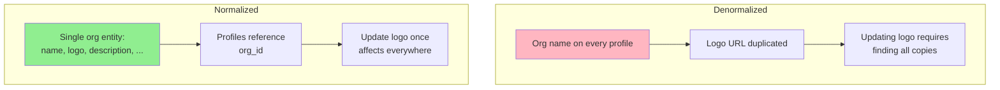

**General principle:**

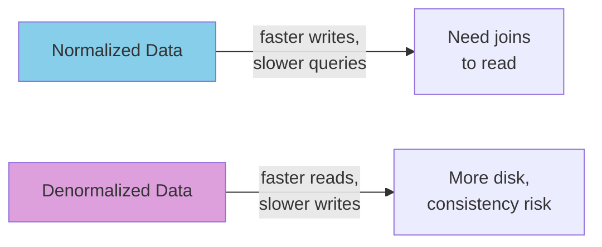

You can think of denormalization as a form of **derived data**, since you need a process for updating the redundant copies.

**Example: Twitter's Home Timelines** — In the social network case study, the join between posts and follows is too expensive, so Twitter precomputes and materializes timelines. The fan-out process that inserts a new post into followers' timelines is how the denormalized representation is kept consistent.

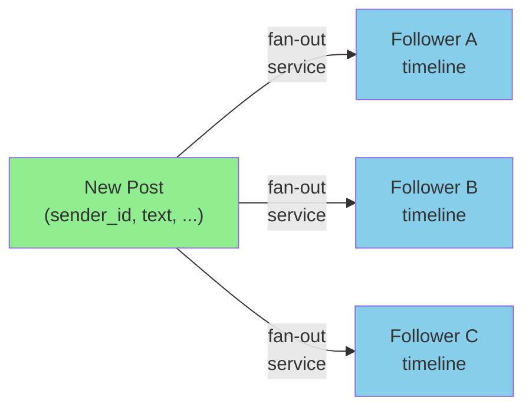

X (formerly Twitter) doesn't store the *full text* of each post in the materialized timeline; instead, each entry stores only the **post ID**, the **sender ID**, and small bits of identifying information for reposts and replies [Krikorian, QCon 2012]. This is essentially a precomputed result of:

```sql
SELECT posts.id, posts.sender_id FROM posts
JOIN follows ON posts.sender_id = follows.followee_id
WHERE follows.follower_id = current_user
ORDER BY posts.timestamp DESC
LIMIT 1000;
```

When the timeline is read, the service still performs two joins: it looks up the post ID to fetch the actual post content (and like/reply counts), and it looks up the sender's profile to get username, profile picture, etc. This process of looking up human-readable information by ID is called **hydrating the IDs** — essentially a join performed in application code.

> **Why store only IDs in the materialized timeline?** The data they refer to is fast-changing. Like counts may change multiple times per second on a popular post; users regularly change usernames and profile photos. The timeline should show the *latest* count and picture when viewed, so denormalizing these into the timeline itself would not make sense. Storing IDs keeps the materialized timeline small and current.

Hydrating IDs scales well because it parallelizes easily and the cost doesn't depend on the number of accounts you follow or are followed by. So having to perform joins when reading data is *not* an impediment to creating high-performance, scalable services.

> **Normalization and denormalization are not inherently good or bad.** They represent trade-offs in terms of read/write performance and implementation effort. Sometimes the most scalable approach involves denormalizing *some* things and leaving others normalized.

---

## 3. Many-to-One and Many-to-Many Relationships

The `positions` and `education` arrays in the LinkedIn profile are **one-to-many** (or **one-to-few**) relationships: one résumé has several positions, but each position belongs to only one résumé. The `region_id` field is a **many-to-one** relationship (many people live in the same region).

If we introduce entities for organizations and schools and reference them by ID, we get **many-to-many** relationships: one person may have worked for several organizations, and an organization has several past or present employees.

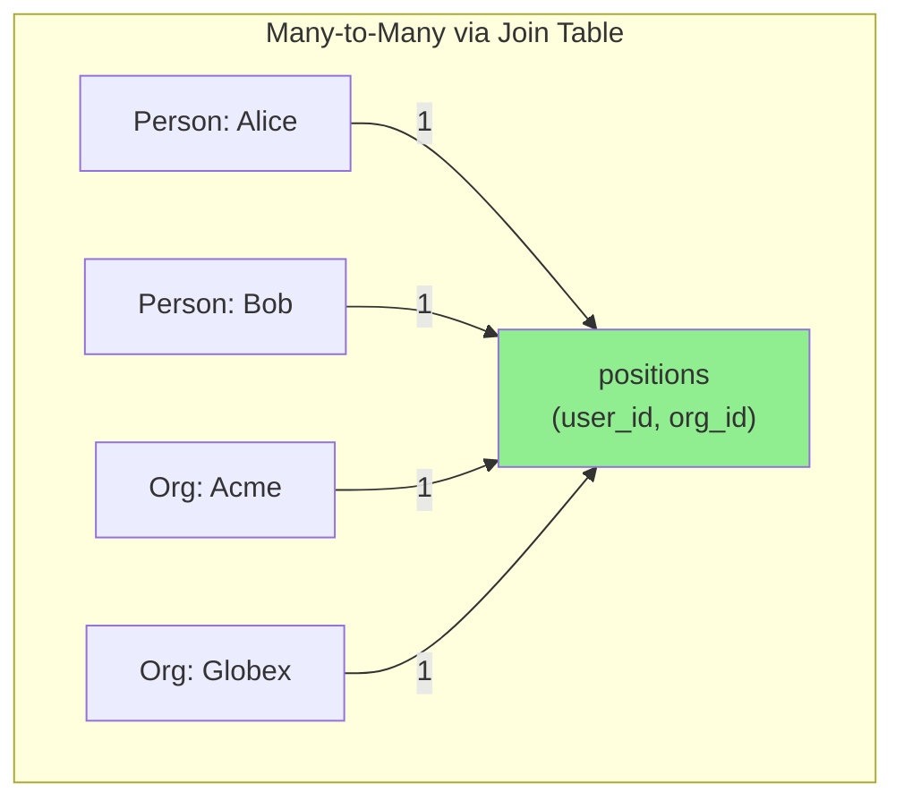

In the relational model, a many-to-many relationship is represented as an **associative table** (or **join table**): each row associates one user ID with one organization ID.

In the document model, a profile that references organizations by ID looks like this:

```json
{
  "user_id": 251,
  "first_name": "Barack",
  "last_name": "Obama",
  "positions": [
    {"start": 2009, "end": 2017, "job_title": "President", "org_id": 513},
    {"start": 2005, "end": 2008, "job_title": "US Senator (D-IL)", "org_id": 514}
  ]
}
```

Many-to-many relationships often need to be queried in **both directions** — finding all the organizations a person has worked for, and finding all the people who have worked at a particular organization. One approach is to store ID references on *both* sides (the résumé references each org, and the org references each résumé), but this representation is denormalized, since the relationship is stored in two places that could become inconsistent.

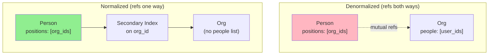

A normalized representation stores the relationship in only one place and relies on **secondary indexes** to allow the relationship to be efficiently queried in both directions. In the relational schema we tell the database to create indexes on both `user_id` and `org_id` columns of the positions table. In the document model, the database needs to index the `org_id` field of objects inside the positions array. Many document databases and relational databases with JSON support can create such indexes on values inside a document.

---

## 4. Stars and Snowflakes: Schemas for Analytics

Data warehouses are usually relational, with widely used conventions for table structure. The most common are:

- **Star schema**
- **Snowflake schema**
- **Dimensional modeling**
- **One Big Table (OBT)**

These structures are optimized for the needs of business analysts, and ETL processes translate data from operational systems into the selected schema.

### Star Schema

A star schema centers on a **fact table**, where each row represents an event that occurred at a particular time (e.g., a customer purchase of a product). Some columns are attributes (e.g., the price at which the product was sold); others are foreign-key references to **dimension tables**, which represent the *who, what, where, when, how, and why* of the event.

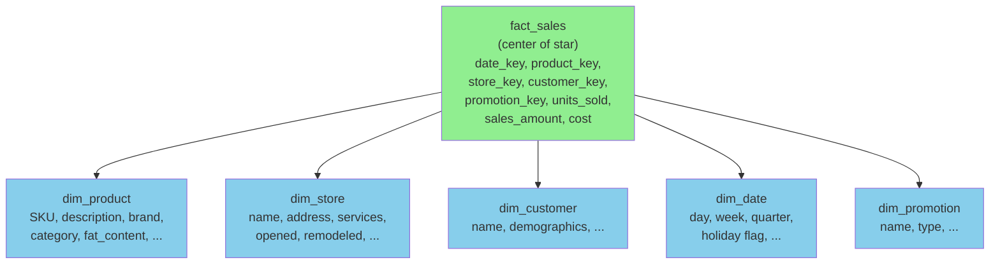

> **Why the name "star schema"?** When visualized, the fact table sits in the middle, surrounded by its dimension tables — the connections look like the rays of a star.

Fact tables can be enormous — a big enterprise may have **many petabytes** of transaction history, mostly as fact tables. They are often quite **wide**, sometimes several hundred columns.

Even **date and time** are often represented using dimension tables, because this allows additional information about dates (such as public holidays) to be encoded, enabling queries to differentiate between sales on holidays and non-holidays.

### Snowflake Schema

A variation of the star template is the **snowflake schema**, where dimensions are further broken into subdimensions. For example, instead of storing the brand and category as strings in `dim_product`, each row references separate tables for brands and product categories.

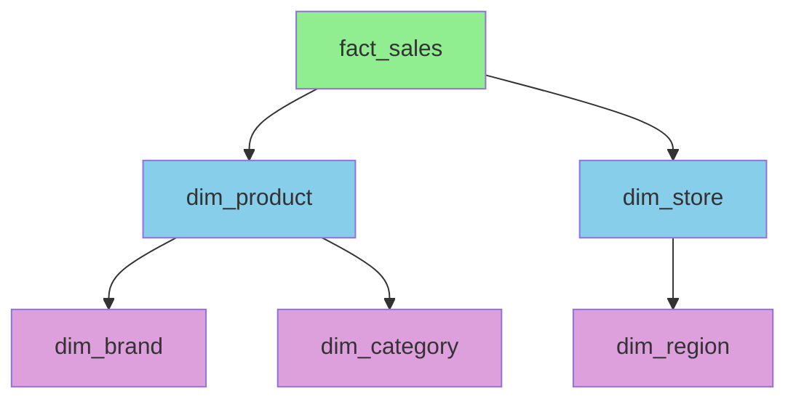

Snowflake schemas are more normalized than star schemas, but **star schemas are often preferred** because they are simpler for analysts to work with [Kimball & Ross, 2013].

Star and snowflake schemas consist mostly of **many-to-one** relationships (many sales occur for one particular product, in one particular store). In principle, other relationship types could exist, but they are often denormalized to simplify queries. For example, if a customer buys several products at once, that multi-item transaction is not represented explicitly; the fact table has a separate row for each product purchased, all sharing the same customer ID, store ID, and timestamp.

### One Big Table (OBT)

Some data warehouse schemas take denormalization even further and leave out the dimension tables entirely, folding dimension information into denormalized columns in the fact table. This **precomputes the join** between the fact and dimension tables. This approach is known as **One Big Table (OBT)**.

> **Why is denormalization acceptable in analytics?** The data typically represents a log of historical events that isn't going to change (except occasionally correcting an error). The issues of consistency and write overhead that plague denormalization in OLTP systems are not as pressing here.

---

## 5. When to Use Which Model

The main arguments in favor of the **document model** are:

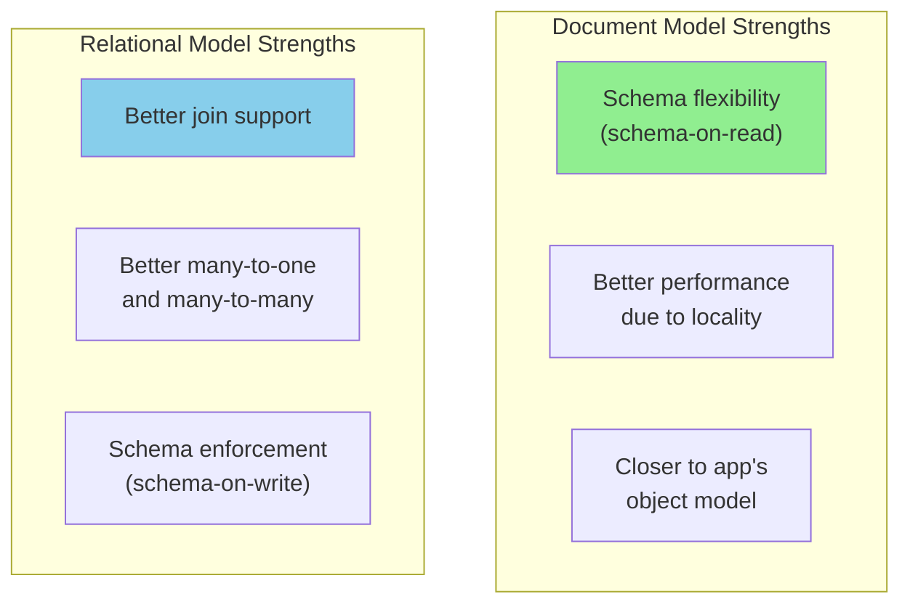

**If your data has a document-like structure** — a tree of one-to-many relationships, where typically the entire tree is loaded at once — the document model is a good idea. The relational technique of **shredding** (splitting a document-like structure into multiple tables like positions, education, and contact_info) can lead to cumbersome schemas and unnecessarily complicated application code.

**Limitations of the document model:**

- You cannot refer directly to a nested item within a document. Instead, you must say "the second item in the list of positions for user 251."
- If you need to reference nested items, the relational approach works better, since you can refer to any item directly by its ID.
- Some applications allow the user to choose the order of items (e.g., a to-do list or issue tracker). The document model supports this well, since items (or their IDs) can be stored in a JSON array to determine order. In relational databases there's no standard way to represent such reorderable lists, requiring tricks like sorting by an integer column (with renumbering on insertions), maintaining a linked list of IDs, or **fractional indexing** [Wallace, 2017; Greenspan, 2020].

### Schema Flexibility in the Document Model

Most document databases do not enforce any schema on the data in documents. **No schema** means that arbitrary keys and values can be added, and clients have no guarantees about what fields documents may contain when reading.

> Document databases are sometimes called **schemaless**, but that's misleading — the code that reads the data usually assumes some kind of structure. There is an **implicit schema**, but it is not enforced by the database [Fowler, 2013]. A more accurate term is **schema-on-read** (the structure of the data is implicit and interpreted only when the data is read), in contrast to **schema-on-write** (the traditional approach of relational databases, where the schema is explicit and the database ensures that all data conforms to it when written) [Awadallah, 2009].

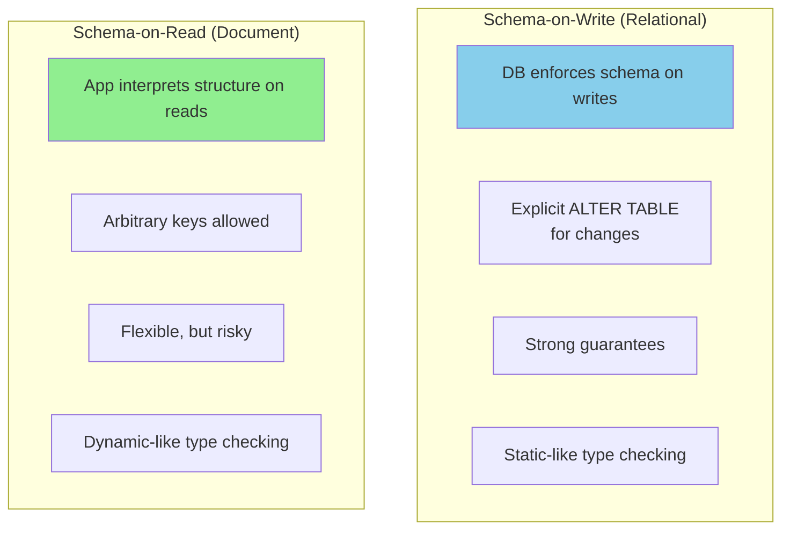

**Example: Splitting `name` into `first_name` and `last_name`**

In a schema-on-read database, you just start writing new documents with the new fields and have code in the application that handles old documents:

```javascript
if (user && user.name && !user.first_name) {
  // Documents written before Dec 8, 2023 don't have first_name
  user.first_name = user.name.split(" ")[0];
}
```

In a schema-on-write database, you'd typically perform a migration:

```sql
ALTER TABLE users ADD COLUMN first_name text DEFAULT NULL;
UPDATE users SET first_name = split_part(name, ' ', 1);   -- PostgreSQL
UPDATE users SET first_name = substring_index(name, ' ', 1);  -- MySQL
```

Adding a column with a default value is fast even on large tables, but the `UPDATE` is likely to be slow because every row needs to be rewritten.

**When is schema-on-read advantageous?**

- Many types of objects exist, and it's not practicable to put each type in its own table
- The structure is determined by external systems over which you have no control and which may change at any time

When all records are expected to have the same structure, schemas are a useful mechanism for documenting and enforcing that structure.

### Data Locality for Reads and Writes

A document is usually stored as a single continuous string (JSON, XML, or a binary variant like MongoDB's BSON). If your application often needs to access the entire document (e.g., to render it on a web page), this **storage locality** has a performance advantage. If data is split across multiple tables, multiple index lookups are required to retrieve it all, potentially requiring more disk seeks and taking more time.

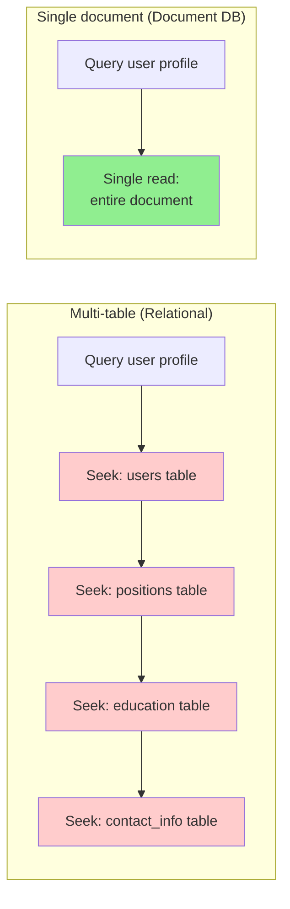

> **Caveat**: The locality advantage applies only if you need large parts of the document at the same time. The database typically loads the entire document, which can be wasteful if you need only a small part. On updates, the entire document usually needs to be rewritten. For these reasons, it's generally recommended to **keep documents fairly small** and avoid frequent small updates.

**Locality is not limited to the document model.** Google's Spanner allows a relational schema to declare that a table's rows should be **interleaved** (nested) within a parent table. Oracle's **multi-table index cluster tables** offer similar locality. The wide-column model (Bigtable, HBase, Accumulo) has **column families** with similar purposes.

### Query Languages for Documents

Most relational databases use SQL. Document databases are more varied: some allow only key-value access by primary key; others offer secondary indexes; some provide rich query languages.

XML databases are often queried using **XQuery** and **XPath**, which allow complex queries including joins across multiple documents, formatting results as XML. **JSON Pointer** (RFC 6901) and **JSONPath** (RFC 9535) provide equivalents to XPath for JSON. MongoDB's **aggregation pipeline**, with its `$lookup` operator for joins, is an example of a query language for collections of JSON documents.

**Example: Sharks per month (analytical aggregation)**

In PostgreSQL:

```sql
SELECT date_trunc('month', observation_timestamp) AS observation_month,
       sum(num_animals) AS total_animals
FROM observations
WHERE family = 'Sharks'
GROUP BY observation_month;
```

In MongoDB's aggregation pipeline:

```javascript
db.observations.aggregate([
  { $match: { family: "Sharks" } },
  { $group: {
      _id: {
        year: { $year: "$observationTimestamp" },
        month: { $month: "$observationTimestamp" }
      },
      totalAnimals: { $sum: "$numAnimals" }
  } }
]);
```

Both query languages are similar in expressiveness — the difference is mostly a matter of taste (English-sentence style vs. JSON syntax).

### Convergence of Document and Relational Databases

Document databases and relational databases started out as very different approaches, but they have grown more similar over time [Stonebraker & Pavlo, 2024]:

- Relational databases added support for JSON types, JSON query operators, and the ability to index properties inside documents
- Document databases (MongoDB, Couchbase, RethinkDB) added support for joins, secondary indexes, and declarative query languages

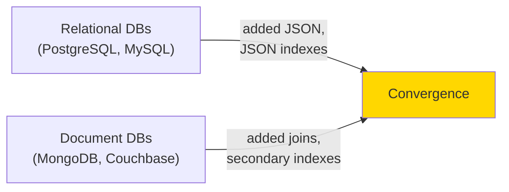

> This convergence is good news for application developers. Many document databases need relational-style references to other documents, and many relational databases have sections where schema flexibility is beneficial. **Relational–document hybrids** are a powerful combination.

Interestingly, Codd's original 1970 description of the relational model allowed something similar to JSON within a relational schema. He called them **nonsimple domains**: a value in a row doesn't have to be a primitive datatype; it can be a nested relation (table), allowing arbitrarily nested tree structures as values.

---

## 6. Graph-Like Data Models

We saw earlier that the type of relationships is an important distinguishing feature across data models. If your application has mostly **one-to-many** (tree-structured) relationships with few other relationships between records, the **document model** is appropriate.

But what if **many-to-many** relationships are very common in your data? The relational model handles simple cases, but as connections become more complex, it becomes more natural to model the data as a graph.

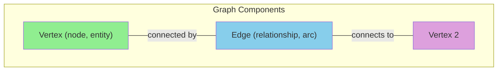

A graph consists of two kinds of objects: **vertices** (nodes, entities) and **edges** (relationships, arcs). Many kinds of data can be modeled as a graph:

| Application | Vertices | Edges |
|------------|---------|-------|
| **Social graph** | People | Who knows whom |
| **Web graph** | Web pages | HTML links to other pages |
| **Road/rail network** | Junctions | Roads or railway lines |

Well-known algorithms operate on these graphs: map navigation apps search for the shortest path between two points, and **PageRank** uses the web graph to determine web page popularity and search ranking [Page et al., 1999].

### Two Ways to Represent Graphs

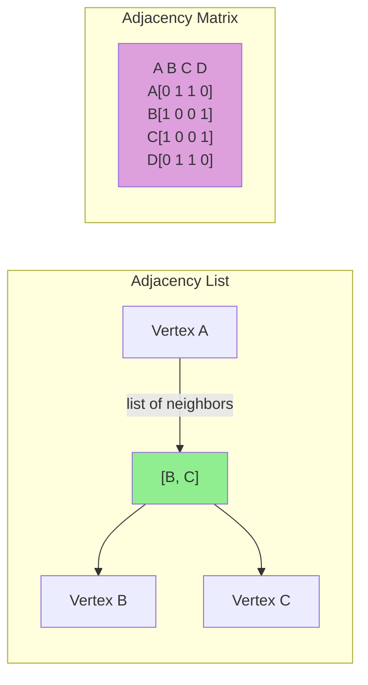

In the **adjacency list** model, each vertex stores the IDs of its neighbors one edge away. Adjacency lists are good for graph traversals. **Adjacency matrices** (two-dimensional arrays where rows and columns correspond to vertices) are good for machine learning applications (see "DataFrames, Matrices, and Arrays" below).

### Homogeneous vs. Heterogeneous Graphs

In the examples above, all vertices represent the same kind of thing (people, web pages, or junctions). But graphs are not limited to homogeneous data. An equally powerful use of graphs is to provide a consistent way to store **completely different types of objects** in a single database:

- **Facebook** maintains a single graph with many types of vertices (people, locations, events, check-ins, comments) and edges (friendships, check-ins, comments, event attendance) — Facebook's TAO is built on this model [Bronson et al., 2013]
- **Search engines** use **knowledge graphs** to record facts about entities that often occur in queries (organizations, people, places) [Noy et al., 2019]
- **Wikidata** publishes structured graph data

This section discusses the **property graph model** (Neo4j, Memgraph, KùzuDB) and the **triple store model** (Datomic, AllegroGraph, Blazegraph). We will also look at four query languages: **Cypher**, **SPARQL**, **Datalog**, and **GraphQL**, as well as SQL support for querying graphs.

As a running example, we use Figure 3-6 from the book: Lucy (born in Idaho) and Alain (from Saint-Lô, France), married, living in London. Each person and each location is a vertex; the relationships between them are edges.

```mermaid
graph TB
    LUCY["lucy<br/>(Person, born 1989)"]
    ALAIN["alain<br/>(Person, born 1989)"]
    IDAHO["idaho<br/>(Location: state)"]
    SAINTLO["stlo<br/>(Location: city, France)"]
    LONDON["london<br/>(Location: city)"]
    USA["usa<br/>(Location: country)"]
    FRANCE["france<br/>(Location: country)"]
    EUROPE["europe<br/>(Location: continent)"]
    NAMERICA["namerica<br/>(Location: continent)"]

    LUCY -->|"BORN_IN"| IDAHO
    LUCY -->|"LIVES_IN"| LONDON
    ALAIN -->|"BORN_IN"| SAINTLO
    ALAIN -->|"LIVES_IN"| LONDON
    LUCY -->|"MARRIED_TO"| ALAIN

    IDAHO -->|"WITHIN"| USA
    SAINTLO -->|"WITHIN"| FRANCE
    LONDON -->|"WITHIN"| EUROPE
    USA -->|"WITHIN"| NAMERICA
    FRANCE -->|"WITHIN"| EUROPE

    style LUCY fill:#90EE90
    style ALAIN fill:#90EE90
    style LONDON fill:#ffeb3b
```

---

## 7. Property Graphs

In the **property graph** (also known as labeled property graph) model, each vertex consists of:

- A unique identifier
- A label (string) describing the type of object
- A set of outgoing edges
- A set of incoming edges
- A collection of properties (key-value pairs)

Each edge consists of:

- A unique identifier
- The vertex where the edge starts (tail vertex)
- The vertex where the edge ends (head vertex)
- A label describing the kind of relationship
- A collection of properties (key-value pairs)

You can think of a graph store as two relational tables, one for vertices and one for edges (this schema uses PostgreSQL's `jsonb` datatype for properties):

```sql
CREATE TABLE vertices (
    vertex_id integer PRIMARY KEY,
    label text,
    properties jsonb
);

CREATE TABLE edges (
    edge_id integer PRIMARY KEY,
    tail_vertex integer REFERENCES vertices (vertex_id),
    head_vertex integer REFERENCES vertices (vertex_id),
    label text,
    properties jsonb
);

CREATE INDEX edges_tails ON edges (tail_vertex);
CREATE INDEX edges_heads ON edges (head_vertex);
```

```mermaid
graph LR
    subgraph "Property Graph Storage"
        VT["vertices table<br/>id, label, properties"]
        ET["edges table<br/>id, tail, head, label, properties"]
        VT -->|"head/tail FK"| ET
    end

    style VT fill:#90EE90
    style ET fill:#87CEEB
```

**Important aspects of this model:**

- Any vertex can have an edge connecting it to any other vertex. There is no schema that restricts which kinds of things can or cannot be associated
- Given any vertex, you can efficiently find both its incoming and outgoing edges and thus traverse the graph forward and backward (this is why indexes on both `tail_vertex` and `head_vertex` exist)
- By using different labels for different kinds of vertices and relationships, you can store several kinds of information in a single graph while maintaining a clean data model

The edges table is like the many-to-many associative table from relational modeling, generalized to allow many types of relationship in the same table. There may also be indexes on labels and properties.

> **Limitation of graph models**: An edge can associate only **two vertices**, whereas a relational join table can represent three-way or higher-degree relationships by having multiple foreign-key references on a single row. Such relationships can be represented in a graph by creating an additional vertex for each row of the join table with edges to/from it, or by using a **hypergraph**.

Graphs excel at modeling evolving data — you can extend the schema with new vertex types, edge types, and properties without restructuring existing data. For example, you could add food allergies by introducing a vertex for each allergen and an edge from a person to indicate an allergy, then link allergens to foods containing them — and then write queries like "what is safe for each person to eat?"

---

## 8. The Cypher Query Language

**Cypher** is a query language for property graphs, originally created for Neo4j and developed into an open standard as **openCypher** [Francis et al., 2018]. Besides Neo4j, it's supported by Memgraph, KùzuDB, Amazon Neptune, and Apache AGE (with storage in PostgreSQL). The name comes from a character in *The Matrix* and is not related to cryptography [Eifrem, 2014].

### Creating Data in Cypher

The left-hand portion of Figure 3-6, expressed as a Cypher query:

```cypher
CREATE
  (namerica :Location {name:'North America', type:'continent'}),
  (usa      :Location {name:'United States', type:'country' }),
  (idaho    :Location {name:'Idaho', type:'state' }),
  (lucy     :Person {name:'Lucy' }),
  (idaho) -[:WITHIN]->  (usa) -[:WITHIN]-> (namerica),
  (lucy)  -[:BORN_IN]-> (idaho)
```

Each vertex is given a **symbolic name** like `usa` or `idaho`. That name is not stored in the database but used only within the query to create edges. The arrow notation `(idaho) -[:WITHIN]-> (usa)` creates an edge labeled `WITHIN`, with `idaho` as the tail and `usa` as the head.

### Querying with Cypher

Suppose we want to find the names of all people who emigrated from the United States to Europe. We need vertices that have both a `BORN_IN` edge to a location within the US and a `LIVES_IN` edge to a location within Europe:

```cypher
MATCH
  (person) -[:BORN_IN]-> () -[:WITHIN*0..]-> (:Location {name:'United States'}),
  (person) -[:LIVES_IN]-> () -[:WITHIN*0..]-> (:Location {name:'Europe'})
RETURN person.name
```

The query can be read as:

```mermaid
graph TB
    L["Find any vertex 'person' such that:"]
    L --> A["person has BORN_IN edge<br/>to a location in the US<br/>(via zero or more WITHIN edges)"]
    L --> B["person also has LIVES_IN edge<br/>to a location in Europe"]
    L --> R["Return person.name"]

    style L fill:#90EE90
    style A fill:#87CEEB
    style B fill:#DDA0DD
```

The `[:WITHIN*0..]` expression means "follow a `WITHIN` edge, zero or more times" — like the `*` operator in a regular expression.

There are several possible ways to execute the query. The description suggests scanning all people, examining each birthplace and residence, and returning only those meeting the criteria. But equivalently, you could start with the two `Location` vertices and work backward: with an index on the `name` property, efficiently find the US and Europe vertices, follow all incoming `WITHIN` edges to find states/regions/cities, then look for people via incoming `BORN_IN` or `LIVES_IN` edges at those locations.

---

## 9. Graph Queries in SQL

Graph data can be represented in a relational database (as we just saw), but can we query it with SQL? **Yes, but with difficulty.** Every edge traversed in a graph query is effectively a join with the edges table. In a relational database you usually know in advance which joins you need; in a graph query you may need to traverse a variable number of edges.

The `() -[:WITHIN*0..]-> ()` pattern in Cypher expresses a **variable-length traversal**. In SQL, this requires recursive common table expressions (the `WITH RECURSIVE` syntax). The same query becomes ~30 lines of SQL:

```sql
WITH RECURSIVE
  -- in_usa: vertex IDs of all locations within the United States
  in_usa(vertex_id) AS (
    SELECT vertex_id FROM vertices
    WHERE label = 'Location' AND properties->>'name' = 'United States'
    UNION
    SELECT edges.tail_vertex FROM edges
    JOIN in_usa ON edges.head_vertex = in_usa.vertex_id
    WHERE edges.label = 'within'
  ),
  -- in_europe: vertex IDs of all locations within Europe
  in_europe(vertex_id) AS (
    SELECT vertex_id FROM vertices
    WHERE label = 'location' AND properties->>'name' = 'Europe'
    UNION
    SELECT edges.tail_vertex FROM edges
    JOIN in_europe ON edges.head_vertex = in_europe.vertex_id
    WHERE edges.label = 'within'
  ),
  -- born_in_usa: vertex IDs of all people born in the US
  born_in_usa(vertex_id) AS (
    SELECT edges.tail_vertex FROM edges
    JOIN in_usa ON edges.head_vertex = in_usa.vertex_id
    WHERE edges.label = 'born_in'
  ),
  -- lives_in_europe: vertex IDs of all people living in Europe
  lives_in_europe(vertex_id) AS (
    SELECT edges.tail_vertex FROM edges
    JOIN in_europe ON edges.head_vertex = in_europe.vertex_id
    WHERE edges.label = 'lives_in'
  )
SELECT vertices.properties->>'name'
FROM vertices
JOIN born_in_usa     ON vertices.vertex_id = born_in_usa.vertex_id
JOIN lives_in_europe ON vertices.vertex_id = lives_in_europe.vertex_id;
```

```mermaid
graph LR
    subgraph "Query Complexity"
        C["4-line Cypher query"]
        S["31-line SQL query"]
        C -->|"2x diff"| S
    end

    style C fill:#90EE90
    style S fill:#ffcccc
```

> **The fact that a 4-line Cypher query requires 31 lines in SQL shows how much of a difference the right choice of data model and query language can make.** This is just the beginning; there are more details to consider around handling cycles and choosing between breadth-first and depth-first traversal [Tisiot, 2021].

Other SQL extensions for recursive queries include Oracle's **hierarchical queries**. Other graph query languages include TigerGraph's GSQL and the **Property Graph Query Language (PGQL)** [van Rest et al., 2016]. The **Graph Query Language (GQL)** ISO standard, based on Cypher, was published in 2024 [Rathle & Bebee, 2024; Deutsch et al., 2022; Green, 2019].

---

## 10. Triple Stores and SPARQL

The **triple store model** is mostly equivalent to the property graph model, using different words to describe the same ideas. It is nevertheless worth discussing because various tools and languages for triple stores can be valuable additions.

In a triple store, all information is stored in very simple three-part statements: `(subject, predicate, object)`. For example, `(Jim, likes, bananas)` has Jim as the subject, `likes` as the predicate, and `bananas` as the object.

```mermaid
graph LR
    TRIPLE["(subject, predicate, object)"]

    TRIPLE --> S1["Jim"]
    TRIPLE --> P1["likes"]
    TRIPLE --> O1["bananas"]

    style TRIPLE fill:#90EE90
```

> Many triple-like databases store extra metadata. AWS Neptune uses **quads** (4-tuples) by adding a graph ID to each triple. Datomic uses **5-tuples** extending each triple with a transaction ID and a Boolean for deletion. Since they retain the basic subject-predicate-object structure, we still call them triple stores.

The subject of a triple is equivalent to a vertex. The object is one of two things:

1. A **primitive datatype value** (string, number). In that case, the predicate and object are equivalent to a key-value property on the subject vertex (e.g., `(lucy, birthYear, 1989)` is `lucy {"birthYear": 1989}`)
2. **Another vertex** in the graph. In that case, the predicate is an edge, the subject is the tail, and the object is the head (e.g., `(lucy, marriedTo, alain)`)

### The Turtle Format

A subset of the running example, expressed in **Turtle** (a subset of Notation3 / N3):

```turtle
@prefix : <urn:example:>.

_:lucy     a :Person; :name "Lucy"; :bornIn _:idaho.
_:idaho    a :Location; :name "Idaho"; :type "state"; :within _:usa.
_:usa      a :Location; :name "United States"; :type "country"; :within _:namerica.
_:namerica a :Location; :name "North America"; :type "continent".
```

Vertices are written as `_:someName`. The name doesn't mean anything outside the file; it exists only so we know which triples refer to the same vertex. When the predicate is a property, the object is a string literal; when it's an edge, the object is a vertex. The `;` syntax lets you say multiple things about the same subject compactly.

### The Semantic Web

Some triple-store research was motivated by the **Semantic Web**, an early-2000s effort to facilitate internet-wide data exchange by publishing data in a standardized, machine-readable format. Although the Semantic Web as originally envisioned did not succeed [Target, 2018; Mendel-Gleason, 2022], its legacy lives on in:

- **JSON-LD** (linked data) [Sporny, 2014]
- **Biomedical ontologies** [University of Michigan Library]
- **Facebook's Open Graph protocol** (used for link unfurling [Haughey, 2015])
- **Knowledge graphs** like Wikidata
- Standardized vocabularies maintained by Schema.org

Triple stores are another Semantic Web technology that has found use outside its original use case; even if you have no interest in the Semantic Web, triples can be a good internal data model for applications.

### The RDF Data Model

Turtle is a way of encoding data in the **Resource Description Framework (RDF)** [W3C RDF Working Group, 2004]. RDF data can also be encoded in (more verbose) XML:

```xml
<rdf:RDF xmlns="urn:example:"
         xmlns:rdf="http://www.w3.org/1999/02/22-rdf-syntax-ns#">
  <Location rdf:nodeID="idaho">
    <name>Idaho</name>
    <type>state</type>
    <within>
      <Location rdf:nodeID="usa">
        <name>United States</name>
        <type>country</type>
        <within>
          <Location rdf:nodeID="namerica">
            <name>North America</name>
            <type>continent</type>
          </Location>
        </within>
      </Location>
    </within>
  </Location>
  <Person rdf:nodeID="lucy">
    <name>Lucy</name>
    <bornIn rdf:nodeID="idaho"/>
  </Person>
</rdf:RDF>
```

RDF has a few quirks because it's designed for internet-wide data exchange: subjects, predicates, and objects are often **URIs** (e.g., `<http://my-company.com/namespace#within>`) so that you can combine your data with someone else's without conflict if they use different meanings for the same word. The URL doesn't need to resolve to anything; from RDF's perspective it's simply a namespace.

### The SPARQL Query Language

**SPARQL** (pronounced "sparkle") is the query language for triple stores using RDF [Harris et al., 2013]. It predates Cypher, and Cypher's pattern matching is borrowed from SPARQL, so they look quite similar.

The same "find people who emigrated from the US to Europe" query in SPARQL:

```sparql
PREFIX : <urn:example:>
SELECT ?personName WHERE {
  ?person :name ?personName.
  ?person :bornIn / :within* / :name "United States".
  ?person :livesIn / :within* / :name "Europe".
}
```

The structure is very similar. The following are equivalent:

```cypher
# Cypher
(person) -[:BORN_IN]-> () -[:WITHIN*0..]-> (location)
```

```sparql
# SPARQL
?person :bornIn / :within* ?location.
```

Because RDF doesn't distinguish between properties and edges but uses predicates for both, the same syntax matches properties. The variable `usa` is bound to any vertex with a `name` property whose value is "United States":

```cypher
(usa {name:'United States'})   # Cypher
```

```sparql
?usa :name "United States".    # SPARQL
```

SPARQL is supported by Amazon Neptune, AllegroGraph, Blazegraph, OpenLink Virtuoso, Apache Jena, and others.

---

## 11. Datalog: Recursive Relational Queries

**Datalog** is much older than SPARQL or Cypher, arising from academic research in the 1980s [Green et al., 2013; Ceri et al., 1989; Abiteboul et al., 1995]. It is less well-known among software engineers and not widely supported in mainstream databases, but it ought to be better known because it's a very expressive language especially powerful for complex queries. Niche databases that use Datalog include **Datomic**, **LogicBlox**, **CozoDB**, and LinkedIn's **LIquid** [Meyer et al., 2020].

Datalog is based on a relational data model, not a graph, but we discuss it here because recursive queries on graphs are a particular strength of Datalog.

### Facts and Rules

The contents of a Datalog database are known as **facts**, and each fact corresponds to a row in a relational table. The statement `table(val1, val2, ...)` means that `table` contains a row where the first column contains `val1`, the second column contains `val2`, etc.

The running example as Datalog facts:

```prolog
location(1, "North America", "continent").
location(2, "United States", "country").
location(3, "Idaho", "state").
within(2, 1).     /* US is in North America */
within(3, 2).     /* Idaho is in the US */
person(100, "Lucy").
born_in(100, 3).  /* Lucy was born in Idaho */
```

### Building Up the Query

Now we can write the same migration query, but rule by rule:

```prolog
/* Rule 1: Direct containment */
within_recursive(LocID, PlaceName) :- location(LocID, PlaceName, _).

/* Rule 2: Transitive closure via WITHIN edges */
within_recursive(LocID, PlaceName) :- within(LocID, ViaID),
                                      within_recursive(ViaID, PlaceName).

/* Rule 3: Find people who migrated */
migrated(PName, BornIn, LivingIn) :- person(PersonID, PName),
                                      born_in(PersonID, BornID),
                                      within_recursive(BornID, BornIn),
                                      lives_in(PersonID, LivingID),
                                      within_recursive(LivingID, LivingIn).

/* Rule 4: Filter for US → Europe migration */
us_to_europe(Person) :- migrated(Person, "United States", "Europe").
```

```mermaid
graph TB
    F["Base Facts:<br/>location, within,<br/>person, born_in"]
    F --> R1["Rule 1:<br/>within_recursive base case"]
    F --> R2["Rule 2:<br/>within_recursive recursive case"]
    R1 --> R3["Rule 3:<br/>migrated"]
    R2 --> R3
    R3 --> R4["Rule 4:<br/>us_to_europe"]
    R4 --> OUT["Result: us_to_europe contains 'Lucy'"]

    style F fill:#87CEEB
    style R4 fill:#90EE90
```

Cypher and SPARQL jump in right away with `SELECT`, but Datalog takes a small step at a time. We define **rules** that derive new virtual tables from the underlying facts. These derived tables are like SQL views: not stored in the database, but queryable as if they were tables of stored facts.

In Example 3-12 we define three derived tables: `within_recursive`, `migrated`, and `us_to_europe`. The names and columns of virtual tables are defined by what appears before the `:-` symbol in each rule.

**One possible way of applying the rules:**

1. `location(1, "North America", "continent")` exists, so rule 1 applies, generating `within_recursive(1, "North America")`
2. `within(2, 1)` exists and the previous step generated `within_recursive(1, "North America")`, so rule 2 applies, generating `within_recursive(2, "North America")`
3. `within(3, 2)` exists and rule 2 applies, generating `within_recursive(3, "North America")`

By repeated application of rules 1 and 2, the `within_recursive` virtual table contains all locations in North America. Rule 3 then finds people born in some `BornIn` and living in some `LivingIn`. Rule 4 invokes rule 3 with `BornIn = 'United States'` and `LivingIn = 'Europe'`, returning only matching names. Querying the contents of `us_to_europe` yields "Lucy" — the same answer as Cypher and SPARQL.

> **Datalog requires a different kind of thinking.** It allows complex queries to be built up rule by rule, with one rule referring to others — similarly to how you break code into functions that call each other. Just as functions can be recursive, Datalog rules can invoke themselves, like rule 2 — enabling graph traversals in Datalog.

---

## 12. GraphQL

**GraphQL** is a query language that is much more restrictive than the others in this chapter. It is intended for OLTP queries; its purpose is to allow client software running on a user's device (mobile app or JavaScript frontend) to request a JSON document with a particular structure, containing the fields necessary for rendering its UI.

GraphQL interfaces allow developers to rapidly change queries in client code without changing server-side APIs. That flexibility comes at a cost, however:

- Organizations that adopt GraphQL often need tooling to convert the queries into requests to internal services (commonly using REST or gRPC)
- Authorization, rate limiting, and performance are additional concerns [Bessey, 2024]

The language is intentionally limited because GraphQL queries come from untrusted sources:

```mermaid
graph TB
    subgraph "GraphQL Restrictions"
        R1["✗ No recursive queries<br/>(unlike Cypher, SPARQL,<br/>SQL, Datalog)"]
        R2["✗ No arbitrary search<br/>conditions unless explicitly<br/>offered by the service"]
        R3["✓ Designed for untrusted<br/>client queries"]
    end

    style R1 fill:#ffcccc
    style R2 fill:#ffcccc
    style R3 fill:#90EE90
```

GraphQL is useful, though. Consider a group chat application like Discord or Slack. The query requests all channels the user has access to, including the channel name and the 50 most recent messages. For each message, the query requests timestamp, content, the name and profile picture URL of the sender. If a message is a reply, the query also requests the name and content of the replied-to message:

```graphql
query ChatApp {
  channels {
    name
    recentMessages(latest: 50) {
      timestamp
      content
      sender {
        fullName
        imageUrl
      }
      replyTo {
        content
        sender {
          fullName
        }
      }
    }
  }
}
```

A possible response (mirrors the structure of the query):

```json
{
  "data": {
    "channels": [
      {
        "name": "#general",
        "recentMessages": [
          {
            "timestamp": 1693143014,
            "content": "Hey! How are y'all doing?",
            "sender": {"fullName": "Aaliyah", "imageUrl": "https://..."},
            "replyTo": null
          },
          {
            "timestamp": 1693143024,
            "content": "Great! And you?",
            "sender": {"fullName": "Caleb", "imageUrl": "https://..."},
            "replyTo": {
              "content": "Hey! How are y'all doing?",
              "sender": {"fullName": "Aaliyah"}
            }
          }
        ]
      }
    ]
  }
}
```

The response contains exactly the attributes requested — no more, no less. The server doesn't need to know which attributes the client requires; the client simply requests what it needs. Adding a `profilePictureUrl` to the sender of a `replyTo` message is just a one-line change to the client query — no server change needed.

> **Duplication is acceptable**: If the same user sends multiple messages, the name and image URL are repeated in each message. GraphQL makes the design choice to accept larger response sizes to make rendering simpler.

The server can store the data in a more normalized form (e.g., a message with the user ID of the sender and the ID of the message it replies to) and perform the joins to process the query. However, only joins **explicitly declared in the GraphQL schema** can be requested by the client.

Even though the response looks similar to a document database response, and even though "graph" is in its name, **GraphQL can be implemented on top of any type of database** — relational, document, or graph.

---

## 13. Event Sourcing and CQRS

In all the data models we have discussed so far, data is queried in the same form as it is written — JSON documents, table rows, or graph vertices and edges. However, in complex applications it can be difficult to find a single representation that satisfies all the ways data needs to be queried and presented. In such cases, it can be beneficial to **write data in one form and then derive from it representations optimized for different types of reads**.

We previously saw this idea in *Systems of Record and Derived Data*, and ETL is one example. Now we take the idea further: **if we are going to derive one data representation from another anyway, we can choose different representations optimized for writing and reading, respectively.**

> How would you model your data if you wanted to optimize it for *only* writing, and if efficient queries were of no concern?

**Perhaps the simplest, fastest, and most expressive way of writing data is an event log**: every time you want to write some data, you encode it as a self-contained string (perhaps JSON), including a timestamp, and append it to a sequence of events. Events are **immutable**: you never change or delete them, only append more events (which may supersede earlier ones).

```mermaid
graph LR
    C1["Customer booked<br/>seat (2024-01-01)"]
    C2["Customer canceled<br/>booking (2024-01-15)"]
    C3["Organizer increased<br/>room capacity (2024-02-01)"]

    C1 --> LOG[("Immutable<br/>Event Log")]
    C2 --> LOG
    C3 --> LOG

    LOG -->|"fan-out<br/>service"| V1["View 1:<br/>Available seats"]
    LOG -->|"fan-out<br/>service"| V2["View 2:<br/>Dashboard charts"]
    LOG -->|"fan-out<br/>service"| V3["View 3:<br/>Badge files<br/>for printer"]

    style LOG fill:#90EE90
    style V1 fill:#87CEEB
    style V2 fill:#87CEEB
    style V3 fill:#87CEEB
```

### Conference Management Example

A conference is a complex business domain: individual attendees can register and pay by card; companies can order seats in bulk, pay by invoice, and later assign seats to individuals; some seats are reserved for speakers, sponsors, and volunteers; reservations can be canceled; the organizer might change capacity by moving to a different room. With all this, simply calculating available seats becomes a challenging query.

In Figure 3-8, every change to the conference state (organizer opening registrations, attendees making and canceling reservations) is first stored as an event. Whenever an event is appended to the log, several **materialized views** (also known as **projections** or **read models**) are updated to reflect the effect of that event. One view collects all information about each booking's status; another computes dashboard charts; a third generates files for the printer producing attendees' badges.

### Key Concepts

- **Event sourcing**: Using events as the source of truth and expressing every state change as an event [Betts et al., 2012; Young, 2014]
- **Command query responsibility segregation (CQRS)**: Maintaining separate read-optimized representations and deriving them from the write-optimized representation [Young, 2010]

Both terms originated in the DDD (Domain-Driven Design) community, though similar ideas have been around for a long time (e.g., state machine replication).

When a request from a user comes in, it is called a **command** and must first be validated. Once the command has been executed and determined to be valid (e.g., there were enough seats), it becomes a **fact**, and the corresponding event is added to the log. The event log should contain only valid events, and a consumer building a materialized view cannot reject an event.

> When modeling your data in an event-sourcing style, **name events in the past tense** (e.g., "the seats were booked"). An event is a record of the fact that something *has happened*. Even if the user later changes their mind, the fact remains true that they formerly held a booking, and the change or cancellation is a separate event added later.

### Similarity to Star Schemas

A star schema fact table is also a collection of events that happened in the past. However:

- Rows in a fact table all have the same set of columns
- In event sourcing, there may be **many event types**, each with different properties
- A fact table is **unordered**; in event sourcing, the **order** of events is important — if a booking is first made and then canceled, processing those events in the wrong order doesn't make sense

### Example: Event Sourcing in Python

A simple Python implementation of an event-sourced conference seat counter:

```python
import json
from dataclasses import dataclass, asdict, field
from datetime import datetime
from typing import List, Dict, Any


@dataclass
class Event:
    """An immutable fact stored in the event log."""
    timestamp: str
    type: str
    data: Dict[str, Any] = field(default_factory=dict)

    def to_json(self) -> str:
        return json.dumps(asdict(self))


class EventLog:
    """Append-only log of immutable events."""
    def __init__(self):
        self.events: List[Event] = []

    def append(self, event: Event) -> None:
        # Events are never modified or deleted
        self.events.append(event)

    def all_events(self) -> List[Event]:
        return list(self.events)


class AvailableSeatsView:
    """Materialized view: how many seats are still available."""
    def __init__(self, capacity: int, log: EventLog):
        self.capacity = capacity
        self.log = log
        self._recompute()

    def handle(self, event: Event) -> None:
        """Apply a single event to update the view incrementally."""
        if event.type == "SeatsBooked":
            self.booked += event.data["count"]
        elif event.type == "BookingCancelled":
            self.booked -= event.data["count"]
        elif event.type == "CapacityChanged":
            self.capacity = event.data["new_capacity"]

    def seats_available(self) -> int:
        return self.capacity - self.booked

    def _recompute(self) -> None:
        """Recompute from scratch by replaying all events."""
        self.booked = 0
        for event in self.log.all_events():
            self.handle(event)


# Demonstration
log = EventLog()
view = AvailableSeatsView(capacity=100, log=log)

# Append events (commands have been validated and become facts)
log.append(Event(datetime.now().isoformat(), "SeatsBooked",
                 {"count": 30}))
log.append(Event(datetime.now().isoformat(), "SeatsBooked",
                 {"count": 25}))
log.append(Event(datetime.now().isoformat(), "BookingCancelled",
                 {"count": 10}))
log.append(Event(datetime.now().isoformat(), "CapacityChanged",
                 {"new_capacity": 120}))

# View reflects all events: 120 - (30 + 25 - 10) = 75 seats available
print(f"Available seats: {view.seats_available()}")  # 75

# We can rebuild the view from scratch at any time
view2 = AvailableSeatsView(capacity=100, log=log)
print(f"Rebuilt view available seats: {view2.seats_available()}")  # 75
```

### Advantages of Event Sourcing and CQRS

```mermaid
graph TB
    A1["✓ Events communicate intent<br/>('booking canceled' vs.<br/>'UPDATE bookings SET active=false')"]
    A2["✓ Reproducible views:<br/>delete & recompute from log"]
    A3["✓ Multiple read-optimized<br/>materialized views"]
    A4["✓ Easy evolution:<br/>new views from old events"]
    A5["✓ Compensating events<br/>for corrections"]
    A6["✓ Audit log for compliance"]
    A7["✓ High write throughput<br/>(sequential, log-shaped)"]

    style A1 fill:#90EE90
    style A2 fill:#90EE90
    style A3 fill:#90EE90
    style A4 fill:#90EE90
    style A5 fill:#90EE90
    style A6 fill:#90EE90
    style A7 fill:#90EE90
```

- **Intent is clearer**: "the booking was canceled" is easier to understand than "row 4001's `active` column was set to false, three rows were deleted from `seat_assignments`, and a refund row was inserted into `payments`"
- **Reproducibility**: Materialized views are derived from the event log in a reproducible way. Always delete the view and recompute by processing the same events in the same order with the same code. If there was a bug in view maintenance, fix it and rebuild.
- **Multiple views**: Different materialized views optimized for particular queries, using any data model, stored anywhere. They can be denormalized for fast reads, or kept only in memory (recomputed from the log at startup).
- **Easy evolution**: Build new views from existing event logs. Add new event types or new properties to existing ones. Chain new behaviors off existing events (e.g., when an attendee cancels, offer their seat to the next person on the waiting list).
- **Reversibility**: If an event was written in error, write a subsequent deletion event. Downstream views incorporate the deletion automatically — easier than reversing a committed database transaction.
- **Audit log**: The event log is also an audit log of what occurred, valuable in regulated industries.
- **High write throughput**: Event logs handle higher write throughput than databases because of sequential access patterns. Bursts can be absorbed, and downstream view maintenance catches up at its own pace.

### Downsides

```mermaid
graph TB
    D1["⚠ External information<br/>(e.g., exchange rates)<br/>must be in the event<br/>for deterministic recomputation"]
    D2["⚠ Immutability conflicts<br/>with GDPR right-to-delete"]
    D3["⚠ Reprocessing can trigger<br/>visible side effects<br/>(don't resend emails)"]

    style D1 fill:#ffcccc
    style D2 fill:#ffcccc
    style D3 fill:#ffcccc
```

- **External information**: If an event contains a price in one currency and a view needs to convert it, fetching the exchange rate when processing the event would yield a different result if recomputed on another date. To make event processing deterministic, include the exchange rate in the event itself, or have a way to query the historical exchange rate at the event's timestamp.
- **GDPR and personal data**: The requirement that events are immutable creates problems with personal data and users' right to deletion. If the log is per-user, you can delete the whole log for that user, but that doesn't work if events relate to multiple users. You can store personal data outside the event or encrypt it with a deletable key (**crypto-shredding** [Robinson, 2019]) — but that makes it harder to recompute derived state.
- **Side effects on reprocessing**: Reprocessing events requires care if there are externally visible side effects — you don't want to resend confirmation emails every time you rebuild a materialized view.

You can implement event sourcing on top of any database, but some systems are designed for this pattern: **EventStoreDB**, **MartenDB** (based on PostgreSQL), **Axon Framework**. You can also use message brokers like **Apache Kafka** to store the event log, with stream processors keeping materialized views up-to-date (we'll return to this in Chapter 12).

> **The only important requirement** is that the event storage system must guarantee that all materialized views process events in exactly the same order as they appear in the log. As we will see in Chapter 10, this is not always easy in a distributed system.

---

## 14. DataFrames, Matrices, and Arrays

The data models discussed so far are used for both transaction processing and analytics. There are also a few data models you will likely encounter in an analytical or scientific context but rarely in OLTP systems: **DataFrames** and multidimensional arrays of numbers (matrices).

The **DataFrame** data model is supported by the **R language**, the **Pandas library** for Python, **Apache Spark**, **ArcticDB**, **Dask**, and other systems. DataFrames are a popular tool for data scientists preparing data for ML models; they are also widely used for data exploration, statistical data analysis, and visualization.

At first glance, a DataFrame is similar to a relational table or spreadsheet. A DataFrame supports relational-like operators for bulk operations on its contents:

- Applying a function to all rows
- Filtering rows based on a condition
- Grouping rows by some columns and aggregating others
- Joining (called **merge** in DataFrame-speak) rows from one DataFrame with another

```mermaid
graph TB
    DF["DataFrame<br/>(tabular, in-memory)"]

    DF --> O1["Apply functions"]
    DF --> O2["Filter rows"]
    DF --> O3["Group by + Aggregate"]
    DF --> O4["Merge (join)"]

    style DF fill:#90EE90
```

> Instead of using a declarative query language like SQL, a DataFrame is generally manipulated through a series of commands that modify its structure and content. This matches the typical workflow of data scientists, who incrementally "wrangle" data into a form that allows them to find answers to their questions. These manipulations usually take place on the data scientist's private copy, often on their local machine.

DataFrame APIs also offer operations that go far beyond what relational databases provide, and the data model is often used in very different ways from typical relational data modeling [Petersohn et al., 2020]. For example, a common use is to transform data from a relational-like representation into a matrix or multidimensional array — the form in which many ML algorithms expect their input.

### From Relational Table to Matrix

A simple example: a relational table of user ratings of movies (1 to 5) on the left, transformed into a matrix on the right, where each column is a movie and each row is a user (similar to a pivot table).

```mermaid
graph LR
    subgraph "Relational (Long Format)"
        T["user_id, movie_id, rating<br/>1, 1, 5<br/>1, 3, 4<br/>2, 1, 3<br/>2, 2, 4<br/>3, 2, 5<br/>3, 3, 2"]
    end

    subgraph "Matrix (Wide Format)"
        M["            Movie1 Movie2 Movie3<br/>User1   [   5      -      4  ]<br/>User2   [   3      4      -  ]<br/>User3   [   -      5      2  ]"]
    end

    T -->|"pivot / sparse matrix"| M

    style T fill:#87CEEB
    style M fill:#DDA0DD
```

The matrix is **sparse** (many missing values), which is fine. It may have many thousands of columns and would not fit well in a relational database, but DataFrames and libraries like NumPy can handle such data easily.

### From Data to ML-Ready Numbers

A matrix can contain only numbers. Various techniques transform non-numerical data into numbers:

- **Dates**: Scale to floating-point numbers within a suitable range
- **Categorical values** (e.g., movie genre): Use **one-hot encoding** — create a column for each possible value ("comedy", "drama", "horror"), and for each movie put a 1 in the column for its genre and 0 in all others. This generalizes to movies in multiple genres.

Once the data is a matrix of numbers, it's amenable to **linear algebra operations**, which form the basis of many ML algorithms. The data could be part of a movie recommendation system.

### Example: Pandas-Style DataFrame Workflow

```python
import pandas as pd
import numpy as np


# Simulated movie ratings data (relational-like)
ratings = pd.DataFrame({
    "user_id": [1, 1, 2, 2, 3, 3],
    "movie_id": [1, 3, 1, 2, 2, 3],
    "rating":  [5, 4, 3, 4, 5, 2],
    "genre":   ["drama", "comedy", "drama",
                "action", "action", "comedy"],
})

# 1. Filter rows: high ratings only
high_ratings = ratings[ratings["rating"] >= 4]

# 2. Group by movie and aggregate
movie_stats = (ratings
               .groupby("movie_id")
               .agg(avg_rating=("rating", "mean"),
                    num_ratings=("rating", "count")))

# 3. Merge with a movies table (relational-style join)
movies = pd.DataFrame({
    "movie_id": [1, 2, 3],
    "title":    ["Dune", "Mad Max", "Barbie"],
    "year":     [2021, 2015, 2023],
})
joined = movie_stats.merge(movies, on="movie_id")

# 4. Pivot to a matrix (wide format) for ML
user_movie_matrix = ratings.pivot_table(
    index="user_id",
    columns="movie_id",
    values="rating",
)
print(user_movie_matrix)
# movie_id    1    2    3
# user_id
# 1          5.0  NaN  4.0
# 2          3.0  4.0  NaN
# 3          NaN  5.0  2.0

# 5. One-hot encode the genre for ML input
genre_oh = pd.get_dummies(ratings["genre"], prefix="genre")
ratings_encoded = pd.concat([ratings[["user_id", "movie_id", "rating"]],
                              genre_oh], axis=1)

# 6. Convert to a NumPy matrix for linear algebra
matrix = ratings_encoded.fillna(0).to_numpy()
print(f"ML-ready matrix shape: {matrix.shape}")
```

DataFrames are flexible enough to allow data to be gradually evolved from a relational form into a matrix representation, giving the data scientist control over the representation most suitable for the analysis or model training process.

### Specialized Array Databases

Some databases specialize in storing large multidimensional arrays of numbers; these are called **array databases** and are most commonly used for scientific datasets:

- **Geospatial measurements** (raster data on a regularly spaced grid)
- **Medical imaging**
- **Observations from astronomical telescopes**

Examples include **TileDB** [Papadopoulos et al., 2016]. DataFrames are also used in the financial industry for representing time-series data (asset prices and trades over time), where **ArcticDB** (developed by Bloomberg and Man Group) is a notable recent example [Targett, 2023]. Because of their popularity with data scientists, DataFrames have been added to batch processing frameworks such as **Spark** and **Flink** (we will return to this topic in Chapter 11).

---

## 15. Summary

Data models are a huge subject, and in this chapter we have taken a quick look at a broad variety of models. We didn't have space to go into all the details of each, but hopefully the overview has been enough to whet your appetite to find out more about the model that best fits your application's requirements.

```mermaid
graph TB
    subgraph "Data Model Selection"
        R["Relational Model<br/>+ SQL<br/>(tables, joins,<br/>strong schema)"]
        D["Document Model<br/>+ JSON<br/>(self-contained<br/>documents)"]
        G["Graph Model<br/>+ Cypher/SPARQL/<br/>Datalog<br/>(highly connected<br/>data)"]
        E["Event Sourcing<br/>+ CQRS<br/>(append-only log,<br/>materialized views)"]
        F["DataFrames<br/>+ Matrices<br/>(ML, statistics,<br/>arrays)"]
    end

    subgraph "Best Fits"
        R -->|"data warehousing,<br/>business analytics"| BF1["Star/snowflake<br/>schemas"]
        D -->|"self-contained JSON,<br/>tree-structured data"| BF2["Schemaless,<br/>locality"]
        G -->|"many-to-many,<br/>deep traversals"| BF3["Graph queries"]
        E -->|"complex business<br/>domains"| BF4["Audit log,<br/>evolvability"]
        F -->|"ML pipelines,<br/>scientific data"| BF5["NumPy,<br/>Spark"]
    end

    style R fill:#87CEEB
    style D fill:#90EE90
    style G fill:#DDA0DD
    style E fill:#FFD700
    style F fill:#FFB6C1
```

### Key Takeaways

**The relational model**, despite being more than half a century old, remains an important data model for many applications — especially in data warehousing and business analytics, where relational star or snowflake schemas and SQL queries are ubiquitous. However, several alternatives have become popular in other domains:

- **The document model** targets use cases where data comes in self-contained JSON documents and where relationships between documents are rare.
- **Graph data models** go in the opposite direction, targeting use cases where anything is potentially related to everything and queries potentially need to traverse multiple hops (a need met by recursive queries in Cypher, SPARQL, or Datalog).
- **DataFrames** generalize relational data to large numbers of columns, providing a bridge between databases and the multidimensional arrays that form the basis of much machine learning, statistical data analysis, and scientific computing.

To some degree, **one model can often be emulated in terms of another** — graph data can be represented in a relational database, but the result can be awkward (as we saw with recursive queries in SQL). Various specialist databases have been developed for each data model, providing query languages and storage engines optimized for that model. However, there is also a trend for databases to expand into neighboring niches by adding support for other data models:

- Relational databases have added JSON columns
- Document databases have added relational-like joins
- SQL support for graph data is gradually improving

**Another model discussed is event sourcing**, which represents data as an append-only log of immutable events and can be advantageous for modeling activities in complex business domains. An append-only log is good for writing data (as we will see in Chapter 4); to support efficient queries, the event log is translated into read-optimized materialized views through CQRS.

```mermaid
graph LR
    subgraph "Convergence Trend"
        RDB["Relational DBs"] -->|"+ JSON columns,<br/>+ GQL extensions"| CONV["Relational–Document<br/>Hybrids"]
        DOC["Document DBs"] -->|"+ joins,<br/>+ secondary indexes"| CONV
        SQL["SQL:2011+"] -->|"+ recursive CTEs,<br/>+ property graph queries"| CONV
    end

    style RDB fill:#87CEEB
    style DOC fill:#90EE90
    style SQL fill:#DDA0DD
    style CONV fill:#FFD700
```

> **Schema flexibility**: One thing nonrelational data models have in common is that they typically **don't enforce a schema** for the data they store, which can make it easier to adapt applications to changing requirements. However, your application most likely still assumes that data has a certain structure; it's just a question of whether the schema is **explicit** (enforced on write) or **implicit** (assumed on read).

### Unmentioned Data Models

Although we have covered a lot of ground, some data models remain unmentioned:

- **Genome data** — Researchers working with genome data often need to perform **sequence similarity searches**, matching one very long string (representing a DNA molecule) against a large database of similar but not identical strings. Specialized genome database software like **GenBank** [Benson et al., 2008] handles this.
- **Double-entry ledgers** — Many financial systems use ledgers with double-entry accounting as their data model. This can be represented in relational databases, but specialized databases like **TigerBeetle** exist. Cryptocurrencies and blockchains are based on **distributed ledgers**, which also have value transfer built in.
- **Full-text search** — Arguably a kind of data model that is frequently used alongside databases. Information retrieval is a large specialist subject we won't cover in great detail, but we will touch on search indexes and vector search in "Full-Text Search" (Chapter 5 / page 146).

### Final Comparison Table

| Aspect | Relational | Document | Graph | Event Sourcing | DataFrames |
|--------|-----------|----------|-------|----------------|------------|
| **Data structure** | Tables with rows | Documents (JSON/BSON) | Vertices & edges | Append-only event log | Tabular, in-memory |
| **Schema** | Schema-on-write | Schema-on-read | Flexible | Events (versioned) | Loose types |
| **Relationships** | Foreign keys, joins | Embedded or refs | First-class edges | Events derive views | Merge (join) |
| **Query language** | SQL | MongoDB agg., JSONPath | Cypher, SPARQL, Datalog | Stream processors | Pandas API, Spark SQL |
| **Best for** | Warehousing, OLTP | Hierarchical, evolving | Connected, traversal | Complex domains, audit | ML, statistics |
| **Strengths** | ACID, mature, joins | Locality, flexibility | Traversal, expressiveness | Reproducibility, evolvability | ML pipeline, sparse data |
| **Examples** | PostgreSQL, MySQL | MongoDB, Couchbase | Neo4j, Neptune, KùzuDB | EventStoreDB, Kafka | Pandas, Spark, Dask |

```mermaid
graph TB
    subgraph "Final Selection Guidance"
        S1["Tree-like data,<br/>loaded as a whole?<br/>→ Document DB"]
        S2["Highly connected,<br/>deep traversals?<br/>→ Graph DB"]
        S3["Complex joins,<br/>structured data,<br/>strong schema?<br/>→ Relational DB"]
        S4["Complex domain,<br/>need audit,<br/>evolving views?<br/>→ Event Sourcing"]
        S5["ML, statistics,<br/>matrix data?<br/>→ DataFrames"]
        S6["Still not sure?<br/>Start with relational;<br/>add others as needed"]
    end

    style S1 fill:#90EE90
    style S2 fill:#DDA0DD
    style S3 fill:#87CEEB
    style S4 fill:#FFD700
    style S5 fill:#FFB6C1
    style S6 fill:#ffeb3b
```

We have to leave it there for now. In the next chapter, we will discuss some of the trade-offs that come into play when implementing the data models described here.

---

**Next**: [Chapter 4: Storage and Retrieval](./chapter-04-storage-and-retrieval.md) - How databases store data on disk and retrieve it efficiently

**Previous**: [Chapter 2: Data Models and Query Languages (1st Edition Notes)](./chapter-02-data-models-query-languages.md) - The original 1st-edition version of this chapter
