# Chapter 4: Storage and Retrieval

## TL;DR

- The two main families of storage engines serve different query patterns: **OLTP** engines (B-trees, LSM-trees) optimize for small read/write requests on a handful of records; **OLAP** engines (column-oriented) optimize for scans that aggregate over millions of rows.
- For OLTP, two dominant structures: **B-trees** break the database into fixed-size pages and overwrite in place, with a write-ahead log (WAL) for crash recovery. **LSM-trees** (Log-Structured Merge-trees) append to a memtable plus an on-disk log, then flush immutable sorted SSTables that are merged in the background. Both keep keys sorted to support range queries.
- **Indexes** are a read-write trade-off: more indexes speed up reads but slow down writes and consume disk space. Hash indexes give O(1) point lookups but no range queries; sorted structures (SSTables, B-trees) handle both.
- For OLAP, **column-oriented storage** reads only the columns a query needs, compresses well (bitmap encoding, run-length encoding), and pairs with **vectorized or compiled query execution** for throughput.
- Specialized indexes extend the basic model: **R-trees / Bkd-trees** for geospatial queries, **inverted indexes** for full-text search, and **HNSW / IVF** for vector similarity search (central to RAG and semantic search).
- Cloud data warehouses decouple storage (object storage) from compute (serverless query engine), enabling elastic scaling. Materialized views and data cubes accelerate repeated analytical queries.

## Introduction

On the most fundamental level, a database needs to do two things: when you give it data, it should **store** the data; and when you ask it later, it should **retrieve** the data for you. The previous chapter looked at data models and query languages; this chapter digs into how those models are mapped onto disk and memory.

Two very different families of storage engines have emerged — **OLTP** (Online Transaction Processing) optimized for a high volume of small read/write requests, each touching a handful of records, with low response-time requirements, and **OLAP** (Online Analytical Processing) optimized for complex queries that scan millions of rows and aggregate them, where throughput matters more than latency. For the broader trade-offs behind these two categories, see Chapter 1.

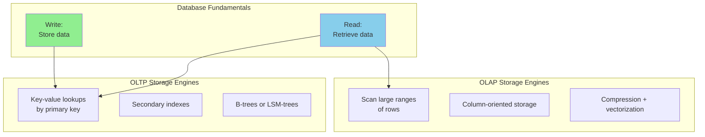
```mermaid
graph TB
    subgraph "Database Fundamentals"
        WRITE["Write:<br/>Store data"]
        READ["Read:<br/>Retrieve data"]
    end

    subgraph "OLTP Storage Engines"
        O1["Key-value lookups<br/>by primary key"]
        O2["Secondary indexes"]
        O3["B-trees or LSM-trees"]
    end

    subgraph "OLAP Storage Engines"
        A1["Scan large ranges<br/>of rows"]
        A2["Column-oriented storage"]
        A3["Compression + vectorization"]
    end

    WRITE --> O1
    READ --> O1
    READ --> A1

    style WRITE fill:#90EE90
    style READ fill:#87CEEB
```

This chapter walks through both worlds: the log-structured (LSM-tree) and update-in-place (B-tree) approaches for OLTP, then the column-oriented world for OLAP, and finally indexes that go beyond simple key lookups — multidimensional, full-text, and vector indexes for ML/AI workloads.

---

## 1. Storage and Indexing for OLTP

### The Simplest Database

Let's start with the world's simplest database, implemented as two bash functions:

```bash
#!/bin/bash

db_set() {
    echo "$1,$2" >> database
}

db_get() {
    grep "^$1," database | sed -e "s/^$1,//" | tail -n 1
}
```

These two functions implement a key-value store. `db_set key value` stores a pair, and `db_get key` looks up the most recent value for that key by scanning the file for the last occurrence.

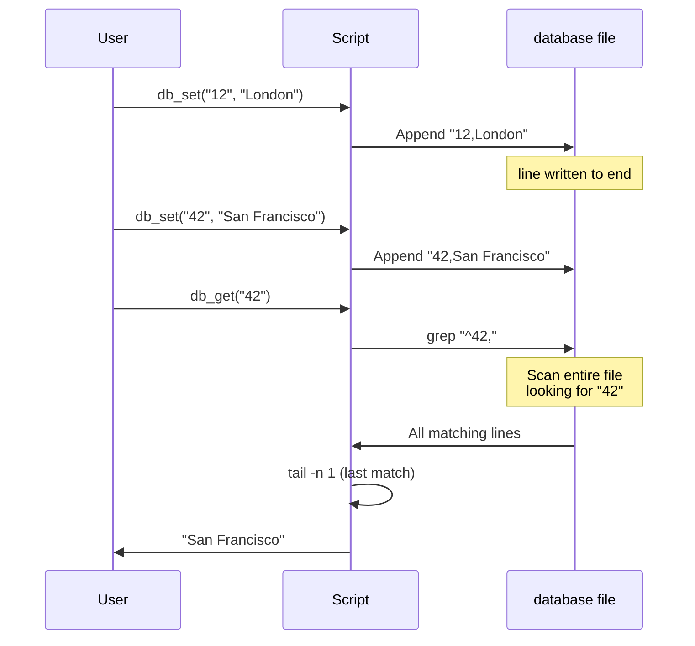
```mermaid
sequenceDiagram
    participant User
    participant Script
    participant File as database file

    User->>Script: db_set("12", "London")
    Script->>File: Append "12,London"
    Note over File: line written to end

    User->>Script: db_set("42", "San Francisco")
    Script->>File: Append "42,San Francisco"

    User->>Script: db_get("42")
    Script->>File: grep "^42,"
    Note over File: Scan entire file<br/>looking for "42"
    File->>Script: All matching lines
    Script->>Script: tail -n 1 (last match)
    Script->>User: "San Francisco"
```

**Performance**:
- **Writes**: O(1) — appending to a file is generally very efficient
- **Reads**: O(n) — every lookup scans the entire database file

Real databases use **logs** internally (an append-only sequence of records on disk) for the same reason: appends are the simplest possible write operation. The word "log" here means an append-only data file — not application logs.

### Indexes

To efficiently find the value for a particular key, we need an **index** — an additional structure derived from the primary data. Many databases let you add and remove indexes without affecting the database contents; only query performance changes.

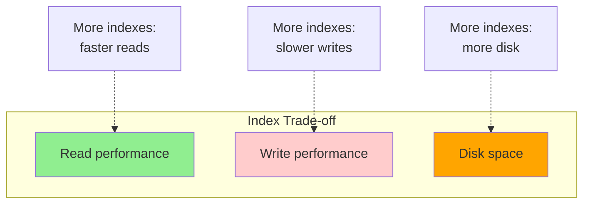
```mermaid
graph TB
    subgraph "Index Trade-off"
        READS["Read performance"]
        WRITES["Write performance"]
        SPACE["Disk space"]
    end

    R1["More indexes:<br/>faster reads"] -.-> READS
    W1["More indexes:<br/>slower writes"] -.-> WRITES
    S1["More indexes:<br/>more disk"] -.-> SPACE

    style READS fill:#90EE90
    style WRITES fill:#ffcccc
    style SPACE fill:#FFA500
```

**Key insight**: Well-chosen indexes speed up reads but consume disk space and slow down writes. Databases typically do not index everything by default — you must choose indexes based on the application's typical query patterns.

---

## 2. Hash Indexes

The simplest indexing strategy is a **hash map** in memory that maps every key to the byte offset where its latest value lives in the data file.

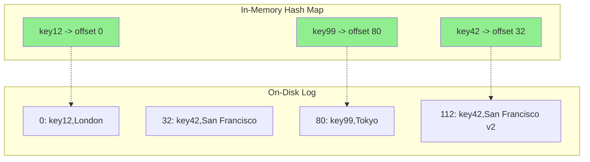
```mermaid
graph TB
    subgraph "In-Memory Hash Map"
        H1["key12 -> offset 0"]
        H2["key42 -> offset 32"]
        H3["key99 -> offset 80"]
    end

    subgraph "On-Disk Log"
        D1["0: key12,London"]
        D2["32: key42,San Francisco"]
        D3["80: key99,Tokyo"]
        D4["112: key42,San Francisco v2"]
    end

    H1 -.-> D1
    H2 -.-> D4
    H3 -.-> D3

    style H1 fill:#90EE90
    style H2 fill:#90EE90
    style H3 fill:#90EE90
```

Every append updates the hash map. To read, look up the offset, seek, and read the value — usually served from the OS page cache without any disk I/O.

**Problems with hash indexes**:
- The log grows forever; old values never get freed
- The hash map is rebuilt on restart (slow for large datasets)
- The hash table must fit in memory
- **Range queries** are not efficient — you can't easily scan all keys from 10000 to 19999

For these reasons, databases more commonly use **sorted** structures like SSTables and B-trees.

---

## 3. SSTables and LSM-Trees

### The SSTable File Format

A **Sorted Strings Table (SSTable)** stores key-value pairs sorted by key, with each key appearing only once.

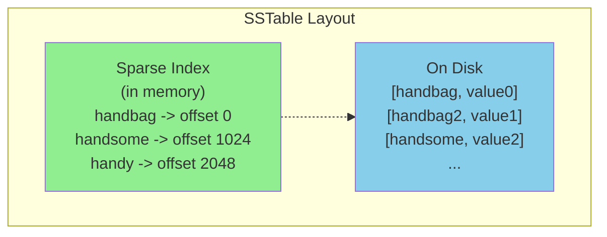
```mermaid
graph TB
    subgraph "SSTable Layout"
        IDX["Sparse Index<br/>(in memory)<br/>handbag -> offset 0<br/>handsome -> offset 1024<br/>handy -> offset 2048"]
        DATA["On Disk<br/>[handbag, value0]<br/>[handbag2, value1]<br/>[handsome, value2]<br/>..."]
    end

    IDX -.-> DATA

    style IDX fill:#90EE90
    style DATA fill:#87CEEB
```

You don't need every key in the index — only the first key of each block. This **sparse index** is small enough to keep in memory. To find a key like `handiwork` (not in the index), you know it must lie between `handbag` and `handsome`, so you seek to `handbag`'s offset and scan forward until you find it (or pass it).

Advantages of sorted keys:

1. **Sparse index**: small enough to fit in memory
2. **Range queries are efficient**: scan sequentially
3. **Compression**: blocks of similar-sized records compress well

### Constructing and Merging SSTables

Maintaining a sorted file on disk is hard if writes arrive in arbitrary order. The solution is a **log-structured approach** that combines an append-only log with sorted files:

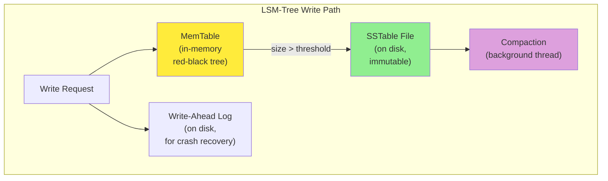
```mermaid
graph TB
    subgraph "LSM-Tree Write Path"
        WRITE["Write Request"]
        MEM["MemTable<br/>(in-memory<br/>red-black tree)"]
        LOG["Write-Ahead Log<br/>(on disk,<br/>for crash recovery)"]
        SST["SSTable File<br/>(on disk,<br/>immutable)"]
        MERGE["Compaction<br/>(background thread)"]
    end

    WRITE --> MEM
    WRITE --> LOG
    MEM -->|"size > threshold"| SST
    SST --> MERGE

    style MEM fill:#ffeb3b
    style SST fill:#90EE90
    style MERGE fill:#DDA0DD
```

**Write-ahead log (WAL)**: a separate append-only file on disk into which every modification is written and flushed (`fsync`) *before* the in-memory data structure is updated. If the database crashes, the WAL is replayed on restart to restore any modifications that did not yet reach disk-resident state. The WAL is what makes the in-memory memtable durable without flushing it on every write. B-trees use the same idea (see §4).

**Write path**:
1. Add the write to an in-memory balanced tree (the **memtable**)
2. Also append to the write-ahead log for crash recovery
3. When the memtable exceeds a threshold (typically a few MB), write it out as a sorted SSTable
4. Serve reads by checking the memtable first, then SSTables from newest to oldest

**Read path**:
1. Check the memtable (most recent data)
2. Check SSTables in order, newest to oldest
3. Stop at the first hit

**Merging**:
- Periodically run a background process that merges segment files (similar to mergesort)
- If the same key appears in multiple inputs, keep only the most recent value
- Deletions use a **tombstone** marker that tells the merge process to drop previous values

This algorithm is what **RocksDB**, **Cassandra**, **ScyllaDB**, and **HBase** all do — all inspired by Google's **Bigtable** paper (2006), which introduced the terms SSTable and memtable. The technique was originally published in 1996 as the **Log-Structured Merge-tree (LSM-tree)**.

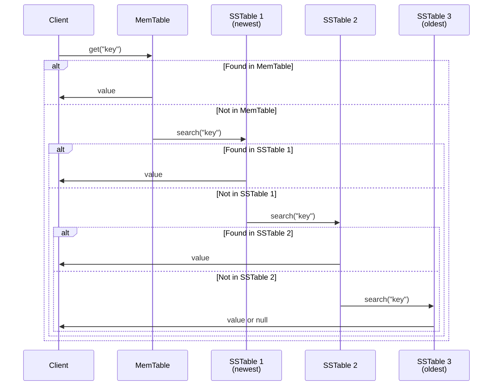
```mermaid
sequenceDiagram
    participant Client
    participant MemTable
    participant SST1 as SSTable 1<br/>(newest)
    participant SST2 as SSTable 2
    participant SST3 as SSTable 3<br/>(oldest)

    Client->>MemTable: get("key")
    alt Found in MemTable
        MemTable->>Client: value
    else Not in MemTable
        MemTable->>SST1: search("key")
        alt Found in SSTable 1
            SST1->>Client: value
        else Not in SSTable 1
            SST1->>SST2: search("key")
            alt Found in SSTable 2
                SST2->>Client: value
            else Not in SSTable 2
                SST2->>SST3: search("key")
                SST3->>Client: value or null
            end
        end
    end
```

### Bloom Filters

To avoid reading SSTables that definitely don't contain a key, LSM engines store a **Bloom filter** alongside each SSTable — a probabilistic structure that says "definitely not here" or "maybe here" with no false negatives but occasional false positives.

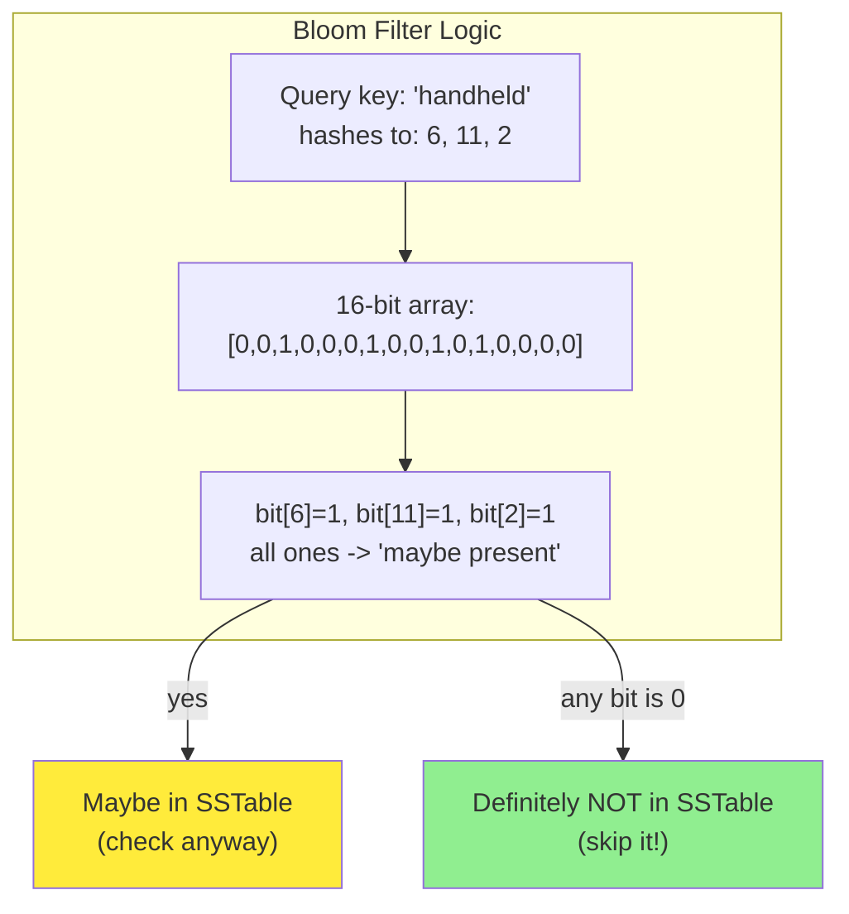
```mermaid
graph TB
    subgraph "Bloom Filter Logic"
        KEYS["Query key: 'handheld'<br/>hashes to: 6, 11, 2"]
        BITMAP["16-bit array:<br/>[0,0,1,0,0,0,1,0,0,1,0,1,0,0,0,0]"]
        CHECK["bit[6]=1, bit[11]=1, bit[2]=1<br/>all ones -> 'maybe present'"]
    end

    KEYS --> BITMAP
    BITMAP --> CHECK

    CHECK -->|"yes"| MAYBE["Maybe in SSTable<br/>(check anyway)"]
    CHECK -->|"any bit is 0"| NO["Definitely NOT in SSTable<br/>(skip it!)"]

    style MAYBE fill:#ffeb3b
    style NO fill:#90EE90
```

**Rule of thumb**: 10 bits of Bloom filter space per key gives ~1% false-positive probability; adding 5 more bits per key reduces that by 10x.

### Compaction Strategies

LSM-based systems let you choose how and when to compact:

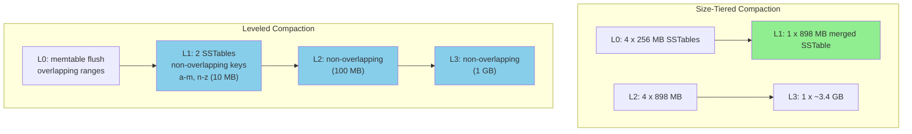
```mermaid
graph TB
    subgraph "Size-Tiered Compaction"
        ST1["L0: 4 x 256 MB SSTables"]
        ST2["L1: 1 x 898 MB merged SSTable"]
        ST3["L2: 4 x 898 MB"]
        ST4["L3: 1 x ~3.4 GB"]

        ST1 --> ST2
        ST3 --> ST4
    end

    subgraph "Leveled Compaction"
        L1["L0: memtable flush<br/>overlapping ranges"]
        L2["L1: 2 SSTables<br/>non-overlapping keys<br/>a-m, n-z (10 MB)"]
        L3["L2: non-overlapping<br/>(100 MB)"]
        L4["L3: non-overlapping<br/>(1 GB)"]

        L1 --> L2 --> L3 --> L4
    end

    style ST2 fill:#90EE90
    style L2 fill:#87CEEB
    style L3 fill:#87CEEB
    style L4 fill:#87CEEB
```

- **Size-tiered**: newer/smaller SSTables merge into older/larger ones. Good for write-heavy workloads but uses more disk temporarily.
- **Leveled**: SSTables are kept at fixed sizes grouped by levels (L0, L1, L2…). Better for read-heavy workloads because there are fewer SSTables to check.

### Embedded Storage Engines

Many storage engines run **embedded** — as a library inside the application process rather than as a separate service. Examples: RocksDB, SQLite, LMDB, DuckDB, KùzuDB. Embedded engines are common in mobile apps and in multi-tenant systems where each tenant can have its own database instance (e.g., Bluesky's migration to single-tenant SQLite).

---

## 4. B-Trees

The **B-tree** is the most widely used structure for key-value indexes. Introduced in 1970 and called "ubiquitous" less than 10 years later, B-trees remain the standard index in almost all relational databases.

Like SSTables, B-trees keep key-value pairs sorted by key, which supports efficient lookups and range queries. But the design philosophy is very different: B-trees break the database into fixed-size **pages** (traditionally 4 KiB; PostgreSQL now uses 8 KiB, MySQL 16 KiB) and may overwrite a page in place.


```mermaid
graph TB
    subgraph "B-Tree Lookup: key=251"
        ROOT["Root Page<br/>[100 | 200 | 300]"]
        L1["Page for keys 200-300<br/>[210 | 230 | 251 | 270]"]
        L2["Leaf Page<br/>[248 | 249 | 250 | 251 | 252]"]
    end

    ROOT -->|"251 between 200 and 300"| L1
    L1 -->|"251 between 230 and 270"| L2

    style ROOT fill:#ffeb3b
    style L1 fill:#87CEEB
    style L2 fill:#90EE90
```

The **branching factor** (the number of child references per page) is typically several hundred. Most databases fit in a B-tree three or four levels deep — a 4-level tree of 4 KiB pages with a branching factor of 500 can store up to 256 TB.

### Page Splits

If a leaf page is full when you insert a key, the page is split in two and the parent is updated to account for the new subdivision. Splits can cascade all the way up to the root, growing the tree by one level.

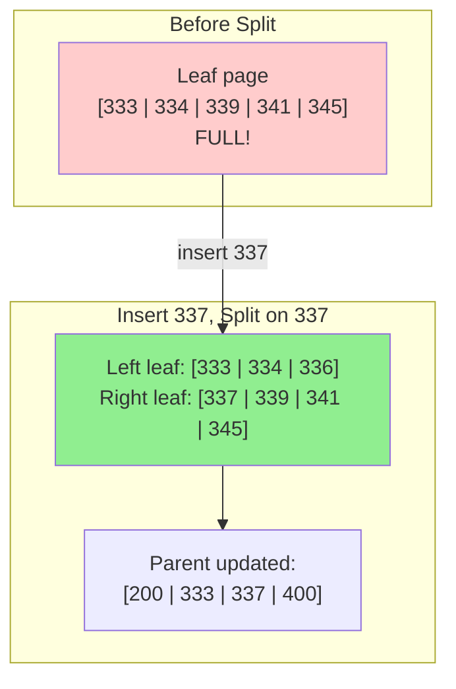
```mermaid
graph TB
    subgraph "Before Split"
        BEFORE["Leaf page<br/>[333 | 334 | 339 | 341 | 345]<br/>FULL!"]
    end

    subgraph "Insert 337, Split on 337"
        AFTER["Left leaf: [333 | 334 | 336]<br/>Right leaf: [337 | 339 | 341 | 345]"]
        PARENT["Parent updated:<br/>[200 | 333 | 337 | 400]"]
    end

    BEFORE -->|"insert 337"| AFTER
    AFTER --> PARENT

    style BEFORE fill:#ffcccc
    style AFTER fill:#90EE90
```

This algorithm keeps the tree **balanced**: a B-tree with n keys has depth O(log n).

### Making B-Trees Reliable

Overwriting a page in place is dangerous during a crash. If only some pages have been written during a split, you can end up with an orphan page or a **torn page** (partially written).

To guard against this, B-trees use a **write-ahead log (WAL)** — defined in §3 for LSM-trees — applying the same idea to page writes: every modification is appended to the WAL and flushed to disk (via `fsync`) before being applied to the tree pages. On restart, the WAL is replayed to restore consistency. The equivalent in filesystems is called **journaling**.

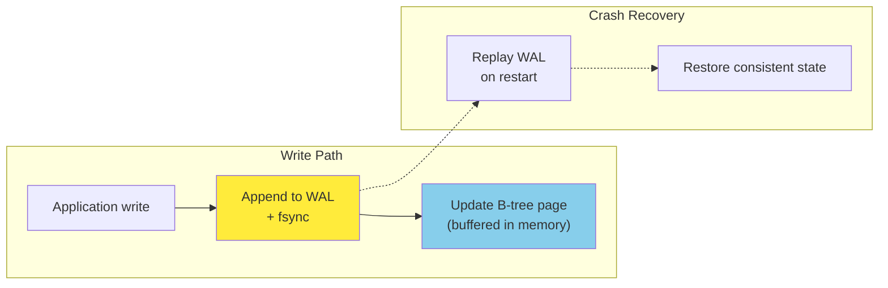
```mermaid
graph LR
    subgraph "Write Path"
        W["Application write"]
        WAL["Append to WAL<br/>+ fsync"]
        PAGE["Update B-tree page<br/>(buffered in memory)"]
    end

    W --> WAL --> PAGE

    subgraph "Crash Recovery"
        REPLAY["Replay WAL<br/>on restart"]
        STATE["Restore consistent state"]
    end

    WAL -.-> REPLAY -.-> STATE

    style WAL fill:#ffeb3b
    style PAGE fill:#87CEEB
```

### B-Tree Variants

Many variants exist:
- **Copy-on-write** (e.g., LMDB): modified pages are written to a new location, and a new version of the parent pages is created. Useful for concurrency control.
- **Key abbreviation**: interior pages store only enough of the key to act as a boundary, increasing branching factor.
- **Leaf-page sibling pointers**: lets you scan keys in order without jumping back to parent pages.
- **Sequential leaf layout**: try to keep leaf pages in sequential order on disk for faster scans.

---

## 5. Comparing B-Trees and LSM-Trees

As a rule of thumb, **LSM-trees are better for write-heavy** workloads, while **B-trees are faster for reads**. Benchmarks are workload-sensitive; you should test with your own workload. Some engines blend characteristics of both.

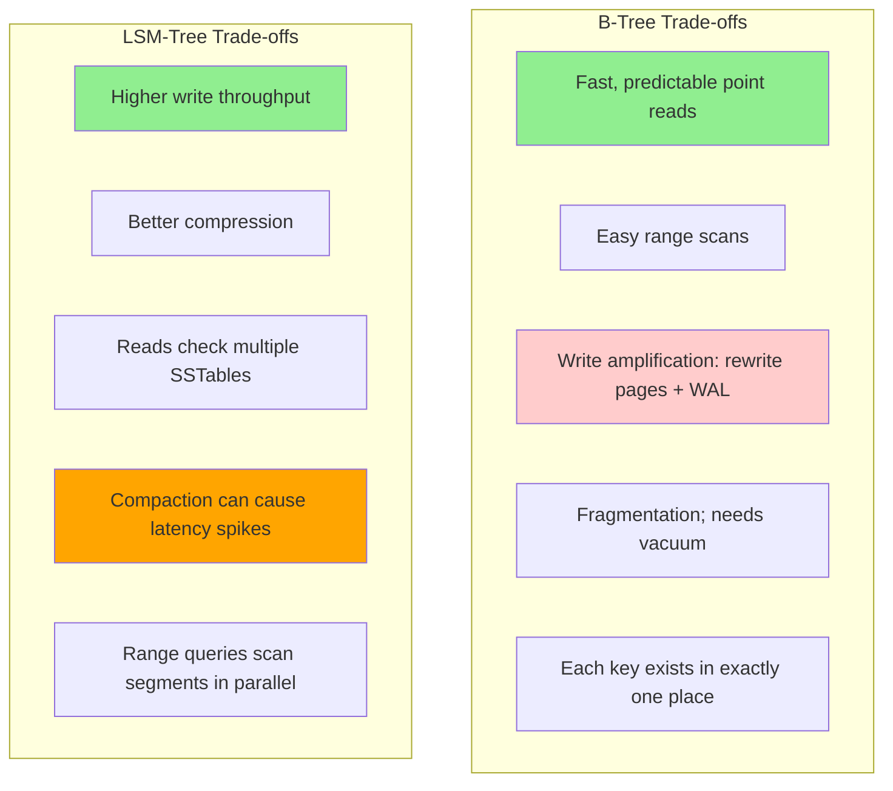
```mermaid
graph TB
    subgraph "B-Tree Trade-offs"
        B1["Fast, predictable point reads"]
        B2["Easy range scans"]
        B3["Write amplification: rewrite pages + WAL"]
        B4["Fragmentation; needs vacuum"]
        B5["Each key exists in exactly one place"]
    end

    subgraph "LSM-Tree Trade-offs"
        L1["Higher write throughput"]
        L2["Better compression"]
        L3["Reads check multiple SSTables"]
        L4["Compaction can cause latency spikes"]
        L5["Range queries scan segments in parallel"]
    end

    style B1 fill:#90EE90
    style L1 fill:#90EE90
    style B3 fill:#ffcccc
    style L4 fill:#FFA500
```

LSM-trees write entire segment files (megabytes) at a time, which is sequential. B-trees overwrite pages scattered across the disk (random writes). Even on SSDs, sequential writes outperform random writes. Flash is read/written in 4 KiB pages but erased in 512 KiB blocks; random writes force the SSD controller to do more **garbage collection** (copying live pages out before erasing a block) and wear out the drive faster.

**Write amplification** = total bytes written to disk ÷ bytes you would have written in an append-only log with no index.

- **B-trees**: at least 2x (WAL + page). Page splits can push it higher.
- **LSM-trees**: writes are amplified by compaction (memtable → SSTable → merged SSTable → merged again). For typical workloads, LSM-trees have lower write amplification because they don't write whole pages and SSTables compress well.

B-trees fragment over time — deleted rows leave dead pages in the middle of the file that can't easily be returned to the OS (PostgreSQL's `VACUUM` reclaims them). LSM-trees don't have this problem because compaction rewrites SSTables anyway, and SSTable blocks compress better than B-tree pages.

A subtle issue with LSM-trees: a deleted record may persist in higher levels until its tombstone is propagated through all compaction levels. Some specialist designs propagate deletions faster.

Conversely, the **immutable** nature of SSTables makes cheap snapshots trivial: just record the list of files; don't delete any until the snapshot is no longer needed. B-trees, which overwrite pages, make this harder.

### B-Tree vs LSM-Tree Summary

| Workload Property | B-Tree | LSM-Tree |
|---|---|---|
| **Write throughput** | Moderate (random page writes) | High (sequential segment writes) |
| **Read latency** | Predictable, fast | May check multiple SSTables |
| **Range scans** | Excellent | Good (parallel segment scan) |
| **Point queries** | One page read | Multiple SSTables (Bloom filters help) |
| **Write amplification** | 2-5x typical | 10-30x, but sequential |
| **Compression** | Page-level | Block-level, better |
| **Fragmentation** | Yes (needs vacuum) | No |
| **Snapshots** | Harder | Trivial |
| **Crash recovery** | WAL replay | WAL replay + segment files |

---

## 6. Multicolumn and Secondary Indexes

So far we've discussed **key-value indexes** (primary keys). A **secondary index** lets you look up records by columns other than the primary key. In relational databases, you create them with `CREATE INDEX`.

```sql
-- A secondary index on user_id
CREATE INDEX user_id_idx ON orders (user_id);
```

A secondary index differs from a primary index in that values are **not necessarily unique** — many rows may share the same indexed column. This is solved in two ways:

1. **Postings list**: each index entry stores a list of matching row IDs.
2. **Unique compound key**: append the row ID to the indexed value to make it unique.

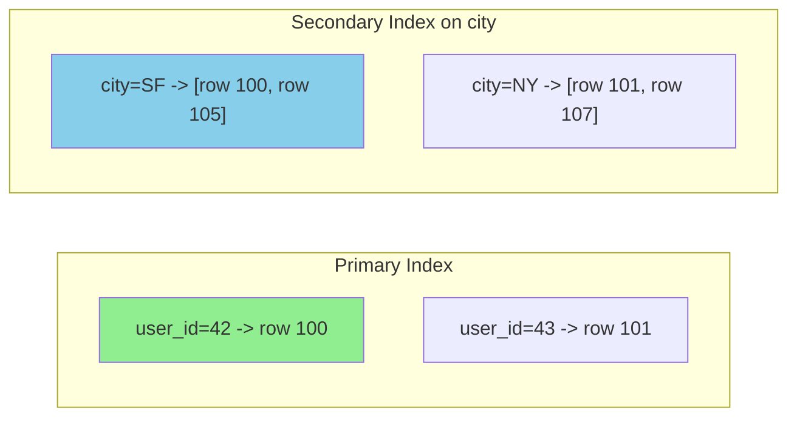
```mermaid
graph LR
    subgraph "Primary Index"
        P1["user_id=42 -> row 100"]
        P2["user_id=43 -> row 101"]
    end

    subgraph "Secondary Index on city"
        S1["city=SF -> [row 100, row 105]"]
        S2["city=NY -> [row 101, row 107]"]
    end

    style P1 fill:#90EE90
    style S1 fill:#87CEEB
```

### Storing Values Within the Index

How the **value** is stored in the index affects storage and query performance:

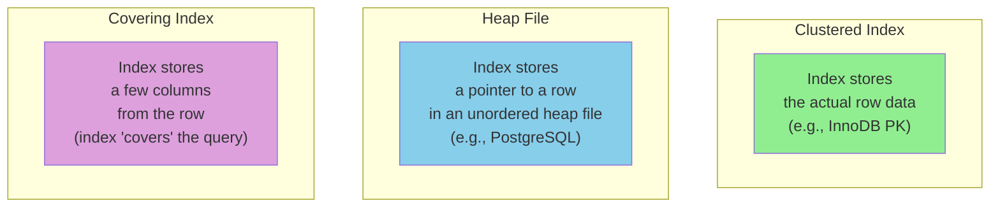
```mermaid
graph TB
    subgraph "Clustered Index"
        C["Index stores<br/>the actual row data<br/>(e.g., InnoDB PK)"]
    end

    subgraph "Heap File"
        H["Index stores<br/>a pointer to a row<br/>in an unordered heap file<br/>(e.g., PostgreSQL)"]
    end

    subgraph "Covering Index"
        CV["Index stores<br/>a few columns<br/>from the row<br/>(index 'covers' the query)"]
    end

    style C fill:#90EE90
    style H fill:#87CEEB
    style CV fill:#DDA0DD
```

- **Clustered index**: the row data lives inside the index structure itself (e.g., InnoDB's primary key). Only one per table.
- **Heap file**: the index value is a pointer or primary key to a row stored separately. PostgreSQL uses this.
- **Covering index** (index with included columns): stores some columns in the index so the query can be answered without going to the heap. Faster reads, more disk, slower writes.

When updating a value without changing the key, the heap-file approach can overwrite the record in place if the new value is no larger. If it is larger, the record is moved, and either all indexes are updated or a forwarding pointer is left at the old location.

---

## 7. Keeping Everything in Memory

The data structures we've discussed exist because disks are awkward: latency, seek times, and the need to lay out data carefully. Disks remain attractive for two reasons: **durability** (data survives power loss) and **cost per gigabyte**.

As RAM becomes cheaper, many datasets simply fit in memory — potentially distributed across several machines. This led to **in-memory databases**.

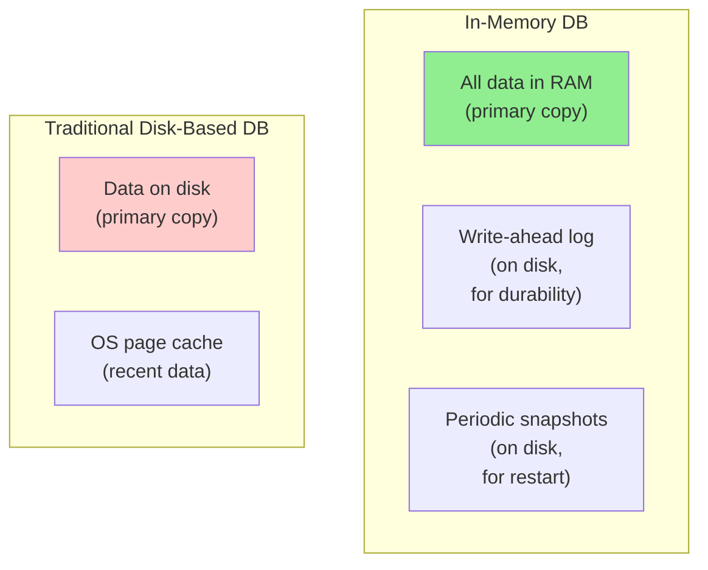
```mermaid
graph TB
    subgraph "In-Memory DB"
        MEM["All data in RAM<br/>(primary copy)"]
        LOG["Write-ahead log<br/>(on disk,<br/>for durability)"]
        SNAP["Periodic snapshots<br/>(on disk,<br/>for restart)"]
    end

    subgraph "Traditional Disk-Based DB"
        DISK["Data on disk<br/>(primary copy)"]
        CACHE["OS page cache<br/>(recent data)"]
    end

    style MEM fill:#90EE90
    style DISK fill:#ffcccc
```

Some in-memory stores (Memcached) are caching-only and lose data on restart. Others aim for durability:
- Battery-backed RAM
- Writing a log of changes to disk
- Periodic snapshots to disk
- Replicating in-memory state to other machines

Examples: VoltDB, SingleStore, Oracle TimesTen, RAMCloud, Redis, Couchbase.

Counterintuitively, the performance advantage of in-memory databases isn't just from avoiding disk reads — a disk-based engine with enough memory may never read from disk thanks to the OS page cache. The real win is **avoiding the overhead of encoding in-memory data structures in a form that can be written to disk**.

Beyond performance, in-memory databases enable data models that are difficult with disk-based indexes. Redis, for example, offers priority queues, sets, and other structures because everything stays in memory.

---

## 8. Data Storage for Analytics

Data warehouses typically use a relational model because SQL fits analytical queries well. Many graphical BI tools generate SQL, visualize results, and let analysts drill down, slice, and dice.

On the surface, a data warehouse and an OLTP database look similar — both expose a SQL query interface. Internally, they look very different because the query patterns are radically different.

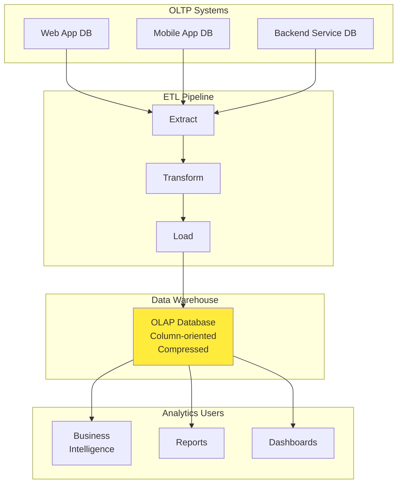
```mermaid
graph TB
    subgraph "OLTP Systems"
        O1["Web App DB"]
        O2["Mobile App DB"]
        O3["Backend Service DB"]
    end

    subgraph "ETL Pipeline"
        E1["Extract"]
        E2["Transform"]
        E3["Load"]
    end

    subgraph "Data Warehouse"
        DW["OLAP Database<br/>Column-oriented<br/>Compressed"]
    end

    subgraph "Analytics Users"
        A1["Business<br/>Intelligence"]
        A2["Reports"]
        A3["Dashboards"]
    end

    O1 --> E1
    O2 --> E1
    O3 --> E1
    E1 --> E2 --> E3 --> DW
    DW --> A1
    DW --> A2
    DW --> A3

    style DW fill:#ffeb3b
```

Some databases (SQL Server, SAP HANA, SingleStore) try to do both transaction processing and analytics in one product. These **HTAP** (hybrid transactional/analytical processing) systems increasingly split into two engines behind a common SQL interface.

### Cloud Data Warehouses

Established vendors (Teradata, Vertica, SAP HANA) offer both on-premises and cloud deployments. New cloud-only warehouses (Google BigQuery, Amazon Redshift, Snowflake) have become widely adopted because they leverage scalable cloud infrastructure: object storage for data, serverless compute for queries, elastic scaling. The deeper treatment of cloud-native architecture and the separation of storage and compute lives in Chapter 1; the rest of this section focuses on the storage-format choices those systems make.

Cloud warehouses decouple **query computation** from the **storage layer**. Data persists in object storage rather than local disks, so storage capacity and compute resources can be adjusted independently.

Open-source warehouses have also evolved. What used to be integrated systems like Apache Hive have broken apart into separate components:

- **Query engine** — Trino, Presto, Apache DataFusion, Apache Spark, Flink. Parses, optimizes, and executes queries.
- **Storage format** — Parquet, ORC, Lance, Nimble. Encodes rows of a table as bytes in files (typically in object storage).
- **Table format** — Apache Iceberg, Delta Lake. Wraps a storage format to support inserts, deletes, time travel, GC, and transactions over immutable files.
- **Data catalog** — Snowflake Polaris, Databricks Unity Catalog, Apache Iceberg REST catalog. Tracks which tables exist in a database, schema, and metadata. Usually runs as a standalone service with a REST API.

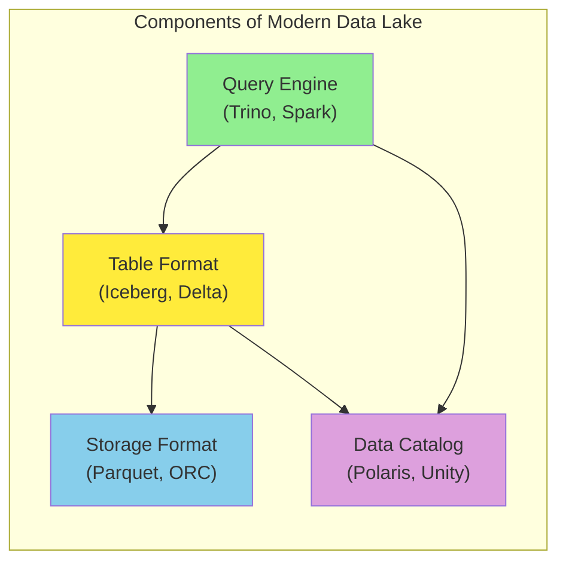
```mermaid
graph LR
    subgraph "Components of Modern Data Lake"
        Q["Query Engine<br/>(Trino, Spark)"]
        S["Storage Format<br/>(Parquet, ORC)"]
        T["Table Format<br/>(Iceberg, Delta)"]
        C["Data Catalog<br/>(Polaris, Unity)"]
    end

    Q --> T
    T --> S
    Q --> C
    T --> C

    style Q fill:#90EE90
    style S fill:#87CEEB
    style T fill:#ffeb3b
    style C fill:#DDA0DD
```

This decoupling enables data discovery and governance systems to access catalog metadata independently of the query engine.

### Column-Oriented Storage

If fact tables have trillions of rows and petabytes of data, and a typical analytical query touches only 4-5 of the 100+ columns, then reading entire rows is wasteful. **Column-oriented storage** stores all values from each column together rather than all values from each row.

```sql
-- Example 4-1: An analytical query touching only 3 columns
SELECT
    dim_date.weekday, dim_product.category,
    SUM(fact_sales.quantity) AS quantity_sold
FROM fact_sales
JOIN dim_date ON fact_sales.date_key = dim_date.date_key
JOIN dim_product ON fact_sales.product_sk = dim_product.product_sk
WHERE
    dim_date.year = 2024
    AND dim_product.category IN ('Fresh fruit', 'Candy')
GROUP BY
    dim_date.weekday, dim_product.category;
```

This query reads millions of rows but needs only `date_key`, `product_sk`, and `quantity` from `fact_sales`. Columnar storage reads only those three columns from disk.

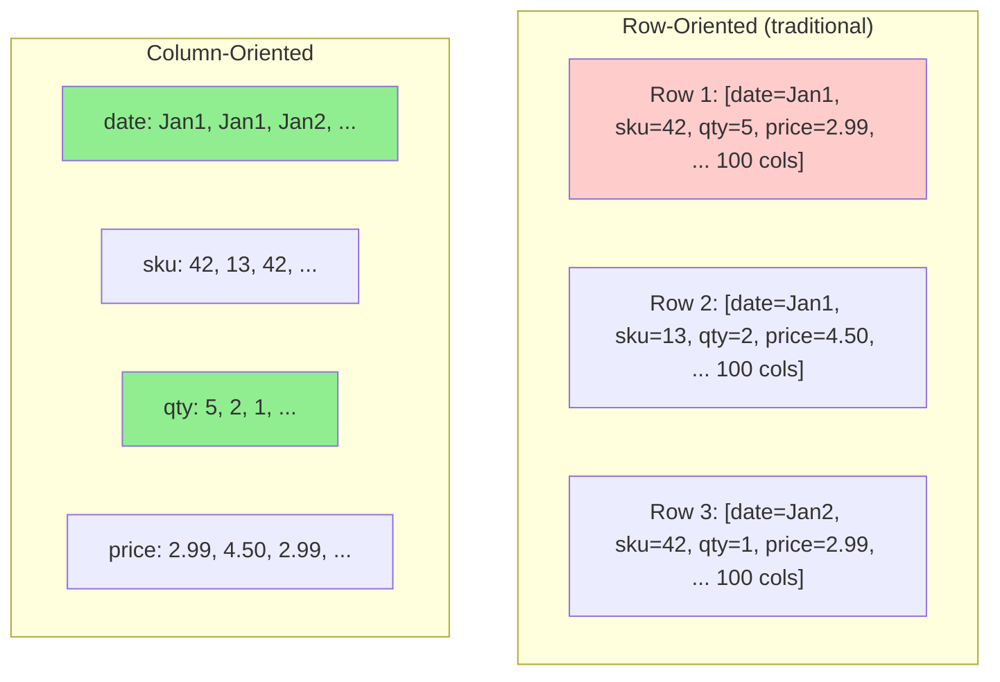
```mermaid
graph TB
    subgraph "Row-Oriented (traditional)"
        R1["Row 1: [date=Jan1, sku=42, qty=5, price=2.99, ... 100 cols]"]
        R2["Row 2: [date=Jan1, sku=13, qty=2, price=4.50, ... 100 cols]"]
        R3["Row 3: [date=Jan2, sku=42, qty=1, price=2.99, ... 100 cols]"]
    end

    subgraph "Column-Oriented"
        C1["date: Jan1, Jan1, Jan2, ..."]
        C2["sku: 42, 13, 42, ..."]
        C3["qty: 5, 2, 1, ..."]
        C4["price: 2.99, 4.50, 2.99, ..."]
    end

    style R1 fill:#ffcccc
    style C1 fill:#90EE90
    style C3 fill:#90EE90
```

The column-oriented layout relies on each column storing rows in the same order — the 23rd entry in each column belongs to the 23rd row.

In practice, columns aren't stored as one giant sequence; the table is broken into blocks of thousands or millions of rows, and within each block columns are stored separately. Many systems make each block contain rows for a particular timestamp range, so a date-range query reads only the blocks overlapping that range.

Column-oriented storage is used by virtually all modern analytical databases: Snowflake, BigQuery, Redshift, Vertica, DuckDB, Pinot, Druid. Storage formats like Parquet, ORC, Lance, and Nimble are columnar. In-memory analytics frameworks (Apache Arrow, Pandas/NumPy) are also columnar.

**Note**: Don't confuse column-oriented with **wide-column** (or column-family) databases — the latter (Bigtable, HBase, Accumulo) are row-oriented despite the name.

### Column Compression

Columns often have repeated values (a retailer has billions of transactions but only 100,000 distinct products), which makes them compress very well. **Bitmap encoding** is especially effective: a column with n distinct values becomes n bitmaps, one per value, each with one bit per row.

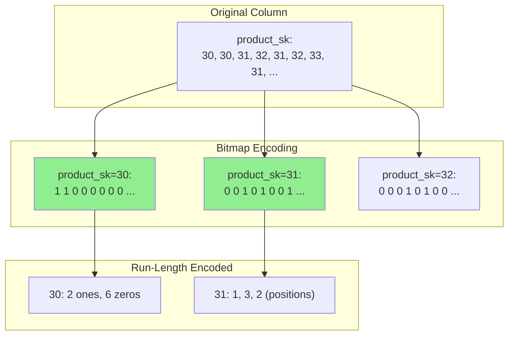
```mermaid
graph TB
    subgraph "Original Column"
        OC["product_sk:<br/>30, 30, 31, 32, 31, 32, 33, 31, ..."]
    end

    subgraph "Bitmap Encoding"
        B30["product_sk=30:<br/>1 1 0 0 0 0 0 0 ..."]
        B31["product_sk=31:<br/>0 0 1 0 1 0 0 1 ..."]
        B32["product_sk=32:<br/>0 0 0 1 0 1 0 0 ..."]
    end

    subgraph "Run-Length Encoded"
        R30["30: 2 ones, 6 zeros"]
        R31["31: 1, 3, 2 (positions)"]
    end

    OC --> B30
    OC --> B31
    OC --> B32
    B30 --> R30
    B31 --> R31

    style B30 fill:#90EE90
    style B31 fill:#90EE90
```

Sparse bitmaps compress further with run-length encoding. **Roaring bitmaps** switch between encoding schemes depending on density, often producing remarkably compact representations.

Bitmap indexes shine for common warehouse queries:

```sql
-- OR three bitmaps
WHERE product_sk IN (31, 68, 69)

-- AND two bitmaps
WHERE product_sk = 30 AND store_sk = 3
```

Bitmaps can also answer graph queries — for example, finding all users followed by X who also follow Y.

### Sort Order in Column Storage

Sorting rows by a chosen column makes queries on that range very fast. The first sort key compresses best (long runs of repeated values); secondary keys get progressively more jumbled.

```mermaid
graph TB
    subgraph "Sort by date_key, then product_sk"
        K1["Sort key 1: date_key<br/>Jan1, Jan1, Jan1, Jan1, Jan2, Jan2, ..."]
        K2["Sort key 2: product_sk<br/>sku=12, sku=42, sku=68, sku=99, sku=12, sku=42, ..."]
        K3["Other columns appear<br/>in essentially random order"]
    end

    subgraph "Benefit"
        B1["Date range query<br/>scans only relevant block<br/>(sequential I/O)"]
        B2["date_key compresses<br/>extremely well"]
    end

    K1 --> B1
    K1 --> B2

    style B1 fill:#90EE90
    style B2 fill:#90EE90
```

Some systems (Vertica) keep multiple sort orders on disk and let the query optimizer pick the best one.

### Writing to Column-Oriented Storage

Writes in a data warehouse are bulk imports, often via ETL. Inserting a single row in the middle of a sorted, compressed columnar table would require rewriting all the compressed columns from the insertion point onward — very expensive.

The solution: a log-structured approach. Writes go first to a row-oriented in-memory store. When enough accumulate, they are merged with the columnar files on disk in a bulk write. Object storage works well because files are immutable and large.

```mermaid
graph TB
    subgraph "In-Memory"
        IMEM["Row-oriented store<br/>(recent writes)"]
    end

    subgraph "On Disk"
        ICOL["Columnar files<br/>(immutable,<br/>large blocks)"]
    end

    IMEM -->|"bulk merge<br/>(background)"| ICOL

    QUERY["Analytical Query"]
    QUERY --> IMEM
    QUERY --> ICOL

    style IMEM fill:#ffeb3b
    style ICOL fill:#90EE90
```

The query execution engine combines the in-memory and disk data transparently. From an analyst's view, all data — including recent inserts, updates, and deletes — is immediately visible.

---

## 9. Query Execution: Compilation and Vectorization

A complex analytical SQL query becomes a **query plan** with multiple operators (filter, join, aggregate, sort) that may run in parallel across machines. The query planner chooses operators, ordering, and placement. Within each operator, the engine processes column values — finding rows where a value matches a set, or a row matches several column conditions.

For queries that scan millions of rows, we must worry about both disk I/O and **CPU time**. The simplest approach interprets each row against a data structure describing the query, but that's too slow. Two modern alternatives exist:

```mermaid
graph TB
    subgraph "Query Execution Strategies"
        INT["Interpretation<br/>(slow for analytics)"]
        COMP["Query Compilation<br/>(JIT-generate machine code)"]
        VEC["Vectorized Processing<br/>(batches of values)"]
    end

    INT -->|"too slow"| REPLACE["Replace with..."]
    REPLACE --> COMP
    REPLACE --> VEC

    style INT fill:#ffcccc
    style COMP fill:#90EE90
    style VEC fill:#87CEEB
```

**Query Compilation**: The engine takes the SQL query and generates code (often via LLVM) that iterates over rows, checks column values, and copies results to an output buffer. This is analogous to JIT compilation in JVMs.

**Vectorized Processing**: The query is interpreted, but the engine processes a batch of values (e.g., 1024 column values at once) and uses a fixed set of built-in operators with arguments. Vectorized databases like DuckDB and Snowflake often achieve speed comparable to compilation.

For example, an equality test on `product_sk` returns a bitmap (one bit per value: 1 if it matches, 0 otherwise). Combining two such bitmaps with `bitwise AND` is very fast and SIMD-friendly.

```mermaid
graph LR
    subgraph "Bitmap AND Example"
        A["product_sk = 'bananas'<br/>-> bitmap A<br/>0 0 1 0 1 1 0 1 0 ..."]
        B["store_sk = 'store 3'<br/>-> bitmap B<br/>0 1 1 1 0 1 0 1 1 ..."]
        AND["bitwise AND<br/>-> 0 0 1 0 0 1 0 1 0 ..."]
    end

    A --> AND
    B --> AND

    style AND fill:#90EE90
```

Both approaches are used in practice and achieve excellent performance by exploiting modern CPU features:

- Sequential memory access (fewer cache misses)
- Tight inner loops (no function calls, no branch mispredictions)
- Multiple threads and **SIMD** instructions
- Operating directly on compressed data without decoding

### Python: Bitmap Encoding for a Column

```python
from typing import List, Dict
from collections import defaultdict

class BitmapIndex:
    """Bitmap index for a single column."""

    def __init__(self, column_name: str):
        self.column_name = column_name
        # value -> list of bits, one per row
        self.bitmaps: Dict[str, List[int]] = defaultdict(list)

    def add_row(self, row_index: int, value) -> None:
        """Record one bit per existing value, plus the new value's bit."""
        # Extend all existing bitmaps with a 0 (these rows didn't have this value)
        for v in self.bitmaps:
            if len(self.bitmaps[v]) == row_index:
                self.bitmaps[v].append(0)
        # Set this value's bit to 1 at this row
        self.bitmaps[value].append(1)

    def query_equal(self, value: str) -> List[int]:
        """Return the bitmap for a specific value."""
        return self.bitmaps.get(value, [])

    def query_in(self, values: List[str]) -> List[int]:
        """OR the bitmaps for several values."""
        if not values:
            return []
        result = list(self.bitmaps.get(values[0], []))
        for v in values[1:]:
            other = self.bitmaps.get(v, [])
            # Bitwise OR, padded to the longer length
            for i in range(max(len(result), len(other))):
                a = result[i] if i < len(result) else 0
                b = other[i] if i < len(other) else 0
                if i < len(result):
                    result[i] = a | b
                else:
                    result.append(b)
        return result

# Usage
idx = BitmapIndex("product_sk")
data = [30, 30, 31, 32, 31, 32, 33, 31]
for i, v in enumerate(data):
    idx.add_row(i, v)

# WHERE product_sk IN (30, 31) -> OR the two bitmaps
print(idx.query_in([30, 31]))
# WHERE product_sk = 31
print(idx.query_equal(31))
```

In a real database, the bitmaps would be run-length encoded and operated on directly without materializing them as Python lists — but the idea is the same.

---

## 10. Materialized Views and Data Cubes

A **materialized view** is the actual, on-disk result of a query — unlike a virtual view, which is just a query shortcut expanded at execution time. The trade-offs of keeping derived state and the operational discipline around derived data systems are treated more fully in Chapter 11.

```sql
-- A materialized view
CREATE MATERIALIZED VIEW sales_summary AS
SELECT
    date_key,
    product_sk,
    SUM(quantity)  AS total_quantity,
    SUM(net_price) AS total_revenue
FROM fact_sales
GROUP BY date_key, product_sk;
```

When underlying data changes, the materialized view must be updated. Some databases do this automatically; systems like Materialize specialize in keeping materialized views fresh. Updates cost writes, but materialized views greatly accelerate repeated queries.

```mermaid
graph TB
    subgraph "Virtual View"
        V["Just a query template<br/>Recomputed every read"]
    end

    subgraph "Materialized View"
        M1["Results stored on disk"]
        M2["Fast reads"]
        M3["Maintenance cost<br/>on writes"]
    end

    style V fill:#ffcccc
    style M1 fill:#90EE90
    style M2 fill:#90EE90
    style M3 fill:#FFA500
```

### Data Cubes

A **data cube** (OLAP cube) is a grid of precomputed aggregates grouped by different dimensions. With two dimensions (date, product), each cell contains the aggregate (e.g., `SUM(net_price)`) for a particular date-product combination.

```mermaid
graph TB
    subgraph "2D Data Cube: Sales by Date x Product"
        TBL["                Product A   Product B   Product C<br/>
             2024-01-01       100         200         150<br/>
             2024-01-02       120         180         170<br/>
             2024-01-03       110         210         160<br/>
             -------------------------------------------<br/>
             Total            330         590         480"]
    end

    Q["Query: total sales<br/>per store yesterday"]

    TBL -->|"just look it up!"| Q

    style TBL fill:#90EE90
    style Q fill:#ffeb3b
```

The cells can be summarized along each row or column to get reduced-dimension totals (sales by product regardless of date, or sales by date regardless of product).

In practice, fact tables often have more than two dimensions (Figure 3-5 has five: date, product, store, promotion, customer). A five-dimensional hypercube is hard to draw, but the principle holds: each cell contains the aggregate for a unique combination of dimension values.

**Advantages**:
- Certain queries become extremely fast — they're already precomputed.

**Disadvantages**:
- Inflexible — you can't ask queries that go beyond the pre-aggregated dimensions (e.g., "what proportion of sales came from items priced over $100?" if price isn't a cube dimension).

Most warehouses therefore keep raw data and use cubes only as a performance boost for specific queries.

---

## 11. Multidimensional and Full-Text Indexes

B-trees and LSM-trees support range queries on a single attribute. Sometimes you need to query several attributes at once.

### Concatenated Indexes

A **concatenated index** combines multiple fields into one key by appending them — like a paper phone book ordered by `(lastname, firstname)`. It efficiently answers queries on the leading prefix (e.g., `lastname` alone or `lastname`+`firstname`), but is useless for queries that skip the prefix (e.g., `firstname` alone).

```mermaid
graph TB
    subgraph "Concatenated Index (lastname, firstname)"
        K1["(Adams, Alice)"]
        K2["(Adams, Bob)"]
        K3["(Brown, Alice)"]
        K4["(Brown, Charlie)"]
    end

    Q1["Q1: WHERE lastname='Adams'<br/>uses index prefix -> FAST"]
    Q2["Q2: WHERE lastname='Adams' AND firstname='Bob'<br/>uses full index -> FAST"]
    Q3["Q3: WHERE firstname='Alice'<br/>cannot use index -> SLOW"]

    K1 -.-> Q1
    K2 -.-> Q2
    K3 -.-> Q3

    style Q1 fill:#90EE90
    style Q2 fill:#90EE90
    style Q3 fill:#ffcccc
```

### Multidimensional Indexes

Concatenated indexes can't efficiently handle two-dimensional range queries — for example, "all restaurants within this rectangle of latitude/longitude." Geospatial indexes handle this:

- **R-trees**: spatial indexes that group nearby data points in the same subtree. PostGIS implements R-trees on top of PostgreSQL's Generalized Search Tree facility.
- **Bkd-trees**: dynamic, scalable kd-trees.
- **Space-filling curves** (e.g., Z-order curves): map 2D locations to single numbers and use a regular B-tree.
- **Geohashing / H3 grids**: Uber's hexagonal hierarchical spatial index is an example.

```mermaid
graph TB
    subgraph "R-Tree: Restaurants in San Francisco"
        ROOT["Root<br/>(entire SF area)"]
        A["North SF<br/>(top half)"]
        B["South SF<br/>(bottom half)"]
        A1["Marina<br/>3 restaurants"]
        A2["Nob Hill<br/>2 restaurants"]
        B1["Mission<br/>4 restaurants"]
        B2["Castro<br/>3 restaurants"]
    end

    ROOT --> A
    ROOT --> B
    A --> A1
    A --> A2
    B --> B1
    B --> B2

    style ROOT fill:#ffeb3b
    style A fill:#87CEEB
    style B fill:#87CEEB
```

Multidimensional indexes aren't just for geography. Ecommerce sites use them for color ranges `(red, green, blue)`; weather databases use them for `(date, temperature)` to find observations on a date where temperature was in a given range.

### Full-Text Search

Full-text search finds documents by keywords that may appear anywhere in the text. Language-specific processing (tokenization, stemming, synonyms) is a big topic on its own, but at the core, full-text search is another kind of multidimensional query: each word is a dimension.

The data structure most search engines use is the **inverted index**: a key-value map from terms to postings lists (lists of document IDs containing that term).

```python
# Tiny inverted-index example
import re
from collections import defaultdict
from typing import Dict, List

def tokenize(text: str) -> List[str]:
    """Lowercase, split on non-word characters."""
    return re.findall(r"\w+", text.lower())

class InvertedIndex:
    """Map term -> sorted list of document IDs."""

    def __init__(self):
        # term -> set of doc IDs containing the term
        self.index: Dict[str, set] = defaultdict(set)
        # term -> document frequency (could store IDF for ranking)
        self.doc_count = 0

    def add_document(self, doc_id: int, text: str) -> None:
        self.doc_count += 1
        for term in tokenize(text):
            self.index[term].add(doc_id)

    def search(self, term: str) -> List[int]:
        """Return all document IDs containing a term."""
        return sorted(self.index.get(term, set()))

    def search_all(self, terms: List[str]) -> List[int]:
        """AND query: documents containing every term."""
        if not terms:
            return []
        result = set(self.index.get(terms[0], set()))
        for term in terms[1:]:
            result &= self.index.get(term, set())
        return sorted(result)

    def search_any(self, terms: List[str]) -> List[int]:
        """OR query: documents containing at least one term."""
        result = set()
        for term in terms:
            result |= self.index.get(term, set())
        return sorted(result)

# Usage
idx = InvertedIndex()
idx.add_document(1, "The quick brown fox")
idx.add_document(2, "The lazy dog")
idx.add_document(3, "Quick brown dogs")
idx.add_document(4, "Red apples and brown foxes")

print(idx.search("brown"))      # [1, 3, 4]
print(idx.search_all(["quick", "brown"]))   # [1, 3]
print(idx.search_any(["fox", "dog"]))       # [1, 2, 3, 4]
```

In production search engines, postings lists are often stored as bitmaps — the nth bit in term x's bitmap is 1 if document n contains term x. Finding documents containing both terms x and y is a bitwise AND of two bitmaps, identical to the warehouse query pattern from earlier. Even run-length-encoded bitmaps support this efficiently.

```mermaid
graph TB
    subgraph "Inverted Index"
        T1["brown -> bitmap<br/>1 0 1 1"]
        T2["dog -> bitmap<br/>0 1 0 0"]
        T3["fox -> bitmap<br/>1 0 0 1"]
        T4["quick -> bitmap<br/>1 0 1 0"]
    end

    Q["Query: 'brown AND fox'<br/>AND(1 0 1 1, 1 0 0 1)<br/>= 1 0 0 1 -> docs 1, 4"]

    T1 --> Q
    T3 --> Q

    style Q fill:#90EE90
```

Lucene (used by Elasticsearch and Solr) stores inverted indexes in SSTable-like sorted files, merged in the background using the same log-structured approach we saw earlier. PostgreSQL's GIN index type also uses postings lists for full-text search and indexing inside JSON documents.

An alternative approach finds all substrings of length n (**n-grams**) and inverts them. Trigram indexes even support regex searches; the downside is size. To handle typos, Lucene can search for words within a given **edit distance** using a Levenshtein automaton built over the term set.

---

## 12. Vector Embeddings

Full-text search relies on shared keywords; **semantic search** tries to understand meaning. If a user searches "how to close my account," they should find a help page titled "canceling your subscription" — same meaning, different words. This is increasingly important for AI applications like **retrieval-augmented generation (RAG)**, which feeds search results to an LLM.

Semantic search uses **embedding models** (often LLMs) to translate documents into **vector embeddings** — vectors of floating-point numbers representing a point in multidimensional space. Documents with similar meanings produce vectors that are near each other.

```mermaid
graph TB
    subgraph "Vector Embedding Space (simplified to 3D)"
        A1["agriculture<br/>[0.38, 0.83, 0.41]"]
        A2["vegetables<br/>[0.36, 0.64, 0.67]<br/>(close to agriculture)"]
        B1["star schemas<br/>[0.85, 0.10, -0.52]<br/>(far from agriculture)"]
    end

    QUERY["user query: 'farming practices'<br/>embedding produced by model"]

    QUERY --> A1
    QUERY --> B1

    style A2 fill:#90EE90
    style B1 fill:#ffcccc
```

Real embeddings use much larger vectors (over 1,000 numbers). The individual dimensions have no human-interpretable meaning; they're just coordinates in an abstract space. Two distance functions are commonly used:

- **Cosine similarity**: measures the cosine of the angle between vectors.
- **Euclidean distance**: straight-line distance between points.

Early embedding models (Word2Vec, BERT, GPT) worked on text. Modern models are **multimodal**, generating embeddings for video, audio, and images — often across modalities.

> **Note on terminology**: "Vector" in vector embeddings means an array of floating-point numbers. This is different from the "vector" in vectorized processing, where it means a batch of bits processed with SIMD-style code.

### Vector Indexes

To search, the engine embeds the user's query and then finds documents whose embeddings are closest to the query vector. R-trees don't work well in high dimensions (the "curse of dimensionality"). Three main specialized vector index structures are used:

- **Flat indexes** store vectors as-is and compare the query to every one. Slow but accurate.
- **IVF (Inverted File) indexes** cluster the vector space into partitions (centroids). At query time, the engine checks a configurable number of "probes" (nearby partitions). Faster than flat, but approximate — query and document may fall in different partitions even when close.
- **HNSW (Hierarchical Navigable Small World) indexes** keep multiple layers of the vector space, each represented as a graph where nodes are vectors and edges are proximity links. A query starts in the top layer (sparse, fast) and moves down, getting more precise at each layer.

```mermaid
graph TB
    subgraph "HNSW Layers"
        L3["Layer 3 (top)<br/>3 nodes - sparse"]
        L2["Layer 2<br/>10 nodes"]
        L1["Layer 1<br/>50 nodes"]
        L0["Layer 0 (bottom)<br/>all 200 nodes - dense"]
    end

    Q["Query vector"]
    L3 -->|"start here, find nearest"| Q
    Q -->|"descend to next layer"| L2
    Q -->|"follow edges, get closer"| L1
    Q -->|"final search"| L0

    style L3 fill:#87CEEB
    style L2 fill:#87CEEB
    style L1 fill:#87CEEB
    style L0 fill:#90EE90
```

Both IVF and HNSW are approximate. Libraries like Facebook's Faiss and PostgreSQL's pgvector implement both.

### Python: Brute-Force k-NN Search

```python
import math
from typing import List, Tuple

Vector = List[float]

def cosine_similarity(a: Vector, b: Vector) -> float:
    """Cosine similarity: 1.0 = identical direction, -1.0 = opposite."""
    dot = sum(x * y for x, y in zip(a, b))
    norm_a = math.sqrt(sum(x * x for x in a))
    norm_b = math.sqrt(sum(x * x for x in b))
    if norm_a == 0 or norm_b == 0:
        return 0.0
    return dot / (norm_a * norm_b)

def euclidean_distance(a: Vector, b: Vector) -> float:
    """Straight-line distance between two points."""
    return math.sqrt(sum((x - y) ** 2 for x, y in zip(a, b)))

class FlatVectorIndex:
    """Brute-force k-NN: compares query against every vector."""

    def __init__(self):
        self.docs: List[Tuple[int, Vector]] = []  # (doc_id, embedding)

    def add(self, doc_id: int, embedding: Vector) -> None:
        self.docs.append((doc_id, embedding))

    def search(self, query: Vector, k: int = 5,
               metric: str = "cosine") -> List[Tuple[int, float]]:
        """Return top-k documents by similarity to the query."""
        scored = []
        for doc_id, emb in self.docs:
            if metric == "cosine":
                score = cosine_similarity(query, emb)
            else:
                # For Euclidean, smaller is closer; negate so larger = better
                score = -euclidean_distance(query, emb)
            scored.append((doc_id, score))
        # Sort by score descending
        scored.sort(key=lambda x: x[1], reverse=True)
        return scored[:k]

# Usage
idx = FlatVectorIndex()
idx.add(1, [0.38, 0.83, 0.41])   # agriculture
idx.add(2, [0.36, 0.64, 0.67])   # vegetables
idx.add(3, [0.85, 0.10, -0.52])  # star schemas

results = idx.search([0.40, 0.75, 0.50], k=2)
# Agriculture and vegetables should be the top results
for doc_id, score in results:
    print(f"doc {doc_id}: score {score:.3f}")
```

A real vector database uses HNSW or IVF to avoid the O(n) scan that this flat index performs.

---

## Summary

This chapter dug into how databases store and retrieve data. The OLTP and OLAP worlds have very different storage engines:

On the OLTP side, two main schools:

- **Log-structured (LSM-trees)**: append-only files, immutable segments, background compaction. Higher write throughput, better compression. Examples: RocksDB, Cassandra, ScyllaDB, HBase, LevelDB.
- **Update-in-place (B-trees)**: fixed-size pages, overwrite-in-place with WAL for crash recovery. Faster point reads, more predictable performance. Examples: PostgreSQL, MySQL InnoDB, Oracle, SQL Server.

Beyond key-value indexes, we saw:

- **Multidimensional indexes** (R-trees, Bkd-trees) for geospatial and other 2D-range queries.
- **Full-text indexes** (inverted indexes, often bitmap-encoded) for keyword search across documents.
- **Vector indexes** (HNSW, IVF) for semantic similarity search using embedding models — central to modern AI applications like RAG.

For OLAP, **column-oriented storage** with **compression** and **vectorized or compiled query execution** dominates — both in cloud data warehouses (Snowflake, BigQuery, Redshift) and embedded analytical databases (DuckDB). **Materialized views** and **data cubes** provide further acceleration for repeated queries.

**Key takeaways**:

1. **Indexes are a read-write trade-off**. More indexes speed up reads but slow down writes and consume disk space. Choose based on your query patterns.
2. **LSM-trees vs B-trees** is workload-dependent. LSM-trees excel for writes and compression; B-trees for predictable reads and simpler transactional semantics.
3. **OLTP and OLAP need different storage engines**. Trying to make one engine do both usually compromises both.
4. **Column-oriented storage is a huge win for analytics**: only load the columns you need, and similar values compress well.
5. **Cloud data warehouses** decouple storage and compute, leveraging object storage and serverless compute for elastic scaling.
6. **Vector indexes** power modern AI applications. HNSW and IVF trade exactness for speed, finding "close enough" neighbors in massive embedding spaces.

As an application developer, understanding the internals of storage engines puts you in a better position to choose the right tool and tune it well. You don't need to be an expert in any one engine, but the vocabulary and mental models from this chapter should help you make sense of any database's documentation.

---

**References** in the book (Chapter 4) cover LSM-trees, B-trees, column stores, vector search, and the seminal Bigtable, C-Store, Dremel, and Snowflake papers, plus the HNSW paper by Malkov and Yashunin.