# Chapter 5: Encoding and Evolution

## TL;DR

- Applications change over time, so the encoding of the data they store or exchange must support **schema evolution** — backward compatibility (new code reads old data) and forward compatibility (old code reads new data).
- Language-native encodings (pickle, Java Serializable, Marshal) tie you to one language, have weak versioning, and are unsafe with untrusted input; prefer a schema-driven cross-language format.
- Text formats (JSON, XML, CSV) are widely supported but vague about datatypes and bulky. Binary formats split into **binary-JSON variants** (MessagePack, etc.) and **schema-driven** (Protobuf, Thrift, Avro), with schema-driven formats giving the best size, documentation, and compat-check tooling.
- **Protobuf** identifies fields by numeric tag — change a tag and old data becomes invalid. **Avro** identifies fields by name and requires the writer's schema at decode time, making it friendlier to dynamically generated schemas (e.g., DB dumps).
- Four modes of dataflow impose different compatibility needs: **databases** need both directions, **RPC** needs backward-compat on requests and forward-compat on responses, **workflows** add durability requirements, **event/actor systems** need both directions and often a schema registry.

## Introduction

Applications inevitably change over time:
- New features are added
- Requirements evolve
- Bug fixes are deployed
- Performance improvements are made

In most cases, a change to the application's features also requires a change to the data it stores or the messages it exchanges.

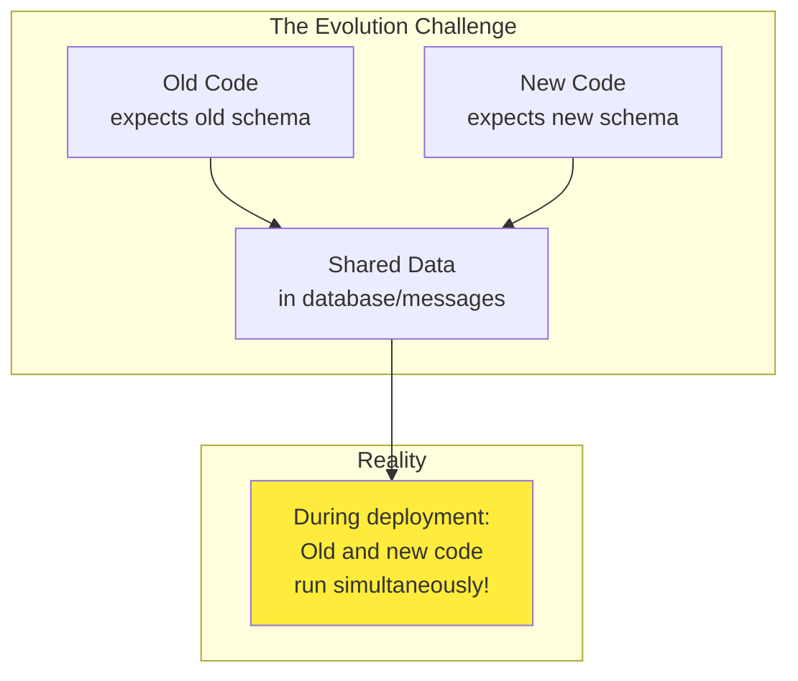
```mermaid
graph TB
    subgraph "The Evolution Challenge"
        OLD["Old Code<br/>expects old schema"]
        NEW["New Code<br/>expects new schema"]
        DATA["Shared Data<br/>in database/messages"]
    end

    subgraph "Reality"
        PROB["During deployment:<br/>Old and new code<br/>run simultaneously!"]
    end

    OLD --> DATA
    NEW --> DATA
    DATA --> PROB

    style PROB fill:#ffeb3b
```

**The challenge**: How do we manage schema changes when old and new code need to coexist?

This chapter examines how various data formats handle schema evolution, and how those formats are deployed in real systems: databases, web services, REST APIs, remote procedure calls (RPCs), workflow engines, and asynchronous event-driven systems.

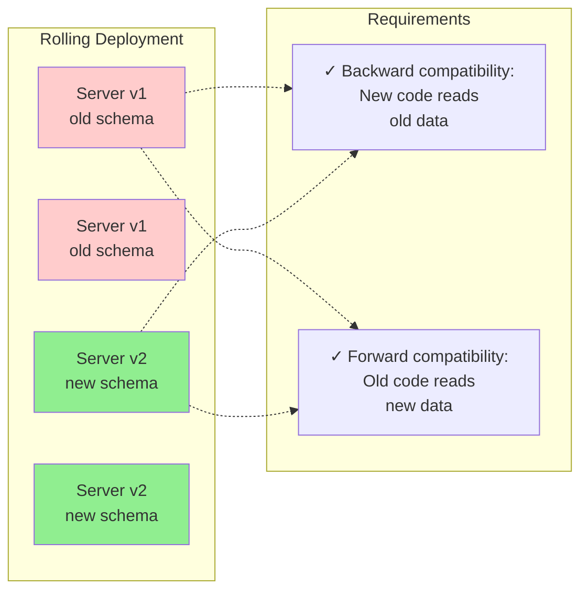
```mermaid
graph LR
    subgraph "Rolling Deployment"
        V1["Server v1<br/>old schema"]
        V2["Server v1<br/>old schema"]
        V3["Server v2<br/>new schema"]
        V4["Server v2<br/>new schema"]
    end

    subgraph "Requirements"
        REQ1["✓ Backward compatibility:<br/>New code reads<br/>old data"]
        REQ2["✓ Forward compatibility:<br/>Old code reads<br/>new data"]
    end

    V1 -.-> REQ1
    V3 -.-> REQ1
    V1 -.-> REQ2
    V3 -.-> REQ2

    style V1 fill:#ffcccc
    style V2 fill:#ffcccc
    style V3 fill:#90EE90
    style V4 fill:#90EE90
```

**Key concepts**:
- **Backward compatibility**: Ensures that newer code can read data written by older code
- **Forward compatibility**: Ensures that older code can read data written by newer code

> In the context of APIs, if you want an older client to successfully call a newer service, you need **backward compatibility on the request** and **forward compatibility on the response**. For a newer client to call an older service, you need **forward compatibility on the request** and **backward compatibility on the response**.

This chapter explores how different encoding formats handle schema evolution, and how dataflows through databases, services, durable workflows, and event-driven systems all depend on those format choices.

---

## 1. Formats for Encoding Data

When you want to send data over the network or write it to a file, you need to encode it as a sequence of bytes.

Programs usually work with data in (at least) two representations:
1. **In memory**, data is kept in objects, structs, lists, arrays, hash tables, trees, and so on. These data structures are optimized for efficient access and manipulation by the CPU (typically using pointers).
2. **On disk or on the network**, data is encoded as some kind of self-contained sequence of bytes. Since a pointer wouldn't make sense to any other process, this sequence-of-bytes representation often looks quite different from the data structures that are normally used in memory.

Thus, we need some kind of translation between the two representations. The translation from the in-memory representation to a byte sequence is called **encoding** (also known as *serialization* or *marshaling*), and the reverse is called **decoding** (*parsing*, *deserialization*, or *unmarshaling*).

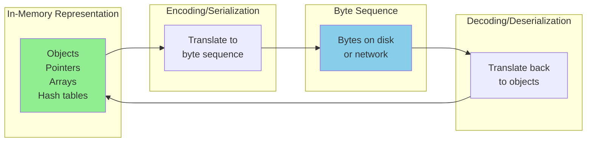
```mermaid
graph LR
    subgraph "In-Memory Representation"
        OBJ["Objects<br/>Pointers<br/>Arrays<br/>Hash tables"]
    end

    subgraph "Encoding/Serialization"
        ENCODE["Translate to<br/>byte sequence"]
    end

    subgraph "Byte Sequence"
        BYTES["Bytes on disk<br/>or network"]
    end

    subgraph "Decoding/Deserialization"
        DECODE["Translate back<br/>to objects"]
    end

    OBJ --> ENCODE
    ENCODE --> BYTES
    BYTES --> DECODE
    DECODE --> OBJ

    style OBJ fill:#90EE90
    style BYTES fill:#87CEEB
```

> **Terminology clash**: The term *serialization* is unfortunately also used in the context of transactions (see Chapter 8), with a completely different meaning. To avoid overloading the word, we use **encoding** in this chapter, even though serialization is perhaps more common.

Sometimes encoding/decoding is not needed — for example, when a database operates directly on compressed data loaded from disk. There are also *zero-copy data formats* designed to be used both at runtime and on disk/on the network without an explicit conversion step, such as Cap'n Proto and FlatBuffers.

Most systems, however, do need to convert between in-memory objects and flat byte sequences. As this is such a common problem, there are myriad libraries and encoding formats to choose from.

### 1.1 Language-Specific Formats

Many programming languages come with built-in support for encoding in-memory objects into byte sequences:
- Java has `java.io.Serializable`
- Python has `pickle` (used only for trusted, in-process data — never for cross-process or untrusted payloads)
- Ruby has `Marshal`
- Third-party libraries: Kryo for Java, etc.

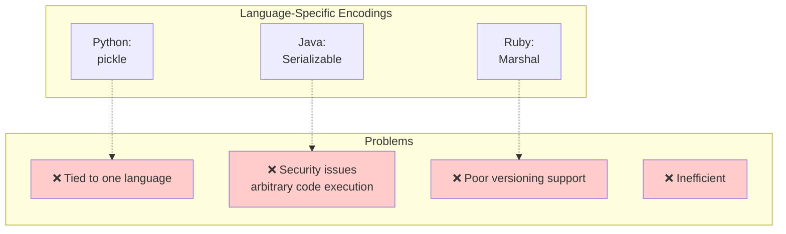
```mermaid
graph TB
    subgraph "Language-Specific Encodings"
        PYTHON["Python:<br/>pickle"]
        JAVA["Java:<br/>Serializable"]
        RUBY["Ruby:<br/>Marshal"]
    end

    subgraph "Problems"
        P1["❌ Tied to one language"]
        P2["❌ Security issues<br/>arbitrary code execution"]
        P3["❌ Poor versioning support"]
        P4["❌ Inefficient"]
    end

    PYTHON -.-> P1
    JAVA -.-> P2
    RUBY -.-> P3

    style P1 fill:#ffcccc
    style P2 fill:#ffcccc
    style P3 fill:#ffcccc
    style P4 fill:#ffcccc
```

These encoding libraries are convenient because they allow in-memory objects to be saved and restored with minimal additional code. However, they also have a number of deep problems:

- **Language lock-in**: The encoding is often tied to a particular programming language, and reading the data in another language is difficult. If you store or transmit data in such an encoding, you are committing yourself to your current programming language for potentially a long time, and precluding integration with systems written in other languages.
- **Security issues**: To restore data in the same object types, the decoding process needs to be able to instantiate arbitrary classes. This is frequently a source of security problems; if an attacker can get your application to decode an arbitrary byte sequence, they can instantiate arbitrary classes, which in turn often allows them to do terrible things such as remotely executing arbitrary code.
- **Versioning is an afterthought**: Versioning data is often an afterthought in these libraries. As they are intended for quick and easy encoding of data, they often neglect the inconvenient problems of forward and backward compatibility.
- **Efficiency**: CPU time taken to encode or decode, and the size of the encoded structure, is often an afterthought. For example, Java's built-in serialization is notorious for its bad performance and bloated encoding.

```python
# Illustrative snippet — DO NOT use language-native encodings for
# data that crosses a process boundary or comes from an untrusted source.
# Python's pickle, Java's Serializable, Ruby's Marshal, etc. all share the
# problems described above.

# Suppose we *did* call pickle.dumps({"name": "Alice", "age": 30}):
#   - The output would be a Python-specific binary blob (~40 bytes).
#   - pickle.loads() on the other side requires a Python interpreter with
#     the exact same class definitions available — no Go/Rust/JS client
#     can read it.
#   - If the byte stream is attacker-controlled, pickle can execute
#     arbitrary Python code on decode (CWE-502 / "deserialization of
#     untrusted data").
#   - Renaming or removing a field in the class silently breaks decoding
#     of older payloads — there is no schema evolution story.

# For these reasons, prefer a schema-driven cross-language format such
# as JSON, Protocol Buffers, or Avro when data needs to outlive one
# process or one trust boundary.
```

**Verdict**: It's generally a bad idea to use your language's built-in encoding for anything other than very transient purposes.

### 1.2 JSON, XML, and CSV

When moving to standardized encodings that can be written and read by many programming languages, **JSON** and **XML** are the obvious contenders: they are widely known and widely supported. **CSV** is another popular language-independent format, but it supports only tabular data without nesting.

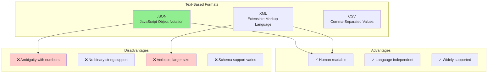
```mermaid
graph TB
    subgraph "Text-Based Formats"
        JSON["JSON<br/>JavaScript Object Notation"]
        XML["XML<br/>Extensible Markup Language"]
        CSV["CSV<br/>Comma-Separated Values"]
    end

    subgraph "Advantages"
        A1["✓ Human readable"]
        A2["✓ Language independent"]
        A3["✓ Widely supported"]
    end

    subgraph "Disadvantages"
        D1["❌ Ambiguity with numbers"]
        D2["❌ No binary string support"]
        D3["❌ Verbose, larger size"]
        D4["❌ Schema support varies"]
    end

    JSON --> A1
    JSON --> D1
    XML --> A1
    XML --> D3

    style JSON fill:#90EE90
    style D1 fill:#ffcccc
    style D3 fill:#ffcccc
```

JSON, XML, and CSV are textual formats, and thus they are somewhat human-readable, although the syntax is a common topic of debate. Besides the superficial syntactic issues, they also have various other problems:

- **Verbosity**: XML is often criticized for being too verbose and unnecessarily complicated.
- **Number ambiguity**: There is a lot of ambiguity around the encoding of numbers. In XML and CSV, you cannot distinguish between a number and a string that happens to consist of digits (except by referring to an external schema). JSON distinguishes strings and numbers, but it doesn't distinguish integers and floating-point numbers, and it doesn't specify a precision.

This is a problem when dealing with large numbers — for example, integers greater than 2^53 cannot be exactly represented in an IEEE 754 double-precision floating-point number, so such numbers become inaccurate when parsed in a language that uses floating-point numbers, such as JavaScript.

> **Example: Twitter post IDs**: X (formerly Twitter) uses a 64-bit number to identify each post. The JSON returned by the API includes post IDs twice — once as a JSON number and once as a decimal string — to work around the incorrect parsing of numbers by JavaScript applications.

```python
import json

# Problem: Large integers lose precision
large_number = 9007199254740993
encoded = json.dumps({'id': large_number})
decoded = json.loads(encoded)

print(f"Original: {large_number}")
print(f"After JSON: {decoded['id']}")
# May not be equal depending on implementation!

# Problem: No binary data support
binary_data = b'\x00\x01\x02\xff'
# json.dumps({'data': binary_data})  # TypeError!

# Workaround: Base64 encode
import base64
encoded_binary = base64.b64encode(binary_data).decode('ascii')
json_safe = json.dumps({'data': encoded_binary})
# But now it's 33% larger and not human-readable
```

- **No binary strings**: JSON and XML have good support for Unicode character strings, but they don't support binary strings (sequences of bytes without a character encoding). Binary strings are a useful feature, so people get around this limitation by encoding binary data as text using **Base64**. This works, but it is somewhat hacky and increases the data size by about a third.
- **Complex schemas**: XML Schema and JSON Schema are powerful and thus quite complicated to learn and implement. Since the correct interpretation of data depends on information in the schema, applications that don't use XML/JSON Schemas may need to hardcode the appropriate encoding/decoding logic instead.
- **CSV's vagueness**: CSV does not have any schema, so it is up to the application to define the meaning of each row and column. If an application change adds a new row or column, you have to handle that change manually. CSV is also a quite vague format (what happens if a value contains a comma or a newline character?).

Despite these flaws, JSON, XML, and CSV are good enough for many purposes. They will likely remain popular, especially as data interchange formats (i.e., for sending data from one organization to another). In these situations, as long as people agree on the format, it often doesn't matter how pretty or efficient it is.

### 1.3 JSON Schema

JSON Schema has become widely adopted as a way to model data whenever it's exchanged between systems or written to storage. You'll find JSON Schemas in:
- Web services (as part of the OpenAPI web service specification)
- Schema registries such as Confluent's Schema Registry and Red Hat's Apicurio Registry
- Databases (e.g., PostgreSQL's `pg_jsonschema` validator extension and MongoDB's `$jsonSchema` validator syntax)

The JSON Schema specification offers a number of features. Schemas include standard primitive types such as `string`, `number`, `integer`, `object`, `array`, `boolean`, and `null`. JSON Schema also offers a separate validation specification that allows developers to overlay constraints on fields. For example, a port field might have a minimum value of 1 and a maximum of 65,535.

**Open vs. closed content models**:
- An **open content model** permits any field not defined in the schema to exist with any datatype
- A **closed content model** allows only fields that are explicitly defined

The open content model in JSON Schema is enabled when `additionalProperties` is set to `true`, which is the **default**. Thus, JSON Schemas are usually a definition of what isn't permitted (namely, invalid values on any of the defined fields) rather than what is permitted.

Open content models are powerful, but they can be complex. For example, say you want to define a map from integers (such as IDs) to strings. JSON does not have a map or dictionary type that allows integer keys; JSON objects always use strings as keys. To accommodate your needs, you can constrain this type with JSON Schema so that keys can contain only digits and values can be only strings using `patternProperties` and `additionalProperties`, as shown in the example below.

**Example 5-1. A JSON Schema with integer keys and string values**
```json
{
  "$schema": "http://json-schema.org/draft-07/schema#",
  "type": "object",
  "patternProperties": {
    "^[0-9]+$": {
      "type": "string"
    }
  },
  "additionalProperties": false
}
```

In addition to open and closed content models and validators, JSON Schema supports conditional `if/else` schema logic, named types, references to remote schemas, and much more. All of this makes for a very powerful schema language. Such features also make for unwieldy definitions. It can be challenging to resolve remote schemas, reason about conditional rules, or evolve schemas in a forward- or backward-compatible way. Similar concerns apply to XML Schema.

### 1.4 Binary Encodings

JSON is less verbose than XML, but both still use a lot of space compared to binary formats. This observation led to the development of a profusion of binary encodings for JSON (MessagePack, CBOR, BSON, BJSON, UBJSON, BISON, Hessian, and Smile, to name a few) and XML (WBXML and Fast Infoset, for example).

These formats have been adopted in various niches, as they are more compact and sometimes faster to parse, but none of them are as widely adopted as the textual versions of JSON and XML. Some of these formats extend the set of datatypes (e.g., distinguishing integers and floating-point numbers, or adding support for binary strings), but otherwise they keep the JSON/XML data model unchanged. In particular, since they don't prescribe a schema, they need to include all the object field names within the encoded data.

Let's look at an example of **MessagePack**, a binary encoding for JSON.

**Example 5-2. A record that we will encode in several binary formats in this chapter**
```json
{
  "userName": "Martin",
  "favoriteNumber": 1337,
  "interests": ["daydreaming", "hacking"]
}
```

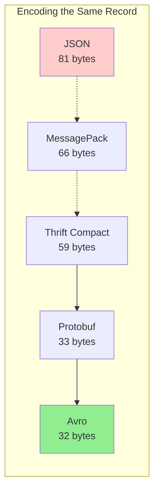
```mermaid
graph LR
    subgraph "Encoding the Same Record"
        JSON["JSON<br/>81 bytes"]
        MSGPACK["MessagePack<br/>66 bytes"]
        THRIFT["Thrift Compact<br/>59 bytes"]
        PB["Protobuf<br/>33 bytes"]
        AVRO["Avro<br/>32 bytes"]
    end

    JSON -.-> MSGPACK
    MSGPACK -.-> THRIFT
    THRIFT --> PB
    PB --> AVRO

    style JSON fill:#ffcccc
    style AVRO fill:#90EE90
```

The first few bytes of the MessagePack encoding are as follows:
1. The first byte, `0x83`, indicates that what follows is an object (most significant four bits = `0x80`) with three fields (least significant four bits = `0x03`).
2. The second byte, `0xa8`, indicates that what follows is a string (most significant four bits = `0xa0`) that is eight bytes long (least significant four bits = `0x08`).
3. The next eight bytes are the field name `userName` in ASCII.
4. The next seven bytes encode the six-letter string value `Martin` with the prefix `0xa6`.

The binary encoding is 66 bytes long, which is only a little less than the 81 bytes taken by the textual JSON encoding. All the binary encodings of JSON are similar in this regard. It's not clear whether such a small space reduction (and perhaps a speedup in parsing) is worth the loss of human-readability.

In the following sections we will see how we can do much better, encoding the same record in half as many bytes.

---

## 2. Protocol Buffers and Apache Thrift

Protocol Buffers (protobuf) is a binary encoding library developed at Google. It is similar to Apache Thrift, which was originally developed at Facebook; most of what this section says about Protocol Buffers also applies to Thrift.

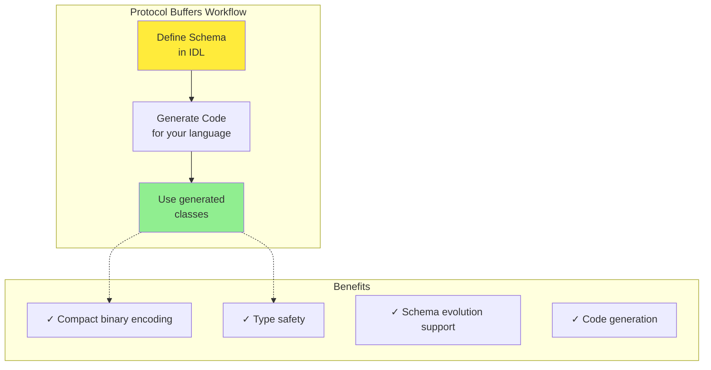
```mermaid
graph TB
    subgraph "Protocol Buffers Workflow"
        SCHEMA["Define Schema<br/>in IDL"]
        GENERATE["Generate Code<br/>for your language"]
        USE["Use generated<br/>classes"]
    end

    subgraph "Benefits"
        B1["✓ Compact binary encoding"]
        B2["✓ Type safety"]
        B3["✓ Schema evolution support"]
        B4["✓ Code generation"]
    end

    SCHEMA --> GENERATE
    GENERATE --> USE
    USE -.-> B1
    USE -.-> B2

    style SCHEMA fill:#ffeb3b
    style USE fill:#90EE90
```

### 2.1 Protocol Buffers

Protocol Buffers requires a schema for any data that is encoded. To encode the data in Example 5-2, you would describe the schema in the Protocol Buffers interface definition language (IDL) like this:

```protobuf
syntax = "proto3";

message Person {
  string user_name = 1;
  int64 favorite_number = 2;
  repeated string interests = 3;
}
```

Protocol Buffers comes with a code generation tool that takes a schema definition like the one shown here and produces classes that implement the schema in various programming languages. Your application code can call this generated code to encode or decode records that conform to the schema. The schema language is very simple compared to JSON Schema; it defines the fields of each record and their types, but it does not support other restrictions on the possible values of fields.

Encoding Example 5-2 using a Protocol Buffers encoder requires **33 bytes**. Each field has a type annotation (to indicate whether it is a string, integer, etc.) and, where required, a length indication (such as the length of a string). The strings that appear in the data are encoded in ASCII (UTF-8), as before.

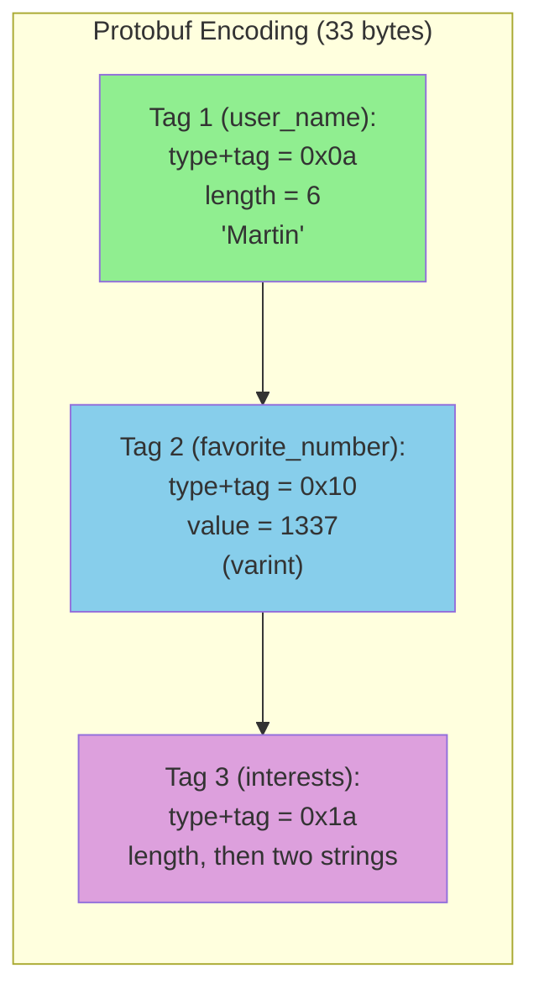
```mermaid
graph LR
    subgraph "Protobuf Encoding (33 bytes)"
        F1["Tag 1 (user_name):<br/>type+tag = 0x0a<br/>length = 6<br/>'Martin'"]
        F2["Tag 2 (favorite_number):<br/>type+tag = 0x10<br/>value = 1337<br/>(varint)"]
        F3["Tag 3 (interests):<br/>type+tag = 0x1a<br/>length, then two strings"]
    end

    F1 --> F2 --> F3

    style F1 fill:#90EE90
    style F2 fill:#87CEEB
    style F3 fill:#DDA0DD
```

Unlike MessagePack, this example has **no field names** (`userName`, `favoriteNumber`, `interests`). Instead, the encoded data contains **field tags**, which are numbers (1, 2, and 3). Those are the numbers that appear in the schema definition. Field tags are like aliases for fields — they are a compact way of indicating the field we're talking about, without having to spell out the field name.

Protocol Buffers saves even more space by packing the **field type and tag number** into a single byte. It uses **variable-length integers**: the number 1337 is encoded in two bytes, with the top bit of each byte used to indicate whether there are still more bytes to come (the least significant seven bits are stored in the first byte to simplify reconstructing the integer as bytes are read).

| Range | Bytes |
|-------|-------|
| -64 to 63 | 1 byte |
| -8,192 to 8,191 | 2 bytes |
| Larger numbers | more bytes |

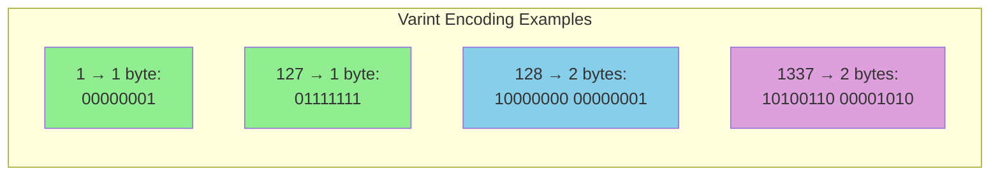
```mermaid
graph LR
    subgraph "Varint Encoding Examples"
        V1["1 → 1 byte:<br/>00000001"]
        V2["127 → 1 byte:<br/>01111111"]
        V3["128 → 2 bytes:<br/>10000000 00000001"]
        V4["1337 → 2 bytes:<br/>10100110 00001010"]
    end

    style V1 fill:#90EE90
    style V2 fill:#90EE90
    style V3 fill:#87CEEB
    style V4 fill:#DDA0DD
```

Protocol Buffers doesn't have an explicit list or array datatype. Instead, the `repeated` modifier on the `interests` field indicates that the field contains a list of values rather than a single value. In the binary encoding, the list elements are represented simply as repeated occurrences of the same field tag within the same record.

### 2.2 Schema Evolution Rules

Schemas inevitably need to change over time — we call this **schema evolution**. How does Protocol Buffers handle schema changes while keeping backward and forward compatibility?

An encoded record is just the concatenation of its encoded fields. Each field is identified by its tag number (the numbers 1, 2, 3 in the sample schema) and annotated with a datatype (e.g., string or integer). If a field value is not set, it is simply omitted from the encoded record.

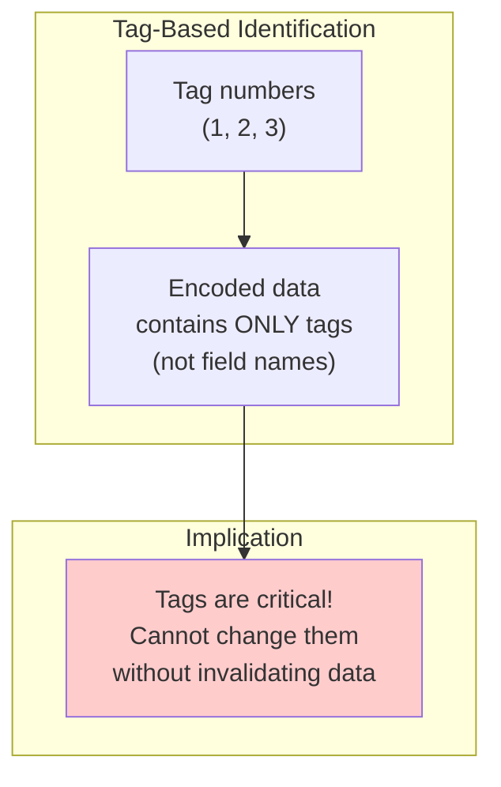
```mermaid
graph TB
    subgraph "Tag-Based Identification"
        TAG["Tag numbers<br/>(1, 2, 3)"]
        DATA["Encoded data<br/>contains ONLY tags<br/>(not field names)"]
    end

    subgraph "Implication"
        RULE["Tags are critical!<br/>Cannot change them<br/>without invalidating data"]
    end

    TAG --> DATA --> RULE

    style RULE fill:#ffcccc
```

From this, you can see that **field tags are critical** to the meaning of the encoded data. You can change the name of a field in the schema, since the encoded data never refers to field names, but you cannot change a field's tag, since that would make all existing encoded data invalid.

The single table below summarizes compatibility rules for both **Protobuf** and **Avro** (Avro details are discussed in §3). Pick one as your reference; the columns are forward compatibility (old code reads new data) and backward compatibility (new code reads old data).

| Action | Format | Forward-compat | Backward-compat | Notes |
|--------|--------|----------------|-----------------|-------|
| Add field with new tag (default value) | Protobuf | ✓ | ✓ | New readers see default for old data; old readers ignore unknown tag |
| Remove field | Protobuf | ✓ | ✓ | Never reuse the tag — old data still references it |
| Rename field (same tag) | Protobuf | ✓ | ✓ | Encoded data uses tags, not names |
| Add field with default value | Avro | ✓ | ✓ | Default value is used when reader expects a field the writer didn't include |
| Remove field with default value | Avro | ✓ | ✓ | Old readers see the writer's field, fill in reader's default if it has one |
| Add field without default value | Avro | — | ✗ | Old readers can't fill a value for the missing field |
| Remove field without default value | Avro | ✗ | — | New readers see an unexpected field with no default |
| Rename field (with alias) | Avro | — | ✓ | Old writer's name maps via alias to new reader's name |
| Change datatype (compatible widening) | Both | ⚠️ may truncate | ✓ | E.g., 32-bit → 64-bit is safe; 64-bit → 32-bit may truncate |
| Reorder fields | Both | ✓ | ✓ | Protobuf uses tags; Avro resolves by name |

```protobuf
// Schema v1
message Person {
  string user_name = 1;
  int64 favorite_number = 2;
}

// Schema v2 - Adding email field with NEW tag
message Person {
  string user_name = 1;
  int64 favorite_number = 2;
  string email = 4;  // NEW tag number 4
}
```

In some programming languages, `null` is an acceptable default for any variable, but this is not the case in Avro: if you want to allow a field to be `null`, you have to use a **union type**. For example, `union { null, long, string } field;` indicates that the field can be a number, a string, or `null`. You can use `null` as a default value only if it is the first branch of the union. This is a little more verbose than having everything nullable by default, but it helps prevent bugs by being explicit about what can and cannot be `null`.

Changing the datatype of a field is possible, provided that the format can convert the type. In Avro specifically, the reader's schema can also contain **aliases** for field names, so it can match an old writer's schema field names against the aliases. Adding a branch to a union type is backward compatible but not forward compatible.

---

## 3. Avro

Apache Avro is another binary encoding format, with some interesting differences from Protocol Buffers. It was started in 2009 as a subproject of Hadoop, as a result of Protocol Buffers not being a good fit for Hadoop's use cases.

Avro also uses a schema to specify the structure of the data being encoded. It has two schema languages: one (Avro IDL) intended for human editing, and one (based on JSON) that is more easily machine-readable. As with Protocol Buffers, the schema languages specify only fields and their types and do not support complex validation rules like those in JSON Schema.

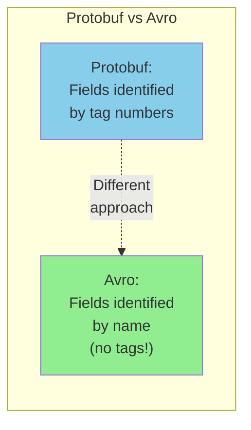
```mermaid
graph LR
    subgraph "Protobuf vs Avro"
        PROTO["Protobuf:<br/>Fields identified<br/>by tag numbers"]
        AVRO["Avro:<br/>Fields identified<br/>by name<br/>(no tags!)"]
    end

    PROTO -.->|"Different<br>approach"| AVRO

    style PROTO fill:#87CEEB
    style AVRO fill:#90EE90
```

Written in Avro IDL, our example schema might look like this:

```avro
record Person {
  string userName;
  union { null, long } favoriteNumber = null;
  array<string> interests;
}
```

The equivalent JSON representation of that schema is as follows:

```json
{
  "type": "record",
  "name": "Person",
  "fields": [
    {"name": "userName", "type": "string"},
    {"name": "favoriteNumber", "type": ["null", "long"], "default": null},
    {"name": "interests", "type": {"type": "array", "items": "string"}}
  ]
}
```

Notice that the schema has **no tag numbers**. If we encode our record (Example 5-2) using this schema, the Avro binary encoding is just **32 bytes** long — the most compact of all the encodings we have seen.

If you examine the byte sequence, you can see that nothing identifies fields or their datatypes. The encoding simply consists of values concatenated together. A string is just a length prefix followed by UTF-8 bytes, but nothing in the encoded data tells you that it is a string. An integer is encoded using a variable-length encoding.

To parse the binary data, you go through the fields in the order that they appear in the schema and use the schema to determine the datatype of each field. This means that the binary data can be decoded correctly only if the code reading the data is using the **exact same schema** as the code that wrote the data. Any mismatch in the schema between the reader and the writer would mean incorrectly decoded data.

### 3.1 The Writer's Schema and the Reader's Schema

Avro's key insight: support for schema evolution comes from the requirement that the **writer's schema and the reader's schema are explicitly available at decode time**.

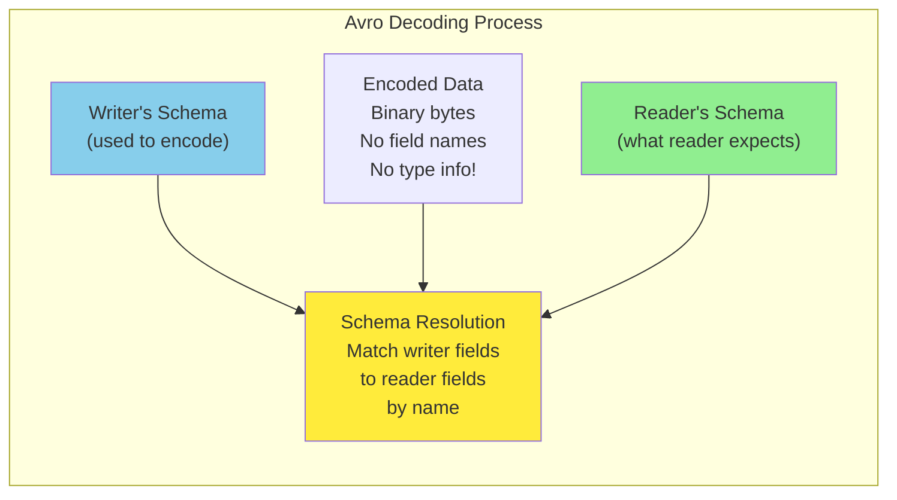
```mermaid
graph LR
    subgraph "Avro Decoding Process"
        WRITER["Writer's Schema<br/>(used to encode)"]

        DATA["Encoded Data<br/>Binary bytes<br/>No field names<br/>No type info!"]

        READER["Reader's Schema<br/>(what reader expects)"]

        RESOLVE["Schema Resolution<br/>Match writer fields<br/>to reader fields<br/>by name"]
    end

    WRITER --> RESOLVE
    DATA --> RESOLVE
    READER --> RESOLVE

    style WRITER fill:#87CEEB
    style READER fill:#90EE90
    style RESOLVE fill:#ffeb3b
```

When an application wants to encode some data (to write it to a file or database, send it over the network, etc.), the application uses whatever version of the schema it knows about — for example, a schema that is compiled into the application. This is known as the **writer's schema**.

To decode some data, an application uses two schemas: the writer's schema, which is identical to the one used for encoding, and the **reader's schema**, which may be different. The reader's schema defines the fields of each record that the application code is expecting, and their types.

If the reader's and writer's schemas are the same, decoding is easy. If they are different, Avro resolves the differences by comparing the two and translating the data from the writer's schema into the reader's schema.

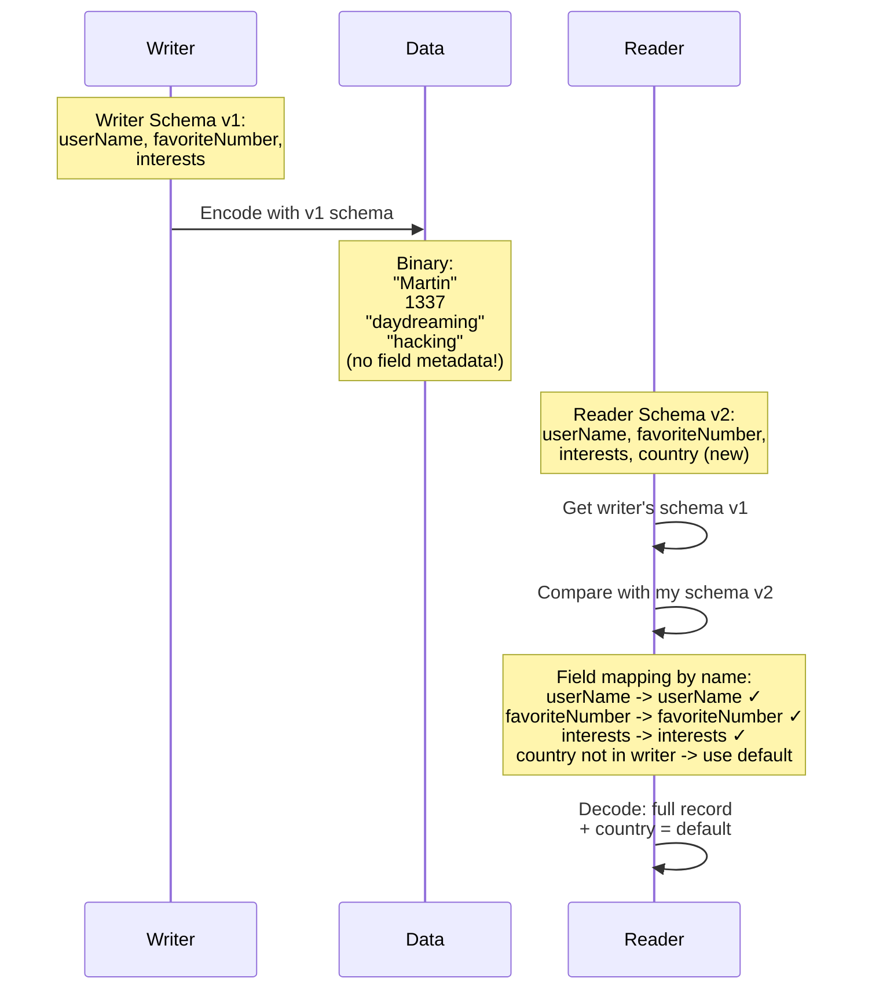
```mermaid
sequenceDiagram
    participant Writer
    participant Data
    participant Reader

    Note over Writer: Writer Schema v1:<br/>userName, favoriteNumber,<br/>interests

    Writer->>Data: Encode with v1 schema
    Note over Data: Binary: <br/>"Martin"<br/>1337<br/>"daydreaming"<br/>"hacking"<br/>(no field metadata!)

    Note over Reader: Reader Schema v2:<br/>userName, favoriteNumber,<br/>interests, country (new)

    Reader->>Reader: Get writer's schema v1
    Reader->>Reader: Compare with my schema v2

    Note over Reader: Field mapping by name:<br/>userName -> userName ✓<br/>favoriteNumber -> favoriteNumber ✓<br/>interests -> interests ✓<br/>country not in writer -> use default

    Reader->>Reader: Decode: full record<br/>+ country = default
```

The Avro specification defines exactly how this resolution works. It's no problem if the writer's schema and the reader's schema have their fields in a different order, because the schema resolution matches up the fields by **field name**. If the code reading the data encounters a field that appears in the writer's schema but not in the reader's schema, it is ignored. If the code reading the data expects a certain field but the writer's schema does not contain a field of that name, it is filled in with a default value declared in the reader's schema.

### 3.2 Where Does the Writer's Schema Come From?

We've glossed over an important question: how does the reader know the schema that was used to encode a particular piece of data? We can't just include the entire schema with every record, because the schema would likely be much bigger than the encoded data, negating all the space savings from the binary encoding.

The answer depends on the context in which Avro is being used:

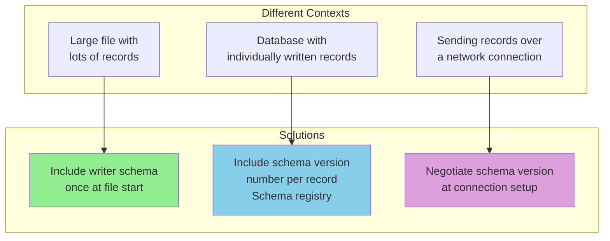
```mermaid
graph TB
    subgraph "Different Contexts"
        FILE["Large file with<br/>lots of records"]
        DB["Database with<br/>individually written records"]
        NET["Sending records over<br/>a network connection"]
    end

    subgraph "Solutions"
        FILE_SOL["Include writer schema<br/>once at file start"]
        DB_SOL["Include schema version<br/>number per record<br/>Schema registry"]
        NET_SOL["Negotiate schema version<br/>at connection setup"]
    end

    FILE --> FILE_SOL
    DB --> DB_SOL
    NET --> NET_SOL

    style FILE_SOL fill:#90EE90
    style DB_SOL fill:#87CEEB
    style NET_SOL fill:#DDA0DD
```

**Large file with lots of records**: A common use for Avro is storing a large file containing millions of records, all encoded with the same schema. The writer of that file can just include the schema once at the beginning of the file. Avro specifies a file format (object container files) to do this.

**Database with individually written records**: In a database, different records may be written at different points in time using different schemas — you cannot assume that all the records will have the same schema. The simplest solution in this case is to include a version number at the beginning of every encoded record and keep a list of schema versions in your database. A reader can fetch a record, extract the version number, and then fetch the writer's schema corresponding to that version number from the database. It can then decode the rest of the record by using that schema. Confluent's schema registry for Apache Kafka and LinkedIn's Espresso work this way.

**Sending records over a network connection**: When two processes are communicating over a bidirectional network connection, they can negotiate the schema version on connection setup and then use that schema for the lifetime of the connection. The Avro RPC protocol works like this.

A database of schema versions is useful to have in any case, since it acts as documentation and gives you a chance to check schema compatibility. You can use a simple incrementing integer or a hash of the schema as the version number.

### 3.3 Dynamically Generated Schemas

One advantage of Avro's approach, compared to Protocol Buffers, is that the schema doesn't contain any tag numbers. But why is this important? What's the problem with keeping a couple of numbers in the schema?

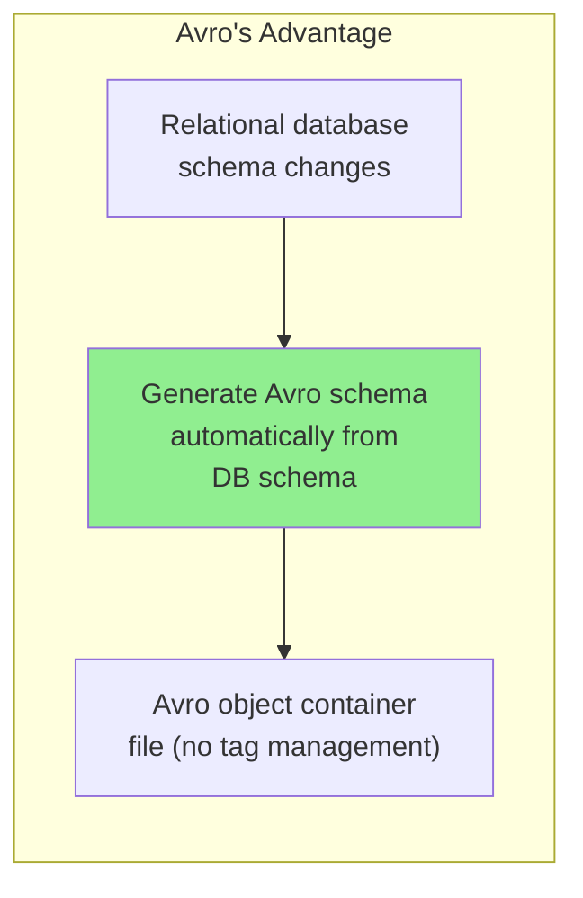
```mermaid
graph LR
    subgraph "Avro's Advantage"
        DB["Relational database<br/>schema changes"]
        GEN["Generate Avro schema<br/>automatically from<br/>DB schema"]
        OUT["Avro object container<br/>file (no tag management)"]
    end

    DB --> GEN --> OUT

    style GEN fill:#90EE90
```

The difference is that Avro is friendlier to dynamically generated schemas. For example, say you have a relational database whose contents you want to dump to a file, and you want to use a binary format to avoid the aforementioned problems with textual formats (JSON, CSV, XML). If you use Avro, you can fairly easily generate an Avro schema (in the JSON representation we saw earlier) from the relational schema and encode the database contents using that schema, dumping it all to an Avro object container file. You can generate a record schema for each database table, and each column becomes a field in that record. The column name in the database maps to the field name in Avro.

Now, if the database schema changes (e.g., if a table has one column added and one column removed), you can just generate a new Avro schema from the updated database schema and export data in the new Avro schema. The data export process does not need to pay any attention to the schema change — it can simply do the schema conversion every time it runs. Anyone who reads the new data files will see that the fields of the record have changed, but since the fields are identified by name, the updated writer's schema can still be matched up with the old reader's schema.

By contrast, if you were using Protocol Buffers for this purpose, the field tags would likely have to be assigned by hand. Every time the database schema changed, an administrator would have to manually update the mapping from database column names to field tags. (It might be possible to automate this, but the schema generator would have to be very careful to not assign previously used field tags.) This kind of dynamically generated schema simply wasn't a design goal of Protocol Buffers, whereas it was for Avro.

---

## 4. The Merits of Schemas

As we've seen, Protocol Buffers and Avro both use a schema to describe a binary encoding format. Their schema languages are much simpler than XML Schema or JSON Schema, which support more detailed validation rules (e.g., "the string value of this field must match this regular expression" or "the integer value of this field must be between 0 and 100"). As Protocol Buffers and Avro are simpler to implement and use, they have gained support among a fairly wide range of programming languages.

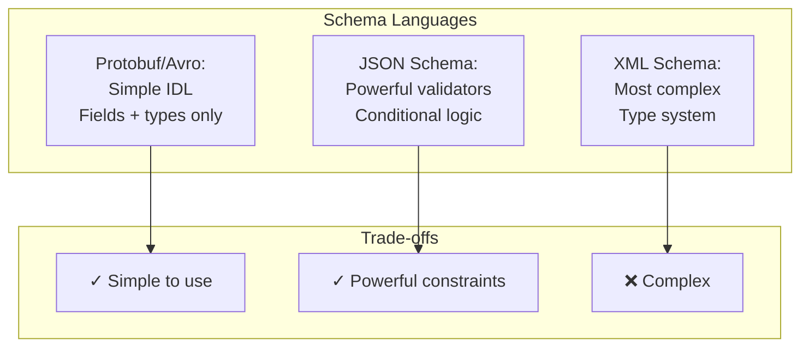
```mermaid
graph TB
    subgraph "Schema Languages"
        PROTO["Protobuf/Avro:<br/>Simple IDL<br/>Fields + types only"]
        JSON["JSON Schema:<br/>Powerful validators<br/>Conditional logic"]
        XML["XML Schema:<br/>Most complex<br/>Type system"]
    end

    subgraph "Trade-offs"
        SIMPLE["✓ Simple to use"]
        POWER["✓ Powerful constraints"]
        COMPLICATED["❌ Complex"]
    end

    PROTO --> SIMPLE
    JSON --> POWER
    XML --> COMPLICATED
```

The ideas on which these encodings are based are by no means new. For example, they have a lot in common with **ASN.1**, a schema definition language that was first standardized in 1984. It was used to define various network protocols, and its binary encoding (DER) is still used to encode SSL certificates (X.509). ASN.1 supports schema evolution using tag numbers, similar to Protocol Buffers. However, it's also very complex and badly documented, so ASN.1 is probably not a good choice for new applications.

Many data systems also implement some kind of proprietary binary encoding for their data. For example, most relational databases have a network protocol over which you can send queries to the database and get back responses. Those protocols are generally specific to a particular database, and the database vendor provides a driver (e.g., using the ODBC or JDBC APIs) that decodes responses from the database's network protocol into in-memory data structures.

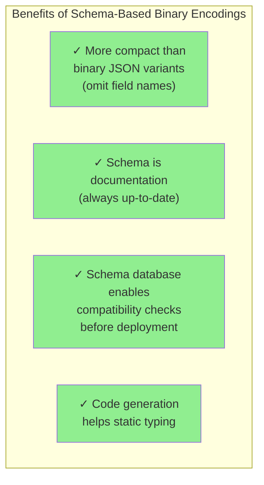
```mermaid
graph TB
    subgraph "Benefits of Schema-Based Binary Encodings"
        B1["✓ More compact than<br/>binary JSON variants<br/>(omit field names)"]
        B2["✓ Schema is documentation<br/>(always up-to-date)"]
        B3["✓ Schema database enables<br/>compatibility checks<br/>before deployment"]
        B4["✓ Code generation<br/>helps static typing"]
    end

    style B1 fill:#90EE90
    style B2 fill:#90EE90
    style B3 fill:#90EE90
    style B4 fill:#90EE90
```

So, we can see that although textual data formats such as JSON, XML, and CSV are widespread, binary encodings based on schemas are also a viable option. They have a number of nice properties:

- **Compactness**: They can be much more compact than the various "binary JSON" variants, since they can omit field names from the encoded data
- **Documentation**: The schema is a valuable form of documentation, and because the schema is required for decoding, you can be sure that it is up-to-date (whereas manually maintained documentation may easily diverge from reality)
- **Compatibility checking**: Keeping a database of schemas allows you to check forward and backward compatibility of schema changes before anything is deployed
- **Type safety**: For users of statically typed programming languages, the ability to generate code from the schema is useful, since it enables type checking at compile time

In summary, schema evolution allows the same kind of flexibility as schema-less/schema-on-read JSON databases provide, while also providing better guarantees about your data and better tooling. Still, it's advisable to keep the number of concurrent schema formats to a minimum to keep operations simple.

---

## 5. Modes of Dataflow

At the beginning of this chapter we said that whenever you want to send some data to another process with which you don't share memory — for example, when you want to send data over the network or write it to a file — you need to encode it as a sequence of bytes. We then discussed a variety of encodings for doing this.

We talked about forward and backward compatibility, which are important for evolvability (making change easy by allowing you to upgrade parts of your system independently rather than having to change everything at once). Compatibility is a relationship between one process that encodes the data and another process that decodes it.

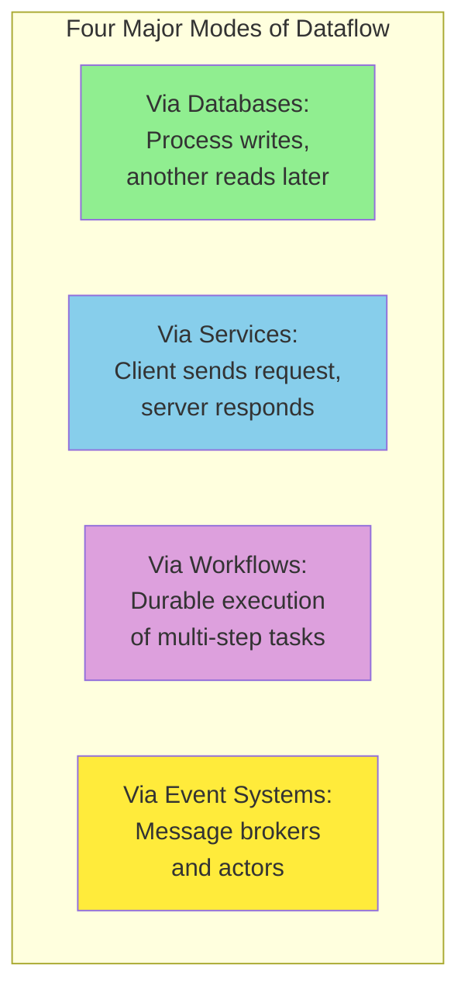
```mermaid
graph TB
    subgraph "Four Major Modes of Dataflow"
        DB["Via Databases:<br/>Process writes,<br/>another reads later"]
        SVC["Via Services:<br/>Client sends request,<br/>server responds"]
        WF["Via Workflows:<br/>Durable execution<br/>of multi-step tasks"]
        EVT["Via Event Systems:<br/>Message brokers<br/>and actors"]
    end

    style DB fill:#90EE90
    style SVC fill:#87CEEB
    style WF fill:#DDA0DD
    style EVT fill:#ffeb3b
```

That's a fairly abstract idea because data can flow from one process to another in many ways. Who encodes the data, and who decodes it? In the rest of this chapter, we will explore some of the most common ways data flows between processes via **databases**, **service calls**, **workflow engines**, and **asynchronous messages**.

### 5.1 Dataflow Through Databases

In a database, the process that does the writing encodes the data, and the process that does the reading decodes it. Just one process may be accessing the database, in which case the reader is simply a later version of the same process; in such a scenario, you can think of storing something in the database as sending a message to your future self.

**Backward compatibility is clearly necessary** here, as otherwise your future self won't be able to decode what you previously wrote.

In general, though, it's common for several processes to be accessing a database at the same time. Those processes might be different applications or services, or they may simply be multiple instances of the same service (running in parallel for scalability or fault tolerance). Either way, in such an environment, it is likely that some processes accessing the database will be running newer code and some will be running older code — for example, because a new version is currently being deployed in a rolling upgrade, so some instances have been updated while others haven't yet.

This means that a value in the database may be written by a newer version of the code and subsequently read by an older version of the code that is still running. Thus, **forward compatibility is also often required** for databases.

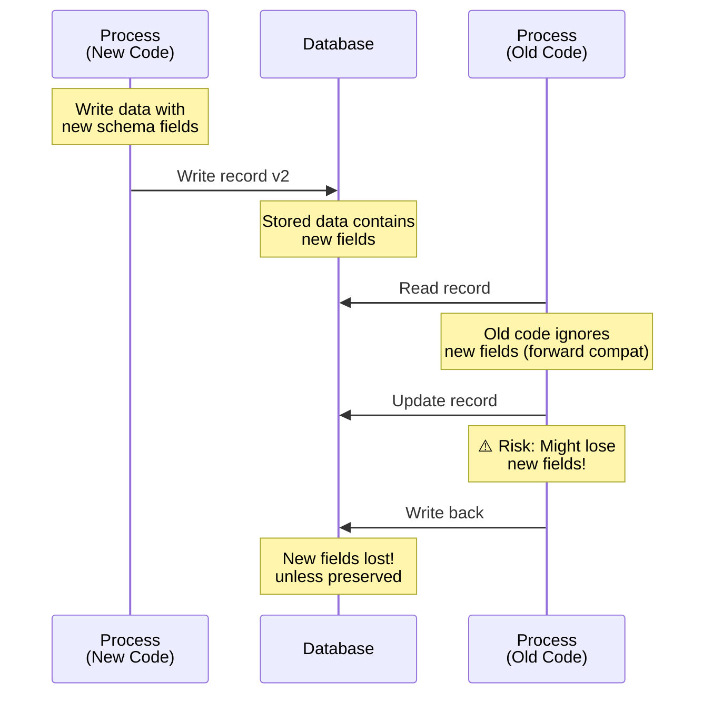
```mermaid
sequenceDiagram
    participant P1 as Process<br/>(New Code)
    participant DB as Database
    participant P2 as Process<br/>(Old Code)

    Note over P1: Write data with<br/>new schema fields

    P1->>DB: Write record v2
    Note over DB: Stored data contains<br/>new fields

    P2->>DB: Read record
    Note over P2: Old code ignores<br/>new fields (forward compat)

    P2->>DB: Update record
    Note over P2: ⚠️ Risk: Might lose<br/>new fields!

    P2->>DB: Write back
    Note over DB: New fields lost!<br/>unless preserved
```

#### Different Values Written at Different Times

A database generally allows any value to be updated at any time. Within a single database, you may have some values that were written five milliseconds ago and others that were written five years ago.

When you deploy a new version of your application (of a server-side application, at least), you may entirely replace the old version with the new version within a few minutes. **The same is not true of database contents**: the five-year-old data will still be there, in the original encoding, unless you have explicitly rewritten it since then. This observation is sometimes summed up as **data outlives code**.

Although rewriting (migrating) data into a new schema is certainly possible, it's expensive on a large dataset. Therefore, most databases defer the operation, performing it asynchronously and on a best-effort basis. For example, LSM-tree storage engines will rewrite data using the latest format during compaction. Most relational databases also allow simple schema changes, such as adding a new column with a null default value, without rewriting existing data. When an old row is read, the database fills in nulls for any columns that are missing from the encoded data on disk. Schema evolution thus allows the entire database to appear as if it was encoded with a single schema, even though the underlying storage may contain records encoded with various historical versions of the schema.

More complex schema changes — for example, changing a single-valued attribute to be multivalued, or moving some data into a separate table — still require data to be rewritten, often at the application level. Maintaining forward and backward compatibility across such migrations remains a research problem.

#### Archival Storage

Perhaps you take a snapshot of your database from time to time — say, for backup purposes or for loading into a data warehouse. In this case, the data dump will typically be encoded using the latest schema, even if the original encoding in the source database contained a mixture of schema versions from different eras. Since you're copying the data anyway, you might as well encode the copy of the data consistently.

As the data dump is written in one go and is thereafter immutable, formats like Avro object container files are a good fit. This is also a good opportunity to encode the data in an analytics-friendly column-oriented format such as **Parquet**.

---

### 5.2 Dataflow Through Services: REST and RPC

When you have processes that need to communicate over a network, you can arrange that communication in a few ways. The most common arrangement is to have two roles: **clients** and **servers**. The servers expose an API over the network, and the clients can connect to the servers to make requests to that API. The API exposed by the server is known as a **service**.

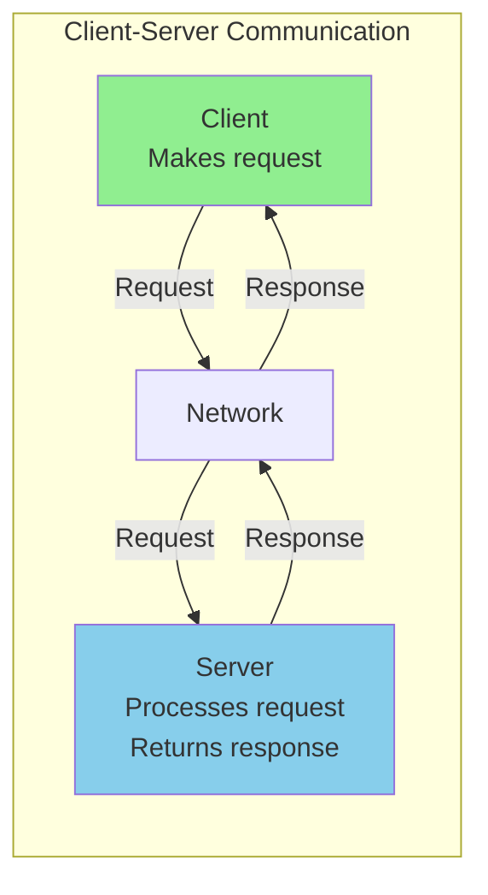
```mermaid
graph LR
    subgraph "Client-Server Communication"
        CLIENT["Client<br/>Makes request"]
        NETWORK["Network"]
        SERVER["Server<br/>Processes request<br/>Returns response"]
    end

    CLIENT -->|Request| NETWORK
    NETWORK -->|Request| SERVER
    SERVER -->|Response| NETWORK
    NETWORK -->|Response| CLIENT

    style CLIENT fill:#90EE90
    style SERVER fill:#87CEEB
```

The web works this way: clients (web browsers) make requests to web servers, making GET requests to download HTML, CSS, JavaScript, images, etc. and making POST requests to submit data to the server. The API consists of a standardized set of protocols and data formats (HTTP, URLs, SSL/TLS, HTML, etc.).

Web browsers are not the only type of client. For example, native apps running on mobile devices and desktop computers often talk to servers, and client-side JavaScript applications running inside web browsers can also make HTTP requests. In this case, the server's response is typically not HTML for displaying to a human, but rather data in an encoding that is convenient for further processing by the client-side application code (most often JSON).

In some ways, services are similar to databases: they typically allow clients to submit and query data. However, while databases allow arbitrary queries using the query languages, services expose an **application-specific API** that allows only inputs and outputs that are predetermined by the business logic (application code) of the service. This restriction provides a degree of encapsulation: services can impose fine-grained restrictions on what clients can and cannot do.

A key design goal of a service-oriented/microservices architecture is to make the application easier to change and maintain by making services independently deployable and evolvable. A common principle is that each service should be owned by one team, and that team should be able to release new versions of the service frequently, without having to coordinate with other teams. We should therefore expect old and new versions of servers and clients to be running at the same time, and so the data encoding used by servers and clients must be compatible across versions of the service API.

#### Web Services

When HTTP is used as the underlying protocol for talking to the service, it is called a **web service**. Web services are commonly used when building a service-oriented or microservices architecture. The term is perhaps a slight misnomer, because web services are used not only on the web but in several contexts:

```mermaid
graph TB
    subgraph "Web Service Usage Contexts"
        C1["Client app on user device<br/>(mobile, browser)<br/>over public internet"]
        C2["Service-to-service<br/>within same org<br/>(private network)"]
        C3["Cross-organization<br/>B2B integration<br/>(public APIs)"]
    end

    style C1 fill:#90EE90
    style C2 fill:#87CEEB
    style C3 fill:#DDA0DD
```

- A client application running on a user's device making requests to a service over HTTP
- One service making requests to another service owned by the same organization
- One service making requests to a service owned by a different organization (B2B integration)

The most popular service design philosophy is **REST**, which builds upon the principles of HTTP. REST emphasizes simple data formats, using URLs for identifying resources and using HTTP features for cache control, authentication, and content type negotiation. An API designed according to the principles of REST is called **RESTful**.

Code that needs to invoke a web service API must know which HTTP endpoint to query, and what data format to send and expect in response. Even if a service adopts RESTful design principles, clients need to somehow find out these details. Service developers often use an **IDL** (interface definition language) to define and document their service's API endpoints and data models, and to evolve them over time. Other developers can then use the service definition to determine how to query the service. The two most popular service IDLs are **OpenAPI** (also known as Swagger), used for web services that send and receive JSON, and **Protocol Buffers**, used for gRPC services.

**Example 5-3. An OpenAPI service definition in YAML**
```yaml
openapi: 3.0.0
info:
  title: Ping, Pong
  version: 1.0.0
servers:
  - url: http://localhost:8080
paths:
  /ping:
    get:
      summary: Given a ping, returns a pong message
      responses:
        '200':
          description: A pong
          content:
            application/json:
              schema:
                type: object
                properties:
                  message:
                    type: string
                  example: Pong!
```

Developers typically write OpenAPI service definitions in JSON or YAML. The service definition allows developers to define service endpoints, documentation, versions, data models, and much more. Protocol Buffers service definitions use the IDL we saw earlier.

**Example 5-4. A FastAPI service implementing the definition from Example 5-3**
```python
from fastapi import FastAPI
from pydantic import BaseModel

app = FastAPI(title="Ping, Pong", version="1.0.0")

class PongResponse(BaseModel):
    message: str = "Pong!"

@app.get("/ping", response_model=PongResponse,
         summary="Given a ping, returns a pong message")
async def ping():
    return PongResponse()
```

Many frameworks couple service definitions and server code together. In some cases, such as with the popular Python FastAPI framework, servers are written in code and an IDL is generated automatically. In other cases, such as with gRPC, the service definition is written first and server code scaffolding is generated. Both approaches allow developers to generate client libraries and SDKs in a variety of languages from the service definition. In addition to code generation, IDL tools such as Swagger's can generate documentation, verify schema change compatibility, and provide a graphical user interface (GUI) for developers to query and test services.

#### The Problems with Remote Procedure Calls (RPC)

Web services are merely the latest incarnation of a long line of technologies for making API requests over a network, many of which received a lot of hype but have serious problems. Enterprise JavaBeans (EJB), Java's Remote Method Invocation (RMI), Distributed Component Object Model (DCOM), Common Object Request Broker Architecture (CORBA), and SOAP/WS-* all have their issues.

All of these are based on the idea of **remote procedure calls (RPC)**, introduced back in the 1970s. The RPC model tries to make a request to a remote network service look the same as calling a function or method within the same process (this abstraction is called **location transparency**). Although this seems convenient at first, the approach is fundamentally flawed.

```mermaid
graph TB
    subgraph "Local Function Call"
        LOCAL["Predictable<br/>Fast<br/>Succeeds or fails<br/>deterministically"]
    end

    subgraph "Network Request"
        NET["Unpredictable latency<br/>May fail<br/>May timeout<br/>Idempotency matters<br/>Partial state"]
    end

    LOCAL -.->|"Not really<br/>the same!"| NET

    style LOCAL fill:#90EE90
    style NET fill:#ffcccc
```

A network request is very different from a local function call, and the full enumeration of those differences (predictability, timeouts, idempotency, variable latency, references, cross-language typing) is covered in the microservices discussion in Chapter 1.

There's no point trying to make a remote service look too much like a local object in your programming language, because it's a fundamentally different thing. Part of the appeal of REST is that it treats state transfer over a network as a process that is distinct from a function call.

#### Load Balancers, Service Discovery, and Service Meshes

All services communicate over the network. For this reason, a client must know the address of the service it's connecting to — a problem known as **service discovery**. The simplest approach is to configure a client to connect to the IP address and port where the service is running. This configuration will work, but if the server goes offline, is transferred to a new machine, or becomes overloaded, the client has to be manually reconfigured.

```mermaid
graph TB
    subgraph "Load Balancing Options"
        HW["Hardware LB<br/>(specialized appliance)"]
        SW["Software LB<br/>(NGINX, HAProxy)"]
        DNS["DNS-based<br/>(cached, slow to update)"]
        REG["Service Discovery<br/>(etcd, ZooKeeper)"]
        MESH["Service Mesh<br/>(sidecar, e.g., Istio)"]
    end

    HW --> SW
    SW --> DNS
    DNS --> REG
    REG --> MESH

    style HW fill:#ffcccc
    style SW fill:#87CEEB
    style DNS fill:#87CEEB
    style REG fill:#90EE90
    style MESH fill:#90EE90
```

To provide higher availability and scalability, multiple instances of a service are usually running on numerous machines, any of which can handle an incoming request. Spreading requests across these instances is called **load balancing**. Many load balancing and service discovery solutions are available:

- **Hardware load balancers**: Specialized equipment installed in datacenters. They allow clients to connect to a single host and port, and incoming connections are routed to one of the servers running the service.
- **Software load balancers (such as NGINX and HAProxy)**: These behave in much the same way as hardware load balancers, but rather than requiring a special appliance, they are applications that can be installed on a standard machine.
- **Domain Name Service (DNS)**: Supports load balancing by allowing multiple IP addresses to be associated with a single domain name. One drawback of this approach is that DNS is designed to propagate changes over longer periods of time and to cache DNS entries.
- **Service discovery systems**: These use a centralized registry such as etcd or Apache ZooKeeper rather than DNS to track which service endpoints are available. When a new service instance starts up, it registers itself with the service discovery system.
- **Service meshes**: This sophisticated form of load balancing combines software load balancers and service discovery. Unlike traditional software load balancers, which run on a separate machine, a service mesh load balancer is typically deployed as an in-process client library or as a process or "sidecar" container on both the client and server.

Which solution is appropriate depends on an organization's needs. Those running in a very dynamic service environment with an orchestrator such as Kubernetes often choose to run a service mesh such as Istio or Linkerd. Specialized infrastructure such as databases or messaging systems might require their own purpose-built load balancers. Simpler deployments are best served with software load balancers.

#### Data Encoding and Evolution for RPC

For evolvability, it is important that RPC clients and servers can be changed and deployed independently. Compared to data flowing through databases, we can make a simplifying assumption in the case of dataflow through services: **it is reasonable to assume that all the servers will be updated first and all the clients second**. Thus, you need **backward compatibility only on requests, and forward compatibility on responses**.

```mermaid
sequenceDiagram
    participant Old as Old Client
    participant New as New Server
    participant New2 as New Client

    Note over New: Server upgraded first

    Old->>New: Request (old schema)
    Note over New: Backward compatible:<br/>Handle old requests

    New->>Old: Response (new schema)
    Note over Old: Forward compatible:<br/>Ignore new fields

    Note over New2: Clients upgraded gradually

    New2->>New: Request (new schema)
    New->>New2: Response (new schema)
```

The backward and forward compatibility properties of an RPC scheme are inherited from whatever encoding it uses:
- **gRPC (Protocol Buffers)** and **Avro RPC** can be evolved according to the compatibility rules of the respective encoding format.
- **RESTful APIs** most commonly use JSON for responses and JSON or URI-encoded/form-encoded request parameters for requests. Adding optional request parameters and adding new fields to response objects are usually considered changes that maintain compatibility.

Service compatibility is made harder by the fact that RPC is often used for communication across organizational boundaries, so the provider of a service often has no control over its clients and cannot force them to upgrade. Thus, compatibility needs to be maintained for a long time, perhaps indefinitely. If a compatibility-breaking change is required, the service provider frequently ends up maintaining multiple versions of the service API side by side.

There is no agreement on how API versioning should work. For RESTful APIs, common approaches are to use a version number in the URL or in the HTTP Accept header. For services that use API keys to identify a particular client, another option is to store a client's requested API version on the server and to allow this version selection to be updated through a separate administrative interface.

---

### 5.3 Durable Execution and Workflows

By definition, service-based architectures have multiple services that are all responsible for different portions of an application. Consider a payment processing application that charges a credit card and deposits the funds into a bank account. This system would likely have different services responsible for fraud detection, credit card integration, bank integration, and so on.

Processing a single payment in our example requires many service calls. A payment processor service might invoke the fraud detection service to check for fraud, call the credit card service to debit the credit card, and call the banking service to deposit debited funds. We call this sequence of steps a **workflow**, and each step is a **task**. Workflows are typically defined as a graph of tasks. Workflow definitions may be written in a general-purpose programming language, a domain-specific language (DSL), or a markup language such as **Business Process Execution Language (BPEL)**.

```mermaid
graph TB
    START(["Payment<br/>requested"]) --> FRAUD["Check for<br/>fraud<br/>(Activity 1)"]
    FRAUD -->|"Not fraud"| DEBIT["Debit credit card<br/>(Activity 2)"]
    FRAUD -->|"Is fraud"| REJECT["Return<br/>Fraudulent result"]
    DEBIT --> DEPOSIT["Deposit to<br/>bank account<br/>(Activity 3)"]
    DEPOSIT --> NOTIFY["Notify<br/>customer<br/>(Activity 4)"]
    NOTIFY --> DONE(["PaymentResult"])

    style START fill:#90EE90
    style FRAUD fill:#87CEEB
    style DEBIT fill:#87CEEB
    style DEPOSIT fill:#87CEEB
    style NOTIFY fill:#87CEEB
    style DONE fill:#90EE90
```

> **Tasks, activities, and functions**: Different workflow engines use different names for tasks. Temporal, for example, uses the term **activity**. Others refer to tasks as **durable functions**. Though the names differ, the concepts are the same.

Workflows are run, or executed, by a **workflow engine**. Workflow engines determine when and on which machine to run each task, what to do if a task fails (e.g., if the machine crashes while the task is running), how many tasks are allowed to execute in parallel, and more.

Workflow engines are typically composed of an **orchestrator** and an **executor**: the orchestrator is responsible for scheduling tasks to be executed, and the executor is responsible for executing tasks. Execution begins when a workflow is triggered. The orchestrator triggers the workflow itself if users define a time-based schedule. External sources such as a web service or even a human can also trigger workflow executions.

There are many kinds of workflow engines that address a diverse set of use cases:
- **Airflow, Dagster, Prefect**: Integrate with data systems and orchestrate ETL tasks
- **Camunda, Orkes**: Provide a graphical notation for workflows (such as BPMN) so non-engineers can more easily define and execute workflows
- **Temporal, Restate**: Provide durable execution

#### Durable Execution

**Durable execution** frameworks have become a popular way to build service-based architectures that require transactionality. In our payment example, we would like to process each payment exactly once. A failure while the workflow is executing could result in a credit card charge but no corresponding bank account deposit.

In a service-based architecture, we can't simply wrap the two tasks in a database transaction. Moreover, we might be interacting with third-party payment gateways that we have limited control over.

```mermaid
graph TB
    subgraph "Why Durable Execution?"
        P1["Multi-step service calls"]
        P2["Need exactly-once<br/>semantics"]
        P3["Partial failures cause<br/>inconsistent state"]
        P4["No DB transaction<br/>across services"]
    end

    P1 --> P2 --> P3 --> P4

    style P4 fill:#ffcccc
```

Durable execution frameworks are a way to provide exactly-once semantics for workflows. If a task fails, the framework will re-execute the task, but will skip any RPC calls or state changes that the task made successfully before failing. It will pretend to make the call, but will instead return the results from the previous call. This is possible because durable execution frameworks log all RPCs and state changes to **durable storage** like a write-ahead log.

**Example 5-5. A Temporal workflow definition fragment for the payment workflow**
```python
from datetime import timedelta
from temporalio import workflow

# Activity implementations live in regular Python modules
# (not shown): check_fraud, debit_credit_card, deposit_to_bank

@workflow.defn
class PaymentWorkflow:
    @workflow.run
    async def run(self, payment: PaymentRequest) -> PaymentResult:
        # Each workflow.execute_activity is logged durably;
        # if this workflow is replayed (e.g. after a crash),
        # previously completed activities return their cached results
        # without making the RPC again.
        is_fraud = await workflow.execute_activity(
            check_fraud,
            payment,
            start_to_close_timeout=timedelta(seconds=15),
        )
        if is_fraud:
            return PaymentResultFraudulent

        credit_card_response = await workflow.execute_activity(
            debit_credit_card,
            payment,
            start_to_close_timeout=timedelta(seconds=15),
        )
        # ... continue with deposit + notification activities
        return PaymentResultSuccess(credit_card_response)
```

Frameworks like Temporal are not without their challenges:
- **External services must provide idempotent APIs**. Developers must remember to use unique IDs for these APIs to prevent duplicate execution.
- **Deterministic replay**: Because durable execution frameworks log each RPC call in order, they expect subsequent executions to make the same RPC calls in the same order. This makes code changes brittle; you might introduce undefined behavior simply by reordering function calls. Instead of modifying the code of an existing workflow, it is safer to deploy a new version of the code separately, so that re-executions of existing workflow invocations continue to use the old version, and only new invocations use the new code.
- **No nondeterministic code**: Because durable execution frameworks expect to replay all code deterministically (the same inputs produce the same outputs), nondeterministic code such as calling random number generators or system clocks is problematic. Frameworks often provide their own deterministic implementations of such library functions, but you have to remember to use them. Some also provide static analysis tools, like Temporal's Workflow Check, to determine whether nondeterministic behavior has been introduced.

```mermaid
graph TB
    subgraph "Durable Execution Rules"
        R1["✓ External services must<br/>be idempotent"]
        R2["✓ Don't reorder RPC calls<br/>in existing workflows"]
        R3["✓ Use framework-provided<br/>deterministic helpers<br/>(clocks, random)"]
        R4["⚠️ Run static analyzers<br/>for nondeterminism"]
    end

    style R1 fill:#90EE90
    style R2 fill:#90EE90
    style R3 fill:#90EE90
    style R4 fill:#FFA500
```

Making code deterministic is a powerful idea but tricky to do robustly. We will return to this topic in Chapter 9.

---

### 5.4 Event-Driven Architectures

In this final section, we will briefly look at event-driven architectures, which are another way encoded data can flow from one process to another. In this context, a request is called an **event** or **message**. Unlike with RPC, the sender usually does not wait for the recipient to process the event. Additionally, events are typically not sent to the recipient via a direct network connection, but go via an intermediary called a **message broker** (also called an *event broker*, *message queue*, or *message-oriented middleware*), which stores the message temporarily.

```mermaid
graph LR
    subgraph "Event-Driven Architecture"
        P["Producer<br/>(Sender)"]
        B["Message Broker<br/>(stores messages)"]
        C1["Consumer 1"]
        C2["Consumer 2"]
        C3["Consumer 3"]
    end

    P -->|Publish| B
    B -->|Deliver| C1
    B -->|Deliver| C2
    B -->|Deliver| C3

    style B fill:#ffeb3b
```

Compared to direct RPC, using a message broker has several advantages: it can buffer if the recipient is unavailable or overloaded, redeliver to a crashed consumer, eliminate the need for service discovery, fan out to multiple recipients, and logically decouple the sender from the recipient. The communication via a message broker is **asynchronous**: the sender doesn't wait for the message to be delivered, but simply sends it and then forgets about it. It is possible to implement a synchronous RPC-like model by having the sender wait for a response on a separate channel.

#### Message Brokers

In the past, the landscape of message brokers was dominated by commercial enterprise software from companies such as TIBCO, IBM WebSphere, and webMethods, before open source implementations such as **RabbitMQ**, **ActiveMQ**, **HornetQ**, **NATS**, **Redpanda**, and **Apache Kafka** became popular. More recently, cloud services such as **Amazon Kinesis**, **Azure Service Bus**, and **Google Cloud Pub/Sub** have gained adoption.

```mermaid
graph TB
    subgraph "Message Distribution Patterns"
        Q["Queue:<br/>1 message -><br/>1 consumer"]
        T["Topic / Pub-Sub:<br/>1 message -><br/>all subscribers"]
    end

    Q --> EX1["Load balancing,<br/>task distribution"]
    T --> EX2["Fan-out,<br/>event broadcasting"]

    style Q fill:#87CEEB
    style T fill:#90EE90
```

The detailed delivery semantics vary by implementation and configuration, but in general, two message distribution patterns are most often used:
- **Queue**: One process adds a message to a named queue, and a consumer of the queue then receives the message. If there are multiple consumers, one of them receives the message.
- **Topic / Pub-sub**: One process publishes a message to a named topic, and the broker delivers that message to all subscribers of that topic. If there are multiple subscribers, they all receive the message.

Message brokers typically don't enforce any particular data model. A message is just a sequence of bytes with some metadata, so you can use any encoding format. A common approach is to use Protocol Buffers, Avro, or JSON, and to deploy a **schema registry** alongside the message broker to store all the valid schema versions and check their compatibility. **AsyncAPI**, a messaging-based equivalent of OpenAPI, can also be used to specify the schema of messages.

Message brokers differ in terms of the durability of their messages. Many write messages to disk so that they are not lost if the message broker crashes or needs to be restarted. Unlike databases, many message brokers automatically delete messages after they have been consumed. However, some brokers can be configured to store messages indefinitely, which you would require if you wanted to use event sourcing.

If a consumer republishes messages to another topic, you may need to be careful to **preserve unknown fields**, to prevent the data-loss issue described earlier.

#### Distributed Actor Frameworks

The **actor model** is a programming model for concurrency in a single process. Rather than dealing directly with threads (and the associated problems of race conditions, locking, and deadlock), logic is encapsulated in actors. Each actor typically represents one client or entity. It may have some local state (which is not shared with any other actor), and it communicates with other actors by sending and receiving asynchronous messages.

```mermaid
graph LR
    subgraph "Actor Model"
        A1["Actor 1<br/>Local state<br/>Mailbox"]
        A2["Actor 2<br/>Local state<br/>Mailbox"]
        A3["Actor 3<br/>Local state<br/>Mailbox"]
    end

    A1 -->|"Async msg"| A2
    A2 -->|"Async msg"| A3
    A3 -->|"Async msg"| A1

    style A1 fill:#90EE90
    style A2 fill:#87CEEB
    style A3 fill:#DDA0DD
```

Message delivery is not guaranteed; in certain error scenarios, messages will be lost. Since each actor processes only one message at a time, it doesn't need to worry about threads, and each actor can be scheduled independently by the framework.

In **distributed actor frameworks** such as **Akka**, **Orleans**, and **Erlang/OTP**, this programming model is used to scale an application across multiple nodes. The same message-passing mechanism is used, no matter whether the sender and recipient are on the same node or different nodes. If they are on different nodes, the message is transparently encoded into a byte sequence, sent over the network, and decoded on the other side.

```mermaid
graph TB
    subgraph "Why Actors Work Better Than RPC"
        R1["Actor model already<br/>assumes messages<br/>may be lost"]
        R2["Less mismatch between<br/>local and remote<br/>communication"]
        R3["Same API for same-node<br/>and cross-node<br/>communication"]
    end

    style R1 fill:#90EE90
    style R2 fill:#90EE90
    style R3 fill:#90EE90
```

**Location transparency works better in the actor model than in RPC**, because the actor model already assumes that messages may be lost, even within a single process. Although latency over the network is likely higher than within the same process, there is less of a fundamental mismatch between local and remote communication when using the actor model.

A distributed actor framework essentially integrates a message broker and the actor programming model into a single framework. However, if you want to perform rolling upgrades of your actor-based application, you still have to worry about forward and backward compatibility, as messages may be sent from a node running the new version to a node running the old version, and vice versa. This can be achieved by using one of the encodings discussed in this chapter.

---

## Summary

In this chapter we looked at several ways of turning data structures into bytes on the network or on disk. We saw how the details of these encodings affect not only their efficiency, but more importantly also the architecture of applications and your options for evolving them.

In particular, many services need to support **rolling upgrades**, where a new version of a service is gradually deployed to a few nodes at a time rather than to all nodes simultaneously. Rolling upgrades allow new versions of a service to be released without downtime (thus encouraging frequent small releases over rare big releases) and make deployments less risky (allowing faulty releases to be detected and rolled back before they affect a large number of users). These properties are hugely beneficial for evolvability, the ease of making changes to an application.

During rolling upgrades, or for various other reasons, we must assume that different nodes are running different versions of our application's code. Thus, it is important that all data flowing around the system is encoded in a way that provides **backward compatibility** (new code can read old data) and **forward compatibility** (old code can read new data).

**Encoding formats recap**:
- **Programming language-specific encodings** are restricted to a single programming language and often fail to provide forward and backward compatibility.
- **Textual formats** like JSON, XML, and CSV are widespread, and their compatibility depends on how you use them. They have optional schema languages (JSON Schema, XML Schema), which are sometimes helpful and sometimes a hindrance. These formats are somewhat vague about datatypes, so you have to be careful with things like numbers and binary strings.
- **Binary schema-driven formats** like Protocol Buffers and Avro allow compact, efficient encoding with clearly defined forward and backward compatibility semantics (see the unified compatibility table in §2.2). The schemas can be useful for documentation and code generation in statically typed languages. However, these formats have the downside that data needs to be decoded before it is human-readable.

**Modes of dataflow recap**:
- **Databases**: The process writing to the database encodes the data and the process reading from the database decodes it. *Data outlives code.*
- **RPC and REST APIs**: The client encodes a request, the server decodes the request and encodes a response, and the client finally decodes the response. Servers are typically deployed first, clients second, so you need backward compatibility on requests and forward compatibility on responses.
- **Durable execution and workflows**: Multi-step service interactions log RPC calls to durable storage for exactly-once semantics — a new addition that requires careful attention to determinism.
- **Event-driven architectures** (using message brokers or actors): Nodes communicate by sending each other messages that are encoded by the sender and decoded by the recipient.

With a bit of care, backward/forward compatibility and rolling upgrades are quite achievable. May your application's evolution be rapid and your deployments be frequent.

---

**Next**: [Chapter 6: Replication](./chapter-06-replication.md) - Keeping copies of data on multiple machines

**Previous**: [Chapter 4: Storage and Retrieval](./chapter-04-storage-retrieval.md)