# Chapter 6: Replication

## Introduction

Replication means keeping a copy of the same data on multiple machines (nodes) connected via a network. It is one of the most fundamental patterns in distributed systems: nearly every serious database, message broker, or storage system uses it in some form to achieve scale, fault tolerance, and low latency.

This chapter explores three principal replication strategies — **single-leader**, **multi-leader**, and **leaderless** — and the consistency trade-offs that each introduces. Although the basic idea of "copy the data to another node" is easy to grasp, the practical consequences of how, when, and where writes are propagated become surprisingly subtle once replication lag, node failures, network partitions, and concurrent writes enter the picture.

### Why Replicate Data?

Replication is deployed for several overlapping reasons:

1. **High availability**: keep the system running even when individual machines, zones, or entire regions fail.
2. **Reduced latency**: place replicas geographically close to users (Tokyo reads from an Asian replica rather than waiting on a trans-Pacific round trip).
3. **Increased read throughput**: scale out the number of machines that can serve read queries by adding followers.
4. **Disaster recovery**: protect against catastrophic failures such as fires, floods, or extended power outages.
5. **Disconnected operation**: enable apps such as calendars or note-taking tools to keep working without a network connection, syncing later when reconnected.

### The Fundamental Trade-offs

The core tension in any replicated system is between **consistency**, **availability**, and **latency**. Every choice in this chapter — sync vs async, single-leader vs multi-leader, quorum sizes — is really a negotiation of this trade-off. There is no universally "best" answer; the right choice depends on the application's tolerance for stale reads, lost writes, and downtime.

> Replication of databases is an old topic. The principles haven't changed much since they were studied in the 1970s [1], because the fundamental constraints of networks have remained the same. Nevertheless, concepts such as eventual consistency still cause confusion.

### Backups and Replication

It is worth pausing to note that **backups are not the same as replication**. Replicas quickly reflect writes from one node onto other nodes; backups store older snapshots of the data so that you can recover from mistakes. If a user accidentally deletes data, that deletion has already been replicated to every replica — only a backup can rescue you.

The two mechanisms are complementary: snapshots taken to set up new followers double as backup points (see "Setting Up New Followers"), and replication logs are sometimes archived as part of a long-term backup process.

---

## 1. Single-Leader Replication

Every node that stores a copy of the database is called a **replica**. With multiple replicas, one fundamental question arises: **how do we ensure that all the data ends up on all the replicas?** Every write to the database must be processed by every replica; otherwise the replicas would diverge.

The most common solution is **leader-based replication** (also known as **primary-backup** or **active/passive** replication). It works as follows:

1. One of the replicas is designated the **leader** (also called the *primary* or *master*). When clients want to write to the database, they must send their requests to the leader, which first writes the new data to its local storage.
2. The other replicas are known as **followers** (or *read replicas*, *secondaries*, *hot standbys*). Whenever the leader writes new data to its local storage, it also sends the data change to all its followers as part of a **replication log** or **change stream**. Each follower takes the log from the leader and updates its local copy of the database by applying all writes in the same order as they were processed on the leader.
3. When a client wants to read from the database, it can query either the leader or any of the followers. However, writes are accepted only by the leader (the followers are read-only from the client's point of view).

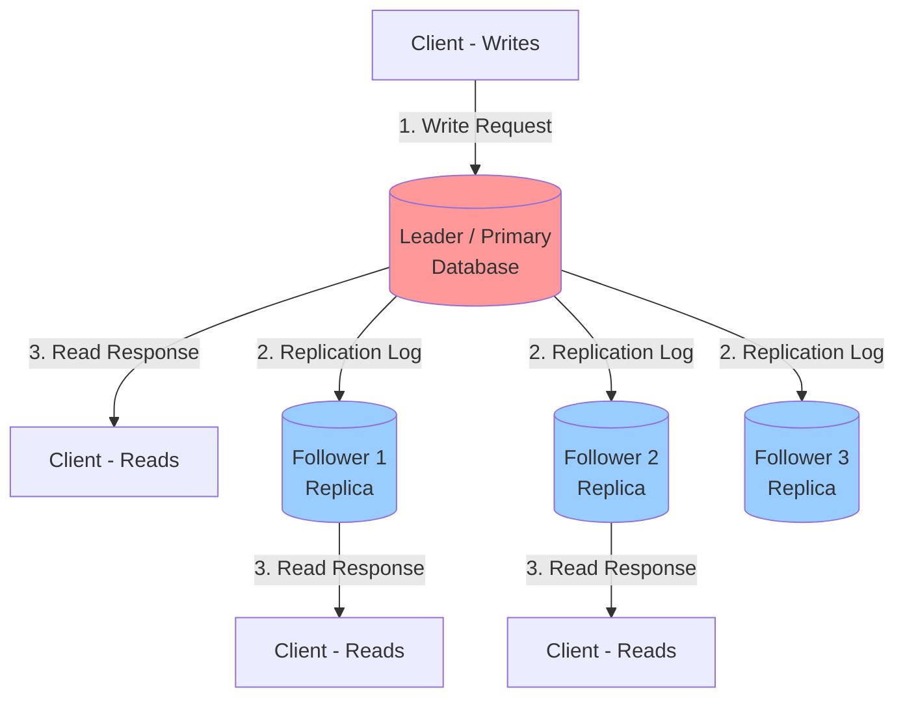
```mermaid
graph TB
    Client1[Client - Writes]
    Client2[Client - Reads]
    Client3[Client - Reads]
    Client4[Client - Reads]

    Leader[(Leader / Primary<br/>Database)]
    Follower1[(Follower 1<br/>Replica)]
    Follower2[(Follower 2<br/>Replica)]
    Follower3[(Follower 3<br/>Replica)]

    Client1 -->|1. Write Request| Leader
    Leader -->|2. Replication Log| Follower1
    Leader -->|2. Replication Log| Follower2
    Leader -->|2. Replication Log| Follower3

    Leader -->|3. Read Response| Client2
    Follower1 -->|3. Read Response| Client3
    Follower2 -->|3. Read Response| Client4

    style Leader fill:#ff9999
    style Follower1 fill:#99ccff
    style Follower2 fill:#99ccff
    style Follower3 fill:#99ccff
```

If the database is sharded (see Chapter 7), each shard has its own leader. Different shards may have leaders on different nodes, but each shard must still have exactly one leader. In section 3 of this chapter we will discuss an alternative model in which a system may have multiple leaders for the same shard.

Single-leader replication is very widely used. It is a built-in feature of many relational databases (PostgreSQL, MySQL, Oracle Data Guard, SQL Server's Always On availability groups) and is also used in document databases (MongoDB, DynamoDB), message brokers (Kafka), replicated block devices (DRBD), and some network filesystems. Many consensus algorithms — such as **Raft**, used for replication in CockroachDB, TiDB, etcd, and RabbitMQ quorum queues — are also based on a single leader and automatically elect a new leader if the old one fails (we will discuss consensus in detail in Chapter 10).

> In older documents you may see the term *master–slave replication*. It means the same as leader-based replication, but the term is widely considered offensive and should be avoided [8].

### 1.1 Synchronous Versus Asynchronous Replication

An important detail of a replicated system is whether the replication happens **synchronously** or **asynchronously**. In relational databases this is often a configurable option; other systems are often hardcoded to one or the other.

Imagine a user of a website updates their profile image. At some point the client sends the update request to the leader, the leader writes it locally, forwards the data change to the followers, and notifies the client that the update was successful.

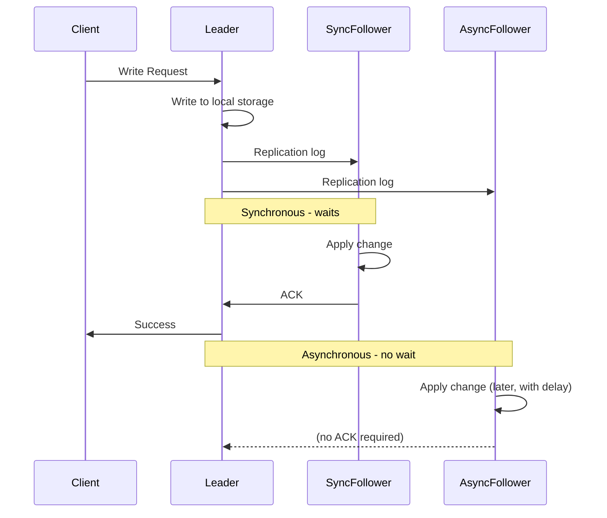
```mermaid
sequenceDiagram
    participant Client
    participant Leader
    participant SyncFollower
    participant AsyncFollower

    Client->>Leader: Write Request
    Leader->>Leader: Write to local storage
    Leader->>SyncFollower: Replication log
    Leader->>AsyncFollower: Replication log

    Note over Leader,SyncFollower: Synchronous - waits
    SyncFollower->>SyncFollower: Apply change
    SyncFollower->>Leader: ACK

    Leader->>Client: Success

    Note over Leader,AsyncFollower: Asynchronous - no wait
    AsyncFollower->>AsyncFollower: Apply change (later, with delay)
    AsyncFollower-->>Leader: (no ACK required)
```

In this example the replication to follower 1 is **synchronous**: the leader waits until follower 1 has confirmed that it received the write before reporting success to the user and before making the write visible to other clients. The replication to follower 2 is **asynchronous** (or *nonblocking*): the leader sends the message but doesn't wait for a response.

Normally replication is quite fast — most database systems apply changes to followers in less than a second. However, there is no guarantee how long it might take. In some circumstances followers may fall behind the leader by several minutes or more — for example, if a follower is recovering from a failure, if the system is operating near maximum capacity, or if there are network problems between the nodes.

#### Advantages and Disadvantages

The advantage of synchronous replication is that the follower is guaranteed to have an up-to-date copy of the data consistent with the leader's. If the leader suddenly fails, we can be sure that the data is still available on the follower. The disadvantage is that if the synchronous follower doesn't respond (because it has crashed, or because there is a network fault, or for any other reason), the write cannot be processed — the leader must block all writes and wait until the synchronous replica is available again.

For that reason it is impracticable for all followers to be synchronous; any one node outage would cause the whole system to grind to a halt. In practice, if a database offers synchronous replication, it often means that **one of the followers is synchronous and the others are asynchronous**. If the synchronous follower becomes unavailable or slow, one of the asynchronous followers is made synchronous. This guarantees that you have an up-to-date copy of the data on at least two nodes: the leader and one synchronous follower. This configuration is sometimes called **semisynchronous**.

In some systems, a **majority of replicas** (e.g., three out of five, including the leader) are updated synchronously, and the remaining minority are asynchronous. This is an example of a **quorum**, which we will discuss further in section 5.

Sometimes leader-based replication is configured to be **completely asynchronous**. In this case, if the leader fails and is not recoverable, any writes that have not yet been replicated to followers are lost. This means that a write is not guaranteed to be durable, even if it has been confirmed to the client. However, a fully asynchronous configuration has the advantage that the leader can continue processing writes even if all its followers have fallen behind.

Weakening durability may sound like a bad trade-off, but asynchronous replication is nevertheless widely used, especially if there are many followers or if they are geographically distributed [9]. We will return to this issue in section 2.

### 1.2 Setting Up New Followers

From time to time you need to set up new followers — perhaps to increase the number of replicas or to replace failed nodes. How do you ensure that the new follower has an accurate copy of the leader's data?

Simply copying data files from one node to another is typically not sufficient. Clients are constantly writing to the database, and the data is always in flux, so a standard file copy would see different parts of the database at different points in time. The result might not make any sense.

You could make the files on disk consistent by locking the database (making it unavailable for writes), but that would go against our goal of high availability. Fortunately, setting up a follower can usually be done without downtime. Conceptually, the process looks like this:

1. Take a **consistent snapshot** of the leader's database at some point in time — if possible, without locking the entire database. Most databases have this feature, as it is also required for backups. In some cases third-party tools are needed, such as Percona XtraBackup for MySQL.
2. Copy the snapshot to the new follower node.
3. The follower connects to the leader and requests all the data changes that have happened since the snapshot was taken. This requires that the snapshot is associated with an exact position in the leader's replication log. That position has various names — PostgreSQL calls it the **log sequence number**; MySQL has two mechanisms, **binlog coordinates** and **global transaction identifiers** (GTIDs).
4. When the follower has processed the backlog of data changes since the snapshot, we say it has **caught up**. It can now continue to process data changes from the leader as they happen.

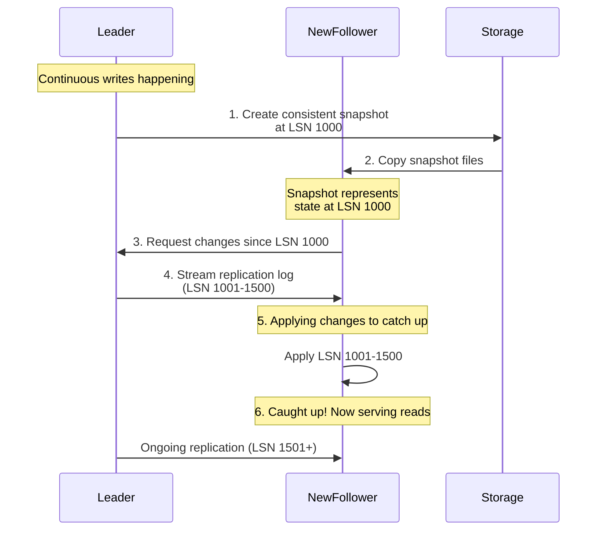
```mermaid
sequenceDiagram
    participant Leader
    participant NewFollower
    participant Storage

    Note over Leader: Continuous writes happening
    Leader->>Storage: 1. Create consistent snapshot<br/>at LSN 1000
    Storage->>NewFollower: 2. Copy snapshot files
    Note over NewFollower: Snapshot represents<br/>state at LSN 1000
    NewFollower->>Leader: 3. Request changes since LSN 1000
    Leader->>NewFollower: 4. Stream replication log<br/>(LSN 1001-1500)
    Note over NewFollower: 5. Applying changes to catch up
    NewFollower->>NewFollower: Apply LSN 1001-1500
    Note over NewFollower: 6. Caught up! Now serving reads
    Leader->>NewFollower: Ongoing replication (LSN 1501+)
```

The practical steps of setting up a follower vary significantly by database. In some systems the process is fully automated, whereas in others it can be a somewhat arcane multistep workflow that needs to be manually performed by an administrator.

You can also archive the replication log to an object store along with periodic snapshots of the whole database. This is a good way of implementing database backups and disaster recovery, and you can perform steps 1 and 2 by downloading those files from the object store. For example, **WAL-G** does this for PostgreSQL, MySQL, and SQL Server, and **Litestream** does the equivalent for SQLite.

### 1.3 Databases Backed by Object Storage

Object storage can be used for more than archiving data. Many databases are beginning to use object stores such as Amazon S3, Google Cloud Storage, and Azure Blob Storage to serve data for live queries. Storing database data in object storage has many benefits:

- **Cheap storage tier**: object storage is inexpensive compared to other cloud storage options. This allows cloud databases to store data that's queried less often on cheaper, higher-latency storage while serving the working set from memory, SSDs, and NVMe.
- **Multi-region replication built in**: object stores provide multi-zone, dual-region, or multi-region replication with very high durability guarantees. This also allows databases to bypass inter-zone network fees.
- **Conditional writes for transactions and leader election**: databases can use an object store's conditional write feature — essentially a compare-and-set (CAS) operation — to implement transactions and leadership election [10, 11].
- **Simplified data integration**: storing data from multiple databases in the same object store can simplify data integration, particularly when open formats such as Parquet and Iceberg are used.

These benefits dramatically simplify the database architecture by shifting the responsibility of transactions, leadership election, and replication to object storage.

Systems that adopt object storage for replication must grapple with trade-offs, though. Notably, object stores have much higher read and write latencies than local disks or virtual block devices such as Amazon EBS. Many cloud providers also charge a per-API-call fee, which forces systems to batch reads and writes to reduce cost. Such batching further increases latency. Objects are often immutable as well, which makes random writes in a large object an extremely resource-intensive operation. Finally, many object stores do not offer standard filesystem interfaces, which prevents systems that lack object storage integration from leveraging object storage. Interfaces such as **filesystem in userspace (FUSE)** allow operators to mount object store buckets as filesystems that applications can use without knowing their data is stored on object storage. Still, many FUSE interfaces to object stores lack POSIX features such as nonsequential writes or symlinks, which systems might depend on.

Different systems deal with these trade-offs in various ways. Some introduce a **tiered storage architecture** that places less frequently accessed data on object storage, while new or frequently accessed data is kept on faster storage devices such as SSDs or NVMe, or even in memory. Other systems use object storage as their primary storage tier but use a separate low-latency storage system (such as Amazon EBS or Neon's Safekeepers [12]) to store their write-ahead log. Recently, some systems have gone even further by adopting a **zero-disk architecture (ZDA)**. ZDA-based systems persist all data to object storage and use disks and memory strictly for caching. This allows nodes to have no persistent state, which dramatically simplifies operations.

> **Example: Zero-disk Kafka-compatible systems** — WarpStream, Confluent Freight, Buf's Bufstream, and Redpanda Serverless are all Kafka-compatible systems built using a zero-disk architecture. Nearly every modern cloud data warehouse also adopts such an architecture, as does Turbopuffer (a vector search engine) and SlateDB (a cloud-native LSM storage engine).

### 1.4 Handling Node Outages

Any node in the system can go down, perhaps unexpectedly because of a fault, but also because of planned maintenance (e.g., rebooting a machine to install a kernel security patch). Being able to reboot individual nodes without downtime is a big advantage for operations and maintenance. Thus, our goal is to keep the system as a whole running despite individual node failures, and to keep the impact of a node outage as small as possible.

#### Follower Failure: Catch-up Recovery

On its local disk, each follower keeps a log of the data changes it has received from the leader. If a follower crashes and is restarted, or if the network between the leader and the follower is temporarily interrupted, the follower can recover quite easily: from its log, it knows the last transaction that was processed before the fault occurred. Thus, the follower can connect to the leader and request all the data changes that occurred during the time when the follower was disconnected. When it has applied these changes, it has caught up to the leader and can continue receiving a stream of data changes as before.

Although follower recovery is conceptually simple, it can be challenging in terms of performance. If the database has a high write throughput or if the follower has been offline for a long time, there might be a lot of writes to catch up on. There will be high load on both the recovering follower and the leader (which needs to send the backlog of writes to the follower) while this catch-up is ongoing.

The leader can delete its log of writes after all followers have confirmed that they have processed it, but if a follower is unavailable for a long time, the leader faces a choice: retain the log until the follower recovers and catches up (at the risk of running out of disk space on the leader), or delete the log that the unavailable follower has not yet acknowledged (in which case the follower won't be able to recover from the log and will have to be restored from a backup when it comes back up).

#### Leader Failure: Failover

Handling a failure of the leader is trickier. One of the followers needs to be promoted to be the new leader, clients need to be reconfigured to send their writes to the new leader, and the other followers need to start consuming data changes from the new leader. This process is called **failover**.

Failover can happen manually (an administrator is notified that the leader has failed and takes the necessary steps to make a new leader) or automatically. An automatic failover process usually consists of the following steps:

1. **Determining that the leader has failed.** Many things could potentially go wrong: crashes, power outages, network issues, and more. There is no foolproof way of detecting what has occurred, so most systems simply use a timeout; nodes frequently bounce messages back and forth between each other, and if a node doesn't respond for some period of time — say, 30 seconds — it is assumed to be dead. (If the leader is deliberately taken down for planned maintenance, this doesn't apply since the leader can trigger a safe handoff before shutting down.)
2. **Choosing a new leader.** This could be done through an election process (where the leader is chosen by a majority of the remaining replicas), or a new leader could be appointed by a previously established controller node [13]. The best candidate for leadership is usually the replica with the most up-to-date data changes from the old leader (to minimize any data loss). Getting all the nodes to agree on a new leader is a consensus problem, discussed in detail in Chapter 10.
3. **Reconfiguring the system to use the new leader.** Clients now need to send their write requests to the new leader. If the old leader comes back, it might still believe that it is the leader, not realizing that the other replicas have forced it to step down. The system needs to ensure that the old leader becomes a follower and recognizes the new leader.

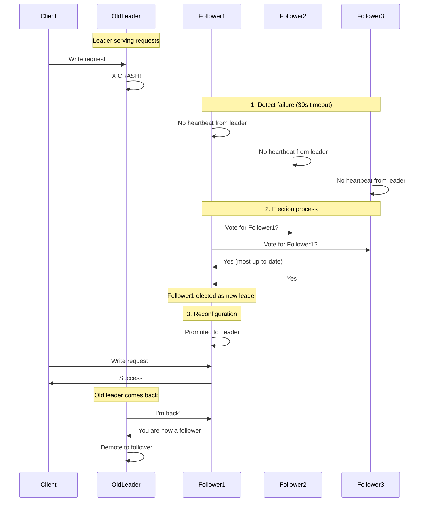
```mermaid
sequenceDiagram
    participant Client
    participant OldLeader
    participant Follower1
    participant Follower2
    participant Follower3

    Note over OldLeader: Leader serving requests
    Client->>OldLeader: Write request
    OldLeader->>OldLeader: X CRASH!

    Note over Follower1,Follower3: 1. Detect failure (30s timeout)
    Follower1->>Follower1: No heartbeat from leader
    Follower2->>Follower2: No heartbeat from leader
    Follower3->>Follower3: No heartbeat from leader

    Note over Follower1,Follower3: 2. Election process
    Follower1->>Follower2: Vote for Follower1?
    Follower1->>Follower3: Vote for Follower1?
    Follower2->>Follower1: Yes (most up-to-date)
    Follower3->>Follower1: Yes

    Note over Follower1: Follower1 elected as new leader

    Note over Follower1: 3. Reconfiguration
    Follower1->>Follower1: Promoted to Leader

    Client->>Follower1: Write request
    Follower1->>Client: Success

    Note over OldLeader: Old leader comes back
    OldLeader->>Follower1: I'm back!
    Follower1->>OldLeader: You are now a follower
    OldLeader->>OldLeader: Demote to follower
```

#### Things That Can Go Wrong With Failover

Failover is fraught with things that can go wrong:

- **If asynchronous replication is used**, the new leader may not have received all the writes from the old leader before it failed. If the former leader rejoins the cluster after a new leader has been chosen, what should happen to those writes? The new leader may have received conflicting writes in the meantime. The most common solution is for the old leader's unreplicated writes to simply be discarded, which means that writes you believed to be committed weren't durable after all.
- **Discarding writes is especially dangerous** if other storage systems outside of the database need to be coordinated with the database contents. **Example: the 2012 GitHub incident [14]** — an out-of-date MySQL follower was promoted to leader. The database used an autoincrementing counter to assign primary keys to new rows, but because the new leader's counter lagged behind the old leader's, it reused some primary keys that had previously been assigned by the old leader. These primary keys were also used in a Redis store, so the reuse of primary keys resulted in inconsistency between MySQL and Redis, which caused some private data to be disclosed to the wrong users.
- **In certain fault scenarios (see Chapter 9)**, two nodes could both believe that they are the leader. This situation, called **split brain**, is dangerous; if both leaders accept writes, and there is no process for resolving conflicts, data is likely to be lost or corrupted. As a safety catch, some systems have a mechanism to shut down one node if two leaders are detected. However, if this mechanism is not carefully designed, you can end up with both nodes being shut down [15]. Moreover, there is a risk that by the time the split brain is detected and the old node is shut down, it is already too late and data has already been corrupted.
- **Deciding on the right timeout** before the leader is declared dead can be tricky. A longer timeout means a longer time to recovery in the case where the leader fails. However, if the timeout is too short, unnecessary failovers could occur. For example, a temporary load spike could cause a node's response time to increase above the timeout, or a network glitch could cause delayed packets. If the system is already struggling with high load or network problems, an unnecessary failover is likely to make the situation worse, not better.

Guarding against split brain by limiting or shutting down old leaders is known as **fencing**; we discuss it in more detail in Chapter 9 (Distributed Locks and Leases). However, these problems have no easy solutions. For this reason, some operations teams prefer to perform failovers manually, even if the software supports automatic failover.

The most important thing with failover is to pick an up-to-date follower as the new leader. If synchronous or semisynchronous replication is used, this would be the follower that the old leader waited for before acknowledging writes. With asynchronous replication, you can pick the follower with the highest log sequence number. This minimizes the amount of data that is lost during failover; losing a fraction of a second's worth of writes may be tolerable, but picking a follower that is behind by several days could be catastrophic.

These issues — node failures, unreliable networks, and trade-offs around replica consistency, durability, availability, and latency — are in fact fundamental problems in distributed systems. In Chapters 9 and 10 we will discuss them in greater depth.

### 1.5 Implementation of Replication Logs

How does leader-based replication work under the hood? Several replication methods are used in practice.

#### Statement-Based Replication

In the simplest case, the leader logs every write request (statement) that it executes and sends that statement log to its followers. For a relational database, this means that every INSERT, UPDATE, or DELETE statement is forwarded to followers, and each follower parses and executes that SQL statement as if it had been received from a client.

Although this approach to replication may sound reasonable, it can break down in various ways:

- Any statement that calls a nondeterministic function, such as NOW to get the current date and time or RAND to get a random number, is likely to generate a different value on each replica.
- If statements use an autoincrementing column, or if they depend on the existing data in the database (e.g., UPDATE ... WHERE some-condition), they must be executed in exactly the same order on each replica, or else they may have a different effect. This can be limiting when there are multiple concurrently executing transactions.
- Statements that have side effects (e.g., triggers, stored procedures, user-defined functions) may result in different side effects occurring on each replica, unless the side effects are absolutely deterministic.

It is possible to work around those issues — for example, the leader can replace any nondeterministic function calls with a fixed return value when the statement is logged so that the followers all get the same value. The idea of executing deterministic statements in a fixed order is similar to the **event sourcing** model discussed in Chapter 4 and to **state machine replication**, which we will revisit in Chapter 10.

Statement-based replication was used in MySQL before version 5.1. It is still sometimes used today, as it is quite compact, but by default MySQL now switches to row-based replication (discussed shortly) if there is any nondeterminism in a statement. VoltDB uses statement-based replication and makes it safe by requiring transactions to be deterministic [16]. However, determinism can be hard to guarantee in practice, so many databases prefer other replication methods.

#### Write-Ahead Log (WAL) Shipping

In Chapter 4 we saw that a write-ahead log is needed to make B-tree storage engines robust; every modification is first written to the WAL so that the tree can be restored to a consistent state after a crash. Since the WAL contains all the information necessary to restore the indexes and heap to a consistent state, we can use the exact same log to build a replica on another node: besides writing the log to disk, the leader also sends it across the network to its followers. When the follower processes this log, it builds a copy of the exact same files as found on the leader.

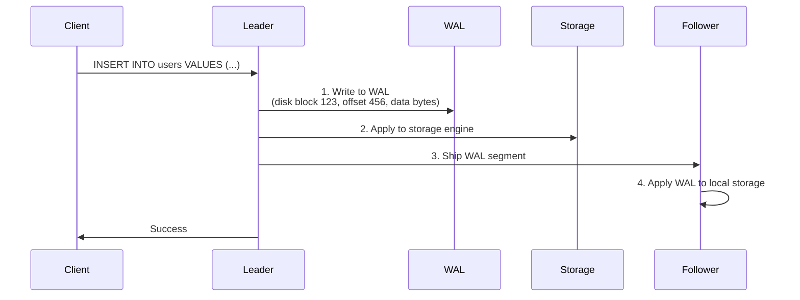
```mermaid
sequenceDiagram
    participant Client
    participant Leader
    participant WAL
    participant Storage
    participant Follower

    Client->>Leader: INSERT INTO users VALUES (...)
    Leader->>WAL: 1. Write to WAL<br/>(disk block 123, offset 456, data bytes)
    Leader->>Storage: 2. Apply to storage engine
    Leader->>Follower: 3. Ship WAL segment
    Follower->>Follower: 4. Apply WAL to local storage
    Leader->>Client: Success
```

This method of replication is used in **PostgreSQL** and **Oracle**, among others [17, 18]. The main disadvantage is that the log describes the data at a very low level — a WAL contains details of which bytes were changed in which disk blocks. This makes replication tightly coupled to the storage engine. If the database changes its storage format from one version to another, it is typically not possible to run different versions of the database software on the leader and the followers.

That may seem like a minor implementation detail, but it can have a big operational impact. If the replication protocol allows the follower to use a newer software version than the leader, you can perform a **zero-downtime upgrade** of the database software by first upgrading the followers and then performing a failover to make one of the upgraded nodes the new leader. If the replication protocol does not allow this version mismatch, as is often the case with WAL shipping, such upgrades require downtime.

#### Logical (Row-Based) Log Replication

An alternative is to use different log formats for replication and for the storage engine, which allows the replication log to be decoupled from the storage engine internals. This kind of replication log is called a **logical log**, to distinguish it from the storage engine's (physical) data representation.

A logical log for a relational database is usually a sequence of records describing writes to database tables at the granularity of a row:

- For an inserted row, the log contains the new values of all columns.
- For a deleted row, the log contains enough information to uniquely identify the row that was deleted. Typically this would be the primary key, but if there is no primary key on the table, the old values of all columns need to be logged.
- For an updated row, the log contains enough information to uniquely identify the updated row, and the new values of all columns (or at least all columns whose values have changed).

A transaction that modifies several rows generates several such log records, followed by a record indicating that the transaction was committed. When configured to use row-based replication, MySQL keeps a separate logical replication log, called the **binlog**, in addition to the WAL. PostgreSQL implements logical replication by decoding the physical WAL into row insertion/update/delete events [19].

Since a logical log is decoupled from the storage engine internals, it can more easily be kept backward compatible, allowing the leader and the follower to run different versions of the database software. This in turn enables upgrading to a new version with minimal downtime [20].

A logical log format is also easier for external applications to parse. This aspect is useful if you want to send the contents of a database to an external system, such as a data warehouse for offline analysis, or a specialized system for building custom indexes and caches [21]. This technique is called **change data capture (CDC)**, and we will return to it in Chapter 12.

#### Trigger-Based Replication

The previous approaches are implemented by the database system. Sometimes you need more flexibility — for example, only replicating a subset of data, or replicating to a different kind of database. For these cases, you can use **trigger-based replication**.

The application registers triggers that log changes to a separate table when data is inserted, updated, or deleted. An external process reads this changelog and replicates it.

```sql
-- Set up a trigger to log changes
CREATE TABLE replication_log (
    id BIGSERIAL PRIMARY KEY,
    table_name TEXT,
    operation TEXT,
    row_data JSONB,
    changed_at TIMESTAMPTZ DEFAULT now()
);

CREATE FUNCTION log_user_changes() RETURNS trigger AS $$
BEGIN
    INSERT INTO replication_log (table_name, operation, row_data)
    VALUES (TG_TABLE_NAME, TG_OP, to_jsonb(NEW));
    RETURN NEW;
END;
$$ LANGUAGE plpgsql;

CREATE TRIGGER users_replication_trigger
AFTER INSERT OR UPDATE OR DELETE ON users
FOR EACH ROW EXECUTE FUNCTION log_user_changes();
```

**Advantages**: very flexible (replicate subset of data, transform data, replicate to different databases); application-level control (can add custom logic, validation, filtering, transformation).

**Disadvantages**: greater overhead (triggers run for every write, slowing down writes); more error-prone (application code is more likely to have bugs than database built-in replication); complexity (need to maintain trigger code and replication process).

**Used by**: Oracle GoldenGate, Databus for Oracle, Bucardo for Postgres.

---

## 2. Problems with Replication Lag

Being able to tolerate node failures is just one reason for wanting replication. As mentioned in Chapter 1, other reasons include **scalability** (processing more requests than a single machine can handle) and **latency** (placing replicas geographically closer to users).

Leader-based replication requires all writes to go through a single node, but read-only queries can go to any replica. For workloads that consist of mostly reads with only a small percentage of writes (which is often the case with online services), there is an attractive option: create many followers, and distribute the read requests across those followers. This removes load from the leader and allows read requests to be served by nearby replicas.

In this **read-scaling architecture**, you can increase the capacity for serving read-only requests simply by adding more followers. However, this approach realistically works only with asynchronous replication. If you tried to synchronously replicate to all followers, a single node failure or network outage would make the entire system unavailable for writing. And the more nodes you have, the likelier it is that one will be down, so a fully synchronous configuration would be very unreliable.

Unfortunately, an application reading from an asynchronous follower may see outdated information if the follower has fallen behind. This leads to apparent inconsistencies in the database; if you run the same query on the leader and a follower at the same time, you may get different results, because not all writes have been reflected in the follower.

This inconsistency is a temporary state — if you stop writing to the database and wait a while, the followers will eventually catch up and become consistent with the leader. For that reason, this effect is known as **eventual consistency** [22].

> The term *eventual consistency* was coined by Douglas Terry et al. [23] and popularized by Werner Vogels [24], and it became the battle cry of many NoSQL projects. However, it's not only NoSQL databases that are eventually consistent; followers in an asynchronously replicated relational database have the same characteristics.

The term "eventually" is deliberately vague; in general, there is no limit to how far a replica can fall behind. In normal operation, the delay between a write happening on the leader and it being reflected on a follower — the **replication lag** — may be only a fraction of a second and not noticeable in practice. However, if the system is operating near capacity or if a problem occurs in the network, the lag can easily increase to several seconds or even minutes.

When the lag is so large, the inconsistencies it introduces are not just a theoretical issue but a real problem for applications. In this section we will highlight three examples of problems that are likely to occur with replication lag. We'll also outline some approaches to solving them.

### 2.1 Reading Your Own Writes

Many applications let the user submit some data and then view what they have submitted. This might be a record in a customer database, or a comment on a discussion thread, or something else of that sort. When new data is submitted, it must be sent to the leader, but when the user views the data, it can be read from a follower. This is especially appropriate if data is frequently viewed but only occasionally written.

With asynchronous replication, a problem arises: if the user views the data shortly after making a write, the new data may not yet have reached the replica. To the user, it looks as though the data they submitted was lost, so they will be understandably unhappy.

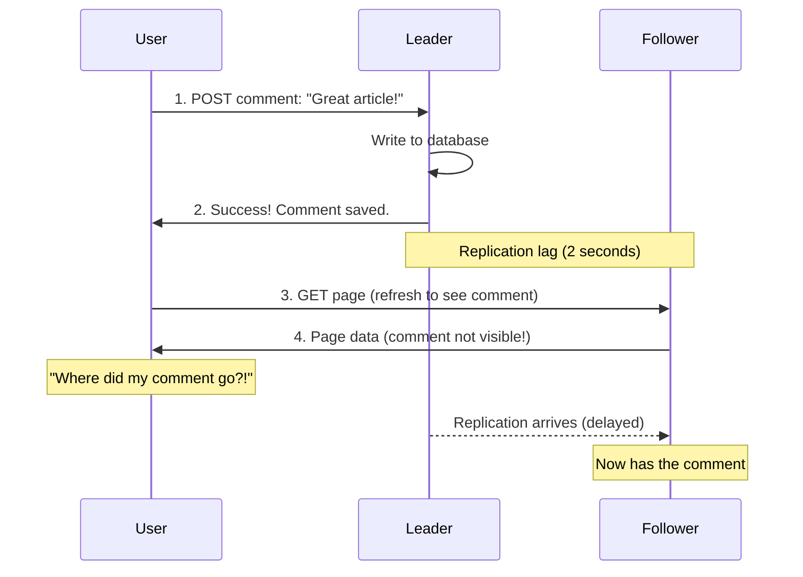
```mermaid
sequenceDiagram
    participant User
    participant Leader
    participant Follower

    User->>Leader: 1. POST comment: "Great article!"
    Leader->>Leader: Write to database
    Leader->>User: 2. Success! Comment saved.
    Note over Leader,Follower: Replication lag (2 seconds)

    User->>Follower: 3. GET page (refresh to see comment)
    Follower->>User: 4. Page data (comment not visible!)
    Note over User: "Where did my comment go?!"

    Leader-->>Follower: Replication arrives (delayed)
    Note over Follower: Now has the comment
```

In this situation, we need **read-after-write consistency**, also known as **read-your-writes consistency** [23]. This is a guarantee that if the user reloads the page, they will always see any updates they submitted themselves. It makes no promises about other users; other users' updates may not be visible until some later time. However, it reassures the user that their own input has been saved correctly.

#### Implementation Techniques

How can we implement read-after-write consistency in a system with leader-based replication? There are various possible techniques:

- **When reading something that the user may have modified, read it from the leader or a synchronously updated follower**; otherwise, read it from an asynchronously updated follower. This requires that you have some way of knowing whether something might have been modified, without querying it. For example, user profile information on a social network is normally editable only by the owner of the profile, not by anybody else. Thus, a simple rule is: always read the user's own profile from the leader, and any other users' profiles from a follower.
- **If most things in the application are potentially editable by the user**, that approach won't be effective, as most things would have to be read from the leader (negating the benefit of read scaling). In that case, other criteria may be used to decide whether to read from the leader. For example, you could track the time of the last update and, for one minute after the last update, make all reads from the leader [25]. You could also monitor the replication lag on followers and prevent queries on any follower that is more than one minute behind the leader.
- **The client can remember the timestamp of its most recent write**, and the system can ensure that the replica serving any reads for that user reflects updates at least until that timestamp. If a replica is not sufficiently up-to-date, either the read can be handled by another replica or the query can wait until the replica has caught up [26]. The timestamp could be a logical timestamp (something that indicates ordering of writes, such as the log sequence number) or the actual system clock (in which case clock synchronization becomes critical; see Chapter 9).

#### Cross-Device and Cross-Region Complexity

Another complication arises when the same user is accessing your service from multiple devices, such as a desktop web browser and a mobile app. In this case you may want to provide **cross-device read-after-write consistency**: if the user enters some information on one device and then views it on another device, they should see the information they just entered.

There are some additional issues to consider:

- Approaches that require remembering the timestamp of the user's last update become more difficult, because the code running on one device doesn't know what updates have happened on the other device. This metadata will need to be centralized.
- If your replicas are distributed across multiple regions, there is no guarantee that connections from different devices will be routed to the same region. (For example, if the user's desktop computer uses the home broadband connection and their mobile device uses the cellular data network, the devices' network routes may be completely different.) If your approach requires reading from the leader, you may first need to route requests from all of a user's devices to the same region.

#### Regions and Availability Zones

A note on terminology: we use the term **region** to refer to one or more datacenters in a single geographic location. Cloud providers locate multiple datacenters in the same geographic region. Each datacenter is referred to as an **availability zone** or simply **zone**. Thus, a single cloud region is made up of multiple zones. Each zone is a separate datacenter located in a separate physical facility with its own power, cooling, and so on.

Zones in the same region are connected by very high-speed network connections. Latency is low enough that most distributed systems can run with nodes spread across multiple zones in the same region as though they were in a single zone. Multi-zone configurations allow distributed systems to survive zonal outages where one zone goes offline, but they do not protect against regional outages where all zones in a region are unavailable. To survive a regional outage, a distributed system must be deployed across multiple regions, which can result in higher latencies, lower throughput, and increased cloud networking bills. We will discuss these trade-offs more in section 3.

### 2.2 Monotonic Reads

Our second example of an anomaly that can occur when reading from asynchronous followers is that it's possible for a user to see things moving **backward in time**. This can happen if a user makes several reads from different replicas.

Imagine user 2345 making the same query twice, first to a follower with little lag, then to a follower with greater lag. (This scenario is quite likely if the user refreshes a web page and each request is routed to a random server.) The first query returns a comment that was recently added by user 1234, but the second query doesn't return anything because the lagging follower has not yet picked up that write. In effect, the second query observes the system state at an earlier point in time than the first query. This wouldn't be so bad if the first query hadn't returned anything, because user 2345 probably wouldn't know that user 1234 had recently added a comment. However, it's very confusing for user 2345 if they first see user 1234's comment appear, then see it disappear again.

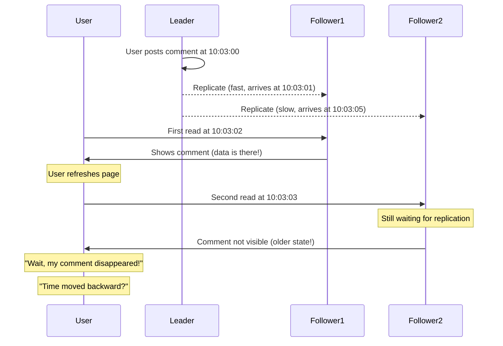
```mermaid
sequenceDiagram
    participant User
    participant Leader
    participant Follower1
    participant Follower2

    Leader->>Leader: User posts comment at 10:03:00
    Leader-->>Follower1: Replicate (fast, arrives at 10:03:01)
    Leader-->>Follower2: Replicate (slow, arrives at 10:03:05)

    User->>Follower1: First read at 10:03:02
    Follower1->>User: Shows comment (data is there!)

    Note over User: User refreshes page

    User->>Follower2: Second read at 10:03:03
    Note over Follower2: Still waiting for replication
    Follower2->>User: Comment not visible (older state!)

    Note over User: "Wait, my comment disappeared!"
    Note over User: "Time moved backward?"
```

**Monotonic reads** [22] provide a guarantee that this kind of anomaly does not happen. It's a lesser guarantee than strong consistency, but a stronger guarantee than eventual consistency. When you read data, you may see an old value; monotonic reads mean only that if one user makes several reads in sequence, they will not see time go backward (i.e., they will not read older data after having previously read newer data).

One way of achieving monotonic reads is to make sure that each user always makes their reads from the same replica (different users can read from different replicas). For example, the replica can be chosen based on a hash of the user ID rather than randomly. However, if that replica fails, the user's queries will need to be rerouted to another replica.

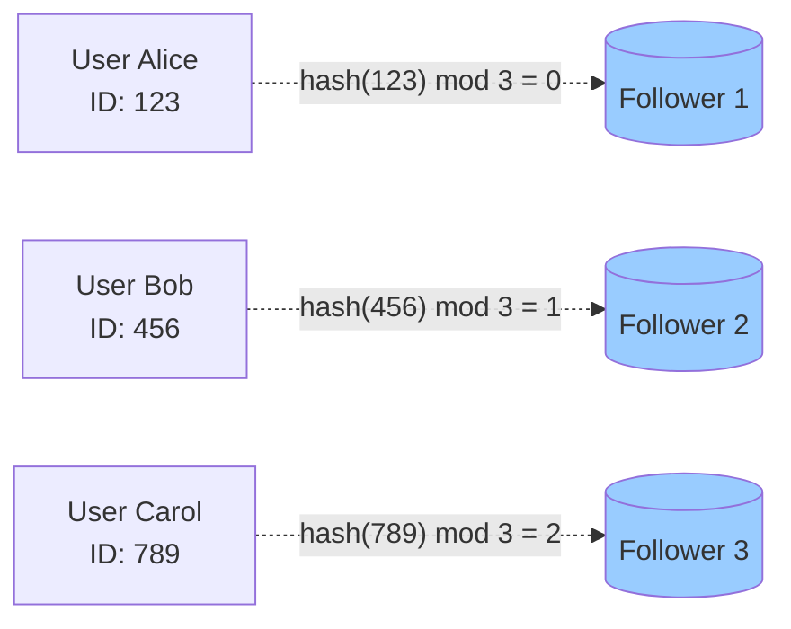
```mermaid
graph LR
    User1["User Alice<br/>ID: 123"]
    User2["User Bob<br/>ID: 456"]
    User3["User Carol<br/>ID: 789"]

    F1[(Follower 1)]
    F2[(Follower 2)]
    F3[(Follower 3)]

    User1 -.->|"hash(123) mod 3 = 0"| F1
    User2 -.->|"hash(456) mod 3 = 1"| F2
    User3 -.->|"hash(789) mod 3 = 2"| F3

    style F1 fill:#99ccff
    style F2 fill:#99ccff
    style F3 fill:#99ccff
```

### 2.3 Consistent Prefix Reads

Our third example of replication lag anomalies concerns **violation of causality**. Imagine the following short dialog between Mr. Poons and Mrs. Cake:

```
Mr. Poons: How far into the future can you see, Mrs. Cake?
Mrs. Cake: About 10 seconds usually, Mr. Poons.
```

There is a causal dependency between those two sentences: Mrs. Cake heard Mr. Poons's question and answered it.

Now, imagine a third person is listening to this conversation through followers. The things said by Mrs. Cake go through a follower with little lag, but the things said by Mr. Poons have a longer replication lag. This observer would hear the following:

```
Mrs. Cake: About 10 seconds usually, Mr. Poons.
Mr. Poons: How far into the future can you see, Mrs. Cake?
```

To the observer, it sounds as though Mrs. Cake is answering the question before Mr. Poons has even asked it. Such psychic powers are impressive but very confusing [27].

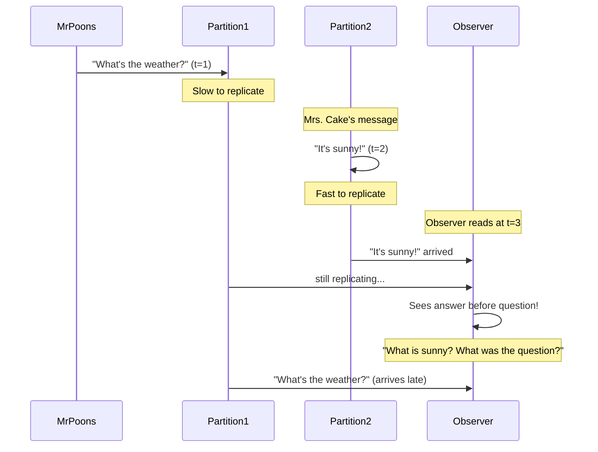
```mermaid
sequenceDiagram
    participant MrPoons
    participant Partition1
    participant Partition2
    participant Observer

    MrPoons->>Partition1: "What's the weather?" (t=1)
    Note over Partition1: Slow to replicate

    Note over Partition2: Mrs. Cake's message
    Partition2->>Partition2: "It's sunny!" (t=2)
    Note over Partition2: Fast to replicate

    Note over Observer: Observer reads at t=3

    Partition2->>Observer: "It's sunny!" arrived
    Partition1->>Observer: still replicating...

    Observer->>Observer: Sees answer before question!

    Note over Observer: "What is sunny? What was the question?"

    Partition1->>Observer: "What's the weather?" (arrives late)
```

Preventing this kind of anomaly requires another type of guarantee: **consistent prefix reads** [22]. This guarantee says that if a sequence of writes happens in a certain order, anyone reading those writes will see them appear in the same order.

This is a particular problem in **sharded (partitioned) databases**, which we will discuss in Chapter 7. If the database always applies writes in the same order, reads always see a consistent prefix, so this anomaly cannot happen. However, in many distributed databases, different shards operate independently, so there is no global ordering of writes. When a user reads from the database, they may see some parts of the database in an older state and some in a newer state.

One solution is to make sure that any writes that are causally related to each other are written to the same shard — but in some applications that cannot be done efficiently. Some algorithms explicitly keep track of causal dependencies, a topic that we will return to in section 6.

### 2.4 Solutions for Replication Lag

When working with an eventually consistent system, it is worth thinking about how the application behaves if the replication lag increases to several minutes or even hours. If the answer is "no problem," that's great. However, if the result is a bad experience for users, it's important to design the system to provide a stronger guarantee, such as read-after-write. Pretending that replication is synchronous when in fact it is asynchronous is a recipe for problems down the line.

As discussed earlier, there are ways for an application to provide a stronger guarantee than the underlying database — for example, by performing certain kinds of reads on the leader or a synchronously updated follower. However, dealing with these issues in application code is complex and easy to get wrong.

The simplest programming model for application developers is to choose a database that provides a strong consistency guarantee for replicas, such as **linearizability** (see Chapter 10), and supports ACID transactions (see Chapter 8). This allows you to mostly ignore the challenges that arise from replication and treat the database as if it had just a single node. In the early 2010s, the NoSQL movement promoted the view that these features limited scalability and that large-scale systems would have to embrace eventual consistency.

However, since then, a number of databases have started providing strong consistency and transaction support while also offering the fault tolerance, high availability, and scalability advantages of a distributed database. As mentioned in Chapter 2, this trend is known as **NewSQL** to contrast with NoSQL (although it's less about SQL specifically and more about new approaches to scalable transaction management).

Even though scalable, strongly consistent distributed databases are now available, there are still good reasons some applications choose to use different forms of replication that offer weaker consistency guarantees. Notably, they can offer stronger resilience in the face of network interruptions and have lower overheads compared to transactional systems. We will explore such approaches in the rest of this chapter.

### Summary of Consistency Guarantees

| Guarantee | What it prevents | Strength |
|---|---|---|
| Eventual Consistency | Nothing in the short term — data eventually becomes consistent | Weakest |
| Monotonic Reads | Time moving backward for a user | Weak |
| Consistent Prefix Reads | Causality violations (seeing effect before cause) | Medium |
| Read-After-Write | User not seeing their own writes | Medium |
| Strong Consistency | All anomalies — all clients see same data at same time | Strongest (but impacts performance) |

---

## 3. Multi-Leader Replication

So far in this chapter we have considered only replication architectures using a single leader. Although that is a common approach, there are interesting alternatives.

Single-leader replication has one major downside: **all writes must go through the one leader**. If you can't connect to the leader for any reason — for example, because of a network interruption between you and the leader — you can't write to the database.

A natural extension of the single-leader replication model is to allow more than one node to accept writes. Replication still happens in the same way: each node that processes a write must forward that data change to all the other nodes. We call this a **multi-leader configuration** (also known as **active/active** or **bidirectional replication**). In this setup, each leader simultaneously acts as a follower to the other leaders.

As with single-leader replication, there is a choice between making it synchronous or asynchronous. Let's say you have two leaders, A and B, and you're trying to write to A. If writes are synchronously replicated from A to B, and the network between the two nodes is interrupted, you can't write to A until the connection is restored. Synchronous multi-leader replication thus gives you a model that is very similar to single-leader replication where, for example, you make B the leader and A simply forwards any write requests to B to be executed.

For that reason, we won't go further into synchronous multi-leader replication and will simply treat it as equivalent to single-leader replication. The rest of this section focuses on asynchronous multi-leader replication, in which any leader can process writes, even when its connection to the other leaders is interrupted.

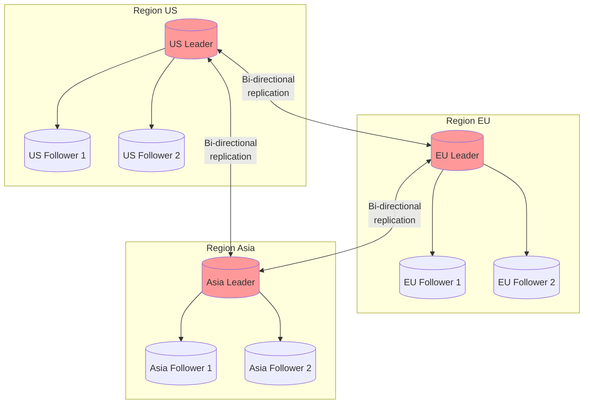
```mermaid
graph TB
    subgraph "Region US"
        USLeader[(US Leader)]
        USFollower1[(US Follower 1)]
        USFollower2[(US Follower 2)]
    end

    subgraph "Region EU"
        EULeader[(EU Leader)]
        EUFollower1[(EU Follower 1)]
        EUFollower2[(EU Follower 2)]
    end

    subgraph "Region Asia"
        AsiaLeader[(Asia Leader)]
        AsiaFollower1[(Asia Follower 1)]
        AsiaFollower2[(Asia Follower 2)]
    end

    USLeader <-->|Bi-directional<br/>replication| EULeader
    EULeader <-->|Bi-directional<br/>replication| AsiaLeader
    AsiaLeader <-->|Bi-directional<br/>replication| USLeader

    USLeader --> USFollower1
    USLeader --> USFollower2
    EULeader --> EUFollower1
    EULeader --> EUFollower2
    AsiaLeader --> AsiaFollower1
    AsiaLeader --> AsiaFollower2

    style USLeader fill:#ff9999
    style EULeader fill:#ff9999
    style AsiaLeader fill:#ff9999
```

### 3.1 Geographically Distributed Operation

It rarely makes sense to use a multi-leader setup within a single region, because the benefits rarely outweigh the added complexity. However, in some situations this configuration is reasonable.

Imagine you have a database with replicas in several regions (perhaps so that you can tolerate the failure of an entire region, or perhaps for proximity with your users). This is known as a **geographically distributed**, **geo-distributed**, or **geo-replicated** setup. With single-leader replication, the leader has to be in one of the regions, and all writes must go through that region.

In a multi-leader configuration, you can have a leader in each region. Within each region, regular leader–follower replication is used (with followers maybe in a different availability zone from the leader); between regions, each region's leader replicates its changes to the leaders in other regions.

#### Performance

In a single-leader configuration, every write must go over the internet to the region with the leader. This can add significant latency to writes and might defeat the purpose of having multiple regions in the first place. In a multi-leader configuration, every write can be processed in the local region and then replicated asynchronously to the other regions. Thus, the inter-region network delay is hidden from users, which means the perceived performance may be better.

#### Tolerance of Regional Outages

In a single-leader configuration, if the region with the leader becomes unavailable, failover can promote a follower in another region to be leader. In a multi-leader configuration, each region can continue operating independently of the others, and replication catches up when the offline region comes back online.

#### Tolerance of Network Problems

Even with dedicated connections, traffic between regions can be less reliable than traffic between zones in the same region or within a single zone. A single-leader configuration is very sensitive to problems in this inter-region link, because when a client in one region wants to write to a leader in another region, it has to send its request over that link and wait for the response before it can complete.

A multi-leader configuration with asynchronous replication can tolerate network problems better; during a temporary network interruption, each region's leader can continue independently processing writes.

#### Consistency

A single-leader system can provide strong consistency guarantees, such as **serializable transactions**, which we will discuss in Chapter 8. The biggest downside of multi-leader systems is that the consistency they can achieve is much weaker. For example, you can't guarantee that a bank account won't go negative or that a username is unique; it's always possible for different leaders to process writes that are individually fine (paying out some of the money in an account, registering a particular username) but that violate the constraint when taken together with another write on another leader.

This is simply a fundamental limitation of distributed systems [28]. If you need to enforce such constraints, you're therefore better off with a single-leader system. However, as we will see in section 3.4, multi-leader systems can still achieve consistency properties that are useful in a wide range of apps that don't need such constraints.

Multi-leader replication is less common than single-leader replication, but it's still supported by many databases, including **MySQL, Oracle, SQL Server, and YugabyteDB**. In some cases it is an external add-on feature — for example, in **Redis Enterprise**, **EDB Postgres Distributed**, and **pglogical** [29].

As multi-leader replication is a retrofitted feature in many databases, there are often subtle configuration pitfalls and surprising interactions with other database features. For example, **autoincrementing keys**, **triggers**, and **integrity constraints** can be problematic. For this reason, multi-leader replication is often considered dangerous territory that should be avoided if possible [30].

#### Comparison Table

| Aspect | Single-Leader | Multi-Leader |
|---|---|---|
| Write latency | High for remote users (must go to leader datacenter) | Low (writes processed locally) |
| Read latency | Low (can read from local follower) | Low (can read from local follower) |
| Datacenter failure tolerance | Failover needed (downtime) | Each datacenter continues independently |
| Network partition tolerance | Inter-datacenter link failure stops writes | Each datacenter continues operating |
| Conflict handling | No conflicts (single source of truth) | Must handle write conflicts |

### 3.2 Multi-Leader Replication Topologies

A **replication topology** describes the communication paths along which writes are propagated from one node to another. If you have two leaders only one topology is plausible: leader 1 must send all its writes to leader 2, and vice versa. With more than two leaders, various topologies are possible.

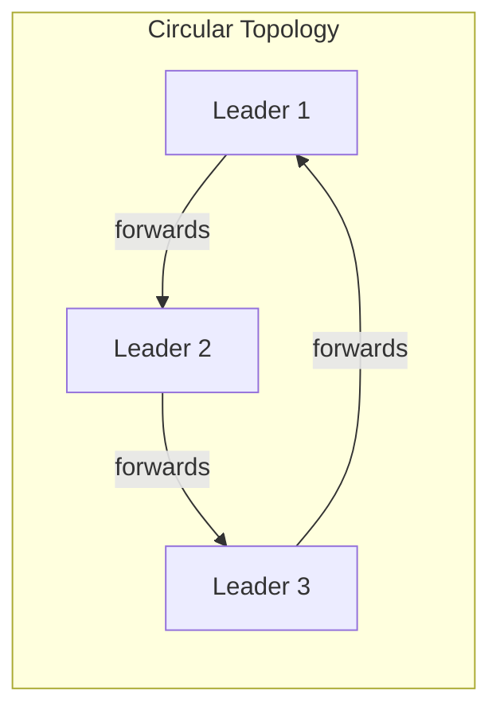
```mermaid
graph LR
    subgraph "Circular Topology"
        C1[Leader 1] -->|forwards| C2[Leader 2]
        C2 -->|forwards| C3[Leader 3]
        C3 -->|forwards| C1
    end
```

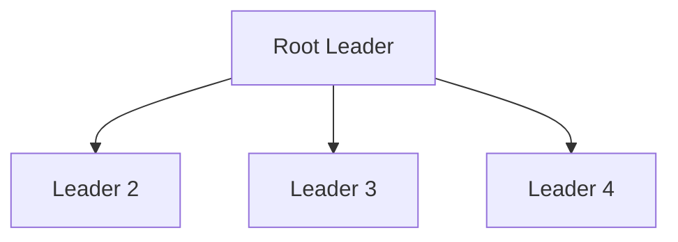
```mermaid
graph TB
    Star[Root Leader]
    S1[Leader 2]
    S2[Leader 3]
    S3[Leader 4]
    Star --> S1
    Star --> S2
    Star --> S3
```

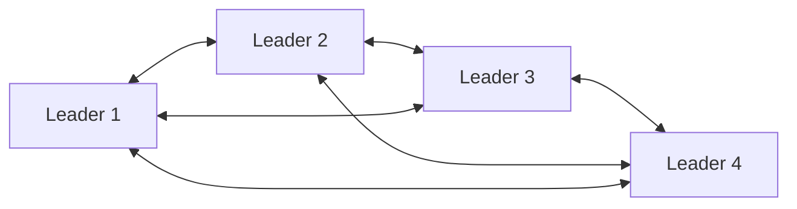
```mermaid
graph LR
    A2A1[Leader 1]
    A2A2[Leader 2]
    A2A3[Leader 3]
    A2A4[Leader 4]
    A2A1 <--> A2A2
    A2A2 <--> A2A3
    A2A3 <--> A2A4
    A2A4 <--> A2A1
    A2A1 <--> A2A3
    A2A2 <--> A2A4
```

The most general topology is **all-to-all**, in which every leader sends its writes to every other leader. However, more restricted topologies are also used. For example, in the **circular topology**, each node receives writes from one node and forwards those writes (plus any writes of its own) to one other node. The **star topology** is also popular; here, one designated root node forwards writes to all the other nodes. The star topology can be generalized to a tree.

> A star-shaped network topology is unrelated to a star schema (which describes the structure of a data model).

In circular and star topologies, a write may need to pass through several nodes before it reaches all replicas. Therefore, nodes need to forward data changes they receive from other nodes. To prevent infinite replication loops, each node is given a unique identifier, and in the replication log each write is tagged with the identifiers of all the nodes it has passed through [31]. When a node receives a data change that is tagged with its own identifier, that data change is ignored, because the node knows that it has already been processed.

#### Problems with Different Topologies

A problem with circular and star topologies is that if just one node fails, it can interrupt the flow of replication messages between other nodes, leaving them unable to communicate until the node is fixed. The topology could be reconfigured to work around the failed node, but in most deployments such reconfiguration would have to be done manually. The fault tolerance of a more densely connected topology (such as all-to-all) is better because it allows messages to travel along different paths, avoiding a single point of failure.

However, all-to-all topologies can have issues too. In particular, some network links may be faster than others (e.g., because of network congestion), with the result that some replication messages may "overtake" others. Client A inserts a row into a table on leader 1, and client B updates that row on leader 3. However, leader 2 may receive the writes in a different order. It may first receive the update (which, from its point of view, is an update to a row that does not exist in the database) and only later receive the corresponding insert (which should have preceded the update).

This is a problem of causality, similar to the one we saw in "Consistent Prefix Reads." The update depends on the prior insert, so we need to make sure that all nodes process the insert first, and then the update. Simply attaching a timestamp to every write is not sufficient, because clocks cannot be trusted to be sufficiently in sync to correctly order these events at leader 2 (see Chapter 9).

To order these events correctly, a technique called **version vectors** can be used, which we will discuss in section 6. However, many multi-leader replication systems don't use good techniques for ordering updates, leaving them vulnerable to issues like this one. If you are using multi-leader replication, it is worth being aware of these issues, carefully reading the documentation, and thoroughly testing your database to ensure that it really does provide the guarantees you believe it to have.

### 3.3 Sync Engines and Local-First Software

Multi-leader replication is also appropriate if you have an application that needs to continue to work while it is disconnected from the internet. For example, consider the calendar apps on your mobile phone, your laptop, and other devices. You need to be able to see your meetings (make read requests) and enter new meetings (make write requests) at any time, regardless of whether your device currently has an internet connection. If you make any changes while you are offline, they need to be synced with a server and your other devices when the device is next online.

In this case, every device has a local database replica that acts as a leader (it accepts write requests), and there is an asynchronous multi-leader replication process (sync) between the replicas of your calendar on all your devices. The replication lag may be hours or even days, depending on when you have internet access available.

From an architectural point of view, this setup is very similar to multi-leader replication between regions, taken to the extreme. Each device is a "region," and the network connection between them is extremely unreliable.

#### Real-Time Collaboration, Offline-First, and Local-First Apps

Many modern web apps offer real-time collaboration features, such as **Google Docs and Sheets** for text documents and spreadsheets, **Figma** for graphics, and **Linear** for project management. What makes these apps so responsive is that user input is immediately reflected in the user interface, without waiting for a network round-trip to the server, and edits by one user are shown to their collaborators with low latency [32, 33, 34].

This again results in a multi-leader architecture: each web browser tab that has opened the shared file is a replica, and any updates that you make to the file are asynchronously replicated to the devices of the other users who have opened the same file. Even if the app does not allow you to continue editing a file while offline, the fact that multiple users can make edits without waiting for a response from the server already makes it multi-leader.

Both offline editing and real-time collaboration require a similar replication infrastructure. The application needs to capture any changes that the user makes to a file and either send them to collaborators immediately (if online) or store them locally for sending later (if offline). Additionally, the application needs to receive changes from collaborators, merge them into the user's local copy of the file, and update the UI to reflect the latest version. If multiple users have changed the file concurrently, conflict resolution logic may be needed to merge those changes.

A software library that supports this process is called a **sync engine**. Although the idea has existed for a long time, the term has recently gained attention [35, 36, 37]. An application that allows a user to continue editing a file while offline (which may be implemented using a sync engine) is called **offline-first** [38]. The term **local-first software** refers to collaborative apps that are not only offline-first but are also designed to continue working even if the developer who made the software shuts down all of their online services [39]. This can be achieved by using a sync engine with an open standard sync protocol for which multiple service providers are available [40]. For example, **Git is a local-first collaboration system** (albeit one that doesn't support real-time collaboration), since you can sync via GitHub, GitLab, or any other repository hosting service.

#### Pros and Cons of Sync Engines

The dominant way of building web apps today is to keep very little persistent state on the client and to rely on making requests to a server whenever a new piece of data needs to be displayed or some data needs to be updated. In contrast, when using a sync engine, you have persistent state on the client, and communication with the server is moved into a background process. The sync engine approach has a number of advantages:

- **Snappier UI**: having the data locally means the UI can respond much faster than if it had to wait for a service call to fetch some data. Some apps aim to respond to user input in the next frame of the graphics system, which means rendering within 16 ms on a display with a 60 Hz refresh rate.
- **Offline by default**: allowing users to continue working while offline is valuable, especially on mobile devices with intermittent connectivity. With a sync engine, an app doesn't need a separate offline mode: being offline is the same as having a very large network delay.
- **Simpler programming model**: a sync engine simplifies the programming model for frontend apps, compared to performing explicit service calls in application code. Every service call requires error handling; for example, if a request to update data on a server fails, the user interface needs to somehow reflect that error. A sync engine allows the app to perform reads and writes on local data; these operations almost never fail, leading to a more declarative programming style [41].
- **Real-time updates built in**: to display edits from other users in real time, you need to receive notifications of those edits and efficiently update the UI accordingly. A sync engine combined with a reactive programming model is a good way of implementing this [42].

Sync engines work best when all the data that the user may need is downloaded in advance and stored persistently on the client. This means that the data is available for offline access when needed, but it also means that sync engines are not suitable if the user has access to a very large amount of data. For example, downloading all the files that the user created is probably fine (one user generally doesn't generate that much data), but downloading the entire catalog of an ecommerce website probably doesn't make sense.

The sync engine was pioneered by **Lotus Notes in the 1980s** [43] (without using that term), and sync for specific apps, such as calendars, has also existed for a long time. Today, we have numerous general-purpose sync engines. Some use a proprietary backend service (e.g., **Google Firestore, Realm, or Ditto**), and others have an open source backend, making them suitable for creating local-first software (e.g., **PouchDB/CouchDB, Automerge, and Yjs**).

> Multiplayer video games have a similar need to respond immediately to the user's local actions and reconcile them with other players' actions received asynchronously over the network. In game development jargon, the equivalent of a sync engine is called **netcode**. The techniques used in netcode are quite specific to the requirements of games [44] and don't directly carry over to other types of software, so we won't consider them further in this book.

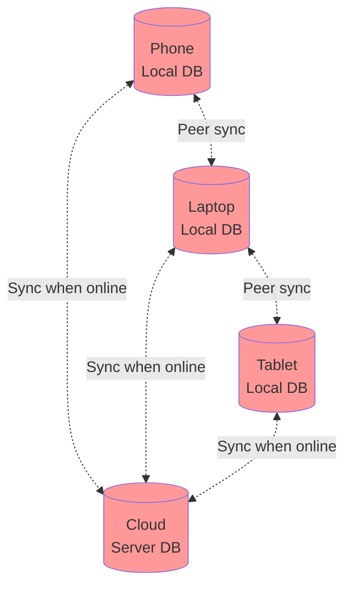
```mermaid
graph TB
    Phone[(Phone<br/>Local DB)]
    Laptop[(Laptop<br/>Local DB)]
    Tablet[(Tablet<br/>Local DB)]
    Cloud[(Cloud<br/>Server DB)]

    Phone <-.->|Sync when online| Cloud
    Laptop <-.->|Sync when online| Cloud
    Tablet <-.->|Sync when online| Cloud

    Phone <-.->|Peer sync| Laptop
    Laptop <-.->|Peer sync| Tablet

    style Phone fill:#ff9999
    style Laptop fill:#ff9999
    style Tablet fill:#ff9999
    style Cloud fill:#ff9999
```

### 3.4 Dealing with Conflicting Writes

The biggest problem with multi-leader replication — both in a geo-distributed server-side database and a local-first sync engine on end-user devices — is that concurrent writes on different leaders can lead to conflicts that need to be resolved.

For example, consider a wiki page that is simultaneously being edited by two users. User 1 changes the title of the page from A to B, and user 2 independently changes the title from A to C. Each user's change is successfully applied to their local leader. However, when the changes are asynchronously replicated, a conflict is detected. This problem does not occur in a single-leader database.

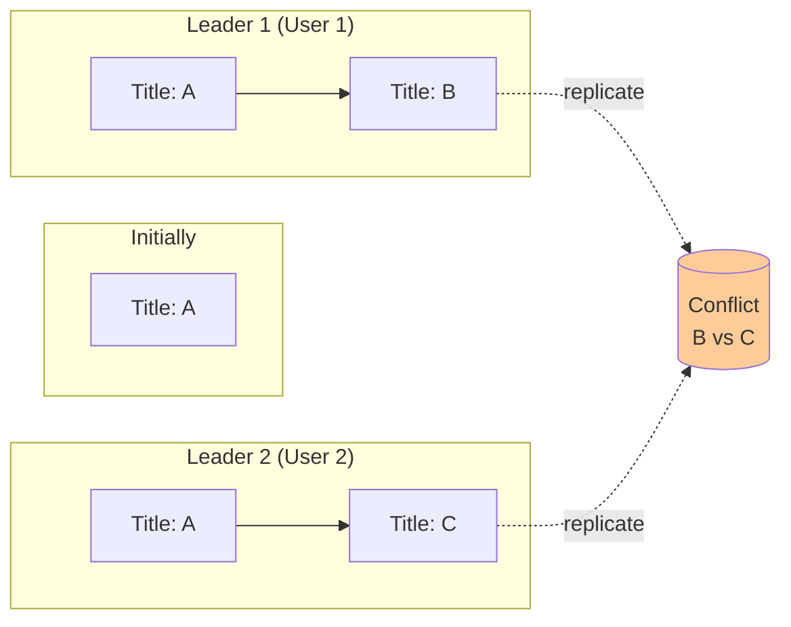
```mermaid
graph LR
    subgraph "Initially"
        Before["Title: A"]
    end

    subgraph "Leader 1 (User 1)"
        L1Before["Title: A"]
        L1After["Title: B"]
        L1Before --> L1After
    end

    subgraph "Leader 2 (User 2)"
        L2Before["Title: A"]
        L2After["Title: C"]
        L2Before --> L2After
    end

    L1After -.->|"replicate"| Conflict[(Conflict<br/>B vs C)]
    L2After -.->|"replicate"| Conflict

    style Conflict fill:#ffcc99
```

We say that the two writes are **concurrent** because neither was "aware" of the other at the time the write was originally made. It doesn't matter whether the writes literally happened at the same time; indeed, if the writes were made while offline, they might have happened some time apart. What matters is whether one write occurred in a state where the other write had already taken effect.

In section 6 we will tackle the question of how a database can determine whether two writes are concurrent. For now we will assume that we can detect conflicts and want to figure out the best way of resolving them.

#### Conflict Avoidance

One strategy for dealing with conflicts is to prevent them from occurring in the first place. For example, if the application can ensure that all writes for a particular record go through the same leader, then conflicts cannot occur, even if the database as a whole is multi-leader. This approach is not possible for a sync engine client being updated offline, but it is sometimes possible in geo-replicated server systems [30].

For example, in an application where a user can edit only their own data, you can ensure that requests from a particular user are always routed to the same region and use the leader in that region for reading and writing. Different users may have different "home" regions (perhaps picked based on geographic proximity to the user), but from any one user's point of view, the configuration is essentially single-leader.

However, sometimes you might want to change the designated leader for a record — perhaps because one region is unavailable and you need to reroute traffic to another region, or perhaps because a user has moved to a different location and is now closer to a different region. There is now a risk that the user performs a write while the change of designated leader is in progress, leading to a conflict that will have to be resolved using one of the following methods. Thus, conflict avoidance breaks down if you allow the leader to be changed.

For another example of conflict avoidance, imagine you want to insert new records and generate unique IDs for them based on an autoincrementing counter. If you have two leaders, you could set them up so that one leader generates only odd numbers and the other generates only even numbers. That way, you can be sure that the two leaders won't concurrently assign the same ID to different records. We will discuss other ID assignment schemes in Chapter 9 (ID Generators and Logical Clocks).

#### Last Write Wins (LWW)

If conflicts can't be avoided, the simplest way of resolving them is to attach a timestamp to each write and to always use the value with the most recent (greatest) timestamp. For example, let's say that the timestamp of user 1's write is greater than the timestamp of user 2's write. In that case, both leaders will determine that the new title of the page should be B, and they will discard the write that sets it to C. If the writes coincidentally have the same timestamp, the winner can be chosen by comparing the values (e.g., for strings, taking the one that's earlier in the alphabet).

This approach is called **last write wins (LWW)** because the write with the greatest timestamp can be considered the "last" one. The term is misleading, though, because when two writes are concurrent, which one is most recent is undefined, so the timestamp order of concurrent writes is essentially random. Therefore, the real meaning of LWW is this: when the same record is concurrently written on different leaders, one of those writes is randomly chosen to be the winner and the other writes are silently discarded, even though they were successfully processed by their respective leaders. This achieves the goal that eventually all replicas end up in a consistent state, but at the cost of data loss.

If you can avoid conflicts — for example, by only inserting records with a unique key and never updating them — then LWW is no problem. But if you update existing records, or if different leaders may insert records with the same key, then you have to decide whether lost updates are a problem for your application. If lost updates are not acceptable, you need to use one of the conflict resolution approaches described next.

Another problem with LWW is that if a real-time clock (e.g., a Unix timestamp) is used as a timestamp for the writes, the system becomes very sensitive to clock synchronization. If one node has a clock that is ahead of the others, and you try to overwrite a value written by that node, your write may be ignored as it may have a lower timestamp, even though it clearly occurred later. This problem can be solved by using a **logical clock**, which we will discuss in Chapter 9.

```python
import time
from dataclasses import dataclass


@dataclass
class VersionedValue:
    """A versioned value used for last-write-wins conflict resolution."""
    value: str
    timestamp: float   # could be wall-clock or logical (e.g., Lamport)

    def lww_resolve(self, other: "VersionedValue") -> "VersionedValue":
        """Pick the value with the greatest timestamp; on tie, alphabetic."""
        if self.timestamp > other.timestamp:
            return self
        if other.timestamp > self.timestamp:
            return other
        # Tie: deterministic fallback
        return self if self.value <= other.value else other


# Example: two concurrent writes to the same record.
write_a = VersionedValue(value="Getting Started", timestamp=1_700_000_010)
write_b = VersionedValue(value="Overview",        timestamp=1_700_000_015)

winner = write_a.lww_resolve(write_b)
print(f"Winner: {winner.value!r} at t={winner.timestamp}")
# Winner: 'Overview' at t=1700000015
```

#### Manual Conflict Resolution

If randomly discarding some of your writes is not desirable, the next option is to resolve the conflict manually. You may be familiar with manual conflict resolution from Git and other version control systems: if commits on two branches edit the same lines of the same file, and you try to merge those branches, you will get a merge conflict that needs to be resolved before the merge is completed.

In a database, it would be impractical for a conflict to stop the entire replication process until a human has resolved it. Instead, databases typically store all the concurrently written values for a given record — for example, both B and C in the wiki example. These values are sometimes called **siblings**. The next time you query that record, the database returns all those values rather than just the latest one. You can then resolve those values in whatever way you want, either automatically in application code (e.g., you could concatenate B and C into B/C) or by asking the user. You then write back a new value to the database to resolve the conflict.

This approach to conflict resolution is used in some systems, such as **CouchDB**. However, it also suffers from these problems:

- The API of the database changes — for example, where previously the title of the wiki page was just a string, it now becomes a set of strings that usually contain one element, but may sometimes contain multiple elements if there is a conflict. This can make the data awkward to work with in application code.
- Asking the user to manually merge the siblings is a lot of work, both for the app developer (who needs to build the UI for conflict resolution) and for the user (who may be confused about what they are being asked to do, and why). In many cases, it's better to merge automatically than to bother the user.
- Merging siblings automatically can lead to surprising behavior if it is not done carefully. For example, the shopping cart on Amazon used to allow concurrent updates, which were then merged by keeping all the shopping cart items that appeared in any of the siblings (i.e., taking the set union of the carts). This meant that if the customer had removed an item from their cart in one sibling, but another sibling still contained that old item, the removed item would unexpectedly reappear in the customer's cart [45]. If device 1 removes Book from the shopping cart and concurrently device 2 removes DVD, but after merging the siblings, both items reappear.
- If multiple nodes observe the conflict and concurrently resolve it, the conflict resolution process can itself introduce a new conflict. Those resolutions could even be inconsistent — for example, one node may merge B and C into B/C and another may merge them into C/B if you are not careful to order them consistently. When the conflict between B/C and C/B is merged, it may result in B/C/C/B or something similarly surprising.

#### Automatic Conflict Resolution

For many applications, the best way of handling conflicts is to use an algorithm that automatically merges concurrent writes into a consistent state. Automatic conflict resolution ensures that all replicas converge to the same state — that is, all replicas that have processed the same set of writes have the same state, regardless of the order in which the writes arrived. Combining eventual consistency with a convergence guarantee is known as **strong eventual consistency** [46].

LWW is a simple example of a conflict resolution algorithm. More sophisticated merge algorithms have been developed for different types of data, with the goal of preserving the intended effect of all updates as much as possible and hence avoiding data loss:

- **Text**: if the data is text (e.g., the title or body of a wiki page), we can detect which characters have been inserted or deleted from one version to the next. The merged result then preserves all the insertions and deletions made in any of the siblings. If users concurrently insert text at the same position, it can be ordered deterministically so that all nodes get the same merged outcome.
- **Collections**: if the data is a collection of items (ordered like a to-do list, or unordered like a shopping cart), we can merge it similarly to text by tracking insertions and deletions. To avoid the shopping cart issue mentioned earlier, the algorithms track the fact that Book and DVD were deleted, so the merged result is Cart = {Soap}.
- **Counters**: if the data is an integer representing a counter that can be incremented or decremented (e.g., the number of likes on a social media post), the merge algorithm can tell how many increments and decrements happened on each sibling and add them together correctly so that the result does not double-count and does not drop updates.
- **Key-value maps**: if the data is a key-value mapping, we can merge updates to the same key by applying one of the other conflict resolution algorithms to the values under that key. Updates to different keys can be handled independently from each other.

There are limits to what is possible with conflict resolution. For example, if you want to enforce that a list contains no more than five items, and multiple users concurrently add items to the list so that there are more than five in total, your only option is to drop some of the items. Nevertheless, automatic conflict resolution is sufficient to build many useful apps. And if you start from the requirement of wanting to build a collaborative offline-first or local-first app, then conflict resolution is inevitable, and automating it is often the best approach.

#### Conflict-Free Replicated Datatypes (CRDTs) and Operational Transformation (OT)

Two families of algorithms are commonly used to implement automatic conflict resolution: **conflict-free replicated datatypes (CRDTs)** [46] and **operational transformation (OT)** [47]. They have different design philosophies and performance characteristics, but both are able to perform automatic merges for all the aforementioned types of data.

Let's see an example of how OT and a CRDT merge concurrent updates to a text. Assume you have two replicas that both start off with the text "ice". One replica prepends the letter "n" to make "nice", while concurrently the other replica appends an exclamation mark to make "ice!".

The merged result "nice!" is achieved differently by the two types of algorithms:

**OT**: we record the index at which characters are inserted or deleted: "n" is inserted at index 0 and "!" at index 3. Next, the replicas exchange their operations. The insertion of "n" at index 0 can be applied as is, but if the insertion of "!" at index 3 were applied to the state "nice", we would get "nic!e", which is incorrect. We therefore need to transform the index of each operation to account for concurrent operations that have already been applied. In this case, the insertion of "!" is transformed to index 4 to account for the insertion of "n" at an earlier index.

**CRDT**: most CRDTs give each character a unique, immutable ID and use those to determine the positions of insertions/deletions, instead of indexes. For example, assign the ID "1A" to "i", the ID "2A" to "c", etc. When inserting the exclamation mark, we generate an operation containing the ID of the new character ("4B") and the ID of the existing character after which we want to insert it ("3A"). To insert at the beginning of the string, we give "nil" as the preceding character ID. Concurrent insertions at the same position are ordered by the IDs of the characters. This ensures that replicas converge without performing any transformation.

Many algorithms are based on variations of these ideas. Lists and arrays can be supported similarly, using list elements instead of characters, and other datatypes, such as key-value maps, can be added quite easily. OTs and CRDTs have some performance and functionality trade-offs, but it's possible to combine the advantages of both in one algorithm [48].

OT is most often used for **real-time collaborative editing of text**, such as in **Google Docs** [32], whereas CRDTs can be found in distributed databases such as **Redis Enterprise**, **Riak**, and **Azure Cosmos DB** [49]. Sync engines for JSON data can be implemented both with CRDTs (e.g., **Automerge** or **Yjs**) and with OT (e.g., **ShareDB**).

```python
from typing import Dict, List, Optional, Tuple


class PNCounter:
    """
    A simple Positive-Negative (PN) Counter CRDT.

    Each replica maintains two maps: one for increments and one for decrements.
    The value of the counter is the sum of all increments minus the sum of all
    decrements across every replica. Because merge takes the max per replica,
    the counter converges regardless of the order in which updates arrive.
    """

    def __init__(self, replica_id: str) -> None:
        self.replica_id = replica_id
        # maps: replica_id -> integer count
        self.increments: Dict[str, int] = {}
        self.decrements: Dict[str, int] = {}

    def increment(self, n: int = 1) -> "PNCounter":
        self.increments[self.replica_id] = self.increments.get(self.replica_id, 0) + n
        return self

    def decrement(self, n: int = 1) -> "PNCounter":
        self.decrements[self.replica_id] = self.decrements.get(self.replica_id, 0) + n
        return self

    def value(self) -> int:
        return sum(self.increments.values()) - sum(self.decrements.values())

    def merge(self, other: "PNCounter") -> "PNCounter":
        # Take the max per-replica in each map so updates from both replicas survive.
        for replica, count in other.increments.items():
            self.increments[replica] = max(self.increments.get(replica, 0), count)
        for replica, count in other.decrements.items():
            self.decrements[replica] = max(self.decrements.get(replica, 0), count)
        return self


# Two replicas concurrently increment and decrement the same counter.
node_a = PNCounter("A").increment()
node_b = PNCounter("B").decrement()

# After merging, both replicas converge to the same value.
node_a.merge(node_b)
node_b.merge(node_a)
print(f"Converged value: {node_a.value()}")   # 0
print(f"Converged value: {node_b.value()}")   # 0
```

#### Types of Conflict

Some kinds of conflict are clear. In the wiki example, two writes concurrently modified the same field in the same record, setting it to two different values. There is little doubt that this is a conflict.

Other kinds of conflict can be more subtle to detect. For example, consider a meeting room booking system that tracks which room is booked by which group of people at which time. Rather than updating a specific field when booking a meeting, this system inserts a new record into the database for each booking. The application needs to ensure that each room is booked by only one group of people at any one time (i.e., there must not be any overlapping bookings for the same room). In this case, a conflict may arise if two bookings are created for the same room at the same time. Even if the application checks availability before allowing a user to make a booking, a conflict can arise if the two bookings are made close enough that they both see the room as unbooked prior to inserting their new record.

There isn't a quick ready-made answer, but in the following chapters we will trace a path toward a good understanding of this problem. We will see more examples of conflicts in Chapter 8, and in Chapter 13 we will discuss scalable approaches for detecting and resolving conflicts in a replicated system.

---

## 4. Leaderless Replication

The replication approaches we have discussed so far in this chapter — single-leader and multi-leader replication — are based on the idea that a client sends a write request to one node (the leader), and the database system takes care of copying that write to the other replicas. A leader determines the order in which writes should be processed, and followers apply the leader's writes in the same order.

Some data storage systems take a different approach, abandoning the concept of a leader and allowing any replica to directly accept writes from clients. Some of the earliest replicated data systems were leaderless [1, 50], but the idea was mostly forgotten during the era of dominance of relational databases. It once again became a fashionable architecture for databases after Amazon used it for its in-house **Dynamo** system in 2007 [45]. **Riak, Cassandra, and ScyllaDB** are open source datastores with leaderless replication models inspired by Dynamo, so this kind of database is also known as **Dynamo-style**.

> The original Dynamo system architecture was described in a paper [45] but never released outside of Amazon. The similarly named DynamoDB, a more recent cloud database from Amazon, has a completely different architecture: it uses single-leader replication based on the Multi-Paxos consensus algorithm [5, 51].

In some leaderless implementations, the client directly sends its writes to several replicas, while in others, a coordinator node does this on behalf of the client. However, unlike a leader database, that coordinator does not enforce a particular ordering of writes. As we shall see, this difference in design has profound consequences for the way the database is used.

### 4.1 Writing to the Database When a Node Is Down

Imagine you have a database with three replicas, and one of the replicas is currently unavailable — perhaps it is being rebooted to install a system update. In a single-leader configuration, if you want to continue processing writes, you may need to perform a failover.

On the other hand, in a leaderless configuration, there is no such thing as failover, since all replicas are equal and there are no leaders.

```mermaid
graph TB
    Client[Client 1234]

    subgraph "Coordinator sends write to all replicas"
        R1[(Replica 1)]
        R2[(Replica 2)]
        R3[(Replica 3<br/>DOWN)]
    end

    Client -->|"write X = 'A'"| R1
    Client -->|"write X = 'A'"| R2
    Client -->|"write X = 'A'"| R3

    R1 -->|ACK| Client
    R2 -->|ACK| Client
    Note over R3: Unavailable - misses write

    style R1 fill:#90EE90
    style R2 fill:#90EE90
    style R3 fill:#ffcccc
```

The client (user 1234) sends the write to all three replicas in parallel, and the two available replicas accept the write, but the unavailable replica misses it. Let's say that it's sufficient for two out of three replicas to acknowledge the write. After user 1234 has received two OK responses, we consider the write to be successful. The client simply ignores the fact that one of the replicas missed the write.

Now imagine that the unavailable node comes back online, and clients start reading from it. Any writes that happened while the node was down are missing from it. Thus, if you read from that node, you may get stale (outdated) values as responses.

To solve that problem, when a client reads from the database, it doesn't just send its request to one replica: **read requests are also sent to several nodes in parallel**. The client may get different responses from different nodes; for example, the up-to-date value from one node and a stale value from another.

For the client to determine which responses are up-to-date and which are outdated, every value that is written needs to be tagged with a **version number or timestamp**, similarly to what we saw in "Last Write Wins." When a client receives multiple values in response to a read, it uses the one with the greatest timestamp (even if that value was returned by only one replica, and several other replicas returned older values).

### 4.2 Catching Up on Missed Writes

The replication system should ensure that eventually all the data is copied to every replica. After an unavailable node comes back online, how does it catch up on the writes that it missed? Several mechanisms are used in Dynamo-style datastores:

#### Read Repair

When a client makes a read from several nodes in parallel, it can detect any stale responses. For example, the client gets a version 6 value from replica 3 and a version 7 value from replicas 1 and 2. The client sees that replica 3 has a stale value and writes the newer value back to that replica. This approach works well for values that are read often.

#### Hinted Handoff

If one replica is unavailable, another replica may store writes on its behalf in the form of **hints**. When the replica that was supposed to receive those writes comes back, the replica storing the hints sends them to the recovered replica and then deletes the hints. This handoff process helps bring replicas up-to-date, even for values that are never read and therefore not handled by read repair.

#### Anti-Entropy

In addition, a background process periodically looks for differences in the data between replicas and then copies any missing data from one replica to another. Unlike the replication log in leader-based replication, this anti-entropy process does not copy writes in any particular order, and there may be a significant delay before data is copied.

### 4.3 Using Quorums for Reading and Writing

In the figure above, we considered the write to be successful even though it was processed on only two out of three replicas. What if only one out of three replicas accepted the write? How far can we push this?

If we know that every successful write is guaranteed to be present on at least two out of three replicas, that means at most one replica can be stale. Thus, if we read from at least two replicas, we can be sure that at least one of the two is up to date. If the third replica is down or slow to respond, reads can nevertheless continue returning an up-to-date value.

More generally, if there are **n** replicas, every write must be confirmed by **w** nodes to be considered successful, and we must query at least **r** nodes for each read. As long as **w + r > n**, we expect to get an up-to-date value when reading, because at least one of the r nodes we're reading from must be up-to-date.

Reads and writes that obey these r and w values are called **quorum reads and writes** [50]. You can think of r and w as the minimum number of votes required for the read or write to be valid.

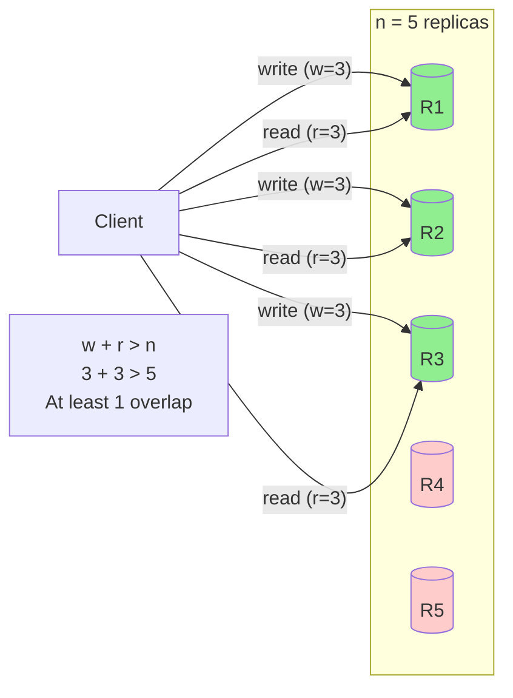
```mermaid
graph LR
    Client[Client]

    subgraph "n = 5 replicas"
        R1[(R1)]
        R2[(R2)]
        R3[(R3)]
        R4[(R4)]
        R5[(R5)]
    end

    Client -->|"write (w=3)"| R1
    Client -->|"write (w=3)"| R2
    Client -->|"write (w=3)"| R3

    Client -->|"read (r=3)"| R1
    Client -->|"read (r=3)"| R2
    Client -->|"read (r=3)"| R3

    Note1["w + r > n<br/>3 + 3 > 5<br/>At least 1 overlap"]

    style R1 fill:#90EE90
    style R2 fill:#90EE90
    style R3 fill:#90EE90
    style R4 fill:#ffcccc
    style R5 fill:#ffcccc
```

In Dynamo-style databases, the parameters n, w, and r are typically configurable. A common choice is to make n an odd number (commonly 3 or 5) and to set w = r = (n + 1) / 2 (rounded up). However, you can vary the numbers as you see fit. For example, a workload with few writes and many reads may benefit from setting w = n and r = 1. This makes reads faster but has the disadvantage that just one failed node causes all database writes to fail.

> There may be more than n nodes in the cluster, but any given value is stored on only n nodes. This allows the dataset to be sharded, supporting datasets that are larger than you can fit on one node. We will return to sharding in Chapter 7.

The quorum condition, w + r > n, allows the system to tolerate unavailable nodes as follows:

- If w < n, we can still process writes if a node is unavailable.
- If r < n, we can still process reads if a node is unavailable.
- With n = 3, w = 2, r = 2, we can tolerate one unavailable node.
- With n = 5, w = 3, r = 3, we can tolerate two unavailable nodes.

Normally, reads and writes are always sent to all n replicas in parallel. The parameters w and r determine how many nodes we wait for — that is, how many of the n nodes need to report success before we consider the read or write to be successful. If fewer than the required w or r nodes are available, writes or reads return an error.

A node could be unavailable for many reasons: the node is down (e.g., crashed, powered down), an error occurred while executing the operation (e.g., can't write because the disk is full), a network interruption occurred between the client and the node, or any number of other reasons. We care only whether the node returned a successful response and don't need to distinguish between different kinds of faults.

```python
from dataclasses import dataclass, field
from typing import List, Optional, Tuple


@dataclass
class ReplicaResponse:
    """Response from a single replica for a given key."""
    replica_id: str
    value: Optional[str]
    version: int
    success: bool


class Replica:
    """A simple in-memory replica; tracks the latest version it has stored."""
    def __init__(self, replica_id: str) -> None:
        self.replica_id = replica_id
        self._data: dict[str, Tuple[str, int]] = {}

    def write(self, key: str, value: str, version: int) -> ReplicaResponse:
        # Reject writes with stale versions (prevents overwrite of newer data).
        existing = self._data.get(key)
        if existing is not None and existing[1] >= version:
            return ReplicaResponse(self.replica_id, existing[0], existing[1], False)
        self._data[key] = (value, version)
        return ReplicaResponse(self.replica_id, value, version, True)

    def read(self, key: str) -> ReplicaResponse:
        existing = self._data.get(key)
        if existing is None:
            return ReplicaResponse(self.replica_id, None, -1, False)
        return ReplicaResponse(self.replica_id, existing[0], existing[1], True)


@dataclass
class QuorumConfig:
    n: int
    w: int
    r: int

    def __post_init__(self) -> None:
        if self.w + self.r <= self.n:
            raise ValueError(
                f"Quorum condition violated: w({self.w}) + r({self.r}) "
                f"must be > n({self.n})"
            )


class QuorumClient:
    """
    Leaderless client that performs writes by sending them to all n replicas
    and considers the write successful once w replicas have acknowledged.
    Reads query r replicas and return the value with the highest version.
    """
    def __init__(self, replicas: List[Replica], config: QuorumConfig) -> None:
        if len(replicas) != config.n:
            raise ValueError("Replica count must equal n")
        self.replicas = replicas
        self.config = config
        self._next_version = 1

    def write(self, key: str, value: str) -> int:
        version = self._next_version
        self._next_version += 1
        acks = 0
        for replica in self.replicas:
            response = replica.write(key, value, version)
            if response.success:
                acks += 1
        if acks < self.config.w:
            raise RuntimeError(
                f"Write failed: only {acks}/{self.config.w} acks"
            )
        return version

    def read(self, key: str) -> Tuple[Optional[str], int]:
        responses = [r.read(key) for r in self.replicas]
        successful = [r for r in responses if r.success]
        if len(successful) < self.config.r:
            raise RuntimeError("Read failed: not enough replicas responded")
        # Pick the response with the highest version (newest value).
        best = max(successful, key=lambda r: r.version)
        return best.value, best.version


# Example: n=3, w=2, r=2  ->  can tolerate 1 unavailable node.
replicas = [Replica(f"R{i}") for i in range(3)]
client = QuorumClient(replicas, QuorumConfig(n=3, w=2, r=2))

client.write("user:42", "Alice")
value, version = client.read("user:42")
print(f"Read value={value!r} version={version}")
# Read value='Alice' version=1
```

### 4.4 Limitations of Quorum Consistency

If you have n replicas, and you choose w and r such that w + r > n, you can generally expect every read to return the most recent value written for a key. This is the case because the set of nodes to which you've written and the set of nodes from which you've read must overlap. That is, among the nodes you read, there must be at least one node with the latest value.

Often, r and w are chosen to be a majority (more than n/2) of nodes, because that ensures w + r > n while still tolerating up to n/2 (rounded down) node failures. But quorums are not necessarily majorities — it matters only that the sets of nodes used by the read and write operations overlap in at least one node. Other quorum assignments are possible, which allows some flexibility in the design of distributed algorithms [52].

You may also set w and r to smaller numbers, so that w + r ≤ n (i.e., the quorum condition is not satisfied). In this case, reads and writes will still be sent to n nodes, but a smaller number of successful responses is required for the operation to succeed. With a smaller w and r, you are more likely to read stale values, because it's more likely that your read won't include the node with the latest value. On the upside, this configuration allows lower latency, which is particularly beneficial with synchronous (blocking) replication. This setup is also more highly available; if there is a network interruption and many replicas become unreachable, there's a higher chance that you can continue processing reads and writes. Only after the number of reachable replicas falls below w or r does the database become unavailable for writing or reading, respectively.

However, even with w + r > n, the consistency properties can be confusing in certain edge cases. Some scenarios include the following:

- If a node carrying a new value fails, and its data is restored from a replica carrying an old value, the number of replicas storing the new value may fall below w, breaking the quorum condition.
- While a rebalancing is in progress, where some data is moved from one node to another (see Chapter 7), nodes may have inconsistent views of which nodes should be holding the n replicas for a particular value. This can result in the read and write quorums no longer overlapping.
- If a read is concurrent with a write operation, the read may or may not see the concurrently written value. In particular, it's possible for one read to see the new value and a subsequent read to see the old value.
- If a write succeeded on some replicas but failed on others (e.g., because the disks on some nodes are full), and overall it succeeded on fewer than w replicas, it is not rolled back on the replicas where it succeeded. This means that if a write was reported as failed, subsequent reads may or may not return the value from that write [53].
- If the database uses timestamps from a real-time clock to determine which write is newer (as Cassandra and ScyllaDB do, for example), writes might be silently dropped if another node with a faster clock has written to the same key — an issue we previously saw in LWW.
- If two writes occur concurrently, one of them might be processed first on one replica, and the other might be processed first on another replica. This leads to a conflict, similar to what we saw for multi-leader replication.

Thus, although quorums appear to guarantee that a read returns the latest written value, in practice it is not so simple. Dynamo-style databases are generally optimized for use cases that can tolerate eventual consistency. The parameters w and r allow you to adjust the probability of stale values being read [54], but it's wise to not take them as absolute guarantees.

#### Monitoring Staleness

From an operational perspective, it's important to monitor whether your databases are returning up-to-date results. Even if your application can tolerate stale reads, you need to be aware of the health of your replication. If it falls behind significantly, it should alert you so that you can investigate the cause (e.g., a problem in the network or an overloaded node).

For leader-based replication, the database typically exposes metrics for replication lag, which you can feed into a monitoring system. This is possible because writes are applied to the leader and to followers in the same order, and each node has a position in the replication log (the number of writes it has applied locally). By subtracting a follower's current position from the leader's current position, you can measure the amount of replication lag.

However, in systems with leaderless replication, there is no fixed order in which writes are applied, which makes monitoring more difficult. The number of hints that a replica stores for handoff can be one measure of system health, but it's difficult to interpret usefully [55]. Eventual consistency is a deliberately vague guarantee, but for operability it's important to be able to quantify "eventual."

### 4.5 Sloppy Quorums and Hinted Handoff

A large-scale network interruption that disconnects a client from a large number of replicas can make it impossible to form a quorum. Some leaderless databases offer a configuration option that allows any reachable replica to accept writes, even if it's not one of the usual replicas for that key. **Riak and Dynamo call this a sloppy quorum** [45]; **Cassandra and ScyllaDB call it consistency level ANY**. There is no guarantee that subsequent reads will see the written value, but depending on the application, it may still be better than having the write fail.

When the network interruption ends and the home replicas come back online, any writes that were temporarily stored on non-home replicas are forwarded to the home replicas via **hinted handoff** — the receiving replica carries the hint metadata, and once the original replica is reachable, the data is migrated.

### 4.6 Single-Leader Versus Leaderless Replication Performance

A replication system based on a single leader can provide strong consistency guarantees that are difficult or impossible to achieve in a leaderless system. However, as we saw in section 2, reads in a leader-based replicated system can also return stale values if you make them on an asynchronously updated follower.

Reading from the leader ensures up-to-date responses, but it suffers from performance problems:

- Read throughput is limited by the leader's capacity to handle requests (in contrast with read scaling, which distributes reads across asynchronously updated replicas that may return stale values).
- If the leader fails, you have to wait for the fault to be detected and for the failover to complete before you can continue handling requests. Even if the failover process is very quick, users will notice it because of the temporarily increased response times; if failover takes a long time, the system is unavailable for its duration.
- The system is very sensitive to performance problems on the leader. If the leader is slow to respond (e.g., because of overload or resource contention), the increased response times immediately affect users as well.

A big advantage of a leaderless architecture is that it is more resilient against such issues. Because there is no failover, and requests go to multiple replicas in parallel anyway, one replica becoming slow or unavailable has very little impact on response times; the client simply uses the responses from the other replicas that are faster to respond. Using the fastest responses is called **request hedging**, and it can significantly reduce tail latency [56].

At its core, the resilience of a leaderless system comes from the fact that it doesn't distinguish between the normal case and the failure case. This is especially helpful when handling **gray failures**, in which a node isn't completely down but is running in a degraded state that is unusually slow to handle requests [57], or when a node is simply overloaded (e.g., if a node has been offline for a while, recovery via hinted handoff can cause a lot of additional load). A leader-based system has to decide whether the situation is bad enough to warrant a failover (which can itself cause further disruption), whereas in a leaderless system that question doesn't even arise.

That said, leaderless systems can have performance problems as well:

- Even though the system doesn't need to perform failover, one replica does need to detect when another replica is unavailable so that it can store hints about writes that the unavailable replica missed. When the unavailable replica comes back, the handoff process needs to send it those hints. This puts additional load on the replicas at a time when the system is already under strain [55].
- The more replicas you have, the bigger the size of your quorums and the more responses you have to wait for before a request can complete. Even if you wait only for the fastest r or w replicas to respond, and even if you make the requests in parallel, a bigger r or w raises the chances of you hitting a slow replica, increasing the overall response time. In practice, quorums are seldom more than four out of seven nodes or five out of nine nodes.
- A large-scale network interruption that disconnects a client from a large number of replicas can make it impossible to form a quorum (as discussed in the sloppy quorum section).

Multi-leader replication can offer even greater resilience against network interruptions than leaderless replication, since reads and writes require communication with only one leader, which can be co-located with the client. However, since a write on one leader is propagated asynchronously to the others, reads can be arbitrarily out-of-date. Quorum reads and writes provide a compromise: good fault tolerance and a high likelihood of reading up-to-date data.

### 4.7 Multi-Region Operation

We previously discussed cross-region replication as a use case for multi-leader replication. Leaderless replication is also suitable for multi-region operation, since it is designed to tolerate conflicting concurrent writes, network interruptions, and latency spikes.

In **Cassandra and ScyllaDB**, a client that wants to perform a multi-region write first chooses a node in its local region, called the **coordinator node**, and sends its write to that node. The coordinator node forwards the write to all replicas in its own region and to one replica in every other region, which then forwards it to the other replicas in that region. This optimization avoids making the cross-region request multiple times.

You can choose from a variety of **consistency levels** that determine how many responses are required for a request to be successful. For example, you can request a quorum across the replicas in all the regions, a separate quorum in each of the regions, or a quorum only in the client's local region. A local quorum avoids having to wait for slow requests to other regions, but it is also more likely to return stale results.

**Riak** keeps all communication between clients and database nodes local to one region, so n describes the number of replicas within one region. Cross-region replication between database clusters happens asynchronously in the background, in a style that is similar to multi-leader replication.

---

## 5. Detecting Concurrent Writes

As with multi-leader replication, leaderless databases allow concurrent writes to the same key, resulting in conflicts that need to be resolved. Such conflicts might be detected as the writes happen, but not always: they could also be detected later, during read repair, hinted handoff, or anti-entropy.

The problem is that events may arrive in a different order at different nodes, because of variable network delays and partial failures. For example, two clients, A and B, simultaneously write to a key X in a three-node datastore:

- Node 1 receives the write from A, but never receives the write from B because of a transient outage.
- Node 2 first receives the write from A, then the write from B.
- Node 3 first receives the write from B, then the write from A.

If each node simply overwrote the value for a key whenever it received a write request from a client, the nodes would become permanently inconsistent: node 2 thinks that the final value of X is B, whereas the other nodes think that the value is A.

To become eventually consistent, the replicas should converge toward the same value. For this, we can use any of the conflict resolution mechanisms we previously discussed in section 3.4, such as LWW (used by Cassandra and ScyllaDB), manual resolution, or CRDTs (used by Riak).

LWW is easy to implement. Each write is tagged with a timestamp, and a value with a higher timestamp always overwrites a value with a lower timestamp. However, a timestamp doesn't tell you whether two values are actually conflicting (i.e., they were written concurrently) or not (they were written one after another). If you want to resolve conflicts explicitly, the system needs to take more care to detect concurrent writes.

### 5.1 The Happens-Before Relation and Concurrency

How do we decide whether two operations are concurrent? To develop an intuition, let's look at some examples:

- In a multi-leader scenario where client A inserts a row and client B updates that row, the two writes are **not** concurrent: A's insert happens before B's update, because the value updated by B is the value inserted by A. In other words, B's operation builds upon A's operation, so B's operation must have happened later. We also say that B is **causally dependent** on A.
- On the other hand, two writes that race on different replicas are concurrent: when each client starts the operation, it does not know that another client is also performing an operation on the same key. Thus, there is no causal dependency between the operations.

An operation A **happens before** another operation B if B knows about A, or depends on A, or builds upon A in some way. Whether one operation happens before another operation is the key to defining what concurrency means. In fact, we can simply say that **two operations are concurrent if neither happens before the other** [58].

Thus, whenever you have two operations A and B, there are three possibilities: either A happened before B, or B happened before A, or A and B are concurrent. What we need is an algorithm to tell us whether two operations are concurrent. If one operation happened before another, the later one should overwrite the earlier operation, but if the operations are concurrent, we have a conflict that needs to be resolved.

#### Concurrency, Time, and Relativity

It may seem that two operations should be called concurrent if they occur "at the same time" — but in fact, it is not important whether they literally overlap in time. Because of problems with clocks in distributed systems, it is actually quite difficult to tell whether two things happened at exactly the same time — an issue we will discuss in more detail in Chapter 9.

For defining concurrency, exact time doesn't matter. We simply call two operations concurrent if they are both unaware of each other, regardless of the physical time at which they occurred. People sometimes make a connection between this principle and the special theory of relativity in physics [58], which introduced the idea that information cannot travel faster than the speed of light. Consequently, two events that occur some distance apart cannot possibly affect each other if the time between the events is shorter than the time it takes light to travel the distance between them.

In computer systems, two operations might be concurrent even though the speed of light would in principle have allowed one operation to affect the other. For example, if the network was slow or interrupted at the time, two operations can occur some time apart and still be concurrent, because the network problems prevented one operation from being able to know about the other.

### 5.2 Capturing the Happens-Before Relationship

Let's look at an algorithm that determines whether two operations are concurrent or whether one happened before another. To keep things simple, let's start with a database that has only one replica. Once we have worked out how to do this on a single replica, we can generalize the approach to a leaderless database with multiple replicas. The algorithm works as follows:

- The server maintains a **version number** for every key, increments the version number every time that key is written, and stores the new version number along with the value written.
- When a client reads a key, the server returns all siblings — all values that have not been overwritten — as well as the latest version number. A client must read a key before writing.
- When a client writes a key, it must include the version number from the prior read, and it must merge together all values that it received in the prior read (e.g., using a CRDT with input from the user). The response from a write request also returns all siblings, which allows us to chain several writes.
- When the server receives a write with a particular version number, it can overwrite all values with that version number or below (since it knows that they have been merged into the new value), but it must keep all values with a higher version number (because those values are concurrent with the incoming write).

Note that the server can determine whether two operations are concurrent by looking at the version numbers. The server does not need to interpret the value itself, so the value could be any data structure.

When a write includes the version number from a prior read, that tells us which previous state the write is based on. If you make a write without including a version number, it is concurrent with all other writes, so it will not overwrite anything — it will just be returned as one of the values on subsequent reads.

Let's see this algorithm in action. Imagine two clients are concurrently adding items to the same shopping cart. Initially, the cart is empty. Between them, the clients make five writes to the database:

1. Client 1 adds milk to the cart. This is the first write to that key, so the server successfully stores it and assigns it version 1. The server also echoes the value back to the client, along with the version number.
2. Client 2 adds eggs to the cart, not knowing that client 1 concurrently added milk (client 2 thought that its eggs were the only item in the cart). The server assigns version 2 to this write and stores eggs and milk as two separate values (siblings). It then returns both values to the client, along with the version number, 2.
3. Client 1, oblivious to client 2's write, wants to add flour to the cart, after which it assumes the cart's contents will be [milk, flour]. It sends this value to the server, along with the version number that the server gave it previously (1). The server can tell from the version number that the write of [milk, flour] supersedes the prior value of [milk] but that it is concurrent with [eggs]. Thus, the server assigns version 3 to [milk, flour], overwrites the version 1 value [milk], but keeps the version 2 value [eggs] and returns both remaining values to the client.
4. Meanwhile, client 2 wants to add ham to the cart, unaware that client 1 just added flour. Client 2 received the two values [milk] and [eggs] from the server in the last response, so the client now merges those values and adds ham to form a new value, [eggs, milk, ham]. It sends that value to the server, along with the previous version number (2). The server detects that version 2 overwrites [eggs] but is concurrent with [milk, flour], so the two remaining values are [milk, flour] with version 3 and [eggs, milk, ham] with version 4.
5. Finally, client 1 wants to add bacon. It previously received [milk, flour] and [eggs] from the server at version 3, so it merges those, adds bacon, and sends the final value [milk, flour, eggs, bacon] to the server, along with the version number 3. This overwrites [milk, flour] (note that [eggs] was already overwritten in the last step) but is concurrent with [eggs, milk, ham], so the server keeps those two concurrent values.

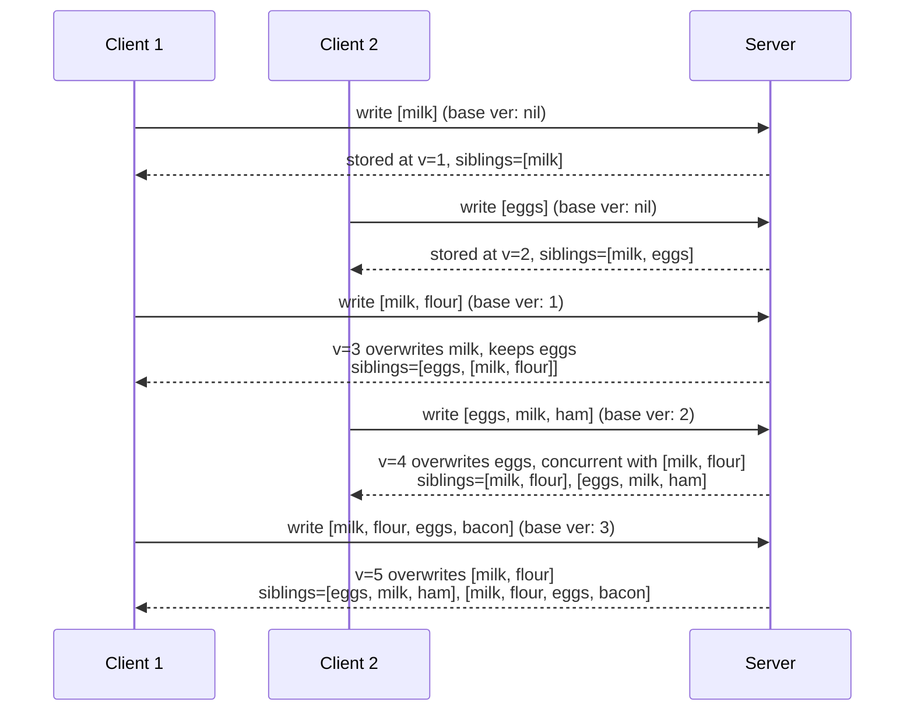
```mermaid
sequenceDiagram
    participant C1 as Client 1
    participant C2 as Client 2
    participant Server

    C1->>Server: write [milk] (base ver: nil)
    Server-->>C1: stored at v=1, siblings=[milk]

    C2->>Server: write [eggs] (base ver: nil)
    Server-->>C2: stored at v=2, siblings=[milk, eggs]

    C1->>Server: write [milk, flour] (base ver: 1)
    Server-->>C1: v=3 overwrites milk, keeps eggs<br/>siblings=[eggs, [milk, flour]]

    C2->>Server: write [eggs, milk, ham] (base ver: 2)
    Server-->>C2: v=4 overwrites eggs, concurrent with [milk, flour]<br/>siblings=[milk, flour], [eggs, milk, ham]

    C1->>Server: write [milk, flour, eggs, bacon] (base ver: 3)
    Server-->>C1: v=5 overwrites [milk, flour]<br/>siblings=[eggs, milk, ham], [milk, flour, eggs, bacon]
```

The dataflow between the operations is illustrated graphically as a graph of causal dependencies. The arrows indicate which operation happened before which other operation, in the sense that the later operation knew about or depended on the earlier one. In this example, the clients are never fully up-to-date with the data on the server, since there is always another operation going on concurrently. But old versions of the value do get overwritten eventually, and no writes are lost.

```python
from dataclasses import dataclass, field
from typing import Dict, List, Optional, Tuple


@dataclass
class StoredValue:
    value: object
    version: int


class VersionedKVStore:
    """
    Single-replica store that detects concurrent writes using version numbers.

    Each write must carry the version number from the client's most recent read.
    A write whose base version is older than an existing sibling is concurrent
    with that sibling, so the sibling is preserved.
    """
    def __init__(self) -> None:
        self._version: Dict[str, int] = {}
        self._siblings: Dict[str, List[StoredValue]] = {}

    def read(self, key: str) -> Tuple[List[StoredValue], int]:
        return list(self._siblings.get(key, [])), self._version.get(key, 0)

    def write(
        self,
        key: str,
        value: object,
        base_version: int,
        merge_fn=set.union,
    ) -> Tuple[List[StoredValue], int]:
        existing = self._siblings.get(key, [])
        # Merge in any new values from siblings that the client knows about.
        new_value: object = value
        for sib in existing:
            if sib.version > base_version:
                # This sibling is concurrent with the incoming write.
                new_value = merge_fn(new_value, sib.value)

        new_version = self._version.get(key, 0) + 1
        # Keep all siblings whose version is greater than the base_version
        # (these are concurrent with the new value).
        surviving = [sib for sib in existing if sib.version > base_version]
        # Add the freshly written value.
        surviving.append(StoredValue(value=new_value, version=new_version))
        self._siblings[key] = surviving
        self._version[key] = new_version
        return surviving, new_version


# Demo: two clients concurrently editing a set.
store = VersionedKVStore()

# Step 1: Client 1 writes {"milk"} with base_version 0 (no prior read).
store.write("cart", {"milk"}, base_version=0)
# Step 2: Client 2 writes {"eggs"} with base_version 0.
siblings, ver = store.write("cart", {"eggs"}, base_version=0)
print(f"After step 2: version={ver}, siblings={[s.value for s in siblings]}")

# Step 3: Client 1 read at v=1, now writes {"milk", "flour"} based on v=1.
siblings, ver = store.write("cart", {"milk", "flour"}, base_version=1)
print(f"After step 3: version={ver}, siblings={[s.value for s in siblings]}")

# Step 4: Client 2 merges its earlier siblings and writes a union.
siblings, ver = store.write("cart", {"eggs", "milk", "ham"}, base_version=2)
print(f"After step 4: version={ver}, siblings={[s.value for s in siblings]}")
```

### 5.3 Version Vectors

The example above used only a single replica. How does the algorithm change when there are multiple replicas but no leader?

The single-replica approach uses a single version number to capture dependencies between operations, but that is not sufficient when there are multiple replicas accepting writes concurrently. Instead, we need to use a version number per replica as well as per key. Each replica increments its own version number when processing a write, and also keeps track of the version numbers it has seen from each of the other replicas. This information indicates which values to overwrite and which values to keep as siblings.

The collection of version numbers from all the replicas is called a **version vector** [59]. A few variants of this idea are in use, but the most interesting is probably the **dotted version vector** [60, 61], which is used in **Riak 2.0** [62, 63]. We won't go into the details, but the way it works is quite similar to what we saw in our cart example.

Like the version numbers in the single-replica case, version vectors are sent from the database replicas to clients when values are read, and they need to be sent back to the database when a value is subsequently written. (Riak encodes the version vector as a string that it calls **causal context**.) The version vector allows the database to distinguish between overwrites and concurrent writes.

The version vector also ensures that it is safe to read from one replica and subsequently write back to another replica. Doing so may result in siblings being created, but no data is lost as long as siblings are merged correctly.

```python
class VersionVector:
    """
    A version vector tracks the latest version number seen from each replica.

    Two version vectors can be compared to determine whether one
    dominates (happens-before) the other, or whether they are concurrent.
    """

    def __init__(self, versions: Optional[Dict[str, int]] = None) -> None:
        self.versions: Dict[str, int] = dict(versions or {})

    def increment(self, replica_id: str) -> "VersionVector":
        self.versions[replica_id] = self.versions.get(replica_id, 0) + 1
        return self

    def merge(self, other: "VersionVector") -> "VersionVector":
        # Take the max per replica.
        merged_versions = dict(self.versions)
        for replica, count in other.versions.items():
            merged_versions[replica] = max(merged_versions.get(replica, 0), count)
        return VersionVector(merged_versions)

    def dominates(self, other: "VersionVector") -> bool:
        """True iff every entry in self is >= the corresponding entry in other."""
        return all(
            self.versions.get(replica, 0) >= count
            for replica, count in other.versions.items()
        )

    def is_concurrent(self, other: "VersionVector") -> bool:
        """True iff neither vector dominates the other (no causal order)."""
        return not (self.dominates(other) or other.dominates(self))

    def __repr__(self) -> str:
        return f"VersionVector({self.versions})"


# Three replicas concurrently write the same key.
node_a = VersionVector({"A": 1})
node_b = VersionVector({"B": 1})
node_c = VersionVector({"C": 1})

# A and B are concurrent with each other; each dominates itself.
print(node_a.is_concurrent(node_b))   # True
print(node_a.dominates(node_a))       # True

# After A merges B, A dominates B.
merged = node_a.merge(node_b).increment("A")
print(merged)                        # VersionVector({'A': 2, 'B': 1})
print(merged.dominates(node_b))      # True
print(merged.is_concurrent(node_c))  # True (still concurrent with C)
```

#### Version Vectors and Vector Clocks

A version vector is sometimes also called a **vector clock**, even though they are not quite the same. The difference is subtle [61, 64, 65]. See the references for details; in brief, when comparing the state of replicas, version vectors are the right data structure to use.

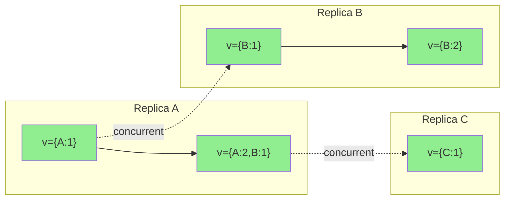
```mermaid
graph LR
    subgraph "Replica A"
        A1["v={A:1}"]
        A2["v={A:2,B:1}"]
        A1 --> A2
    end

    subgraph "Replica B"
        B1["v={B:1}"]
        B2["v={B:2}"]
        B1 --> B2
    end

    subgraph "Replica C"
        C1["v={C:1}"]
    end

    A1 -.->|"concurrent"| B1
    A2 -.->|"concurrent"| C1

    style A1 fill:#90EE90
    style B1 fill:#90EE90
    style A2 fill:#90EE90
    style B2 fill:#90EE90
    style C1 fill:#90EE90
```

---

## 6. Summary

In this chapter we looked at the issue of replication. Replication can serve several purposes:

- **High availability**: keeping the system running, even when one machine (or several machines, a zone, or even an entire region) goes down
- **Durability**: ensuring you don't lose data, even if a whole machine (or even an entire region) fails permanently
- **Disconnected operation**: allowing an application to continue working despite a network interruption
- **Latency**: placing data geographically close to users so that users can interact with it faster
- **Scalability**: being able to handle a higher volume of reads than a single machine could handle, by performing reads on replicas

Despite the concept being simple — keeping a copy of the same data on several machines — replication turns out to be a remarkably tricky problem. It requires carefully thinking about concurrency, all the things that can go wrong, and how to deal with the consequences of those faults. At a minimum, we need to deal with unavailable nodes and network interruptions (and that's not even considering the more insidious kinds of fault, such as silent data corruption due to software bugs or hardware errors).

We discussed three main approaches to replication:

- **Single-leader replication**: clients send all writes to a single node (the leader), which sends a stream of data change events to the other replicas (followers). Reads can be performed on any replica, but reads from followers might be stale.
- **Multi-leader replication**: clients send each write to one of several leader nodes, any of which can accept writes. The leaders send streams of data change events to each other and to any follower nodes.
- **Leaderless replication**: clients send each write to several nodes and read from several nodes in parallel in order to detect and correct nodes with stale data.

Each approach has advantages and disadvantages. Single-leader replication is popular because it is fairly easy to understand and offers strong consistency. Multi-leader and leaderless replication can be more robust in the presence of faulty nodes, network interruptions, and latency spikes, at the cost of requiring conflict resolution and providing weaker consistency guarantees.

Replication can be synchronous or asynchronous, which has a profound effect on the system behavior when there is a fault. Although asynchronous replication can be fast when the system is running smoothly, it's important to figure out what happens when replication lag increases and servers fail. If a leader fails and you promote an asynchronously updated follower to be the new leader, recently committed data may be lost.

We looked at some strange effects that can be caused by replication lag, and we discussed a few consistency models that are helpful for deciding how an application should behave under replication lag:

- **Read-after-write consistency**: users should always see data that they submitted themselves.
- **Monotonic reads**: after users have seen the data at one point in time, they shouldn't later see the data from an earlier point in time.
- **Consistent prefix reads**: users should see the data in a state that makes causal sense — for example, seeing a question and its reply in the correct order.

Finally, we discussed how multi-leader and leaderless replication ensure that all replicas eventually converge to a consistent state: by using a version vector or similar algorithm to detect which writes are concurrent, and by using a conflict resolution algorithm such as a CRDT to merge the concurrently written values. LWW and manual conflict resolution are also possible.

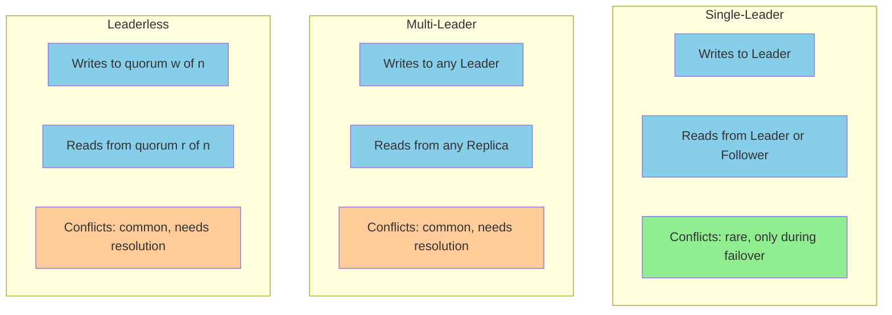
```mermaid
graph TB
    subgraph "Single-Leader"
        SL_W["Writes to Leader"]
        SL_R["Reads from Leader or Follower"]
        SL_C["Conflicts: rare, only during failover"]
    end

    subgraph "Multi-Leader"
        ML_W["Writes to any Leader"]
        ML_R["Reads from any Replica"]
        ML_C["Conflicts: common, needs resolution"]
    end

    subgraph "Leaderless"
        LL_W["Writes to quorum w of n"]
        LL_R["Reads from quorum r of n"]
        LL_C["Conflicts: common, needs resolution"]
    end

    style SL_W fill:#87CEEB
    style SL_R fill:#87CEEB
    style SL_C fill:#90EE90
    style ML_W fill:#87CEEB
    style ML_R fill:#87CEEB
    style ML_C fill:#ffcc99
    style LL_W fill:#87CEEB
    style LL_R fill:#87CEEB
    style LL_C fill:#ffcc99
```

### Replication Strategy Comparison

| Replication Type | Write Target | Read Source | Conflicts | Best For |
|---|---|---|---|---|
| **Single-Leader** | Leader only | Leader or Followers | Rare (only during failover) | Most common, simple consistency |
| **Multi-Leader** | Any leader | Any replica | Common, needs resolution | Multi-datacenter, offline clients |
| **Leaderless** | Any replica (quorum) | Multiple replicas (quorum) | Common, needs resolution | High availability, fault tolerance |

### Key Takeaways

- Replication provides redundancy, but introduces complexity. The basic idea is simple; the practice is not.
- Asynchronous replication causes **lag** and consistency issues. Read-after-write, monotonic reads, and consistent prefix reads are the standard ways to reason about (and mitigate) that lag.
- **Sync engines and local-first software** are an important new pattern. They push the trade-off toward offline usability and instant UI response, at the cost of having to implement conflict resolution.
- Conflicts are inevitable with multi-leader or leaderless replication. They can be **avoided** (route all writes for a record to one leader), **discarded** (LWW), **merged automatically** (CRDTs), or **resolved by humans** (siblings / version vectors).
- **Version vectors** let the database detect concurrent writes precisely, without depending on wall-clock time.
- Choose a replication strategy based on **availability, consistency, and latency requirements**. There is no one-size-fits-all answer.

This chapter has assumed that every replica stores a full copy of the whole database, which is unrealistic for large datasets. In the next chapter we will look at **sharding**, which allows each machine to store only a subset of the data.