# Chapter 7: Sharding

## TL;DR

- Sharding splits a large dataset across multiple machines (shards). It's a heavyweight solution for problems a single machine can no longer handle — typically very large data volumes, very high write throughput, or both.
- Two main partitioning strategies: by **key range** (good for range queries, risk of hot spots) and by **hash of key** (good for even distribution, breaks range-query efficiency). Hash-based partitioning uses **consistent hashing** (see also Ch6 §4) to minimize data movement when nodes are added or removed.
- A good sharding scheme distributes data and load evenly across shards. **Skew** (uneven distribution) creates hot spots that the scheme itself cannot fix — you need application-level techniques like random-key suffixes or virtual buckets to relieve them.
- Sharding interacts badly with secondary indexes and with cross-shard transactions. Indexes can be **local** (fast writes, scatter/gather reads) or **global** (fast reads, expensive multi-shard writes). Cross-shard writes typically need distributed transactions (Ch8).
- Rebalancing can be fully automatic, fully manual, or require human approval of an automated plan. The middle ground is often safest — unattended rebalancing combined with failure detection can cause cascading failures.

## Introduction

In Chapter 6, we discussed replication — keeping copies of the same data on multiple machines for redundancy and performance. But what if your dataset is so large that it doesn't fit on a single machine? Or what if a single machine cannot handle all the read and write requests?

This is where **sharding** comes in. Sharding is the technique of breaking up a large database into smaller pieces, called **shards**, and distributing them across multiple machines. In the 1st edition of this book, this was called *partitioning*; the 2nd edition uses the term *sharding* to match industry convention.

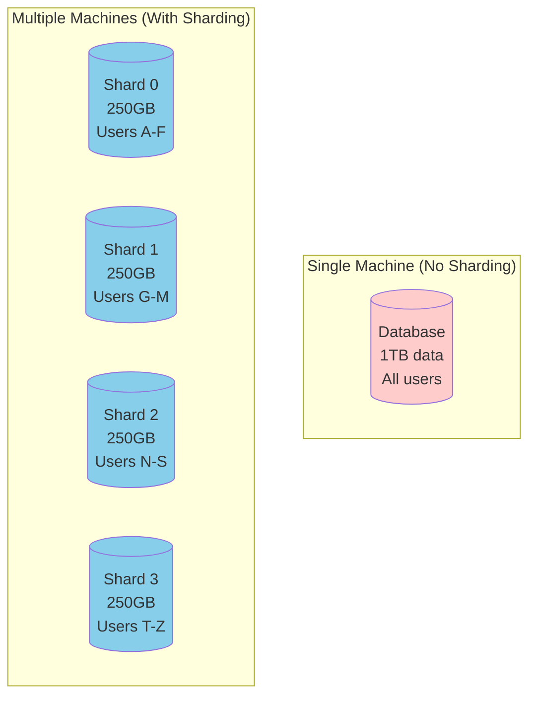

Different systems give this concept different names. Kafka calls it a *partition*, HBase and TiDB call it a *region*, CockroachDB calls it a *range*, Cassandra calls it a *token-range*, Couchbase calls it a *vBucket*, Riak calls it a *vnode*, and Bigtable, YugabyteDB, and ScyllaDB call it a *tablet*. In PostgreSQL, partitioning historically meant splitting a large table into several files on the *same* machine (which makes operations like bulk delete very fast), whereas sharding splits a dataset across *multiple* machines. In most other systems, the two terms are interchangeable. Note that "partitioning" has nothing to do with *network partitions* (netsplits) — we will discuss that kind of fault in Chapter 9.

### Why Shard Data?

Sharding is a heavyweight solution that is mostly relevant at large scale. If your data volume and write throughput are such that a single machine can handle them (and a single machine can do a lot nowadays!), it's often better to avoid sharding and stick with a single-shard database.

The primary reason for sharding a database is **scalability** — the ability to grow capacity by adding more (smaller) machines rather than moving to a bigger machine. This is **horizontal scaling** (a scale-out architecture). If you can divide the workload such that each shard handles a roughly equal share, you can assign those shards to different machines to process their data and queries in parallel.

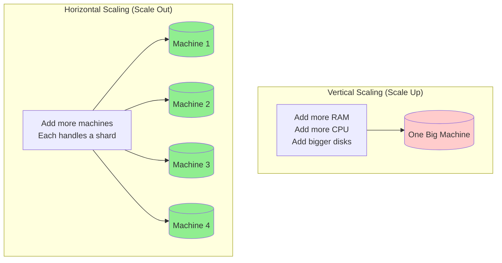

Sharding becomes necessary when:

1. **Scalability — Handle more data**: Single machine has limited disk capacity (1-10TB). With sharding, dataset can grow to petabytes by adding more machines. Example: Facebook has petabytes of user data, impossible to store on one machine.

2. **Performance — Handle more requests**: Single machine has limited CPU and memory. Query throughput is bounded by one machine. With sharding, queries are distributed across many machines — if you have 10 shards, theoretically 10x throughput. Example: Twitter handles millions of tweets/second by sharding across thousands of machines.

3. **Parallel query processing**: Large queries can be parallelized across multiple shards. Each shard processes its subset of data independently, and results are combined at the end. Example: an analytics query like "count users by country" runs a local count on each shard, and the results are aggregated.

**The goal of sharding**: Spread data and query load evenly across multiple machines. If sharding is unfair (one shard has more data/queries than others), we call it **skewed**. A shard with disproportionately high load is called a **hot shard** or **hot spot**. If one particular key is hot, we call it a **hot key**.

The reason for this recommendation is that sharding adds significant complexity. You typically have to decide which records to put in which shard by choosing a **partition key** (or shard key); all records with the same partition key are placed in the same shard. This choice matters because accessing a record is fast if you know which shard it's in, but if you don't, you have to do an inefficient search across all shards. The sharding scheme is also difficult to change.

Some systems even use sharding on a single machine — for example, Redis, VoltDB, and FoundationDB run one process per CPU core and rely on sharding to spread load across cores in the same machine, sometimes to take advantage of non-uniform memory access (NUMA) architectures where some banks of memory are closer to one CPU than to others.

### Drawbacks of Sharding

| Aspect | Single-shard DB | Sharded DB |
|--------|----------------|------------|
| Operational complexity | Simple | Complex |
| Schema migrations | Easy | Need to coordinate across shards |
| Cross-shard queries | N/A | Slow (scatter/gather) |
| Cross-shard transactions | N/A | Slow (distributed transactions) |
| Index design | Trivial | Local vs. global decision |
| Re-sharding | Trivial | Expensive |

Sharding often works well for **key-value data**, where you can easily shard by key, but it's harder with **relational data**, where you may want to search by a secondary index or join records that might be distributed across different shards. We will discuss this further in "Sharding and Secondary Indexes" later in this chapter.

Another problem with sharding is that a write may need to update related records in several shards. While transactions on a single node are quite common, ensuring consistency across multiple shards requires a **distributed transaction**. As we will see in Chapter 8, distributed transactions are available in some databases, but they are usually much slower than single-node transactions and may become a bottleneck for the system as a whole.

### Sharding vs. Replication

Sharding and replication are often used together. In a typical deployment:

- **Sharding**: Divide data into subsets
- **Replication**: Keep multiple copies of each shard for fault tolerance

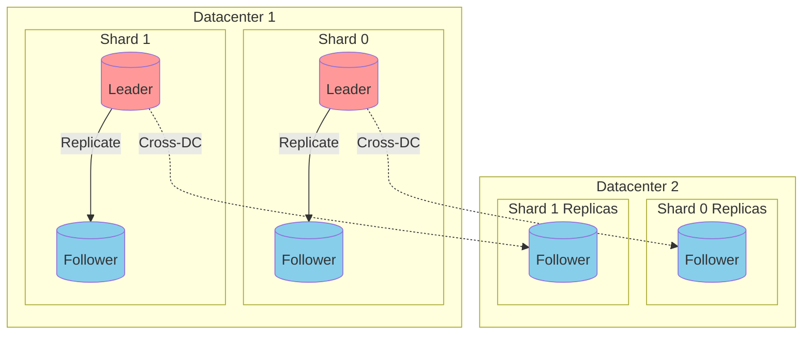

A database with 4 shards, each replicated 3x (3 replicas per shard) = 12 nodes total. Each node acts as leader for some shards and follower for others. Everything about replication from Chapter 6 applies equally to the replication of shards. Since the choice of sharding scheme is mostly independent of the choice of replication scheme, we will ignore replication in this chapter for the sake of simplicity.

### Sharding for Multitenancy

Software as a service (SaaS) products and cloud services are often multitenant, where each tenant is a customer. Multiple users may have logins on the same tenant, but each tenant has a self-contained dataset that is separate from those of other tenants. Sometimes sharding is used to implement multitenant systems — either each tenant is given a separate shard, or multiple small tenants may be grouped together into a larger shard. These shards might be physically separate databases or separately manageable portions of a larger logical database.

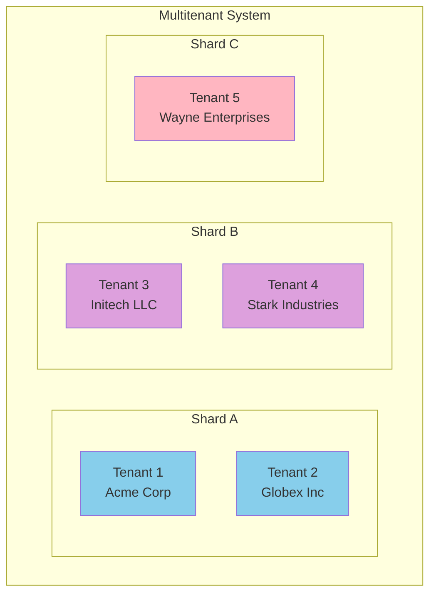

Key advantages:

- **Isolation (resource, permission, fault)**: If one tenant performs an expensive operation, other tenants are less likely to be affected. If access control has a bug, cross-tenant data leakage is less likely. In a cell-based architecture, the services and storage for a particular set of tenants are grouped into a self-contained cell, and different cells run largely independently — so a fault in one cell stays limited to that cell, providing **fault isolation**.
- **Per-tenant backup and restore**: Backing up each tenant's shard separately makes it possible to restore a tenant's state from a backup without affecting other tenants, which is useful if the tenant accidentally deletes or overwrites important data.
- **Regulatory compliance and data residency**: Privacy regulations such as the GDPR and CCPA give individuals the right to access and request deletion of personal information. If each person's data is stored in a separate shard, this translates into simple data export and deletion operations on their shard. Region-aware databases also let you assign a tenant's shard to a particular jurisdiction to satisfy data residency laws.
- **Gradual schema rollout**: Schema migrations can be rolled out gradually, one tenant at a time. This reduces risk, as you can detect problems before they affect all tenants, but it can be difficult to do transactionally.

Main challenges:

- Assumes each individual tenant is small enough to fit on a single node; otherwise you need sharding *within* that tenant, which brings us back to scalability.
- Many small tenants create overhead if each gets its own shard. Grouping small tenants into a bigger shard creates complexity when tenants grow and need to be moved.
- Cross-tenant features become harder if data must be joined across multiple shards.

---

## Sharding of Key-Value Data

Say you have a large amount of data, and you want to shard it. How do you decide which records to store on which nodes?

The goal with sharding is to spread the data and the query load evenly across nodes. If every node takes a fair share, then — in theory — 10 nodes should be able to handle 10 times as much data and 10 times the read and write throughput of a single node (ignoring replication). If you add or remove a node, you also want to be able to rebalance the load so that it is evenly distributed across the new number of nodes.

If the sharding is unfair, so that some shards have more data or queries than others, we call it **skewed**. The presence of skew makes sharding much less effective. In an extreme case, all the load could end up on one shard, so 9 out of 10 nodes are idle, and your bottleneck is the single busy node.

```mermaid
graph TB
    subgraph "Even Distribution (Good)"
        E1[(Shard 0<br/>1000 keys<br/>100 qps)]
        E2[(Shard 1<br/>1000 keys<br/>100 qps)]
        E3[(Shard 2<br/>1000 keys<br/>100 qps)]
        E4[(Shard 3<br/>1000 keys<br/>100 qps)]
    end

    subgraph "Skewed Distribution (Bad)"
        S1[(Shard 0<br/>500 keys<br/>10 qps)]
        S2[(Shard 1<br/>500 keys<br/>10 qps)]
        S3[(Shard 2<br/>500 keys<br/>10 qps)]
        S4[(Shard 3<br/>2500 keys<br/>10000 qps<br/>🔥 HOT!]
    end

    style E1 fill:#90EE90
    style E2 fill:#90EE90
    style E3 fill:#90EE90
    style E4 fill:#90EE90
    style S1 fill:#ffcccc
    style S2 fill:#ffcccc
    style S3 fill:#ffcccc
    style S4 fill:#FFA500
```

To split the dataset into shards, we need an algorithm that takes as input the **partition key** of a record and tells us which shard contains that record. In a key-value store the partition key is usually the key or the first part of the key. In a relational model the partition key might be a column of a table (not necessarily its primary key). That algorithm needs to be amenable to rebalancing in order to relieve hot spots.

---

## Sharding by Key Range

One way of sharding is to assign a contiguous range of partition keys (from a minimum to a maximum) to each shard, like the volumes of a paper encyclopedia. If you want to look up the entry for a particular title, you can easily determine which shard contains that entry, and thus pick the correct book off the shelf, by finding the volume whose key range contains the title you're looking for.

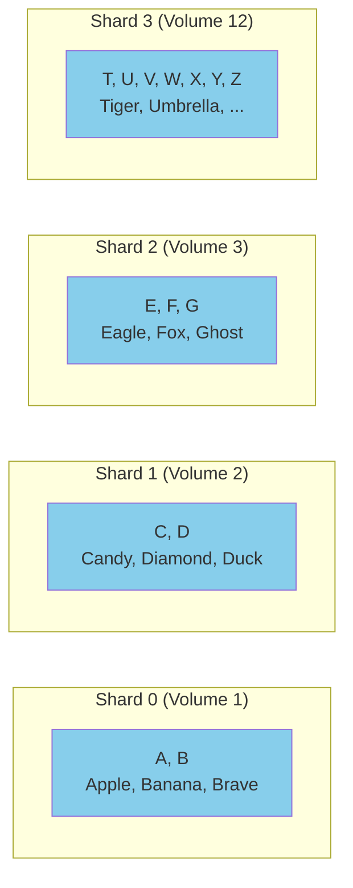

The ranges of keys are not necessarily evenly spaced, because your data may not be evenly distributed. For example, in the encyclopedia, volume 1 contains words starting with A and B, but volume 12 contains words starting with T, U, V, W, X, Y, and Z. Simply having one volume per two letters of the alphabet would lead to some volumes being much bigger than others. To distribute data evenly, the shard boundaries need to adapt to the data.

The shard boundaries might be chosen manually by an administrator, or the database can choose them automatically. Manual key-range sharding is used by **Vitess** (a sharding layer for MySQL), for example; the automatic variant is used by **Bigtable** and its open source equivalent **HBase**, the range-based sharding option in **MongoDB**, as well as **CockroachDB**, **RethinkDB**, and **FoundationDB**. **YugabyteDB** offers both manual and automatic tablet splitting.

### Advantages of Key Range Sharding

Within each shard, keys are stored in sorted order (e.g., in a B-tree or SSTables). This has the advantage that **range scans are easy**, and you can treat the key as a concatenated index in order to fetch several related records in one query.

For example, consider an application that stores data from a network of sensors, where the key is the timestamp of the measurement. Range scans are very useful in this case, because they let you easily fetch, say, all the readings from a particular month.

### Hot Spot Risk

A downside of key-range sharding is that you can easily get a hot shard if there are a lot of writes to nearby keys. For example, if the key is a timestamp, then the shards correspond to ranges of time — for example, one shard per month. If you write data from the sensors to the database as the measurements happen, all the writes will end up going to the same shard (the one for this month), so that shard will be overloaded with writes while others sit idle.

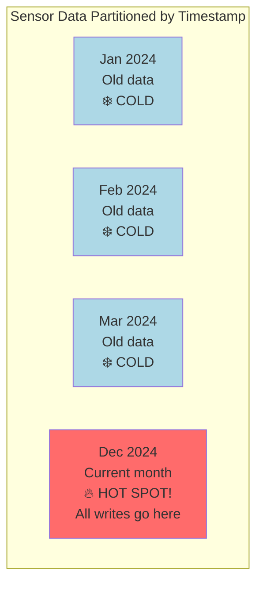

To avoid this problem in the sensor database, you need to use something other than the timestamp as the first element of the key. For example, you could **prefix each timestamp with the sensor ID** so that the key ordering is first by sensor ID and then by timestamp. Assuming you have many sensors active at the same time, the write load will end up more evenly spread across the shards.

The downside is that when you want to fetch the values of multiple sensors within a time range, you now need to perform a separate range query for each sensor.

### Rebalancing Key-Range Sharded Data

When you first set up your database, there are no key ranges to split into shards. Some databases, such as HBase and MongoDB, allow you to configure an initial set of shards on an empty database, which is called **pre-splitting**. This requires that you already have some idea of what the key distribution is going to look like, so that you can choose appropriate key range boundaries.

Later, as data volume and write throughput increase, a system with key-range sharding grows by **splitting an existing shard into two or more smaller shards**, each of which holds a contiguous subrange of the original shard's key range. The resulting smaller shards can then be distributed across multiple nodes. If large amounts of data are deleted, you may also need to **merge** several adjacent shards that have become small into one bigger one. This process is similar to what happens at the top level of a B-tree.

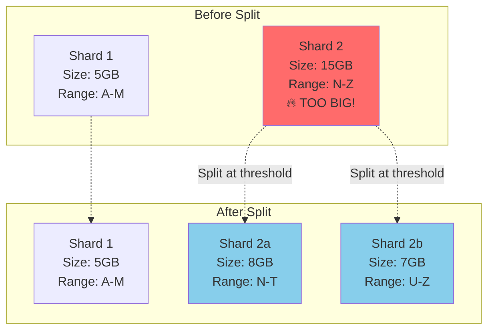

With databases that manage shard boundaries automatically, a shard split is typically triggered by the shard reaching a configured size (e.g., on HBase, the default is 10 GB) or, in some systems, the write throughput being persistently above a certain threshold. Thus, a hot shard may be split even if it is not storing a lot of data, so that its write load can be distributed more uniformly.

The number of shards adapts to the data volume. If there is only a small amount of data, a small number of shards is sufficient, so overheads are small; if there is a huge amount of data, the size of each individual shard is limited to a configurable maximum.

Unfortunately, splitting a shard is an expensive operation, since it requires all its data to be rewritten into new files, similarly to a compaction in a log-structured storage engine. A shard that needs splitting is often also one that is under high load, and the cost of splitting can exacerbate that load, risking it becoming overloaded.

```python
class RangeShard:
    """A key-range sharded storage engine.

    Each shard covers a contiguous range of keys and supports efficient
    range scans within that range. Splits happen when size grows beyond
    the configured threshold.
    """
    def __init__(self, shard_id, start_key, end_key):
        self.shard_id = shard_id
        self.start_key = start_key
        self.end_key = end_key
        self.records = {}  # Sorted by key (B-tree in real systems)
        self.size_bytes = 0

    def contains(self, key):
        return self.start_key <= key < self.end_key

    def insert(self, key, value):
        if not self.contains(key):
            raise ValueError(f"Key {key} not in shard range")
        self.records[key] = value
        self.size_bytes += len(value)

    def range_scan(self, lo, hi):
        # Efficient because keys are sorted within the shard
        return [(k, v) for k, v in self.records.items() if lo <= k <= hi]

    def should_split(self, max_size_gb):
        return self.size_bytes > max_size_gb * 1024**3


class RangeShardedDB:
    def __init__(self, split_threshold_gb=10):
        self.shards = []
        self.split_threshold_gb = split_threshold_gb
        self._next_id = 0

    def _add_shard(self, start_key, end_key):
        shard = RangeShard(self._next_id, start_key, end_key)
        self._next_id += 1
        self.shards.append(shard)
        return shard

    def insert(self, key, value):
        shard = self._find_shard(key)
        if shard is None:
            # First insert - create initial shard covering everything
            shard = self._add_shard('', '\xFF')

        shard.insert(key, value)

        # Auto-split if shard grows too big
        if shard.should_split(self.split_threshold_gb):
            self._split(shard)

    def _find_shard(self, key):
        for shard in self.shards:
            if shard.contains(key):
                return shard
        return None

    def _split(self, shard):
        # Find median key for the split point
        sorted_keys = sorted(shard.records.keys())
        median = sorted_keys[len(sorted_keys) // 2]

        # Remove old shard and replace with two new ones
        old_index = self.shards.index(shard)
        self.shards.pop(old_index)

        left = self._add_shard(shard.start_key, median)
        right = self._add_shard(median, shard.end_key)

        # Redistribute records
        for k, v in shard.records.items():
            if k < median:
                left.insert(k, v)
            else:
                right.insert(k, v)

        # Insert in sorted position to preserve key ordering
        self.shards.insert(old_index, left)
        self.shards.insert(old_index + 1, right)


# Example: sensor data with composite key
db = RangeShardedDB(split_threshold_gb=10)

# Key format: (sensor_id, timestamp)
db.insert(("sensor_A", "2024-12-01T10:00:00"), {"temp": 22.5})
db.insert(("sensor_B", "2024-12-01T10:00:01"), {"temp": 19.3})
db.insert(("sensor_C", "2024-12-01T10:00:02"), {"temp": 25.1})

# Efficient range scan within one sensor's range
results = db.shards[0].range_scan(
    ("sensor_A", "2024-12-01T00:00:00"),
    ("sensor_A", "2024-12-31T23:59:59")
)
```

---

## Sharding by Hash of Key

Key-range sharding is useful if you want records with nearby (but different) partition keys to be grouped into the same shard — for example, this might be the case with timestamps. If you don't care whether partition keys are near each other (e.g., if they are tenant IDs in a multitenant application), a common approach is to first **hash the partition key** before mapping it to a shard.

A good hash function takes skewed data and makes it uniformly distributed. Say you have a 32-bit hash function that takes a string. Whenever you give it a new string, it returns a seemingly random number from 0 to 2^32 − 1. Even if the input strings are very similar, their hashes are evenly distributed across that range of numbers (but the same input always produces the same output).

For sharding purposes, the hash function need not be cryptographically strong: for example, **MongoDB uses MD5**, whereas **Cassandra and ScyllaDB use Murmur3**.

Many programming languages have simple hash functions built in (as they are used for hash tables), but they may not be suitable for sharding: for example, in Java's `Object.hashCode()` and Ruby's `Object#hash`, the same key may have a different hash value in different processes, making them unsuitable for sharding.

### Fixed Number of Shards

One simple but widely used solution is to create many more shards than there are nodes and assign several shards to each node. For example, a database running on a cluster of 10 nodes may be split into 1,000 shards from the outset, so that 100 shards are assigned to each node. A key is then stored in shard number `hash(key) % 1,000`, and the system separately keeps track of which shard is stored on which node.

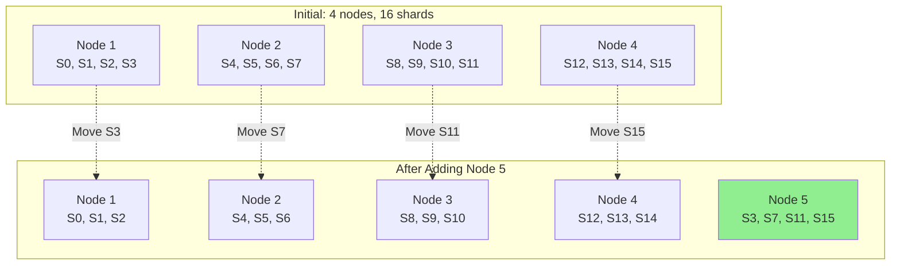

The simpler `mod N` approach (`hash(key) % N` directly against the current node count) leads to inefficient rebalancing because if N changes, most keys must move. With the fixed-shards approach, when a node is added to the cluster, the system can reassign some of the shards from existing nodes to the new node until they are fairly distributed once again. If a node is removed, the same happens in reverse.

In this model, only entire shards are moved between nodes, which is cheaper than splitting shards. The number of shards does not change, nor does the assignment of keys to shards. The only thing that changes is the assignment of shards to nodes. This reassignment is not immediate — it takes some time to transfer a large amount of data over the network — so the old assignment of shards is used for any reads and writes that happen while the transfer is in progress.

It's common to choose the number of shards to be one that is divisible by many factors, so that the dataset can be evenly split across various numbers of nodes — not requiring the number of nodes to be a power of 2, for example. You can even account for mismatched hardware in your cluster: by assigning more shards to nodes that are more powerful, you can make those nodes take on a greater share of the load.

This approach to sharding is used in **Citus** (a sharding layer for PostgreSQL), **Riak**, **Elasticsearch**, and **Couchbase**, among others. It works well as long as you have a good estimate of how many shards you will need when you first create the database. You can then add or remove nodes easily, subject to the limitation that you can't have more nodes than you have shards.

If you find the originally configured number of shards to be wrong — for example, if you have reached a scale where you need more nodes than you have shards — then an expensive resharding operation is required. It needs to split each shard and write it out to new files, using a lot of additional disk space in the process. Some systems don't allow resharding while concurrently writing to the database, which makes it difficult to change the number of shards without downtime.

Choosing the right number of shards is difficult if the total size of the dataset is highly variable (e.g., if it starts small but may grow much larger over time). Since each shard contains a fixed fraction of the total data, the size of each shard grows proportionally to the total amount of data in the cluster. If shards are very large, rebalancing and recovery from node failures become expensive. But if shards are too small, they incur too much overhead. The best performance is achieved when the size of shards is "just right," neither too big nor too small, which can be hard to achieve if the number of shards is fixed but the dataset size varies.

### Consistent Hashing

A **consistent hashing** algorithm maps keys to a specified number of shards in a way that satisfies two properties:

- The number of keys mapped to each shard is roughly equal.
- When the number of shards changes, as few keys as possible are moved from one shard to another.

Note that "consistent" here has nothing to do with *replica consistency* (see Chapter 6) or *ACID consistency* (see Chapter 8), but rather describes the tendency of a key to stay in the same shard if possible. The original definition of consistent hashing comes from work on distributed hash tables; Chapter 6 §4 also discusses sharding-by-hash and rebalancing. The next subsection merges the related "sharding by hash range" idea so this chapter has one canonical treatment.

If the required number of shards can't be predicted in advance, it's better to use a scheme in which the number of shards can adapt easily to the workload. The aforementioned key-range sharding scheme has this property, but it has a risk of hot spots when there are a lot of writes to nearby keys. One solution is to combine key-range sharding with a hash function so that each shard contains a **range of hash values** rather than a range of keys.

Using a 16-bit hash function that returns a number from 0 to 65,535 = 2^16 − 1 (in reality, the hash is usually 32 bits or more), even input keys that are very similar (e.g., consecutive timestamps) have uniformly distributed hashes. We then assign a range of hash values to each shard — for example, values from 0 to 16,383 to shard 0, values from 16,384 to 32,767 to shard 1, and so on.

As with key-range sharding, a shard can be split when it becomes too big or too heavily loaded. This is still an expensive operation, but it can happen as needed, so the number of shards adapts to the volume of data rather than being fixed in advance.

The downside compared to key-range sharding is that **range queries over the partition key are not efficient**, as keys in the range are now scattered across all the shards. However, if keys consist of two or more columns and the partition key is only the first of these columns, you can still perform efficient range queries over the second and later columns. As long as all records in the range query have the same partition key, they will be in the same shard.

**Example: Partitioning and Range Queries in Data Warehouses**

Data warehouses such as **BigQuery**, **Snowflake**, and **Delta Lake** support a similar indexing approach, though the terminology differs. In BigQuery, for example, the partition key determines which partition a record resides in, while "cluster columns" determine how records are sorted within the partition. Snowflake assigns records to "micro-partitions" automatically but allows users to define cluster keys for a table. Delta Lake supports both manual and automatic partition assignment and supports cluster keys. Clustering data not only improves range scan performance, but can improve compression and filtering performance as well.

**YugabyteDB** and **DynamoDB** use hash-range sharding, and it is an option in **MongoDB**. **Cassandra** and **ScyllaDB** use a variant of this approach: the space of hash values is split into a number of ranges proportional to the number of nodes (16 per node in Cassandra by default, 256 per node in ScyllaDB), with random boundaries between those ranges. This means some ranges are bigger than others, but by having multiple ranges per node, those imbalances tend to even out. When nodes are added or removed, range boundaries are adjusted and shards are split or merged accordingly. When node 3 is added, node 1 transfers parts of two of its ranges to node 3, and node 2 transfers part of one of its ranges to node 3. This has the effect of giving the new node an approximately fair share of the dataset, without transferring more data than necessary from one node to another.

The sharding algorithm used by Cassandra and ScyllaDB is similar to the original definition of consistent hashing, but several other consistent hashing algorithms have also been proposed, such as *highest random weight* (also known as *rendezvous hashing*), and *jump consistent hashing*. With these approaches, rather than a small number of existing shards being split into subranges to create new shards for a node that is added, the new node is instead assigned individual keys that were previously scattered across all the other nodes. Which is preferable depends on the application.

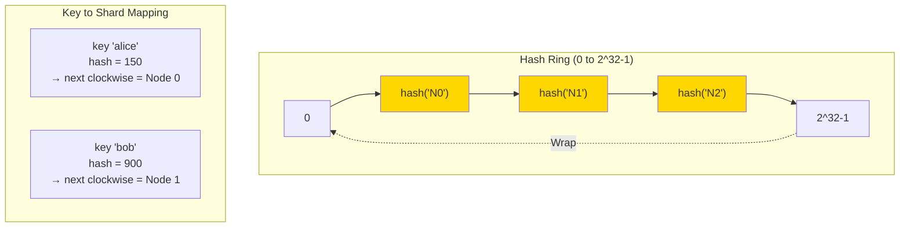

Let me illustrate a complete consistent hashing implementation with virtual nodes:

```python
import hashlib
import bisect
from typing import Dict, List, Optional


class ConsistentHashRing:
    """A consistent hash ring with virtual nodes.

    Properties:
    - Roughly equal key distribution across shards
    - Minimal key movement when shards are added/removed
    - Virtual nodes improve balance by averaging out hash space skew

    Used in: Cassandra, ScyllaDB, DynamoDB, Riak, Amazon Dynamo.
    """

    def __init__(self, replicas_per_node: int = 256):
        # ring maps hash_value -> shard_id
        self.ring: Dict[int, str] = {}
        self.sorted_keys: List[int] = []
        self.replicas_per_node = replicas_per_node

    def _hash(self, key: str) -> int:
        # Use MD5 for good distribution (matches MongoDB's choice)
        digest = hashlib.md5(key.encode('utf-8')).hexdigest()
        return int(digest[:8], 16)  # Take first 32 bits

    def add_shard(self, shard_id: str) -> None:
        """Add a shard to the ring using virtual nodes for better balance."""
        for i in range(self.replicas_per_node):
            # Each virtual node has a unique position on the ring
            vnode_key = f"{shard_id}#vnode{i}"
            position = self._hash(vnode_key)
            self.ring[position] = shard_id

        self.sorted_keys = sorted(self.ring.keys())

    def remove_shard(self, shard_id: str) -> None:
        """Remove all virtual nodes for a shard from the ring."""
        to_remove = [
            k for k, v in self.ring.items()
            if v == shard_id
        ]
        for k in to_remove:
            del self.ring[k]
        self.sorted_keys = sorted(self.ring.keys())

    def get_shard(self, key: str) -> Optional[str]:
        """Find which shard owns the given key."""
        if not self.ring:
            return None

        key_hash = self._hash(key)

        # Find the first vnode position clockwise from the key's hash
        idx = bisect.bisect_right(self.sorted_keys, key_hash)
        if idx == len(self.sorted_keys):
            idx = 0  # Wrap around

        return self.ring[self.sorted_keys[idx]]

    def get_shards(self) -> List[str]:
        """Return unique shard IDs."""
        return list(set(self.ring.values()))

    def distribution(self, sample_keys: List[str]) -> Dict[str, int]:
        """Count how many sample keys land on each shard."""
        counts: Dict[str, int] = {}
        for key in sample_keys:
            shard = self.get_shard(key)
            counts[shard] = counts.get(shard, 0) + 1
        return counts


# Example: build a ring with 3 shards, then add a 4th
ring = ConsistentHashRing(replicas_per_node=256)
ring.add_shard("shard-A")
ring.add_shard("shard-B")
ring.add_shard("shard-C")

# Check distribution with 10,000 sample keys
sample_keys = [f"user_{i}" for i in range(10_000)]
print("Before adding shard-D:")
for shard, count in ring.distribution(sample_keys).items():
    print(f"  {shard}: {count} keys")

# Add a new shard
ring.add_shard("shard-D")

print("\nAfter adding shard-D:")
for shard, count in ring.distribution(sample_keys).items():
    print(f"  {shard}: {count} keys")
# Output will show roughly even distribution (~2500 keys per shard),
# and only ~25% of keys moved to the new shard (not 100%)
```

In this implementation, each physical shard gets many "virtual nodes" scattered around the hash ring. This is a key technique: if a single physical node got only one position on the ring, an unlucky hash distribution would give it an unfair share of keys. By spreading each node across hundreds of positions, the law of averages smooths out the imbalance.

---

## Skewed Workloads and Relieving Hot Spots

Consistent hashing ensures that keys are uniformly distributed across nodes, but that doesn't mean that the actual load is uniformly distributed. **If the workload is highly skewed** — that is, there is much more data under some partition keys than others, or the rate of requests to some keys is much higher than to others — you can still end up with some servers being overloaded while others sit almost idle.

For example, on a social media site, a post by a celebrity user with millions of followers may cause a storm of activity. This event can result in a large volume of reads and writes to the same key (where the partition key is perhaps the user ID of the celebrity, or the ID of the action that people are commenting on).

**Example: Twitter's Justin Bieber problem**

In September 2010, Twitter reportedly had about 3% of its servers dedicated to Justin Bieber. When Justin Bieber tweets, millions of followers' timelines need updates, and the normal partitioning scheme was insufficient for such extreme skew. This forced Twitter to build special infrastructure for handling celebrity accounts.

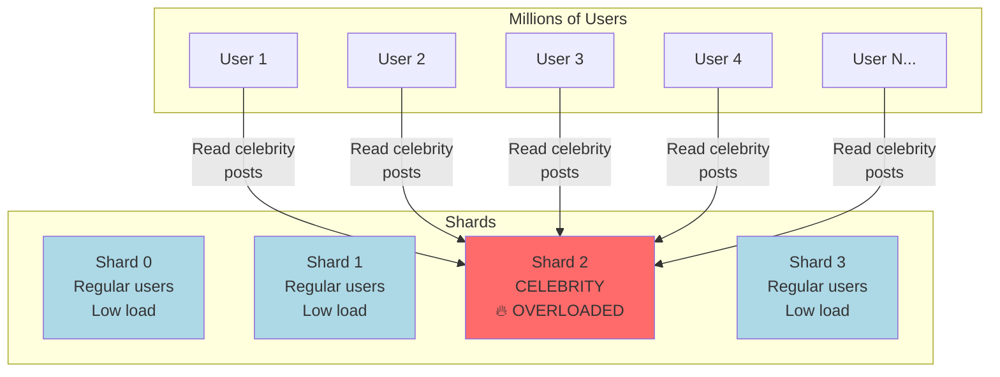

### Strategies for Relieving Hot Spots

In such situations, a more flexible sharding policy is required. Several approaches help:

**1. Put a hot key in its own shard**

A system that defines shards based on ranges of keys (or ranges of hashes) makes it possible to put an individual hot key in a shard by itself, perhaps even assigning it a dedicated machine.

**2. Application-level key splitting**

If one key is known to be very hot, a simple technique is to add a **random number to the beginning or end of the key**. Adding just two random digits would split the writes to the key evenly across 100 keys, allowing those keys to be distributed to different shards.

```mermaid
graph LR
    subgraph "Before"
        Before["hot_user:post<br/>All writes go to one shard"]
    end

    subgraph "After (random suffix)"
        S0["hot_user:post:00<br/>→ Shard 0"]
        S1["hot_user:post:01<br/>→ Shard 1"]
        S2["hot_user:post:02<br/>→ Shard 2"]
        SN["...97 more suffixes<br/>spread across all shards"]
    end

    Before -.->|"Split"| S0
    Before -.-> S1
    Before -.-> S2
    Before -.-> SN

    style Before fill:#ff6b6b
    style S0 fill:#90EE90
    style S1 fill:#90EE90
    style S2 fill:#90EE90
```

However, having split the writes across multiple keys, any reads now have to do additional work, as they have to read the data from all 100 keys and combine it. The volume of reads to each shard of the hot key is not reduced; only the write load is split. This technique also requires additional bookkeeping: it makes sense to append the random number for only the small number of hot keys; for the vast majority of keys with low write throughput, this would be unnecessary overhead. Thus, you also need some way of keeping track of which keys are being split, and a process for converting a regular key into a specially managed hot key.

**3. Virtual buckets**

A hybrid approach uses an intermediate "bucket" level between the hot key and the shards. Writes go to a random bucket, but reads can scan all buckets.

```python
import random
import hashlib
from typing import Dict, List, Optional


class HotKeyMitigator:
    """Application-level mitigation for hot keys using random suffixes.

    When a particular key (e.g., a celebrity user) receives disproportionate
    write load, we spread the writes across N virtual buckets by appending
    a random suffix. Reads must fan out to all buckets and merge the results.

    Trade-offs:
    - Writes: spread evenly across N shards (good!)
    - Reads: must read N times (bad)
    - Best when writes dominate and N is small (e.g., 100)
    """

    def __init__(self, num_buckets: int = 100):
        self.num_buckets = num_buckets

    def _hash(self, key: str) -> int:
        digest = hashlib.md5(key.encode('utf-8')).hexdigest()
        return int(digest[:8], 16)

    def write_key(self, hot_key: str) -> str:
        """Return a suffixed key that distributes writes across shards."""
        bucket = random.randint(0, self.num_buckets - 1)
        return f"{hot_key}:bucket{bucket:03d}"

    def read_keys(self, hot_key: str) -> List[str]:
        """Return all suffixed keys that need to be read."""
        return [
            f"{hot_key}:bucket{i:03d}"
            for i in range(self.num_buckets)
        ]

    def get_shard(self, key: str, num_shards: int) -> int:
        return self._hash(key) % num_shards


# Example usage
mitigator = HotKeyMitigator(num_buckets=100)

# Write: choose a random bucket for each write
write_key = mitigator.write_key("celebrity_justin_b")
print(f"Writing to: {write_key}")
# Output: celebrity_justin_b:bucket042 (random each time)

# Read: must fetch all 100 buckets and combine
all_keys = mitigator.read_keys("celebrity_justin_b")
print(f"Must read {len(all_keys)} keys and merge")
# Output: Must read 100 keys and merge
```

**4. Changes over time**

The problem is further compounded by changes in load over time: for example, a particular social media post that has gone viral may experience high load for a couple of days, but thereafter it's likely to calm down again. In addition, some keys may be hot for writes, while others are hot for reads, necessitating different strategies for handling them.

**5. Automated heat management**

Some systems (especially cloud services designed for large scale) have automated approaches for dealing with hot shards. Amazon, for instance, calls it *heat management* or *adaptive capacity*. The details of how these systems work are beyond the scope of this book.

---

## Operations: Automatic Versus Manual Rebalancing

We have glossed over one important question with regard to rebalancing: **does the splitting of shards and rebalancing happen automatically or manually?**

Some systems automatically decide when to split shards and when to move them from one node to another, without any human interaction, while others leave sharding to be explicitly configured by an administrator. There is also a middle ground — for example, **Couchbase and Riak** generate a suggested shard assignment automatically but require an administrator to commit it before it takes effect.

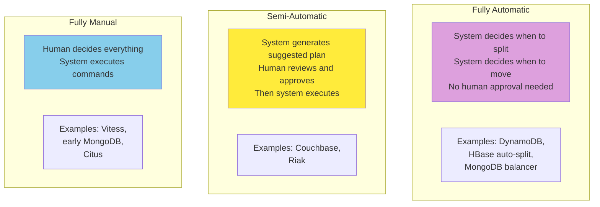

### The Case for Automatic Rebalancing

Fully automatic rebalancing can be convenient, because there is less operational work to do for normal maintenance, and such systems can even autoscale to adapt to changes in workload. Cloud databases such as DynamoDB are promoted as being able to automatically add and remove shards to adapt to big increases or decreases in load within a matter of minutes.

### The Case for Caution

However, automatic shard management can also be unpredictable. Rebalancing is an expensive operation, because it requires rerouting requests and moving a large amount of data from one node to another. If this process is not done carefully, it can overload the network or the nodes, and it might harm the performance of other requests. The system must continue processing writes while the rebalancing is in progress; if a system is near its maximum write throughput, the shard-splitting process might not even be able to keep up with the rate of incoming writes.

Such automation can be **dangerous in combination with automatic failure detection**. For example:

1. One node is overloaded and is temporarily slow to respond to requests.
2. The other nodes conclude that the overloaded node is dead, and automatically rebalance the cluster to move load away from it.
3. This puts additional load on other nodes and the network, making the situation worse.
4. There is a risk of causing a **cascading failure** where other nodes become overloaded and are also falsely suspected of being down.

```mermaid
sequenceDiagram
    participant N1 as Node 1
    participant N2 as Node 2
    participant N3 as Node 3
    participant N4 as Node 4

    Note over N1: Slow response (GC pause)
    N2->>N1: Suspect N1 dead
    N3->>N1: Suspect N1 dead
    N2->>N2: Start rebalancing
    N3->>N3: Start rebalancing
    Note over N2: Now overloaded from rebalancing
    Note over N3: Now overloaded from rebalancing
    N1->>N4: Suspect N2 dead
    N1->>N4: Suspect N3 dead
    Note over N4: More cascading failures!
    style Note over N4: Cluster collapse
```

### The Case for Manual Rebalancing

For that reason, it can be good to have a human in the loop for rebalancing. It's slower than a fully automatic process, but it can help prevent operational surprises. Manual rebalancing is also useful for preemptively rebalancing if a surge in traffic is expected because of a known event, such as Cyber Monday holiday sales or ticket sales for a popular athletic event such as the World Cup.

### Best Practice

The middle ground — generate the rebalancing plan automatically but require human approval before executing — is often the best compromise.

---

## Request Routing

We have discussed how to shard a dataset across multiple nodes, and how to rebalance those shards as nodes are added or removed. Now let's move on to another question: if you want to read or write a particular key, **how do you know which node** — that is, which IP address and port number — you need to connect to?

We call this problem **request routing**, and it's very similar to service discovery. The biggest difference between the two is that with services running application code, each instance is usually stateless, and a load balancer can send a request to any of the instances. With sharded databases, a request for a key can be handled only by a node that is a replica for the shard containing that key.

This means that request routing has to be aware of the assignment from keys to shards and from shards to nodes.

### Three Approaches to Request Routing

On a high level, there are a few approaches to this problem:

**1. Allow clients to contact any node**

If a client contacts any node (e.g., via a round-robin load balancer), and that node coincidentally owns the shard to which the request applies, the node can handle the request directly; otherwise, it forwards the request to the appropriate node, receives the reply, and passes the reply along to the client.

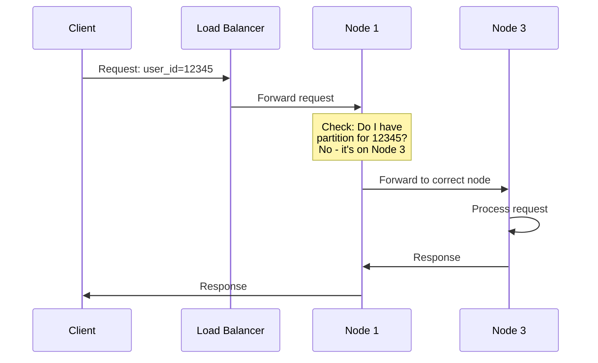

**2. Routing tier**

Send all requests from clients to a routing tier first, which determines the node that should handle each request and forwards it accordingly. This routing tier does not itself handle any requests; it acts only as a shard-aware load balancer.

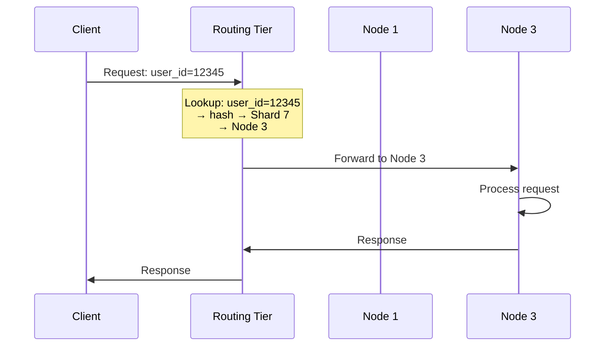

**3. Client-aware routing**

Require that clients be aware of the sharding and the assignment of shards to nodes. In this case, a client can connect directly to the appropriate node, without any intermediary.

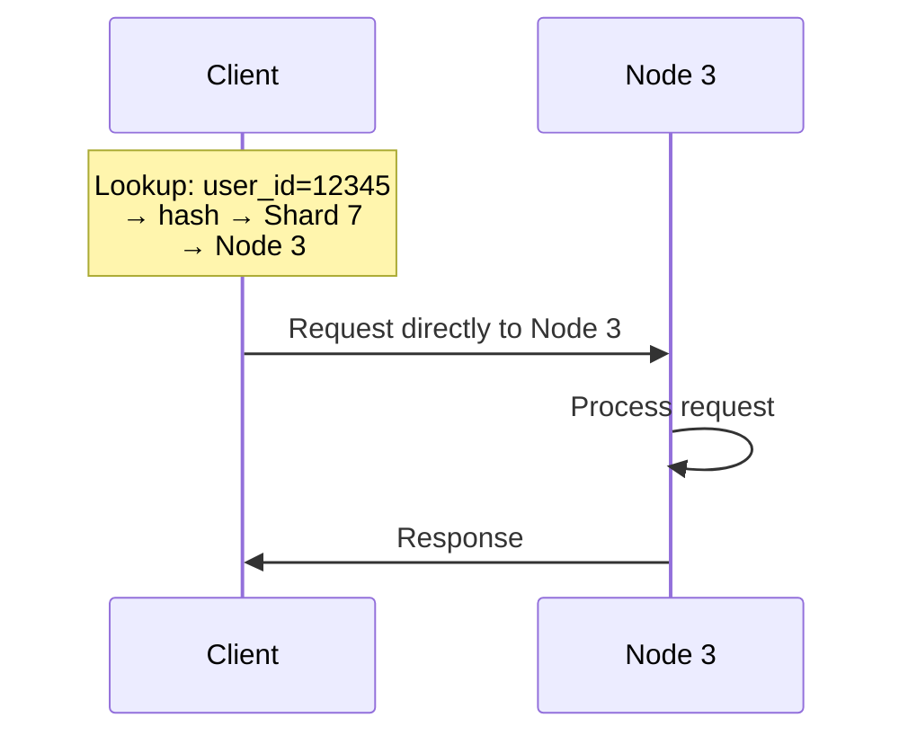

### Common Questions

Each case has some key problems:

**Who decides which shard should live on which node?** It's simplest to have a single coordinator making that decision, but in that case how do you make it fault-tolerant in the event that the node running the coordinator goes down? And if the coordinator role can fail over to another node, how do you prevent a split-brain situation where two different coordinators make contradictory shard assignments?

**How does the component performing the routing learn about changes in the assignment of shards to nodes?**

**Cutover during rebalancing:** While a shard is being moved from one node to another, there is a cutover period during which the new node has taken over, but requests to the old node may still be in flight. How do you handle those?

### Using a Coordination Service

Many distributed data systems rely on a separate coordination service such as **ZooKeeper** or **etcd** to keep track of shard assignments. They use consensus algorithms to provide fault tolerance and protection against split brain. Each node registers itself in ZooKeeper, and ZooKeeper maintains the authoritative mapping of shards to nodes. Other actors, such as the routing tier or the sharding-aware client, can subscribe to this information in ZooKeeper. Whenever a shard changes ownership, or a node is added or removed, ZooKeeper notifies the routing tier so that it can keep its routing information up-to-date.

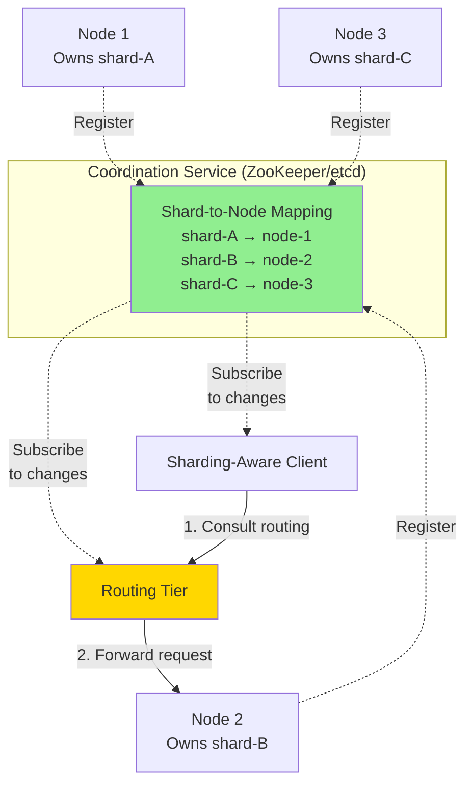

**Real-world examples**:
- **HBase** and **SolrCloud** use ZooKeeper to manage shard assignment
- **Kubernetes** uses etcd to keep track of which service instance is running where
- **MongoDB** has a similar architecture, but relies on its own config server implementation and `mongos` daemons as the routing tier
- **Kafka**, **YugabyteDB**, **TiDB**, and **ScyllaDB** use built-in implementations of the **Raft** consensus protocol to perform this coordination function

### Gossip Protocol Alternative

**Riak** takes a different approach: it uses a **gossip protocol** among the nodes to disseminate any changes in cluster state. This provides much weaker consistency than a consensus protocol; it is possible to have split brain, in which different parts of the cluster have different node assignments for the same shard. Leaderless databases can tolerate this because they generally make weak consistency guarantees anyway.

```python
import random
import time
from threading import Thread
from typing import Dict, List


class GossipNode:
    """A node that participates in a gossip protocol for cluster state.

    Trade-offs vs. coordination service:
    - No single point of failure (no external dependency)
    - Resilient to network partitions
    - BUT: eventually consistent - temporary inconsistencies possible
    - Risk of split brain under certain failure modes

    Used by: Cassandra, Riak, Consul
    """

    def __init__(self, node_id: str, all_nodes: List[str]):
        self.node_id = node_id
        self.all_nodes = all_nodes
        # partition_id -> node_id (the owner we believe)
        self.partition_map: Dict[str, str] = {}
        # node_id -> (timestamp, partition_list)
        self.node_state: Dict[str, tuple] = {}
        self.running = False

    def start(self):
        self.running = True
        Thread(target=self._gossip_loop, daemon=True).start()

    def stop(self):
        self.running = False

    def _gossip_loop(self):
        """Periodically pick a random node and exchange state."""
        while self.running:
            time.sleep(1.0)  # Gossip every second
            peer = random.choice([n for n in self.all_nodes if n != self.node_id])
            peer_state = self._exchange_with_peer(peer)
            self._merge_state(peer_state)

    def _exchange_with_peer(self, peer: str) -> dict:
        """In a real implementation: send our state over the network,
        receive peer's state. Here we simulate."""
        # Pretend the peer has slightly different state
        return {
            "node_id": peer,
            "partitions": dict(self.partition_map),
            "timestamp": time.time(),
        }

    def _merge_state(self, peer_state: dict):
        """Merge peer's state into ours, keeping newer information."""
        for partition, owner in peer_state["partitions"].items():
            current = self.partition_map.get(partition)
            if current is None:
                # We didn't know about this partition; learn it
                self.partition_map[partition] = owner
            # In real systems: also compare timestamps to detect stale info

    def owner_of(self, partition_id: str) -> str:
        """Which node do we believe owns this partition?"""
        return self.partition_map.get(partition_id)


# Example: simulate a 4-node cluster
nodes = [GossipNode(f"node-{i}", ["node-0", "node-1", "node-2", "node-3"])
         for i in range(4)]

# Each node starts with a different initial belief (split brain!)
nodes[0].partition_map = {"shard-A": "node-0"}
nodes[1].partition_map = {"shard-A": "node-1"}  # Conflict!
nodes[2].partition_map = {"shard-A": "node-1"}
nodes[3].partition_map = {"shard-A": "node-1"}

# After enough gossip rounds, all nodes converge
# (Eventually all will agree that node-1 owns shard-A
# if node-1's timestamp is the most recent)
```

When using a routing tier or when sending requests to a random node, clients still need to find the IP addresses to connect to. These are not as fast-changing as the assignment of shards to nodes, so it is often sufficient to use DNS for this purpose.

This discussion of request routing has focused on finding the shard for an individual key, which is most relevant for sharded OLTP databases. Analytical databases often use sharding as well, but they typically have a very different kind of query execution: rather than executing in a single shard, a query commonly needs to aggregate and join data from many shards in parallel. We will discuss techniques for such parallel query execution in Chapter 11.

---

## Sharding and Secondary Indexes

The sharding schemes we have discussed so far rely on the client knowing the partition key for any record it wants to access. This is most easily achieved in a key-value data model, where the partition key is the first part of the primary key (or the entire primary key), so we can use the partition key to determine the shard and thus route reads and writes to the node that is responsible for that key.

The situation becomes more complicated if **secondary indexes** are involved. A secondary index usually doesn't identify a record uniquely but rather is a way of searching for occurrences of a particular value: find all actions by user 123, find all articles containing the word *hogwash*, find all cars whose color is red, and so on.

Key-value stores often don't have secondary indexes, but they are a standard feature of relational databases and common in document databases. This type of indexing is also the raison d'être of full-text search engines such as Solr and Elasticsearch. The problem with secondary indexes is that they don't map neatly to shards. There are **two main approaches** to sharding a database with secondary indexes: local and global.

### Local Secondary Indexes

In the first indexing approach, each shard independently maintains its own secondary indexes, covering only the records in that shard. It doesn't care what data is stored in other shards. Whenever you write to the database — to add, remove, or update a record — you need to deal with only the shard containing the record that you are writing. For that reason, this type of secondary index is known as a **local index**. In an information retrieval context, it's also known as a **document-partitioned index**.

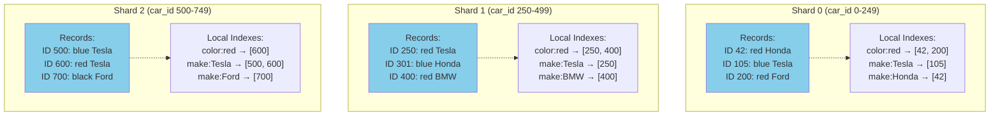

If your database supports only a key-value model, you might be tempted to implement a secondary index yourself by creating a mapping from values to IDs in application code. If you go down this route, you need to take great care to ensure that your indexes remain consistent with the underlying data. Race conditions and intermittent write failures (where some changes were saved but others weren't) can very easily cause the data to go out of sync.

When reading from a local secondary index, if you already know the partition key of the record you're looking for, you can just perform the search on the appropriate shard. Moreover, if you want only some results and don't need all of them, you can send the request to any shard. However, if you want all the results and don't know their partition key in advance, you will need to send the query to all shards and combine the results you get back, because the matching records might be scattered across all the shards.

**Reading with local indexes** (scatter/gather):

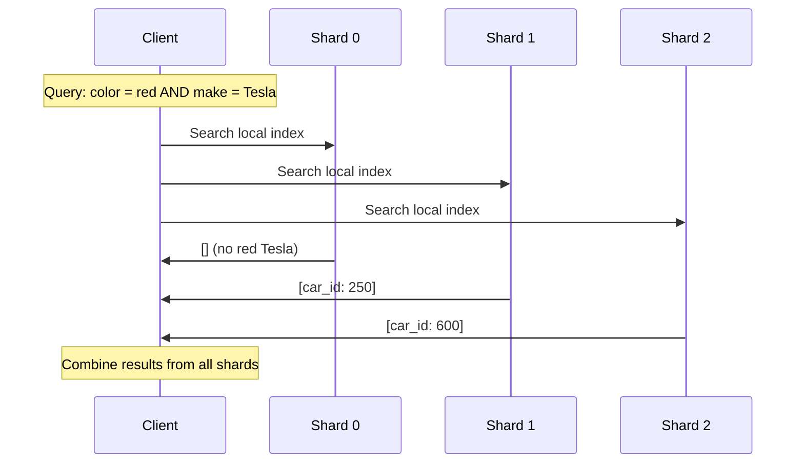

This approach to querying a sharded database can make read queries on secondary indexes quite expensive. Even if you query the shards in parallel, it is prone to **tail latency amplification** — if one shard is slow, the entire query waits. It also limits the scalability of your application: adding more shards lets you store more data, but it doesn't increase your query throughput if every shard has to process every query anyway.

```python
class Shard:
    """A single shard holding records and local secondary indexes."""
    def __init__(self, shard_id):
        self.shard_id = shard_id
        self.records = {}  # car_id -> {make, color, price}
        self.index_color = {}  # color -> [car_id, ...]
        self.index_make = {}  # make -> [car_id, ...]

    def insert(self, car_id, make, color, price):
        self.records[car_id] = {"make": make, "color": color, "price": price}
        self.index_color.setdefault(color, []).append(car_id)
        self.index_make.setdefault(make, []).append(car_id)

    def find_by_color(self, color):
        car_ids = self.index_color.get(color, [])
        return [(cid, self.records[cid]) for cid in car_ids]


class LocalIndexShardedDB:
    """Database with local secondary indexes (document-partitioned indexes).

    Writes touch only one shard (fast).
    Reads must query all shards and merge (slow, tail-latency sensitive).
    """
    def __init__(self, num_shards=4):
        self.shards = [Shard(i) for i in range(num_shards)]

    def _shard_for(self, car_id):
        return self.shards[car_id % len(self.shards)]

    def insert(self, car_id, make, color, price):
        # Write touches only ONE shard
        shard = self._shard_for(car_id)
        shard.insert(car_id, make, color, price)

    def query_by_color(self, color):
        # Read must query ALL shards (scatter/gather)
        results = []
        for shard in self.shards:
            results.extend(shard.find_by_color(color))
        return results

    def query_by_color_and_make(self, color, make):
        # Even worse: must combine indexes from all shards
        results = []
        for shard in self.shards:
            color_matches = set(shard.index_color.get(color, []))
            make_matches = set(shard.index_make.get(make, []))
            intersection = color_matches & make_matches
            for cid in intersection:
                results.append((cid, shard.records[cid]))
        return results


# Example usage
db = LocalIndexShardedDB(num_shards=4)

# Writes are fast
db.insert(42, "Honda", "red", 15000)
db.insert(105, "Tesla", "blue", 50000)
db.insert(250, "Tesla", "red", 55000)
db.insert(600, "Tesla", "red", 60000)

# Reads are scatter/gather
red_teslas = db.query_by_color_and_make("red", "Tesla")
print(f"Red Teslas: {red_teslas}")
# Output: Red Teslas: [(250, {...}), (600, {...})]
```

**Real-world examples**: MongoDB, Riak, Cassandra, Elasticsearch, SolrCloud, and VoltDB all use local secondary indexes.

### Global Secondary Indexes

Rather than each shard having its own local secondary index, we can construct a **global index** that covers data in all shards. However, we can't just store that index on one node, since it would likely become a bottleneck and defeat the purpose of sharding. A global index must also be sharded, but it can be sharded differently from the primary-key index.

```mermaid
graph TB
    subgraph "Data Shards (by car_id)"
        D0["Shard 0<br/>car_id 0-249"]
        D1["Shard 1<br/>car_id 250-499"]
        D2["Shard 2<br/>car_id 500-749"]
    end

    subgraph "Global Index Shards (by color)"
        I0["Index Shard 0<br/>colors a-r<br/>contains IDs from<br/>ALL data shards"]
        I1["Index Shard 1<br/>colors s-z<br/>contains IDs from<br/>ALL data shards"]
    end

    D0 -.->|"Indexed"| I0
    D0 -.->|"Indexed"| I1
    D1 -.->|"Indexed"| I0
    D1 -.->|"Indexed"| I1
    D2 -.->|"Indexed"| I0
    D2 -.->|"Indexed"| I1

    style D0 fill:#87CEEB
    style D1 fill:#87CEEB
    style D2 fill:#87CEEB
    style I0 fill:#ffcc99
    style I1 fill:#ffcc99
```

For example, the IDs of red cars from all shards appear under `color:red` in the index, but the index is sharded so that colors starting with the letters a to r appear in index shard 0 and colors starting with s to z appear in index shard 1. The index on the make of car is partitioned similarly (with the shard boundary being between f and h).

This kind of index is also called **term-partitioned**. Recall from "Full-Text Search" that in full-text search, a *term* is a keyword in a text that you can search for. Here we generalize it to mean any value that you can search for in the secondary index.

The global index uses the term as the partition key, so that when you're looking for a particular term or value, you can figure out which shard you need to query. Again, a shard can contain a contiguous range of terms, or you can assign terms to shards based on a hash of the term.

```mermaid
sequenceDiagram
    participant Client
    participant DSh as Data Shard
    participant ISh as Index Shard

    Note over Client: Query: color = red

    Client->>ISh: Lookup color:red
    ISh->>Client: [car_id: 42, 250, 400, 600]

    Note over Client: Only ONE index shard queried ✓

    Client->>DSh: Get car_id 42
    DSh->>Client: {Honda, red, 15000}

    Note over Client: Multiple data shards for full records
```

Global indexes have the advantage that a query with a single condition (such as `color = red`) needs to read from only a single shard to fetch the postings list. However, if you want to fetch records and not just IDs, you still have to read from all the shards that are responsible for those IDs.

If you have multiple search conditions or terms (e.g., searching for cars of a certain color and a certain make, or searching for multiple words occurring in the same text), those terms will likely be assigned to different shards. To compute the logical AND of the two conditions, the system needs to find all the IDs that occur in both of the postings lists. That's no problem if the postings lists are short, but if they are long, it can be slow to send them over the network to compute their intersection.

**Writing with global indexes** (multi-shard update):

```mermaid
sequenceDiagram
    participant Client
    participant DS as Data Shard 1
    participant IS0 as Index Shard 0 (Tesla)
    participant IS1 as Index Shard 1 (red)

    Client->>DS: Insert car_id=250, color=red, make=Tesla
    DS->>DS: Store record
    DS->>IS0: Update: make:Tesla → add 250
    DS->>IS1: Update: color:red → add 250
    DS->>Client: Success

    Note over Client,IS1: Write touched multiple shards ✗
```

### Synchronous vs. Asynchronous Index Updates

Another challenge with global secondary indexes is that **writes are more complicated** than with local indexes, because writing a single record might affect multiple shards of the index (every term in the document might be on a different shard). This makes it harder to keep the secondary index in sync with the underlying data. One option is to use a **distributed transaction** to atomically update the shards storing the primary record and its secondary indexes.

```python
import time
from collections import defaultdict
from threading import Lock


class TermPartitionedIndex:
    """A single shard of a global secondary index.

    Each shard owns a contiguous range of terms (e.g., colors a-r).
    """
    def __init__(self, shard_id, term_range):
        self.shard_id = shard_id
        self.term_range = term_range  # (start, end)
        self.postings = defaultdict(list)  # term -> [record_id, ...]
        self.lock = Lock()

    def _in_range(self, term):
        return self.term_range[0] <= term[0] <= self.term_range[1]

    def add(self, term, record_id):
        if not self._in_range(term):
            raise ValueError(f"Term {term} not in this shard's range")
        with self.lock:
            self.postings[term].append(record_id)

    def lookup(self, term):
        with self.lock:
            return list(self.postings.get(term, []))


class GlobalIndexShardedDB:
    """Database with term-partitioned (global) secondary indexes.

    Reads of a single index term touch only one index shard (fast).
    Writes must update multiple index shards (slow).
    Often updated asynchronously for performance.
    """
    def __init__(self, num_data_shards=4, num_index_shards=2):
        self.data_shards = [{} for _ in range(num_data_shards)]
        # Index shards split the alphabet: shard 0 = a-m, shard 1 = n-z
        self.index_shards = [
            TermPartitionedIndex(0, ('a', 'm')),
            TermPartitionedIndex(1, ('n', 'z')),
        ]

    def _data_shard_for(self, record_id):
        return hash(record_id) % len(self.data_shards)

    def _index_shard_for(self, term):
        # First letter determines shard
        first_letter = term[0].lower()
        if 'a' <= first_letter <= 'm':
            return self.index_shards[0]
        else:
            return self.index_shards[1]

    def insert(self, record_id, make, color, price):
        # 1. Write to data shard
        ds = self._data_shards_for_data(record_id)
        ds[record_id] = {"make": make, "color": color, "price": price}

        # 2. Update global index for color
        #    This might touch a different shard than the data
        color_idx_shard = self._index_shard_for(color)
        color_idx_shard.add(color, record_id)

        # 3. Update global index for make
        make_idx_shard = self._index_shard_for(make)
        make_idx_shard.add(make, record_id)

        # NOTE: A single write touched multiple shards.
        # If one of these updates fails, the index becomes inconsistent.

    def _data_shards_for_data(self, record_id):
        return self.data_shards[self._data_shard_for(record_id)]

    def query_by_color(self, color):
        # 1. Lookup in global index (one index shard)
        idx_shard = self._index_shard_for(color)
        record_ids = idx_shard.lookup(color)

        # 2. Fetch records (may span multiple data shards)
        results = []
        for rid in record_ids:
            ds = self._data_shards_for_data(rid)
            results.append((rid, ds[rid]))
        return results


# Example: write touches multiple shards
db = GlobalIndexShardedDB()

# Insert: writes to 1 data shard + 2 index shards = 3 shards total!
db.insert(250, "Tesla", "red", 55000)
# - Data shard 2 (250 % 4)
# - Index shard 1 (red starts with 'r')
# - Index shard 1 (Tesla starts with 't')

# Read by color: very fast, single index shard
red_cars = db.query_by_color("red")
print(f"Red cars: {red_cars}")
```

**Real-world examples**: Global secondary indexes are used by **CockroachDB**, **TiDB**, and **YugabyteDB**; **DynamoDB** supports both local and global secondary indexes. In the case of DynamoDB, writes are **asynchronously reflected** in global indexes, so reads from a global index may be stale (this is similar to the situation with replication lag). Nevertheless, global indexes are useful if read throughput is higher than write throughput, and if the postings lists are not too long.

### Comparison: Local vs. Global Indexes

| Aspect | Local Indexes | Global Indexes |
|--------|--------------|----------------|
| Write speed | Fast (single shard) | Slow (multiple shards) |
| Read speed | Slow (scatter/gather) | Fast (single index shard) |
| Consistency | Immediate | Often eventually consistent |
| Complexity | Simple | Complex |
| Tail latency | Affected by slowest shard | Predictable |
| Best for | Write-heavy workloads | Read-heavy workloads |
| Examples | MongoDB, Elasticsearch | DynamoDB GSI, CockroachDB |

---

## Summary

In this chapter we explored different ways of sharding a large dataset into smaller subsets. Sharding is necessary when you have so much data that storing and processing it on a single machine is no longer feasible.

The goal of sharding is to spread the data and query load evenly across multiple machines, avoiding hot spots (nodes with disproportionately high load). This requires choosing a sharding scheme that is appropriate to your data, and rebalancing the shards when nodes are added to or removed from the cluster.

### Key Sharding Approaches

We discussed two main approaches to sharding:

**Key range sharding.** Keys are sorted, and a shard owns all the keys from a minimum up to a maximum. Sorting has the advantage that efficient range queries are possible, but there is a risk of hot spots if the application often accesses keys that are close together in the sorted order. Shards are typically rebalanced by splitting the range into two subranges when a shard gets too big.

**Hash sharding.** A hash function is applied to each key, and a shard owns a range of hash values (or another consistent hashing algorithm may be used to map hashes to shards). This method destroys the ordering of keys, making range queries inefficient, but it may distribute load more evenly. When sharding by hash, it is common to create a fixed number of shards in advance, to assign several shards to each node, and to move entire shards from one node to another when nodes are added or removed. Splitting shards, as with key ranges, is also possible.

It's common to use the first part of the key as the partition key (i.e., to identify the shard) and to sort records within that shard by the rest of the key. That way, you can still have efficient range queries among the records with the same partition key.

### Request Routing

We also discussed techniques for routing queries to the appropriate shard, and we looked at how a coordination service is often used to keep track of the assignment of shards to nodes.

### Secondary Indexes

Finally, we considered the interaction between sharding and secondary indexes. A secondary index needs to be sharded too. There are two methods for this:

**Local secondary indexes.** The secondary indexes are stored in the same shard as the primary key and value. Only a single shard needs to be updated on write, but a lookup of the secondary index requires reading from all shards.

**Global secondary indexes.** The secondary indexes are sharded separately based on the indexed values. An entry in the secondary index may refer to records from all shards of the primary key. When a record is written, several secondary index shards may need to be updated; however, a read of the postings list can be served from a single shard (fetching the actual records still requires reading from multiple shards).

### Looking Ahead

By design, every shard operates mostly independently — that's what allows a sharded database to scale to multiple machines. However, operations that need to write to several shards can be problematic — for example, what happens if the write to one shard succeeds, but another fails? We will address that question in the following chapter on transactions.

Sharding is a powerful technique, but it adds complexity. The right strategy depends on your data size and growth rate, query patterns (point queries vs. range queries), consistency requirements, and operational complexity tolerance. When in doubt, start with a single-shard database (with replication for fault tolerance) and only add sharding when the data volume or write throughput genuinely demands it. As the book notes: "If your data volume and write throughput are such that a single machine can handle them (and a single machine can do a lot nowadays!), it's often better to avoid sharding and stick with a single-shard database."
