# Chapter 8: Transactions

## TL;DR

- **Transactions** group reads and writes into one logical unit that either fully commits or fully aborts — they collapse a large class of crash, network, and concurrency failures into a single safe retry.
- **ACID** (atomicity, consistency, isolation, durability) is a vocabulary, not a contract — databases implement each letter differently, and "isolation" in particular has five or more common meanings.
- **Weak isolation levels** (read committed, snapshot isolation) trade correctness for performance; only **serializable** isolation prevents all race conditions including lost updates, write skew, and phantoms.
- **Serializability** can be implemented by literal serial execution, **2PL** (pessimistic), or **SSI** (optimistic); modern SSI makes it affordable.
- **Distributed transactions** solve atomic commit across nodes via **2PC** (blocking, fragile under coordinator failure); prefer database-internal distributed transactions or idempotent message processing over heterogeneous XA.

---

## Introduction

In the real world, many things can go wrong when working with data:

- The database software or hardware may fail at any time (including in the middle of a write operation)
- The application may crash at any time (including in the middle of a series of operations)
- Network interruptions can unexpectedly cut off the application from the database, or one database node from another
- Several clients may write to the database at the same time, overwriting each other's changes
- A client may read data that doesn't make sense because it has only partially been updated
- Race conditions between clients can cause surprising bugs

For decades, **transactions** have been the mechanism of choice for simplifying these issues. A transaction is a way for an application to group several reads and writes together into a logical unit. Conceptually, all the reads and writes in a transaction are executed as one operation: either the entire transaction succeeds (**commit**) or it fails (**abort / rollback**). If it fails, the application can safely retry.

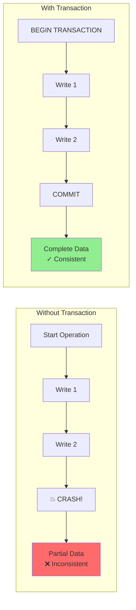

Almost all relational databases today, and some nonrelational databases, support transactions. Most of them follow the style that was introduced in 1975 by IBM System R, the first SQL database [2, 3, 4]. Although some implementation details have changed, the general idea has remained virtually the same for 50 years: the transaction support in MySQL, PostgreSQL, Oracle, SQL Server, etc. is uncannily similar to that of System R.

In the late 2000s, nonrelational (NoSQL) databases started gaining popularity. They aimed to improve upon the relational status quo by offering a choice of new data models (see Chapter 3) and by including replication and sharding (discussed in Chapters 6 and 7) by default. Transactions were the main casualty of this movement: many of this generation of databases abandoned transactions entirely, or redefined the word to describe a much weaker set of guarantees than had previously been understood.

The hype around NoSQL distributed databases led to a popular belief that transactions were fundamentally unscalable and that any large-scale system would have to abandon them in order to maintain good performance and high availability. More recently, that belief has turned out to be wrong. So-called "NewSQL" databases such as CockroachDB [5], TiDB [6], Spanner [Corbett et al., 2013], FoundationDB [8], and YugabyteDB have shown that transactional systems can scale to large data volumes and high throughput.

However, that doesn't mean that every system must be transactional either; as with every other technical design choice, transactions have advantages and limitations. The technical cause behind the Post Office Horizon scandal was probably a lack of ACID transactions in the underlying accounting system [1]. To understand those trade-offs, in this chapter we will explore the details of the guarantees that transactions can provide, both in normal operation and in various extreme (but realistic) circumstances.

Transactions were created with a purpose — to simplify the programming model for applications accessing a database. Using transactions allows the application to ignore certain potential error scenarios and concurrency issues, because the database takes care of them instead (we call these **safety guarantees**). Not every application needs transactions, and sometimes there are advantages to weakening transactional guarantees or abandoning them entirely (e.g., to achieve better performance or higher availability). Some safety properties can be achieved without transactions.

Many subtle but important details come into play when choosing a transaction model. To answer whether you need transactions, you first need to understand the exact safety guarantees that transactions can provide and the costs associated with them.

---

## The Meaning of ACID

The safety guarantees provided by transactions are often described by the well-known acronym **ACID**, which stands for **atomicity**, **consistency**, **isolation**, and **durability**. The term was coined in 1983 by Theo Härder and Andreas Reuter [Härder & Reuter, 1983], in an effort to establish precise terminology for fault-tolerance mechanisms in databases.

In practice, however, one database's implementation of ACID does not equal another's. For example, as we shall see, there is a lot of ambiguity around the meaning of isolation [10]. The high-level idea is sound, but the devil is in the details. Today, when a system claims to be "ACID compliant," it's unclear what guarantees you can actually expect. "ACID" has unfortunately become mostly a marketing term.

Systems that do not meet the ACID criteria are sometimes called **BASE**, which stands for basically available, soft state, and eventual consistency [Brewer, 2000]. This is even more vague than the definition of ACID. It seems that the only sensible definition of BASE is "not ACID" (i.e., it can mean almost anything you want).

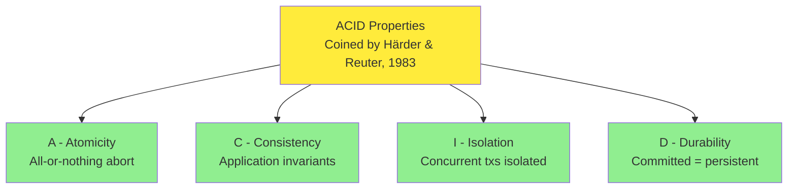

### 1. Atomicity

In general, **atomic** refers to something that cannot be broken into smaller parts. The word means similar but subtly different things in different branches of computing. For example, in multithreaded programming, if one thread executes an atomic operation, that means there is no way that another thread could see the half-finished result of the operation. The system can be only in the state it was before the operation or after the operation, not something in between.

By contrast, in the context of ACID, **atomicity is not about concurrency**. It does not describe what happens if several processes try to access the same data at the same time, because that is covered under the letter I, for isolation. Rather, ACID atomicity describes what happens if a client wants to make several writes, but a fault occurs after some of the writes have been processed — for example, a process crashes, a network connection is interrupted, a disk becomes full, or an integrity constraint is violated.

If the writes are grouped together into an atomic transaction, and the transaction cannot be completed (committed) because of a fault, then the transaction is aborted and the database must discard or undo any writes it has made so far in that transaction.

Without atomicity, if an error occurs partway through making multiple changes, it's difficult to know which changes have taken effect and which haven't. The application could try again, but that risks making some changes twice, leading to duplicate or incorrect data. Atomicity simplifies this problem: if a transaction was aborted, the application can be sure that it didn't change anything, so it can safely be retried.

The ability to abort a transaction on error and have all writes from that transaction discarded is the defining feature of ACID atomicity. Perhaps **abortability** would have been a better term than atomicity, but we will stick with atomicity since that's the usual word.

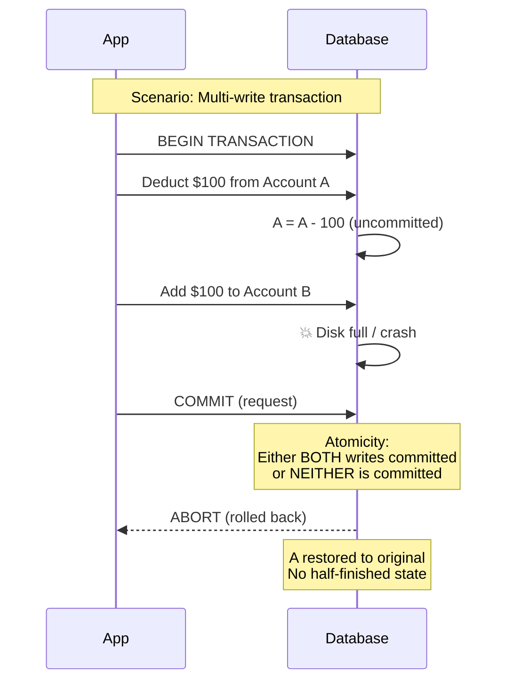

### 2. Consistency

The word **consistency** is terribly overloaded — it has at least five common meanings across this book: replica consistency and eventual consistency (Chapter 6), consistent snapshots for backups (this chapter), consistent hashing (Chapter 7), and CAP-theorem consistency meaning linearizability (Chapters 9 and 10). In the context of ACID, **consistency refers to an application-specific notion of the database being in a "good state."**

The idea of ACID consistency is that you have certain statements about your data (**invariants**) that must always be true — for example, in an accounting system, credits and debits across all accounts must always be balanced. If a transaction starts with a database that is valid according to these invariants, and any writes during the transaction preserve the validity, then you can be sure that the invariants are always satisfied. (An invariant may be temporarily violated during transaction execution, but it should be satisfied again at transaction commit.)

If you want the database to enforce your invariants, you need to declare them as **constraints** as part of the schema. For example, foreign-key constraints, uniqueness constraints, and check constraints (which restrict the values that can appear in an individual row) are often used to model specific types of invariants. More complex consistency requirements can sometimes be modeled using triggers or materialized views [12].

However, complex invariants can be difficult or impossible to model using the constraints that databases usually provide. In that case, it's the application's responsibility to define its transactions correctly so that they preserve consistency. If you write bad data that violates your invariants, but you haven't declared those invariants, the database can't stop you. As such, the C in ACID often depends on how the application uses the database and is not a property of the database alone.

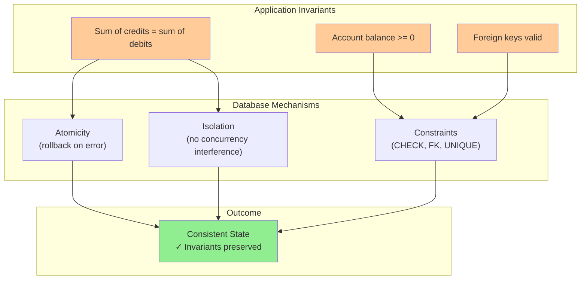

### 3. Isolation

Most databases are accessed by several clients at the same time. That's no problem if they are reading and writing different parts of the database, but if they are accessing the same database records, you can run into concurrency problems (race conditions).

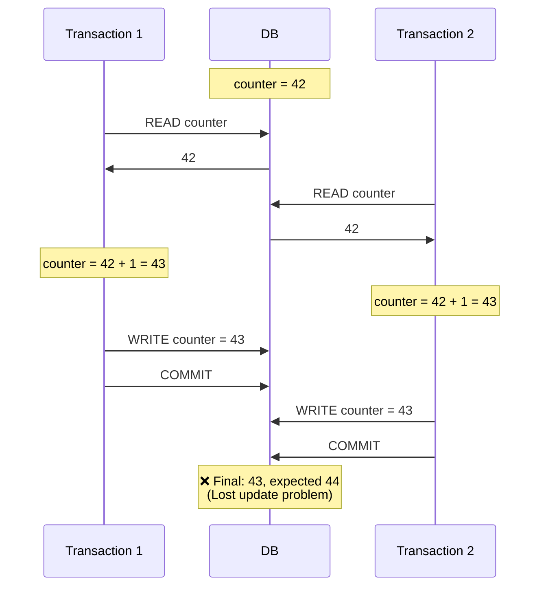

**Isolation** in the sense of ACID means that concurrently executing transactions are isolated from each other; they cannot step on each other's toes. The classic database textbooks formalize isolation as **serializability**, which means that each transaction can pretend that it is the only transaction running on the entire database. The database ensures that when the transactions have committed, the result is the same as if they had run serially (one after another), even though in reality they may have run concurrently [13].

However, serializability has a performance cost. In practice, many databases use forms of isolation that are weaker than serializability — that is, they allow concurrent transactions to interfere with each other in limited ways. Some popular databases, such as Oracle, don't even implement it (Oracle has an isolation level called "serializable," but it actually implements snapshot isolation, which is a weaker guarantee than serializability [10, 14]).

### 4. Durability

The purpose of a database system is to provide a safe place where data can be stored without fear of losing it. **Durability** is the promise that after a transaction has committed successfully, any data it has written will not be forgotten, even if there is a hardware fault or the database crashes.

In a single-node database, durability typically means that the data has been written to nonvolatile storage such as a hard drive or SSD. Regular file writes are usually buffered in memory before being sent to the disk sometime later, which means they may be lost if there is a sudden power failure; many databases therefore use the `fsync` system call to ensure that the data really has been written to disk. Databases usually also have a write-ahead log (WAL) or similar feature, which allows them to recover in the event that a crash occurs partway through a write. Many databases (such as MySQL, MongoDB, and PostgreSQL) store their data with a checksum, which allows them to detect corrupted or incomplete log entries and thus helps restore the database to a consistent snapshot after a crash.

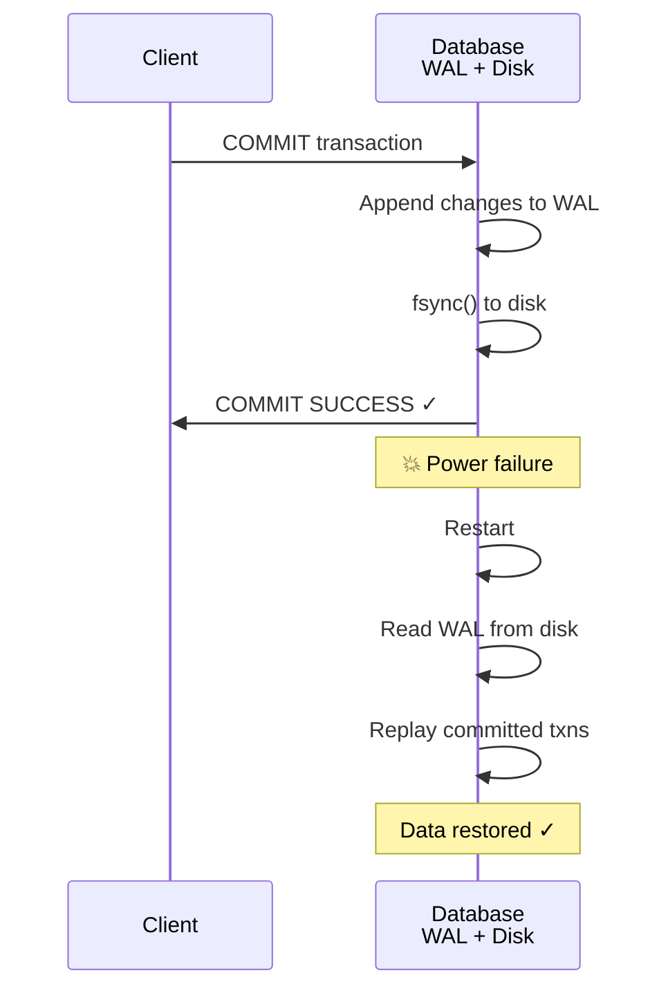

In a replicated database, durability may mean that the data has been successfully copied to a certain number of nodes. To provide a durability guarantee, a database must wait until these writes or replications are complete before reporting a transaction as successfully committed.

**Replication and Durability**

Historically, durability meant writing to an archive tape. Then it was understood as writing to a disk or SSD. More recently, it has been adapted to mean replication. The truth is, nothing is perfect:

- If you write to disk and the machine dies, even though your data isn't lost, it is inaccessible until you either fix the machine or transfer the disk to another machine. Replicated systems can remain available.
- A correlated fault — say, a power outage, or a bug that crashes every node on a particular input — can knock out all replicas at once, causing any data that is only in memory to be lost.
- In an asynchronously replicated system, recent writes may be lost when the leader becomes unavailable.
- When the power is suddenly cut, SSDs in particular have been shown to sometimes violate the guarantees they are supposed to provide; even `fsync` isn't guaranteed to work correctly [15]. Disk firmware can have bugs — just like any other kind of software [16, 17, 18].
- Even PostgreSQL used `fsync` incorrectly for over 20 years [19, 20, 21].
- Subtle interactions between the storage engine and the filesystem implementation can lead to bugs that are hard to track down and may cause files on disk to be corrupted after a crash [22, 23]. Filesystem errors on one replica can sometimes spread to other replicas as well [24].
- Data on disk can gradually become corrupted without this being detected [25, 26]. If data has been corrupted for some time, replicas and recent backups may also be corrupted.
- One study of SSDs found that **30% to 80% of drives develop at least one bad block during the first four years of operation**, and only some of these can be corrected by the firmware [27].
- When a worn-out SSD is disconnected from power, it can start losing data within a timescale of weeks to months, depending on the temperature [28].

In practice, no one technique can provide absolute guarantees. There are only various risk-reduction techniques — including writing to disk, replicating to remote machines, and backups — and they can and should be used together.

```python
# Demonstrate durability trade-offs in a simplified transaction log
import os
import time

class TransactionLog:
    """Models a write-ahead log with varying durability guarantees."""

    def __init__(self, fsync_each_write=True):
        self.log = []
        self.fsync_each_write = fsync_each_write

    def append(self, transaction_id, data):
        """Append a record; fsync ensures it reaches disk."""
        record = {"txn_id": transaction_id, "data": data, "ts": time.time()}
        self.log.append(record)
        if self.fsync_each_write:
            # Simulated fsync: wait for disk write
            time.sleep(0.001)
        return record

    def committed(self, transaction_id):
        """Has this transaction's commit record been durably stored?"""
        return any(
            r["txn_id"] == transaction_id
            for r in self.log
        )


# Strong durability: wait for every fsync (slow but safe)
strong_log = TransactionLog(fsync_each_write=True)
start = time.time()
for i in range(100):
    strong_log.append(f"txn_{i}", f"data_{i}")
print(f"Strong durability: {(time.time() - start):.2f}s")

# Weak durability: rely on OS flush (fast but lossy on power failure)
weak_log = TransactionLog(fsync_each_write=False)
start = time.time()
for i in range(100):
    weak_log.append(f"txn_{i}", f"data_{i}")
print(f"Weak durability:   {(time.time() - start):.2f}s")
```

---

## Single-Object and Multi-Object Operations

These definitions assume that you want to modify several objects (rows, documents, records) at once. Such **multi-object transactions** are often needed if several pieces of data need to be kept in sync.

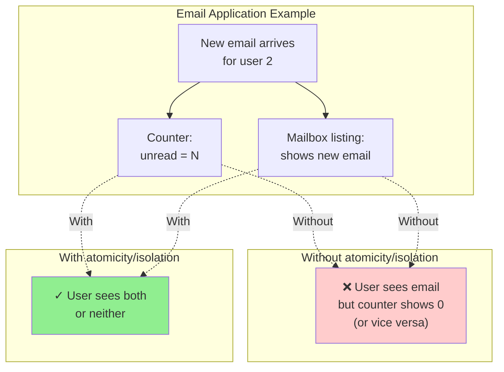

For example, in an email application, to display the number of unread messages for a user, you could query something like `SELECT COUNT(*) FROM emails WHERE recipient_id = 2 AND unread_flag = true`. However, this query might be too slow if there are many emails, so you'd store the number of unread messages in a separate field (denormalization). Now, whenever a new message comes in, you have to increment the unread counter, and whenever a message is marked as read, you also have to decrement the unread counter. Without isolation, user 2 experiences an anomaly: the mailbox listing shows an unread message, but the counter shows zero unread messages.

Isolation would have prevented this issue by ensuring that user 2 sees either both the inserted email and the updated counter, or neither, but not an inconsistent halfway point. Atomicity would also ensure that if the update to the counter fails, the transaction is aborted and the email insertion is rolled back.

Multi-object transactions require some way of determining which read and write operations belong to the same transaction. In relational databases, that is typically done based on the client's TCP connection to the database server. On any particular connection, everything between a `BEGIN TRANSACTION` and a `COMMIT` statement is considered to be part of the same transaction. If the TCP connection is interrupted, the transaction must be aborted.

On the other hand, many nonrelational databases don't have such a way of grouping operations together. Even if there is a multi-object API (e.g., a key-value store may have a multi-put operation that updates several keys in one operation), that doesn't necessarily mean it has transaction semantics: the command may succeed for some keys and fail for others, leaving the database in a partially updated state.

### Single-Object Writes

Atomicity and isolation also apply when a single object is being changed. For example, imagine you are writing a 20 kB JSON document to a database:

- If the network connection is interrupted after the first 10 kB have been sent, does the database store that unparseable 10 kB fragment of JSON?
- If the power fails while the database is in the middle of overwriting the previous value on disk, do you end up with the old and new values spliced together?
- If another client reads that document while the write is in progress, will it see a partially updated value?

Each of those outcomes would be incredibly confusing, so storage engines almost universally aim to provide atomicity and isolation on the level of a single object (such as a key-value pair) on one node. Atomicity can be implemented using a log for crash recovery, and isolation can be implemented using a lock on each object (allowing only one thread to access an object at any one time).

Some databases also provide more complex atomic operations, such as an increment operation, which removes the need for a read-modify-write cycle. Similarly popular is a **conditional write operation**, which allows a write to happen only if the value has not been concurrently changed by someone else — similar to a compare-and-set (CAS) operation in shared-memory concurrency.

> Strictly speaking, the term "atomic increment" uses the word atomic in the sense of multithreaded programming. In the context of ACID, it should be called an isolated or serializable increment, but that's not the usual term.

These single-object operations are useful, as they can prevent lost updates when several clients try to write to the same object concurrently. However, they are not transactions in the usual sense of the word. For example, Aerospike's "strong consistency" mode and "lightweight transactions" feature of Cassandra and ScyllaDB offer linearizable reads and conditional writes on a single object, but no guarantees across multiple objects.

### The Need for Multi-Object Transactions

Do we need multi-object transactions at all? Would it be possible to implement any application with only a key-value data model and single-object operations?

In some use cases, single-object inserts, updates, and deletes are sufficient. However, in many other cases, writes to several objects need to be coordinated:

- **Relational data model**: A row in one table often has a foreign-key reference to a row in another table. Similarly, in a graph-like data model, a vertex has edges to other vertices. Multi-object transactions allow you to ensure that these references remain valid.
- **Document data model**: The fields that need to be updated together are often within the same document, which is treated as a single object. However, document databases lacking join functionality also encourage denormalization. When denormalized information needs to be updated, you need to update several documents in one go.
- **Secondary indexes**: In databases with secondary indexes (almost everything except pure key-value stores), the indexes also need to be updated every time you change a value. These indexes are different database objects from a transaction point of view — for example, without transaction isolation, it's possible for a record to appear in one index but not another.

Such applications can still be implemented without transactions. However, error handling becomes much more complicated without atomicity, and the lack of isolation can cause concurrency problems.

### Handling Errors and Aborts

A key feature of a transaction is that it can be aborted and safely retried if an error occurs. ACID databases are based on this philosophy: if the database is in danger of violating its guarantee of atomicity, isolation, or durability, it would rather abandon the transaction entirely than allow it to remain half-finished.

Not all systems follow that philosophy, though. In particular, datastores with leaderless replication work on more of a "best effort" basis, which can be summarized as "the database will do as much as it can, and if it runs into an error, it won't undo something it has already done" — so it's the application's responsibility to recover from errors.

Errors will inevitably happen, but many software developers prefer to think only about the happy path rather than the intricacies of error handling. For example, popular object-relational mapping (ORM) frameworks such as Rails ActiveRecord and Django don't retry aborted transactions — the error usually results in an exception bubbling up the stack, so any user input is thrown away, and the user gets an error message. This is a shame, because the whole point of rolling back transactions is to enable safe retries.

```python
# A reusable retry helper that handles transient transaction errors
import time
import random

class TransientTransactionError(Exception):
    """Retry-able transaction failure (deadlock, conflict, etc.)."""

class PermanentTransactionError(Exception):
    """Retry won't help (constraint violation, etc.)."""

class UnknownTransactionOutcome(Exception):
    """We don't know if the transaction committed."""

def run_in_transaction(fn, max_retries=3, base_delay=0.01):
    """Execute fn() inside a transaction with retry-on-transient-error logic."""
    attempt = 0
    while True:
        attempt += 1
        try:
            return fn()  # Internally BEGIN; ...; COMMIT
        except TransientTransactionError:
            if attempt > max_retries:
                raise
            # Exponential backoff with jitter
            delay = base_delay * (2 ** (attempt - 1))
            delay += random.uniform(0, delay * 0.5)
            time.sleep(delay)
        except UnknownTransactionOutcome:
            # Cannot safely retry without idempotence guarantees
            raise
        # PermanentTransactionError is NOT caught — propagate immediately
```

Although retrying an aborted transaction is a simple and effective error-handling mechanism, it isn't perfect:

1. If the transaction actually succeeded, but the network was interrupted while the server tried to acknowledge the successful commit to the client (so it timed out from the client's point of view), then retrying the transaction causes it to be performed twice unless you have an additional application-level deduplication mechanism in place.
2. If the error is due to overload or high contention between concurrent transactions, retrying the transaction will make the problem worse, not better. To avoid such feedback cycles, you can limit the number of retries, use exponential backoff, and handle overload-related errors differently from other errors.
3. It is worth retrying only after transient errors (e.g., due to deadlock, isolation violation, temporary network interruptions, or failover). After a permanent error (e.g., constraint violation), a retry would be pointless.
4. If the transaction also has side effects outside of the database, those side effects may happen even if the transaction is aborted. For example, if you're sending an email, you wouldn't want to send the email again every time you retry the transaction.
5. If the client process crashes while retrying, any data it was trying to write to the database is lost.

---

## Weak Isolation Levels

If two transactions don't access the same data, or if both are read-only, they can safely be run in parallel, because neither depends on the other. Concurrency issues (race conditions) come into play only when one transaction reads data that is concurrently modified by another transaction, or when the two transactions try to modify the same data.

Concurrency bugs are hard to find by testing, because such bugs are triggered only when you get unlucky with the timing. Such timing issues might occur rarely and are usually difficult to reproduce. Concurrency is also difficult to reason about, especially in a large application where you don't necessarily know which other pieces of code are accessing the database.

For that reason, databases have long tried to hide concurrency issues from application developers by providing transaction isolation. In theory, isolation should make your life easier by letting you pretend that no concurrency is happening; serializable isolation means that the database guarantees that transactions have the same effect as if they ran serially.

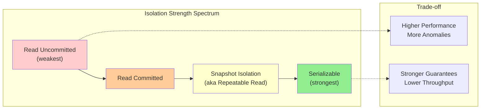

In practice, isolation is unfortunately not that simple. Serializable isolation has a performance cost, and many databases don't want to pay that price [10]. Therefore, systems commonly use weaker levels of isolation, which protect against some concurrency issues but not all. Those levels of isolation are much harder to understand and can lead to subtle bugs, but they are nevertheless used in practice [30].

Concurrency bugs caused by weak transaction isolation and race conditions are not just a theoretical problem. They have caused substantial loss of money, including bankrupting a Bitcoin exchange [31, 32, 33, 34], led to investigation by financial auditors [35], and caused customer data to be corrupted [36]. A popular comment on revelations of such problems is "Use an ACID database if you're handling financial data!" — but that misses the point. Even many popular relational database systems (which are usually considered ACID) use weak isolation, so they wouldn't necessarily have prevented these bugs from occurring.

Those examples also highlight an important point: even if concurrency issues are rare in normal operation, you have to consider the possibility that an attacker might deliberately send a burst of highly concurrent requests to your API in an attempt to exploit concurrency bugs [32]. Therefore, to build applications that are reliable and secure, you have to ensure that such bugs are systematically prevented.

In this section we will look at several weak (nonserializable) isolation levels that are used in practice and discuss in detail the kinds of race conditions that can and cannot occur with each one, so you can decide what level is appropriate to your application. Once we've done that, we will discuss serializability in detail. Our discussion of isolation levels will be informal, using examples.

### Read Committed

The most basic level of transaction isolation is **read committed**, and it makes two guarantees:

1. When reading from the database, you will see only data that has been committed (**no dirty reads**).
2. When writing to the database, you will overwrite only data that has been committed (**no dirty writes**).

#### No Dirty Reads

Imagine a transaction has written some data to the database, but the transaction has not yet committed or aborted. Can another transaction see that uncommitted data? If so, that's called a **dirty read** [3]. Read committed means any writes by a transaction become visible to others only when that transaction commits.

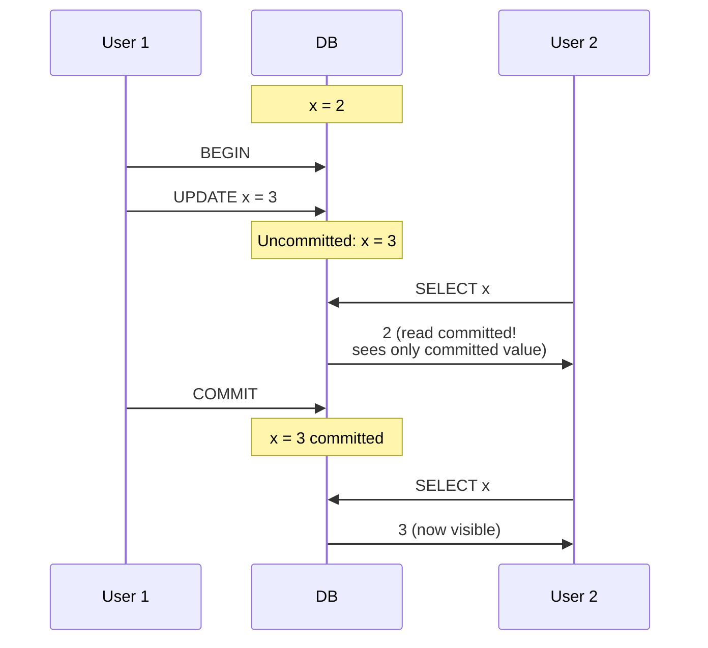

Two reasons preventing dirty reads is useful:

- A dirty read means another transaction may see some updates but not others, exposing a partially updated state that is confusing and may drive incorrect decisions.
- If a transaction aborts, any reads of its uncommitted data would also need to be aborted — a **cascading abort**.

#### No Dirty Writes

If two transactions concurrently try to update the same row, the later write normally overwrites the earlier one. But if the earlier write is part of a transaction that has not yet committed, this is a **dirty write** [Berenson et al., 1995]. Read committed prevents dirty writes, usually by delaying the second write until the first transaction has committed or aborted.

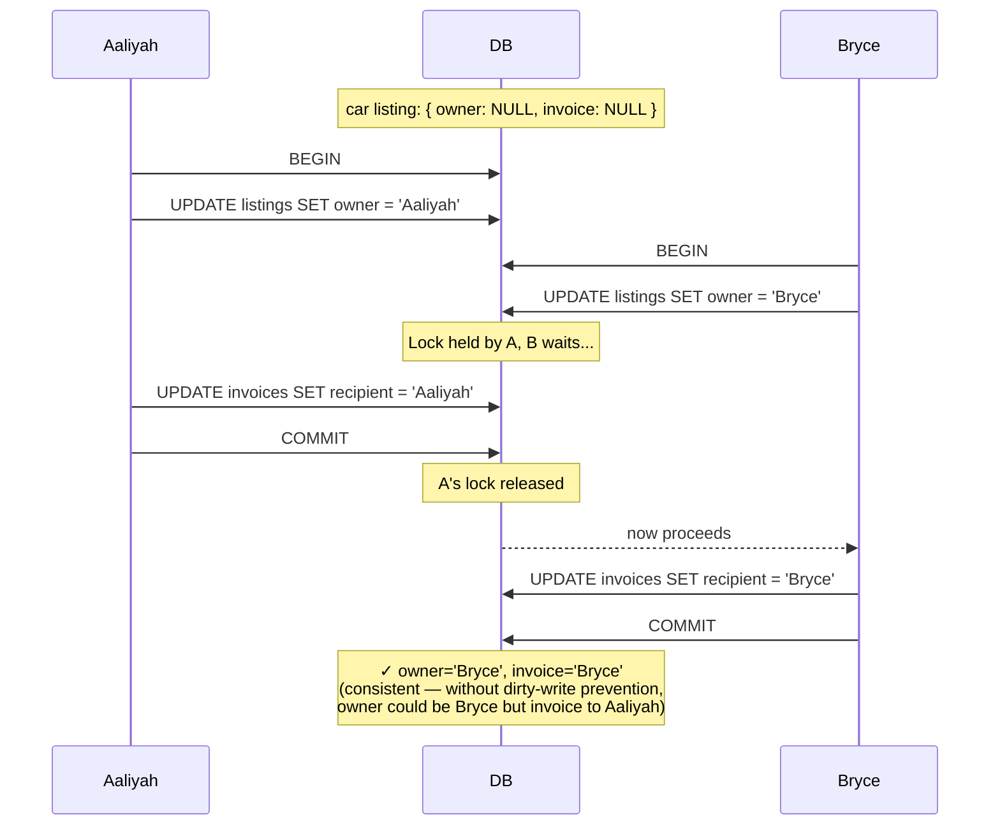

By preventing dirty writes, read committed avoids some bad outcomes — for example, a car sale being awarded to Bryce (winning update to the listings table) while the invoice goes to Aaliyah (winning update to the invoices table). Note: read committed does **not** prevent the lost-update problem, which is a race between committed writes, not a dirty write.

#### Implementing Read Committed

Read-committed is a very popular isolation level. It is the default setting in Oracle Database, PostgreSQL, SQL Server, and many other databases [10].

Most commonly, databases prevent dirty writes by using **row-level locks**. When a transaction wants to modify a particular row (or document or some other object), it must first acquire a lock on that row. It must then hold that lock until the transaction is committed or aborted. Only one transaction can hold the lock for any given row; if another transaction wants to write to the same row, it must wait until the first transaction is committed or aborted before it can acquire the lock and continue.

How do we prevent dirty reads? One option would be to use the same lock and to require any transaction that wants to read a row to briefly acquire the lock and then release it again immediately after reading. However, the approach of requiring read locks does not work well in practice, because one long-running write transaction can force many other transactions to wait until the long-running transaction has completed.

A more commonly used approach is the one illustrated earlier: for every row that is written, the database remembers both the old committed value and the new value set by the transaction that currently holds the write lock. While the transaction is ongoing, any other transactions that read the row are simply given the old value. Only when the new value is committed do transactions switch over to reading the new value.

Some databases support an even weaker isolation level called **read uncommitted**. It prevents dirty writes but does not prevent dirty reads.

```python
# A simplified read-committed isolation model
import threading

class ReadCommittedDB:
    """Demonstrates no-dirty-read / no-dirty-write semantics."""

    def __init__(self):
        self._committed = {}        # key -> committed value
        self._pending = {}          # txn_id -> {key: new_value}
        self._write_locks = {}      # key -> txn_id holding lock
        self._lock_cond = threading.Condition()

    def begin(self):
        return f"txn-{threading.get_ident()}-{id(self)}"

    def read(self, txn_id, key):
        # Read-committed: see only committed values, never pending ones
        return self._committed.get(key)

    def write(self, txn_id, key, value):
        with self._lock_cond:
            while self._write_locks.get(key) not in (None, txn_id):
                self._lock_cond.wait()
            self._write_locks[key] = txn_id
        self._pending.setdefault(txn_id, {})[key] = value

    def commit(self, txn_id):
        with self._lock_cond:
            for key, value in self._pending.pop(txn_id, {}).items():
                self._committed[key] = value
                if self._write_locks.get(key) == txn_id:
                    del self._write_locks[key]
            self._lock_cond.notify_all()

    def rollback(self, txn_id):
        with self._lock_cond:
            for key in self._pending.pop(txn_id, {}):
                if self._write_locks.get(key) == txn_id:
                    del self._write_locks[key]
            self._lock_cond.notify_all()
```

### Snapshot Isolation and Repeatable Read

If you look superficially at read-committed isolation, you could be forgiven for thinking that it does everything that a transaction needs to do. However, there are still plenty of ways to have concurrency bugs when using this isolation level.

**Read skew** is an example of a **non-repeatable read**: a client sees different parts of the database at different points in time.

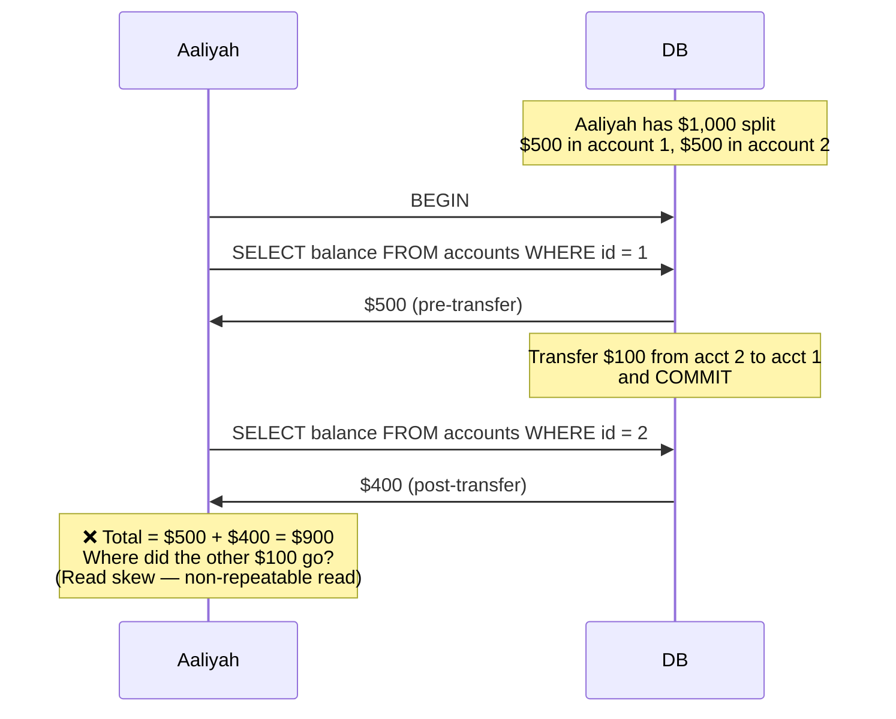

In Aaliyah's case, this is not a lasting problem, because she will most likely see consistent account balances if she reloads the online banking website a few seconds later. However, such temporary inconsistency is not tolerable in the following scenarios:

- **Backups** — Taking a backup requires making a copy of the entire database, which may take hours for a large database. During the time that the backup process is running, writes will continue to be made to the database. Thus, you could end up with some parts of the backup containing an older version of the data and other parts containing a newer version.
- **Analytical queries and integrity checks** — Sometimes you may want to run a query that scans over large parts of the database. Such queries are common in analytics, or they may be part of a periodic integrity check. These queries are likely to return nonsensical results if they observe parts of the database at different points in time.

**Snapshot isolation** [Berenson et al., 1995] is the most common solution to this problem. Each transaction reads from a consistent snapshot of the database — that is, it sees all the data that was committed in the database at the start of that transaction. Even if the data is subsequently changed by another transaction, each transaction sees only the old data from that particular point in time.

Snapshot isolation is a boon for long-running, read-only queries such as backups and analytics. Snapshot isolation is a popular feature: variants of it are supported by PostgreSQL, MySQL with the InnoDB storage engine, Oracle, SQL Server, and others, although the detailed behavior varies from one system to the next [30, 42, 43]. Some databases, such as Oracle, TiDB, and Aurora DSQL, even choose snapshot isolation as their highest isolation level.

#### Multiversion Concurrency Control (MVCC)

As with read-committed isolation, implementations of snapshot isolation typically use write locks to prevent dirty writes, which means that a transaction that makes a write can block the progress of another transaction that writes to the same row. However, **reads do not require any locks**. From a performance point of view, a key principle of snapshot isolation is **readers never block writers, and writers never block readers**.

To implement snapshot isolation, databases use a generalization of the mechanism we saw for preventing dirty reads. Instead of two versions of each row (the committed version and the overwritten-but-not-yet-committed version), the database must potentially keep several committed versions of a row, because various in-progress transactions may need to see the state of the database at different points in time. Because it maintains several versions of a row side by side, this technique is known as **multiversion concurrency control (MVCC)**.

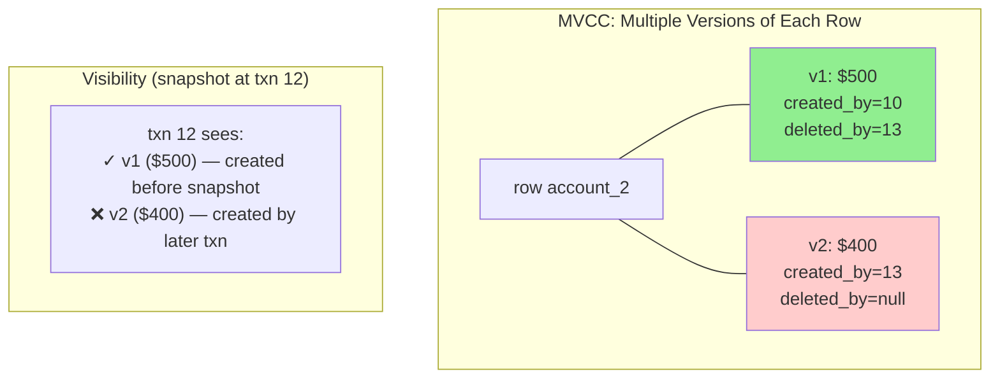

The figure illustrates how MVCC-based snapshot isolation is implemented in PostgreSQL [42, 44, 45] (other implementations are similar). When a transaction is started, it is given a unique, always-increasing transaction ID (txid). Whenever a transaction writes anything to the database, the data it writes is tagged with the transaction ID of the writer. (Transaction IDs in PostgreSQL are 32-bit integers, so they overflow after approximately 4 billion transactions. The vacuum process performs cleanup to ensure that overflow does not affect the data.)

Each row in a table has an `inserted_by` field, containing the ID of the transaction that inserted that row into the table. Each row also has a `deleted_by` field, which is initially empty. If a transaction deletes a row, the row isn't removed from the database but instead is marked for deletion by setting the `deleted_by` field to the ID of the transaction that requested the deletion. At a later time, when it is certain that no transaction can any longer access the deleted or overwritten data, a garbage collection (GC) process in the database removes any rows marked for deletion and frees their space.

An update is internally translated into a delete and an insert [46]. For example, transaction 13 deducts $100 from account 2, changing the balance from $500 to $400. The accounts table now contains two rows for account 2: a row with a balance of $500 that was marked as deleted by transaction 13, and a row with a balance of $400 that was inserted by transaction 13.

```python
# Simplified MVCC implementation with visibility rules
class MVCCDatabase:
    def __init__(self):
        # Each row: (value, created_by_txn, deleted_by_txn_or_None)
        self.rows = {}                # key -> list of versions (newest first)
        self.committed = set()        # set of committed transaction IDs
        self.active_txns = set()      # currently in-progress transaction IDs
        self.next_txn = 1

    def begin(self):
        txn_id = self.next_txn
        self.next_txn += 1
        self.active_txns.add(txn_id)
        return txn_id

    def _visible(self, version, reader_txn):
        """Visibility rule: a row is visible iff:
           1. Its creator had committed before reader's snapshot, AND
           2. It is not marked deleted by a committed txn before reader's snapshot."""
        created_by, deleted_by = version[1], version[2]
        # Creator must be committed and must not be in-progress at our snapshot
        if created_by not in self.committed:
            return False
        # Deleted by someone in-progress at our snapshot? treat as still visible
        if deleted_by is not None and deleted_by in self.active_txns:
            return True
        if deleted_by is not None and deleted_by < reader_txn:
            return deleted_by in self.committed  # visible only if deleter aborted
        return True

    def read(self, txn_id, key):
        if key not in self.rows:
            return None
        for version in self.rows[key]:
            if self._visible(version, txn_id):
                return version[0]
        return None

    def write(self, txn_id, key, value):
        # Internally a delete-then-insert for an updated row
        if key in self.rows:
            for version in self.rows[key]:
                if version[2] is None and version[1] in self.committed | {txn_id}:
                    version = (version[0], version[1], txn_id)
                    break
        self.rows.setdefault(key, []).insert(0, (value, txn_id, None))

    def commit(self, txn_id):
        self.committed.add(txn_id)
        self.active_txns.discard(txn_id)

    def abort(self, txn_id):
        # Discard any versions we created; mark them deleted by self
        for versions in self.rows.values():
            for i, version in enumerate(versions):
                if version[1] == txn_id and version[2] is None:
                    versions[i] = (version[0], txn_id, txn_id)
                    break
        self.active_txns.discard(txn_id)


# Demo: read skew avoidance with snapshot isolation
db = MVCCDatabase()
db.write(db.begin(), "acct_1", 500)  # placeholder
# Simulate prior committed state
db.committed.add(0)
db.rows["acct_1"] = [(500, 0, None)]
db.rows["acct_2"] = [(500, 0, None)]

t12 = db.begin()                       # Aaliyah's read transaction
t13 = db.begin()                       # Transfer transaction

# Transfer: deduct $100 from acct_2
db.write(t13, "acct_2", 400)
db.commit(t13)

# Aaliyah sees her snapshot taken before the transfer committed
print(f"acct_1 = {db.read(t12, 'acct_1')}")   # 500 (her snapshot)
print(f"acct_2 = {db.read(t12, 'acct_2')}")   # 500 (her snapshot — no skew!)
db.commit(t12)
```

#### Visibility Rules for a Consistent Snapshot

When a transaction reads from the database, transaction IDs are used to decide which row versions it can see and which are invisible. By carefully defining visibility rules, the database can present a consistent snapshot of its contents to the application [45]:

- A row is visible to a reader's transaction if both of the following are true: at the time when the reader's transaction started, the transaction that inserted the row had already committed; and the row is not marked for deletion, or it was marked for deletion by a transaction that had not yet committed at the time when the reader's transaction started.
- Practically, at the start of each transaction the database records the in-progress transactions; writes by those transactions (and any later transactions) are ignored, regardless of whether they subsequently commit. Writes by aborted transactions are also ignored (so we don't need to immediately remove aborted writes from storage — the visibility rule filters them out).
- All other writes are visible.

#### Indexes and Snapshot Isolation

How do indexes work in a multiversion database? The most common approach is that each index entry points at one of the versions of a row that matches the entry (either the oldest or the newest version). Each row version may contain a reference to the next-oldest or next-newest version. A query that uses the index must then iterate over the rows to find one that is visible and where the value matches what the query is looking for.

Another approach is used in CouchDB, Datomic, and LMDB. Although they also use B-trees, they use an immutable (copy-on-write) variant that does not overwrite pages of the tree when they are updated but instead creates a new copy of each modified page. With immutable B-trees, every write transaction (or batch of transactions) creates a new B-tree root, and a particular root is a consistent snapshot of the database at the point in time when it was created.

#### Snapshot Isolation, Repeatable Read, and Naming Confusion

MVCC is a commonly used implementation technique for databases, and often it is used to implement snapshot isolation. However, different databases sometimes use different terms to refer to the same thing — for example, **snapshot isolation is called "repeatable read" in PostgreSQL and "serializable" in Oracle** [30]. Sometimes different systems use the same term but with a different meaning — for example, while in PostgreSQL "repeatable read" means snapshot isolation, in MySQL it means an implementation of MVCC with weaker consistency than snapshot isolation [43], and IBM Db2 uses "repeatable read" to refer to serializability [10].

The reason for this naming confusion is that the SQL standard doesn't have the concept of snapshot isolation, because the standard is based on System R's 1975 definition of isolation levels [3] and snapshot isolation hadn't yet been invented then. Unfortunately, the SQL standard's definition of isolation levels is flawed — it is ambiguous, imprecise, and not as implementation-independent as a standard should be [Berenson et al., 1995].

### Preventing Lost Updates

Our discussion of the read-committed and snapshot isolation levels has primarily focused on guarantees about what a read-only transaction can see in the presence of concurrent writes. We have mostly ignored the issue of two transactions writing concurrently — we have discussed only dirty writes, one particular type of write-write conflict that can occur.

Several other interesting kinds of conflicts can occur between concurrently writing transactions. The best known of these is the **lost update** problem. The lost update problem can occur if an application reads a value from the database, modifies it, and writes back the modified value (the read-modify-write cycle mentioned earlier). If two transactions do this concurrently, one of the modifications can be lost.

This pattern occurs in various scenarios, such as:

- Incrementing a counter or updating an account balance
- Making a local change to a complex value — for example, adding an element to a list within a JSON document
- Two users editing a wiki page at the same time

Because this is such a common problem, a variety of solutions have been developed [50].

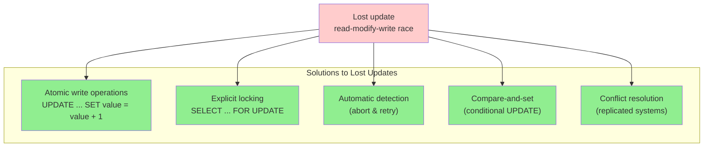

#### Atomic Write Operations

Many databases provide atomic update operations, which remove the need to implement read-modify-write cycles in application code. They are usually the best solution if your code can be expressed in terms of those operations.

```sql
-- Safe: atomic increment in SQL
UPDATE counters SET value = value + 1 WHERE key = 'foo';
```

```python
# MongoDB-style atomic operations for document mutations
from datetime import datetime

class DocumentStore:
    """Simplified document store with atomic update operators."""

    def __init__(self):
        self.docs = {}                    # id -> document
        self.lock = threading.Lock()

    def atomic_update(self, doc_id, operations):
        """Apply update operators atomically. Example operations:
           {"$inc": {"count": 1}}
           {"$set": {"status": "shipped"}}
           {"$push": {"tags": "important"}}"""
        with self.lock:
            doc = self.docs.setdefault(doc_id, {})
            for op, fields in operations.items():
                if op == "$inc":
                    for k, delta in fields.items():
                        doc[k] = doc.get(k, 0) + delta
                elif op == "$set":
                    doc.update(fields)
                elif op == "$push":
                    for k, value in fields.items():
                        doc.setdefault(k, []).append(value)
                elif op == "$unset":
                    for k in fields:
                        doc.pop(k, None)
            return doc

# Usage — no read-modify-write cycle required
store = DocumentStore()
for _ in range(1000):
    store.atomic_update("page_views", {"$inc": {"count": 1}})
# Result: count == 1000 (no lost updates)
```

Atomic operations are usually implemented by exclusively locking the object on the object when it is read so that no other transaction can read it until the update has been applied. Another option is to simply force all atomic operations to be executed on a single thread.

#### Explicit Locking

Another option for preventing lost updates, if the database's built-in atomic operations don't provide the necessary functionality, is for the application to explicitly lock objects that are going to be updated.

```sql
-- Example 8-1. Explicitly locking rows to prevent lost updates
BEGIN TRANSACTION;
SELECT * FROM figures
WHERE name = 'robot' AND game_id = 222
FOR UPDATE;
-- Check whether move is valid, then update the position
UPDATE figures SET position = 'c4' WHERE id = 1234;
COMMIT;
```

The `FOR UPDATE` clause indicates that the database should lock all rows returned by this query. This works, but to get it right, you need to carefully think about your application logic. It's easy to forget to add a necessary lock somewhere in the code and thus introduce a race condition. Moreover, locking multiple objects carries a risk of deadlock, where two or more transactions are waiting for each other to release their locks.

#### Automatically Detecting Lost Updates

An alternative is to allow the read-modify-write cycles to execute in parallel and, if the transaction manager detects a lost update, abort the transaction in question and force it to retry its read-modify-write cycle.

An advantage of this approach is that databases can perform this check efficiently in conjunction with snapshot isolation. Indeed, PostgreSQL's repeatable read, Oracle's serializable, and SQL Server's snapshot isolation levels automatically detect when a lost update has occurred and abort the offending transaction. However, MySQL/InnoDB's repeatable read isolation level does not detect lost updates [30, 43].

#### Conditional Writes (Compare-and-Set)

In databases that don't provide transactions, you sometimes find a conditional write operation that can prevent lost updates by allowing an update to happen only if the value has not changed since you last read it. It is the database equivalent of the atomic CAS instruction that is supported by many CPUs.

```sql
-- This may or may not be safe, depending on the database implementation
UPDATE wiki_pages SET content = 'new content'
WHERE id = 1234 AND content = 'old content';
```

Instead of comparing the full content, you could also use a version number column that you increment on every update and apply the update only if the current version number hasn't changed. This approach is sometimes called **optimistic locking** [54].

#### Conflict Resolution and Replication

In replicated databases, preventing lost updates takes on another dimension. Locks and conditional write operations assume that there is a single up-to-date copy of the data. However, databases with multi-leader or leaderless replication usually allow several writes to happen concurrently and replicate them asynchronously, so they cannot guarantee a single up-to-date copy of the data.

Instead, a common approach in such replicated databases is to allow concurrent writes to create several conflicting versions of a value (also known as siblings) and to use application code or special data structures to resolve and merge these versions after the fact. Merging conflicting values can prevent lost updates if the updates are **commutative** (i.e., you can apply them in a different order on different replicas and still get the same result). That is the idea behind CRDTs.

However, some operations, such as conditional writes, cannot be made commutative. In addition, the LWW (last-write-wins) conflict resolution method, which is the default in many replicated databases, is prone to lost updates.

### Write Skew and Phantoms

In the previous sections we looked at dirty writes and lost updates, two kinds of race conditions that can occur when different transactions concurrently try to write to the same objects. However, that is not the end of the list of potential race conditions that can occur between concurrent writes.

Imagine you are writing an application for doctors to manage their on-call shifts at a hospital. The hospital usually tries to have several doctors on call at any one time, but it absolutely must have at least one. Doctors can give up their shifts, provided that at least one colleague remains on call in that shift.

Now imagine that Aaliyah and Bryce are the two on-call doctors for a particular shift. Both are feeling unwell, so they both decide to request leave. Unfortunately, they happen to click the button to go off call at approximately the same time. What happens next is illustrated in Figure 8-8.

In each transaction, the application first checks that two or more doctors are currently on call; if so, it assumes it's safe for one doctor to go off call. Since the database is using snapshot isolation, both checks return 2, so both transactions proceed to the next stage. Aaliyah updates her own record to take herself off call, and Bryce updates his own record likewise. Both transactions commit, and now no doctor is on call.

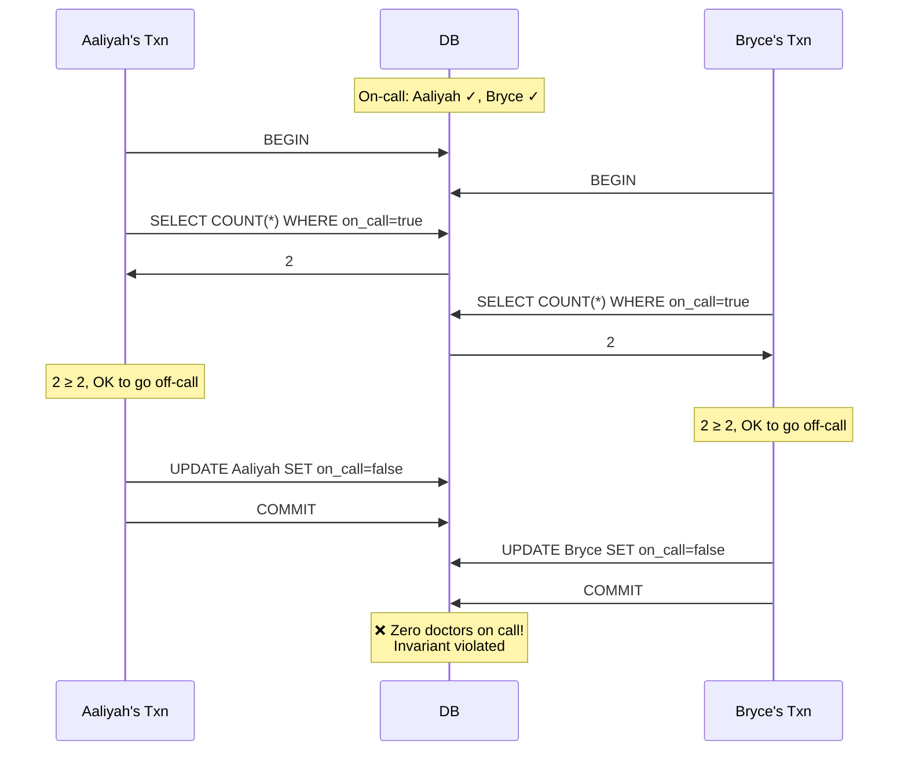

**Characterizing Write Skew**

This anomaly is called **write skew** [Berenson et al., 1995]. It is neither a dirty write nor a lost update, because the two transactions are updating two objects (Aaliyah's and Bryce's on-call records, respectively). It is less obvious that a conflict occurred here, but it's definitely a race condition: if the two transactions had run one after another, the second doctor would have been prevented from going off call.

You can think of write skew as a generalization of the lost-update problem. Write skew can occur if two transactions read the same objects and then update some of those objects (different transactions may update different objects). In the special case of different transactions updating the same object, you get a dirty write or lost update anomaly (depending on the timing).

```python
# Write skew: on-call doctors (Python simulation)
import threading

class HospitalDB:
    def __init__(self):
        self.on_call = {"Aaliyah": True, "Bryce": True}
        self.lock = threading.Lock()

    def go_off_call(self, doctor):
        # In a real DB this would be one snapshot-isolated transaction
        with self.lock:
            count = sum(1 for v in self.on_call.values() if v)
            if count >= 2:
                self.on_call[doctor] = False
                return True
            return False

db = HospitalDB()
results = {}

def worker(doctor):
    results[doctor] = db.go_off_call(doctor)

threads = [threading.Thread(target=worker, args=(d,))
           for d in ("Aaliyah", "Bryce")]
for t in threads:
    t.start()
for t in threads:
    t.join()

print(f"Results: {results}")
print(f"On-call now: {[d for d, v in db.on_call.items() if v]}")
print(f"❌ INVARIANT VIOLATED: {sum(db.on_call.values())} doctors on call")
```

With write skew, our options are more restricted:

- Atomic single-object operations don't help, as multiple objects are involved.
- The automatic detection of lost updates that you find in some implementations of snapshot isolation unfortunately doesn't help either — write skew is not automatically detected in PostgreSQL's repeatable read, MySQL/InnoDB's repeatable read, Oracle's serializable, or SQL Server's snapshot isolation level [30]. Automatically preventing write skew requires true serializable isolation.
- If you can't use a serializable isolation level, the second-best option is probably to explicitly lock the rows that the transaction depends on.

```sql
BEGIN TRANSACTION;
SELECT * FROM doctors
WHERE on_call = true
AND shift_id = 1234 FOR UPDATE;
UPDATE doctors
SET on_call = false
WHERE name = 'Aaliyah'
AND shift_id = 1234;
COMMIT;
```

**More Examples of Write Skew**

Write skew may seem like an esoteric issue at first, but once you're aware of it, you may notice other situations in which it can occur:

- **Meeting room booking system** — Enforcing that there cannot be two bookings for the same meeting room at the same time. When someone wants to make a booking, you first check for any conflicting bookings, and if none are found, you create the meeting.
- **Multiplayer game** — Using a lock prevents lost updates (two players can't move the same figure at the same time). However, the lock doesn't prevent players from moving two different figures to the same position on the board.
- **Claiming a username** — On a website where each user must have a unique username, two users may try to create accounts with the same username at the same time. A transaction can check whether a name is taken and, if not, create an account. But that is not safe under snapshot isolation. Fortunately, a uniqueness constraint is a simple solution here.
- **Preventing double-spending** — A service that allows users to spend money or points needs to check that a user doesn't spend more than they have. You might implement this by inserting a tentative spending item into a user's account, listing all the items in the account, and checking that the sum is positive. With write skew, two spending items could be inserted concurrently that together cause the balance to go negative.

#### Phantoms Causing Write Skew

All the previous examples follow a similar pattern:

1. A SELECT query checks whether a requirement is satisfied by searching for rows that match a search condition.
2. Depending on the result of the first query, the application code decides how to continue.
3. If the application decides to go ahead, it makes a write (INSERT, UPDATE, or DELETE) to the database and commits the transaction.

The effect of this write changes the precondition of the decision of step 2. In other words, if you were to repeat the SELECT query from step 1 after committing the write, you would get a different result.

This effect, where a write in one transaction changes the result of a search query in another transaction, is called a **phantom** [4]. Snapshot isolation avoids phantoms in read-only queries, but in read/write transactions like the examples we discussed, phantoms can lead to particularly tricky cases of write skew.

#### Materializing Conflicts

If the problem of phantoms is that there is no object to which we can attach the locks, perhaps we can artificially introduce a lock object into the database?

For example, in the meeting room booking case, you could imagine creating a table of time slots and rooms. Each row in this table corresponds to a particular room for a particular time period (say, 15 minutes). You create rows for all possible combinations of rooms and time periods ahead of time. Now a transaction that wants to create a booking can lock (`SELECT FOR UPDATE`) the rows in the table that correspond to the desired room and time period.

This approach is called **materializing conflicts**, because it takes a phantom and turns it into a lock conflict on a concrete set of rows that exist in the database [14]. Unfortunately, it can be hard and error-prone to figure out how to materialize conflicts, and it's ugly to let a concurrency control mechanism leak into the application data model. For those reasons, materializing conflicts should be considered a last resort if no alternative is possible. A serializable isolation level is preferable in most cases.

---

## Serializability

In this chapter we have seen several examples of transactions that are prone to race conditions. Some race conditions are prevented by the read-committed and snapshot isolation levels, but others are not. We encountered some particularly tricky examples with write skew and phantoms.

The isolation level situation is messy:

- Isolation levels are hard to understand and inconsistently implemented in different databases (e.g., the meaning of "repeatable read" varies significantly).
- It can be difficult to tell by looking at the application code whether it is safe to run at a particular isolation level — especially in a large application, where you might not be aware of all the things that may be happening concurrently.
- There are no good tools to help us detect race conditions.

This is not a new problem. It has been like this since the 1970s. All along, the answer from researchers has been simple: use serializable isolation!

**Serializable isolation** is the strongest isolation level. It guarantees that even though transactions may execute in parallel, the end result is the same as if they had executed one at a time, serially, without any concurrency. Thus, the database guarantees that if the transactions behave correctly when run individually, they continue to do so when run concurrently — the database prevents all possible race conditions.

But if serializable isolation is so much better than the mess of weak isolation levels, why isn't everyone using it? To answer this question, we need to look at the options for implementing serializability and how they perform. Most databases that provide serializability today use one of three techniques, which we will explore in the rest of this chapter:

1. Literally executing transactions in a serial order
2. Two-phase locking (2PL), which for several decades was the only viable option
3. Optimistic concurrency control techniques such as serializable snapshot isolation (SSI)

### Actual Serial Execution

The simplest way of avoiding concurrency problems is to remove the concurrency entirely: execute only one transaction at a time, in serial order, on a single thread. By doing so, we completely sidestep the problem of detecting and preventing conflicts between transactions; the resulting isolation is by definition serializable.

Even though this may seem like an obvious idea, it was only in the 2000s that database designers decided that a single-threaded loop for executing transactions was feasible [59]. Two developments caused this rethink:

- RAM became cheap enough that for many use cases it is now feasible to keep the entire active dataset in memory. When all data that a transaction needs to access is in memory, transactions can execute much faster than if they have to wait for data to be loaded from disk.
- Database designers realized that OLTP transactions are usually short and make only a small number of reads and writes. By contrast, long-running analytical queries are typically read-only, so they can be run on a consistent snapshot outside of the serial execution loop.

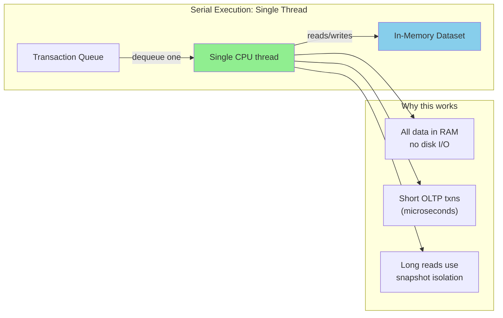

The approach of executing transactions serially is implemented in VoltDB/H-Store, Redis, and Datomic, for example [60, 61, 62]. A system designed for single-threaded execution can sometimes perform better than a system that supports concurrency, because it can avoid the coordination overhead of locking. However, its throughput is limited to that of a single CPU core.

#### Encapsulating Transactions in Stored Procedures

In the early days of databases, the intention was that a database transaction could encompass an entire flow of user activity. For example, booking an airline ticket is a multistage process (searching for routes, fares, and available seats; deciding on an itinerary; booking seats on each of the flights; the itinerary; entering passenger details; making payment).

Unfortunately, humans are very slow to make up their minds and respond. If a database transaction needs to wait for input from a user, the database needs to support a potentially huge number of concurrent transactions, most of them idle.

For this reason, systems with single-threaded serial transaction processing don't allow interactive multistatement transactions. Instead, the application must either limit itself to transactions containing a single statement or submit the entire transaction code to the database ahead of time, as a **stored procedure** [63].

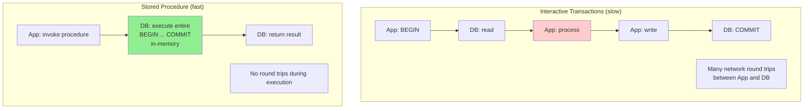

#### Pros and Cons of Stored Procedures

Stored procedures have existed for some time in relational databases, and they have been part of the SQL standard (SQL/PSM) since 1999. They have gained a somewhat bad reputation:

- Traditionally, each database vendor had its own language for stored procedures (Oracle has PL/SQL, SQL Server has T-SQL, PostgreSQL has PL/pgSQL, etc.). These languages haven't kept up with developments in general-purpose programming languages.
- Code running in a database is difficult to manage. It's harder to debug, more awkward to keep in version control and deploy, trickier to test, and difficult to integrate with a metrics collection system for monitoring.
- A database is often much more performance-sensitive than an application server.

Modern implementations of stored procedures have abandoned PL/SQL and use existing general-purpose programming languages instead. VoltDB uses Java or Groovy, Datomic uses Java or Clojure, Redis uses Lua, and MongoDB uses JavaScript.

VoltDB also uses stored procedures for replication. Instead of copying a transaction's writes from one node to another, it executes the same stored procedure on each replica. VoltDB therefore requires that stored procedures are deterministic. This approach is called **state machine replication**.

#### Sharding

Executing all transactions serially makes concurrency control much simpler, but it limits the transaction throughput of the database to the speed of a single CPU core on a single machine. To scale to multiple CPU cores and multiple nodes, you can shard your data.

If you can find a way of sharding your dataset so that each transaction needs to read and write data only within a single shard, then each shard can have its own transaction processing thread running independently from the others. In this case, you can give each CPU core its own shard, which allows your transaction throughput to scale linearly with the number of CPU cores [61].

However, for any transaction that needs to access multiple shards, the database must coordinate the transaction across all the shards that it touches. Since cross-shard transactions have additional coordination overhead, they are vastly slower than single-shard transactions. VoltDB reports a throughput of about **1,000 cross-shard writes per second**, which is orders of magnitude below its single-shard throughput and cannot be increased by adding more machines [63].

#### Summary of Serial Execution

Serial execution of transactions has become a viable way of achieving serializable isolation, within certain constraints:

- Every transaction must be small and fast, because it takes only one slow transaction to stall all transaction processing.
- It is most appropriate when the active dataset can fit in memory.
- Write throughput must be low enough to be handled on a single CPU core, or else transactions need to be sharded without requiring cross-shard coordination.
- Cross-shard transactions are possible, but their throughput is hard to scale.

### Two-Phase Locking (2PL)

For around 30 years, only one algorithm was widely used for serializability in databases: **two-phase locking (2PL)**, sometimes called strong strict two-phase locking (SS2PL) to distinguish it from other variants of 2PL.

> **2PL is not 2PC.** 2PL provides serializable isolation, whereas 2PC provides atomic commit in a distributed database. To avoid confusion, it's best to think of them as entirely separate concepts.

We saw previously that locks are often used to prevent dirty writes. If two transactions concurrently try to write to the same object, the lock ensures that the second writer must wait until the first one has finished its transaction.

2PL is similar, but it makes the lock requirements much stronger. Several transactions are allowed to concurrently read the same object as long as nobody is writing to it. But as soon as anyone wants to write (modify or delete) an object, exclusive access is required:

- If transaction A has read an object and transaction B wants to write to that object, B must wait until A commits or aborts before it can continue.
- If transaction A has written an object and transaction B wants to read that object, B must wait until A commits or aborts before it can continue.

In 2PL, writers don't just block other writers; they also block readers, and vice versa. The previously mentioned "readers never block writers, and writers never block readers" mantra of snapshot isolation captures this key difference. On the other hand, because 2PL provides serializability, it protects against all the race conditions discussed earlier, including lost updates and write skew.

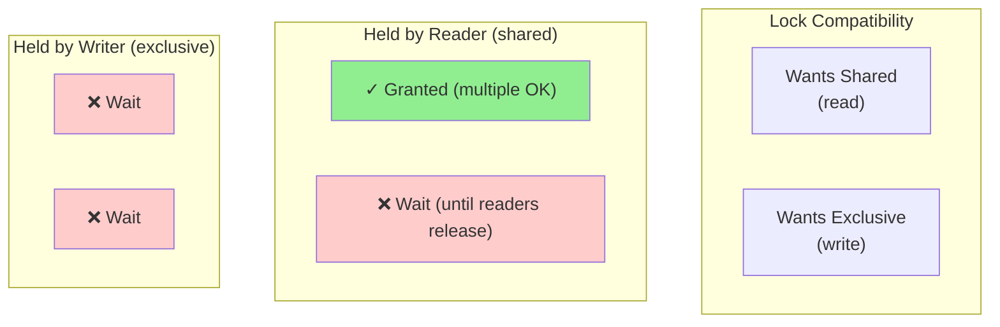

#### Implementation of 2PL

2PL is used by the serializable isolation level in MySQL/InnoDB and SQL Server and by the repeatable-read isolation level in Db2 [30].

The blocking of readers and writers is implemented by having a lock on each object in the database. The lock can either be in shared mode or in exclusive mode (also known as a multi-reader single-writer lock):

- If a transaction wants to read an object, it must first acquire the lock in shared mode. Several transactions are allowed to hold the lock in shared mode simultaneously.
- If a transaction wants to write to an object, it must first acquire the lock in exclusive mode. No other transaction may hold the lock at the same time.
- If a transaction first reads and then writes an object, it may upgrade its shared lock to an exclusive lock.
- After a transaction has acquired the lock, it must continue to hold the lock until the end of the transaction (commit or abort). This is where the name "two-phase" comes from: the first phase (the growing phase, while the transaction is executing) is when the locks are acquired, and the second phase (the shrinking phase, at the end of the transaction) is when all the locks are released.

Since so many locks are in use, it can happen quite easily that transaction A is stuck waiting for transaction B to release its lock, and vice versa. This situation is called **deadlock**. The database automatically detects deadlocks between transactions and aborts one of them so that the others can make progress.

#### Performance of 2PL

The big downside of 2PL, and the reason it hasn't been the default for most systems since the 1970s, is performance. Transaction throughput and response times of queries are significantly worse under 2PL than under weak isolation.

This is partly due to the overhead of acquiring and releasing all those locks, but more importantly due to reduced concurrency. By design, if two concurrent transactions try to do anything that may in any way result in a race condition, one has to wait for the other to complete.

For this reason, databases running 2PL can have quite unstable latencies, and they can be very slow at high percentiles if there is contention in the workload. Just one slow transaction, or one transaction that accesses a lot of data and acquires many locks, could cause the rest of the system to grind to a halt.

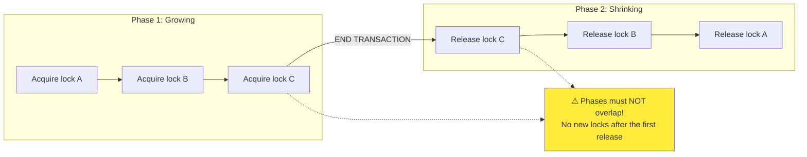

#### Predicate Locks

In the preceding description of locks, we glossed over a subtle but important detail. A database with serializable isolation must prevent phantoms. In the meeting room booking example, if one transaction has searched for existing bookings for a room within a certain time window, another transaction is not allowed to concurrently insert or update another booking for the same room and time range.

How do we implement this? Conceptually, we need a **predicate lock** [4]. It works similarly to the shared/exclusive lock described earlier, but rather than belonging to a particular object (e.g., one row in a table), it belongs to all objects that match a search condition:

```sql
SELECT * FROM bookings
WHERE room_id = 123 AND
end_time > '2026-01-01 12:00' AND
start_time < '2026-01-01 13:00';
```

A predicate lock restricts access as follows:

- If transaction A wants to read objects matching a condition, it must acquire a shared-mode predicate lock on the conditions of the query. If another transaction B currently has an exclusive lock on any object matching those conditions, A must wait until B releases its lock before it is allowed to make its query.
- If transaction A wants to insert, update, or delete any object, it must first check whether either the old or the new value matches any existing predicate lock. If a matching predicate lock is held by transaction B, then A must wait until B has committed or aborted before it can continue.

The key idea here is that a predicate lock applies even to objects that do not yet exist in the database, but that might be added in the future (phantoms). If 2PL includes predicate locks, the database prevents all forms of write skew and other race conditions, and so its isolation becomes serializable.

#### Index-Range Locks

Unfortunately, predicate locks do not perform well: if there are many locks by active transactions, checking for matching locks becomes time-consuming. For that reason, most databases with 2PL implement **index-range locking** (also known as next-key locking), which is a simplified approximation of predicate locking [56, 66].

It's safe to simplify a predicate by making it match a greater set of objects. For example, if you have a predicate lock for bookings of room 123 between noon and 1 p.m., you can approximate it by locking bookings for room 123 at any time, or you can approximate it by locking all rooms (not just room 123) between noon and 1 p.m.

If there is no suitable index where a range lock can be attached, the database can fall back to a shared lock on the entire table. This will not be good for performance, but it's a safe fallback position.

### Serializable Snapshot Isolation (SSI)

This chapter has painted a bleak picture of concurrency control in databases. On the one hand, we have implementations of serializability that don't perform well (2PL) or don't scale well (serial execution). On the other hand, we have weak isolation levels that have good performance but are prone to various race conditions. Are serializable isolation and good performance fundamentally at odds with each other?

It seems not: an algorithm called **serializable snapshot isolation (SSI)** provides full serializability with only a small performance penalty compared to snapshot isolation. SSI is comparatively new; it was first described in 2008 [Cahill et al., 2008].

Today, SSI and similar algorithms are used in single-node databases (the serializable isolation level in PostgreSQL [Ports & Grittner, 2012], SQL Server's In-Memory OLTP/Hekaton [Larson et al., 2013], and HyPer [Neumann et al., 2015]), distributed databases (CockroachDB [5] and FoundationDB [8]), and embedded storage engines such as BadgerDB.

#### Pessimistic vs. Optimistic Concurrency Control

2PL is a **pessimistic** concurrency control mechanism: it is based on the principle that if anything might possibly go wrong (as indicated by a lock held by another transaction), it's better to wait until the situation is safe again before doing anything.

By contrast, **serializable snapshot isolation** is an **optimistic** concurrency control technique. Optimistic in this context means that instead of blocking if something potentially dangerous happens, transactions continue anyway, in the hope that everything will turn out all right. When a transaction wants to commit, the database checks whether anything bad happened (i.e., whether isolation was violated); if so, the transaction is aborted and has to be retried. Only transactions that executed serializably are allowed to commit.

```mermaid
graph TB
    subgraph "Pessimistic (2PL)"
        P1[Begin txn]
        P2[Try to acquire lock]
        P3{Conflicting lock?}
        P4["❌ Wait or abort"]
        P5[Proceed]
        P6[Hold locks until commit]

        P1 --> P2 --> P3
        P3 -->|Yes| P4 --> P5
        P3 -->|No| P5
        P5 --> P6
    end

    subgraph "Optimistic (SSI)"
        O1[Begin txn<br/>(snapshot read)]
        O2[Track reads & writes]
        O3[Proceed without locks]
        O4{Conflict detected<br/>at commit?}
        O5["❌ Abort & retry"]
        O6[✓ Commit]

        O1 --> O2 --> O3 --> O4
        O4 -->|Yes| O5
        O4 -->|No| O6
    end

    style P4 fill:#ffcccc
    style O5 fill:#ffcccc
    style P6 fill:#90EE90
    style O6 fill:#90EE90
```

Optimistic concurrency control performs badly if there is high contention (many transactions trying to access the same objects), as this leads to a high proportion of transactions needing to abort. However, if there is enough spare capacity, and if contention between transactions is not too high, optimistic concurrency control techniques tend to perform better than pessimistic ones.

#### Decisions Based on an Outdated Premise

When we previously discussed write skew in snapshot isolation, we observed a recurring pattern: a transaction reads data from the database, examines the result of the query, and decides to take an action based on the result that it saw. However, under snapshot isolation, the result from the original query may no longer be up-to-date by the time the transaction commits, because the data may have been modified in the meantime.

Put another way, the transaction is taking an action based on a premise (a fact that was true at the beginning of the transaction). Later, when the transaction wants to commit, the original data may have changed — the premise may no longer be true.

When the application makes a query, the database doesn't know how the application logic uses the result of that query. To be safe, the database needs to assume that any change in the query result (the premise) means that writes in that transaction may be invalid. To provide serializable isolation, the database must detect situations in which a transaction may have acted on an outdated premise and abort the transaction in that case.

How does the database know if a query result might have changed? Consider two cases:

1. **Detecting reads of a stale MVCC object version** (an uncommitted write occurred before the read)
2. **Detecting writes that affect prior reads** (the write occurs after the read)

#### Detection of Stale MVCC Reads

Recall that snapshot isolation is usually implemented by MVCC. When a transaction reads from a consistent snapshot in an MVCC database, it ignores writes that were made by any other transactions that hadn't yet committed at the time that the snapshot was taken.

To prevent this anomaly, the database needs to track when a transaction ignores another transaction's writes because of MVCC visibility rules. When the transaction wants to commit, the database checks whether any of the ignored writes have now been committed. If so, the transaction must be aborted.

Why wait until committing? Why not abort the transaction immediately when the stale read is detected? If the transaction was a read-only transaction, it wouldn't need to be aborted, because there is no risk of write skew. By avoiding unnecessary aborts, SSI preserves snapshot isolation's support for long-running reads from a consistent snapshot.

#### Detection of Writes That Affect Prior Reads

The second case to consider is another transaction modifying data after it has been read. In the context of 2PL, we discussed index-range locks, which allow the database to lock access to all rows matching a search query. We can use a similar technique here, except that SSI locks don't block other transactions.

When a transaction writes to the database, it must look in the indexes for any other transactions that have recently read the affected data. This process is similar to acquiring a write lock on the affected key range, but rather than blocking until the readers have committed, the lock acts as a tripwire; it simply notifies the transactions that the data they read may no longer be up-to-date.

#### Performance of Serializable Snapshot Isolation

As always, many engineering details affect how well an algorithm works in practice. For example, one trade-off is the granularity at which transactions' reads and writes are tracked. If the database keeps track of each transaction's activity in great detail, it can be precise about which transactions need to abort, but the bookkeeping overhead can become significant. Less detailed tracking is faster, but it may lead to more transactions being aborted than strictly necessary.

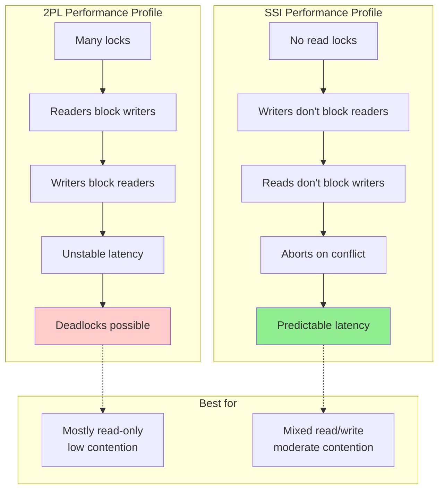

Compared to 2PL, the big advantage of serializable snapshot isolation is that one transaction doesn't need to block waiting for locks held by another transaction. As with snapshot isolation, writers don't block readers, and vice versa. This design principle makes query latency much more predictable and less variable. In particular, read-only queries can run on a consistent snapshot without requiring any locks.

Compared to serial execution, serializable snapshot isolation is not limited to the throughput of a single CPU core — for example, FoundationDB distributes the detection of serialization conflicts across multiple machines.

Compared to nonserializable snapshot isolation, the need to check for serializability violations introduces some performance overheads.

The rate of aborts significantly affects the overall performance of SSI. For example, a transaction that reads and writes data over a long period of time is likely to run into conflicts and abort, so SSI requires that read/write transactions be fairly short (long-running read-only transactions are OK).

---

## Distributed Transactions

In a single-node transaction, you have a single machine that is in charge of executing the transaction logic, such as the concurrency control algorithms for transaction isolation. If your database uses single-leader replication, the transaction execution happens only on the leader, and the followers simply apply the log of writes that were committed by transactions on the leader.

However, what if multiple nodes are involved in a transaction? For example, perhaps you have a transaction that needs to touch multiple shards of a sharded database, or a global secondary index (in which the index entry may be on a different node from the primary data). This is called a **distributed transaction**.

The algorithms for concurrency control in distributed transactions are broadly similar to those for single-node concurrency control. Achieving atomicity in a distributed transaction is a whole new challenge, though.

For single-node transactions, atomicity is commonly implemented by the storage engine. When the client asks the database node to commit the transaction, the database makes the transaction's writes durable (typically in a write-ahead log) and then appends a commit record to the log on disk. If the database crashes in the middle of this process, the transaction is recovered from the log when the node restarts.

In a distributed transaction, determining whether a transaction has committed is not so straightforward. For example, when a transaction wants to commit, it is not sufficient to simply send a commit request to all the nodes and independently commit the transaction on each one. It could easily happen that the commit succeeds on some nodes and fails on others (as shown in Figure 8-12):

- Some nodes may detect a constraint violation or conflict, making an abort necessary, while other nodes are successfully able to commit.
- Some of the commit requests might be lost in the network, eventually aborting because of a timeout, while other commit requests get through.
- Some nodes may crash before the commit record is fully written and roll back the transaction on recovery, while others successfully commit it.

```mermaid
graph TB
    subgraph "The Problem"
        A["Application: COMMIT"]
        B["❌ DB1: success"]
        C["❌ DB2: timeout"]
        D["❌ DB3: crash"]

        A --> B
        A --> C
        A --> D
    end

    subgraph "Result"
        RES["Inconsistent!<br/>Some nodes committed,<br/>others aborted"]
    end

    B --> RES
    C --> RES
    D --> RES

    style RES fill:#ff6b6b
```

If some nodes commit the transaction but others abort it, the nodes become inconsistent with one another. And once a transaction has been committed on one node, it cannot be retracted again if it later turns out that it was aborted on another node. This is because once data has been committed, it becomes visible to other transactions under read-committed or stronger isolation. A better approach is to ensure that the nodes involved in a transaction either all commit or all abort and to prevent a mixture of the two. Achieving this is known as the **atomic commitment problem**.

### Two-Phase Commit (2PC)

Two-phase commit is an algorithm for achieving atomic transaction commit across multiple nodes. It is a classic algorithm in distributed databases [Gray, 1978]. 2PC is used internally in some databases and also made available to applications in the form of XA transactions [X/Open, 1991] (which are supported by the Java Transaction API, for example) or via WS-AtomicTransaction for SOAP web services [76, 77].

2PC uses a new component that does not normally appear in single-node transactions: a **coordinator** (also known as **transaction manager**). The coordinator is often implemented as a library within the same application process that is requesting the transaction (e.g., embedded in a Java EE container), but it can also be a separate process or service. Examples of such coordinators include Narayana, JOTM, BTM, and MSDTC.

When 2PC is used, a distributed transaction begins with the application reading and writing data on multiple database nodes, as normal. We call these database nodes **participants** in the transaction. When the application is ready to commit, the coordinator begins phase 1 by sending a prepare request to each of the nodes, asking them whether they are able to commit.

- If all participants reply yes, indicating they are ready to commit, the coordinator sends out a commit request in phase 2, and the commit takes place.
- If any participant replies no, the coordinator sends an abort request to all nodes in phase 2.

```mermaid
sequenceDiagram
    participant App
    participant Coord as Coordinator
    participant DB1 as DB1 (Participant)
    participant DB2 as DB2 (Participant)

    App->>Coord: begin txn (txn_id=42)
    App->>DB1: write (txn_id=42)
    App->>DB2: write (txn_id=42)

    Note over Coord,DB2: ═══ PHASE 1: PREPARE ═══

    Coord->>DB1: PREPARE 42
    DB1->>DB1: Acquire locks,<br/>write PREPARE to WAL<br/>fsync()
    DB1->>Coord: YES (promised to commit)

    Coord->>DB2: PREPARE 42
    DB2->>DB2: Acquire locks,<br/>write PREPARE to WAL<br/>fsync()
    DB2->>Coord: YES

    Note over Coord: All participants voted YES

    Note over Coord,DB2: ═══ PHASE 2: COMMIT (commit point) ═══

    Coord->>Coord: Write COMMIT decision to log
    Coord->>DB1: COMMIT 42
    DB1->>DB1: Actually commit, release locks
    DB1->>Coord: DONE

    Coord->>DB2: COMMIT 42
    DB2->>DB2: Actually commit, release locks
    DB2->>Coord: DONE

    Coord->>App: COMMITTED ✓
```

#### A System of Promises

To understand why 2PC ensures atomicity, we have to break down the process in more detail:

1. When the application wants to begin a distributed transaction, it requests a transaction ID from the coordinator. This transaction ID is globally unique.
2. The application begins a single-node transaction on each of the participants and attaches the globally unique transaction ID to the single-node transaction. All reads and writes are done in one of these single-node transactions.
3. When the application is ready to commit, the coordinator sends a prepare request to all participants, tagged with the global transaction ID.
4. When a participant receives the prepare request, it makes sure that it can definitely commit the transaction under all circumstances. This includes writing all transaction data to disk (a crash, a power failure, or running out of disk space is not an acceptable excuse for refusing to commit later) and checking for any conflicts or constraint violations. By replying yes to the coordinator, the node promises to commit the transaction without error if requested. In other words, the participant surrenders the right to abort the transaction, but without actually committing it.
5. When the coordinator has received responses to all prepare requests, it makes a definitive decision on whether to commit or abort the transaction (committing only if all participants voted yes). The coordinator must write that decision to its transaction log on disk so that it knows which way it decided in case it subsequently crashes. This is called the **commit point**.
6. Once the coordinator's decision has been written to disk, the commit or abort request is sent to all participants. If this request fails or times out, the coordinator must retry forever until it succeeds.

Thus, the protocol contains two crucial "points of no return": when a participant votes yes, it promises that it will definitely be able to commit later (although the coordinator may still choose to abort); and once the coordinator decides, that decision is irrevocable. Those promises ensure the atomicity of 2PC.

```python
# Two-Phase Commit coordinator (sketch)
class TwoPhaseCommitCoordinator:
    """Implements the coordinator side of 2PC."""

    def __init__(self, log):
        self.log = log                              # durable decision log

    def commit_transaction(self, txn_id, participants):
        # ── Phase 1: PREPARE ─────────────────────────────────────
        votes = {}
        for participant in participants:
            try:
                votes[participant] = participant.prepare(txn_id)
            except Exception:
                votes[participant] = "NO"

        # Make decision (commit point) — must fsync before notifying
        decision = "COMMIT" if all(v == "YES" for v in votes.values()) else "ABORT"
        self.log.write(f"{txn_id}: {decision}")
        self.log.fsync()                            # ← commit point

        # ── Phase 2: notify all participants (retry forever) ──────
        for participant in participants:
            while True:
                try:
                    if decision == "COMMIT":
                        participant.commit(txn_id)
                    else:
                        participant.abort(txn_id)
                    break
                except Exception:
                    continue                         # keep retrying

        return decision


class TwoPhaseCommitParticipant:
    """Implements the participant side of 2PC."""

    def __init__(self, name, wal):
        self.name = name
        self.wal = wal
        self.prepared = {}

    def prepare(self, txn_id):
        # Make sure we can definitely commit later
        self.wal.write(f"PREPARED {self.name} {txn_id}")
        self.wal.fsync()                            # durability before promise
        self.prepared[txn_id] = True
        return "YES"

    def commit(self, txn_id):
        # Safe to commit: we voted YES and our WAL is durable
        self._apply_writes(txn_id)
        self.wal.write(f"COMMITTED {self.name} {txn_id}")
        self.prepared.pop(txn_id, None)

    def abort(self, txn_id):
        self._discard_writes(txn_id)
        self.wal.write(f"ABORTED {self.name} {txn_id}")
        self.prepared.pop(txn_id, None)

    def recover(self, coordinator):
        """On restart, resolve any in-doubt transactions."""
        for txn_id in list(self.prepared.keys()):
            decision = coordinator.get_decision(txn_id)
            if decision == "COMMIT":
                self.commit(txn_id)
            else:
                self.abort(txn_id)
```

#### Coordinator Failure

We have discussed what happens if one of the participants or the network fails during 2PC. However, it is less clear what happens if the coordinator crashes.

If the coordinator fails before sending the prepare requests, a participant can safely abort the transaction. But once the participant has received a prepare request and voted yes, it can no longer abort unilaterally — it must wait to hear back from the coordinator. A participant's transaction in this state is called **in doubt** or **uncertain**.

```mermaid
sequenceDiagram
    participant C as Coordinator
    participant DB1
    participant DB2

    C->>DB1: PREPARE
    DB1->>C: YES
    C->>DB2: PREPARE
    DB2->>C: YES

    C->>C: Decision: COMMIT<br/>fsync log

    C->>DB1: COMMIT ❌ (network failure)
    Note over C: 💥 Coordinator crashes<br/>before sending COMMIT to DB1

    DB1->>DB1: State: IN DOUBT<br/>(voted YES, no response)
    DB2->>DB2: Receives COMMIT, commits

    Note over DB1: Stuck waiting!<br/>Must hold locks until coordinator recovers
```

The only way 2PC can complete is by waiting for the coordinator to recover. This is why the coordinator must write its commit or abort decision to a transaction log on disk before sending commit or abort requests to participants: when the coordinator recovers, it determines the status of all in-doubt transactions by reading its transaction log.

Furthermore, if the coordinator's disk fails and its log is lost, the system has no way to automatically recover. The only option is for an administrator to manually commit or abort the in-doubt transactions.

#### Three-Phase Commit

2PC is called a **blocking atomic commit protocol** because 2PC can become stuck waiting for the coordinator to recover. It is possible to make an atomic commit protocol nonblocking, so that it does not get stuck if a node fails.

As an alternative to 2PC, an algorithm called **three-phase commit (3PC)** has been proposed [Skeen, 1981]. However, 3PC assumes a network with bounded delay and nodes with bounded response times; in most practical systems with unbounded network delay and process pauses (see Chapter 9), 3PC cannot guarantee atomicity. A better solution in practice is to replace the single-node coordinator with a fault-tolerant consensus protocol.

### XA Transactions: Heterogeneous Distributed Transactions

Distributed transactions and 2PC have a mixed reputation. On the one hand, they are seen as providing an important safety guarantee that would be hard to achieve otherwise; on the other hand, they are criticized for causing operational problems, killing performance, and promising more than they can deliver [80, 81, 82, 83]. Many cloud services choose not to implement distributed transactions because of the operational problems they engender [84].

Some implementations of distributed transactions carry a heavy performance penalty. Much of the performance cost inherent in 2PC is due to the additional `fsync` operations required for crash recovery and the additional network round trips.

To begin, we should be precise about what we mean by "distributed transactions." Two quite different types of distributed transactions are often conflated:

- **Database-internal distributed transactions** — Some distributed databases (i.e., databases that use replication and sharding in their standard configuration) support internal transactions among the nodes of that database. For example, YugabyteDB, TiDB, FoundationDB, Spanner, VoltDB, Cassandra, and MySQL Cluster's NDB storage engine have such internal transaction support. In this case, all the nodes participating in the transaction are running the same database software.
- **Heterogeneous distributed transactions** — In a heterogeneous transaction, the participants are two or more technologies — for example, two databases from different vendors, or even non-database systems such as message brokers. A distributed transaction across these systems must ensure atomic commit, even though the systems may be entirely different under the hood.

Database-internal transactions do not have to be compatible with any other system, so they can use any protocol and apply optimizations specific to that particular technology. For that reason, database-internal distributed transactions can often work quite well. On the other hand, transactions spanning heterogeneous technologies are a lot more challenging.

#### XA Transactions

X/Open XA (short for eXtended Architecture) is a standard for implementing 2PC across heterogeneous technologies [X/Open, 1991]. It was introduced in 1991 and has been widely implemented. XA is supported by many traditional relational databases (including PostgreSQL, MySQL, Db2, SQL Server, and Oracle) and message brokers (including ActiveMQ, HornetQ, MSMQ, and IBM MQ).

XA is not a network protocol — it is merely a C API for interfacing with a transaction coordinator. Bindings for this API exist in other languages; for example, in the world of Java EE applications, XA transactions are implemented using the Java Transaction API (JTA).

#### Limitations of XA

A single-node coordinator is a single point of failure for the entire system, and making it part of the application server is also problematic because the coordinator's logs on its local disk become a crucial part of the durable system state.

In principle, the coordinator of an XA transaction could be highly available and replicated, just as we would expect of any other important database. Unfortunately, this still doesn't solve a fundamental problem with XA, which is that it provides no way for the coordinator and the participants of a transaction to communicate with each other directly.

A transaction that is in doubt (the coordinator crashed after participants voted yes but before they received the commit/abort decision) must hold its locks until the coordinator recovers. If the coordinator takes 20 minutes to restart, locks are held for 20 minutes; if the coordinator's log is entirely lost, the locks are held forever (or until an administrator manually resolves the situation). Many XA implementations provide an emergency escape hatch called **heuristic decisions**, which allow a participant to unilaterally commit or abort an in-doubt transaction without a definitive decision from the coordinator [X/Open, 1991] — a euphemism for probably breaking atomicity, since it violates 2PC's system of promises. Orphaned in-doubt transactions do occur in practice [85, 86].

Another problem is that since XA needs to be compatible with a wide range of data systems, it is necessarily a lowest common denominator. For example, it cannot detect deadlocks across different systems, and it does not work with SSI.

### Database-Internal Distributed Transactions

There is a big difference between distributed transactions that span multiple heterogeneous storage technologies and those that are internal to a system — that is, where all the participating nodes are part of the same database running the same software. Such internal distributed transactions are a defining feature of "NewSQL" databases such as CockroachDB [5], TiDB [6], Spanner [Corbett et al., 2013], FoundationDB [8], and YugabyteDB.

Many of these systems use 2PC to ensure atomicity of transactions that write to multiple shards, yet they don't suffer from the same problems as XA transactions. The biggest problems with XA can be fixed by:

- Replicating the coordinator, with automatic failover to another coordinator node if the primary one crashes
- Allowing the coordinator and data shards to communicate directly without intermediary application code
- Replicating the participating shards so that the risk of having to abort a transaction because of a fault in one of the shards is reduced
- Coupling the atomic commitment protocol with a distributed concurrency control protocol that supports deadlock detection and consistent reads across shards

Consensus algorithms are commonly used to replicate the coordinator and the database shards. We will see in Chapter 10 how atomic commitment for distributed transactions can be implemented using a consensus algorithm.

### Exactly-Once Message Processing

Heterogeneous distributed transactions allow diverse systems to be integrated in powerful ways — for example, atomically committing a message acknowledgment and database writes in a single transaction so that the broker can safely redeliver on failure. The mechanism that achieves **exactly-once semantics** is detailed below.

#### Exactly-Once Message Processing Revisited

We saw that an important use case for distributed transactions is to ensure that an operation takes effect exactly once, even if a crash occurs while it is being processed and the processing needs to be retried. If you can atomically commit a transaction across a message broker and a database, you can acknowledge the message to the broker if and only if it was successfully processed and the database writes resulting from the process were committed.

However, you don't actually need distributed transactions to achieve exactly-once semantics. An alternative approach is as follows, which requires only transactions within the database:

1. Assume every message has a unique ID, and in the database you have a table of message IDs that have been processed. When you start processing a message from the broker, you begin a new transaction on the database and check the message ID. If the same message ID is already present in the database, you know that it has already been processed, so you can acknowledge the message to the broker and drop it.
2. If the message ID is not already in the database, you add it to the table. You then process the message, which may result in additional writes to the database within the same transaction. When you finish processing the message, you commit the transaction on the database.
3. Once the database transaction is successfully committed, you can acknowledge the message to the broker.
4. Once the message has successfully been acknowledged to the broker, you know that it won't try processing the same message again, so you can delete the message ID from the database (in a separate transaction).

```mermaid
sequenceDiagram
    participant Q as Message Broker
    participant W as Worker
    participant DB

    Q->>W: deliver msg(id=42)
    W->>DB: BEGIN
    W->>DB: check if id=42 already processed
    alt Already processed
        DB->>W: yes (found)
        W->>DB: COMMIT (no-op)
        W->>Q: ACK msg 42
        Note over W: Drop duplicate
    else New message
        DB->>W: not found
        W->>DB: INSERT id=42 (uniqueness)
        W->>DB: process + side effects
        W->>DB: COMMIT
        W->>Q: ACK msg 42
        W->>DB: DELETE id=42 (cleanup txn)
    end
```

Thus, achieving exactly-once processing requires only transactions within the database — atomicity across database and message broker is not necessary for this use case. Recording the message ID in the database makes the message processing **idempotent**, so that message processing can be safely retried without duplicating its side effects. A similar approach is used in stream processing frameworks such as Kafka Streams to achieve exactly-once semantics, as we shall see in Chapter 12.

```python
# Idempotent message processing using only single-DB transactions
class MessageProcessor:
    """Achieves exactly-once semantics without distributed transactions."""

    def __init__(self, db_conn, broker):
        self.db = db_conn
        self.broker = broker
        self._ensure_schema()

    def _ensure_schema(self):
        self.db.execute("""
            CREATE TABLE IF NOT EXISTS processed_messages (
                msg_id TEXT PRIMARY KEY
            )
        """)

    def handle(self, msg):
        msg_id = msg["id"]
        txn = self.db.begin_transaction()

        try:
            # Step 1: check + insert (atomic in same txn)
            already = txn.query(
                "SELECT 1 FROM processed_messages WHERE msg_id = ?",
                msg_id,
            )
            if already:
                # Duplicate: just acknowledge and drop
                txn.commit()
                self.broker.ack(msg_id)
                return "DUPLICATE"

            txn.execute(
                "INSERT INTO processed_messages (msg_id) VALUES (?)",
                msg_id,
            )

            # Step 2: process the message (idempotent if implemented well)
            self._apply_side_effects(txn, msg)

            txn.commit()
        except Exception:
            txn.rollback()
            # Don't ACK — broker will retry
            raise

        # Step 3: only after DB commit, ACK to broker
        self.broker.ack(msg_id)

        # Step 4: cleanup (separate transaction; failure here is harmless)
        cleanup = self.db.begin_transaction()
        cleanup.execute(
            "DELETE FROM processed_messages WHERE msg_id = ?",
            msg_id,
        )
        cleanup.commit()

    def _apply_side_effects(self, txn, msg):
        # Application-specific work — must be idempotent w.r.t. msg_id
        raise NotImplementedError
```

---

## Summary

Transactions are an abstraction layer that allows an application to pretend that certain concurrency problems and certain kinds of hardware and software faults don't exist. A large class of errors is reduced to a simple transaction abort, and the application just needs to try again. Not all applications need transactions; an application with very simple access patterns can probably manage without them. For more complex access patterns, transactions hugely reduce the number of potential error cases you need to think about.

### Anomalies Prevented by Each Isolation Level

| Isolation level | Dirty reads | Read skew | Phantom reads | Lost updates | Write skew |
|---|---|---|---|---|---|
| Read uncommitted | ✗ Possible | ✗ Possible | ✗ Possible | ✗ Possible | ✗ Possible |
| Read committed | ✓ Prevented | ✗ Possible | ✗ Possible | ✗ Possible | ✗ Possible |
| Snapshot isolation | ✓ Prevented | ✓ Prevented | ✓ Prevented | ? Depends | ✗ Possible |
| Serializable | ✓ Prevented | ✓ Prevented | ✓ Prevented | ✓ Prevented | ✓ Prevented |

### Three Approaches to Serializable Transactions

```mermaid
graph TB
    S["Serializable Isolation<br/>(strongest guarantee)"]

    A["1. Actual Serial Execution<br/>• Single-threaded<br/>• Stored procedures<br/>• In-memory dataset<br/>e.g. VoltDB, Redis, Datomic"]
    B["2. Two-Phase Locking (2PL)<br/>• Pessimistic<br/>• Readers block writers<br/>• Writers block readers<br/>e.g. MySQL InnoDB, SQL Server"]
    C["3. Serializable Snapshot Isolation<br/>• Optimistic<br/>• Track reads/writes<br/>• Abort on conflict at commit<br/>e.g. PostgreSQL, CockroachDB"]

    S --> A
    S --> B
    S --> C

    style S fill:#ffeb3b
    style A fill:#90EE90
    style B fill:#90EE90
    style C fill:#90EE90
```

- **Literally executing transactions in a serial order** — If you can make each transaction very fast to execute (typically by using stored procedures), and the transaction throughput is low enough to process on a single CPU core or can be sharded, this is a simple and effective option.
- **Two-phase locking** — For decades 2PL has been the standard way of implementing serializability, but many applications avoid using it because of its poor performance.
- **Serializable snapshot isolation** — SSI is a comparatively new algorithm that avoids most of the downsides of the previous approaches. It uses an optimistic approach, allowing transactions to proceed without blocking. When a transaction wants to commit, it is checked, and it is aborted if the execution was not serializable.

### Distributed Transactions in One Glance

```mermaid
graph TB
    subgraph "Atomic Commit Algorithms"
        P["Atomic Commitment<br/>(all-or-nothing across nodes)"]
        TPC["2PC<br/>Two-Phase Commit<br/>(blocking; XA standard)"]
        TPC_NL["Nonblocking 3PC<br/>(unrealistic assumptions)"]
        CONS["Fault-tolerant consensus<br/>(recommended)"]

        P --> TPC
        P --> TPC_NL
        P --> CONS
    end

    subgraph "Use Cases"
        U1["Database-internal<br/>(CockroachDB, Spanner)"]
        U2["Heterogeneous XA<br/>(DBs + brokers)"]
        U3["Idempotent processing<br/>(no 2PC needed)"]

        U1 --> CONS
        U2 --> TPC
        U3 --> IDEM["message_id table<br/>+ single-DB txn"]
    end

    style P fill:#ffeb3b
    style CONS fill:#90EE90
    style TPC fill:#FFA500
```

We examined how to achieve atomicity when a transaction is distributed across multiple nodes, using 2PC. If those nodes are all running the same database software, distributed transactions can work quite well. However, across different storage technologies (using XA transactions), 2PC is problematic; it is very sensitive to faults in the coordinator and the application code driving the transaction, and it interacts poorly with concurrency control mechanisms. Fortunately, idempotence can ensure exactly-once semantics without requiring atomic commit across different storage technologies.

### Choosing the Right Tool

```mermaid
graph LR
    subgraph "Choose the right isolation level"
        A["Need correctness<br/>for complex invariants?"]
        A -->|Yes| B["Serializable<br/>(2PL / SSI / serial)"]
        A -->|No, simple queries| C["Read Committed"]
        A -->|Long analytics| D["Snapshot Isolation"]
    end

    subgraph "Distributed?"
        E["Single-node DB?"]
        F["Heterogeneous<br/>(DB + broker)?"]
        G["Sharded same DB?"]

        E -->|Yes| H["Single-node transactions<br/>sufficient"]
        F -->|Yes| I["Avoid XA;<br/>use idempotence"]
        G -->|Yes| J["Internal distributed txn<br/>(NewSQL)"]
    end

    style B fill:#90EE90
    style H fill:#90EE90
    style I fill:#90EE90
    style J fill:#90EE90
```

The examples in this chapter used a relational data model. However, transactions are a valuable database feature, no matter which data model is used.

### Key Takeaways

- **ACID** provides a vocabulary, but each database implements it differently — treat "ACID" as a starting point, not a contract.
- **Atomicity** lets you abort safely; pair it with retries that handle transient errors and avoid duplicates.
- **Isolation levels** have inconsistent names across databases. Always characterize them by the anomalies they prevent, not by the SQL standard label.
- **Snapshot isolation** prevents most read anomalies but **not** lost updates, write skew, or phantoms in write-write scenarios.
- **Serializable** is the only level that protects against all race conditions; modern implementations (SSI) make it affordable.
- **Distributed transactions** across heterogeneous systems are expensive and risky; prefer **idempotence** for exactly-once message processing.

---

## References

Numbered citations in this chapter correspond to entries in the source book's References list (e.g., Kleppmann, *Designing Data-Intensive Applications*, 2nd ed.). Author-year citations are resolved inline below.

1. Post Office Horizon scandal analysis (ACID absence).
2. Chamberlin et al., "A History and Evaluation of System R" (IBM, 1981).
3. Gray, "Notes on Database Operating Systems" (IBM, 1978) — origin of System R isolation levels and 2PC.
4. Eswaran et al., "The Notions of Consistency and Predicate Locks in a Database System" (CACM, 1976) — phantom read, predicate locks.
5. Taft et al., "CockroachDB: The Resilient Geo-Distributed SQL Database" (SIGMOD, 2020).
6. TiDB architecture and design documentation (PingCAP).
7. Corbett et al., "Spanner: Google's Globally-Distributed Database" (OSDI, 2012).
8. FoundationDB documentation and architecture papers.
9. Härder & Reuter, "Principles of Transaction-Oriented Database Recovery" (ACM Computing Surveys, 1983) — coined ACID.
10. Adya et al., "Generalized Isolation Level Definitions" (ICDE, 2000).
11. Brewer, "Towards Robust Distributed Systems" (PODC keynote, 2000) — popularized BASE.
12. Materialized views / triggers (database textbooks).
13. Gray, "Notes on Database Operating Systems" (IBM, 1978).
14. Berenson et al., "A Critique of ANSI SQL Isolation Levels" (SIGMOD, 1995).
15. Zheng et al., "Understanding Latency Failures in SSD Devices" — fsync unreliability on SSDs.
16, 17, 18. Disk firmware bug reports.
19, 20, 21. PostgreSQL fsync bug discussion (2020 community thread).
22, 23. Storage engine / filesystem corruption case studies.
24. Filesystem corruption propagation across replicas.
25, 26. Silent on-disk data corruption studies (e.g., Bairavasundaram et al.).
27. Schroeder et al., "DRAM Errors in the Wild" (SIGMETRICS) and SSD failure studies.
28. Intel / enterprise SSD data retention whitepapers.
30. Adya et al. (isolation level comparison); Gray & Reuter (transaction processing).
31, 32, 33, 34. Mt. Gox and related Bitcoin exchange race-condition analyses.
35. Financial auditor investigations into transaction bugs.
36. Customer-data corruption incident reports.
38. Berenson et al., 1995 — dirty write, write skew.
42, 43. PostgreSQL / MySQL InnoDB MVCC documentation.
44, 45. PostgreSQL MVCC implementation details.
46. Update-as-delete-plus-insert documentation (PostgreSQL).
50. Lost-update solutions literature.
54. Optimistic concurrency control / version columns.
55, 67. Cahill et al., "Serializable Snapshot Isolation in PostgreSQL" (2008).
56, 66. Ports & Grittner, "Serializable Snapshot Isolation in PostgreSQL" (VLDB, 2012); index-range locking (Graefe).
59. Single-threaded loop feasibility (Stonebraker et al., H-Store).
60, 61, 62. VoltDB, Redis, Datomic architecture papers.
63. VoltDB cross-shard transaction throughput papers.
68. Larson et al., "Hekaton: SQL Server's Memory-Optimized OLTP Engine" (SIGMOD, 2013).
69. Neumann et al., "HyPer: A Hybrid OLTP&OLAP Main Memory Database" (VLDB, 2015).
73, 74. Gray, 1978 — 2PC foundations.
75. X/Open XA specification (1991).
76, 77. WS-AtomicTransaction / WS-Coordination specifications.
79. Skeen, "Nonblocking Commit Protocols" (SIGMOD, 1981) — 3PC.
80, 81, 82, 83. Distributed transaction criticism (Gray, Helland, etc.).
84. Cloud-provider statements on the absence of distributed transactions.
85, 86. Orphan in-doubt transaction case studies.