# Chapter 9: The Trouble with Distributed Systems

## TL;DR

- **Partial failures are the norm.** When software on one node tries to interact with another, it may succeed, fail silently, hang, or return conflicting information - and the caller often cannot tell which happened.
- **Networks, clocks, and processes are all unreliable.** Packets are lost, reordered, duplicated, or delayed for unbounded times; hardware clocks drift and jump; threads can be paused for seconds or minutes by GC, VM suspension, paging, or context switches.
- **There is no global knowledge.** A node only learns about others via messages on an unreliable network - its view of the world is a guess based on those messages.
- **Use quorums and fencing tokens for important decisions.** A single node cannot be trusted; locks and leases need monotonically increasing tokens so a zombie leaseholder cannot corrupt shared state.
- **Algorithms must declare their assumptions** (synchronous vs. asynchronous; crash-stop vs. crash-recovery) and be validated via model checking, fault injection, or deterministic simulation testing.

## Introduction

In previous chapters, we've discussed replication (Chapter 6), partitioning (Chapter 7), and transactions (Chapter 8). These techniques help build reliable systems from unreliable components. However, we glossed over many problems that occur in distributed systems.

Working with distributed systems is fundamentally different from writing software on a single computer. A program on a single computer either works or it doesn't - there is usually no middle ground. But in a distributed system, **partial failures** are the norm: some parts work, others don't, and you often cannot tell which is which.

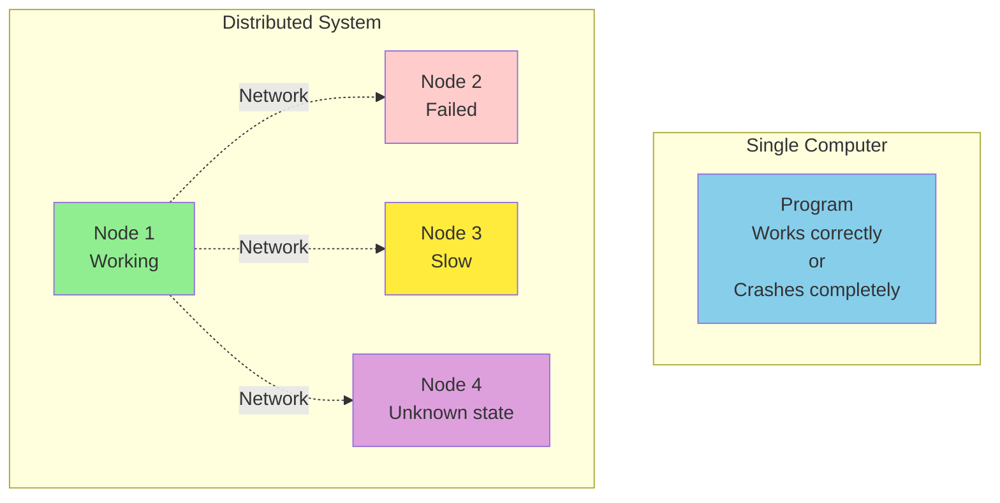

This chapter explores the harsh realities of distributed systems - all the things that can go wrong, and what we can (and cannot) do about them. We cover unreliable networks, unreliable clocks, process pauses, the philosophical questions of distributed knowledge, and finally some techniques for coping with all this messiness.

---

## 1. Faults and Partial Failures

On a single computer, software is normally either fully functional or entirely broken - not somewhere in between. If the hardware works, the same operation always produces the same result (it is deterministic). If the hardware has a problem (memory corruption, loose connector), the consequence is usually a total system failure: kernel panic, blue screen of death, or failure to start up.

This is a deliberate design choice. If an internal fault occurs, we prefer a computer to crash completely rather than returning a wrong result, because wrong results are difficult and confusing to deal with.

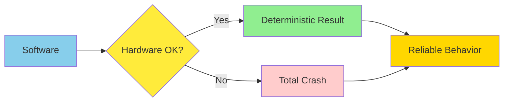

When you write software that runs on several computers connected by a network, the situation is fundamentally different. **Faults** occur much more frequently, so we can no longer ignore them - we have no choice but to confront the messy reality of the physical world.

> "I've dealt with long-lived network partitions in a single data center (DC), PDU failures, switch failures, accidental power cycles of whole racks, whole-DC backbone failures, whole-DC power failures, and a hypoglycemic driver smashing his Ford pickup truck into a DC's HVAC system."
> — Coda Hale

### Partial Failures

In a distributed system, there may well be some parts of the system that are broken in an unpredictable way, even though other parts of the system are working fine. This is known as a **partial failure**. The difficulty is that partial failures are **nondeterministic**: if you try to do anything involving multiple nodes and the network, it may sometimes work and sometimes unpredictably fail.

| Aspect | Single Computer | Distributed System |
|--------|----------------|-------------------|
| Behavior | Deterministic | Nondeterministic |
| Failure mode | Total failure | Partial failure |
| State | Always known | Unknown |
| Timing | Predictable | Variable |

```python
# Single-computer function: deterministic
def deterministic_calculate(x: int, y: int) -> int:
    """Same input always produces the same output."""
    return x + y

# Distributed operation: nondeterministic
def distributed_operation() -> str:
    """May succeed, fail silently, or hang indefinitely.
    The caller has no way to know which happened."""
    try:
        response = send_request_to_remote_node()
        return response.decode()
    except TimeoutError:
        # Was the request lost? Was the response lost?
        # Is the remote node crashed or just slow?
        # We don't know - and we may never know.
        return "unknown"
```

This nondeterminism and possibility of partial failures is what makes distributed systems hard to work with. On the other hand, if a distributed system can tolerate partial failures, that opens up powerful possibilities - for example, we can perform a rolling upgrade, rebooting one node at a time to install software updates while the system as a whole continues working uninterrupted. **Fault tolerance** therefore allows us to make distributed systems more reliable than single-node systems; we can build a reliable system from unreliable components.

> "In distributed systems, suspicion, pessimism, and paranoia pay off."

### Knowledge Is a Guess

A node in the network cannot know anything for sure about other nodes - it can only make guesses based on the messages it receives (or doesn't receive). A node can find out another node's state only by exchanging messages with it. If a remote node doesn't respond, there is no way of knowing its state. Fortunately, we don't need to resolve the philosophical questions this raises: we can **state the assumptions** we are making about behavior (the system model, discussed in §11) and design the actual system in such a way that it meets those assumptions. Algorithms can be proved to function correctly within a certain system model, so reliable behavior is achievable even if the underlying model provides very few guarantees.

---

## 2. Unreliable Networks

Distributed systems we focus on in this book are mostly **shared-nothing systems**: a bunch of machines connected by a network. The network is the only way these machines can communicate. We assume that each machine has its own memory and disk, and one machine cannot access another machine's memory or disk except by making requests to a service over the network.

The internet and most internal networks in datacenters (often Ethernet) are **asynchronous packet networks**. In this kind of network, one node can send a message (a packet) to another node, but the network gives no guarantees as to when it will arrive or whether it will arrive at all.

### What Can Go Wrong with a Request?

If you send a request and expect a response, many things could go wrong:

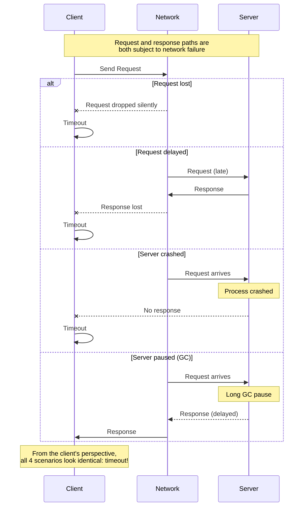

The sender can't even tell whether the packet was delivered. The only option is for the recipient to send a response message, which may in turn be lost or delayed. These issues are indistinguishable in an asynchronous network.

### The Usual Solution: Timeouts

The usual way of handling this issue is a **timeout**: after some time, you give up waiting and assume that the response is not going to arrive. However, when a timeout occurs, you still don't know whether the remote node got your request (and if the request is still queued somewhere, it may still be delivered to the recipient, even if you've given up).

```python
import time
from typing import Optional, Callable, TypeVar

T = TypeVar("T")

def call_with_timeout(
    operation: Callable[[], T],
    timeout_seconds: float
) -> Optional[T]:
    """Execute an operation with a timeout.
    Returns None on timeout - but we cannot tell
    whether the operation completed server-side."""
    start = time.monotonic()
    try:
        result = operation()
        elapsed = time.monotonic() - start
        if elapsed > timeout_seconds:
            return None  # We didn't time out, but it took too long
        return result
    except TimeoutError:
        return None
    # We have NO way of knowing if the operation
    # actually succeeded on the remote end!
```

### The Limitations of TCP

Most applications use **TCP**, the Transmission Control Protocol, to establish a connection that breaks large data streams into individual packets and puts them back together again on the receiving side. TCP is often described as providing "reliable" delivery:

- Detects and retransmits dropped packets
- Detects reordered packets and puts them back in order
- Detects packet corruption by using a simple checksum
- Implements congestion control / flow control / backpressure

So if TCP provides "reliability," does that mean we no longer need to worry about networks being unreliable? **Unfortunately not.**

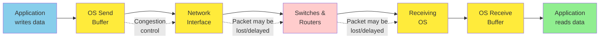

TCP decides that a packet must have been lost if no acknowledgment arrives within a certain timeout, but it can't tell whether it was the outbound packet or the acknowledgment that was lost. Eventually, after a configurable timeout, it gives up and signals an error to the application.

**Key limitations:**
- TCP's deduplication and retransmission capabilities apply to only a single connection
- If the application reconnects and retransmits, data could be duplicated
- If a TCP connection is closed with an error, you have no way of knowing how much data was actually processed by the remote node
- Even an acknowledgment that a packet was delivered means only that the OS kernel on the remote node received it; the application may have crashed before it handled that data

> "If you want to be sure that a request was successful, you need a positive response from the application itself." — Saltzer, Reed, and Clark

---

## 3. Network Faults in Practice

We have been building computer networks for decades - one might hope that by now we would have figured out how to make them reliable. **Unfortunately, we have not yet succeeded.** Network problems are surprisingly common, even in controlled environments:

| Study / Observation | Finding |
|---------------------|---------|
| Medium-sized DC study | ~12 network faults per month; half disconnect a single machine, half disconnect a rack |
| Component failure rates | Adding redundant gear doesn't reduce faults as much as expected (misconfiguration is major cause) |
| Wide-area fiber | Outages blamed on cows, beavers, and sharks |
| Cross-cloud latency | Round-trip times of several minutes observed at high percentiles |
| Intra-DC | Packet delays of more than a minute during switch software upgrades |
| Partial partitions | A can reach B, B can reach C, but A cannot reach C |
| Asymmetric faults | Network interface drops all inbound but sends outbound successfully |
| Repurcussions | A brief interruption can have repercussions lasting much longer than the original issue |

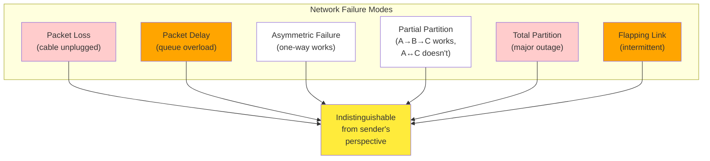

The term **network partition** (or netsplit) is sometimes used when one part of the network is cut off from the rest because of a network fault. Network partitions are not related to sharding of a storage system, which is sometimes also called partitioning.

If the error handling of network faults is not defined and tested, arbitrarily bad things could happen - for example, the cluster could become deadlocked and permanently unable to serve requests even when the network recovers, or it could potentially delete all of your data.

### Handling Network Faults

Handling network faults doesn't necessarily mean tolerating them. If your network is normally fairly reliable, a valid approach may be to simply show an error message to users while your network is experiencing problems. However, you do need to know how your software reacts to network problems and ensure that the system can recover from them. It may make sense to deliberately trigger network problems and test the system's response (see "Fault Injection").

---

## 4. Fault Detection

Many systems need to automatically detect faulty nodes:
- A load balancer needs to stop sending requests to a node that is dead
- In a distributed database with single-leader replication, if the leader fails, one of the followers needs to be promoted

Unfortunately, the uncertainty about the network makes it difficult to tell whether a node is working.

### Feedback Mechanisms

In specific circumstances, you might get feedback to explicitly tell you that something is not working:

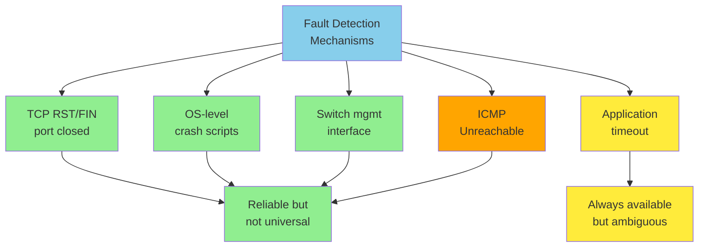

1. **If you can reach the machine** but no process is listening on the destination port (e.g., the process crashed), the operating system will helpfully close or refuse TCP connections by sending an RST or FIN packet
2. **If a node process crashed** but the node's operating system is still running, a script can notify other nodes about the crash. For example, HBase does this
3. **If you have access to switch management interfaces** in your datacenter, you can query them to detect link failures at the hardware level
4. **If a router is sure** the IP address you're trying to connect to is unreachable, it may reply with an ICMP Destination Unreachable packet

Rapid feedback about a remote node being down is useful, but you can't count on it. If something has gone wrong, you may get an error response at some level of the stack, but in general you have to assume that you will get no response at all. You can retry a few times, wait for a timeout to elapse, and eventually declare the node dead if you don't hear back within the timeout.

### False Positives vs. False Negatives

Since the node could actually be alive, you need to strike a balance:
- **Too short a timeout** → alive nodes are incorrectly suspected to be dead (false positives)
- **Too long a timeout** → unnecessary delays waiting for dead nodes (false negatives)

---

## 5. Timeouts and Unbounded Delays

If a timeout is the only sure way of detecting a fault, then how long should the timeout be? There is unfortunately no simple answer.

| Timeout | Effect |
|---------|--------|
| Too long | Long wait until a node is declared dead; users may have to wait or see error messages |
| Too short | Detects faults faster but higher risk of incorrectly declaring a node dead when it has only suffered a temporary slowdown |

Prematurely declaring a node dead is problematic. If the node is actually alive and in the middle of performing an action (e.g., sending an email), and another node takes over, the action may end up being performed twice.

When a node is declared dead, its responsibilities need to be transferred to other nodes, which places additional load on those nodes and the network. If the system is already struggling with high load, declaring nodes dead prematurely can make the problem worse - in the extreme case, all nodes declare each other dead, and everything stops working (a **cascading failure**).

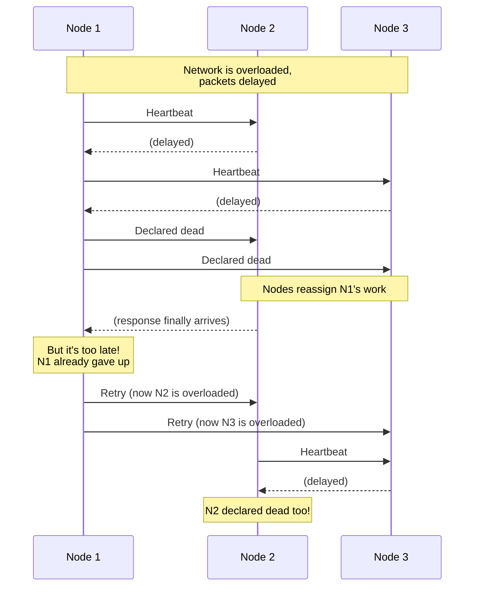

### A Fictitious Bounded-Delay Network

Imagine a system with a network that guarantees a maximum delay for packets. Every packet is either delivered within time `d` or lost, and delivery never takes longer than `d`. Furthermore, assume that you can guarantee that a non-failed node always handles a request within time `r`. In this case, you could guarantee that every successful request receives a response within time `2d + r`.

**Unfortunately, most systems we work with have neither of those guarantees.** Asynchronous networks have unbounded delays, and most server implementations cannot guarantee that they can handle requests within a maximum time.

### Network Congestion and Queueing

The variability of packet delays on computer networks is most often due to queueing:

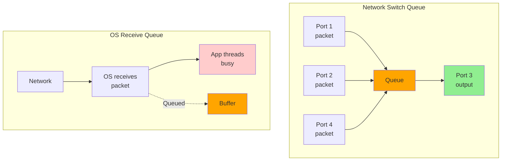

- **Network switch queueing**: If several nodes simultaneously try to send packets to the same destination, the network switch must queue them up. If the switch queue fills up, the packet is dropped and must be resent
- **OS queueing**: When a packet reaches the destination machine, if all CPU cores are currently busy, the incoming request from the network is queued by the OS
- **VM queueing**: In virtualized environments, a VM is often paused for tens of milliseconds while another VM uses a CPU core, and the incoming data is queued by the VM monitor
- **TCP queueing**: To avoid overloading the network, TCP limits the rate at which it sends data, causing additional queueing at the sender

### TCP Versus UDP

Some latency-sensitive applications, such as videoconferencing and Voice over IP (VoIP), use UDP rather than TCP. This choice is a trade-off between reliability and variability of delays: UDP does not perform flow control and does not retransmit lost packets, avoiding some reasons for variable network delays.

UDP is a good choice when **delayed data is worthless**. In a VoIP call, there probably isn't enough time to retransmit a lost packet before its data is due to be played - the application must fill the missing packet's time slot with silence and move on.

### Synchronous Versus Asynchronous Networks

Datacenter networks would be a lot simpler if we could rely on them to deliver packets with a fixed maximum delay and to not drop packets. The historical reason this is hard: traditional **fixed-line telephone networks** are circuit-switched (a circuit reserves a fixed amount of bandwidth for the duration of a call), whereas Ethernet and IP are packet-switched - they opportunistically use whatever bandwidth is available, which is why queueing and unbounded delays occur. Latency guarantees are achievable if resources are statically partitioned, but those guarantees come at the cost of reduced utilization, which makes them more expensive.

---

## 6. Unreliable Clocks

Clocks and time are important. Applications depend on clocks in various ways:

| Question Type | Examples |
|---------------|----------|
| **Durations** | Has this request timed out yet? What's the 99th percentile response time? How many queries per second? How long did the user spend on our site? |
| **Points in time** | When was this article published? At what time should the reminder email be sent? When does this cache entry expire? What is the timestamp on this error message? |

In a distributed system, time is a tricky business, because communication is not instantaneous; it takes time for a message to travel across the network from one machine to another. The time when a message is received is always later than the time when it was sent, but because of variable delays, we don't know how much later.

Moreover, each machine has its own clock - a hardware device, usually a **quartz crystal oscillator**. These devices are not perfectly accurate, so each machine has its own notion of time, which may be slightly faster or slower than on other machines. It is possible to synchronize clocks using **Network Time Protocol (NTP)**.

### Monotonic Versus Time-of-Day Clocks

Modern computers have at least two kinds of clocks:

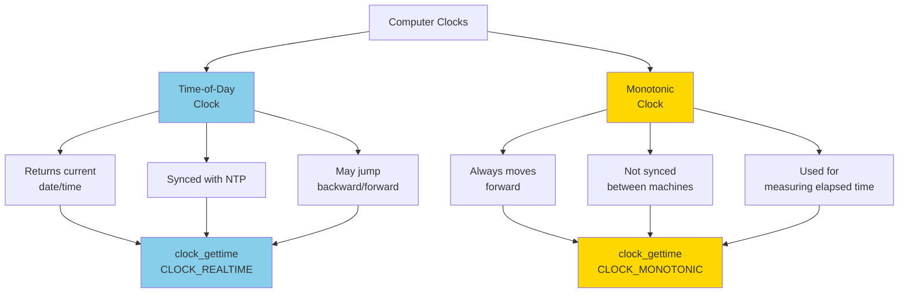

**Time-of-day clocks** return the current date and time (also known as wall-clock time). For example, `clock_gettime(CLOCK_REALTIME)` on Linux and `System.currentTimeMillis` in Java return the number of seconds since midnight UTC on January 1, 1970.

**Monotonic clocks** are suitable for measuring a duration (time interval), such as a timeout. `clock_gettime(CLOCK_MONOTONIC)` on Linux and `System.nanoTime` in Java. The name comes from the fact that this clock is guaranteed to always move forward.

```python
import time
from typing import Optional

class Clock:
    """Demonstrates the difference between time-of-day and monotonic clocks."""

    def now_wall(self) -> float:
        """Time-of-day clock: may jump backward/forward.
        Use for timestamps that need to make sense to humans."""
        return time.time()  # seconds since epoch

    def elapsed(self, start: float) -> float:
        """Compute elapsed time using a monotonic clock reference.
        Safe from clock jumps."""
        return time.monotonic() - start

    def measure_timeout(self, deadline_seconds: float) -> bool:
        """Reliable timeout check using monotonic clock."""
        deadline = time.monotonic() + deadline_seconds
        # ... do some work ...
        return time.monotonic() >= deadline
```

**Key insight**: In a distributed system, using a monotonic clock for measuring elapsed time (e.g., timeouts) is usually fine, because it doesn't assume any synchronization between different nodes' clocks and is not sensitive to slight inaccuracies of measurement.

### Clock Skew vs. Clock Drift

Two distinct issues affect distributed clocks. **Clock skew** is the instantaneous difference between two clocks at a given point in time (e.g., 3 ms apart). **Clock drift** is the rate at which a clock deviates from the true time - a 200 ppm drift means the clock gains or loses 200 microseconds per second.

Google assumes a clock drift of up to **200 ppm** for its servers, equivalent to:
- 6 ms drift for a clock resynchronized every 30 seconds
- 17-second drift for a clock resynchronized once a day

### Clock Synchronization and Accuracy

Our methods for getting a clock to tell the correct time aren't nearly as reliable or accurate as you might hope:

| Source of Inaccuracy | Impact |
|---------------------|--------|
| Quartz clock drift | Up to 200 ppm |
| NTP reset | Time can jump backward or forward |
| Firewall blocking NTP | Drift accumulates unnoticed |
| Network congestion | Best-case error ~35 ms; spikes can reach a second |
| Misconfigured servers | Servers may report time off by hours |
| Leap seconds | 59 or 61-second minutes crash unpatched systems |
| VM clock virtualization | Clock jumps forward during VM pauses |
| Untrusted devices | Users deliberately set incorrect times |

```python
import time
from datetime import datetime, timezone
from typing import Tuple

class ClockReader:
    """Reads a clock and exposes its confidence interval.
    This is what systems like Google Spanner do via TrueTime API."""

    def __init__(self, last_sync_offset: float = 0.001, drift_rate: float = 200e-6):
        self.last_sync_offset = last_sync_offset  # seconds
        self.drift_rate = drift_rate  # parts per million
        self.last_sync_time = time.monotonic()

    def get_time_with_confidence(self) -> Tuple[float, float, float]:
        """Returns (earliest, latest, now) representing the confidence interval.
        The actual current time is somewhere between earliest and latest."""
        now = time.time()
        elapsed = time.monotonic() - self.last_sync_time
        uncertainty = self.last_sync_offset + self.drift_rate * elapsed
        earliest = now - uncertainty
        latest = now + uncertainty
        return earliest, latest, now

    def happens_before(self, other_interval: Tuple[float, float]) -> bool:
        """Check if our latest time is earlier than the other's earliest.
        If true, this event definitely happened before the other."""
        _, our_latest, _ = self.get_time_with_confidence()
        other_earliest = other_interval[0]
        return our_latest < other_earliest

# Example usage
reader1 = ClockReader()
reader2 = ClockReader()

interval1 = reader1.get_time_with_confidence()
interval2 = reader2.get_time_with_confidence()

# We can only be sure of ordering if intervals don't overlap
```

Achieving very good clock accuracy is possible if you care about it sufficiently. For example, the **MiFID II** European regulation for financial institutions requires all high-frequency trading funds to synchronize their clocks to within **100 microseconds** of UTC. Such accuracy can be achieved with special hardware (GPS receivers and/or atomic clocks), the Precision Time Protocol (PTP), and careful deployment.

### Relying on Synchronized Clocks

The problem with clocks is that while they seem simple and easy to use, they have a surprising number of pitfalls. A day may not have exactly 86,400 seconds, time-of-day clocks may move backward in time, and the time according to one node's clock may be quite different from another node's clock.

Incorrect clocks easily go unnoticed. If a machine's CPU is defective or its network is misconfigured, it most likely won't work at all, so the issue will quickly be spotted. On the other hand, if its quartz clock is defective or its NTP client is misconfigured, most things will seem to work fine, even though its clock gradually drifts further and further away from reality. The result is more likely to be **silent and subtle data loss** than a dramatic crash.

> "If you use software that requires synchronized clocks, it is essential that you carefully monitor the clock offsets between all the machines in your cluster. Any node whose clock drifts too far from the others should be declared dead and removed."

### Timestamps for Ordering Events

Let's consider one particular situation in which it is tempting, but dangerous, to rely on clocks: ordering of events across multiple nodes. Consider two clients writing to a distributed database with multi-leader replication:

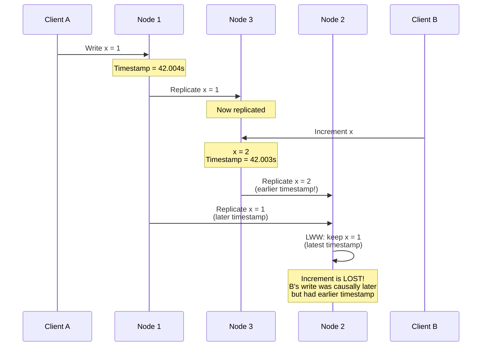

In the figure, client A writes `x = 1` on node 1; the write is replicated to node 3; client B increments x on node 3 (`x = 2`); and finally both writes are replicated to node 2. The write `x = 1` has a timestamp of **42.004 seconds**, but the write `x = 2` has a timestamp of **42.003 seconds**. The write by client B is causally later than the write by client A, but B's write has an earlier timestamp.

When node 2 receives these two events using **last write wins (LWW)**, it will incorrectly conclude that `x = 1` is the more recent value and drop the write `x = 2`, so the increment is lost.

**Problems with timestamp-based ordering**:
- Database writes can mysteriously disappear (a node with a lagging clock is unable to overwrite values)
- LWW cannot distinguish between writes that occurred sequentially and writes that were truly concurrent
- Two nodes could independently generate writes with the same timestamp

### Clock Readings with a Confidence Interval

You may be able to read a machine's time-of-day clock with microsecond or even nanosecond resolution. But even if you can get such a fine-grained measurement, that doesn't mean the value is actually accurate to such precision.

It doesn't make sense to think of a clock reading as a point in time. It is more like a range of times, within a **confidence interval** - for example, a system may be 95% confident that the time now is between 10.3 and 10.5 seconds past the minute, but it doesn't know any more precisely than that.

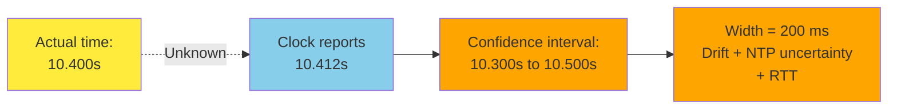

The **TrueTime API** in Google Spanner and Amazon ClockBound explicitly report the confidence interval on the local clock. When you ask it for the current time, you get back two values: `[earliest, latest]`, which are the earliest possible and latest possible timestamp.

### TrueTime and Spanner's Snapshots

Spanner implements snapshot isolation across datacenters using TrueTime, based on the following observation: if you have two confidence intervals `A = [A_earliest, A_latest]` and `B = [B_earliest, B_latest]`, and those two intervals do not overlap (`A_latest < B_earliest`), then B definitely happened after A - there can be no doubt.

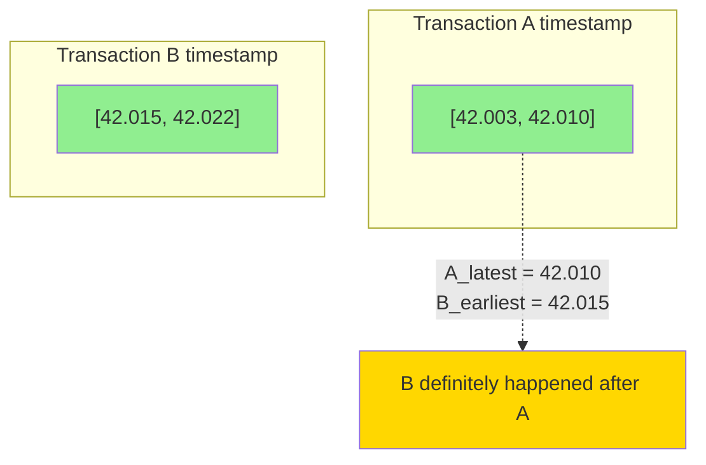

To ensure that transaction timestamps reflect causality, Spanner deliberately **waits for the length of the confidence interval** before committing a read/write transaction. By doing so, it ensures that any transaction that may read the data is at a sufficiently later time that their confidence intervals do not overlap. To keep the wait time as short as possible, Spanner keeps the clock uncertainty as small as possible - Google deploys a GPS receiver or atomic clock in each datacenter, allowing clocks to be synchronized to within about 7 ms.

```python
class SpannerLikeCommit:
    """Simplified Spanner commit protocol using TrueTime-style confidence intervals."""

    def __init__(self, clock_reader):
        self.clock = clock_reader

    def commit(self, transaction_data) -> Tuple[float, float]:
        """Get a timestamp and wait for confidence interval to elapse."""
        earliest, latest, _ = self.clock.get_time_with_confidence()
        commit_ts = latest  # Use the latest possible time as the commit timestamp

        # Wait until the earliest possible time has passed
        # This guarantees that no later transaction can have
        # an overlapping confidence interval
        now = time.time()
        if now < earliest:
            time.sleep(earliest - now)

        return (earliest, latest)  # Return the interval as the commit timestamp
```

---

## 7. Process Pauses

Let's consider another example of dangerous clock use in a distributed system. Say you have a database with a single leader per shard. Only the leader is allowed to accept writes. How does a node know that it is still leader?

One option is for the leader to obtain a **lease** from the other nodes. The leader must renew the lease before it expires:

```python
# A naive lease-renewal loop - DO NOT USE IN PRODUCTION
while True:
    request = get_incoming_request()

    # Ensure lease has at least 10 seconds remaining
    if lease.expiry_time_millis - current_time_millis() < 10_000:
        lease = lease.renew()

    if lease.is_valid():
        process(request)
```

**What's wrong with this code?**

1. **It relies on synchronized clocks**: The expiry time on the lease is set by a different machine. If the clocks are out of sync by more than a few seconds, the code will start doing strange things.

2. **Even if we change to a monotonic clock**, the code assumes that very little time passes between checking the time and processing the request. What if an unexpected pause occurs in the execution?

Imagine the thread stops for 15 seconds around the line that calls `lease.is_valid()`. The lease will have expired by the time the request is processed, and another node will already have taken over as leader. However, there is nothing to tell this thread that it was paused for so long - the code won't notice that the lease has expired until the next iteration, by which time it may have already done something unsafe.

### Causes of Process Pauses

Is it reasonable to assume that a thread might be paused for so long? **Unfortunately, yes.** Reasons include:

| Cause | Description |
|-------|-------------|
| **Thread contention** | Contention among threads accessing a shared resource, such as a lock or queue |
| **Garbage collection** | "Stop-the-world" GC pauses used to last for minutes; modern algorithms are better but still noticeable |
| **VM suspension** | A VM can be suspended (pausing the execution of all processes and saving memory to disk) and resumed later |
| **End-user device** | Laptops and phones may suspend arbitrarily (closing the lid) |
| **OS context switching** | When the OS context-switches to another thread, the current thread can be paused at any arbitrary point |
| **Synchronous disk I/O** | A thread may be paused waiting for a slow disk I/O operation (even the Java classloader lazily loads class files) |
| **Paging/swapping** | A simple memory access may result in a page fault requiring disk I/O |
| **SIGSTOP signal** | A Unix process can be paused by sending it the SIGSTOP signal (Ctrl-Z) |

All these occurrences can preempt the running thread at any point and resume it at a later time, without the thread even noticing. The problem is similar to making multithreaded code on a single machine thread-safe; you can't assume anything about timing.

> "A node in a distributed system must assume that its execution can be paused for a significant length of time at any point, even in the middle of a function. During the pause, the rest of the world keeps moving and may even declare the paused node dead."

### Providing Response Time Guarantees

In many programming languages and operating systems, threads and processes may pause for an unbounded amount of time. However, those reasons for pausing can be eliminated if you try hard enough.

Some software runs in environments where a failure to respond within a specified time can cause serious damage. Computers that control aircraft, rockets, robots, and cars must respond quickly and predictably to their sensor inputs. In these so-called **hard real-time systems**, the software must respond by a specified deadline; failure to meet the deadline may cause a failure of the entire system.

For example, if your car's onboard sensors detect that you are currently experiencing a crash, you wouldn't want the release of the airbag to be delayed because of an inopportune GC pause.

Providing real-time guarantees requires support from all levels of the software stack:
- A real-time operating system (RTOS) that allows processes to be scheduled with guaranteed CPU time
- Library functions must document their worst-case execution times
- Dynamic memory allocation may be restricted or disallowed entirely
- Real-time garbage collectors exist, but the application must ensure it doesn't give the GC too much work
- An enormous amount of testing and measurement is required

> "Real-time is not the same as high-performance. Real-time systems may have lower throughput, since they have to prioritize timely responses above all else."

For most server-side data processing systems, real-time guarantees are simply not economical or appropriate. These systems must suffer the pauses and clock instability that come from operating in a non-real-time environment.

### Limiting the Impact of Garbage Collection

If you need to avoid GC pauses, one option is to use a language that doesn't have a garbage collector. Swift uses automatic reference counting; Rust and Mojo track object lifetimes via the type system.

It's also possible to use a garbage-collected language while mitigating pauses:

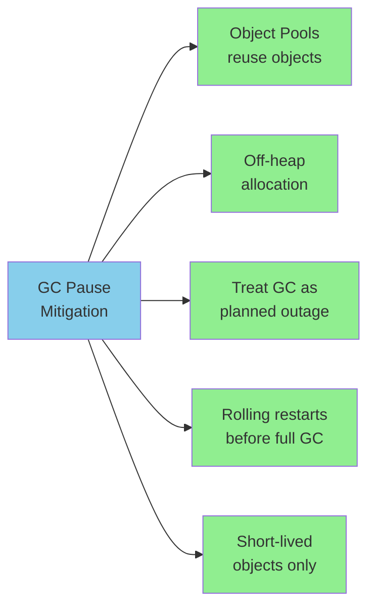

A more extreme approach is to treat GC pauses like brief planned outages of a node and let other nodes handle requests from clients while one node is collecting its garbage. If the runtime can warn the application that a node soon requires a GC pause, the application can stop sending new requests to that node, wait for it to finish processing outstanding requests, and then perform the GC while no requests are in progress. This trick hides GC pauses from clients and reduces the high percentiles of the response time.

---

## 8. The Majority Rules

Imagine a network with an asymmetric fault: a node is able to receive all messages sent to it, but any outgoing messages from that node are dropped or delayed. Even though that node is working perfectly well and is receiving requests from other nodes, the other nodes cannot hear its responses. After a timeout, the other nodes declare it dead.

> "The situation unfolds like a nightmare - the semi-disconnected node is dragged to the graveyard, kicking and screaming 'I'm not dead!' - but since nobody can hear its screaming, the funeral procession continues with stoic determination."

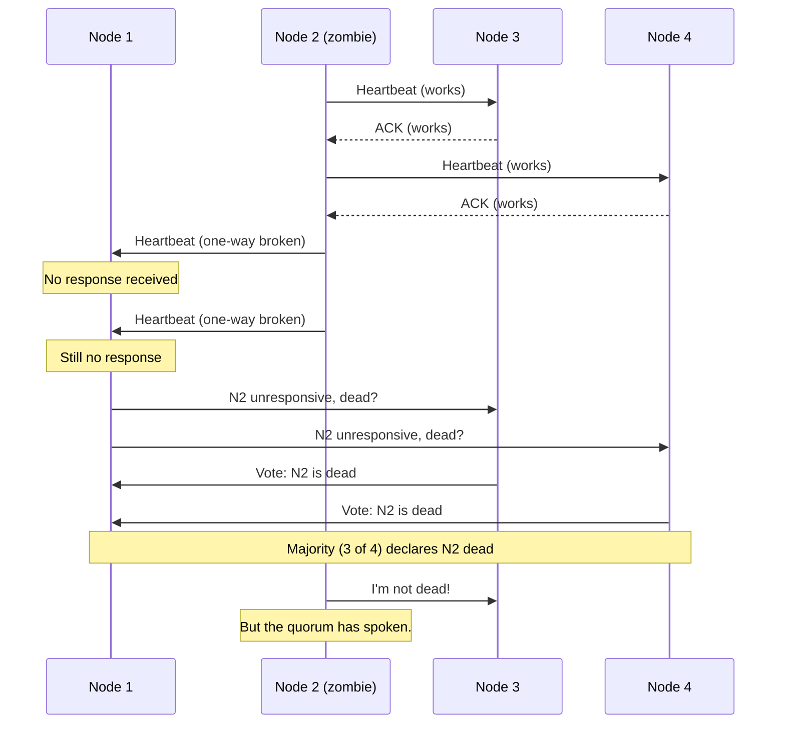

The moral of these stories is that **a node cannot necessarily trust its own judgment of a situation**. A distributed system cannot exclusively rely on a single node, because a node may fail at any time, potentially leaving the system stuck and unable to recover. Instead, many distributed algorithms rely on a **quorum** (voting among the nodes): decisions require a minimum number of votes from several nodes.

If a quorum of nodes declares another node dead, then it must be considered dead, even if that node still very much feels alive. The individual node must abide by the quorum decision and step down.

Most commonly, the quorum is an absolute majority of more than half the nodes:

| Cluster Size | Tolerance |
|-------------|-----------|
| 3 nodes | 1 faulty |
| 5 nodes | 2 faulty |
| 7 nodes | 3 faulty |

A majority quorum allows the system to continue working if a minority of nodes are faulty. It is also safe, because there can be only one majority in the system.

---

## 9. Distributed Locks and Leases

> **See also:** Chapter 10 (Consistency and Consensus) is the canonical home for **fencing tokens**, **lock services** (Chubby, ZooKeeper, etcd, Consul), and the full equivalence proof between fencing and consensus. This section gives the motivating case; Chapter 10 covers the protocols.

Locks and leases in distributed applications are prone to misuse and are a common source of bugs. Let's look at one particular case of how they can go wrong.

A **lease** is a kind of lock that times out and can be assigned to a new owner if the old owner stops responding (perhaps because it crashed, paused for too long, or was disconnected from the network).

```mermaid
graph TB
    A[Use Cases for Leases] --> L1[Only one leader<br/>per shard]
    A --> L2[Only one writer<br/>per resource]
    A --> L3[Only one worker<br/>per job input]

    L1 --> C[Split brain<br/>prevention]
    L2 --> C
    L3 --> W[Wasted compute<br/>(minor)]
    C --> D[Data loss or<br/>corruption]
```

It is worth thinking carefully about what happens if several nodes simultaneously believe that they hold the lease. In some cases, the consequence is only wasted computational resources, which is not a big deal. But in others, the consequence could be lost or corrupted data.

### The Classic Lock Bug

Consider a data corruption bug due to an incorrect implementation of locking (not theoretical - HBase used to have this problem):

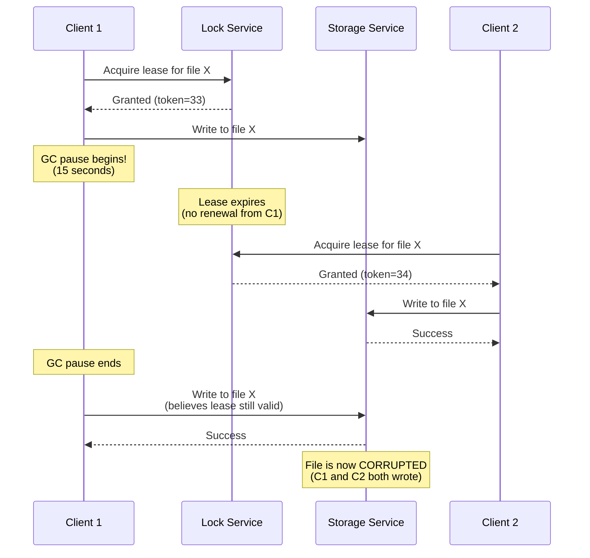

The problem: if the client holding the lease is paused for too long, its lease expires. Another client can then obtain a lease for the same file and start writing to the file. When the paused client comes back, it believes (incorrectly) that it still has a valid lease and continues writing. We now have a **split-brain** situation: the clients' writes clash and corrupt the file.

### Fencing Off Zombies

The term **zombie** is sometimes used to describe a former leaseholder that has not yet found out that it lost the lease and is still acting as if it were the current leaseholder. Since we cannot rule out zombies entirely, we have to instead ensure that they can't do any damage in the form of split brain. This is called **fencing off the zombie**.

Some systems attempt to fence off zombies by shutting them down - for example, by disconnecting them from the network, shutting down the VM, or physically powering down the machine (sometimes known as "shoot the other node in the head" or STONITH). This approach is not particularly effective: it does not protect against large network delays, all the nodes could shut one another down, and by the time a zombie has been detected and shut down, it may be too late.

A more robust fencing solution is **fencing tokens** (full treatment in Chapter 10):

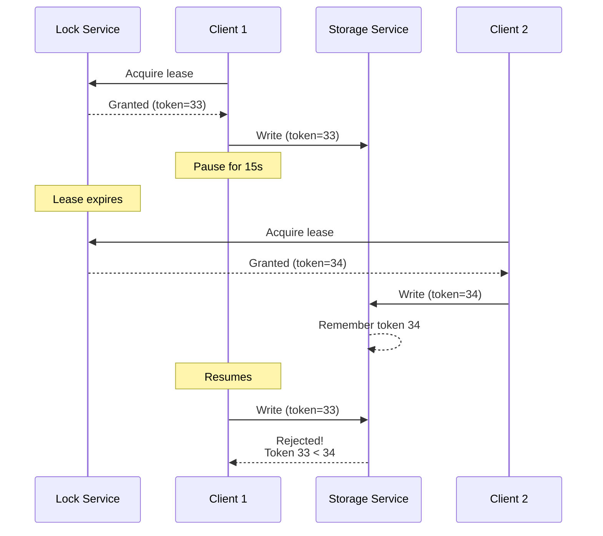

Every time the lock service grants a lock or lease, it also returns a **fencing token**, which is a number that increases every time a lock is granted. Every time a client sends a write request to the storage service, it must include its current fencing token. The storage service remembers the highest token it has seen and rejects requests with lower tokens.

```python
import threading
from typing import Dict, Optional

class FencedStorageService:
    """Storage service that rejects writes from outdated leaseholders."""

    def __init__(self):
        self._lock = threading.Lock()
        self._highest_token: Dict[str, int] = {}  # resource -> highest token

    def write(self, resource: str, fencing_token: int, data: any) -> bool:
        """Write data only if the fencing token is higher than any seen before."""
        with self._lock:
            current = self._highest_token.get(resource, 0)
            if fencing_token <= current:
                # Reject: zombie leaseholder with outdated token
                return False
            # Persist the write
            self._highest_token[resource] = fencing_token
            # ... actually write data ...
            return True

class FencedLockService:
    """Lock service that monotonically increases fencing tokens."""

    def __init__(self):
        self._lock = threading.Lock()
        self._next_token = 0
        self._leases: Dict[str, int] = {}  # resource -> current token

    def acquire(self, resource: str) -> Optional[int]:
        """Acquire a lease for the resource. Returns the fencing token."""
        with self._lock:
            self._next_token += 1
            token = self._next_token
            self._leases[resource] = token
            return token

# Usage
storage = FencedStorageService()
locks = FencedLockService()

# Client 1 gets token 33, pauses, Client 2 gets token 34
client1_token = locks.acquire("file-X")
client2_token = locks.acquire("file-X")
assert client2_token > client1_token

# Client 2's write succeeds
storage.write("file-X", client2_token, data="from-client-2")

# Client 1's zombie write is rejected
success = storage.write("file-X", client1_token, data="from-client-1")
assert not success, "Zombie write was incorrectly accepted!"
```

In Chubby, Google's lock service, they are called **sequencers**; in Kafka they are called **epoch numbers**; in consensus algorithms, the **ballot number** (Paxos) or **term number** (Raft) serves a similar purpose.

### Fencing with Multiple Replicas

You can use fencing tokens with multiple replicas and ensure that the old leaseholder is fenced off on all of them. For example, with a leaderless replicated key-value store with LWW conflict resolution, you can put the writer's fencing token in the most significant bits of the timestamp:

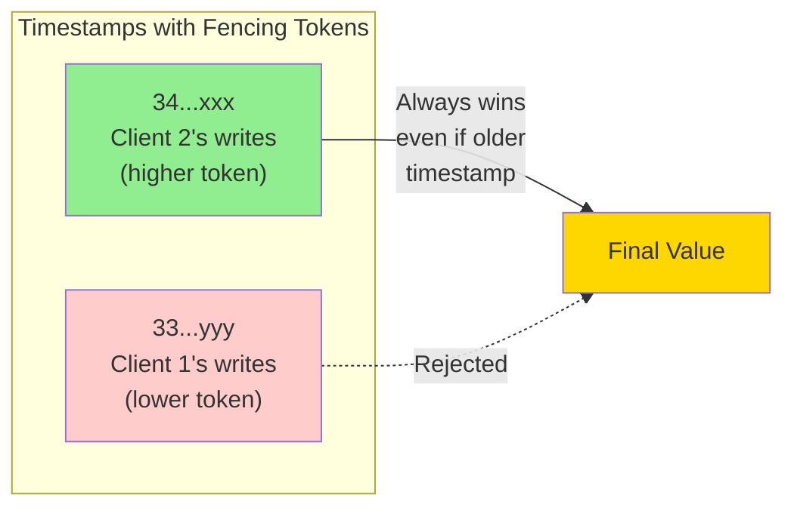

Even if a zombie client later tries to write, its write may succeed at some replicas, but a subsequent quorum read will prefer the write from the new leaseholder with the greater timestamp, and read repair will eventually overwrite the value written by the old leaseholder.

### The Redlock Critique

A widely deployed distributed locking algorithm is **Redlock**, used by Redis. Martin Kleppmann published a famous critique arguing that Redlock is unsafe. Here's the core of the issue:

```python
import time
import uuid
from typing import Optional

class RedlockBug:
    """Illustration of the safety issue with Redlock-style locking.
    Based on Kleppmann's 2016 critique."""

    def __init__(self):
        self.lease_duration_ms = 10_000  # 10-second lease
        self.network_delay = 30_000     # GC pause + slow network

    def acquire_then_work(self, client_id: str) -> bool:
        """Simulates a client acquiring a Redlock then doing work."""
        # Client acquires lock at t=0
        lock_valid_until = time.monotonic() + self.lease_duration_ms / 1000.0

        # ... GC pause for 30 seconds! ...
        time.sleep(self.network_delay)

        # Client resumes; checks "is my lock still valid?"
        # Per Redlock: the lock has expired (TTL was 10s, elapsed 30s)
        # Per the client's local intuition: it acquired the lock, so it owns it

        if time.monotonic() < lock_valid_until:
            # Client believes it still holds the lock
            # But another client may have acquired it already!
            return True  # UNSAFE: assumes mutual exclusion
        else:
            return False
```

The fundamental issue is that Redlock makes **synchronous assumptions** about timing in an **asynchronous system**. If you can't bound GC pauses + network delays + clock skew to be less than the lease duration, mutual exclusion cannot be guaranteed.

**Better alternatives:**
- For correctness-critical use cases, use a **consensus system** (ZooKeeper, etcd, Consul) with proper fencing tokens
- For many use cases, you don't actually need a lock - consider alternatives like CAS operations or single-writer patterns

> "If you need a lock for efficiency, Redlock is fine. If you need a lock for correctness, don't use Redlock." — paraphrased from Kleppmann

---

## 10. Byzantine Faults

Fencing tokens can detect and block a node that is inadvertently acting in error (e.g., because it hasn't yet found out that its lease has expired). However, if the node deliberately wanted to subvert the system's guarantees, it could easily do so by sending messages with a fake fencing token.

In this book we assume that nodes are **unreliable but honest**. They may be slow or never respond, and their state may be outdated, but we assume that if a node does respond, it is telling the "truth." Distributed systems problems become much harder if there is a risk that nodes may "lie" - send arbitrary faulty or corrupted responses. Such behavior is known as a **Byzantine fault**, and the problem of reaching consensus in this untrusting environment is known as the **Byzantine Generals Problem**.

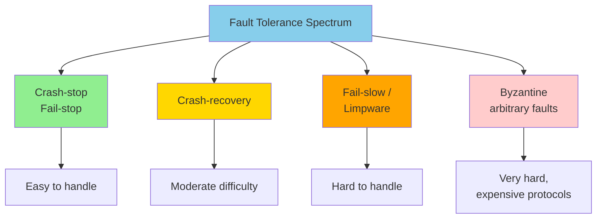

### The Byzantine Generals Problem

The Byzantine Generals Problem is a generalization of the **two generals problem**, which imagines two army generals needing to agree on a battle plan. As they have set up camp at different sites, they can communicate only by messenger, and the messengers sometimes get delayed or lost.

In the Byzantine version, n generals need to agree, and their endeavor is hampered by **traitors in their midst**. Most of the generals are loyal and send truthful messages, but the traitors may try to deceive and confuse the others by sending fake or untrue messages. It is not known in advance who the traitors are.

> "Byzantium was an ancient Greek city that later became Constantinople. There isn't any historic evidence that the generals of Byzantium were any more prone to intrigue and conspiracy than those elsewhere. Rather, the name is derived from Byzantine in the sense of excessively complicated, bureaucratic, devious, which was used in politics long before computers. Lamport wanted to choose a nationality that would not offend any readers, and he was advised that calling it The Albanian Generals Problem was not such a good idea."

### Uses of Byzantine Fault Tolerance

A system is **Byzantine fault-tolerant** if it continues to operate correctly even if some nodes are malfunctioning or if malicious attackers are interfering with the network:

| Domain | Why BFT Matters |
|--------|-----------------|
| Aerospace | Radiation can corrupt memory or CPU registers; flight control systems must tolerate arbitrary behavior |
| Multi-party systems | Participants may attempt to cheat or defraud others |
| Blockchains | Consensus among mutually untrusting parties without a central authority |

However, in the kinds of systems we discuss in this book, we can usually safely assume that there are no Byzantine faults:
- In a datacenter, all nodes are controlled by your organization (so they can be trusted)
- Radiation levels are low enough that memory corruption is not a major problem
- Multitenant systems isolate tenants via firewalls and virtualization, not BFT
- BFT protocols are quite expensive
- Web applications do need to expect malicious client behavior, but typically use input validation, not BFT protocols

```python
# Example: Weak form of "lying" protection - validate message checksums
import hashlib
import hmac
from typing import Optional

class ByzantineDefense:
    """Simple protection against corruption (weak form of BFT)."""

    def __init__(self, secret_key: bytes):
        self.secret_key = secret_key

    def send(self, message: bytes) -> bytes:
        """Attach a MAC to detect corruption or tampering."""
        mac = hmac.new(self.secret_key, message, hashlib.sha256).digest()
        return message + b"|" + mac

    def receive(self, packet: bytes) -> Optional[bytes]:
        """Verify MAC before trusting the message."""
        try:
            message, mac = packet.rsplit(b"|", 1)
        except ValueError:
            return None  # Malformed
        expected = hmac.new(self.secret_key, message, hashlib.sha256).digest()
        if not hmac.compare_digest(mac, expected):
            return None  # Corrupted or tampered
        return message

# NOTE: This is protection against weak forms of "lying" (corruption),
# NOT full Byzantine fault tolerance, which would not withstand a
# determined adversary who knows the key.
```

A bug in the software could be regarded as a Byzantine fault, but if you deploy the same software to all nodes, then a Byzantine fault-tolerant algorithm cannot save you. Most BFT algorithms require a **supermajority** of more than two-thirds of the nodes to be functioning correctly. To use this approach against bugs, you would have to have four independent implementations of the same software.

---

## 11. System Model and Reality

Many algorithms have been designed to solve distributed systems problems. In order to be useful, these algorithms need to tolerate the various faults we discussed. Algorithms must be written in a way that does not depend too heavily on the details of the hardware and software configuration on which they are run. This requires that we **formalize the kinds of faults** that we expect to happen in a system by defining a **system model**, which is an abstraction that describes an algorithm's assumptions.

### Timing Assumptions

With regard to timing assumptions, three system models are in common use:

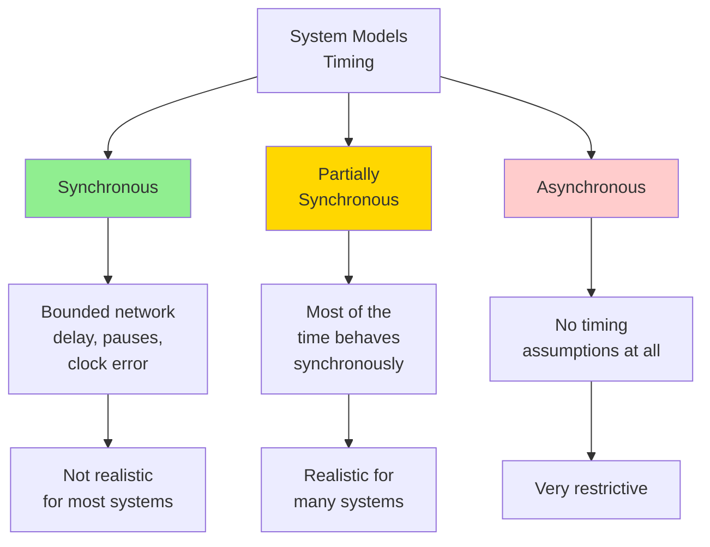

- **Synchronous model**: Assumes bounded network delay, bounded process pauses, and bounded clock error. Not realistic for most practical systems because unbounded delays and pauses do occur.
- **Partially synchronous model**: The system behaves like a synchronous system most of the time, but it sometimes exceeds the bounds. **Realistic model of many systems.**
- **Asynchronous model**: An algorithm is not allowed to make any timing assumptions - it does not even have a clock. Very restrictive.

### Node Failure Models

Besides timing issues, we also have to consider node failures:

| Model | Description |
|-------|-------------|
| **Crash-stop (fail-stop)** | An algorithm may assume that a node can fail in only one way - by crashing. The node may suddenly stop responding at any moment, and thereafter that node is gone forever. |
| **Crash-recovery** | Nodes may crash at any moment, and perhaps start responding again after an unknown time. Nodes have stable storage (nonvolatile disk) preserved across crashes. |
| **Fail-slow / Limping** | Nodes may still respond to health checks while being too slow to get any real work done. Even more difficult than a clean failure. |
| **Byzantine (arbitrary)** | Nodes may do absolutely anything, including trying to trick and deceive other nodes. |

For modeling real systems, the **partially synchronous model with crash-recovery faults** is generally the most useful. It allows for unbounded network delay, process pauses, and slow nodes.

### Correctness Properties

To define what it means for an algorithm to be correct, we describe its **properties**:

```python
# Pseudocode properties for a fencing token algorithm
class FencingTokenProperties:
    """The properties a correct fencing token algorithm must satisfy."""

    def uniqueness(self, token_a: int, token_b: int) -> bool:
        """No two requests for a fencing token return the same value."""
        return token_a != token_b

    def monotonic_sequence(
        self,
        request_x_completed: float,
        request_y_started: float,
        token_x: int,
        token_y: int
    ) -> bool:
        """If request x completed before y began, then token_x < token_y."""
        if request_x_completed < request_y_started:
            return token_x < token_y
        return True  # No ordering guarantee required

    def availability(self, request_sent: float, response_received: bool) -> bool:
        """A node that requests a fencing token and does not crash
        eventually receives a response."""
        if not response_received:
            # Eventually - this is a liveness property
            pass
        return True
```

### Safety vs. Liveness

To clarify the situation, it is worth distinguishing between two kinds of properties:

```mermaid
graph TB
    A[Properties] --> B[Safety]
    A --> C[Liveness]

    B --> B1[Nothing bad<br/>happens]
    B --> B2[Violated at a<br/>specific point in time]
    B --> B3[Cannot be undone<br/>once violated]

    C --> C1[Something good<br/>eventually happens]
    C --> C2[May not hold<br/>at a specific time]
    C --> C3[Hope remains for<br/>future satisfaction]

    style A fill:#87CEEB
    style B fill:#90EE90
    style C fill:#FFD700
```

- **Safety properties**: "Nothing bad happens." If violated, we can point to the specific time it was broken. After a safety property is violated, the violation cannot be undone.
- **Liveness properties**: "Something good eventually happens." May not hold at a certain point in time, but there is always hope that it may be satisfied in the future.

Examples:
- **Safety**: Uniqueness and monotonic sequence of fencing tokens
- **Liveness**: Availability (eventually receives a response)

For distributed algorithms, it is common to require that safety properties always hold, in all possible situations of a system model. Even if all nodes crash, or the entire network fails, the algorithm must nevertheless ensure that it does not return a wrong result. However, with liveness properties we are allowed to make caveats.

### Mapping System Models to the Real World

The theoretical description of an algorithm can declare that certain things are simply assumed not to happen - and in non-Byzantine systems, we do have to make assumptions about faults that can and cannot happen. However, a real implementation may still have to include code to handle the case of something happening that was assumed to be impossible, even if that handling boils down to `printf("Sucks to be you") and exit(666)` - that is, letting a human operator clean up the mess.

> "This is one difference between computer science and software engineering."

That is not to say that theoretical, abstract system models are worthless - quite the opposite. They are incredibly helpful for distilling down the complexity of real systems to a manageable set of faults that we can reason about.

---

## 12. Formal Methods and Randomized Testing

How do we know that an algorithm satisfies the required properties? Because of concurrency, partial failures, and network delays, there are a huge number of potential states. We need to guarantee that the properties hold in every possible state and ensure that we haven't forgotten about any edge cases.

### Model Checking

**Model checkers** are tools that help verify that an algorithm or system behaves as expected. An algorithm specification is written in a purpose-built language such as **TLA+**, **Gallina**, or **FizzBee**. Model checkers then use these models to verify that invariants hold across all of an algorithm's states by systematically trying all the things that could happen.

```tla
\* TLA+ specification sketch: fencing token algorithm
\* Based on Lamport's TLA+ style

VARIABLES tokens, holders, leases

TypeOK ==
    /\ tokens \in [Resources -> Nat]
    /\ holders \in [Resources -> Nodes \union {NULL}]
    /\ leases \in [Resources -> [token: Nat, expires: Nat]]

\* Safety: monotonic sequence
MonotonicTokens ==
    \A r \in Resources:
        \A n1, n2 \in Nodes:
            holders[r] = n1 /\ holders'[r] = n2 /\
            tokens[r] < tokens'[r]

\* Liveness: availability (eventually)
\* Specified using temporal logic: <>(\A r \in Resources: HoldersReady(r))
```

CockroachDB, TiDB, Kafka, and many other distributed systems use model specifications to find and fix bugs. By design, model checkers don't run your actual code, but rather a simplified model that specifies only the core ideas of your protocol - making the state space tractable but risking drift between the spec and the implementation.

### Fault Injection

Many bugs are triggered when machine and network failures occur. **Fault injection** verifies whether a system's implementation works as expected when things go wrong: inject faults into a running system's environment and observe its behavior.

```python
import random
from typing import Callable, TypeVar

T = TypeVar("T")

class FaultInjector:
    """A simple fault injector for testing distributed system code."""

    def __init__(self, failure_rate: float = 0.1):
        self.failure_rate = failure_rate
        self.injected_faults = []

    def maybe_inject_network_failure(self, call: Callable[[], T]) -> T:
        """Wrap a network call with fault injection."""
        if random.random() < self.failure_rate:
            self.injected_faults.append("network_partition")
            raise ConnectionError("Simulated network failure")
        if random.random() < self.failure_rate:
            self.injected_faults.append("slow_network")
            import time
            time.sleep(2.0)  # Simulate slow network
        return call()

    def maybe_inject_node_crash(self, node) -> None:
        """Simulate a node crash."""
        if random.random() < self.failure_rate:
            self.injected_faults.append(f"crash:{node.name}")
            node.simulate_crash()

    def maybe_inject_clock_skew(self, clock) -> None:
        """Simulate clock skew on a node."""
        if random.random() < self.failure_rate:
            skew = random.uniform(-1.0, 1.0)  # seconds
            self.injected_faults.append(f"clock_skew:{skew:.2f}s")
            clock.inject_skew(skew)
```

Netflix popularized production fault injection with its **Chaos Monkey** tool. **Jepsen** is a widely used library for testing distributed databases - injecting partitions and clock skew, then checking that history matches what a linearizable system would have produced.

### Deterministic Simulation Testing

**Deterministic simulation testing (DST)** uses a similar state-space exploration process to a model checker, but it tests your actual code, not a model. Network communication, I/O, and clock timing are replaced with mocks so the simulator controls the exact order of events. Sources of determinism:

- **Application-level**: FoundationDB uses an async library called Flow with deterministic network simulation; TigerBeetle models state as a state machine with all mutations in a single event loop.
- **Runtime-level**: FrostDB patches Go's runtime to execute goroutines sequentially; Rust's MadSim provides deterministic implementations of Tokio, S3, Kafka libraries.
- **Machine-level**: Antithesis uses a custom hypervisor to replace nondeterministic operations with deterministic ones.

DST adds replayability, branching exploration (Antithesis forks an execution when it spots rare behavior), and faster-than-wall-clock simulation (TigerBeetle's time abstraction simulates latency without waiting).

> "Nondeterminism is at the core of all the distributed systems challenges we discussed in this chapter: concurrency, network delay, process pauses, clock jumps, and crashes all happen in unpredictable ways that vary from one run of a system to the next. Conversely, if you can make a system deterministic, that can hugely simplify things."

Throughout the book, we have seen several ways of using determinism: **event sourcing** lets you deterministically replay a log of events; **workflow engines** rely on workflow definitions being deterministic; **state machine replication** replicates data by independently executing the same sequence of deterministic transactions on each replica. However, making code fully deterministic requires care - even with concurrency removed and I/O, network, clocks, and RNGs mocked, iteration order over hash tables may still be nondeterministic in some languages.

---

## Summary

This chapter has been all about problems. A distributed system can in principle run forever at the service level, because all faults and maintenance can be handled at the node level - but achieving that requires confronting partial failures, unreliable clocks, process pauses, and the limits of knowledge in a distributed world.

Key takeaways:

1. **Partial failures are the defining characteristic of distributed systems.** Whenever software tries to do anything involving other nodes, it may occasionally fail, randomly go slow, or not respond at all.
2. **Networks are unreliable.** Packets may be lost or arbitrarily delayed. If you don't get a reply, you have no idea whether the message got through. Timeouts can't distinguish between network and node failures, and variable network delay sometimes causes a node to be falsely suspected of crashing.
3. **Clocks are unreliable.** A node's clock may be significantly out of sync with other nodes, may suddenly jump forward or back in time, and relying on it is dangerous because you most likely don't have a good measure of your clock's confidence interval.
4. **Processes can pause.** A process may pause for a substantial amount of time at any point in its execution, be declared dead by other nodes, and then come back to life again without realizing that it was paused.
5. **There is no global knowledge.** Nodes can't even agree on what time it is, let alone on anything more profound. The only way information can flow from one node to another is by sending it over the unreliable network.
6. **Use quorums for important decisions.** Major decisions cannot be safely made by a single node; require protocols that enlist help from other nodes and get a quorum to agree.
7. **Fencing tokens protect against zombies.** When using distributed locks or leases, fencing tokens prevent former leaseholders from corrupting data after their lease has expired - see Chapter 10 for the canonical treatment.
8. **Choose your system model carefully.** The partially synchronous model with crash-recovery faults is usually the most realistic for production systems.
9. **Test with fault injection and DST.** Don't trust that your distributed system works correctly - prove it with property-based testing, model checking, and deterministic simulation testing.

In the next chapter we move on to solutions and discuss algorithms such systems employ to cope with these issues.

```mermaid
graph LR
    A[Chapter 9:<br/>Problems] -->|solutions<br/>in next chapter| B[Chapter 10:<br/>Consistency<br/>& Consensus]
    B -->|replication,<br/>transactions| C[Reliable<br/>Systems]

    style A fill:#ffcccc
    style B fill:#ffeb3b
    style C fill:#90EE90
```

> "If you're used to writing software in the idealized mathematical perfection of a single computer, where the same operation always deterministically returns the same result, then moving to the messy physical reality of distributed systems can be a bit of a shock. Conversely, distributed systems engineers will often regard a problem as trivial if it can be solved on a single computer."

---

## References (Selected)

The chapter draws on extensive research literature. Key references include:

- Coda Hale. "You Can't Sacrifice Partition Tolerance." 2010.
- Bailis & Kingsbury. "The Network Is Reliable." ACM Queue, 2014.
- Van Jacobson. "Congestion Avoidance and Control." SIGCOMM 1988.
- Lamport. "Time, Clocks, and the Ordering of Events in a Distributed System." CACM 1978.
- Corbett et al. "Spanner: Google's Globally-Distributed Database." OSDI 2012.
- Hayashibara et al. "The φ Accrual Failure Detector." 2004.
- Kleppmann. "How to Do Distributed Locking." 2016.
- Lamport, Shostak, Pease. "The Byzantine Generals Problem." TOPLAS 1982.
- Dwork, Lynch, Stockmeyer. "Consensus in the Presence of Partial Synchrony." JACM 1988.
- Gray & Cheriton. "Leases: An Efficient Fault-Tolerant Mechanism for Distributed File Cache Consistency." SOSP 1989.
- Burrows. "The Chubby Lock Service for Loosely-Coupled Distributed Systems." OSDI 2006.
- Junqueira & Reed. *ZooKeeper: Distributed Process Coordination*. O'Reilly, 2013.
- Kingsbury (aphyr). Jepsen analyses of Elasticsearch, Cassandra, etcd, Redis.
- Brooker & Desai. "Systems Correctness Practices at AWS." ACM Queue, 2024.
- FoundationDB, TigerBeetle, CockroachDB simulation testing documentation.
