# Chapter 10: Consistency and Consensus

## TL;DR

- **Linearizability** is a precise recency guarantee on reads/writes of a single object: once a write completes, all later reads must see it. It is stronger than serializability only along the real-time axis.
- **Logical clocks** (Lamport, hybrid, vector) order events consistent with causality; they do not guarantee linearizability. A single-node autoincrementing ID generator is linearizable; distributed ID generators usually sacrifice ordering.
- **Consensus** = getting multiple nodes to agree on a value in a fault-tolerant way. Single-value consensus, linearizable CAS, shared logs (total order broadcast), atomic commit, and linearizable fetch-and-add are all equivalent — solving one solves them all.
- **Consensus algorithms** (Raft, Paxos, Zab, Viewstamped Replication) implement the shared-log abstraction, which is the canonical home for fencing tokens, distributed locks, and leases. Coordination services like ZooKeeper and etcd package these primitives for application use.
- **Cost:** consensus requires a strict majority, adds latency proportional to network delay uncertainty, and is impractical for high-throughput data. When you need it, use a coordination service rather than implementing it yourself.

---

## Introduction

In the previous chapters we explored replication, partitioning, transactions, and the problems of distributed systems. We now turn to the most subtle and powerful abstraction in distributed computing: **consensus** — and its close cousin, **linearizability**.

In this chapter we dive deeper into the strongly consistent approach, focusing on three areas:

- "Strong consistency" is vague, so we will develop a more precise definition: **linearizability**.
- We will look at the problem of generating IDs and timestamps. This may sound unrelated to consistency, but it is closely connected.
- We will explore how distributed systems can achieve linearizability while still remaining fault-tolerant — the answer is **consensus algorithms**.

Along the way, we will see that there are fundamental limits on what is possible in a distributed system.

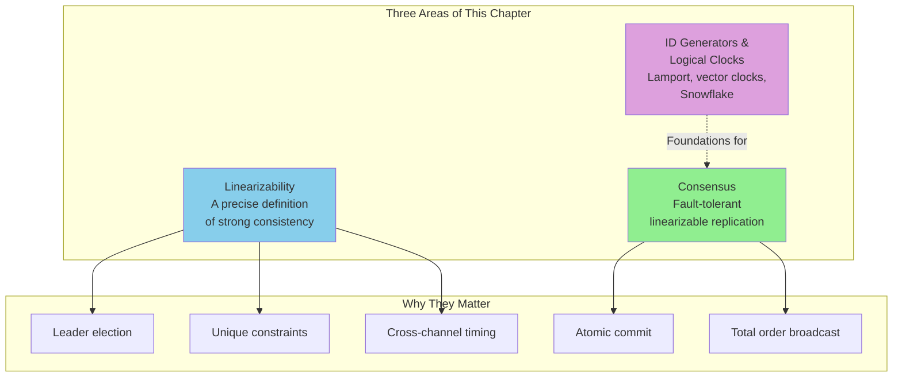
```mermaid
graph TB
    subgraph "Three Areas of This Chapter"
        L["Linearizability<br/>A precise definition<br/>of strong consistency"]
        ID["ID Generators &<br/>Logical Clocks<br/>Lamport, vector clocks,<br/>Snowflake"]
        C["Consensus<br/>Fault-tolerant<br/>linearizable replication"]
    end

    subgraph "Why They Matter"
        U["Leader election"]
        P["Unique constraints"]
        X["Cross-channel timing"]
        O["Atomic commit"]
        B["Total order broadcast"]
    end

    L --> U
    L --> P
    L --> X
    C --> O
    C --> B
    ID -.->|"Foundations for"| C

    style L fill:#87CEEB
    style ID fill:#DDA0DD
    style C fill:#90EE90
```

The topics in this chapter are notorious for being hard to implement correctly. It is very easy to build systems that behave fine when there are no faults but completely fall apart when faced with an unlucky combination of faults or message orderings that their designers had not considered. A lot of theory has been developed to help us think through those edge cases.

We will stick with informal intuitions and avoid the algorithmic nitty-gritty, formal models, and proofs. To do serious work on consensus systems and similar infrastructure, you will need to go much deeper into the theory if you want any chance of your systems being robust.

---

## 1. Linearizability

If you want a replicated database to be as simple as possible to use, you should make it behave as if it were a consistent single-node database. Then users don't have to worry about replication lag, conflicts, and other inconsistencies; you get the advantage of fault tolerance but without the complexity of having to think about multiple replicas.

This is the idea behind **linearizability** [Herlihy & Wing, 1990] (also known as atomic consistency, strong consistency, immediate consistency, or external consistency). The exact definition is quite subtle, but the basic idea is to make a system appear as if there is only one copy of the data, and all operations on it are atomic. With this guarantee, even though there may be multiple replicas in reality, the application does not need to worry about them.

In a linearizable system, as soon as one client successfully completes a write, all clients reading from the database must be able to see the value just written. Maintaining the illusion of a single copy of the data means guaranteeing that the value read is the most recent, up-to-date value and doesn't come from a stale cache or replica. **Linearizability is a recency guarantee.**

### A Nonlinearizable Sports Website

To clarify this idea, let's look at an example of a system that is not linearizable. **Example**: Aaliyah and Bryce are sitting in the same room, both checking their phones to see the outcome of a game their favorite team is playing. Just after the final score is announced, Aaliyah refreshes the page, sees the winner announced, and excitedly tells Bryce about it. Bryce incredulously hits reload on his own phone, but his request goes to a database replica that is lagging, so his phone shows that the game is still ongoing.

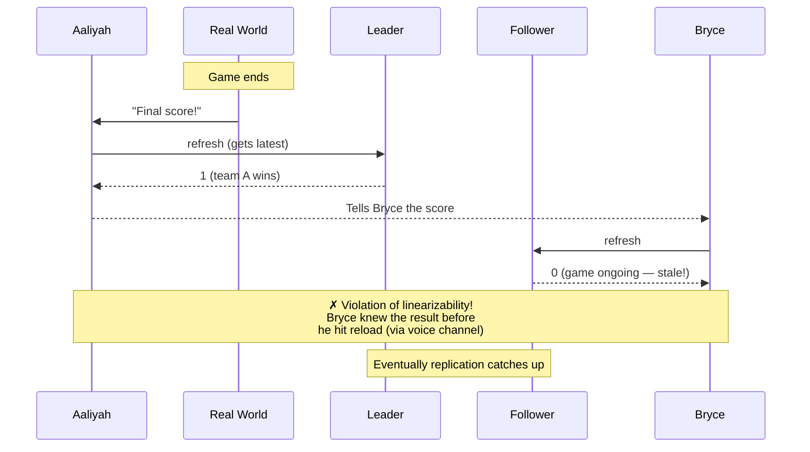
```mermaid
sequenceDiagram
    participant A as Aaliyah
    participant Real as Real World
    participant Leader
    participant Follower
    participant B as Bryce

    Note over Real: Game ends
    Real->>A: "Final score!"
    A->>Leader: refresh (gets latest)
    Leader-->>A: 1 (team A wins)

    A-->>B: Tells Bryce the score
    B->>Follower: refresh
    Follower-->>B: 0 (game ongoing — stale!)

    Note over A,B: ✗ Violation of linearizability!<br/>Bryce knew the result before<br/>he hit reload (via voice channel)

    Note over Leader,Follower: Eventually replication catches up
```

If Aaliyah and Bryce had hit reload at exactly the same time, it would have been less surprising if they had gotten different query results, because they wouldn't know at exactly what time their respective requests were processed. However, Bryce knows that he hit the reload button (initiated his query) after he heard Aaliyah exclaim the final score, and therefore he expects his query result to be at least as recent as Aaliyah's. The fact that his query returned a stale result is a violation of linearizability.

---

### What Makes a System Linearizable?

To understand linearizability better, let's look at more examples. Figure 10-2 in the book shows three clients concurrently reading and writing the same object `x` in a linearizable database. In distributed systems theory, `x` is called a **register** — in practice, it could be one key in a key-value store, one row in a relational database, or one document in a document database.

Two types of operations on a register:

- `Read(x) ⇒ v`: the client requested to read the value of register `x`, and the database returned the value `v`.
- `Write(x, v) ⇒ r`: the client requested to set the register `x` to value `v`, and the database returned response `r` (which could be OK or Error).

In the example, the value of `x` is initially 0, and client C performs a write request to set it to 1. While this is happening, clients A and B are repeatedly polling the database to read the latest value. Let's break down what A and B might see:

- The first read by A completes before the write begins, so it **must** return 0.
- The last read by A begins after the write has completed, so if the database is linearizable, it **must** return 1.
- Any read operations that overlap in time with the write operation might return either 0 or 1, because we don't know whether the write has taken effect at the time when the read operation is processed. These operations are **concurrent** with the write.

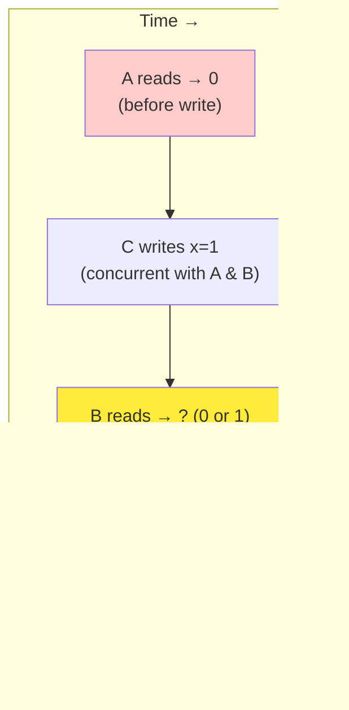
```mermaid
graph LR
    subgraph "Time →"
        R1["A reads → 0<br/>(before write)"]
        W["C writes x=1<br/>(concurrent with A & B)"]
        R2["B reads → ? (0 or 1)<br/>(concurrent)"]
        R3["A reads → 1<br/>(after write)"]
    end

    R1 --> W --> R2 --> R3

    style R1 fill:#ffcccc
    style R2 fill:#ffeb3b
    style R3 fill:#90EE90
```

#### The Flip-Back Constraint

This is not yet sufficient to fully describe linearizability. If reads that are concurrent with a write can return either the old or the new value, then readers could see a value flip back and forth between the old and the new value several times while a write is going on. That is not what we expect of a system that emulates "a single copy of the data."

To make the system linearizable, we need an additional constraint:

> **In a linearizable system, after any one read has returned the new value, all following reads (on the same or other clients) must also return the new value.**

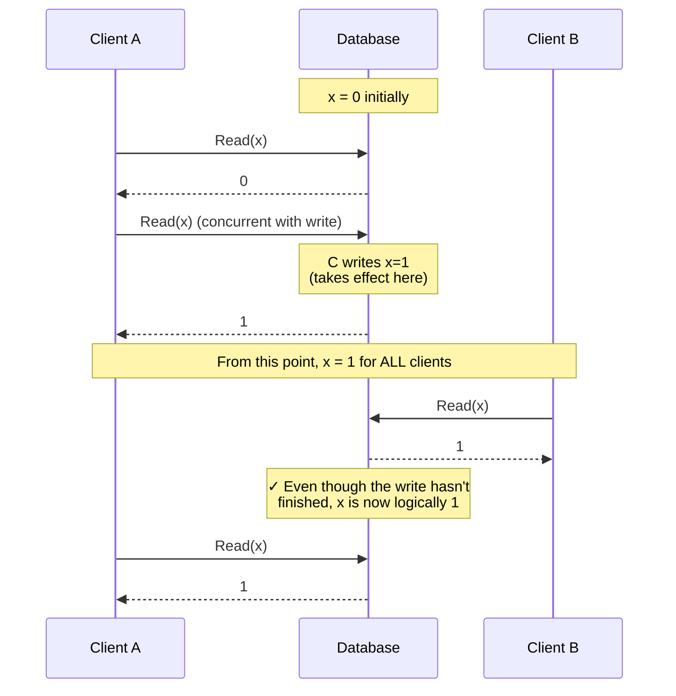
```mermaid
sequenceDiagram
    participant A as Client A
    participant DB as Database
    participant B as Client B

    Note over DB: x = 0 initially

    A->>DB: Read(x)
    DB-->>A: 0

    A->>DB: Read(x) (concurrent with write)
    Note over DB: C writes x=1<br/>(takes effect here)
    DB-->>A: 1

    Note over A,B: From this point, x = 1 for ALL clients

    B->>DB: Read(x)
    DB-->>B: 1

    Note over DB: ✓ Even though the write hasn't<br/>finished, x is now logically 1

    A->>DB: Read(x)
    DB-->>A: 1
```

We can further refine this timing diagram to visualize each operation taking effect atomically at some point in time. Each operation is marked with a vertical line at the time when we think the operation was executed. Those markers are joined up in a sequential order, and the result must be a valid sequence of reads and writes for a register (every read must return the value set by the most recent write).

**The requirement of linearizability is that the lines joining up the operation markers always move forward in time (from left to right), never backward.**

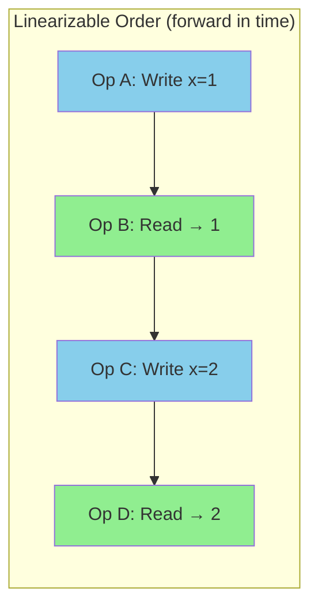
```mermaid
graph LR
    subgraph "Linearizable Order (forward in time)"
        Op1["Op A: Write x=1"] --> Op2["Op B: Read → 1"] --> Op3["Op C: Write x=2"] --> Op4["Op D: Read → 2"]
    end

    style Op1 fill:#87CEEB
    style Op2 fill:#90EE90
    style Op3 fill:#87CEEB
    style Op4 fill:#90EE90
```

#### Adding CAS Operations

In a more complex example, we can add a third type of operation besides read and write:

- `CAS(x, v_old, v_new) ⇒ r`: the client requested an atomic compare-and-set. If the current value of the register `x` equals `v_old`, it should be atomically set to `v_new`. If the value of `x` is different from `v_old`, the operation should leave the register unchanged and return an error. `r` is the database's response (OK or Error).

The interesting details:

1. Even if B's read request was sent before D's write request, B's read may return the value written by A, because the three requests were concurrent and the database processed them in a different order.
2. B's read may return 1 before client A received its response saying the write was successful — the OK response was just delayed in the network.
3. The final read by B in a non-linearizable execution returns a stale value: it is concurrent with C's CAS that updated x from 2 to 4, but A had already read the new value 4 before B's read started, so B is not allowed to read an older value.

---

### Linearizability Versus Serializability

These two terms are easily confused; for full definitions of serializability see Chapter 8. In short:

- **Serializability** is a transaction **isolation** guarantee: transactions behave as if executed in some serial order. Stale reads are permitted within that order.
- **Linearizability** is a **recency** guarantee on reads/writes of a single register: if op1 completes before op2 starts, op2 must see the effect of op1. Serializability has no such requirement.

| Aspect | Linearizability | Serializability |
|--------|-----------------|-----------------|
| What | Recency guarantee on reads/writes | Isolation guarantee for transactions |
| Scope | Single object (register) | Multiple objects |
| Grouping | No grouping of operations | Transactions bundle operations |
| Order | Real-time ordering | Any serial order with same result |
| Write skew protection | No | Yes |

A database may provide both serializability and linearizability; this combination is known as **strict serializability** or **strong one-copy serializability (strong-1SR)**.

Single-node databases are typically linearizable. With distributed databases using optimistic methods like SSI, the situation is more complicated. For example, CockroachDB provides serializability and some recency guarantees on reads, but not strict serializability, because this would require expensive coordination. On the other hand, Spanner and FoundationDB offer strict serializability.

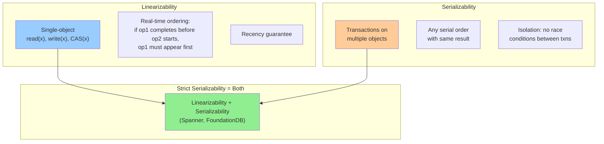
```mermaid
graph TB
    subgraph "Linearizability"
        L1["Single-object<br/>read(x), write(x), CAS(x)"]
        L2["Real-time ordering:<br/>if op1 completes before op2 starts,<br/>op1 must appear first"]
        L3["Recency guarantee"]
    end

    subgraph "Serializability"
        S1["Transactions on<br/>multiple objects"]
        S2["Any serial order<br/>with same result"]
        S3["Isolation: no race<br/>conditions between txns"]
    end

    subgraph "Strict Serializability = Both"
        SS["Linearizability + Serializability<br/>(Spanner, FoundationDB)"]
    end

    L1 --> SS
    S1 --> SS

    style L1 fill:#99ccff
    style S1 fill:#ffcc99
    style SS fill:#90EE90
```

It is also possible to combine a weaker isolation level with linearizability, or a weaker consistency model with serializability; the consistency model and isolation level can be chosen largely independently.

---

### Relying on Linearizability

In what circumstances is linearizability useful? A result that is outdated by a few seconds may not cause real harm, but in a few areas linearizability is an important requirement for making a system work correctly.

#### Locking and Leader Election

A system that uses single-leader replication needs to ensure that there is indeed only one leader, not several (split brain). One way of electing a leader is to use a lease. Every node that starts up tries to acquire the lease, and the one that succeeds becomes the leader. No matter how this mechanism is implemented, it **must be linearizable** — it shouldn't be possible for two nodes to acquire the lease at the same time.

Coordination services like Apache ZooKeeper and etcd are often used to implement distributed leases and leader election. They use consensus algorithms to implement linearizable operations in a fault-tolerant way.

> **Strictly speaking**, ZooKeeper provides linearizable writes, but reads may be stale, since there is no guarantee that they are served from the current leader. etcd since version 3 provides linearizable reads by default.

Distributed locking is also used at a much more granular level in some distributed databases, such as Oracle Real Application Clusters (RAC). RAC uses a lock per disk page, with multiple nodes sharing access to the same disk storage system. Since these linearizable locks are on the critical path of transaction execution, RAC deployments usually have a dedicated cluster interconnect network for communication between database nodes.

#### Constraints and Uniqueness Guarantees

Uniqueness constraints are common in databases — for example, a username or email address must uniquely identify one user, and in a file storage service there cannot be two files with the same path and filename. If you want to enforce this constraint as the data is written (such that if two people try to concurrently create a user or a file with the same name, one of them will receive an error), you need **linearizability**.

This situation is similar to a lock; when a user registers for your service, you can think of them acquiring a lock on their chosen username. The operation is also very similar to an atomic CAS, setting the username to the ID of the user who claimed it, provided that the username is not already taken.

Similar issues arise if you want to ensure that a bank account balance never goes negative, or that you don't sell more items than you have in stock in the warehouse, or that two people don't concurrently book the same seat on a flight or in a theater. These constraints all require a single up-to-date value (the account balance, the stock level, the seat occupancy) that all nodes agree on.

In real applications, it is sometimes acceptable to treat such constraints loosely — for example, if a flight is overbooked, you can move customers to a different flight and offer them compensation. In such cases, linearizability may not be needed (loosely interpreted constraints, discussed in Chapter 13). However, a **hard uniqueness constraint**, such as the one you typically find in relational databases, requires linearizability.

#### Cross-Channel Timing Dependencies

In the Aaliyah/Bryce sports example, if Aaliyah hadn't exclaimed the score, Bryce wouldn't have known that the result of his query was stale. He would have just refreshed the page again a few seconds later and eventually seen the final score. **The linearizability violation was noticed only because there was an additional communication channel in the system** (Aaliyah's voice to Bryce's ears).

Similar situations arise in computer systems. **Example**: a website allows users to upload a video, and a background process transcodes the video to a lower quality. The video transcoder needs to be explicitly instructed to perform a transcoding job, and this instruction is sent from the web server to the transcoder via a message queue. The web server doesn't place the entire video on the queue (videos are megabytes); instead, the video is first written to a file storage service, and once the write is complete, the instruction to the transcoder is placed on the queue.

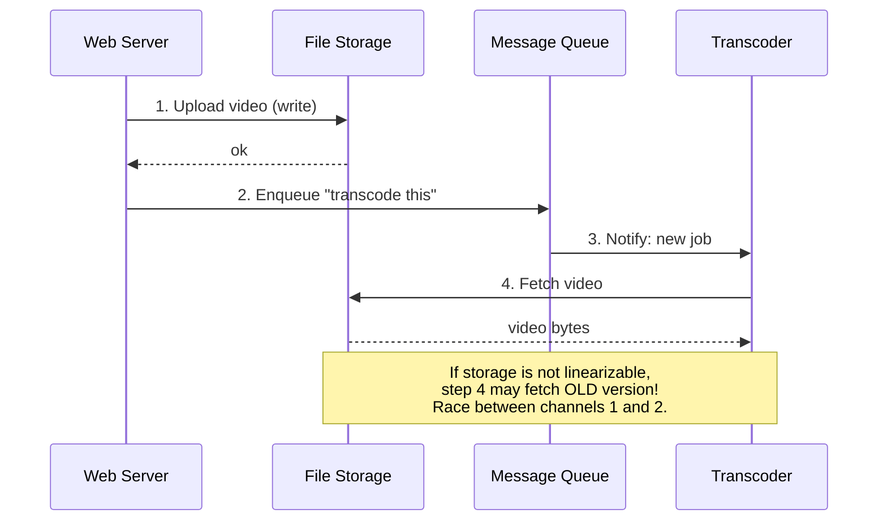
```mermaid
sequenceDiagram
    participant Web as Web Server
    participant Storage as File Storage
    participant Queue as Message Queue
    participant Transcoder

    Web->>Storage: 1. Upload video (write)
    Storage-->>Web: ok
    Web->>Queue: 2. Enqueue "transcode this"
    Queue->>Transcoder: 3. Notify: new job
    Transcoder->>Storage: 4. Fetch video
    Storage-->>Transcoder: video bytes

    Note over Storage,Transcoder: If storage is not linearizable,<br/>step 4 may fetch OLD version!<br/>Race between channels 1 and 2.
```

If the file storage service is linearizable, this system works fine. If it is not linearizable, there is the risk of a race condition: the message queue (steps 2 and 3) might be faster than the internal replication inside the storage service. In this case, when the transcoder fetches the original video (step 4), it might see an old version of the file or nothing at all. If it processes an old version of the video, the original and transcoded videos in the file storage become permanently inconsistent with each other.

This problem arises because there are two communication channels between the web server and the transcoder: the file storage and the message queue. Without the recency guarantee of linearizability, race conditions between these two channels are possible.

A similar race condition occurs if you have a mobile app that can receive push notifications, and the app fetches some data from a server when it receives a notification. If the data fetch might go to a lagging replica, the push notification could go through quickly, but the subsequent fetch wouldn't see the data the notification was about.

Linearizability is not the only way of avoiding this race condition, but it is the simplest to understand.

---

### Implementing Linearizable Systems

Since linearizability means "behave as though there is only a single copy of the data, and all operations on it are atomic," the simplest answer would be to really use only a single copy of the data. However, that approach would not be able to tolerate faults: if the node holding that one copy failed, the data would be lost, or at least inaccessible until the node was brought up again.

Let's revisit the replication methods from Chapter 6 and see whether they can be made linearizable:

| Method | Linearizable? | Reason |
|--------|---------------|--------|
| **Single-leader replication** | Potentially | If all reads/writes go to leader, and leader election is safe |
| **Consensus algorithms** | Likely | Raft, Zab etc. are carefully designed to prevent split brain |
| **Multi-leader replication** | No | Concurrent writes on multiple leaders, asynchronous replication |
| **Leaderless replication** | Probably not | Even with `w + r > n`, edge cases exist due to network delays |

#### Single-Leader Replication (Potentially Linearizable)

The leader has the primary copy of the data for writes, and the followers maintain backup copies. As long as you perform all reads and writes on the leader, they are likely to be linearizable. **However**, this assumes that you know for sure who the leader is. As discussed in distributed locks and leases, it is quite possible for a node to think that it is the leader, when in fact it is not — and if the delusional leader continues to serve requests, it is likely to violate linearizability. With asynchronous replication, failover may even result in committed writes being lost, which violates both durability and linearizability.

Sharding a single-leader database, with a separate leader per shard, does not affect linearizability, since it is only a single-object guarantee.

#### Consensus Algorithms (Likely Linearizable)

Some consensus algorithms are single-leader replication with automatic leader election and failover. They are carefully designed to prevent split brain, allowing them to implement linearizable storage safely. ZooKeeper uses the Zab consensus algorithm, and etcd uses Raft. However, just because a system uses consensus does not guarantee that all operations on it are linearizable. If it allows reads on a node without checking that it is still the leader, the results of the read may be stale if a new leader has just been elected.

#### Multi-Leader Replication (Not Linearizable)

Systems with multi-leader replication are generally not linearizable, because they concurrently process writes on multiple nodes and asynchronously replicate them to other nodes. They can produce conflicting writes that require resolution.

#### Leaderless Replication (Probably Not Linearizable)

For systems with leaderless replication (Dynamo-style), people sometimes claim that you can obtain "strong consistency" by requiring quorum reads and writes (`w + r > n`). Depending on the exact algorithm and on how you define strong consistency, this is **not quite true**.

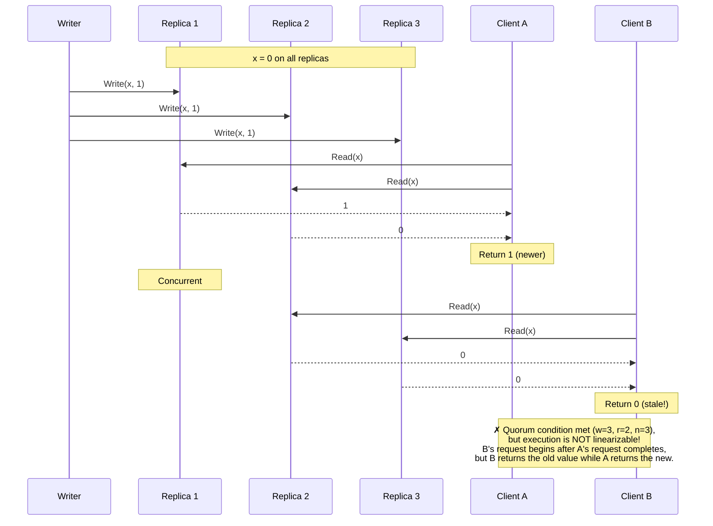
```mermaid
sequenceDiagram
    participant W as Writer
    participant R1 as Replica 1
    participant R2 as Replica 2
    participant R3 as Replica 3
    participant A as Client A
    participant B as Client B

    Note over R1,R3: x = 0 on all replicas

    W->>R1: Write(x, 1)
    W->>R2: Write(x, 1)
    W->>R3: Write(x, 1)

    A->>R1: Read(x)
    A->>R2: Read(x)
    R1-->>A: 1
    R2-->>A: 0
    Note over A: Return 1 (newer)

    Note over R1: Concurrent
    B->>R2: Read(x)
    B->>R3: Read(x)
    R2-->>B: 0
    R3-->>B: 0
    Note over B: Return 0 (stale!)

    Note over A,B: ✗ Quorum condition met (w=3, r=2, n=3),<br/>but execution is NOT linearizable!<br/>B's request begins after A's request completes,<br/>but B returns the old value while A returns the new.
```

Intuitively, it seems as though quorum reads and writes should be linearizable in a Dynamo-style model. However, when we have variable network delays, it is possible to have race conditions, as shown above.

It is possible to make Dynamo-style quorums linearizable, at the cost of reduced performance. A reader must perform read repair synchronously before returning results. Additionally, before writing, a writer must read the latest state of a quorum of nodes to fetch the latest timestamp of any prior write and ensure that the new write has a greater timestamp. Riak, however, does not perform synchronous read repair because of the performance penalty. Cassandra does wait for read repair to complete on quorum reads, but it loses linearizability because of its use of time-of-day clocks for timestamps.

What's more, only linearizable read and write operations can be implemented in this way; a **linearizable CAS operation cannot**, because it requires a consensus algorithm. In summary, it is safest to assume that a leaderless system with Dynamo-style replication does not provide linearizability, even with quorum reads and writes.

---

### The Cost of Linearizability

As some replication methods can provide linearizability and others cannot, it is interesting to explore the pros and cons of linearizability in more depth.

We already discussed some use cases for different replication methods in Chapter 6; for example, multi-leader replication is often a good choice for multi-region replication. Consider what happens if a network interruption occurs between the two regions. Let's assume that the network within each region is working, and clients can reach their local regions, but the regions cannot connect to each other. This is known as a **network partition**.

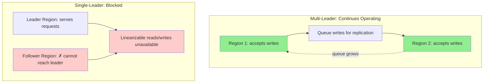
```mermaid
graph TB
    subgraph "Multi-Leader: Continues Operating"
        ML1["Region 1: accepts writes"]
        ML2["Region 2: accepts writes"]
        MLQ["Queue writes for replication"]
        ML1 --> MLQ
        MLQ --> ML2
        ML2 -.->|"queue grows"| ML1
    end

    subgraph "Single-Leader: Blocked"
        SL1["Leader Region: serves requests"]
        SLF["Follower Region: ✗ cannot reach leader"]
        SLE["Linearizable reads/writes unavailable"]
        SL1 --> SLE
        SLF --> SLE
    end

    style ML1 fill:#90EE90
    style ML2 fill:#90EE90
    style SLF fill:#ffcccc
    style SLE fill:#ffcccc
```

With a multi-leader database, each region can continue operating normally. Since writes from one region are asynchronously replicated to the other, the writes are simply queued up and exchanged when network connectivity is restored.

On the other hand, if single-leader replication is used, the leader must be in one of the regions. Any writes and any linearizable reads must be sent to the leader. If the network between regions is interrupted, clients connected to follower regions cannot contact the leader, so they cannot make any writes to the database nor any linearizable reads. They can still make reads from the follower, but those might be stale (nonlinearizable). If the application requires linearizable reads and writes, the network interruption causes the application to become unavailable in the regions that cannot contact the leader.

#### The CAP Theorem

This issue is not just a consequence of single-leader and multi-leader replication. **Any linearizable database has this problem**, no matter how it is implemented. The issue also isn't specific to multi-region deployments, but can occur on any unreliable network, even within one region. The trade-off is as follows:

- If your application requires linearizability, and some replicas are disconnected from the other replicas because of a network problem, those replicas will be temporarily unable to process requests: they must either wait until the network problem is fixed or return an error (either way, they become unavailable). This choice is sometimes known as **CP** (consistent under network partitions).
- If your application does not require linearizability, it can be written in such a way that each replica can process requests independently, even if it is disconnected from other replicas. The application can remain available in the face of a network problem, but its behavior is not linearizable. This choice is known as **AP** (available under network partitions).

This insight is popularly known as the **CAP theorem**, named by Eric Brewer in 2000, although the trade-off had been known to designers of distributed databases since the 1970s.

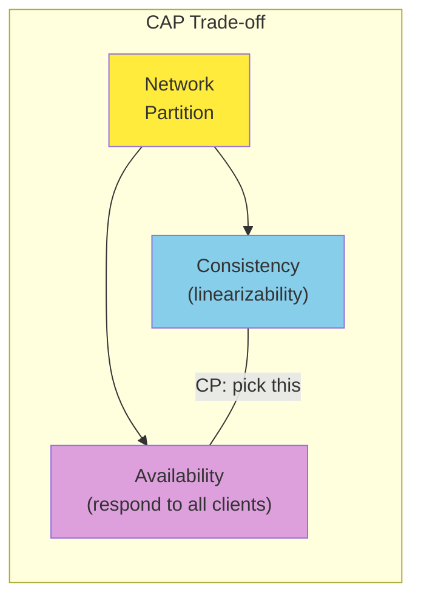
```mermaid
graph LR
    subgraph "CAP Trade-off"
        P["Network<br/>Partition"]
        C["Consistency<br/>(linearizability)"]
        A["Availability<br/>(respond to all clients)"]
        P --> C
        P --> A
        C ---|"CP: pick this"| A
    end

    style P fill:#ffeb3b
    style C fill:#87CEEB
    style A fill:#DDA0DD
```

CAP was originally proposed as a rule of thumb without precise definitions, with the goal of starting a discussion about trade-offs in databases. At the time, many distributed databases focused on providing linearizable semantics on a cluster of machines with shared storage, and CAP encouraged database engineers to explore a wider design space of distributed shared-nothing systems, which were more suitable for implementing large-scale web services.

The CAP theorem as formally defined considers only one consistency model (namely, linearizability) and one kind of fault (network partitions, which according to data from Google are the cause of less than 8% of incidents). It doesn't say anything about network delays, dead nodes, or other trade-offs. Thus, although CAP has been historically influential, it has little practical value for designing systems.

There have been efforts to generalize CAP. For example, the **PACELC principle** observes that system designers might also choose to weaken consistency at times when the network is working fine in order to reduce latency. Thus, during a network partition (P), we need to choose between availability (A) and consistency (C); else (E), when there is no partition, we may choose between low latency (L) and consistency (C). However, this definition inherits several of the problems with CAP, such as the counterintuitive definitions of consistency and availability.

There are many more interesting impossibility results in distributed systems, and CAP has now been superseded by more precise results, so it is of mostly historical interest today.

#### The Unhelpful CAP Theorem

CAP is sometimes presented as **consistency, availability, partition tolerance: pick two out of three**. Unfortunately, putting it this way is misleading. Because network partitions are a kind of fault, they aren't something you choose but rather will happen whether you like it or not. The only way you can guarantee no network partitions is by having no network — that is, having only one replica — but then you don't have high availability either.

At times when the network is working correctly, a system can provide both consistency (linearizability) and availability. When a network fault occurs, you have to choose between them. Thus, a better way of phrasing CAP would be **either consistent or available when partitioned**. A more reliable network needs to make this choice less often, but at some point the choice is inevitable.

The CP/AP classification scheme has several other flaws. Consistency is formalized as linearizability (the theorem doesn't say anything about weaker consistency models), and the formalization of availability does not match the usual meaning of the term. Many highly available (fault-tolerant) systems actually do not meet CAP's idiosyncratic definition of availability. Moreover, some system designers choose (with good reason) to provide neither linearizability nor the form of availability that the CAP theorem assumes, so those systems are neither CP nor AP.

All in all, there is a lot of misunderstanding and confusion around CAP, and it does not help us understand systems better, so it's best not to dwell on it.

#### Linearizability and Network Delays

Although linearizability is a useful guarantee, surprisingly few systems are linearizable in practice. For example, even RAM on a modern multi-core CPU is not linearizable. If a thread running on one CPU core writes to a memory address, and a thread on another CPU core reads the same address shortly afterward, it is not guaranteed to read the value written by the first thread (unless a memory barrier or fence is used).

The reason for this behavior is that every CPU core has its own memory cache and store buffer. Reads are served from the cache by default, and any changes are asynchronously written out to main memory. Since accessing data in the cache is much faster than going to main memory, this feature is essential for good performance on modern CPUs. However, it means there are now multiple copies of the data (one in main memory, and perhaps several more in various caches), and these copies are asynchronously updated, so linearizability is lost.

Why make this trade-off? It makes no sense to use the CAP theorem to justify the multi-core memory consistency model. Within one computer we usually assume reliable communication, and we don't expect one CPU core to be able to continue operating normally if it is disconnected from the rest of the computer. **The reason for dropping linearizability is performance, not fault tolerance.**

The same is true of many distributed databases that choose not to provide linearizable guarantees: they do so primarily to increase performance, not so much for fault tolerance. **Linearizable systems tend to be higher latency — and this is true all the time, not only during a network fault.**

Can we find a more efficient implementation of linearizable storage? It seems the answer is **no**. Attiya and Welch prove that if you want linearizability, the response time of read and write requests is at least proportional to the uncertainty of delays in the network. In a network with highly variable delays, like most computer networks, the response time of linearizable reads and writes is inevitably going to be high. A faster algorithm for linearizability does not exist, but weaker consistency models can be much faster, so this trade-off is important for latency-sensitive systems.

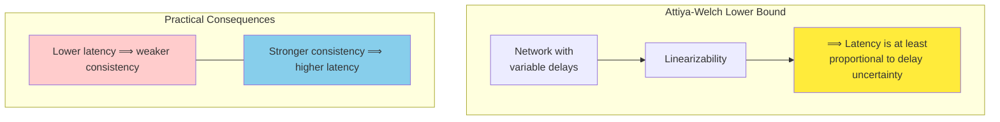
```mermaid
graph TB
    subgraph "Attiya-Welch Lower Bound"
        N["Network with<br/>variable delays"]
        L["Linearizability"]
        LB["⟹ Latency is at least<br/>proportional to delay uncertainty"]
        N --> L --> LB
    end

    subgraph "Practical Consequences"
        P1["Lower latency ⟹ weaker consistency"]
        P2["Stronger consistency ⟹ higher latency"]
        P1 --- P2
    end

    style LB fill:#ffeb3b
    style P1 fill:#ffcccc
    style P2 fill:#87CEEB
```

---

## 2. ID Generators and Logical Clocks

In many applications you need to assign some sort of unique ID to database records when they are created, which gives you a primary key for referencing those records. In single-node databases it is common to use an **autoincrementing integer**, which has the advantage that it can be stored in only 64 bits (or even 32 bits, if you are sure that you will never have more than 4 billion records, but that is risky).

Another advantage of autoincrementing IDs is that **the order of the IDs tells you the order in which the records were created**. **Example**: a chat application that assigns autoincrementing IDs to chat messages as they are posted. You can then display the messages in order of increasing ID, and the resulting chat threads will make sense: Aaliyah posts a question that is assigned ID 1, and Bryce's answer is assigned a greater ID — namely, 3.

This single-node ID generator is another example of a **linearizable system**. Each request to fetch the ID is an operation that atomically increments a counter and returns the old counter value (a fetch-and-add operation); linearizability ensures that if the posting of Aaliyah's message completes before Bryce's posting begins, then the ID of Bryce's message must be greater than Aaliyah's. The messages by Aaliyah and Caleb are concurrent, so linearizability doesn't specify how their IDs must be ordered, as long as they are unique.

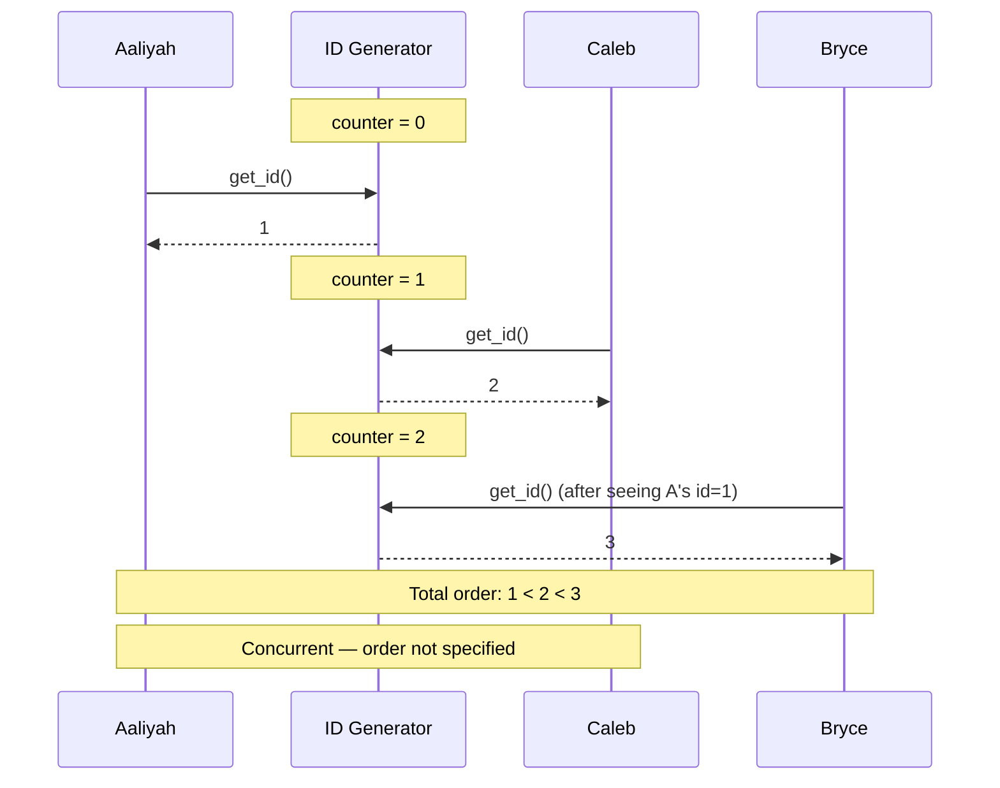
```mermaid
sequenceDiagram
    participant A as Aaliyah
    participant Gen as ID Generator
    participant C as Caleb
    participant B as Bryce

    Note over Gen: counter = 0
    A->>Gen: get_id()
    Gen-->>A: 1

    Note over Gen: counter = 1
    C->>Gen: get_id()
    Gen-->>C: 2

    Note over Gen: counter = 2
    B->>Gen: get_id() (after seeing A's id=1)
    Gen-->>B: 3

    Note over A,B: Total order: 1 < 2 < 3
    Note over A,C: Concurrent — order not specified
```

An in-memory single-node ID generator is easy to implement. You can use the atomic increment instruction provided by your CPU, which allows multiple threads to safely increment the same counter. It's a bit more effort to make the counter persistent, so that the node can crash and restart without resetting the counter value (which would result in duplicate IDs).

### Problems with Single-Node ID Generators

The real problems are:

1. **A single-node ID generator is not fault-tolerant** because that node is a single point of failure.
2. **It's slow if you want to create a record in another region**, as you potentially have to make a round trip to the other side of the planet just to get an ID.
3. **That single node could become a bottleneck** if you have high write throughput.

### Alternative ID Generator Designs

You can consider various alternative options:

| Scheme | Unique? | Ordered by creation? | Distributed? | Fault-tolerant? |
|--------|---------|----------------------|--------------|-----------------|
| **Single-node autoincrement** (linearizable) | ✓ | ✓ strict | ✗ | ✗ |
| **Sharded (even/odd bits)** | ✓ | ✗ | ✓ | ✓ |
| **Preallocated blocks** | ✓ | ✗ (across blocks) | ✓ | ✓ |
| **Random UUIDs (v4)** | ✓ (~probabilistic) | ✗ | ✓ | ✓ |
| **Wall-clock + bits** (Snowflake, ULID, v7 UUID) | ✓ | ~approximate | ✓ | ✓ |
| **Lamport / hybrid logical clock** | ✓ | ✓ (consistent with causality) | ✓ | ✓ |

The rest of this section examines each scheme in turn.

**Sharded ID Assignment**: You could have multiple nodes that assign IDs — for example, one that generates only even numbers and one that generates only odd numbers. In general, you can reserve some bits in the ID to contain a shard number. Those IDs are still compact, but **you lose the ordering property** — for example, if you have chat messages with IDs 16 and 17, you don't know whether message 16 was actually sent first, because the IDs were assigned by different nodes, and one node might have been ahead of the other.

**Preallocated Blocks of IDs**: Instead of individual IDs, the single-node ID generator could hand out blocks of IDs. For example, node A might claim the block of IDs from 1 to 1,000, and node B might claim the block from 1,001 to 2,000. Then each node can independently hand out IDs from its block, and request a new block from the ID generator when its supply begins to run low. However, this scheme **doesn't ensure correct ordering either** — it could happen that one message is given an ID in the range 1,001-2,000 and a later message is given an ID in the range 1-1,000 if the ID was assigned by a different node.

**Random UUIDs**: Universally unique identifiers (UUIDs), also known as globally unique identifiers (GUIDs), have the big advantage that they can be generated locally on any node without requiring communication, but they require more space (**128 bits**). UUIDs have several versions; the simplest is version 4, which is a random number that is so long that it is very unlikely that two nodes would ever pick the same one. Unfortunately, the order of such IDs is also random, so comparing two IDs tells you nothing about which one is newer.

**Wall-Clock Timestamp Made Unique**: If your nodes' time-of-day clocks are kept approximately correct using NTP, you can generate IDs by putting a timestamp from this clock in the most significant bits and filling the remaining bits with extra information that ensures the ID is unique even if the timestamp is not — for example, a shard number and a per-shard incrementing sequence number, or a long random value. This approach is used in:

- **Version 7 UUIDs** [Davis et al., 2024]
- **X's Snowflake** [King, 2010]
- **ULIDs**
- **Hazelcast's Flake ID generator**
- **MongoDB ObjectIDs**
- **Many similar schemes**

All these schemes generate IDs that are unique (at least with high enough probability that collisions are vanishingly rare), but they have much weaker ordering guarantees for IDs than the single-node autoincrementing scheme.

### Wall-Clock Timestamps: A Subtle Problem

Wall-clock timestamps can provide at best an approximate ordering. If an earlier write gets a timestamp from a slightly fast clock and a later write's timestamp is from a slightly slow clock, the timestamp order may be inconsistent with the order in which the events actually happened. With clock jumps due to using a nonmonotonic clock, even the timestamps generated by a single node might be ordered incorrectly. **ID generators based on wall-clock time are therefore unlikely to be linearizable.**

You can reduce such ordering inconsistencies by relying on high-precision clock synchronization, using atomic clocks or GPS receivers. But it would also be nice to be able to generate IDs that are unique and correctly ordered without relying on special hardware. Next, we'll look at a type of clock that enables just that.

---

### Logical Clocks

In Chapter 9 we discussed time-of-day clocks and monotonic clocks. Both are **physical clocks**: hardware devices that measure the passing of time (seconds, milliseconds, microseconds, etc.).

In distributed systems it is common to also use another kind of clock, called a **logical clock**. In contrast to a physical clock, a logical clock is an algorithm that counts the events that have occurred. A timestamp from a logical clock therefore doesn't tell you what time it is, but you can compare two timestamps from a logical clock to tell which one is earlier and which one is later.

The general requirements for a logical clock are:

1. Its timestamps are **compact** (a few bytes in size) and unique.
2. You can compare any two timestamps and determine which one is earlier (i.e., they are **totally ordered**).
3. The order of timestamps is **consistent with causality**. That is, if operation A happened before operation B, then A's timestamp is less than B's timestamp.

A single-node ID generator meets these requirements, but the distributed ID generators we just discussed do not meet the causal ordering requirement.

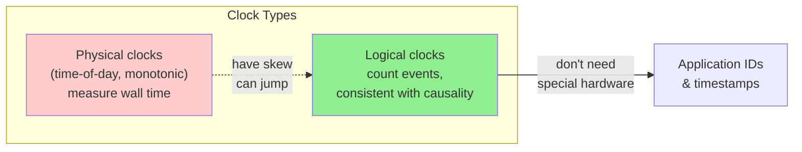
```mermaid
graph LR
    subgraph "Clock Types"
        PC["Physical clocks<br/>(time-of-day, monotonic)<br/>measure wall time"]
        LC["Logical clocks<br/>count events,<br/>consistent with causality"]
    end

    PC -.->|"have skew<br/>can jump"| LC
    LC -->|"don't need<br/>special hardware"| APP["Application IDs<br/>& timestamps"]

    style PC fill:#ffcccc
    style LC fill:#90EE90
```

#### Lamport Timestamps

A simple method for generating logical timestamps that is consistent with causality is the **Lamport clock**, proposed in 1978 by Leslie Lamport [Lamport, 1978], in what is now one of the most-cited papers in the field of distributed systems.

Each node has a unique identifier (which in practice could be a random UUID). Each node also keeps a count of the operations it has processed. A Lamport timestamp is then a pair of `(counter, node ID)`. Two nodes may sometimes have the same counter value, but by including the node ID in the timestamp, each timestamp is made unique.

```mermaid
sequenceDiagram
    participant A as Aaliyah<br/>counter=0
    participant C as Caleb<br/>counter=0
    participant B as Bryce<br/>counter=0

    Note over A: Posts message
    A->>A: counter = 1<br/>timestamp (1, A)

    Note over C: Posts message
    C->>C: counter = 1<br/>timestamp (1, C)

    Note over A,C: A and C are concurrent

    B->>A: Receive message (1, A)
    Note over B: Update counter to 1

    B->>C: Receive message (1, C)
    Note over B: Update counter to 1

    Note over B: Posts reply to Aaliyah
    B->>B: counter = 2<br/>timestamp (2, B)

    Note over A,B,C: Total order: (1, A) < (1, C) < (2, B)
```

The rules are:

1. Every time a node generates a timestamp, it **increments its counter** and uses the new value.
2. Every time a node sees a timestamp from another node, if the counter value in that timestamp is greater than its local counter value, it **increases its local counter to match** the value in the timestamp.

To compare two Lamport timestamps, first compare their counter values — for example, `(2, "Bryce") > (1, "Aaliyah")` and `(2, "Bryce") > (1, "Caleb")`. If two timestamps have the same counter value, then compare their node IDs using the usual lexicographic string comparison. Thus, the timestamp order in the example above is `(1, "Aaliyah") < (1, "Caleb") < (2, "Bryce")`.

Although Lamport clocks provide a total ordering, they do **not** provide linearizability — that is, they are not a way of ensuring that a value is up-to-date. They are merely a way of assigning IDs to events such that if event A happened before event B, then A's ID is less than B's ID.

```python
class LamportClock:
    """A Lamport timestamp: (counter, node_id).
    Provides total order consistent with causality."""

    def __init__(self, node_id):
        self.node_id = node_id
        self.counter = 0

    def now(self):
        # Increment counter and return new timestamp
        self.counter += 1
        return (self.counter, self.node_id)

    def observe(self, other_timestamp):
        """Called when we receive a message with another node's timestamp."""
        other_counter, _ = other_timestamp
        # Move our counter forward if the other is ahead
        if other_counter > self.counter:
            self.counter = other_counter

    def compare(self, a, b):
        """Compare two Lamport timestamps. Returns -1, 0, or 1."""
        a_counter, a_node = a
        b_counter, b_node = b
        if a_counter != b_counter:
            return -1 if a_counter < b_counter else 1
        # Tie-break by node id (lexicographic)
        if a_node < b_node:
            return -1
        if a_node > b_node:
            return 1
        return 0

    def __lt__(self, other):
        a = (self.counter, self.node_id)
        return self.compare(a, other) < 0


# Example: chat application with three users
alice = LamportClock("alice")
bob = LamportClock("bob")
carol = LamportClock("carol")

# Alice posts first message
msg_alice = alice.now()        # (1, "alice")

# Carol posts concurrently with Alice
msg_carol = carol.now()        # (1, "carol")

# Bob sees both, then posts a reply
bob.observe(msg_alice)          # bob.counter = 1
bob.observe(msg_carol)          # bob.counter = 1 (no change)
msg_bob = bob.now()             # (2, "bob")

# Total order: (1, alice) < (1, carol) < (2, bob)
assert msg_alice < msg_carol < msg_bob
```

#### Hybrid Logical Clocks

Lamport timestamps are good at capturing the order in which things happened, but they have some limitations:

- Since they have no direct relation to physical time, you can't use them to find, say, all the messages that were posted on a particular date; you would need to store the physical time separately.
- If two nodes never communicate, one node's counter increments will never be reflected in the other one's counter. As a result, events generated around the same time on different nodes could have wildly different counter values.

A **hybrid logical clock** combines the advantages of physical time-of-day clocks with the ordering guarantees of Lamport clocks. Like a physical clock, it counts seconds or microseconds. Like a Lamport clock, when one node sees a timestamp from another node that is greater than its local clock value, it moves its own local value forward to match the other node's timestamp.

Every time a timestamp from a hybrid logical clock is generated, it is also incremented, which ensures that the clock moves forward **monotonically** even if the underlying physical clock jumps backward — for example, because of NTP adjustments. Thus, the hybrid logical clock might be slightly ahead of the underlying physical clock. Details of the algorithm ensure that this discrepancy remains as small as possible.

As a result, you can treat a timestamp from a hybrid logical clock almost like a timestamp from a conventional time-of-day clock, with the added property that its ordering is consistent with the happens-before relation. It doesn't depend on any special hardware and requires only roughly synchronized clocks. **Hybrid logical clocks are used by CockroachDB**, for example.

#### Lamport/Hybrid Logical Clocks Versus Vector Clocks

In Chapter 8 we discussed how snapshot isolation is often implemented: by giving each transaction a transaction ID, and allowing each transaction to see writes made by transactions with a lower ID but making writes by transactions with higher IDs invisible. **Lamport clocks and hybrid logical clocks are a good way of generating these transaction IDs** because they ensure that the snapshot is consistent with causality.

When multiple timestamps are generated concurrently, these algorithms order them arbitrarily. This means that when you look at two timestamps, you generally can't tell whether they were generated concurrently or one happened before the other. (In the chat example, you actually can tell that Aaliyah and Caleb's messages must have been concurrent, because they have the same counter value; however, when the counter values are different, you can't tell whether they were concurrent.)

If you want to be able to determine when records were created concurrently, you need a different algorithm, such as a **vector clock**. Vector clocks keep a counter for each node and store all the counter values with each write. If write A has a higher counter value than B for one node, and write B has a higher counter value than A for another node, then A and B must be concurrent. The downside is that the timestamps from a vector clock take up much more space than the other timestamps we have discussed — potentially one integer for every node in the system.

| Property | Lamport / Hybrid Logical | Vector |
|----------|--------------------------|--------|
| Compact (a few bytes) | ✓ | ✗ — one counter per node |
| Total order | ✓ | ✗ — partial order |
| Consistent with causality | ✓ | ✓ |
| Detects concurrent events | ✗ (only when counters tie) | ✓ |
| No special hardware | ✓ | ✓ |

```python
class VectorClock:
    """A vector clock tracks one counter per node.
    Allows detecting concurrent operations."""

    def __init__(self, node_id, initial=None):
        self.node_id = node_id
        # clock[node] = counter
        self.clock = dict(initial) if initial else {node_id: 0}

    def increment(self):
        """Generate a new event on this node."""
        self.clock[self.node_id] = self.clock.get(self.node_id, 0) + 1
        return dict(self.clock)

    def observe(self, other_clock):
        """Merge another node's clock (called on receiving a message)."""
        for node, counter in other_clock.items():
            self.clock[node] = max(self.clock.get(node, 0), counter)

    def happens_before(self, other):
        """True iff self happened-before other (self is strictly older)."""
        all_nodes = set(self.clock) | set(other)
        strictly_less_in_at_least_one = False
        for n in all_nodes:
            self_c = self.clock.get(n, 0)
            other_c = other.get(n, 0)
            if self_c > other_c:
                return False  # self is newer in some component
            if self_c < other_c:
                strictly_less_in_at_least_one = True
        return strictly_less_in_at_least_one

    def concurrent_with(self, other):
        """True if self and other are concurrent (neither happened-before)."""
        return not self.happens_before(other) and not other.happens_before(self)

    def merge(self, other):
        """Take the component-wise max."""
        result = dict(self.clock)
        for n, c in other.items():
            result[n] = max(result.get(n, 0), c)
        return result


# Example: two nodes, each does one local write
a = VectorClock("A")
b = VectorClock("B")

ts_a = a.increment()  # {A: 1}
ts_b = b.increment()  # {B: 1}

# They are concurrent
print(a.concurrent_with(ts_b))  # True

# A learns about B's write
a.observe(ts_b)
ts_a2 = a.increment()  # {A: 2, B: 1}

# Now a's newer timestamp happens after b's
print(ts_b.happens_before(ts_a2))  # True
```

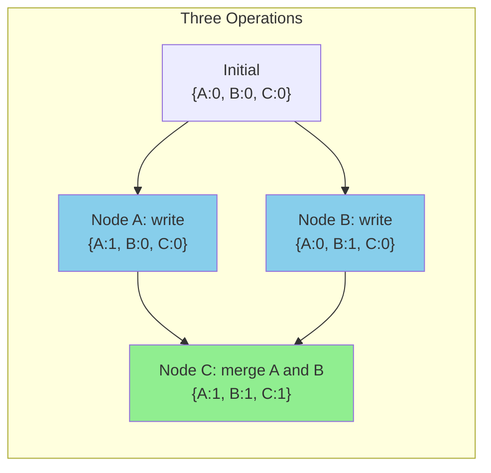
```mermaid
graph LR
    subgraph "Three Operations"
        V0["Initial<br/>{A:0, B:0, C:0}"]
        VA["Node A: write<br/>{A:1, B:0, C:0}"]
        VB["Node B: write<br/>{A:0, B:1, C:0}"]
        VC["Node C: merge A and B<br/>{A:1, B:1, C:1}"]
    end

    V0 --> VA
    V0 --> VB
    VA --> VC
    VB --> VC

    style VA fill:#87CEEB
    style VB fill:#87CEEB
    style VC fill:#90EE90
```

---

### Linearizable ID Generators

Lamport clocks and hybrid logical clocks provide useful ordering guarantees, but that ordering is still **weaker than the linearizable single-node ID generator**. Recall that linearizability requires that if request A completed before request B began, then B must have the higher ID, even if A and B never communicated with each other. On the other hand, Lamport clocks can ensure only that a node generates timestamps that are greater than any other timestamp that node has seen; no such guarantees can be made about timestamps that it hasn't seen.

**Example**: Imagine a social media website where user A wants to share an embarrassing photo privately with their friends. User A's account is initially public, but using their laptop, they change their account settings to private. They then use their phone to upload the photo. Since user A performed these updates in sequence, they might reasonably expect the photo upload to be subject to the new, restricted account permissions. However, this is not necessarily the case.

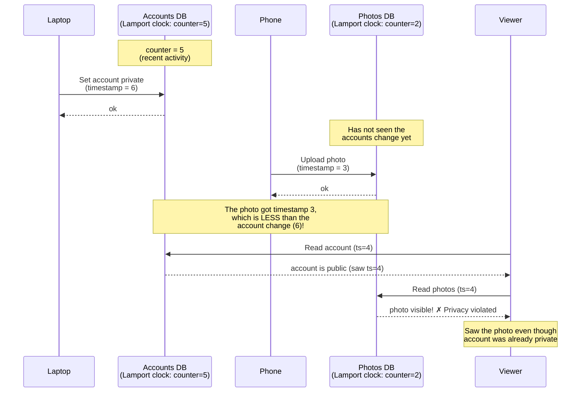
```mermaid
sequenceDiagram
    participant Laptop
    participant AccountsDB as Accounts DB<br/>(Lamport clock: counter=5)
    participant Phone
    participant PhotosDB as Photos DB<br/>(Lamport clock: counter=2)
    participant Viewer

    Note over AccountsDB: counter = 5<br/>(recent activity)

    Laptop->>AccountsDB: Set account private<br/>(timestamp = 6)
    AccountsDB-->>Laptop: ok

    Note over PhotosDB: Has not seen the<br/>accounts change yet

    Phone->>PhotosDB: Upload photo<br/>(timestamp = 3)
    PhotosDB-->>Phone: ok

    Note over AccountsDB,PhotosDB: The photo got timestamp 3,<br/>which is LESS than the<br/>account change (6)!

    Viewer->>AccountsDB: Read account (ts=4)
    AccountsDB-->>Viewer: account is public (saw ts=4)
    Viewer->>PhotosDB: Read photos (ts=4)
    PhotosDB-->>Viewer: photo visible! ✗ Privacy violated

    Note over Viewer: Saw the photo even though<br/>account was already private
```

The account permission and the photo are stored in two separate databases (or separate shards of the same database), and let's assume they use a Lamport clock or hybrid logical clock to assign a timestamp to every write. Since the photos database didn't read from the accounts database, it's possible that the local counter in the photos database is slightly behind, and therefore the photo upload is assigned a lower timestamp than the update of the account settings.

Now, suppose that a viewer (who is not friends with A) is looking at A's profile, and their read uses an MVCC implementation of snapshot isolation. It could happen that the viewer's read has a timestamp that is greater than that of the photo upload, but less than that of the account settings update. As a result, the system will determine that the account is still public at the time of the read and therefore show the viewer the embarrassing photo that they were not supposed to see.

You can imagine several possible ways of fixing this problem. Maybe the photos database should have read the user's account status before performing the write, but it's easy to forget such a check. The simplest solution in this case would be to use a **linearizable ID generator**, which would ensure that the photo upload is assigned a greater ID than the account permissions change.

The simplest way of ensuring that ID assignment is linearizable is by **actually using a single node** for this purpose. That node needs to do only three things:

1. Atomically increment a counter and return its value when requested.
2. Persist the counter value (so that it doesn't generate duplicate IDs if the node crashes and restarts).
3. Replicate it for fault tolerance (using single-leader replication).

This approach is used in practice — for example, TiDB/TiKV calls it a **timestamp oracle**, inspired by Google's Percolator [Peng & Dabek, 2010].

As an optimization, you can avoid performing a disk write and replication on every single request. Instead, the ID generator can write a record describing a batch of IDs; once that record is persisted and replicated, the node can start handing out those IDs to clients in sequence. Before it runs out of IDs in that batch, it can persist and replicate the record for the next batch. That way, some IDs will be skipped if the node crashes and restarts or if you fail over to a follower, but you won't issue any duplicate or out-of-order IDs.

```python
class LinearizableIDGenerator:
    """A single-node, fault-tolerant linearizable ID generator.
    Uses single-leader replication for fault tolerance.
    Optimizes by issuing IDs in pre-allocated batches."""

    def __init__(self, replication_log, batch_size=1000):
        self.log = replication_log       # consensus-based replicated log
        self.batch_size = batch_size
        self.current_batch = []          # (start_id, end_id)
        self.next_id = None
        self.end_id = None

    def _allocate_batch(self):
        """Persist a new batch to the replicated log."""
        # Atomically append a 'next-batch' record to the log
        # (this requires consensus — see next section)
        start = self.log.append({"allocate": self.batch_size})
        self.next_id = start
        self.end_id = start + self.batch_size - 1
        self.current_batch = (self.next_id, self.end_id)

    def get_id(self):
        if self.next_id is None or self.next_id > self.end_id:
            self._allocate_batch()
        id_to_return = self.next_id
        self.next_id += 1
        return id_to_return

    def get_id_block(self, n):
        """Hand out a block of IDs in one call."""
        if self.next_id is None or self.next_id + n - 1 > self.end_id:
            self._allocate_batch()
        block_start = self.next_id
        self.next_id += n
        return block_start  # caller can use [block_start, block_start + n)


# Example usage
log = ReplicatedLog()  # provided by Raft/Zab
gen = LinearizableIDGenerator(log, batch_size=1000)

id_a = gen.get_id()  # 1
id_b = gen.get_id()  # 2
assert id_a < id_b     # linearizable ordering guaranteed
```

You can't easily shard the ID generator, since if you have multiple shards independently handing out IDs, you can no longer guarantee that their order is linearizable. You also can't easily distribute the ID generator across multiple regions; thus, in a geographically distributed database, all requests for IDs will have to go to a node in a single region. On the upside, the ID generator's job is very simple, so a single node can handle a large request throughput.

If you don't want to use a single-node ID generator, you can do what Google's Spanner does. It relies on a physical clock that returns not just a single timestamp, but a range of timestamps indicating the **uncertainty** in the clock reading. Spanner then waits for the duration of that uncertainty interval to elapse before returning. Assuming that the uncertainty interval is correct (i.e., the true current physical time always lies within that interval), this process also guarantees that if one request completes before another begins, the later request will have a greater timestamp. This approach ensures linearizable ID assignment without any communication; even requests in different regions will be ordered correctly, without waiting for cross-region requests. The downside is that you need hardware and software support for clocks to be tightly synchronized and to compute the necessary uncertainty interval.

#### Enforcing Constraints Using Logical Clocks

We saw earlier that a linearizable CAS operation can be used to implement locks, uniqueness constraints, and similar constructs in a distributed system. This raises the question: is a logical clock or a linearizable ID generator also sufficient to implement these things?

The answer is: **not quite**. When you have several nodes that are all trying to acquire the same lock or register the same username, you could use a logical clock to assign timestamps to those requests and pick the one with the lowest timestamp as the winner. If the clock is linearizable, you know that any future requests will always generate greater timestamps, and therefore you can be sure that no future request will receive a lower timestamp than the winner.

Unfortunately, part of the problem is still unsolved: how does a node know whether its own timestamp is the lowest? To be sure, it needs to hear from every other node that might have generated a timestamp. If one of the other nodes has failed in the meantime, or cannot be reached because of a network problem, this system would grind to a halt because we can't be sure that node's timestamp isn't lower. This is not the kind of fault-tolerant system that we need.

**To implement locks, leases, and similar constructs in a fault-tolerant way, we need something stronger than logical clocks or ID generators. We need consensus.**

---

## 3. Consensus

We have seen several examples of things that are easy when you have only a single node but that get a lot harder if you want fault tolerance:

- A database can be linearizable if you have only a single leader and you make all reads and writes on that leader. But how do you fail over if that leader fails, while avoiding split brain? How do you ensure that a node that believes itself to be the leader hasn't actually been voted out while it's temporarily paused?
- A linearizable ID generator on a single node is just a counter with an atomic fetch-and-add instruction — what if it crashes?
- An atomic CAS operation is useful for deciding who gets a lock or lease when several processes are racing to acquire it, for ensuring the uniqueness of a file or user with a given name. On a single node, CAS may be as simple as one CPU instruction, but how do you make it fault-tolerant?

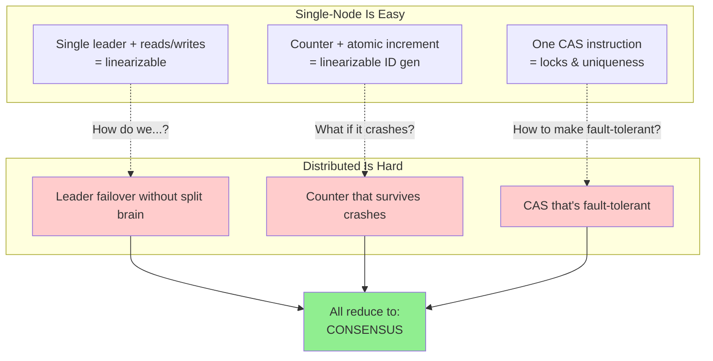
```mermaid
graph TB
    subgraph "Single-Node Is Easy"
        S1["Single leader + reads/writes<br/>= linearizable"]
        S2["Counter + atomic increment<br/>= linearizable ID gen"]
        S3["One CAS instruction<br/>= locks & uniqueness"]
    end

    subgraph "Distributed Is Hard"
        D1["Leader failover without split brain"]
        D2["Counter that survives crashes"]
        D3["CAS that's fault-tolerant"]
    end

    S1 -.->|"How do we...?"| D1
    S2 -.->|"What if it crashes?"| D2
    S3 -.->|"How to make fault-tolerant?"| D3

    D1 --> C["All reduce to:<br/>CONSENSUS"]
    D2 --> C
    D3 --> C

    style C fill:#90EE90
    style D1 fill:#ffcccc
    style D2 fill:#ffcccc
    style D3 fill:#ffcccc
```

It turns out that all of these are instances of the same fundamental distributed systems problem: **consensus**. The standard formulation of consensus involves getting multiple nodes to agree on a single value. It is one of the most important and fundamental problems in distributed computing; it is also infamously difficult to get right [Lamport, 2001; Ongaro & Ousterhout, 2014], and many systems have gotten it wrong in the past.

The best-known consensus algorithms are:

- **Viewstamped Replication** [Oki & Liskov, 1988]
- **Paxos** [Lamport, 2001]
- **Raft** [Ongaro & Ousterhout, 2014]
- **Zab** [Junqueira & Reed, 2013; Medeiros, 2012]

These algorithms have quite a few similarities, but they are not the same. They all work in a **non-Byzantine system model** — that is, network communication may be arbitrarily delayed or dropped, and nodes may crash, restart, and become disconnected, but the algorithms assume that nodes otherwise follow the protocol correctly and do not behave maliciously.

There are also consensus algorithms that can tolerate some Byzantine nodes (i.e., nodes that don't correctly follow the protocol). A common assumption is that fewer than one-third of the nodes are Byzantine-faulty. Such algorithms are used in blockchains, for example. However, Byzantine fault-tolerant algorithms are beyond the scope of this book.

---

### The Impossibility of Consensus

You may have heard about the **FLP result** [Fischer et al., 1985] — named after the authors Fischer, Lynch, and Paterson — which proves no algorithm is always able to reach consensus if there is a risk that a node may crash. In a distributed system, we must assume that nodes may crash, so reliable consensus is impossible. Yet, here we are, discussing algorithms for achieving consensus. What's going on here?

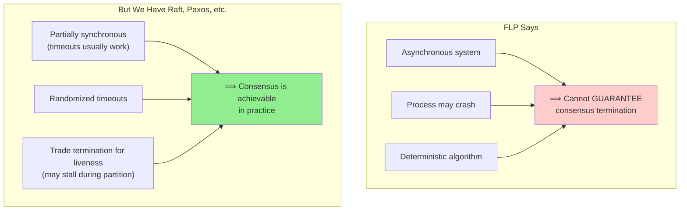
```mermaid
graph TB
    subgraph "FLP Says"
        A["Asynchronous system"]
        F["Process may crash"]
        D["Deterministic algorithm"]

        R["⟹ Cannot GUARANTEE<br/>consensus termination"]
        A --> R
        F --> R
        D --> R
    end

    subgraph "But We Have Raft, Paxos, etc."
        P["Partially synchronous<br/>(timeouts usually work)"]
        T["Randomized timeouts"]
        L["Trade termination for liveness<br/>(may stall during partition)"]
        C["⟹ Consensus is achievable<br/>in practice"]
        P --> C
        T --> C
        L --> C
    end

    style R fill:#ffcccc
    style C fill:#90EE90
```

First, FLP doesn't say that we can never reach consensus; it only says that we can't guarantee that a consensus algorithm will **always terminate**. Moreover, the FLP result is proved assuming a deterministic algorithm in the **asynchronous system model**, which means the algorithm cannot use any clocks or timeouts. If it can use timeouts to suspect that another node may have crashed (even if the suspicion is sometimes wrong), then consensus becomes solvable. Even allowing the algorithm to use random numbers is sufficient.

Thus, although the FLP result about the impossibility of consensus is of great theoretical importance, distributed systems can usually achieve consensus in practice.

---

### The Many Faces of Consensus

Consensus can be expressed in several ways:

- **Single-value consensus** is very similar to an atomic CAS operation. It can be used to implement locks, leases, and uniqueness constraints.
- **Constructing an append-only log** also requires consensus, which is usually formalized as **total order broadcast**. With a log, you can implement state machine replication, leader-based replication, event sourcing, and other useful patterns.
- An **atomic fetch-and-add** (or atomic increment) operation also turns out to be equivalent to consensus.
- **Atomic commitment** of a multidatabase or multishard transaction requires that all participants agree on whether to commit or abort the transaction.

**These problems are all equivalent**: if you have an algorithm that solves one of these problems, you can convert it into a solution for any of the others. The subsections below sketch the equivalence proofs.

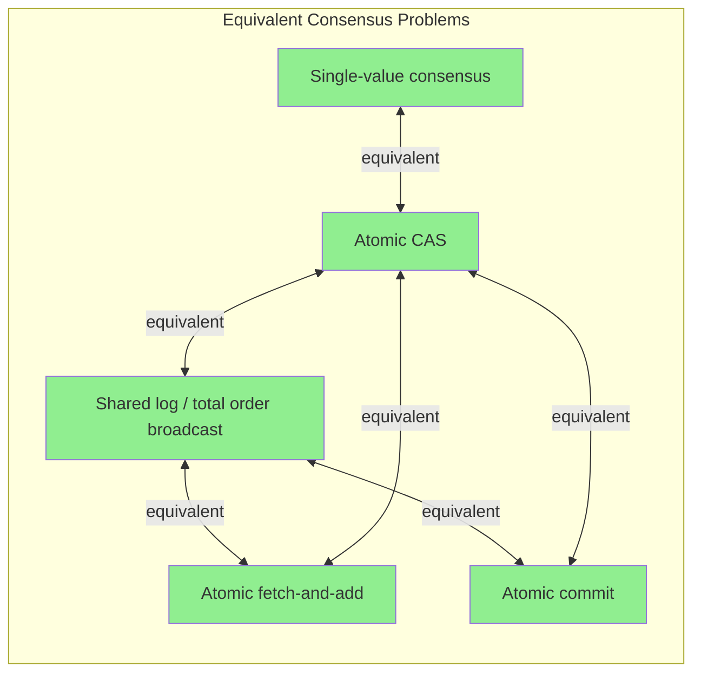
```mermaid
graph LR
    subgraph "Equivalent Consensus Problems"
        SV["Single-value consensus"]
        CAS2["Atomic CAS"]
        LOG["Shared log / total order broadcast"]
        FAA["Atomic fetch-and-add"]
        AC["Atomic commit"]
    end

    SV <-->|"equivalent"| CAS2
    CAS2 <-->|"equivalent"| LOG
    LOG <-->|"equivalent"| FAA
    LOG <-->|"equivalent"| AC
    CAS2 <-->|"equivalent"| FAA
    CAS2 <-->|"equivalent"| AC

    style SV fill:#90EE90
    style CAS2 fill:#90EE90
    style LOG fill:#90EE90
    style FAA fill:#90EE90
    style AC fill:#90EE90
```

#### Single-Value Consensus

The ability to get multiple nodes to agree on a single value is very useful. For example:

- When a database with single-leader replication first starts up, or when the existing leader fails, several nodes may concurrently try to become the leader. Similarly, multiple nodes may race to acquire a lock or lease. Consensus allows them to decide which one wins.
- If several people concurrently try to book the last seat on an airplane or the same seat in a theater, or try to register an account with the same username, then a consensus algorithm can determine which one should succeed.

More generally, one or more nodes may **propose values**, and the consensus algorithm **decides** on one of those values. In the examples given, each node could propose its own ID, and the algorithm would decide which node ID should become the new leader, the holder of the lease, or the buyer of the airplane/theater seat.

In this formalism, a consensus algorithm must satisfy the following properties:

| Property | Definition |
|----------|------------|
| **Uniform agreement** | No two nodes decide differently |
| **Integrity** | After a node has decided one value, it cannot change its mind |
| **Validity** | If a node decides value `v`, then `v` was proposed by a node |
| **Termination** | Every node that does not crash eventually decides a value |

If you want to decide multiple values, you can run a separate instance of the consensus algorithm for each. For example, you could have a separate consensus run for each bookable seat in the theater so that you get one decision (one buyer) for each seat.

The uniform agreement and integrity properties define the core idea of consensus: everyone decides on the same outcome, and after you have decided, you cannot change your mind. The validity property rules out trivial solutions — for example, you could have an algorithm that always decides null, no matter what was proposed; this algorithm would satisfy the agreement and integrity properties, but not the validity property.

If you don't care about fault tolerance, satisfying the first three properties is easy. You can just hardcode one node to be the "dictator," and let that node make all the decisions. However, if that one node fails, the system can no longer make any decisions — just like single-leader replication without failover. **All the difficulty arises from the need for fault tolerance.**

The termination property formalizes the idea of fault tolerance. It says that a consensus algorithm cannot simply sit around and do nothing forever — in other words, it must make progress. Even if some nodes fail, the other nodes must still reach a decision. (Termination is a **liveness property**, whereas the other three are **safety properties**.)

If a crashed node may recover, you could just wait for it to come back. However, a consensus algorithm must ensure that it makes a decision even if a crashed node suddenly disappears and never comes back. (Instead of a software crash, imagine that an earthquake causes the datacenter containing your node to be destroyed by a landslide. You must assume that your node is buried under 30 feet of mud and is never going to come back online.)

Of course, if all nodes crash and none are running, it is not possible for any algorithm to decide anything. There is a limit to the number of failures that an algorithm can tolerate. In fact, it can be proved that any consensus algorithm requires at least a majority of nodes to be functioning correctly in order to assure termination. That majority can safely form a quorum.

Thus, the termination property is subject to the assumption that fewer than half of the nodes are unreachable. However, most consensus algorithms ensure that the safety properties — agreement, integrity, and validity — are always met, even if a majority of nodes fail or a severe network problem occurs. Thus, a large-scale outage can stop the system from being able to process requests, but it cannot corrupt the consensus system by causing it to make inconsistent decisions.

#### Compare-And-Set as Consensus

A CAS operation checks whether the current value of an object equals an expected value. If so, it atomically updates the object to a new value; if not, it leaves the object unchanged and returns an error.

If you have a fault-tolerant, linearizable CAS operation, solving the consensus problem is easy. Initially set the object to a null value, then have each node that wants to propose a value perform a CAS, with the expected value being null and the new value being the value it wants to propose (assuming it is non-null). The decided value is then whatever value the object is set to.

Likewise, if you have a solution for consensus, you can implement CAS. Whenever one or more nodes want to perform a CAS with the same expected value, you use the consensus protocol to propose the new values in the CAS invocation and then set the object to whatever value was decided by consensus. Any CAS invocations whose proposed value was not decided return an error.

This shows that **CAS and consensus are equivalent**. As an example of CAS in a distributed setting, conditional write operations for object stores allow a write to happen only if an object with the same name has not been created or modified by another client since the current client last read it.

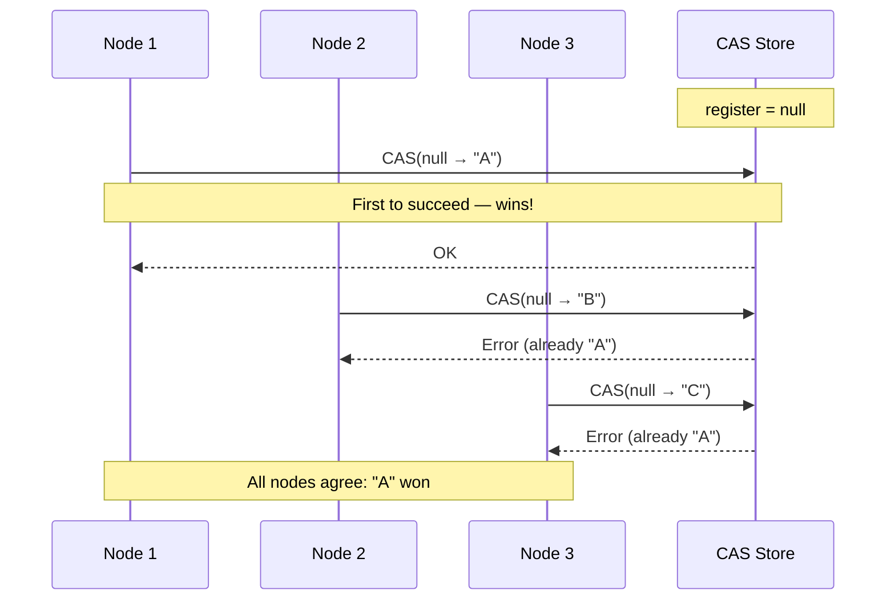
```mermaid
sequenceDiagram
    participant N1 as Node 1
    participant N2 as Node 2
    participant N3 as Node 3
    participant Store as CAS Store

    Note over Store: register = null

    N1->>Store: CAS(null → "A")
    Note over N1,Store: First to succeed — wins!
    Store-->>N1: OK

    N2->>Store: CAS(null → "B")
    Store-->>N2: Error (already "A")

    N3->>Store: CAS(null → "C")
    Store-->>N3: Error (already "A")

    Note over N1,N3: All nodes agree: "A" won
```

#### Shared Logs as Consensus

We have seen several examples of logs, such as replication logs, transaction logs, and write-ahead logs. A log stores a sequence of log entries, and anyone who reads it sees the same entries in the same order. Sometimes a log has a single writer that is allowed to append new entries, but a **shared log** is one where multiple nodes can request that entries be appended. An example is single-leader replication: any client can ask the leader to make a write, which the leader appends to the replication log, and then all followers apply the writes in the same order as the leader.

More formally, a shared log supports two operations: you can request that a value be added to the log, and you can read the entries in the log. It must satisfy the following properties:

| Property | Definition |
|----------|------------|
| **Eventual append** | If a node requests that a value be added to the log, and the node does not crash, then that node must eventually read that value in a log entry |
| **Reliable delivery** | No log entries are lost — if one node reads a log entry, then eventually every node that does not crash must also read that log entry |
| **Append-only** | After a node has read a log entry, it is immutable, and new log entries can be added only after it, not before |
| **Agreement** | If two nodes both read a log entry `e`, then prior to `e` they must have read exactly the same sequence of log entries in the same order |
| **Validity** | If a node reads a log entry containing a value, then a node previously requested that value's addition to the log |

A shared log can be implemented using a **total order broadcast** protocol, also known as atomic broadcast or total order multicast protocol. To add a value to the log, we "broadcast" it using the protocol, and when the protocol "delivers" it, the value becomes part of a log entry that can be read.

If you have an implementation of a shared log, solving the consensus problem is easy. Every node that wants to propose a value requests that it be added to the log, and whichever value is read back in the first log entry is the value that is decided. Since all nodes read log entries in the same order, they are guaranteed to agree on which value is delivered first.

Conversely, if you have a solution for consensus, you can implement a shared log:

1. You have a slot in the log for every future log entry, and you run a separate instance of the consensus algorithm for every such slot to decide what value should go in that entry.
2. When a node wants to add a value to the log, it proposes that value for one of the slots that has not yet been decided.
3. When the consensus algorithm decides for one of the slots, and all the previous slots have already been decided, then the decided value is appended as a new log entry, and any consecutive slots that have been decided also have their decided value appended to the log.
4. If a proposed value was not chosen for a slot, the node that wanted to add it retries by proposing it for a later slot.

This shows that **consensus is equivalent to total order broadcast and shared logs**.

Single-leader replication without failover does not meet the liveness requirements since it stops delivering messages if the leader crashes. As usual, the challenge is in performing failover safely and automatically.

#### Fetch-and-Add as Consensus

The linearizable ID generator we saw earlier comes close to solving consensus, but it falls slightly short. We can implement such an ID generator by using a **fetch-and-add** operation, which atomically increments a counter and returns the old counter value.

If you have a CAS operation, implementing fetch-and-add is easy. First read the counter value, then perform a CAS where the expected value is the value you read, and the new value is that value plus 1. If the CAS fails, you retry the whole process until the CAS succeeds. This is less efficient than a native fetch-and-add operation when there is contention, but it is functionally equivalent. Since you can implement CAS using consensus, you can also implement fetch-and-add using consensus.

Conversely, if you have a fault-tolerant fetch-and-add operation, can you solve the consensus problem? Let's say you initialize the counter to 0, and every node that wants to propose a value invokes the fetch-and-add operation to increment the counter. Since the fetch-and-add operation is atomic, one node will read the initial value of 0, and all the others will read a value that has been incremented at least once. Now let's say that the node that reads 0 is the winner, and its value is decided.

That works for the node that read 0, but the other nodes have a problem: they know that they are not the winner, but they don't know which of the other nodes has won. The winner could send a message to the other nodes to let them know it has won, but what if the winner crashes before it has a chance to send this message? In that case the other nodes are left hanging, unable to decide any value, and thus the consensus does not terminate.

An exception occurs if we know for sure that no more than **two** nodes will propose a value. In that case, the nodes can send each other the values they want to propose and then each perform the fetch-and-add operation. The node that reads 0 decides its own value, and the node that reads 1 decides the other node's value. This solves the consensus problem for two nodes, which is why we can say that fetch-and-add has a **consensus number of 2**. In contrast, CAS and shared logs solve consensus for any number of nodes that may propose values, so they have a **consensus number of ∞ (infinity)**.

#### Atomic Commitment as Consensus

For the protocol mechanics of two-phase commit (the coordinator, prepare, commit, in-doubt recovery, etc.) see Chapter 8. This subsection keeps only the equivalence argument: atomic commitment is consensus.

What is the relationship between consensus and atomic commitment? At first glance, they seem very similar — both require nodes to come to some form of agreement. However, there is one important difference: with consensus it's OK to decide any value that was proposed, whereas with atomic commitment the algorithm must **abort if any of the participants voted to abort**. More precisely, atomic commitment requires:

| Property | Definition |
|----------|------------|
| **Uniform agreement** | It is not possible for one node to commit and another to abort |
| **Integrity** | Once a node has committed, it cannot change its mind to abort, and vice versa |
| **Validity** | If a node commits, all nodes must have previously voted to commit. If any node voted to abort, all nodes must abort |
| **Nontriviality** | If all nodes vote to commit, and no communication timeouts occur, then all nodes must commit |
| **Termination** | Every node that does not crash either commits or aborts eventually |

The validity property ensures that a transaction can commit only if all nodes agree, and the nontriviality property ensures that the algorithm can't simply always abort (but it allows an abort if any of the communication among the nodes times out).

If you have a solution for consensus, you could solve atomic commitment in multiple ways. One works like this: when you want to commit the transaction, every node sends its vote to commit or abort to every other node. Nodes that receive a vote to commit from themselves and every other node propose "commit" via the consensus algorithm; nodes that receive a vote to abort, or that experience a timeout, propose "abort" via the consensus algorithm. When a node finds out what the consensus algorithm decided, it commits or aborts accordingly.

If you have a fault-tolerant atomic commitment protocol, you can also solve consensus. Every node that wants to propose a value starts a transaction on a quorum of nodes, and at each node it performs a single-node CAS to set a register to the proposed value if its value has not already been set by another transaction. If the CAS succeeds, the node votes to commit, and otherwise it votes to abort. If the atomic commit protocol commits a transaction, its value is decided for consensus; if atomic commit aborts, the proposing node retries with a new transaction.

This shows that **atomic commit and consensus are also equivalent to each other**.

---

## 4. Consensus in Practice

We have seen that single-value consensus, CAS, shared logs, and atomic commitment are all equivalent: you can convert a solution to one of these problems into a solution to any of the others. That is a valuable theoretical insight, but it doesn't answer this question: which of these many formulations of consensus is the most useful in practice?

The answer is that **most consensus systems provide shared logs** (an abstraction equivalent to total order broadcast). Raft, Viewstamped Replication, and Zab provide shared logs right out of the box. Paxos provides single-value consensus, but in practice most systems using Paxos actually use the extension called Multi-Paxos, which also provides a shared log.

### Using Shared Logs

A shared log is a good fit for database replication. If every log entry represents a write to the database, and every replica processes the same writes in the same order by using deterministic logic, then all the replicas will end up in a consistent state. This idea is known as **state machine replication**, and it is the principle behind event sourcing. Shared logs are also useful for stream processing.

```mermaid
graph TB
    subgraph "State Machine Replication"
        Client[Client Request] --> L["Leader Log"]
        L -->|"AppendEntries"| F1["Follower 1"]
        L -->|"AppendEntries"| F2["Follower 2"]
        L -->|"AppendEntries"| F3["Follower 3"]
        F1 --> SM1["State Machine 1<br/>deterministic"]
        F2 --> SM2["State Machine 2<br/>deterministic"]
        F3 --> SM3["State Machine 3<br/>deterministic"]
        SM1 --> R1["Same Result"]
        SM2 --> R1
        SM3 --> R1
    end

    style L fill:#90EE90
    style R1 fill:#FFD700
```

Similarly, a shared log can be used to implement serializable transactions. If every log entry represents a deterministic transaction to be executed as a stored procedure, and if every node executes those transactions in the same order, the transactions will be serializable.

A shared log is also powerful because it can easily be adapted to other forms of consensus:

- To implement single-value consensus and CAS, simply decide the value that appears first in the log.
- For many instances of single-value consensus (one per seat in a theater where several people are trying to book seats), include the seat number in the log entries and decide the first log entry that contains a given seat number.
- For an atomic fetch-and-add, put the number to add to the counter in a log entry, and have the current counter value be the sum of all the log entries so far. A simple counter on log entries can be used to generate **fencing tokens**; for example, in ZooKeeper, this sequence number is called `zxid`.

### From Single-Leader Replication to Consensus

The failover and split-brain problem with single-leader replication is covered in Chapter 6 §1.4. This subsection focuses on how consensus algorithms solve it.

We saw previously that single-value consensus is easy if you have a single "dictator" node that makes the decision, and likewise a shared log is easy if a single leader is the only node allowed to append log entries. The question is how to provide fault tolerance if that node fails.

Traditionally, databases with single-leader replication didn't solve this problem: they left leader failover as an action that a human administrator had to perform manually. Unfortunately, this means a significant amount of downtime, since there is a limit to how fast humans can react, and it doesn't satisfy the termination property of consensus. For consensus, we require that the algorithm can automatically choose a new leader. (Not all consensus algorithms have a leader, but the commonly used algorithms do.)

This is not straightforward. We previously discussed the problem of split brain, and we established that all nodes need to agree on who the leader is — otherwise, two nodes could each believe themselves to be the leader and make inconsistent decisions. Thus, **it seems like we need consensus to elect a leader, and we need a leader in order to solve consensus. How do we break out of this conundrum?**

In fact, consensus algorithms don't require that there is only one leader at any one time. Instead, they make a weaker guarantee: they define an **epoch number** (called the **ballot number** in Paxos, **view number** in Viewstamped Replication, and **term number** in Raft) and guarantee that within each epoch, the leader is unique.

```mermaid
sequenceDiagram
    participant L1 as Old Leader<br/>(term 1)
    participant N2 as Node 2
    participant N3 as Node 3
    participant L2 as New Leader<br/>(term 2)

    Note over L1: Term 1: L1 is leader

    Note over L1,N3: L1 stops responding (timeout)
    N2->>N3: Election request (term 2)
    N3->>N2: Vote for term 2

    Note over L2: Term 2: L2 is leader<br/>(majority votes received)

    Note over L1: L1 wakes up — sees term 2<br/>immediately steps down

    L2->>N2: AppendEntries (term 2)
    L2->>N3: AppendEntries (term 2)
    L2->>L1: AppendEntries (term 2)
```

When a node believes that the current leader is dead because it hasn't heard from the leader for some timeout, it may start a vote to elect a new leader. This election is given a new epoch number that is greater than any previous epoch number. If a conflict arises between two leaders in two epochs (perhaps because the previous leader wasn't dead after all), then the leader with the higher epoch number prevails.

Before a leader is allowed to append the next entry to the shared log, it must first check that there isn't another leader with a higher epoch number that might append a different entry. It can do this by collecting votes from a quorum of nodes — typically, but not always, a majority of nodes. A node votes yes only if it is not aware of any other leader with a higher epoch.

Thus, we have **two rounds of voting**: once to choose a leader, and a second time to vote on a leader's proposal for the next entry to append to the log. The quorums for those two votes must overlap: if a vote on a proposal succeeds, at least one of the nodes that voted for it must have also participated in the most recent successful leader election. If the vote on a proposal passes without revealing any higher-numbered epoch, the current leader can conclude that no leader with a higher epoch number has been elected, and therefore it can safely append the proposed entry to the log.

```mermaid
graph TB
    subgraph "Two Rounds of Voting"
        E["Leader Election<br/>Quorum Vote 1"]
        P["Propose Log Entry<br/>Quorum Vote 2"]
        E -->|"must overlap"| P
    end

    subgraph "Why They Must Overlap"
        O["If vote 2 succeeds,<br/>at least one node<br/>also voted in vote 1"]
        O2["So no higher-epoch leader<br/>could exist"]
        O --> O2
    end

    style E fill:#87CEEB
    style P fill:#90EE90
```

These two rounds of voting look superficially similar to 2PC, but they are very different protocols. In consensus algorithms, any node can start an election, and it requires only a quorum of nodes to respond; in 2PC, only the coordinator can request votes, and it requires a yes vote from every participant before it can commit.

| Aspect | 2PC | Consensus (e.g. Raft) |
|--------|-----|------------------------|
| Who initiates | Only the coordinator | Any node |
| Quorum required | All participants (unanimous) | Quorum (typically majority) |
| Failure of coordinator | Blocking — participants stuck | Other nodes elect new leader |
| Outcome | Commit or abort | Append to log (committed) |
| Equivalent to consensus? | **No** — coordinator is SPOF | **Yes** |

### Subtleties of Consensus

This basic structure is common to Raft, Multi-Paxos, Viewstamped Replication, and Zab: a vote by a quorum of nodes elects a leader, and then another quorum vote is required for every entry that the leader wants to append to the log. Every new log entry is synchronously replicated to a quorum of nodes before it is confirmed to the client that requested the write. This ensures that the log entry won't be lost if the current leader fails.

However, the devil is in the details, and that's also where these algorithms take different approaches. For example, when the old leader fails and a new one is elected, the algorithm needs to ensure that the new leader honors any log entries that had already been appended by the old leader before it failed. **Raft** does this by allowing a node to become the new leader only if its log is at least as up-to-date as those of a majority of its followers. In contrast, **Paxos** allows any node to become the new leader, but requires it to bring its log up-to-date with other nodes before it can start appending new entries of its own.

#### Consistency Versus Availability in Leader Election

If you want the consensus algorithm to strictly guarantee the properties laid out for shared logs, it's essential that the new leader is up-to-date with any confirmed log entries before it can process any writes or linearizable reads. If a node with stale data were to become the new leader, it might write new values to log entries that were already written by the old leader, violating the shared log's append-only property.

In some cases, you might choose to weaken the consensus properties in order to recover more quickly from a leader failure or to be able to recover at all. For example, **Kafka offers the option of enabling unclean leader election**, which allows any replica to become leader, even if it is not up-to-date. Also, in databases with asynchronous replication, you cannot guarantee that any follower is up-to-date when the leader fails.

If you drop the requirement for the new leader to be up-to-date, you may improve performance and availability, but **you are on thin ice, since the theory of consensus no longer applies**. While things will work fine as long as there are no faults, the problems discussed in Chapter 9 can easily cause data loss or corruption.

Another subtlety is in how the algorithms deal with log entries that had been proposed by the old leader before it failed, but for which the vote on appending to the log has not yet completed.

For databases that use a consensus algorithm for replication, turning writes into log entries and replicating them to a quorum isn't all that's required. **If you want to guarantee linearizable reads, they also have to go through a quorum vote**, similarly to a write, to confirm that the node that believes itself to be the leader really is still up-to-date. Linearizable reads in etcd work like this, for example.

In their standard form, most consensus algorithms assume a fixed set of nodes — that is, nodes may go down and come back up again, but the set of nodes that is allowed to vote is fixed when the cluster is created. In practice, it's often necessary to add new nodes or remove old nodes in a system configuration. Consensus algorithms have been extended with reconfiguration features that make this possible.

```python
class RaftInvariant:
    """Invariants that Raft guarantees — these are what make it safe."""

    @staticmethod
    def election_safety():
        """At most one leader per term."""
        return "Only one candidate can win a majority in a given term"

    @staticmethod
    def leader_append_only():
        """Leader never overwrites or deletes entries from its own log."""
        return "A leader's log only grows at the end"

    @staticmethod
    def log_matching():
        """If two logs have the same entry at the same index,
        all preceding entries are identical."""
        return "Log consistency across all nodes"

    @staticmethod
    def leader_completeness():
        """If a log entry is committed in some term, it will be present
        in the logs of all leaders in all higher-numbered terms."""
        return "Committed entries are never lost"

    @staticmethod
    def state_machine_safety():
        """If a node applies a log entry at a given index to its state
        machine, no other node will ever apply a different entry
        at the same index."""
        return "All nodes execute the same commands in the same order"


# How a Raft leader replicates entries
class RaftLeader:
    def __init__(self, node_id, peers):
        self.node_id = node_id
        self.peers = peers
        self.current_term = 0
        self.log = []  # list of (term, command)
        self.commit_index = -1

    def replicate(self, command):
        """Append a new entry, replicate to a quorum, then commit."""
        self.current_term += 1
        entry = (self.current_term, command)
        self.log.append(entry)
        index = len(self.log) - 1

        # Send AppendEntries to all peers
        acks = 1  # self
        for peer in self.peers:
            if peer.append_entries(self.current_term, self.log, index):
                acks += 1

        # If we have a majority, commit
        if acks > (len(self.peers) + 1) // 2:
            self.commit_index = index
            self.apply_to_state_machine(entry)
            return True
        return False
```

### Pros and Cons of Consensus

Although they are complex and subtle, consensus algorithms are a huge breakthrough for distributed systems. Consensus is "single-leader replication done right," with automatic failover on leader failure, ensuring that no committed data is lost and split brain is not possible, even in the face of all the problems we discussed in Chapter 9.

Any system that provides automatic failover but does not use a proven consensus algorithm is likely to be unsafe. Using a proven consensus algorithm is not a guarantee of correctness of the whole system — there are still plenty of other places where bugs can lurk — but it's a good start.

Nevertheless, **consensus is not used everywhere because the benefits come at a cost**:

- **Strict majority required**: consensus systems always require a strict majority to operate — three nodes to tolerate one failure, or five nodes to tolerate two failures.
- **No scaling by adding nodes**: every operation you perform requires communication with a quorum, so you can't increase throughput by adding more nodes (in fact, every node you add makes the algorithm slower).
- **Unavailable under partition**: if a network partition cuts off some nodes from the rest, only the majority portion of the network can make progress, and the other nodes are blocked.
- **Tuning timeouts is hard**: consensus systems generally rely on timeouts to detect failed nodes. In environments with highly variable network delays, especially systems distributed across multiple geographic regions, tuning these timeouts can be difficult. If they are too large, recovering from a failure takes a long time; if they are too small, lots of unnecessary leader elections can occur.

Sometimes consensus algorithms are particularly sensitive to network problems. For example, Raft has been shown to have unpleasant edge cases. If the entire network is working correctly except for one particular network link that is consistently unreliable, Raft can get into situations where leadership continually bounces between two nodes, or the current leader is continually forced to resign, so the system effectively never makes progress. The original Raft algorithm was extended with a pre-vote phase to address this. Paxos also depends on leaders, which can cause similar performance issues. **Egalitarian Paxos (EPaxos)** and its derivatives use a leaderless protocol that is more robust against poorly performing nodes or network connections.

---

## 5. Coordination Services

Consensus algorithms are useful in any distributed database that wants to offer linearizable operations, and many modern distributed databases use them for replication. But one family of systems is a particularly prominent user of consensus: **coordination services** such as ZooKeeper, etcd, and Consul. Although these systems look superficially like any other key-value store, they are not designed for high write volumes or general-purpose data storage, like most databases.

This chapter is the canonical home for **distributed locks, leases, and fencing tokens** (cross-referenced from Chapter 6 §1.4 and Chapter 9 §10). Coordination services like ZooKeeper and etcd are the standard off-the-shelf implementations: don't build your own.

Instead, they are designed to **coordinate among nodes of another distributed system**. For example, Kubernetes relies on etcd, while Spark and Flink in high availability mode rely on ZooKeeper running in the background. Coordination services are designed to hold small amounts of data that can fit entirely in memory (although they still write to disk for durability), which is replicated across multiple nodes via a fault-tolerant consensus algorithm.

```mermaid
graph TB
    subgraph "Coordination Services"
        ZK["ZooKeeper<br/>Java, mature,<br/>Zab algorithm"]
        ETCD["etcd<br/>Go, modern,<br/>Raft algorithm"]
        CONSUL["Consul<br/>Go, service mesh,<br/>Raft algorithm"]
        CHUBBY["Chubby<br/>Google internal,<br/>Paxos algorithm"]
    end

    subgraph "Used By"
        U1["Hadoop, Kafka, HBase"]
        U2["Kubernetes<br/>Cloud Native"]
        U3["HashiCorp stack<br/>(Terraform, Vault, Nomad)"]
        U4["Google internal<br/>GFS, BigTable, Spanner"]
    end

    ZK --> U1
    ETCD --> U2
    CONSUL --> U3
    CHUBBY --> U4

    style ZK fill:#87CEEB
    style ETCD fill:#87CEEB
    style CONSUL fill:#87CEEB
    style CHUBBY fill:#87CEEB
```

Coordination services are modeled after Google's **Chubby lock service** [Burrows, 2006]. They combine a consensus algorithm with several other features that turn out to be particularly useful when building distributed systems:

#### Locks and Leases

We saw previously how consensus systems can implement an atomic, fault-tolerant CAS operation. Coordination services rely on this approach to implement locks and leases. If several nodes concurrently try to acquire the same lease, only one of them will succeed.

#### Support for Fencing

When a resource is protected by a lease, you need **fencing** to prevent clients from interfering with one another in the case of a process pause or large network delay. Consensus systems can generate fencing tokens by giving each log entry a monotonically increasing ID (`zxid` and `cversion` in ZooKeeper, `revision` number in etcd).

#### Failure Detection

Clients maintain a long-lived session on the coordination service and periodically exchange heartbeats to check whether the other node is still alive. Even if the connection is temporarily interrupted or a server fails, any leases held by the client remain active. However, if there is no heartbeat for longer than the timeout of the lease, the coordination service assumes the client is dead and releases the lease (ZooKeeper calls these **ephemeral nodes**).

#### Change Notifications

A client can request that the coordination service send it a notification whenever certain keys change. This allows a client to find out when another client joins the cluster (based on the value it writes to the coordination service), or if another client fails (because its session times out and its ephemeral nodes disappear), for example. These notifications save the client from having to frequently poll the service to find out about changes.

Failure detection and change notifications do not require consensus, but they are useful for distributed coordination alongside the atomic operations and fencing support that do require consensus.

| Feature | Requires Consensus? |
|---------|---------------------|
| Locks & leases | ✓ |
| Fencing tokens | ✓ |
| Failure detection | ✗ (but useful alongside) |
| Change notifications | ✗ (but useful alongside) |

### Managing Configuration with Coordination Services

Applications and infrastructure often have configuration parameters such as timeouts, thread pool sizes, and so on. Coordination services are sometimes used to store such configuration data, represented as key-value pairs. Processes load the latest settings upon startup and subscribe to receive notifications of any changes. When a configuration changes, the process can begin using the new setting immediately or restart itself to load the latest changes.

Configuration management doesn't need the consensus aspect of a coordination service, but it's convenient to use a coordination service and rely on its notification feature if you are already running the service anyway. Alternatively, a process could periodically poll for configuration updates from a file or URL, which avoids the need for a specialized service.

### Allocating Work to Nodes

A coordination service is useful if you have several instances of a process or service, and one of them needs to be chosen as leader or primary. If the leader fails, one of the other nodes should take over. This is necessary for single-leader databases, but it's also appropriate for job schedulers and similar stateful systems.

Another use case is when you have a sharded resource (database, message streams, file storage, distributed actor system, etc.) and need to decide which shard to assign to which node. As new nodes join the cluster, some of the shards need to be moved from existing nodes to the new nodes in order to rebalance the load. As nodes are removed or fail, other nodes need to take over the failed nodes' work.

These kinds of tasks can be achieved by judicious use of atomic operations, ephemeral nodes, and notifications in a coordination service. If done correctly, this approach allows the application to automatically recover from faults without human intervention. It's not easy, despite the availability of libraries such as Apache Curator that have sprung up to provide higher-level tools on top of the ZooKeeper client API — but it is still much better than attempting to implement the necessary consensus algorithms from scratch, which would be very prone to bugs.

A dedicated coordination service also has the advantage that it can run on a fixed set of nodes (usually three or five), regardless of how many nodes are in the distributed system that relies on it for coordination. For example, in a storage system with thousands of shards, running a consensus algorithm over thousands of nodes would be terribly inefficient; it's much better to "outsource" the consensus to a small number of nodes running a coordination service.

Normally, the kind of data managed by a coordination service is quite slow-changing. The data represents information like "the node running on IP address 10.1.1.23 is the leader for shard 7," and such assignments usually change on a timescale of minutes or hours. Coordination services are not intended for storing data that may change thousands of times per second. For that, it is better to use a conventional database; alternatively, tools like Apache BookKeeper can be used to replicate the fast-changing internal state of a service.

### Service Discovery

ZooKeeper, etcd, and Consul are also often used for **service discovery** — that is, to find out which IP address you need to connect to in order to reach a particular service. In cloud environments, where it is common for virtual machines to continually come and go, you often don't know the IP addresses of your services ahead of time. Instead, you can configure your services such that when they start up, they register their network endpoints in a service registry, where they can then be found by other services.

Using a coordination service for service discovery can be convenient, as its failure detection and change notification features make it easy for clients to keep track of service instances as they come and go. And if you are already using a coordination service for leases, locking, or leader election, it makes sense to also use it for service discovery, since it already knows which node should receive requests for your service.

However, **using consensus for service discovery is often overkill**. This use case generally doesn't require linearizability, and it's more important that service discovery is highly available and fast, since without it everything would grind to a halt. It's therefore usually preferable to cache service discovery information. Clients that are unable to connect to a service can bypass the cache, retry with the latest value, and update the cache if necessary. Caches may also be refreshed periodically using a time-to-live (TTL) configuration. For example, DNS-based service discovery uses multiple layers of caching to achieve good performance and availability.

To support this use case, ZooKeeper supports **observers**. These replicas receive the log and maintain a copy of the data stored in ZooKeeper, but do not participate in the consensus algorithm's voting process. Reads from an observer are not linearizable as they might be stale, but they remain available even if the network is interrupted, and they increase the read throughput that the system can support by caching.

### Coordination Service Usage Example

Here's a realistic example of how a coordination service is used to build fault-tolerant leader election:

```python
class CoordinationServiceUsage:
    """Realistic example: leader election using a coordination service.
    The service itself runs Raft/Zab; we use it as a client."""

    def __init__(self, coord_client, election_path="/election"):
        self.coord = coord_client
        self.election_path = election_path
        self.node_path = None  # path of our candidate node
        self.is_leader = False

    def run_for_election(self, node_id):
        # Create an ephemeral sequential node
        # (deleted automatically when our session ends)
        self.node_path = self.coord.create(
            f"{self.election_path}/node-",
            value=node_id,
            ephemeral=True,    # dies with our session
            sequential=True,    # auto-numbered (00000001, 00000002, ...)
        )
        self._check_leader()

    def _check_leader(self):
        # Get all candidates, sorted by sequence number
        children = sorted(self.coord.get_children(self.election_path))
        my_name = self.node_path.split('/')[-1]

        if children[0] == my_name:
            # Lowest sequence = leader
            self.is_leader = True
            self.become_leader()
        else:
            self.is_leader = False
            # Watch the node immediately before us
            predecessor = self._get_predecessor(children, my_name)
            if predecessor:
                self.coord.exists(
                    f"{self.election_path}/{predecessor}",
                    watch=self._check_leader,  # callback when it disappears
                )

    def _get_predecessor(self, sorted_children, my_name):
        my_seq = int(my_name.split('-')[-1])
        for child in reversed(sorted_children):
            child_seq = int(child.split('-')[-1])
            if child_seq < my_seq:
                return child
        return None

    def become_leader(self):
        # Do leader-specific work
        # Fencing token = sequence number of our node
        fencing_token = int(self.node_path.split('-')[-1])
        print(f"I am leader! Fencing token: {fencing_token}")
```

```mermaid
sequenceDiagram
    participant N1 as Node 1
    participant ZK as ZooKeeper
    participant N2 as Node 2
    participant N3 as Node 3

    N1->>ZK: create("/election/node-", ephemeral, sequential)
    ZK-->>N1: /election/node-00000001

    N2->>ZK: create("/election/node-", ephemeral, sequential)
    ZK-->>N2: /election/node-00000002

    N3->>ZK: create("/election/node-", ephemeral, sequential)
    ZK-->>N3: /election/node-00000003

    Note over N1: Lowest seq = leader

    Note over N1: 💥 Node 1 crashes
    ZK->>ZK: Session expires → node-00000001 deleted

    ZK->>N2: Watch fired!
    N2->>ZK: get_children("/election")
    ZK-->>N2: [node-00000002, node-00000003]
    Note over N2: I'm now the lowest!<br/>I am the new leader.
```

---

## Summary

In this chapter we examined the topic of strong consistency in fault-tolerant systems: what it is and how to achieve it. We looked in depth at **linearizability**, a popular formalization of strong consistency that ensures replicated data appears as though there were only a single copy, with all operations acting on it atomically. We saw that linearizability is useful if you need some data to be up-to-date when you read it, or if you need to resolve a race condition (e.g., if multiple nodes are concurrently trying to do the same thing, such as creating files with the same name).

Although linearizability is appealing because it is easy to understand — it makes a database behave like a variable in a single-threaded program — it has the downside of being **slow**, especially in environments with large network delays. Many replication algorithms don't guarantee linearizability, even though it superficially might seem like they provide strong consistency.

Next, we applied the concept of linearizability in the context of ID generators. A single-node autoincrementing counter is linearizable but not fault-tolerant. Many distributed ID generation schemes don't guarantee that the IDs are ordered consistently with the order in which the events actually happened. **Logical clocks such as Lamport clocks and hybrid logical clocks provide ordering that is consistent with causality but do not ensure linearizability.**

This led us to **consensus algorithms**, which make it possible to implement fault-tolerant, linearizable replication. Linearizability means the system must behave as if there is only one copy of the data, and all operations happen one at a time to that single copy, in a well-defined order. Consensus provides this by making a group of nodes agree on a single sequence of operations, even if messages are delayed or some nodes fail. That sequence of operations makes a distributed system behave as though only one node is processing operations in order, even though a group of nodes is working together.

The classic formulation of consensus involves deciding on a single value in such a way that all nodes agree on what was decided, and such that they can't change their minds. A wide range of problems are actually reducible to consensus and are equivalent to one another (i.e., if you have a solution for one of them, you can transform it into a solution for all of the others). Such equivalent problems include:

| Equivalent Problem | Description |
|--------------------|-------------|
| **Linearizable CAS** | Atomically decide whether to set a register's value based on whether it equals the parameter |
| **Locks and leases** | When several clients try to grab a lock, decide which one succeeds |
| **Uniqueness constraints** | When concurrent transactions try to create conflicting records, decide which one succeeds |
| **Shared logs** | When several nodes want to append entries to a log, decide the order (equivalent to total order broadcast) |
| **Atomic transaction commit** | All database nodes in a distributed transaction must decide the same way (commit or abort) |
| **Linearizable fetch-and-add** | Decide the order of concurrent increments (only solves consensus between 2 nodes) |

All of these are straightforward if you have only a single node or if you are willing to assign the decision-making capability to a single node. This is what happens in a single-leader database: all the power to make decisions is vested in the leader, which is why such databases are able to provide linearizable operations, uniqueness constraints, a replication log, and more.

However, if that single leader fails, or if a network interruption makes the leader unreachable, such a system becomes unable to make any progress until a human performs a manual failover. Widely used consensus algorithms like Raft and Paxos are single-leader replication with built-in automatic leader election and failover if the current leader fails.

Consensus algorithms are carefully designed to ensure that no committed writes are lost during a failover and that the system cannot get into a split-brain state in which multiple nodes are accepting writes. This requires that every write, and every linearizable read, is confirmed by a quorum (typically a majority) of nodes. This can be expensive, especially across geographic regions, but it is unavoidable if you want the strong consistency and fault tolerance that consensus provides.

Coordination services like ZooKeeper and etcd are also built on top of consensus algorithms. They provide locks, leases, failure detection, and change notification features that are useful for managing the state of distributed applications. **This chapter is the canonical home for fencing tokens, distributed locks, and leases** (cross-referenced from Chapter 6 §1.4 and Chapter 9 §10). If you find yourself wanting to do one of those things that is reducible to consensus, and you want it to be fault-tolerant, use a coordination service rather than implementing it yourself.

Consensus algorithms are complicated and subtle, but they are supported by a rich body of theory that has been developed since the 1980s. This theory makes it possible to build systems that can tolerate all the faults that we discussed in Chapter 9 and still ensure that your data is not corrupted. This is an amazing achievement, and the references at the end of this chapter feature some of the highlights of this work.

Nevertheless, **consensus is not always the right tool**. In some systems, the strong consistency properties it provides are not needed, and it is better to have weaker consistency with higher availability and better performance. In these cases, it is common to use leaderless or multi-leader replication, which we discussed in Chapter 6. The logical clocks that we discussed in this chapter are helpful in that context.

When consensus is required, **use it for coordination only** (leader election, configuration, fencing) — not for high-throughput data. If you need it, **use a coordination service** (ZooKeeper, etcd, Consul) rather than implementing Paxos yourself.

---

## References (Selected)

- [Herlihy & Wing, 1990] Maurice P. Herlihy and Jeannette M. Wing. "Linearizability: A Correctness Condition for Concurrent Objects." ACM TOPLAS, 12(3), 1990.
- [Burrows, 2006] Mike Burrows. "The Chubby Lock Service for Loosely-Coupled Distributed Systems." OSDI, 2006.
- [Junqueira & Reed, 2013] Flavio P. Junqueira and Benjamin Reed. ZooKeeper: Distributed Process Coordination. O'Reilly, 2013.
- [Ongaro & Ousterhout, 2014] Diego Ongaro and John K. Ousterhout. "In Search of an Understandable Consensus Algorithm." USENIX ATC, 2014. (Raft)
- [Davis et al., 2024] Kyzer R. Davis, Brad G. Peabody, and Paul J. Leach. "Universally Unique IDentifiers (UUIDs)." RFC 9562, 2024.
- [King, 2010] Ryan King. "Announcing Snowflake." blog.x.com, 2010.
- [Lamport, 1978] Leslie Lamport. "Time, Clocks, and the Ordering of Events in a Distributed System." CACM, 21(7), 1978. (Lamport timestamps)
- [Kulkarni et al., 2014] Sandeep S. Kulkarni et al. "Logical Physical Clocks." OPODIS, 2014. (Hybrid logical clocks)
- [Lamport, 2001] Leslie Lamport. "Paxos Made Simple." ACM SIGACT News, 32(4), 2001.
- [Medeiros, 2012] André Medeiros. "ZooKeeper's Atomic Broadcast Protocol: Theory and Practice." Aalto University, 2012. (Zab)
- [Fischer et al., 1985] Michael J. Fischer, Nancy Lynch, and Michael S. Paterson. "Impossibility of Distributed Consensus with One Faulty Process." JACM, 32(2), 1985. (FLP)
- [Oki & Liskov, 1988] Brian M. Oki and Barbara H. Liskov. "Viewstamped Replication: A New Primary Copy Method to Support Highly-Available Distributed Systems." PODC, 1988.
- [Peng & Dabek, 2010] Daniel Peng and Frank Dabek. "Large-Scale Incremental Processing Using Distributed Transactions and Notifications." OSDI, 2010. (Percolator)