# Chapter 11: Batch Processing

## TL;DR

- Batch processing trades low latency for high throughput by treating inputs as immutable and avoiding side effects, which makes jobs reproducible and rerunnable.
- A single-machine Unix pipeline (`cat | awk | sort | uniq | sort | head`) scales to terabytes via disk-based sorting — the same sorting trick that powers distributed batch frameworks.
- Distributed batch systems compose three layers: a storage layer (HDFS or an object store), an orchestration layer (YARN, Kubernetes, Airflow), and a computation layer (MapReduce, Spark, Flink).
- The shuffle algorithm — partitioning by key hash, sorting within partition, then merging across reducers — is the foundation for joins and aggregations across dataflow engines.
- Major batch use cases are ETL into data warehouses, OLAP analytics, machine learning (feature engineering, training, inference), and serving derived data through streams or bulk loads.

## Introduction

A **batch processing system** takes a large input, runs a job to process it, and produces some output. Batch jobs typically run for minutes, hours, or even days. They are measured by **throughput** (how much data they process per unit time), not by response time.

Why does batch processing still matter when we have real-time systems? Because of four properties that batch jobs share, derived from the fact that inputs are treated as **immutable** and jobs avoid **side effects** (such as writing to external databases):

1. **Human fault tolerance**: If buggy code produces wrong output, roll back to the previous version of the code and rerun. The output becomes correct again. This is enabled by time travel in most object stores and open table formats. Most databases with read/write transactions cannot offer this property.
2. **Minimized irreversibility**: Mistakes are reversible, so feature development moves faster. This aligns with Agile software development principles.
3. **Multiple jobs over the same input**: The same set of files can drive monitoring jobs, quality checks, comparisons to previous runs, and so on.
4. **Efficient resource use**: Batch frameworks amortize computing costs better than OLTP databases or application servers.

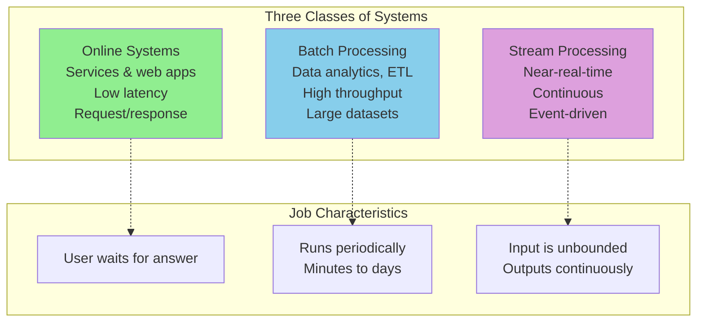

This chapter walks the same path that batch processing itself followed: from single-machine Unix tools, to distributed filesystems and job orchestrators, to processing models (MapReduce and dataflow engines), and finally to the major batch use cases.

---

## 1. Batch Processing with Unix Tools

The simplest setting for batch processing is a single machine. Let's start with a concrete example: analyzing web server logs to find the five most popular pages.

### Simple Log Analysis

A typical NGINX access log line looks like this:

```
216.58.210.78 - - [27/Jun/2025:17:55:11 +0000] "GET /css/typography.css HTTP/1.1" 200 3377 "https://martin.kleppmann.com/" "Mozilla/5.0 (Macintosh; Intel Mac OS X 10_15_7) AppleWebKit/537.36 (KHTML, like Gecko) Chrome/137.0.0.0 Safari/537.36"
```

The NGINX default format is: `$remote_addr - $remote_user [$time_local] "$request" $status $body_bytes_sent "$http_referer" "$http_user_agent"`. The seventh whitespace-separated field is the requested URL.

To find the top five URLs, we chain together a handful of standard Unix commands:

```bash
cat /var/log/nginx/access.log |
  awk '{print $7}' |
  sort |
  uniq -c |
  sort -r -n |
  head -n 5
```

Each step is small:

- `cat` reads the log file (technically not needed; you could pass the file directly to `awk`, but the linear pipeline reads more naturally).
- `awk '{print $7}'` extracts the URL field.
- `sort` sorts URLs alphabetically, ensuring repeated URLs become adjacent.
- `uniq -c` collapses adjacent duplicates and prints a count.
- `sort -r -n` re-sorts numerically in reverse order.
- `head -n 5` keeps the top five.

The output looks like:

```
4189 /favicon.ico
3631 /2016/02/08/how-to-do-distributed-locking.html
2124 /2020/11/18/distributed-systems-and-elliptic-curves.html
1369 /
915 /css/typography.css
```

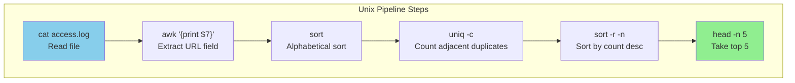

### Chain of Commands Versus Custom Program

The same job is straightforward in Python:

```python
from collections import defaultdict

counts = defaultdict(int)
with open('/var/log/nginx/access.log', 'r') as file:
    for line in file:
        # The URL is the 7th whitespace-separated field (0-indexed: 6)
        url = line.split()[6]
        counts[url] += 1

# Sort hash table by counter value (descending) and take top 5
top5 = sorted(((count, url) for url, count in counts.items()),
              reverse=True)[:5]
for count, url in top5:
    print(f"{count} {url}")
```

Beyond superficial syntax, the two approaches have very different **execution flow** when the file gets big.

### Sorting Versus In-Memory Aggregation

The Python script keeps a **hash table** in memory with one counter per distinct URL. The Unix pipeline does **not** keep such a hash table; it relies on sorting a list where each occurrence is a separate entry.

Which is better? It depends on the number of distinct keys:

- For most small to mid-sized websites, all distinct URLs and their counters fit in 1 GB of memory. The working set depends on the number of distinct URLs, not on the number of requests. A million log entries for a single URL still use only one slot in the hash table. An in-memory hash table works fine, even on a laptop.
- If the working set is larger than memory, sorting wins. Sort chunks of data in memory, write them as sorted segment files, then merge those segments into a larger sorted file. Mergesort has sequential access patterns that perform well on disks.

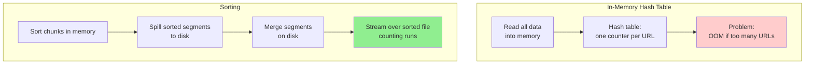

GNU `sort` automatically handles larger-than-memory datasets by spilling to disk, and it parallelizes sorting across CPU cores. The simple chain of Unix commands therefore scales to large datasets without running out of memory. The bottleneck is usually how fast the input file can be read from disk.

A single-machine Unix pipeline is limited, though: if the dataset does not fit on one machine, we need a distributed system.

---

## 2. Batch Processing in Distributed Systems

The single-machine Unix example involves three components working together:

1. **Storage devices** accessed through the operating system's filesystem interface.
2. A **scheduler** that determines when processes run and how CPU is allocated.
3. A series of **Unix programs** whose standard input and output are connected by pipes.

These same three components appear in distributed batch processing frameworks. You can think of these frameworks as **distributed operating systems**: they have filesystems, job schedulers, and programs that send data to one another through the filesystem or other channels.

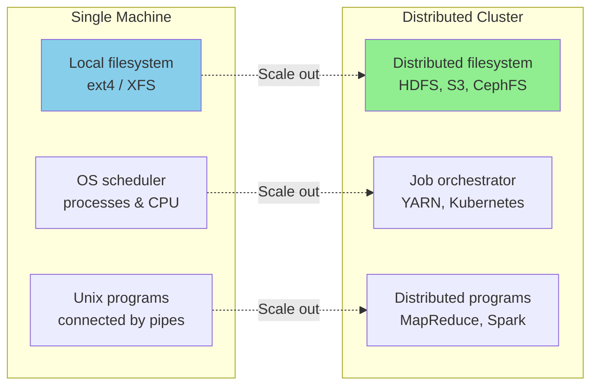

### Distributed Filesystems

Most operating system filesystems have several layers:

- **Block device drivers** talk directly to the disk and let higher layers read and write raw blocks.
- A **page cache** keeps recently accessed blocks in memory.
- The **filesystem layer** breaks files into blocks and tracks file metadata (inodes, directories, files). Common Linux examples are ext4 and XFS.
- A **virtual filesystem (VFS)** layer exposes different filesystems to applications through a common API.

Distributed filesystems work much the same way. Files are broken into blocks distributed across many machines. DFS blocks are typically much larger than local blocks. HDFS defaults to **128 MB**; JuiceFS and many object stores use **4 MB** blocks — much larger than ext4's 4,096-byte blocks. Larger blocks mean less metadata to track (which matters on petabyte-scale datasets) and lower overhead for seeking relative to reading.

Unlike physical storage devices, distributed filesystems do not require writes to use an entire block. A 900 MB file stored with 128 MB blocks is seven blocks of 128 MB plus one block of 4 MB.

DFS blocks are read by making network requests to a machine in the cluster that stores the block. Each machine runs a daemon that exposes an API for remote processes to read and write blocks as files on its local filesystem. HDFS calls these daemons **DataNodes**; GlusterFS calls them `glusterfsd` processes.

Distributed filesystems also implement the distributed equivalent of a page cache. Reads and writes go through each data node's operating system, which includes an in-memory page cache. Some DFSs implement additional caching tiers, such as JuiceFS's client-side and local disk caching.

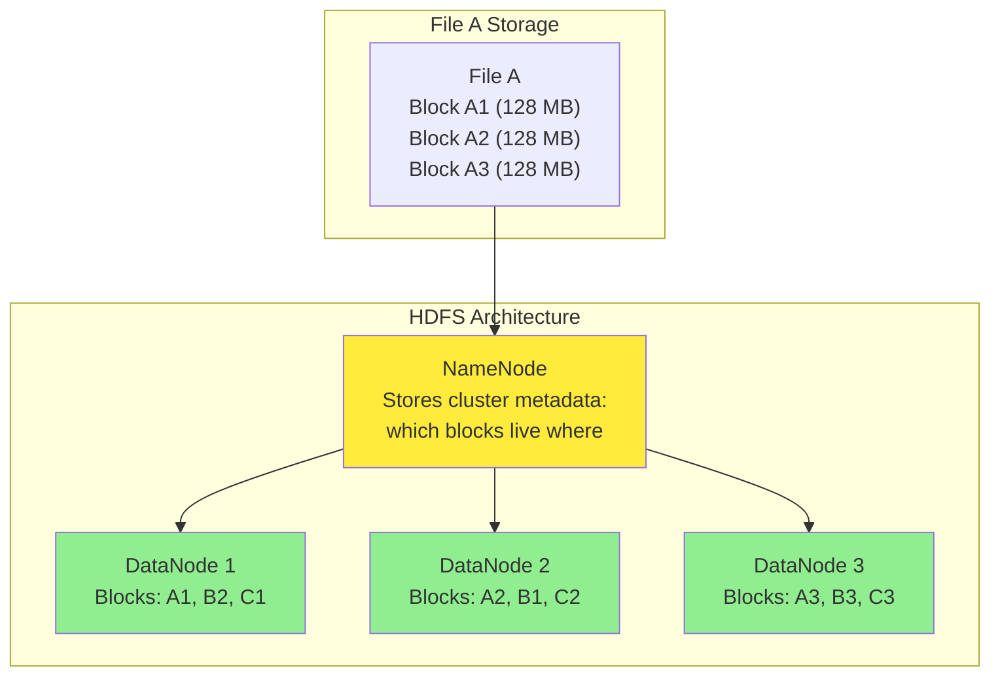

#### Distributed Filesystems and Network Storage

DFSs follow the **shared-nothing** principle (see Chapter 3), in contrast to the shared-disk approach of NAS and SAN architectures. Shared-disk storage uses a centralized storage appliance, often with custom hardware and special networks such as Fibre Channel. The shared-nothing approach requires no special hardware, only computers connected by a conventional datacenter network.

Many DFSs are built on commodity hardware, which is cheaper but fails more often than enterprise-grade hardware. To tolerate failures, file blocks are replicated across multiple machines. This also allows schedulers to evenly distribute workloads because any task can be assigned to any node that contains a replica of its input.

Replication may be simple replication (multiple copies of the same data) or **erasure coding** (e.g., Reed–Solomon codes), which recovers lost data with lower storage overhead than full replication. The techniques are similar to RAID, except that in a distributed filesystem, file access and replication happen over a conventional datacenter network without special hardware.

### Object Stores

Object storage services such as Amazon S3, Google Cloud Storage, Azure Blob Storage, and OpenStack Swift have become a popular alternative to distributed filesystems for batch jobs. The line between the two is blurry: FUSE drivers let users treat S3 as a filesystem, and some DFS implementations (JuiceFS, Ceph) offer both object storage and filesystem APIs. But the APIs, performance, and consistency guarantees are very different, so care is required when adopting such systems.

Every object has a URL like `s3://my-photo-bucket/2025/04/01/birthday.png`. The host portion is the bucket; the rest of the path is the object's key. Bucket names are globally unique, and each object's key must be unique within its bucket.

Objects are read with a `get` call and written with a `put` call. Unlike files on a filesystem, **objects are immutable once written**. To update, you fully rewrite via `put`. Azure Blob Storage and S3 Express One Zone support appends, but most object stores do not. There are no file handle APIs like `fopen` or `fseek`.

Objects may look like they are organized into directories, but object stores have no concept of directories. The path is just a convention; the slashes are part of the key. A prefix list behaves like a recursive `ls -R`: it returns all objects that start with the prefix, including subpaths. Empty directories are not possible; if you remove all objects under `s3://my-photo-bucket/2025/04/01`, the `01` directory disappears from a prefix list. A common workaround is to create a zero-byte object as a placeholder.

DFS implementations typically support hard links, symbolic links, file locking, and atomic renames. Object stores generally do not. Linking and locks are absent, and renames are non-atomic (copy to the new key, then delete the old one).

The key-value stores we discussed in Chapter 4 are optimized for small values (kilobytes) and frequent, low-latency reads/writes. Distributed filesystems and object stores are optimized for large objects (megabytes to gigabytes) and less frequent, larger reads. Recently, object stores have begun to support smaller, more frequent reads — for example, S3 Express One Zone offers single-millisecond latency and a pricing model closer to key-value stores.

Another difference: HDFS-style DFSs allow computing tasks to run on the machine that stores a copy of a particular file, so the task can read the file without sending it over the network. Object stores usually **decouple storage and compute**, which uses more bandwidth, but modern datacenter networks are fast enough that this is often acceptable. The decoupling lets you scale CPU and memory independently of storage.

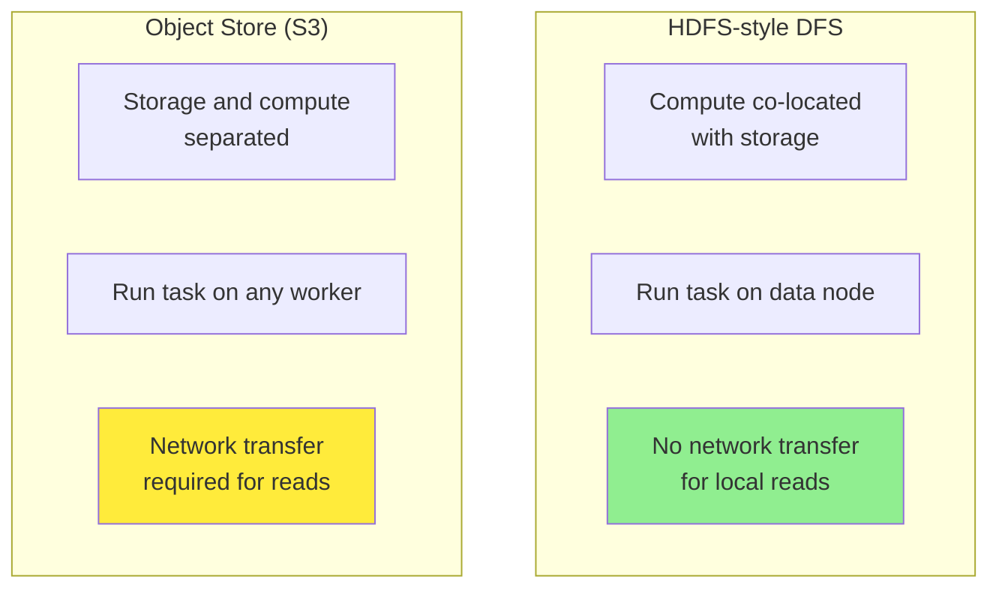

### Distributed Job Orchestration

The operating system analogy applies to job orchestration too. On a single machine, the kernel schedules processes and enforces resource boundaries. In a distributed environment, a **job orchestrator** plays that role.

A batch framework sends a request to the orchestrator's scheduler to run a job. Requests include:

- The number of tasks to execute
- Memory, CPU, and disk requirements per task
- A job identifier
- Access credentials
- Job parameters (input and output locations)
- Required hardware (GPUs, disk types)
- The location of the job's executable code

Orchestrators such as **Kubernetes** and **Hadoop YARN** combine this information with cluster metadata to execute the job using the following components:

#### Task Executors

An executor daemon runs on every node in the cluster — YARN's NodeManager or Kubernetes's kubelet. Executors run job tasks, send heartbeats, and track task status and resource allocation on their node. When a task-start request arrives, the executor retrieves the job's executable code and runs a command to start the task. It then monitors the process until completion or failure, updating task status accordingly.

Many executors also work with the OS to provide security and performance isolation. YARN and Kubernetes use Linux **cgroups**, for example, to prevent tasks from accessing unauthorized data or starving other tasks on the same node.

#### Resource Manager

The resource manager stores metadata about each node: available hardware (CPUs, GPUs, memory, disks), task statuses, network location, node status, and so on. It provides a global view of cluster state. Centralization can create scalability and availability bottlenecks. YARN uses ZooKeeper, and Kubernetes uses etcd, to store cluster state.

#### Scheduler

A centralized scheduler subsystem receives requests to start, stop, or check the status of a job. The scheduler uses request metadata and the resource manager's view of the cluster to decide which tasks run on which nodes. Task executors are then notified and begin execution.

Application-specific schedulers (YARN calls them **ApplicationMasters**, Kubernetes calls them **operators**) sometimes need to make decisions that depend on application context — for example, autoscaling read replicas when a query threshold is reached. The centralized scheduler and application-specific schedulers work together.

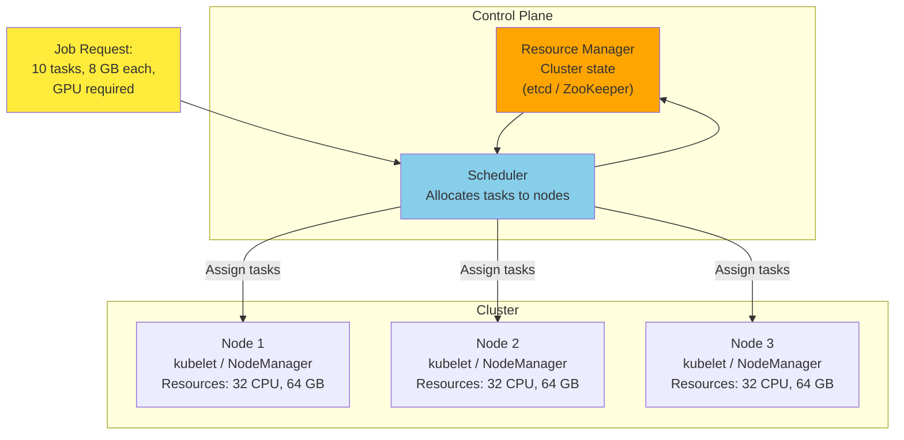

#### Resource Allocation

Schedulers must figure out how to allocate the cluster's limited resources among jobs with competing needs. Consider a small cluster with five nodes and 160 CPU cores. Two jobs each request 100 cores. Several options:

- Run 80 tasks of each job, and start the remaining 20 of each job as earlier tasks complete.
- Run all of one job first, then begin the second only when 100 cores are available (**gang scheduling**).
- If the second job arrives much later, decide whether to allocate all 100 cores to the first job or hold some back for a future job.

Gang scheduling risks leaving nodes idle if 100 cores do not become available at once. Simply waiting for 100 cores can starve jobs. Preempting tasks to make room is also wasteful because killed tasks must be restarted.

For hundreds or millions of such decisions, finding an optimal solution is **NP-hard**. Schedulers use heuristics: FIFO, dominant resource fairness (DRF), priority queues, capacity/quota-based scheduling, and bin-packing algorithms.

#### Scheduling Workflows

The Unix tools example chains several commands. The same pattern arises in distributed batch processing: the output of one job often becomes the input to one or more other jobs, and each job may have several inputs produced by other jobs. This is called a **workflow** or **directed acyclic graph (DAG)** of jobs.

A workflow of multiple jobs is needed for several reasons:

- If the output of one job feeds several other jobs maintained by different teams, the first job should write to a location where all consumers can read.
- You may want to transfer data between processing tools — for example, a Spark job writes to HDFS, then a Python script triggers a Trino SQL query that processes the HDFS files and writes to S3.
- Some pipelines require multiple stages that each shard data differently.

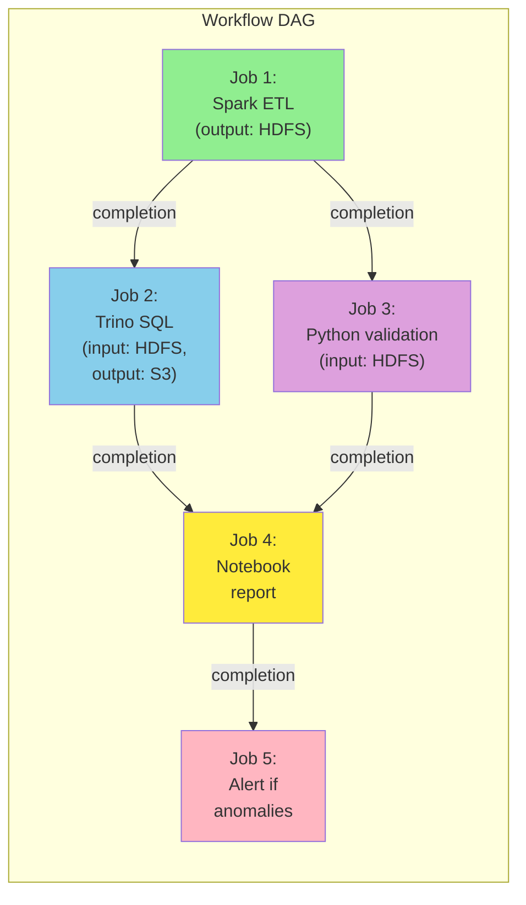

In a Unix pipeline, the connection is an in-memory buffer. If the buffer fills up, the producer waits — this is **backpressure**. Spark, Flink, and other batch execution engines support a similar in-task streaming model. But it is more typical for a workflow job to write its output to a distributed filesystem or object store, and for the next job to read from there. This decouples jobs so they can run at different times. If a job has several inputs, a workflow scheduler waits until all producing jobs complete successfully before running the consumer.

Workflow schedulers include **Airflow**, **Dagster**, and **Prefect**, which have largely replaced Hadoop-centric schedulers such as Oozie and Azkaban. Workflows of 50–100 jobs are common, and in a large organization many teams may run jobs whose outputs feed other teams' jobs. Tool support matters.

#### Handling Faults

Long-running batch jobs are likely to experience at least one task failure. Causes include hardware faults (especially on commodity hardware), network interruptions, and **preemption** — when a scheduler intentionally kills a task to make room for a higher-priority task. Preemption is useful when you mix low-priority tasks (cheap) with high-priority tasks (expensive). Low-priority tasks run whenever there is spare capacity but may be killed if a higher-priority task arrives. Such cheap instances include AWS spot instances, Azure spot VMs, and GCP preemptible instances.

Since batch jobs regenerate their output from scratch on each run, failures are easier to handle than in online systems. The system can delete partial output from a failed execution and reschedule the task on another machine. MapReduce and its successors keep parallel tasks independent so work can be retried at the granularity of a single task.

Fault tolerance is trickier when the output of one task becomes the input to another in a workflow. MapReduce solves this by writing intermediate data back to the DFS and waiting for the writing task to complete before other tasks read it. This works even with preemption, but it means a lot of writes to the DFS.

Spark keeps intermediate data in memory (spilling to local disk if it doesn't fit) and writes only the final result to the DFS. It also keeps track of how the intermediate data was computed, allowing recomputation if data is lost. Flink periodically checkpoints a snapshot of task state. We will return to this in the dataflow engines section.

---

## 3. Batch Processing Models

We have seen how batch jobs are scheduled in a distributed environment. Now let's look at how batch processing frameworks process data. The two most common models are **MapReduce** and **dataflow engines**.

### MapReduce

The pattern of data processing in MapReduce is very similar to the web server log analysis example:

1. **Read a set of input files** and break it into records. In Hadoop's MapReduce, the input is stored in a distributed filesystem like HDFS or an object store like S3. Common file formats include Apache Parquet (a columnar format) and Apache Avro (a row-based format).
2. **Call the mapper function** to extract a key and value from each input record. In the Unix example, `awk '{print $7}'` extracts the URL.
3. **Sort all the key-value pairs by key.** In the Unix example, this is the first `sort` command. In MapReduce, sorting is implicit between map and reduce.
4. **Call the reducer function** to iterate over the sorted key-value pairs. Adjacent identical keys make it easy to combine values without keeping much state in memory.

In MapReduce, you write two callback functions:

**Mapper**: Called once for every input record. It extracts a key and value and may emit any number of key-value pairs (including none). It keeps no state from one record to the next, so each record is handled independently. Many mappers run in parallel on different parts of the input.

**Reducer**: The MapReduce framework collects all values belonging to the same key and calls the reducer with an iterator over those values. The reducer can emit output records. Reducers for different keys also run in parallel.

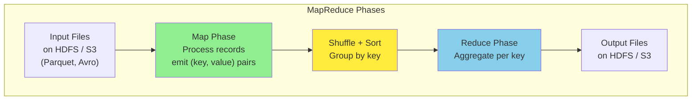

#### MapReduce and Functional Programming

The MapReduce programming model comes from functional programming. Lisp introduced `map` and `reduce` (or `fold`) as higher-order functions on lists, and they appear in mainstream languages like Python, Rust, and Java.

Many SQL operations can be implemented on top of MapReduce. The functional principle of avoiding mutable state enables parallel execution: every call to the mapper and reducer depends only on the data passed in, so the framework is free to run independent calls in parallel and retry them after failures.

Implementing complex jobs with the raw MapReduce API is laborious — joins, for example, must be implemented from scratch. MapReduce is also slower than more modern batch processors, partly because its file-based I/O prevents job pipelining.

### Dataflow Engines

To fix MapReduce's problems, several new execution engines were developed, the most well-known being **Spark** and **Flink**. They handle an entire workflow as one job rather than breaking it into independent subjobs.

Since they explicitly model the flow of data through several processing stages, these systems are called **dataflow engines**. Like MapReduce, they support a low-level API that repeatedly calls a user-defined function to process one record at a time. But they also offer higher-level operators such as `join` and `group by`. They parallelize work by sharding inputs and copy the output of one task over the network to become the input of another. Unlike MapReduce, operators need not take the strict roles of alternating map and reduce but can be assembled in more flexible ways.

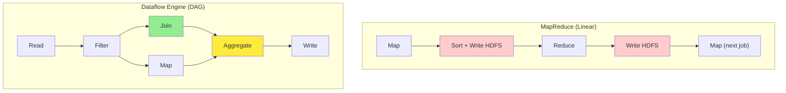

Dataflow APIs use relational-style building blocks: joining datasets on a field, grouping tuples by key, filtering by condition, aggregating by counting/summing/etc. Internally, these operations are implemented using the shuffle algorithms we discuss next.

This style is based on research systems like Dryad and Nephele. It offers several advantages over MapReduce:

- Expensive work like sorting happens only where it is required, not by default between every map and reduce.
- Sequential operators that don't change the sharding (such as `map` or `filter`) can be combined into a single task, reducing data copying.
- Because joins and dependencies are explicitly declared, the scheduler can make locality optimizations — for example, placing a task that consumes some data on the same machine as the task that produces it.
- Intermediate state between operators can be kept in memory or local disk, requiring less I/O than writing to a distributed filesystem. MapReduce already does this for mapper output, but dataflow engines generalize it to all intermediate state.
- Operators can start as soon as their input is ready; there's no need to wait for the entire preceding stage to finish.
- Existing processes can be reused to run new operators, reducing startup overhead compared to MapReduce, which launches a new JVM for each task.

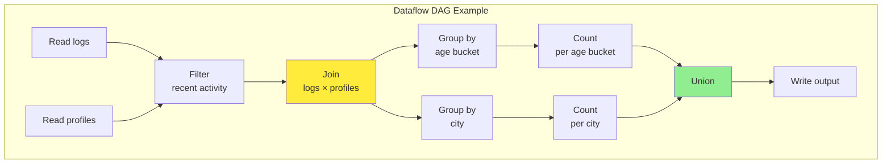

#### Code Example: Sort-Merge Join

The following Python snippet shows how a reducer reads sorted inputs and produces a joined record. The sort-merge join algorithm relies on the shuffle to bring all values for one key together, with the dimension-table record (profile) appearing first because of a secondary sort.

```python
def reduce_side_join(key, values):
    """
    Sort-merge join: reducer sees records for one key,
    with the profile (if present) appearing first.
    """
    profile = None
    activities = []

    for tag, record in values:
        if tag == 'profile':
            profile = record
        else:  # tag == 'activity'
            activities.append(record)

    if profile is None:
        # No profile for this user; skip
        return

    for activity in activities:
        yield {
            'user_id': key,
            'name':    profile['name'],
            'dob':     profile['dob'],
            'page':    activity['page'],
            'time':    activity['time'],
        }
```

The Unix pipeline and the MapReduce word-count pattern (mapper emits `(word, 1)` pairs, reducer sums counts) cover the same shape: extract keys, group by key, aggregate. Real distributed MapReduce replaces the in-memory grouping with the network shuffle.

### Shuffling Data

Both the Unix tools example and MapReduce are based on sorting. Batch processors need to be able to sort datasets that are petabytes in size, far too large for a single machine. They therefore require a **distributed sorting algorithm** where both input and output are sharded. Such an algorithm is called a **shuffle**.

> **Note**: The term "shuffle" can be confusing. When you shuffle a deck of cards, you get a random order. In batch processing, the shuffle produces a **sorted** order, with no randomness at all.

Shuffling is a foundational algorithm for batch processors and is used for joins and aggregations. MapReduce, Spark, Flink, Daft, Dataflow, and BigQuery all implement scalable and performant shuffle algorithms to handle large datasets.

The Hadoop MapReduce shuffle works roughly as follows:

1. The input is sharded into multiple files (m1, m2, m3). Each shard may be a separate HDFS file or a separate object in a bucket, and all shards of the same dataset are grouped into the same HDFS directory or share the same key prefix.
2. The framework starts a separate map task for each input shard. Each task reads its assigned file and passes one record at a time to the mapper callback.
3. The number of reduce tasks is configured by the job's author (it can differ from the number of map tasks).
4. When the mapper emits a key-value pair, a **hash of the key** determines which reducer file it is written to. So mapper m1 produces one output file per reducer — for example, file `m1_r2` is the file created by mapper 1 containing data destined for reducer 2.
5. While writing these files, the mapper **sorts** the key-value pairs within each file, using the techniques from log-structured storage: in-memory sort, then sorted segment files on disk, then progressive merging.
6. After each mapper finishes, reducers connect to it and copy the appropriate file of sorted key-value pairs to their local disk. The reduce task then merges these files (mergesort-style), preserving sort order.
7. The reducer function is called once per key, with an iterator over all values for that key.

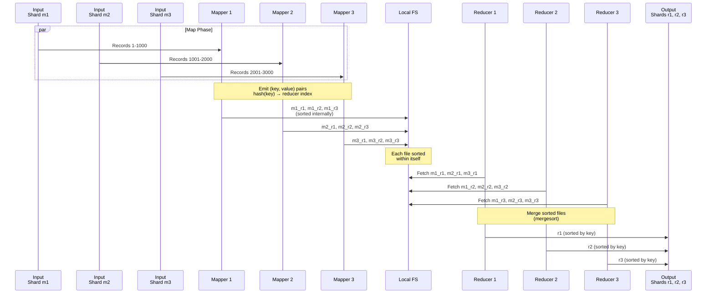

Modern dataflow engines and cloud data warehouses have optimized their shuffle algorithms to keep data in memory and to write to external sorting services that speed up shuffling and replicate shuffled data for resilience.

### Joins and Grouping

Sorted data simplifies distributed joins and aggregations. A typical example is a join between a log of user activity events (the fact table) and a user database (a dimension table):

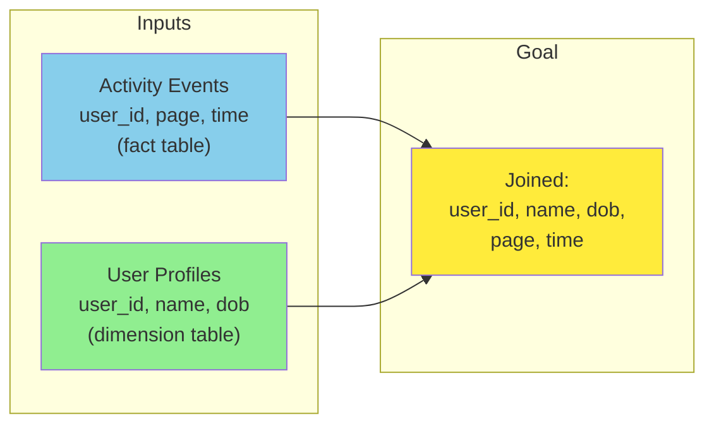

#### Sort-Merge Join

If you want to perform an analysis of activity events that uses information from the user database (for example, whether certain pages are more popular with younger or older users, using date-of-birth), you compute a join on user ID.

The shuffle in MapReduce brings together all key-value pairs with the same key to the same reducer, no matter which shard they came from. User ID can serve as the key:

- One mapper goes over the activity events and emits page view URLs keyed by user ID.
- Another mapper goes over the user database and emits user records keyed by user ID.

The shuffle ensures the reducer can access a particular user's date of birth and all of that user's page view events. The job can arrange records so the reducer always sees the user database record first, followed by activity events in timestamp order (a **secondary sort**).

The reducer stores the first value (date of birth) in a local variable, then iterates over activity events with the same user ID, emitting each viewed URL along with the viewer's date of birth. The reducer processes all records for a user in one go, so it needs to keep only one user record in memory at a time. This algorithm is called a **sort-merge join**: mapper output is sorted by key, and reducers merge the sorted lists from both sides.

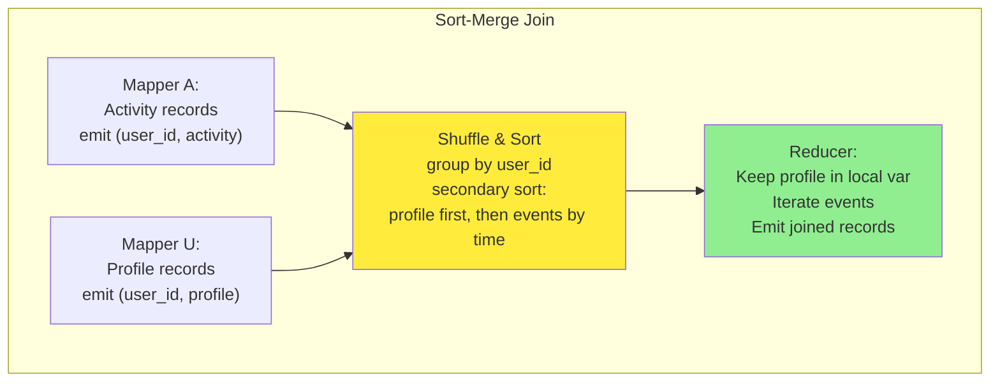

Reducer input for one key:

```
user_id: 123
values: [
    ('profile',   {name: 'Alice', dob: '1990-04-15'}),
    ('activity',  {page: '/home',  time: '10:00'}),
    ('activity',  {page: '/about', time: '10:05'}),
]
```

#### Broadcast Hash Join

When one side of the join is small (fits in memory), you can use a **broadcast hash join**:

- Load the small dataset into a hash table.
- Send a copy of the small dataset to every mapper (broadcast).
- Each mapper joins the small dataset with its shard of the large dataset in memory, without needing a reduce phase.

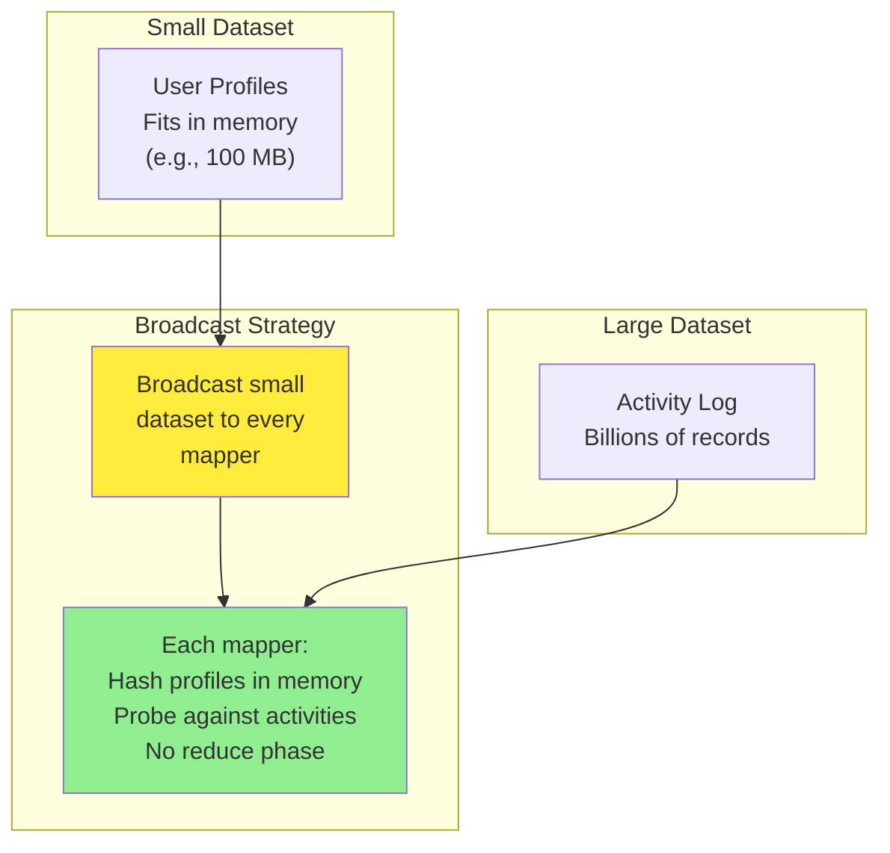

#### Partitioned Hash Join

When both sides are large but can be partitioned by the join key, use a **partitioned hash join**:

- Shard both datasets by the same hash function on the join key.
- Send corresponding partitions of both datasets to the same reducer.
- The reducer builds a hash table from the smaller partition and probes against the larger partition.

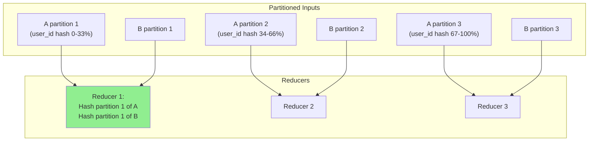

#### Comparison Table

| Algorithm | When to use | Pros | Cons |
|---|---|---|---|
| **Sort-merge join** | Both sides large, can be sorted by join key | Scales to any size, no memory pressure on the join data | Requires a sort phase; one slow reducer can stall the job |
| **Broadcast hash join** | One side small enough to fit in memory on every mapper | No reduce phase; very fast | Small side must fit in memory at each mapper |
| **Partitioned hash join** | Both sides large but partitionable by key | No global sort needed | Requires both sides to be co-partitioned |

### Query Languages

Execution engines for distributed batch processing have matured. The infrastructure is robust enough to store and process petabytes on clusters of over 10,000 machines. With the operating problem largely solved, attention has turned to improving the programming model.

MapReduce, dataflow engines, and cloud data warehouses have all embraced **SQL** as the lingua franca for batch processing. Legacy data warehouses already used SQL; data analytics and ETL tools support it; and developers and analysts already know it.

Beyond requiring less code than handwritten MapReduce jobs, SQL interfaces enable interactive use: analysts write analytical queries and run them from a terminal or GUI. This style of interactive querying is a natural way for business analysts, product managers, sales/finance teams, and others to explore data in a batch processing environment. SQL support has also made batch systems suitable for exploratory queries.

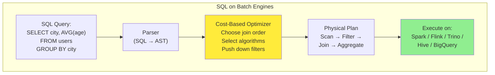

High-level query languages don't just make humans more productive; they also improve machine-level efficiency. Query engines are responsible for converting SQL queries into batch jobs. The translation step from query to syntax tree to physical operators allows the engine to **optimize** queries. Query engines such as Hive, Trino, Spark, and Flink have cost-based query optimizers that can analyze the properties of join inputs and automatically decide which algorithm is most suitable, or even change the order of joins to minimize intermediate state.

Concrete examples:

- **Hive**: SQL on MapReduce / Tez / Spark
- **Spark SQL**: SQL on Spark
- **Trino (formerly Presto)**: SQL for interactive queries across data sources
- **Flink SQL**: SQL on Flink

The same SQL works across systems:

```sql
SELECT
    city,
    AVG(age)            AS avg_age,
    COUNT(*)            AS user_count
FROM users
WHERE signup_date > '2024-01-01'
GROUP BY city
HAVING COUNT(*) > 100
ORDER BY avg_age DESC;
```

While SQL is the most popular general-purpose batch query language, others remain in use for niche needs. Apache Pig was a relational-operator language that specified data pipelines step by step. DataFrames (discussed next) have similar characteristics, and Morel is a more modern language influenced by Pig. JSON query languages such as `jq`, JMESPath, and JSONPath are adopted for JSON-heavy workloads. Graph processing frameworks support query languages such as Apache TinkerPop's Gremlin.

#### Batch Processing and Cloud Data Warehouses Converge

Historically, data warehouses ran on specialized hardware and supported SQL over relational data. Batch frameworks like MapReduce aimed for greater scalability by supporting processing logic written in general-purpose languages over arbitrary data formats.

The two have grown similar. Modern batch frameworks support SQL with good performance on relational queries via columnar storage (Parquet) and optimized execution engines. Data warehouses have become more scalable by moving to the cloud and adopting the scheduling, fault tolerance, and shuffling techniques of distributed batch frameworks.

Cloud warehouses have also adopted alternative processing models. BigQuery offers a DataFrames library; Snowflake's Snowpark library integrates with Pandas. Batch workflow orchestrators such as Airflow, Prefect, and Dagster integrate with cloud warehouses.

Not all batch jobs are easily expressed in SQL, though, including iterative graph algorithms, complex ML tasks, and AI data processing that handles nonrelational and multimodal data (images, video, audio). Cloud warehouses also tend to be more expensive than other batch processing systems, so for very large jobs it can be more cost-efficient to run Spark or Flink. The decision between batch systems and data warehouses usually comes down to cost, convenience, ease of implementation, and availability.

### DataFrames

Data scientists and statisticians are used to the **DataFrame** data model found in R and Pandas. A DataFrame is similar to a relational table: a collection of rows where all values in the same column share a type. Instead of writing one big SQL query, users call functions corresponding to relational operators to perform filters, joins, sorting, aggregations, and other operations.

Originally, DataFrame manipulation was local and in-memory, so DataFrames were limited to single-machine datasets. Data scientists wanted to interact with large batch-processing datasets using the DataFrame APIs they knew, since SQL and MapReduce are not well suited to iterative data science work. Distributed data processing frameworks such as Spark, Flink, and Daft have adopted DataFrame APIs to meet this need. Their implementation behaves somewhat differently, though: local DataFrames are usually indexed and ordered, while distributed DataFrames are generally not. This can lead to performance surprises when migrating code to batch frameworks.

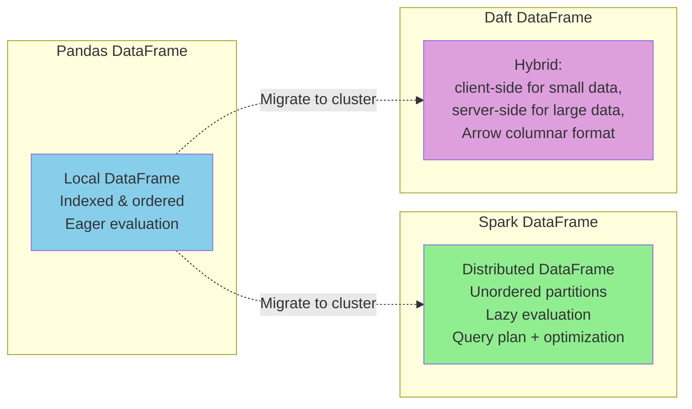

DataFrame APIs look similar to dataflow APIs, but implementations vary. Pandas executes operations immediately when DataFrame methods are called. Spark first translates all DataFrame API calls into a query plan and runs query optimization before executing the workflow on top of its distributed dataflow engine. Daft supports both client- and server-side computation: smaller in-memory operations run on the client, larger datasets on a server. Columnar storage formats such as Apache Arrow offer a unified data model that both client and server execution engines can share.

#### Code Example: DataFrame-Style Aggregation

The following example shows a DataFrame-style API in pure Python (using lists of dicts as a stand-in for a real DataFrame). It mimics what Spark's DataFrame API would do under the hood: lazy plan building, optimization, and execution.

```python
from typing import Callable, Any
from dataclasses import dataclass, field


# --- A tiny DataFrame abstraction over a list of dicts ---
@dataclass
class DataFrame:
    data: list
    operations: list = field(default_factory=list)

    def filter(self, predicate: Callable[[Any], bool]) -> "DataFrame":
        new = DataFrame(self.data, self.operations + [("filter", predicate)])
        return new

    def select(self, *fields: str) -> "DataFrame":
        new = DataFrame(self.data, self.operations + [("select", fields)])
        return new

    def group_by(self, key: str) -> "GroupedDataFrame":
        return GroupedDataFrame(self.data, self.operations, key)

    def count(self) -> "DataFrame":
        new = DataFrame(self.data, self.operations + [("count", None)])
        return new

    def collect(self) -> list:
        """Materialize the lazy plan by applying operations."""
        rows = self.data
        for op_name, op_arg in self.operations:
            if op_name == "filter":
                rows = [r for r in rows if op_arg(r)]
            elif op_name == "select":
                rows = [{f: r[f] for f in op_arg} for r in rows]
            elif op_name == "count":
                rows = [{"count": len(rows)}]
        return rows


@dataclass
class GroupedDataFrame:
    data: list
    operations: list
    key: str

    def agg(self, aggregations: dict) -> "DataFrame":
        # Apply upstream operations first
        upstream = DataFrame(self.data, self.operations).collect()
        groups: dict = {}
        for row in upstream:
            groups.setdefault(row[self.key], []).append(row)
        result = []
        for k, items in groups.items():
            entry = {self.key: k}
            for agg_name, (col, func) in aggregations.items():
                entry[agg_name] = func([r[col] for r in items])
            result.append(entry)
        return DataFrame(result)


# --- Sample usage ---
users = [
    {"name": "Alice", "city": "SF",   "age": 30, "active": True},
    {"name": "Bob",   "city": "NY",   "age": 25, "active": True},
    {"name": "Carol", "city": "SF",   "age": 35, "active": False},
    {"name": "Dave",  "city": "NY",   "age": 40, "active": True},
    {"name": "Eve",   "city": "LA",   "age": 28, "active": True},
]

# Active users, average age per city
result = (
    DataFrame(users)
    .filter(lambda r: r["active"])
    .group_by("city")
    .agg({"avg_age": ("age", lambda xs: sum(xs) / len(xs)),
          "n":       ("age", len)})
    .collect()
)

for row in result:
    print(row)
```

Output:

```
{'city': 'SF', 'avg_age': 30.0, 'n': 1}
{'city': 'NY', 'avg_age': 32.5, 'n': 2}
{'city': 'LA', 'avg_age': 28.0, 'n': 1}
```

In real Spark, the `.collect()` call would correspond to an **action**, which triggers the optimizer to build a query plan and execute it across the cluster. The `.filter`, `.group_by`, and `.agg` calls are **transformations**, which only build the lazy plan.

---

## 4. Batch Use Cases

Now that we have seen how batch processing works, let's see how it is applied. Batch jobs are excellent for processing large datasets in bulk, but they are not good for low-latency use cases. You'll find batch jobs wherever there is a lot of data and data freshness is not critical. A surprising amount of data processing fits this model.

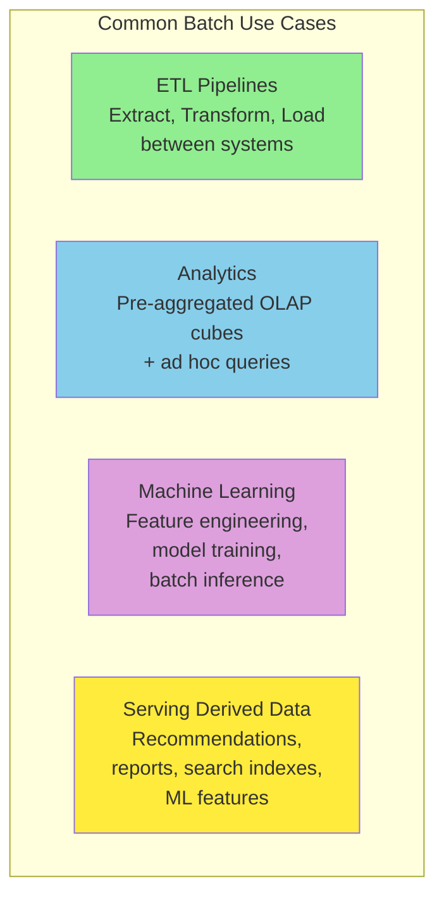

A few examples from across industries:

- Accounting and inventory reconciliation often run as batch jobs.
- In manufacturing, demand forecasting commonly runs as a periodic batch job.
- Ecommerce, media, and social media companies train their recommendation models with batch jobs.
- Many financial systems are batch-based; for example, the US banking network (ACH) runs almost entirely on batch jobs.

### Extract–Transform–Load

ETL pipelines extract data from a production database, transform it, and load the results into a downstream system such as a data warehouse. The parallel nature of batch jobs makes them a great fit for data transformation. Many transformations — filtering, projecting fields, joining — are "embarrassingly parallel."

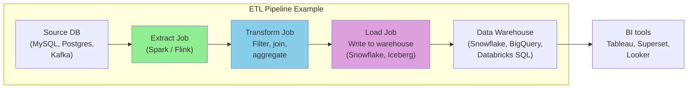

Batch processing environments also come with robust workflow schedulers that make it easy to schedule, orchestrate, and debug ETL jobs. When a failure occurs, schedulers often retry to mitigate transient issues; repeatedly failing jobs are marked as failed, which helps developers spot which job stopped working. Schedulers like Airflow include built-in source, sink, and query operators for MySQL, PostgreSQL, Snowflake, Spark, Flink, and dozens of other popular systems. Failed files can be inspected to see what went wrong, and ETL jobs can be fixed and rerun. The same applies to schema evolution in upstream sources — data contracts (a standard for inter-team data publishing) help with this.

Data pipelines used to be managed by a single data engineering team, because writing and managing complex batch pipelines was considered unfair to ask of product teams. Improvements in batch processing models and metadata management have made it much easier for engineers across an organization to contribute to and manage their own data pipelines. **Data mesh**, **data contract**, and **data fabric** practices provide standards and tools to help teams safely publish their data. Many batch ETL jobs now run on the same engines as the analytical queries that read their output — SparkSQL, Trino, or DuckDB. This blurs the line between application engineering, data engineering, analytics engineering, and business analysis.

### Analytics

Analytical queries (OLAP) often scan over a large number of records, performing groupings and aggregations. Such workloads can run in a batch processing system alongside other batch workloads. Analysts write SQL queries that execute atop a query engine, which reads from and writes to a distributed filesystem or object store. Table metadata (table-to-file mappings, names, types) is managed by table formats such as Apache Iceberg and catalogs such as Unity Catalog (see the chapter on cloud data warehouses). This architecture is known as a **data lakehouse**.

As with ETL, improvements in SQL interfaces mean many organizations now use batch frameworks such as Spark for analytics. Two main styles:

- **Pre-aggregation queries**: Data is rolled up into OLAP cubes or data marts to speed up queries. Pre-aggregated data is queried in the warehouse or pushed to purpose-built real-time OLAP systems such as Apache Druid or Apache Pinot. Pre-aggregation normally happens at a scheduled interval, managed by the workflow schedulers we discussed earlier.
- **Ad hoc queries**: Users run these to answer specific business questions, investigate user behavior, debug operational issues, and more. Response times matter because analysts iterate on results.

```mermaid
graph TB
    subgraph "Analytics Architecture"
        RAW["Raw Data Lake<br/>(Parquet on S3)"]

        BATCH["Batch Pipeline<br/>(Spark, Trino, DuckDB)"]

        CUBE["OLAP Cubes /<br/>Data Marts"]

        REALTIME["Real-time OLAP<br/>(Druid, Pinot)"]

        BI["BI Tools<br/>(Tableau, Superset,<br/>Power BI, Looker)"]
    end

    RAW -->|"Nightly rollup"| BATCH --> CUBE
    RAW -->|"Streaming ingest"| REALTIME
    CUBE --> BI
    REALTIME --> BI

    style CUBE fill:#90EE90
    style BI fill:#ffeb3b
```

SQL support enables batch processing frameworks to integrate with spreadsheets and data visualization tools such as Tableau, Power BI, Looker, and Apache Superset. Tableau offers SparkSQL and Presto connectors; Apache Superset supports Trino, Hive, Spark SQL, Presto, and many other systems that ultimately execute batch jobs.

### Machine Learning

Machine learning makes frequent use of batch processing. Data scientists, ML engineers, and AI engineers use batch frameworks to investigate data patterns, transform data, and train models. Common ML workloads include:

- **Feature engineering**: Raw data is filtered and transformed into data that models can be trained on. Predictive models often need numeric data, so engineers transform other forms (text, discrete values) into the required format.
- **Model training**: The training data is the input to the batch process, and the weights of the trained model are the output.
- **Batch inference**: A trained model can be used to make predictions in bulk when datasets are large and real-time results are not required. This includes evaluating predictions on a test dataset.

```mermaid
graph TB
    subgraph "ML on Batch Systems"
        RAW["Raw Data<br/>(logs, events,<br/>transactions)"]

        FE["Feature Engineering<br/>(Spark MLlib,<br/>FlinkML, Ray)"]

        TRAIN["Model Training<br/>(PyTorch, TensorFlow,<br/>XGBoost)"]

        INFER["Batch Inference<br/>(predictions for<br/>large datasets)"]

        SERVE["Model Serving<br/>(online or batch)"]
    end

    RAW --> FE --> TRAIN --> INFER --> SERVE

    style FE fill:#90EE90
    style TRAIN fill:#87CEEB
    style INFER fill:#DDA0DD
    style SERVE fill:#FFD700
```

Batch frameworks provide tools for these workloads. Apache Spark's MLlib and Apache Flink's FlinkML come with a wide variety of feature engineering tools, statistical functions, and classifiers.

ML applications such as recommendation engines and ranking systems make heavy use of graph processing. Many graph algorithms traverse one edge at a time, joining one vertex with an adjacent vertex to propagate information, and repeat until a condition is met. The **Bulk Synchronous Parallel (BSP)** model of computation has become popular for batch-processing graphs; it is implemented by Apache Giraph, Spark's GraphX API, and Flink's Gelly API. It is also known as the **Pregel model**, after Google's Pregel paper that popularized this approach.

Batch processing is also an integral part of large language model (LLM) data preparation and training. Raw text input data, such as the contents of websites, typically resides in a DFS or object store. This data must be preprocessed to make it suitable for training. Batch-friendly preprocessing steps include:

- Extracting plain text from HTML and fixing malformed text
- Detecting and removing low-quality, irrelevant, and duplicate documents
- Tokenizing text (splitting it into words) and converting it into embeddings

Frameworks such as **Kubeflow**, **Flyte**, and **Ray** are built for such workloads. OpenAI uses Ray as part of its ChatGPT training process. These frameworks have built-in integrations for LLM and AI libraries (PyTorch, TensorFlow, XGBoost) and built-in support for feature engineering, model training, batch inference, and fine-tuning.

Finally, data scientists often experiment with data in interactive notebooks such as Jupyter or Hex. Notebooks are made up of cells (Markdown, Python, SQL) executed sequentially to produce spreadsheets, graphs, or data. Many notebooks use batch processing via DataFrame APIs or query such systems using SQL.

### Serving Derived Data

Batch jobs are often used to build precomputed or derived datasets such as product recommendations, user-facing reports, and features for ML models. These datasets are typically served from a production database, key-value store, or search engine. Regardless of the system used, the precomputed data needs to make its way from the batch processor's distributed filesystem or object store back into the database that serves live traffic.

You might be tempted to use the client library for your favorite database directly within a batch job and write one record at a time. This will work (assuming your firewall rules allow direct access from your batch environment to production databases), but it is a bad idea for several reasons:

- Making a network request for every single record is orders of magnitude slower than the normal throughput of a batch task. Even if the client library supports batching, performance is likely to be poor.
- Batch frameworks run many tasks in parallel. If all tasks concurrently write to the same output database at the rate expected of a batch process, the database can easily be overwhelmed, and its query performance suffers. This can cause operational problems in other parts of the system.
- Normally, batch jobs provide a clean all-or-nothing guarantee for job output. If a job succeeds, the result is the output of running every task exactly once, even if some tasks had to be retried; if the entire job fails, no output is produced. However, writing to an external system from inside a job produces externally visible side effects that cannot be hidden in this way. You have to worry about results from partially completed jobs being visible to other systems. If a task fails and is restarted, it may duplicate output from the failed execution.

```mermaid
graph LR
    subgraph "Naive: Direct Write"
        JOB["Batch Job<br/>Spark / Flink"]
        DB[("Production<br/>Database")]
        JOB -->|"One record<br/>at a time<br/>from N tasks"| DB

        style JOB fill:#ffcccc
        style DB fill:#FFA500
    end
```

A better solution is to have batch jobs push precomputed datasets to streams such as **Kafka** topics. Search engines (Elasticsearch), real-time OLAP systems (Apache Pinot, Apache Druid), derived datastores (Venice), and cloud data warehouses (ClickHouse) all have the built-in ability to ingest data from Kafka. Pushing data through a streaming system fixes several problems:

- Streaming systems are optimized for sequential writes, well suited to the bulk write workload of a batch job.
- Streaming systems can act as a buffer between the batch job and the production databases. Downstream systems can throttle their read rate to ensure they can continue serving production traffic.
- The output of a single batch job can be consumed by multiple downstream systems.
- Streaming systems can serve as a security boundary between batch processing environments and production networks — for example, deployed in a DMZ network that sits between the batch network and the production network.

```mermaid
graph LR
    subgraph "Streaming-Mediated Write"
        JOB["Batch Job<br/>Spark / Flink"]
        KAFKA[("Kafka Topic<br/>Sequential writes<br/>DMZ")]
        ES["Elasticsearch"]
        PINOT["Apache Pinot"]
        VENICE["Venice"]
        CLICK["ClickHouse"]

        JOB -->|"Bulk write"| KAFKA
        KAFKA --> ES
        KAFKA --> PINOT
        KAFKA --> VENICE
        KAFKA --> CLICK

        style JOB fill:#90EE90
        style KAFKA fill:#87CEEB
        style VENICE fill:#ffeb3b
```

Streaming does not inherently solve the all-or-nothing guarantee. To make this work, batch jobs must send a notification to downstream systems that their job is done and the data can now be served. Consumers of the stream keep the data invisible to queries (like an uncommitted transaction with read-committed isolation) until they are notified that the job is complete.

Another pattern, more common when bootstrapping databases, is to build a brand-new database inside the batch job and bulk-load files directly into the database from a distributed filesystem, object store, or local filesystem. Many data systems offer bulk-import tools (TiDB's Lightning, Apache Pinot's Hadoop import jobs). RocksDB offers an API to bulk-import Sorted String Table (SST) files from batch jobs.

Building databases in batch and bulk-importing the data is fast and makes it easier to atomically switch between dataset versions. It can be challenging to incrementally update datasets from batch jobs that build brand-new databases, so a hybrid approach (Venice supports hybrid stores that allow both batch row-based updates and full dataset swaps) is common when both bootstrapping and incremental loads are needed.

---

## Summary

This chapter explored the design and implementation of batch processing systems. We started with the classic Unix toolchain (`awk`, `sort`, `uniq`, etc.) to illustrate fundamental batch primitives such as sorting and counting. We then scaled up to distributed systems, where batch frameworks process immutable, bounded input datasets to produce output data, allowing reruns and debugging without side effects.

```mermaid
graph TB
    subgraph "Batch Processing Layers"
        UNIX["Unix Tools<br/>On a single machine<br/>Sort + aggregate"]

        DFS["Distributed Filesystems<br/>HDFS / Object stores<br/>(S3, GCS, Azure Blob)"]

        ORCH["Job Orchestration<br/>YARN / Kubernetes<br/>+ Workflow (Airflow)"]

        MODEL["Processing Models<br/>MapReduce<br/>Dataflow (Spark, Flink)<br/>SQL + DataFrames"]

        USE["Use Cases<br/>ETL, Analytics,<br/>ML, Serving"]

        UNIX -.->|"Scale up"| DFS
        DFS -.->|"Schedule on"| ORCH
        ORCH -.->|"Run"| MODEL
        MODEL -.->|"Power"| USE
    end

    style UNIX fill:#87CEEB
    style DFS fill:#90EE90
    style ORCH fill:#ffeb3b
    style MODEL fill:#DDA0DD
    style USE fill:#FFD700
```

Three main components power distributed batch processing:

1. A **storage layer** (distributed filesystem or object store) to persist data.
2. An **orchestration layer** that determines where and when jobs run.
3. A **computation layer** that processes the actual data.

We saw how distributed filesystems and object stores manage large files through block-based replication, caching, and metadata services, and how modern batch frameworks interact with these systems via pluggable APIs. We discussed how job orchestrators schedule tasks, allocate resources, and handle faults in large clusters, and compared them with workflow orchestrators that manage the lifecycle of a collection of jobs in a dependency graph.

We surveyed batch processing models, starting with MapReduce and its canonical `map` and `reduce` functions. We then turned to dataflow engines like Spark and Flink, which offer simpler-to-use APIs and better performance. To understand how batch jobs scale, we covered the shuffle algorithm, the foundational operation that enables grouping, joining, and aggregation.

We saw that as batch systems matured, focus shifted to usability. Support was added for high-level query languages like SQL and DataFrame APIs, making batch jobs more accessible and easier to optimize. The batch framework takes jobs written in these languages and automatically determines how to execute them efficiently on a cluster.

| System / Approach | Strengths | Weaknesses | Best For |
|---|---|---|---|
| **Unix tools** | Simple, fast on a single machine | Doesn't scale beyond one machine | Ad-hoc analysis, small data |
| **MapReduce** | Scalable, fault tolerant, mature | Slow due to materialization, limited operators | Very large batch jobs, ETL |
| **Spark / Flink** | Fast, rich APIs, in-memory processing | More memory required, more complex | Iterative ML, ETL, interactive SQL |
| **Cloud data warehouses** | Managed, SQL-first, good for ad hoc queries | Can be expensive, limited for non-relational data | Ad hoc analytics, data marts |
| **Workflow orchestrators** | DAG dependencies, retries, observability | A separate system to operate | Multi-job pipelines |

**Key takeaways:**

- **Unix philosophy still applies**: Simple, composable tools with uniform interfaces (stdin/stdout) work because they separate concerns. Sorting scales to disk when memory is exhausted.
- **MapReduce pioneered distributed batch processing**: It brought fault tolerance through replication, data locality optimization, and a simple programming model. Its materialization overhead and limited operator set have been superseded by dataflow engines.
- **Dataflow engines improve on MapReduce**: They express computations as arbitrary DAGs (not just map-then-reduce), pipeline operations in memory, schedule on data locality, and reuse processes across operators.
- **Different join algorithms for different shapes**: Sort-merge joins scale to any data size but require a sort phase. Broadcast hash joins avoid the reduce phase when one side fits in memory. Partitioned hash joins avoid a global sort when both sides are co-partitioned.
- **High-level abstractions win**: SQL on batch engines, DataFrame APIs, and cost-based query optimizers all improve usability and execution efficiency. Cloud data warehouses and batch frameworks are converging.

---

**Next**: [Chapter 12: Stream Processing](./chapter-12-stream-processing.md) — In the next chapter, we will turn to stream processing, where the input is unbounded: a job's inputs are never-ending streams of data, and we must build systems under the assumption that more work may arrive at any moment.

**Previous**: [Chapter 10: Encoding and Evolution](./chapter-10-encoding-evolution.md)
