# Chapter 12: Stream Processing

## Introduction

In Chapter 11, we discussed **batch processing**: running a job on a bounded dataset. Now we explore **stream processing** — processing unbounded data that arrives continuously.

A **stream** is data that is incrementally made available over time. The concept appears in many places: Unix `stdin`/`stdout`, lazy lists in programming languages, Java's `FileInputStream`, TCP connections, audio and video over the internet, and so on.

In this chapter we treat event streams as a data management mechanism — the unbounded, incrementally processed counterpart to the batch data of the preceding chapter. We will first discuss how streams are represented, stored, and transmitted over a network, then investigate the relationship between streams and databases. Finally, in "Processing Streams," we will explore approaches and tools for processing those streams continually and how they can be used to build applications.

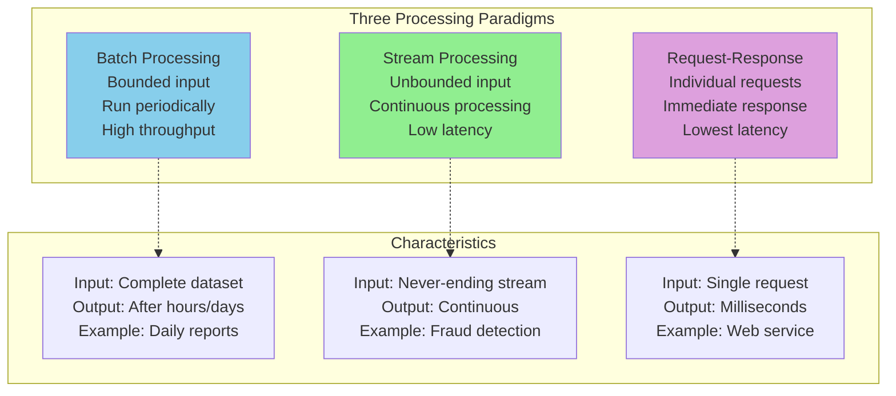

**Real-world stream examples**:
- User activity events on a website
- Sensor readings from IoT devices
- Stock price updates from financial markets
- Server log messages
- Database write events (replication logs)

---

## 1. Transmitting Event Streams

In batch processing, the inputs and outputs of a job are files. What does the streaming equivalent look like?

When the input is a file (a sequence of bytes), the first processing step is usually to parse it into a sequence of records. In a stream processing context, a record is more commonly known as an **event**: a small, self-contained, immutable object containing the details of something that happened at a point in time. An event usually contains a **timestamp** indicating when it happened according to a time-of-day clock.

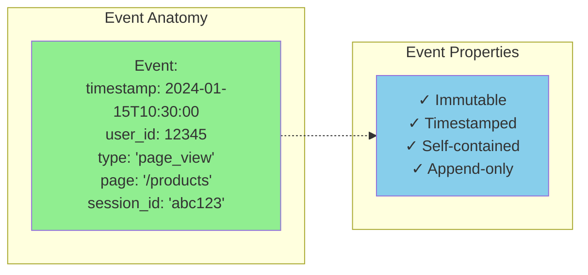

An event may be encoded as text (JSON, XML) or a binary format (Avro, Protocol Buffers, as discussed in Chapter 5). Related events are usually grouped together into a **topic** or **stream**.

A producer writes events to the broker; consumers read them. Producers and consumers can be added or removed dynamically without coordinating with one another.

### Messaging Systems

A common approach for notifying consumers about new events is to use a **messaging system**: a producer sends a message containing the event, which is then pushed to consumers.

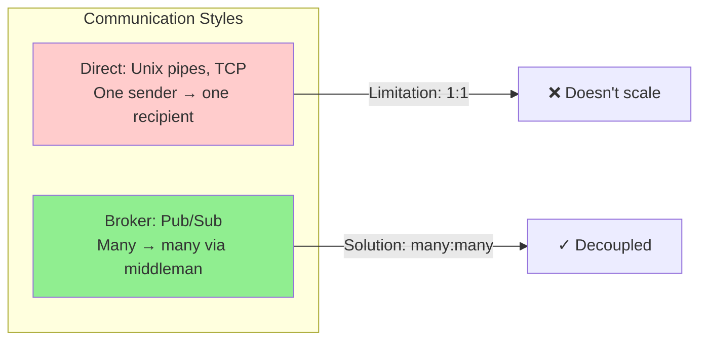

**Two key design questions** differentiate messaging systems:

1. **What happens if the producers send messages faster than the consumers can process them?** The system has three options:
   - **Drop messages** — discard unprocessed data
   - **Buffer in a queue** — store until consumer is ready
   - **Apply backpressure** (flow control) — block the producer (Unix pipes, TCP use this)

2. **What happens if nodes crash or temporarily go offline — are any messages lost?** Durability requires writing to disk and/or replication, which has a cost. If you can tolerate occasional loss, you can get higher throughput and lower latency.

Whether message loss is acceptable depends on the application. Sensor readings sent periodically can tolerate occasional loss (an updated value comes shortly), but counting events needs reliable delivery since every lost message means incorrect counters.

### Direct Messaging from Producers to Consumers

Some messaging systems use direct network communication without intermediary nodes:

- **UDP multicast** is widely used in financial industry for stock market feeds where low latency is critical. Although UDP itself is unreliable, application-level protocols can recover lost packets.
- **Brokerless messaging libraries** like ZeroMQ and nanomsg implement publish/subscribe over TCP or IP multicast.
- **StatsD** uses unreliable UDP messaging to collect metrics from machines.
- **HTTP/RPC webhooks**: a callback URL is registered, and the producer makes a request when an event occurs.

These work well in the situations they are designed for, but they require the application code to be aware of the possibility of message loss. Even with packet retransmission, they generally assume that producers and consumers are constantly online. If a consumer is offline, it may miss messages.

### Message Brokers

A widely used alternative is to send messages via a **message broker** (also known as a message queue) — essentially a kind of database optimized for handling message streams. The broker runs as a server, with producers and consumers connecting as clients.

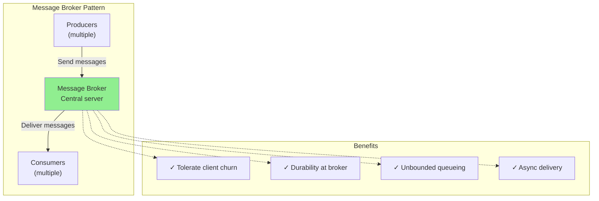

By centralizing the data in the broker, these systems can more easily tolerate clients that come and go (connect, disconnect, and crash), and the question of durability is moved to the broker. A consequence of queueing is that consumers are generally **asynchronous** — producers wait only for the broker to confirm it has buffered the message, not for processing.

#### Message Brokers Compared to Databases

Some message brokers can participate in two-phase commit protocols using XA or JTA, making them similar to databases. Important practical differences remain:

| Aspect | Databases | Message Brokers |
|--------|-----------|-----------------|
| **Data lifetime** | Kept until explicitly deleted | Often auto-deleted after delivery |
| **Working set** | Large queries over big data | Small queues, short data |
| **Query model** | Rich query language, secondary indexes | Topic subscriptions, pattern matching |
| **Result freshness** | Point-in-time snapshot | Notification on new messages |

#### Multiple Consumers

When multiple consumers read messages in the same topic, two main patterns are used:

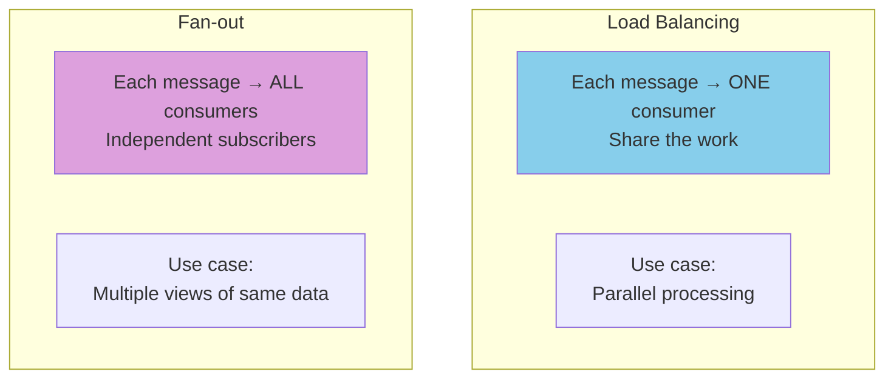

**Load balancing** distributes messages across consumers in a group, sharing the work. **Fan-out** delivers each message to all consumers, like several batch jobs reading the same input file.

The two patterns can be combined — Kafka's consumer groups feature provides load balancing within a group and fan-out across groups.

#### Acknowledgments and Redelivery

Consumers may crash at any time. To ensure messages aren't lost, message brokers use **acknowledgments**: a client must explicitly tell the broker when it has finished processing a message. If the connection closes without an acknowledgment, the broker assumes the message wasn't processed and redelivers it.

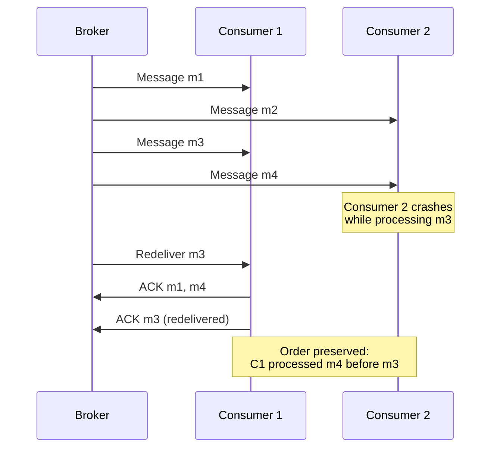

When combined with load balancing, redelivery has an interesting effect on **ordering**: if consumer 2 crashes while processing m3, and consumer 1 is processing m4, m3 may be redelivered to consumer 1 — resulting in messages being processed out of order (m4, m3, m5).

#### Dead Letter Queues (DLQs)

Redelivery can also result in permanent blockages. If a message contains malformed data that causes consumer crashes, the message gets redelivered forever. **Dead letter queues** handle this: rather than retrying forever, problematic messages are moved to a separate queue where operators can inspect, fix, or drop them.

### Log-Based Message Brokers

Sending a packet over a network is normally a transient operation. AMQP/JMS-style brokers inherited this transient mindset: even when they write to disk, they quickly delete messages after delivery. Databases take the opposite approach: everything written is permanently recorded.

This difference in mindset affects derived data: with AMQP/JMS brokers, you cannot run the same consumer twice and get the same result (receiving is destructive). With databases and files, you can re-run jobs on the same input.

**Log-based message brokers** combine the durable storage of databases with the low-latency notification of messaging systems. They have become very popular.

#### Using Logs for Message Storage

A **log** is simply an append-only sequence of records on disk. The same structure used in log-structured storage engines (Chapter 4), write-ahead logs (Chapter 4), and database replication logs (Chapter 6) can implement a message broker.

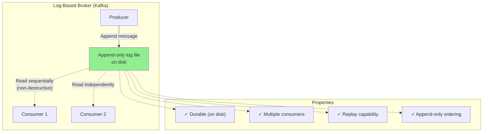

A producer sends a message by appending it to the end of the log, and a consumer receives messages by reading the log sequentially. If a consumer reaches the end, it waits for notification that a new message has been appended (like Unix `tail -f`).

To scale beyond a single disk, the log is **sharded**: different shards live on different machines, and each shard is a separate log that can be read independently. A **topic** is a group of shards that all carry messages of the same type.

Within each shard (Kafka calls it a **partition**), the broker assigns a monotonically increasing **offset** to every message. The offset makes sense because a partition is append-only — messages within a partition are totally ordered, but there is no ordering guarantee across partitions.

**Apache Kafka** and **Amazon Kinesis Streams** are log-based message brokers that work this way, achieving throughput of millions of messages per second by sharding and replicating.

#### Kafka Log Partitioning

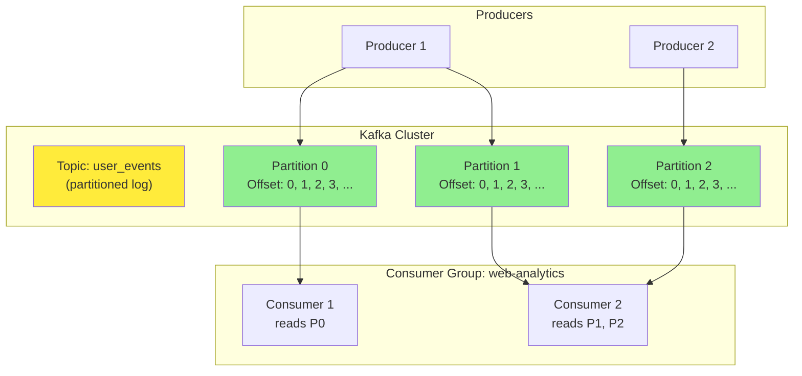

A simple Python producer sending events to Kafka:

```python
from kafka import KafkaProducer
import json

producer = KafkaProducer(
    bootstrap_servers=['localhost:9092'],
    value_serializer=lambda v: json.dumps(v).encode('utf-8')
)

# Messages with the same key always go to the same partition,
# guaranteeing per-key ordering.
event = {
    'timestamp': '2024-01-15T10:30:00',
    'user_id': 12345,
    'event_type': 'page_view',
    'page': '/products'
}

producer.send('user_events', key=str(event['user_id']).encode(), value=event)
```

#### Logs Compared to Traditional Messaging

The log-based approach trivially supports **fan-out** because several consumers can independently read the log without affecting one another. To achieve **load balancing**, the broker assigns entire shards to consumer nodes rather than individual messages.

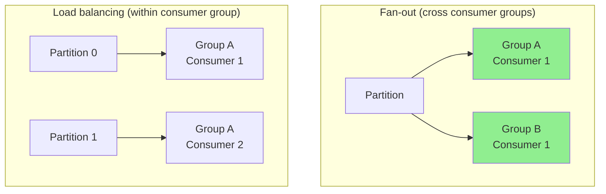

This coarse-grained load balancing has trade-offs:
- **Limit**: Number of nodes sharing work ≤ number of partitions in the topic
- **Head-of-line blocking**: A slow message delays subsequent messages in that partition

When messages are expensive to process and you want message-by-message parallelism, the JMS/AMQP approach may be preferable. When messages are fast and ordering matters, log-based brokers excel.

#### Consumer Offsets

Consuming a shard sequentially makes it easy to track progress: a consumer's current offset tells you what's been processed. The broker doesn't need to track per-message acknowledgments — only the consumer offset, which is periodically recorded.

If a consumer fails, another node in the consumer group is assigned the failed consumer's shards and resumes from the last recorded offset. If the consumer had processed messages but not yet recorded their offset, those messages will be processed twice upon restart.

```python
# Rebuild a local user database from a compacted log
def rebuild_user_database():
    """Consume compacted changelog to build a local cache."""
    consumer = KafkaConsumer(
        'user_changelog',
        auto_offset_reset='earliest',
        enable_auto_commit=False
    )
    user_db = {}

    for message in consumer:
        user_id = message.key.decode()
        user_data = json.loads(message.value)
        if user_data is None:
            # Tombstone: user was deleted
            user_db.pop(user_id, None)
        else:
            user_db[user_id] = user_data

    return user_db
```

#### Disk Space Usage

If you only ever append to the log, you will eventually run out of disk space. The log is divided into **segments**, and old segments are periodically deleted or archived.

**Back-of-the-envelope calculation**: A typical large hard drive has 20 TB capacity and sequential write throughput of 250 MB/s. At full write speed, it takes ~22 hours until the drive fills up and old messages must be deleted. In practice, deployments rarely use full write bandwidth, so the log typically buffers several days or even weeks of messages.

Many log-based brokers now store messages in **object storage** (e.g., Apache Kafka, Redpanda, WarpStream, Confluent Freight, Bufstream). This enables batch and warehouse jobs to run directly on the data as Iceberg tables, without copying to another system.

#### When Consumers Cannot Keep Up

The log-based approach is buffering with a large but fixed-size buffer (limited by disk). If a consumer falls so far behind that messages it requires are older than those retained, it will miss messages — the broker effectively drops messages older than the buffer.

You can monitor how far behind a consumer is and alert if it falls behind significantly. The large buffer gives time for human operators to fix a slow consumer before it starts missing messages.

**A big operational advantage**: even if a consumer does fall too far behind, only that consumer is affected. Other consumers are unaffected. You can experimentally consume a production log for development, testing, or debugging without disrupting production services.

#### Replaying Old Messages

With AMQP/JMS brokers, processing and acknowledging messages is destructive. In a log-based broker, consuming messages is like reading from a file — read-only and does not change the log. The only side effect is that the consumer offset moves forward, which is under the consumer's control.

You can start a copy of a consumer with yesterday's offset and write the output to a different location to reprocess the last day's messages. You can repeat this any number of times with different code — making log-based messaging more like batch processing with repeatable transformations.

### Comparison: AMQP/JMS vs Log-Based

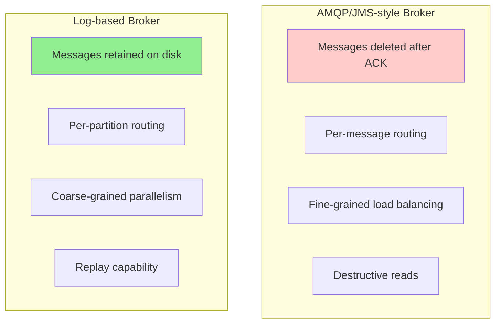

**When to use which**:
- **AMQP/JMS**: asynchronous RPC, task queues, where exact ordering isn't important and re-reading old messages isn't needed
- **Log-based**: high-throughput stream processing, derived data, where ordering matters and replay capability is valuable

---

## 2. Databases and Streams

Even though message brokers and databases have been considered separate categories, log-based brokers have successfully taken ideas from databases and applied them to messaging. We can also do the opposite — taking ideas from messaging and applying them to databases.

Every write to a database is an **event** that can be captured, stored, and processed. The connection between databases and streams runs deeper than physical storage of logs on disk — it is quite fundamental.

A **replication log** is a stream of database write events, produced by the leader as it processes transactions. Followers apply that stream of writes to their own copy of the database. The events describe the data changes that occurred.

The **state machine replication principle**: if every event represents a write to the database, and every replica processes the same events in the same order, then all replicas end up in the same final state (assuming deterministic processing). It's just another case of event streams.

### Keeping Systems in Sync

No single system can satisfy all data storage, querying, and processing needs. In practice, most nontrivial applications combine several technologies:

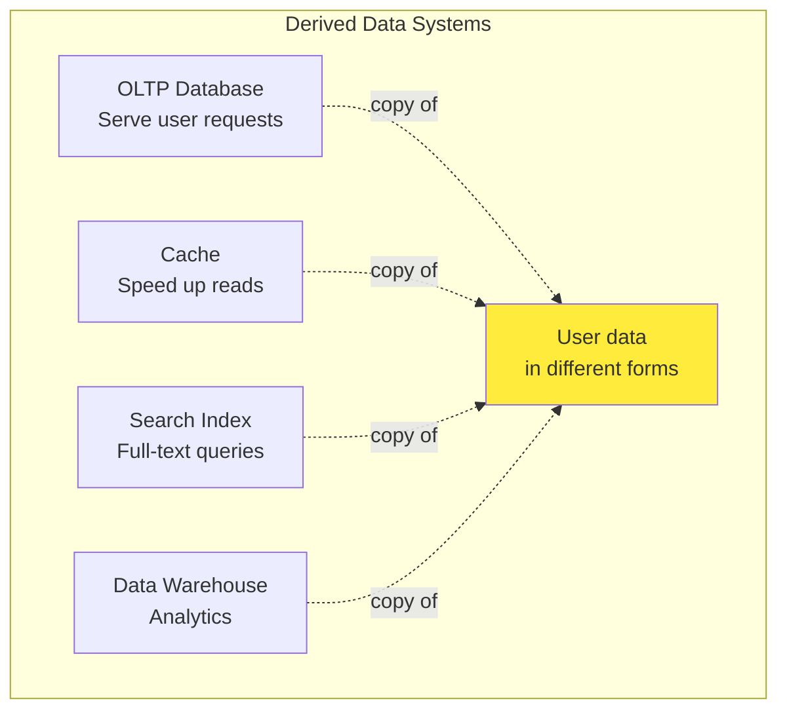

As the same data appears in several places, they need to be kept in sync. With data warehouses, synchronization is usually performed by ETL processes — periodic full copies. For search indexes, batch processes rebuild them.

#### Dual Writes Problem

If periodic full dumps are too slow, an alternative is **dual writes**: the application explicitly writes to each system when data changes — first to the database, then to the search index, then invalidating cache entries.

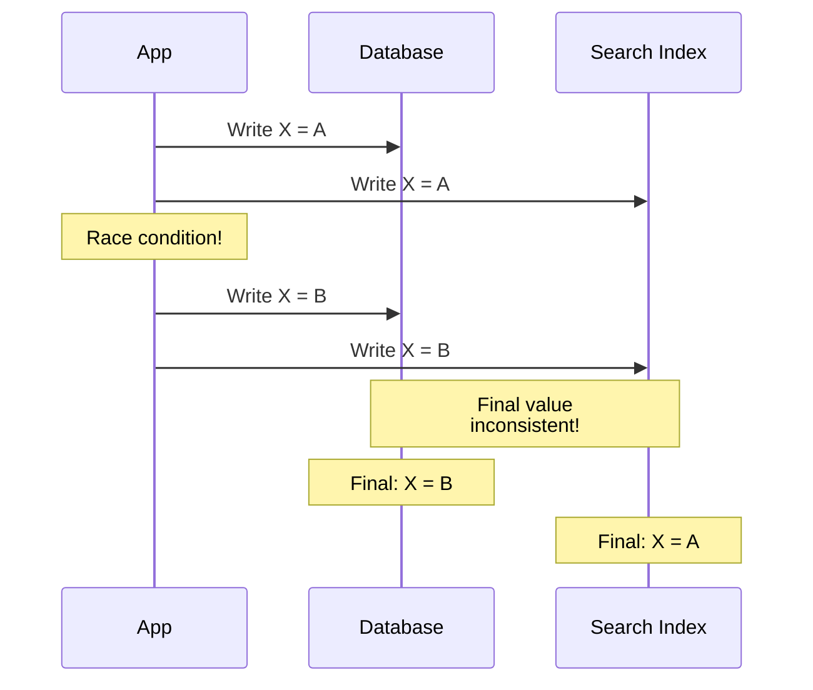

**Problem 1: Race condition.** Two clients concurrently update item X. Client 1 sets X = A, Client 2 sets X = B. Both write to the database then to the search index. With unlucky timing, the database sees A then B (final: B), but the search index sees B then A (final: A). The systems are permanently inconsistent, and there is no error.

**Problem 2: Partial failure.** One write may succeed while another fails. This is a fault-tolerance problem with the same effect — systems becoming inconsistent. Solving it requires atomic commit (two-phase commit), which is expensive.

The fundamental issue is that there isn't a single leader determining write order. The database may have a leader, the search index may have a leader, but neither follows the other, so conflicts can occur.

### Change Data Capture (CDC)

**Change Data Capture (CDC)** is the process of observing all data changes written to a database and extracting them in a form that can be replicated to other systems. CDC is especially powerful if changes are made available as a stream immediately as they are written.

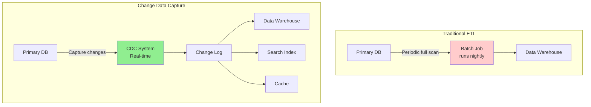

With CDC, the database decides on the order in which to execute writes and writes them to its replication log in that order. The search index picks up and applies them in the same order. The data in the search index matches the database because both follow the same single leader (the database).

CDC essentially makes one database the leader and turns the others into followers. A log-based message broker is well-suited for transporting change events since it preserves message ordering.

#### Implementing CDC

**Logical replication logs** can be used to implement CDC (see "Logical (row-based) log replication"), but challenges include handling schema changes and properly modeling updates. Tools like **Debezium** address these challenges:

- Source connectors for MySQL, PostgreSQL, Oracle, SQL Server, Db2, Cassandra
- Attaches to database replication logs
- Surfaces changes in a standard event schema
- Messages transformed and written to downstream databases

**Kafka Connect** offers CDC connectors for various databases. **Maxwell** does similar work for MySQL by parsing the binlog. **GoldenGate** provides similar facilities for Oracle. **pgcapture** does the same for PostgreSQL.

Like message brokers, CDC is usually **asynchronous**: the system-of-record database doesn't wait for changes to be applied to consumers. The operational advantage is that adding a slow consumer doesn't affect the source, but the downside is that replication lag applies.

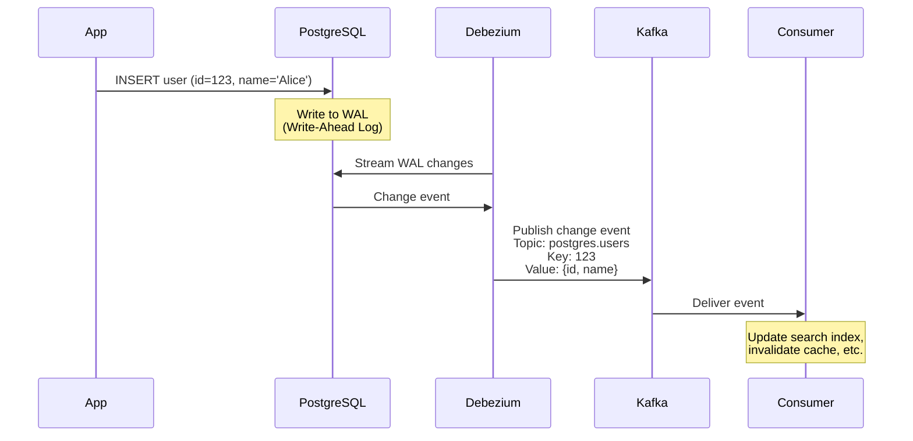

#### Initial Snapshot

If you have the log of all changes ever made, you can reconstruct the entire database state by replaying. However, keeping all changes forever requires too much disk space, so logs are often truncated.

Building a new full-text index requires a full copy of the entire database — applying only recent changes is insufficient (items not recently updated would be missing). Thus, if you don't have the full log history, you need to start with a **consistent snapshot**, corresponding to a known position in the change log.

**Debezium** uses Netflix's DBLog watermarking algorithm to provide incremental snapshots.

#### Log Compaction in CDC

If you can keep only a limited amount of log history, you must go through the snapshot process every time you add a new derived data system. However, **log compaction** provides a better alternative.

The storage engine periodically looks for log records with the same key, throws away duplicates, and keeps only the most recent update for each key. This makes log segments much smaller; segments may also be merged as part of the process.

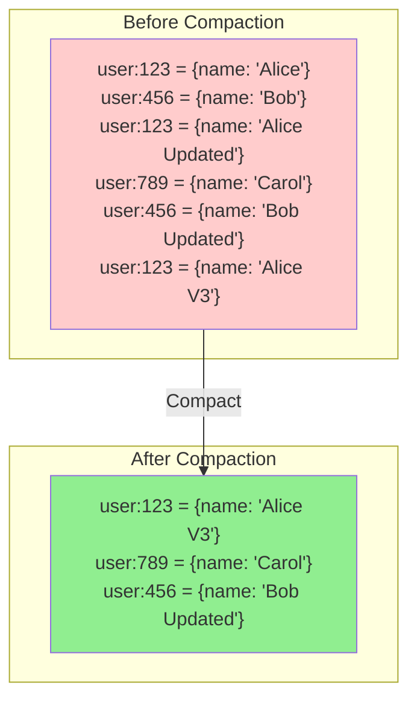

The disk space required for a compacted log depends only on the **current contents** of the database, not the number of writes that have ever occurred.

The same idea works in CDC: if every change has a primary key and updates replace previous values, it's sufficient to keep just the most recent write per key. To rebuild a derived data system, you can start from offset 0 of the compacted topic and scan sequentially — the log is guaranteed to contain the most recent value for every key. This lets the broker serve as durable storage, not just transient messaging.

#### API Support for Change Streams

Most popular databases now expose change streams as a first-class interface:
- **Relational databases** (MySQL, PostgreSQL) send changes through their replication logs
- **Cloud vendors** offer CDC solutions (e.g., Google's Datastream)
- **Eventually consistent databases** like Cassandra support CDC by exposing raw log segments per node (consumers must merge them as a quorum reader would)

#### CDC Versus Event Sourcing

How does CDC compare to event sourcing?

| Aspect | CDC | Event Sourcing |
|--------|-----|----------------|
| **Abstraction level** | Low-level state changes | Application-level events |
| **Application writes** | Mutable (update/delete at will) | Append-only event log |
| **Order source** | Extracted from DB replication log | Determined by application |
| **Schema** | DB internal schema | Application-level events |
| **Adoption effort** | Minimal changes to existing DB | Big architectural change |

In **CDC**, the application uses the database in a mutable way. The log of changes is extracted from the database at a low level (e.g., by parsing the replication log), ensuring the order of writes matches the order they were actually written.

In **event sourcing**, the application logic is explicitly built on immutable events written to an event log. The event store is append-only; updates or deletes are discouraged. Events reflect things that happened at the application level.

### Change Data Capture and Database Schemas

CDC seems easier to adopt than event sourcing, but it has challenges. In a microservices architecture, a database is typically accessed from only one service. Other services interact through the service's public API — the database is an internal implementation detail.

However, CDC systems typically use the upstream database's schema when replicating, turning these schemas into **public APIs** that must be managed like the service's external API. Removing a column breaks downstream consumers. **Data contracts** are often used to prevent these breakages.

#### The Outbox Pattern

A common way to decouple internal from external schemas is the **outbox pattern**: outboxes are tables with their own schemas, exposed to the CDC system rather than the internal domain model. Developers can modify internal schemas freely while leaving outbox tables untouched.

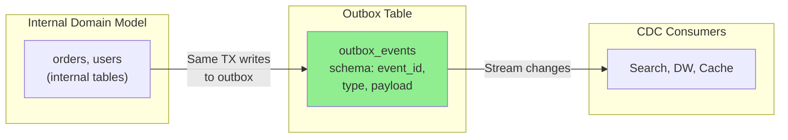

This looks like a dual write but isn't — both writes happen in the same system (the database), so they can appear in a single transaction. Trade-offs: developers must maintain the transformation between internal and outbox schemas, and the outbox increases database write volume.

---

## 3. State, Streams, and Immutability

Batch processing benefits from the immutability of input files — you can run experimental jobs on existing inputs without fear of damaging them. This principle is also what makes event sourcing and CDC so powerful.

We normally think of databases as storing the current state. State changes, so databases support updating and deleting data. How does this fit with immutability?

**Key insight**: whenever you have state that changes, that state is the result of the events that mutated it over time. The current available seats are the result of reservations processed, the current account balance is the result of credits and debits, and the response time graph is an aggregation of all web request response times.

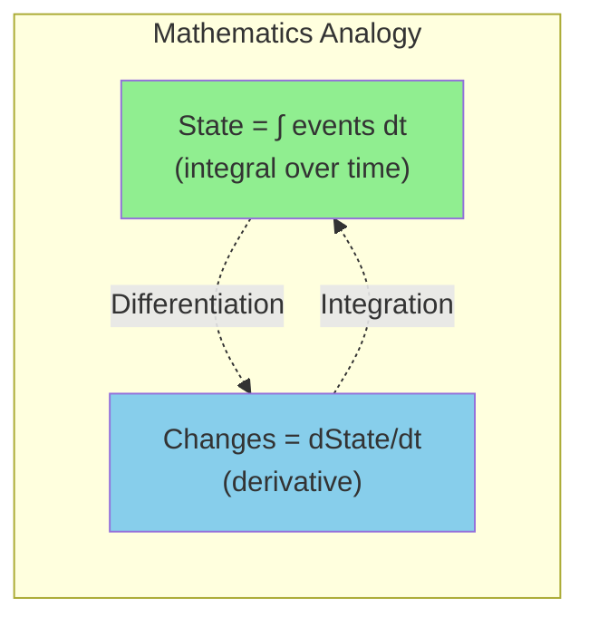

Mutable state and an append-only log of immutable events are two sides of the same coin. The log of all changes (changelog) represents the evolution of state over time. As Jim Gray and Andreas Reuter put it in 1992:

> There is no fundamental need to keep a database at all; the log contains all the information there is. The only reason for storing the database (i.e., the current end-of-the-log) is performance of retrieval operations.

Log compaction bridges the distinction between log and database state by retaining only the latest version of each record.

### Advantages of Immutable Events

Immutability in databases is an old idea. Accountants have used immutability for centuries in financial bookkeeping:

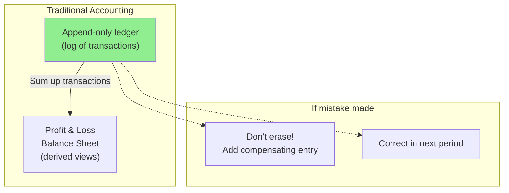

If a mistake is made, accountants don't erase or change the incorrect transaction — they add another transaction that compensates for it. The incorrect transaction remains in the ledger forever for auditing reasons. If incorrect figures derived from the ledger have already been published, the figures for the next accounting period include a correction.

This auditability is important in financial systems but beneficial elsewhere. If you accidentally deploy buggy code that writes bad data, recovery is much harder if the code can destructively overwrite data. With an append-only log of immutable events, diagnosing and recovering is much easier.

**Immutable events also capture more information** than just current state. On a shopping website, a customer may add an item to their cart and then remove it. Although the second event cancels out the first from an order-fulfillment view, knowing the customer considered but rejected the item is useful for analytics — and is recorded in the event log but lost in a database that deletes removed items.

### Deriving Several Views from the Same Event Log

By separating mutable state from the immutable event log, you can derive several read-oriented representations from the same log. This works like having multiple consumers of a stream.

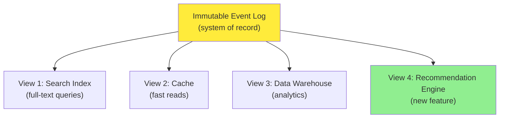

Having an explicit translation step from an event log to a database makes evolving applications easier. If you want a new feature presenting existing data in a new way, you can build a separate read-optimized view for the new feature and run it alongside existing systems without modifying them. Running old and new systems side by side is often easier than performing a complex schema migration. Once readers have switched to the new system, you can shut down the old one.

The traditional database design assumption — that data must be written in the same form as it will be queried — becomes irrelevant if you can translate from a write-optimized event log to read-optimized views.

### Concurrency Control

The biggest downside of having read views derived from a log is that consumers are usually asynchronous — a user could write to the log, then read from a derived view and find their write not yet reflected. Solutions include synchronous updates (requiring distributed transactions or waiting until reflected), but these are usually impractical, so views are normally updated asynchronously.

However, deriving state from an event log also simplifies concurrency control. Much of the need for multi-object transactions stems from a single user action requiring data changes in several places. With event sourcing, an event can be a self-contained description of a user action, requiring only a single write (appending to the log), which is easy to make atomic.

If the event log and application state are sharded the same way, a single-threaded log consumer needs no concurrency control for writes — by construction, it processes only one event at a time. The log removes nondeterminism by defining a serial order of events in a shard.

Many systems that don't use event-sourcing rely on immutability for concurrency control internally — databases use immutable data structures or multiversion data for point-in-time snapshots. Version control systems (Git, Mercurial, Fossil) also rely on immutability to preserve history.

### Limitations of Immutability

How feasible is it to keep an immutable history of all changes forever? It depends on churn:

- **Mostly-add workloads** (append-only, rare updates): easy to make immutable
- **High-update workloads** on small data: immutable history may grow prohibitively large; compaction and garbage collection become crucial

Beyond performance, data may need to be deleted for legal reasons:
- **GDPR** requires deletion of personal information
- **Accidental leaks** may need to be contained

In these cases, it's not sufficient to append another event indicating prior data should be considered deleted — you want to **rewrite history** and pretend the data was never written. Datomic calls this **excision**; Fossil version control calls it **shunning**.

Truly deleting data is surprisingly hard — copies live in many places (storage engines, filesystems, SSDs often write to new locations rather than overwriting in place; backups are often deliberately immutable).

**Crypto-shredding** is one approach: data that may need to be deleted is stored encrypted. To "delete" it, you forget the encryption key. The encrypted data is still there but unusable. This moves the problem around (key storage is mutable, not the actual data), and you must decide upfront which data shares which keys.

**Puncturable encryption** allows selectively revoking a key's decryption abilities but is not yet widely used.

---

## 4. Processing Streams

Now that we've discussed where streams come from (user activity, sensors, database writes) and how they're transported (direct messaging, brokers, event logs), let's discuss what you can do with the stream once you have it.

Three options for processing streams:

1. **Write events to a database, cache, search index, or storage system** — for later querying (Figure 12-5)
2. **Push events to users** — via email alerts, push notifications, real-time dashboards
3. **Process one or more input streams to produce output streams** — through a pipeline of processing stages

In this section we discuss option 3: processing streams to produce other derived streams. A piece of code that processes streams is called an **operator** or a **job**, closely related to Unix processes and MapReduce jobs.

The patterns for sharding and parallelization in stream processors are similar to MapReduce and dataflow engines. The crucial difference from batch jobs is that **a stream never ends** — sorting doesn't make sense on unbounded data, so sort-merge joins can't be used. Fault-tolerance mechanisms must also change: restarting from scratch after years of running isn't viable.

### Uses of Stream Processing

#### Complex Event Processing (CEP)

**Complex Event Processing (CEP)** is an approach from the 1990s for analyzing event streams — searching for patterns of events, similar to how a regular expression searches for patterns in a string. CEP systems use high-level declarative query languages (like SQL) or GUIs to describe patterns; the processing engine consumes input streams and maintains a state machine that performs matching. When a match is found, the engine emits a complex event with the details.

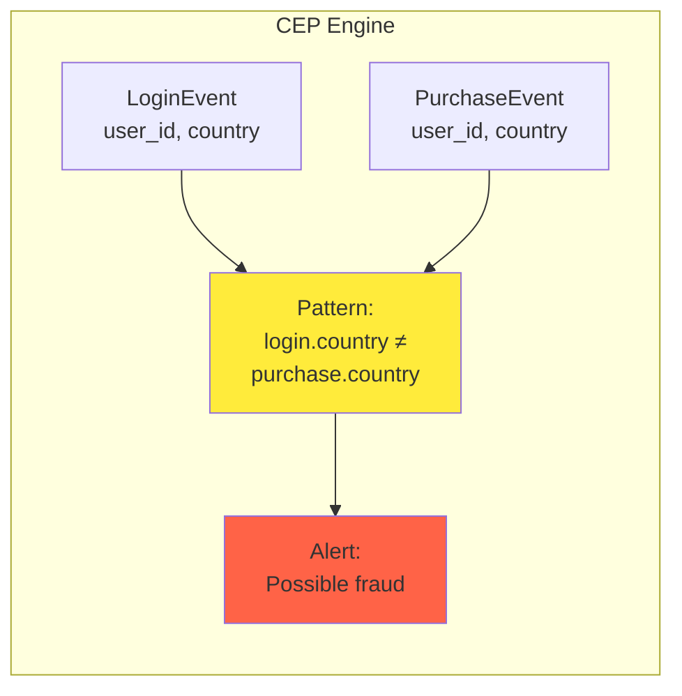

In CEP, the relationship between queries and data is reversed compared to databases. Queries are stored long-term; as each event arrives, the engine checks whether it matches any standing query. Implementations include Esper, Apaca, TIBCO StreamBase. Flink and Spark Streaming have SQL support for declarative stream queries.

#### Stream Analytics

Stream analytics is less focused on detecting specific sequences and more oriented toward aggregations and statistical metrics over large volumes of events. Examples:

- Measuring rate of a certain event type (events per interval)
- Calculating rolling average of a value over time
- Comparing current statistics to previous intervals (detecting trends, alerting on anomalies)

Statistics are usually computed over fixed time intervals — for example, average queries per second over the last 5 minutes and 99th percentile response time. Averaging over a few minutes smooths out irrelevant fluctuations while still giving a timely picture of traffic changes.

```python
# Simple stream analytics: count events per minute using a window
from collections import defaultdict
from datetime import datetime, timedelta
from typing import Dict

class TumblingWindowCounter:
    """Counts events in fixed 1-minute windows."""

    def __init__(self, window_size_seconds: int = 60):
        self.window_size = timedelta(seconds=window_size_seconds)
        self.windows: Dict[datetime, int] = defaultdict(int)

    def process_event(self, event: dict) -> dict:
        """Process a single event, return window count when window closes."""
        event_time = datetime.fromisoformat(event['timestamp'])
        # Round down to window start
        window_start = event_time.replace(
            second=0, microsecond=0
        )

        # Evict expired windows
        self._evict_old_windows(window_start)

        self.windows[window_start] += 1

        return {
            'window_start': window_start.isoformat(),
            'event_type': event['type'],
            'count': self.windows[window_start]
        }

    def _evict_old_windows(self, current_window: datetime):
        """Remove windows older than 1 window before current."""
        cutoff = current_window - self.window_size
        expired = [w for w in self.windows if w < cutoff]
        for w in expired:
            del self.windows[w]
```

Stream analytics systems sometimes use **probabilistic algorithms**: Bloom filters for set membership, HyperLogLog for cardinality estimation, percentile estimation algorithms. Probabilistic algorithms produce approximate results with much less memory. This leads some to believe stream processing is always lossy — but there is nothing inherently approximate about it; probabilistic algorithms are merely an optimization.

#### Maintaining Materialized Views

A stream of database changes can keep derived data systems (caches, search indexes, data warehouses) up-to-date. These are examples of **maintaining materialized views**: deriving an alternative view onto a dataset for efficient querying, updating when underlying data changes.

Similarly, in event sourcing, application state is maintained by applying a log of events — the application state is also a materialized view. Unlike stream analytics, you usually can't just consider events within a time window — you may need all events ever (except those discarded by log compaction). In effect, you need a window that stretches back to the beginning of time.

**Incremental View Maintenance (IVM)** converts queries written in SQL into operators capable of incremental computations. Rather than processing entire datasets, IVM algorithms recompute and update only changed data — making view computation far more efficient and updates run much more frequently.

```mermaid
graph LR
    subgraph "Traditional View Maintenance"
        SOURCE["Source tables"]
        BATCH["Periodic batch job<br/>(REFRESH MATERIALIZED VIEW)"]
        MV["Materialized view"]

        SOURCE --> BATCH --> MV
    end

    subgraph "Incremental View Maintenance"
        STREAM["Change stream"]
        IVM["IVM engine<br/>(updates only changed)"]
        MV2["Materialized view"]

        STREAM --> IVM --> MV2
    end

    style BATCH fill:#ffcccc
    style IVM fill:#90EE90
```

Databases like **Materialize, RisingWave, ClickHouse, Feldera** use IVM to provide efficient incremental materialized views, ingesting streams of events to expose materialized views in real time. Recent events are buffered in memory and periodically used to update on-disk materialized views. Reads combine recent events and materialized data.

#### Search on Streams

Beyond multi-event patterns, sometimes you need to search for individual events based on complex criteria like full-text queries. Media monitoring services subscribe to feeds of news articles and search for any news mentioning companies or topics of interest. Real estate sites notify users when new properties matching their search criteria appear.

Conventional search engines index documents then run queries. **Searching a stream turns this on its head**: queries are stored, and documents are evaluated against them (like CEP). Elasticsearch's **percolator** feature implements this kind of stream search. To optimize, you can index the queries as well as documents to narrow the set that may match.

#### Stream Processing Uses Summary

```mermaid
graph TB
    subgraph "Uses of Stream Processing"
        CEP["CEP<br/>Pattern matching"]
        ANALYTICS["Stream Analytics<br/>Aggregations & metrics"]
        MV["Materialized Views<br/>Keep derived data fresh"]
        IVM["IVM<br/>Incremental SQL queries"]
        SEARCH["Stream Search<br/>Full-text on streams"]
    end

    style CEP fill:#90EE90
    style ANALYTICS fill:#87CEEB
    style MV fill:#DDA0DD
    style IVM fill:#FFB6C1
    style SEARCH fill:#ffeb3b
```

### Reasoning About Time

Stream processors often need to deal with time, especially for analytics using time windows. The meaning of "the last five minutes" seems unambiguous but is surprisingly tricky.

In batch processing, the timeline of interest is the year of history being processed, not the few minutes of processing. Using timestamps in events allows deterministic processing — running the same process on the same input yields the same result.

Many stream processing frameworks use the **local system clock** on the processing machine (processing time) to determine windowing. This is simple but breaks down with significant processing lag.

#### Event Time Versus Processing Time

Processing may be delayed for many reasons:
- Queueing
- Network faults
- Performance issues / contention
- Restart of stream consumer
- Reprocessing of past events while recovering from fault or bug

**Message delays can lead to unpredictable ordering**. A user makes one web request handled by server A, then another handled by server B. B's event reaches the broker before A's — processors see them in the opposite order.

A good analogy is the **Star Wars movies**: Episode IV came out in 1977, Episode V in 1980, Episode VI in 1983, followed by Episodes I, II, III in 1999, 2002, 2005, then VII, VIII, IX in 2015, 2017, 2019. If you watched them in release order, the order you processed them is inconsistent with their narrative order. The episode number is like the event timestamp; the date you watched is processing time.

**Confusing event time and processing time leads to bad data**. A rate counter (requests per second) based on processing time will look anomalous if you redeploy the processor — it shuts down for a minute, then processes a backlog when it comes back, making it look like a spike of requests when the actual rate was steady.

```mermaid
graph TB
    subgraph "Event Time"
        ET["Event Time:<br/>When event occurred at source"]
        ET_EX["Example:<br/>User clicked at 10:00:00"]
    end

    subgraph "Processing Time"
        PT["Processing Time:<br/>When event processed by stream processor"]
        PT_EX["Example:<br/>Processed at 10:00:15"]
    end

    ET -.-> ET_EX
    PT -.-> PT_EX

    style ET fill:#90EE90
    style PT fill:#ffeb3b
```

#### Handling Straggler Events

When defining windows in event time, you can never be sure whether you've received all events for a window or some are still to come. Counting events in 1-minute windows: you've counted events in the 37th minute, time moves on, and most incoming events fall in the 38th/39th minutes. When do you declare the 37th-minute window ready and output its counter?

You can time out and declare a window ready after not seeing new events for a while. However, events could be buffered on another machine, delayed by a network interruption. You must handle **straggler events** that arrive after the window is declared complete. Two options:

```mermaid
graph TB
    subgraph "Straggler Event Strategies"
        IGNORE["Ignore:<br/>Discard late events<br/>Track metric of dropped events"]
        RECOMPUTE["Publish correction:<br/>Updated window value<br/>with stragglers included"]
    end

    style IGNORE fill:#ffcccc
    style RECOMPUTE fill:#90EE90
```

A special message can indicate "from now on, there will be no more messages with timestamp earlier than t," which consumers can use to trigger windows. If multiple producers exist with their own thresholds, consumers must track each producer individually.

#### Whose Clock Are You Using?

Assigning timestamps is harder when events can be buffered at several points. A mobile app reporting usage metrics may be used while offline — it buffers events locally and sends them when a connection is next available (hours or days later). These appear as extremely delayed stragglers.

The timestamp should be the time the user interaction occurred (according to device clock), but device clocks can be accidentally or deliberately wrong. The time the server received the event is more accurate but less meaningful.

To adjust, **log three timestamps**:
1. Time the event occurred, according to device clock
2. Time the event was sent to the server, according to device clock
3. Time the event was received by the server, according to server clock

Subtracting the second from the third estimates the device-server clock offset (assuming network delay is negligible compared to required accuracy). Apply that offset to estimate the true time the event occurred.

#### Types of Windows

```mermaid
graph TB
    subgraph "Window Types"
        TUMBLING["Tumbling Window<br/>Fixed length<br/>No overlap<br/>Each event in one window"]
        HOPPING["Hopping Window<br/>Fixed length<br/>Overlap for smoothing"]
        SLIDING["Sliding Window<br/>All events within<br/>interval of each other"]
        SESSION["Session Window<br/>No fixed length<br/>Ends on inactivity"]
    end

    style TUMBLING fill:#90EE90
    style HOPPING fill:#87CEEB
    style SLIDING fill:#DDA0DD
    style SESSION fill:#FFB6C1
```

- **Tumbling**: fixed length, every event in exactly one window. A 1-minute tumbling window: events 10:03:00-10:03:59 in one window, 10:04:00-10:04:59 in the next.
- **Hopping**: fixed length with overlap for smoothing. A 5-minute window with 1-minute hop covers 10:03:00-10:07:59, then 10:04:00-10:08:59.
- **Sliding**: contains all events within a certain interval of each other. A 5-minute sliding window covers events at 10:03:39 and 10:08:12 because they're less than 5 minutes apart (tumbling/hopping wouldn't put them in the same window).
- **Session**: no fixed duration. Groups events for the same user that occur closely together; ends when the user is inactive for some time (e.g., 30 minutes). Common for website analytics.

Window operations usually maintain temporary state. Some windows keep fixed-size state (e.g., a counter) regardless of window size. Sliding windows and stream joins require buffering events until the window finishes — large windows or high-throughput streams can keep a lot of state.

### Stream Joins

Joins form an important part of data pipelines. Since stream processing generalizes pipelines to incremental processing of unbounded data, the same need for joins exists. However, the fact that new events appear at any time makes joins more challenging than in batch.

Three types of stream joins: **stream-stream**, **stream-table**, **table-table**.

#### Stream-Stream Join (Window Join)

For a website search feature, you want to detect recent trends in searched URLs. Each search logs an event; each click on a result logs another. To calculate click-through rate per URL, you need search events and click events connected by session ID.

The click may never come (user abandons search). If it comes, time between search and click is highly variable (seconds to days/weeks). Because of variable network delays, click events may arrive before search events. Choose a suitable window — e.g., join a click with a search if they occur at most one hour apart.

```mermaid
sequenceDiagram
    participant Search
    participant Window as Join Window
    participant Click
    participant Output

    Search->>Window: search_id=1, user=A, time=10:00
    Note over Window: Store in window<br/>Wait for matching click
    Click->>Window: search_id=1, user=A, time=10:02
    Note over Window: Match!<br/>Within 1-hour window
    Window->>Output: (search, click) pair
    Search->>Window: search_id=2, user=B, time=10:05
    Note over Window: Store in window<br/>Wait 1 hour...
    Note over Window: 11:05 - Window expires<br/>No matching click
    Window->>Output: Search with no click
```

Embedding search details in the click event is **not equivalent** to joining — you'd only see cases where the user clicked a result, not searches where they didn't click. For accurate CTR, you need both search and click events.

To implement, the stream processor maintains state: all events in the last hour, indexed by session ID. When a search or click event occurs, add it to the index and check the other index for a matching session ID. If matched, emit a "click happened" event. If the search expires without a matching click, emit a "no click" event.

#### Stream-Table Join (Stream Enrichment)

The same join used in batch (joining activity events with user profiles) is natural to perform continuously. Input: a stream of activity events containing user IDs. Output: activity events where user IDs are augmented with profile information. This is **enrichment**.

To perform the join, the stream process takes one activity event, looks up the user ID in the database, and adds profile info. The database lookup could be a remote query — but as discussed in Chapter 11, remote queries are slow and risk overloading the database.

Better: load a copy of the database into the stream processor for **local queries without network round trip** (a hash join since the local copy may be an in-memory hash table or on-disk index).

```mermaid
graph LR
    subgraph "Event Stream"
        EVENTS["Click events:<br/>user_id, page, time"]
    end

    subgraph "Database Table"
        USERS["User profiles:<br/>user_id, name,<br/>age, country"]
    end

    subgraph "Enriched Stream"
        ENRICHED["Enriched events:<br/>user_id, page, time,<br/>name, age, country"]
    end

    EVENTS --> ENRICHED
    USERS -.->|"Lookup"| ENRICHED

    style EVENTS fill:#90EE90
    style USERS fill:#87CEEB
    style ENRICHED fill:#ffeb3b
```

The difference from batch: a batch job uses a point-in-time snapshot. A stream processor is long-running, and the database changes over time, so the local copy needs to be kept up-to-date. CDC solves this: subscribe to a changelog of the user profile database as well as activity events. When a profile is created/modified, update the local copy. The result is a join between two streams: activity events and profile updates.

A stream-table join is similar to a stream-stream join. The biggest difference: for the table changelog stream, the join uses a window reaching back to "the beginning of time" (conceptually infinite), with newer versions overwriting older ones. For the stream input, the join might not maintain a window at all.

#### Table-Table Join (Materialized View Maintenance)

For the social network timeline example: when a user wants to view their home timeline, iterating over all followed people and merging recent posts is too expensive. Instead, you want a **timeline cache** (per-user "inbox") where posts are written as sent, so reading the timeline is a single lookup.

Materializing and maintaining this cache requires:
- When user u sends a new post: add to timeline of every user following u
- When a user deletes a post or account: remove from all timelines
- When user u1 starts following u2: recent posts by u2 are added to u1's timeline
- When user u1 unfollows u2: posts by u2 are removed from u1's timeline

```mermaid
graph TB
    subgraph "Changelog Streams"
        POSTS["Posts changelog:<br/>post_id, sender_id,<br/>content, timestamp"]
        FOLLOWS["Follows changelog:<br/>follower_id,<br/>followee_id"]
    end

    subgraph "Materialized View"
        MV["Per-user timeline:<br/>follower_id →<br/>posts[]"]

        POSTS --> MV
        FOLLOWS --> MV
    end

    style MV fill:#90EE90
```

To implement, you need streams of events for posts (send/delete) and follow relationships (follow/unfollow). The stream process maintains a database containing the set of followers for each user so it knows which timelines to update.

The join of streams corresponds directly to joining tables:
```sql
SELECT follows.follower_id AS timeline_id,
       array_agg(posts.* ORDER BY posts.timestamp DESC)
FROM posts
JOIN follows ON follows.followee_id = posts.sender_id
GROUP BY follows.follower_id
```

The timelines are a cache of the query result, updated whenever underlying tables change. The stream of changes to the materialized join follows the **product rule**: (u·v)′ = u′v + uv′ — any change of posts is joined with current followers, and any change of follows is joined with current posts.

#### Time Dependence of Joins

The three join types have much in common — they all require the processor to maintain state derived from one input and query that state when processing records from the other input.

The order of events maintaining state matters. In sharded logs like Kafka, ordering within a partition is preserved but typically no ordering across partitions/streams. This raises a question: if events on different streams happen around similar times, in which order are they processed?

In stream-table join: if a user updates their profile, which activity events join with the old profile (before update) versus the new profile (after update)? **If state changes over time, and you join with state, what point in time do you use for the join?**

```mermaid
graph TB
    subgraph "Tax Rate Scenario"
        SALE["Sale event:<br/>timestamp: 2024-01-15"]
        TAX_OLD["Old tax rate: 8%"]
        TAX_NEW["New tax rate: 10%<br/>(effective 2024-02-01)"]
        SALE --> TAX_OLD
        SALE -.->|"Which tax rate?"| TAX_NEW
    end

    style SALE fill:#ffeb3b
```

Example: applying tax rates to invoices. Tax rate depends on country/state, product type, and **date of sale** (rates change over time). You probably want the tax rate at the time of sale — different from the current rate if reprocessing historical data.

If ordering across streams is undetermined, the join becomes **nondeterministic** — rerunning the same job on the same input may produce different results. In data warehouses, this is the **slowly changing dimension (SCD)** problem, often addressed by giving each version a unique identifier (every time tax rate changes, a new identifier, and invoices include the ID of the rate at time of sale). This makes the join deterministic but means log compaction isn't possible (all versions must be retained). Alternatively, denormalize the data and include the applicable rate directly in every sale event.

### Fault Tolerance

Batch frameworks tolerate faults easily: if a task fails, start it again on another machine; output of the failed task is discarded. Transparent retry is possible because input files are immutable, each task writes to a separate file, and output is visible only when a task completes. This principle is **exactly-once semantics**, though "effectively-once" would be more descriptive.

```mermaid
graph TB
    subgraph "Batch Fault Tolerance"
        TASK["Task fails<br/>midway"]
        RESTART["Restart task<br/>on new machine"]
        DISCARD["Discard partial output"]
        SUCCESS["Task completes<br/>Output visible"]

        TASK --> RESTART --> DISCARD --> SUCCESS
    end

    subgraph "Stream Challenge"
        NEVER["Stream never ends<br/>Can't wait for 'completion'"]
        OUTPUT["Output is continuous<br/>Can't discard everything"]
    end

    style SUCCESS fill:#90EE90
    style NEVER fill:#ffcccc
```

The same issue arises in stream processing, but is less straightforward. Waiting until a task is finished before making output visible isn't an option because a stream is infinite.

#### Microbatching and Checkpointing

**Microbatching** breaks the stream into small blocks treated as miniature batch processes (Spark Streaming). Batch size is typically around 1 second — smaller incurs more scheduling/coordination overhead; larger means longer delay before results become visible. Microbatching implicitly provides a tumbling window equal to batch size (windowed by processing time).

**Checkpointing** (Apache Flink) periodically generates rolling checkpoints of state and writes them to durable storage. If a stream operator crashes, it restarts from the most recent checkpoint and discards any output generated between the last checkpoint and the crash. Checkpoints are triggered by barriers in the message stream, similar to microbatching boundaries but without forcing a particular window size.

```mermaid
sequenceDiagram
    participant Source as Kafka
    participant Op1 as Operator 1
    participant Op2 as Operator 2
    participant Storage as Checkpoint Storage

    Note over Op1,Op2: Processing events...
    Op1->>Op1: Checkpoint barrier injected
    Op1->>Storage: Save state (offset=1000)
    Op1->>Op2: Forward barrier
    Op2->>Op2: Receive barrier
    Op2->>Storage: Save state
    Note over Storage: Checkpoint complete<br/>All operators saved
    Note over Op1,Op2: Continue processing...
    Note over Op1: Failure!
    Storage->>Op1: Restore state (offset=1000)
    Source->>Op1: Replay from offset 1000
```

Within the framework, microbatching and checkpointing provide the same exactly-once semantics as batch. However, as soon as output leaves the processor (writes to a database, publishes to external broker, sends email), the framework can't discard output of a failed microbatch. Restarting causes external side effects to happen twice.

#### Atomic Commit Revisited

To give the appearance of exactly-once processing with faults, all outputs and side effects must persist if and only if processing succeeds:
- Messages sent to downstream operators or external systems (including email/push notifications)
- Database writes
- Changes to operator state
- Acknowledgments of input messages (moving consumer offset forward)

These must all happen atomically — either all or none. This is the **distributed transaction** / **two-phase commit** problem.

Traditional distributed transactions (XA) have problems (Chapter 8). In restricted environments, atomic commit can be implemented efficiently — used in **Google Cloud Dataflow**, **VoltDB**, **Apache Kafka**. Unlike XA, these don't attempt transactions across heterogeneous technologies but keep transactions internal by managing state changes and messaging within the framework. Overhead can be amortized by processing several input messages in one transaction.

```mermaid
graph TB
    subgraph "Atomic Commit for Streams"
        TX1["Input message 1"]
        TX2["Input message 2"]
        TX3["Input message 3"]
        PROC["Process all in single TX"]
        COMMIT["Atomic commit:<br/>State changes +<br/>output + offset advance"]
        SUCCESS["All visible"]

        TX1 --> PROC
        TX2 --> PROC
        TX3 --> PROC
        PROC --> COMMIT --> SUCCESS
    end

    style COMMIT fill:#90EE90
```

#### Idempotence

Another way to achieve the goal of discarding partial output is **idempotence**. An idempotent operation has the same effect whether performed once or many times. For example, deleting a key in a key-value store is idempotent (deleting again has no effect); incrementing a counter is not.

```mermaid
graph TB
    subgraph "Idempotent Operations"
        I1["SET counter = 5<br/>✓ Idempotent"]
        I2["DELETE user WHERE id=123<br/>✓ Idempotent"]
        I3["INSERT with unique key<br/>✓ Idempotent (constraint)"]
    end

    subgraph "Non-Idempotent Operations"
        N1["counter = counter + 1<br/>❌ Not idempotent"]
        N2["INSERT without unique key<br/>❌ Not idempotent"]
        N3["Send email<br/>❌ Not idempotent"]
    end

    style I1 fill:#90EE90
    style I2 fill:#90EE90
    style I3 fill:#90EE90
    style N1 fill:#ffcccc
    style N2 fill:#ffcccc
    style N3 fill:#ffcccc
```

Even non-idempotent operations can often be made idempotent with extra metadata. When consuming from Kafka, every message has a persistent monotonically increasing offset. When writing to an external database, include the message offset with the value — you can tell whether an update has already been applied and avoid performing it again. Storm's Trident uses a similar idea.

Idempotence relies on several assumptions:
- Restarting a failed task replays messages in the same order (a log-based broker does this)
- Processing must be deterministic
- No other node may concurrently update the same value
- Failing over may require fencing to prevent interference from a "thought-dead" node

```python
# Idempotent stream processor using message offsets
class IdempotentWriter:
    """Writes only if the message offset hasn't been processed before."""

    def __init__(self, db):
        self.db = db
        self.last_applied_offset = -1

    def write(self, message):
        """Apply the message's effect only if not already applied."""
        offset = message.offset

        # Idempotency check: skip if we've already processed this offset
        if offset <= self.last_applied_offset:
            return False  # Already applied, skip duplicate

        # Persist the offset along with the data so we can detect duplicates
        self.db.execute(
            "INSERT INTO writes (offset, key, value) VALUES (%s, %s, %s) "
            "ON CONFLICT (offset) DO NOTHING",
            (offset, message.key, message.value)
        )
        self.last_applied_offset = offset
        return True
```

#### Rebuilding State After a Failure

Stream processes that require state (windowed aggregations, tables/indexes for joins) must ensure state can be recovered after failure. Options:

```mermaid
graph TB
    subgraph "State Recovery Strategies"
        REMOTE["Remote Datastore<br/>Replicate state<br/>Query on every message"]
        LOCAL["Local State<br/>Replicate periodically<br/>Read on recovery"]
        REPLAY["Rebuild from Streams<br/>Replay input events<br/>No replication needed"]
    end

    style REMOTE fill:#ffcccc
    style LOCAL fill:#90EE90
    style REPLAY fill:#87CEEB
```

1. **Remote datastore**: keep state remotely and replicate. Querying remote DB for each message can be slow.
2. **Local state with periodic replication**: Flink captures snapshots of operator state and writes to durable storage; Kafka Streams replicates state changes by sending them to a dedicated compacted topic (like CDC); VoltDB redundantly processes each input message on several nodes.
3. **Rebuild from input streams**: if state consists of aggregations over a short window, replaying input events may be fast enough. If state is a local DB copy maintained by CDC, the DB can be rebuilt from the log-compacted change stream.

All options depend on infrastructure performance characteristics. Network delay may be lower than disk access latency, and bandwidth may be comparable to disk bandwidth. No solution is universally ideal.

---

## 5. Summary

In this chapter we discussed event streams, the purposes they serve, and how to process them. Stream processing is like batch processing but done continuously on unbounded streams rather than on fixed-size input. Message brokers and event logs serve as the streaming equivalent of a filesystem.

```mermaid
graph TB
    subgraph "Key Concepts"
        EVENTS["Events:<br/>Immutable, timestamped"]
        BROKERS["Messaging:<br/>AMQP/JMS vs<br/>log-based"]
        CDC["CDC:<br/>Database changes<br/>as a stream"]
        IMMUT["Immutability:<br/>Log as source of truth"]
    end

    subgraph "Stream Processing"
        USE["Uses: CEP, Analytics,<br/>Materialized Views"]
        TIME["Time:<br/>Event vs processing time"]
        JOINS["Joins: stream-stream,<br/>stream-table, table-table"]
        FAULT["Fault tolerance:<br/>Exactly-once semantics"]
    end

    EVENTS --> BROKERS
    BROKERS --> CDC
    CDC --> IMMUT
    IMMUT --> USE
    USE --> TIME
    USE --> JOINS
    USE --> FAULT

    style EVENTS fill:#90EE90
    style CDC fill:#87CEEB
    style IMMUT fill:#DDA0DD
    style FAULT fill:#ffeb3b
```

**Two types of message brokers**:
- **AMQP/JMS-style**: broker assigns individual messages to consumers; messages deleted after acknowledgment. Appropriate for asynchronous RPC and task queues where exact ordering isn't important and re-reading old messages isn't needed.
- **Log-based**: broker assigns all messages in a shard to the same consumer; messages always delivered in same order. Parallelism through sharding; consumers track progress by offset. Messages retained on disk, allowing replay.

The log-based approach has similarities to database replication logs (Chapter 6) and log-structured storage engines (Chapter 4). It is a form of consensus (Chapter 10). It's especially appropriate for stream processing systems consuming input streams and generating derived state or output streams.

**Where streams come from**: user activity events, sensor readings, market data feeds — naturally represented as streams. Database writes can also be thought of as a stream. We can capture the changelog either implicitly through **CDC** or explicitly through **event sourcing**. **Log compaction** allows the stream to retain a full copy of database contents.

**Keeping derived data fresh**: caches, search indexes, analytical systems can be kept continually up-to-date by consuming the change log and applying changes. You can even build fresh views by starting from scratch and consuming the change log from the beginning to the present.

**Stream processing purposes**:
- **Complex event processing**: searching for event patterns
- **Stream analytics**: windowed aggregations
- **Materialized views**: keeping derived data systems up-to-date

**Time challenges**: distinction between processing time and event timestamps; dealing with straggler events arriving after windows are considered complete.

**Three types of stream joins**:
- **Stream-stream**: both inputs are activity events; join within a time window
- **Stream-table**: activity events + database changelog; changelog keeps local copy up-to-date
- **Table-table**: both inputs are database changelogs; every change on one side joins with latest state of other; result is a stream of changes to materialized view

**Fault tolerance**: as with batch processing, discard partial output of failed tasks. Since streams are long-running with continuous output, finer-grained recovery is needed — microbatching, checkpointing, transactions, or idempotent writes.

### Comparison Table: Batch vs Stream Processing

| Aspect | Batch Processing | Stream Processing |
|--------|------------------|-------------------|
| **Input** | Bounded (complete dataset) | Unbounded (continuous) |
| **Latency** | Minutes to hours | Milliseconds to seconds |
| **Results** | Complete, final | Continuous, approximate |
| **State** | Materialized to disk | In-memory with checkpoints |
| **Time** | Processing time only | Event time + processing time |
| **Failures** | Retry entire job | Checkpoint and replay |
| **Use cases** | Daily reports, ML training | Fraud detection, monitoring |
| **Joins** | Sort-merge on full data | Window-based with state |
| **Recovery** | Restart from beginning | Restart from offset/checkpoint |

### Processing Guarantees

```mermaid
graph TB
    subgraph "Processing Guarantees"
        AT_MOST["At-most-once:<br/>May lose messages<br/>❌ Unacceptable for most apps"]

        AT_LEAST["At-least-once:<br/>May process duplicates<br/>✓ OK if idempotent"]

        EXACTLY["Exactly-once:<br/>Each message once<br/>✓ Ideal but complex"]
    end

    style AT_MOST fill:#ffcccc
    style AT_LEAST fill:#ffeb3b
    style EXACTLY fill:#90EE90
```

### Key Takeaways

1. **Event logs are foundational** — durable, ordered, partitioned. They enable replay, multiple consumers, and massive throughput (millions of messages/sec).

2. **CDC unlocks integration** — observe database changes as a stream to keep caches, search indexes, and warehouses in sync without dual writes.

3. **Time is complex in streams** — distinguish event time from processing time, use watermarks to track progress, handle late events explicitly.

4. **Windowing enables aggregations** — tumbling (fixed non-overlapping), hopping (overlapping for smoothing), sliding (per event), session (activity-based).

5. **Joins require state** — stream-stream (within time window), stream-table (lookup enrichment), table-table (maintain materialized view).

6. **Immutability is powerful** — append-only logs preserve history, enable time travel, audit, and deriving multiple views from one source.

7. **Exactly-once is achievable** — through idempotent operations, transactions, or careful checkpointing — but requires care when crossing system boundaries.

8. **Different brokers for different needs** — JMS/AMQP for fine-grained load balancing of expensive messages; log-based (Kafka) for high-throughput, ordered, replayable streams.

---

**Previous**: [Chapter 11: Batch Processing](./chapter-11-batch-processing.md)
