# Chapter 13: A Philosophy of Streaming Systems

## TL;DR

- Treat data as a flow: route all writes through a system of record and derive every other representation (search index, cache, warehouse, ML store) from a CDC event log.
- The event log is the substrate for derived data, the channel for cross-system consistency, and the audit trail for verifiability.
- Compose specialized tools via the log rather than distributed transactions; use idempotent consumers, request IDs, and sharding by conflict key for correctness.
- Trade-offs: derived data is eventually consistent. Integrity (no corruption) matters more than timeliness (no staleness) and should be enforced end-to-end.
- Audit continuously with hash-chained logs and periodic reprocessing; no single layer guarantees correctness on its own.

## Introduction

Over the previous chapters we explored the building blocks of data systems: storage engines, replication protocols, transaction models, consistency guarantees, and the tools for batch and stream processing. Each is a deep technical field in its own right. The remaining question is philosophical: how should we compose these pieces to build applications that are correct, evolvable, and durable?

There is no single "right" tool for every problem. A search engine is great at fuzzy keyword retrieval; a transactional database is great at enforcing invariants on concurrent writes; a data warehouse is great at scanning large volumes of history. Complex applications need all of these capabilities, and so inevitably they combine several pieces of software. The challenge is not to find a single product that does everything, but to assemble a system from parts that are each appropriate for one slice of the workload.

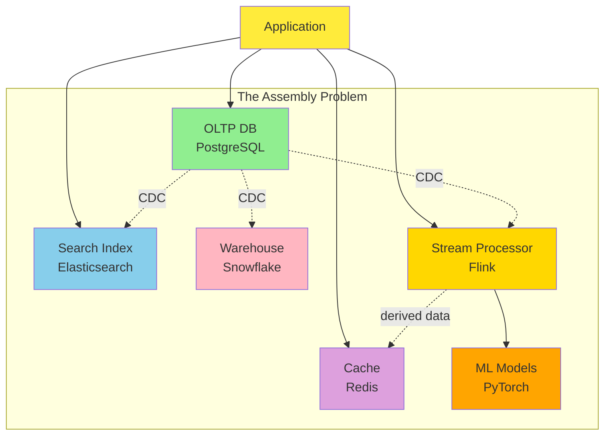

The philosophy of streaming systems, as it has emerged over the last decade, is to treat data as a **flow** that moves through transformations, rather than as a static thing that lives in one place and gets queried. This philosophy touches every layer: how we integrate tools, how we maintain derived data, how we enforce correctness, and how we audit the system for silent corruption.

This chapter is the philosophy chapter. It does not introduce new algorithms. Instead it ties together the ideas from the rest of the book into a coherent design approach, anchored on three pillars:

1. **Data integration** through derived data and event logs.
2. **Correctness** in the form of integrity, enforced end-to-end with request identifiers.
3. **Verifiability** through audits and immutable event histories.

---

## 1. Data Integration

### 1.1 Combining Specialized Tools by Deriving Data

Almost every non-trivial application needs more than one storage technology. A typical SaaS product uses:

- An **OLTP database** (e.g. PostgreSQL, MySQL) for the system of record.
- A **full-text search index** (e.g. Elasticsearch) for fuzzy queries.
- A **cache** (e.g. Redis, Memcached) for hot reads.
- A **data warehouse** (e.g. Snowflake, BigQuery) for analytics.
- A **recommender or ranking system** that uses ML models.
- A **notification service** that watches for state changes.

The naive solution is to write to each of these from the application code. The problem is that dual writes from the application cannot be made atomic across all the targets. If one write succeeds and another fails, the systems diverge, and they will never agree again unless somebody runs a careful reconciliation job.

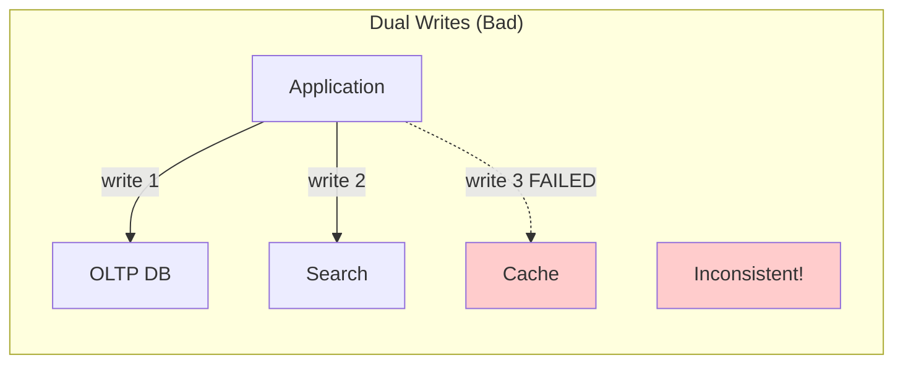

A better approach is to designate **one** system as the system of record, and then derive all other representations from it. The mechanism of choice is **change data capture (CDC)**: an ordered, durable stream of every write to the system of record. The CDC stream becomes the source of truth from which every other representation is built. Writes go into the system of record; everything else is downstream.

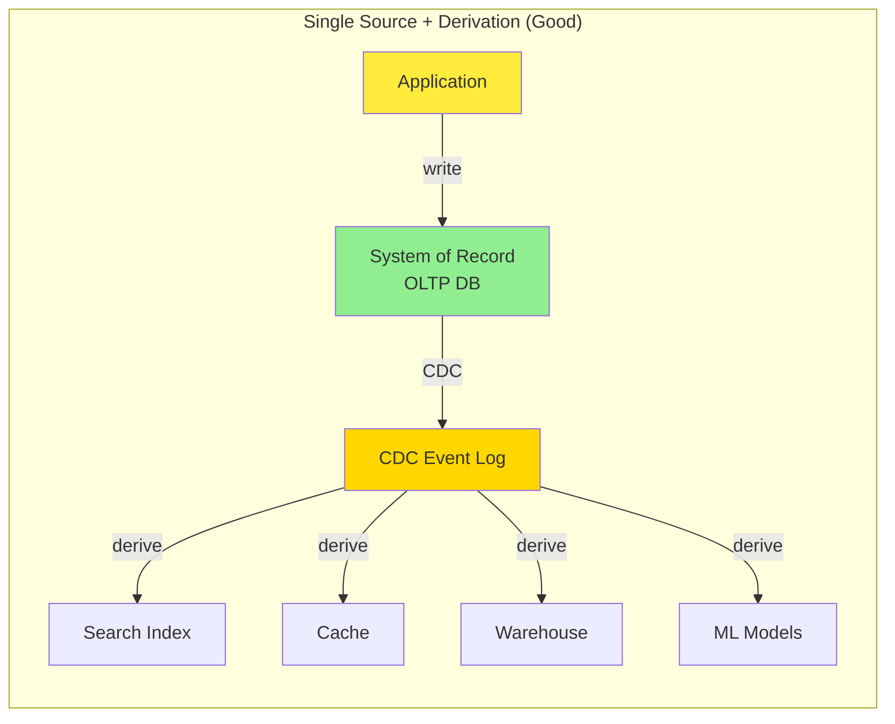

The win is that all derived systems see writes in the same order, and the application only has to get one write right. The CDC log acts as the **single arbiter of ordering**, so derived data can never disagree on what the order of events was. (For the mechanics of how CDC events are extracted from a database, see Chapter 12; this chapter is concerned with the philosophy of using CDC as the wiring for data integration.)

**Example: Twitter's search system.** Twitter maintains an in-house search system (Earlybird) that is derived from the primary tweet database via a CDC-style pipeline. The application never writes to the search index directly; instead, every new tweet and edit flows through the database, is captured by the log, and is then applied to Earlybird. If the search index diverges from the database for any reason (bug, partial outage), it can be rebuilt by replaying the log.

The principle generalizes. Whenever two systems must reflect the same underlying data, they should not both be writable by the application. They should be read-only with respect to that data, and one should be the source. The CDC log is the wiring that connects source to derived.

### 1.2 Reasoning About Dataflows

Once we adopt derived data as the central pattern, we have to be very explicit about the dataflow: where does each datum first appear, and how does it propagate?

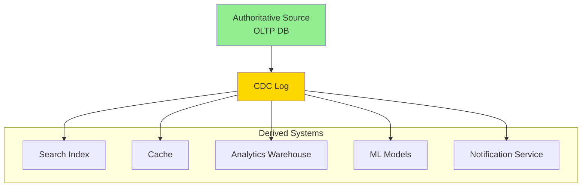

For this to work, two properties must hold:

1. **Single point of entry.** All writes go through the system of record.
2. **Deterministic derivation.** Each derived system reads the CDC log in order, applies its transformation, and writes its output. The transformation must be deterministic for the system to be replayable.

This is the **state machine replication** model from Chapter 10, applied at the level of an entire organization: a single total order of writes is replicated into many stateful systems that all deterministically process them.

When a CDC log is the only input to a derived system, the derived state is a pure function of the log. That means:

- If the log is preserved, the state can be recomputed from scratch at any time.
- If a derived system crashes, it can replay the log and catch up.
- If a derived system has a bug, we can fix the code and reprocess the log.

This is why the **immutable, append-only event log** is so central. It is the substrate on which derived data lives.

A minimal sketch of a derived consumer over a CDC log:

```python
@dataclass(frozen=True)
class ChangeEvent:
    offset: int
    key: str
    op: str        # "insert" | "update" | "delete"
    before: dict
    after: dict

class DerivedConsumer:
    """Applies a deterministic reducer to each event in the log."""
    def __init__(self, reducer):
        self.reducer = reducer
        self.state = {}
        self.applied_offset = 0

    def apply(self, event: ChangeEvent) -> None:
        self.state = self.reducer(self.state, event)
        self.applied_offset = event.offset + 1

    def rebuild(self) -> None:
        self.state, self.applied_offset = {}, 0
        # Replay the entire log from offset 0.
```

The full implementation, with the `CDCLog` and reducer functions, lives in `examples/ch13/cdc_consumer.py`.

### 1.3 Derived Data vs Distributed Transactions

The classic alternative to derived data is **distributed transactions across heterogeneous systems**, exemplified by XA. Both approaches try to keep multiple systems consistent, but they get there by opposite routes.

| Property | Distributed transactions (XA) | Derived data via event log |
|---|---|---|
| Atomicity mechanism | Two-phase commit | Deterministic replay + idempotence |
| Read-your-writes | Immediate | Eventually (asynchronous) |
| Failure mode | Aborts on any participant failure | Continues; consumers catch up |
| Performance overhead | High; synchronous coordination | Low; loose coupling |
| Cross-vendor support | Limited (XA rarely implemented end-to-end) | Easy (everyone can read a log) |
| Operational robustness | Poor; cascading failures | Good; faults are localized |

The reason derived data has won the practical battle is not that it is theoretically superior. It is that the assumptions of distributed transactions — homogeneous implementations, a single trusted coordinator, bounded latency — do not hold once the components of the system are owned by different teams and run on different machines across different geographies. The event log works in spite of heterogeneity, because every consumer just needs to read bytes from a stream.

The cost is that you no longer get read-your-writes for free. A user who updates their profile and immediately reloads the page may not see their update, because the search index update is asynchronous. To bridge that gap, we have to add explicit mechanisms: a synchronously-writable profile database that the application can read immediately, plus an asynchronous pipeline that propagates the same write to all derived systems. That is a perfectly reasonable trade-off, but it does require thinking.

### 1.4 The Limits of Total Ordering

The most powerful correctness property we get from a single-leader database is **total order broadcast**: every write gets a definite position in a global sequence, and all replicas agree on that sequence. Total ordering is what allows derived systems to be consistent with each other: they all process events in the same order.

But total ordering has a ceiling. It works when one leader can decide the order of all events. Once that assumption breaks, ordering gets harder:

- **Throughput beyond one machine.** If events arrive faster than a single leader can sequence them, the log must be sharded. Sharded logs lose global order: events in shard A and shard B have no defined relative order.
- **Geographic distribution.** Each region typically has its own leader, because cross-region consensus is slow. Events from different regions are not totally ordered.
- **Microservices with independent state.** When each service owns its own database, there is no shared log to order across services.
- **Offline-capable clients.** A mobile app that captures edits while disconnected is generating writes that arrive at the server out of order relative to other clients.

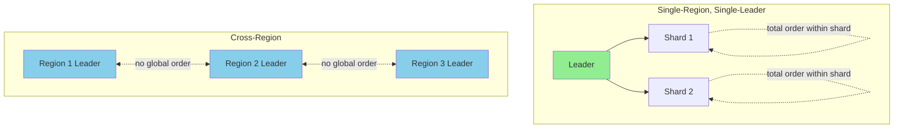

In formal terms, total order broadcast is equivalent to **consensus**. Consensus algorithms are designed for the single-leader case and do not naturally shard. To go beyond single-leader, we have to give up some ordering.

### 1.5 Ordering Events to Capture Causality

When total order is unavailable, we still want to preserve **causal ordering**: if event A influences event B, then every observer must see A before B.

**Example: unfriend followed by message.** A user unfriends their ex, then posts a status update complaining about them. The notification system should not deliver the message to the ex. But if the friend-graph service and the messaging service are independent, the notification system might process the message before the unfriend event, and incorrectly notify the ex.

Three techniques help in this situation:

1. **Logical timestamps.** Lamport timestamps or vector clocks (see Chapter 10) provide a partial order without coordination. Recipients can detect causal dependencies.
2. **Causal IDs.** Each event records the IDs of the events it causally depended on. Downstream consumers use these IDs to reconstruct dependencies.
3. **Conflict resolution at read.** When events are delivered in an unexpected order, the application uses CRDT-style merge logic to converge.

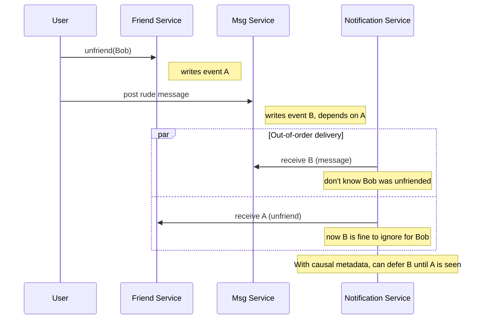

This is still an open research area. The cleanest production approach is to route causally-related events through the same log shard, which preserves order for related events at the cost of constraining parallelism.

---

## 2. Batch and Stream Processing

### 2.1 Maintaining Derived Data

The fundamental operation in a data integration system is **derivation**: take a source dataset, apply a transformation, write the result somewhere. The transformation is what database people call a **view** or a **materialized view** (see Chapter 11), but it can be more elaborate: a full-text index, a feature store for ML, a cache of an expensive computation, an aggregate metric.

Two flavors of the same idea exist:

- **Batch processing** reads a bounded input (e.g. yesterday's events), transforms it, and writes bounded output. It is recomputable from scratch, deterministic, and easy to reason about.
- **Stream processing** reads an unbounded input (events as they happen), maintains state, and emits output continuously.

The principles that make them work are nearly identical: deterministic transformations, immutable inputs, idempotent operations. The main difference is that stream processing maintains long-running state (aggregations, joins, last-N), whereas batch processing can assume that state fits in the job's lifetime.

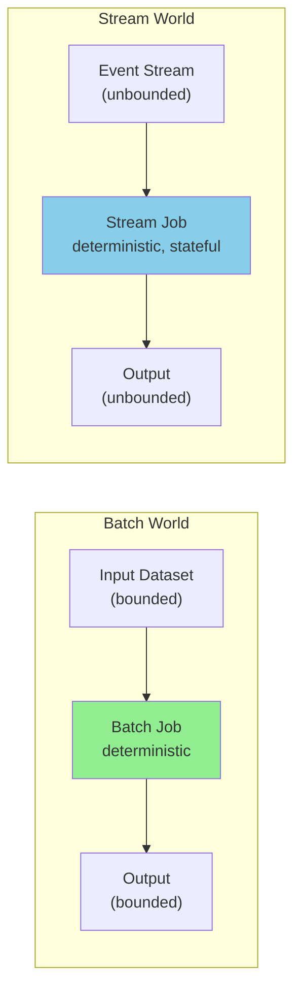

Both styles benefit from asynchrony. If we tried to maintain derived data synchronously (in the same transaction as the source write), we would couple the source system's availability to the derived system's availability. A slow or failing derived system would block writes. By making derivation asynchronous, we decouple the two: the source can keep accepting writes even if a derived consumer is offline, because the events are buffered in the log.

The downside of asynchrony is that reads of the derived system are eventually consistent. That is fine for many workloads (a search index that lags by a few seconds is fine; a search index that lags by hours is probably also fine), but it does not work for every workload. We will return to this tension in the correctness section.

### 2.2 Reprocessing Data for Application Evolution

One of the most powerful consequences of derived data is **reprocessing**: the ability to take a transformation that has changed and re-run it on the entire history of input events.

Imagine that your search index was built by stemming words with a simple Porter stemmer. After a year, you decide that for your domain, a lemmatizer with custom stop-word handling would produce better results. You write the new transformation, point it at the same input log, and let it run. When it finishes, the new index is ready, and you can switch over.

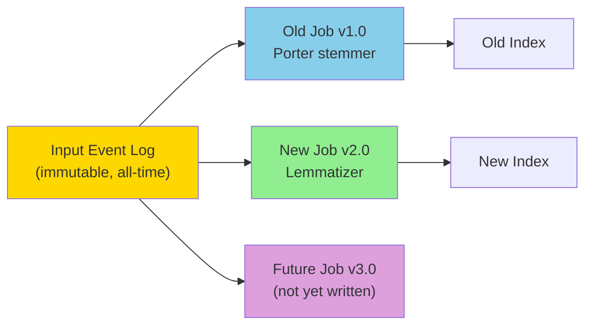

This is exactly the kind of evolution that would be impossible if the search index had been built directly from application writes. In that world, the application would have to be modified, redeployed, and the index rebuilt from a snapshot of the database. With the derived-data approach, the change is local to one transformation in the pipeline.

**Example: railway gauge migration.** In 19th-century England, different railway companies used different track gauges. When the government finally standardized on one gauge in 1846, every track had to be converted — but you cannot shut down a railway line for months while you rip up the rails. The engineers solved this by adding a third rail to make the track dual-gauge, then gradually switching all the rolling stock to the new gauge, then finally removing the obsolete rail. The transition took years and was entirely reversible at every stage.

Software systems can evolve the same way. Maintain both an old and a new schema side-by-side. Route 1% of users to the new view. If everything works, gradually increase to 10%, 50%, 100%. Every stage is reversible. The cost of failure is bounded.

### 2.3 Unifying Batch and Stream Processing

The two processing styles are so similar in principle that the practical recommendation is to run **a single stream processing system that is also capable of batch workloads** — this is the **kappa architecture** [Kreps, 2014]. Concretely:

- The same engine processes historical events (replay from the log) and live events (consume from the head of the log).
- The engine has **exactly-once semantics**, so failures do not produce duplicate outputs.
- The engine supports **windowing by event time**, not just processing time, so re-running over historical data produces correct results.

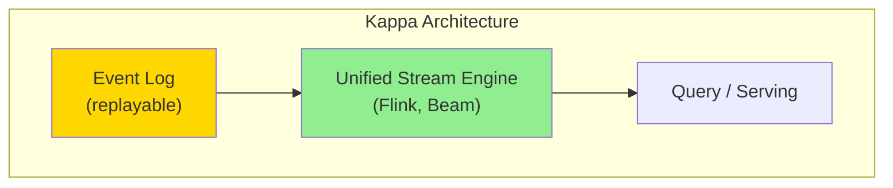

Three capabilities make this possible:

1. **Replayable logs.** Log-based message brokers like Kafka retain messages for days or weeks, and the same engine can re-read them as if they were fresh.
2. **Exactly-once.** Stream processors can guarantee that the output is the same as if no faults occurred, by discarding partial outputs of failed tasks and replaying the inputs.
3. **Event-time windows.** When you reprocess history, "now" is undefined. The engine must let you compute windowed aggregates based on the timestamps of the events themselves.

Systems like Apache Flink, Apache Beam (with runners), and Google Cloud Dataflow all meet these criteria, and they have largely displaced the older two-stack pattern (the lambda architecture, which ran a separate batch and stream system). For the mechanics of batch processing and the trade-offs with the stream variant, see Chapter 11.

---

## 3. Unbundling Databases

### 3.1 Composing Data Storage Technologies

Looking at the features that databases provide internally — secondary indexes, materialized views, replication logs, full-text search — we see a striking pattern. Each of those features is itself a derivation of the base data. An index is derived by sorting. A materialized view is derived by aggregation. A replication log is derived by tailing the write-ahead log.

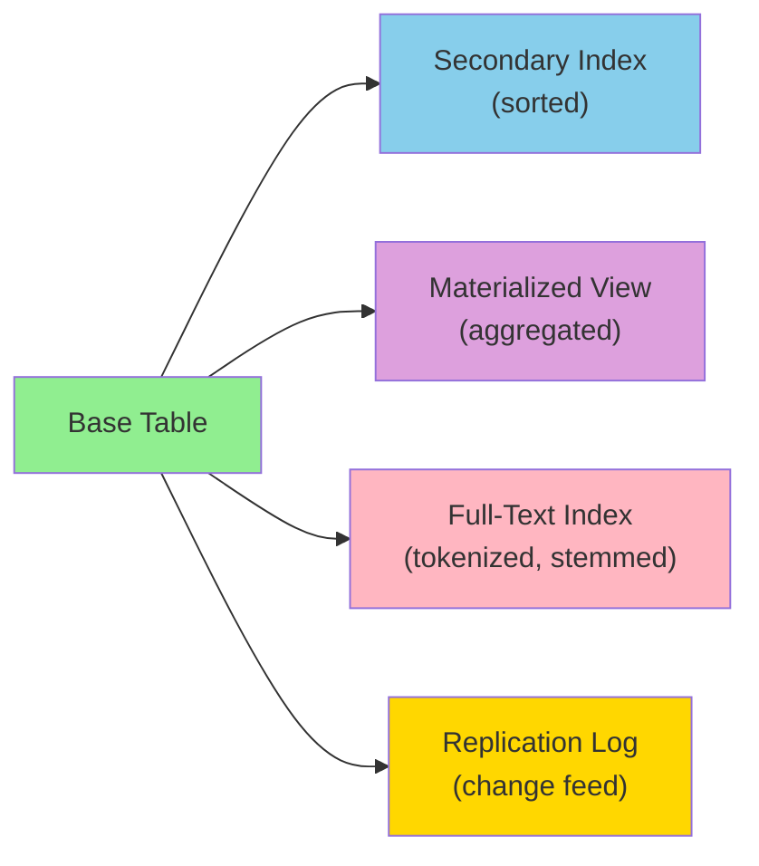

Now look at the dataflow systems we have been discussing. CDC tools capture the replication log and feed it into Kafka. Stream processors build secondary indexes. Batch jobs build materialized views. Specialized search tools build full-text indexes.

The resemblance is more than superficial. **A modern dataflow stack is a database, with its internal subsystems unbundled and exposed as standalone tools.** Every time you read from Kafka, transform with Flink, and write to Elasticsearch, you are doing exactly what a single integrated database does internally — but you have chosen each tool from a different vendor, and you can compose them with application code.

**Example: the meta-database.** Imagine the totality of an organization's data movement: every batch job, every ETL pipeline, every CDC stream. Viewed from above, this looks like one massive database. The OLTP systems are its tables. The CDC logs are its write-ahead logs. The batch jobs are its materialized view maintainers. The streaming pipelines are its trigger system. The search indices are its full-text indexes. The cache layers are its buffer pool.

This reframing is powerful. It tells us that the techniques for keeping a single database consistent (deterministic derivation, idempotent operations, total ordering where possible, asynchronous processing where not) are exactly the techniques that apply when we compose multiple databases.

### 3.2 Federated Databases (Unifying Reads)

There are two complementary approaches to composing data systems: **federation** (unify reads) and **unbundling** (unify writes).

A **federated database** (or **polystore**) presents a single query interface that spans multiple underlying storage engines. The user writes one query, and the system decides which engines to consult, how to translate between data models, and how to combine the results.

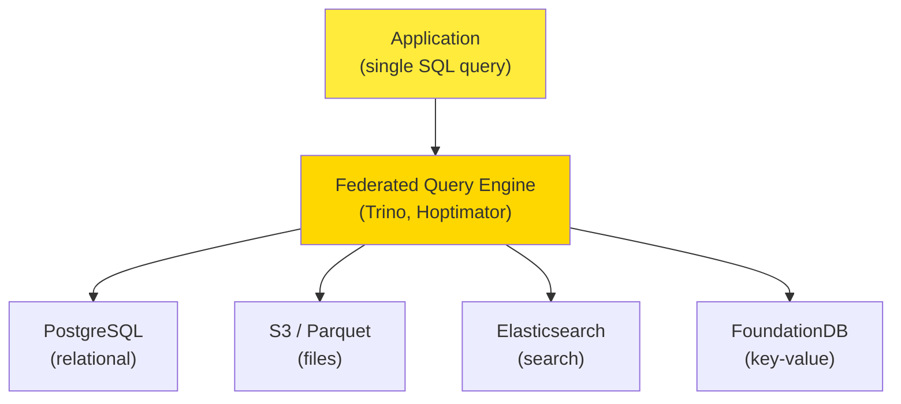

Federation follows the **relational** philosophy: one high-level declarative language, one elegant semantics, and a complicated implementation underneath. PostgreSQL's foreign data wrapper feature is a federated system in miniature. Production-scale federated engines include Trino (formerly PrestoSQL), Apache Calcite, Hoptimator, and Xorq.

The strengths of federation:

- The application only writes one query.
- The optimizer can push down predicates to the right engine.
- Specialized engines keep their native strengths (e.g., Elasticsearch still does relevance ranking).

The weaknesses of federation:

- It only handles reads. Cross-engine writes are not part of the abstraction.
- Performance is dominated by data movement between engines.
- Each engine has its own quirks, and the federation layer has to translate between them.

### 3.3 Unbundled Databases (Unifying Writes)

The **unbundled database** approach is the mirror image: we accept that the application will write to different engines directly, but we ensure that those writes are kept consistent by routing them through a shared event log.

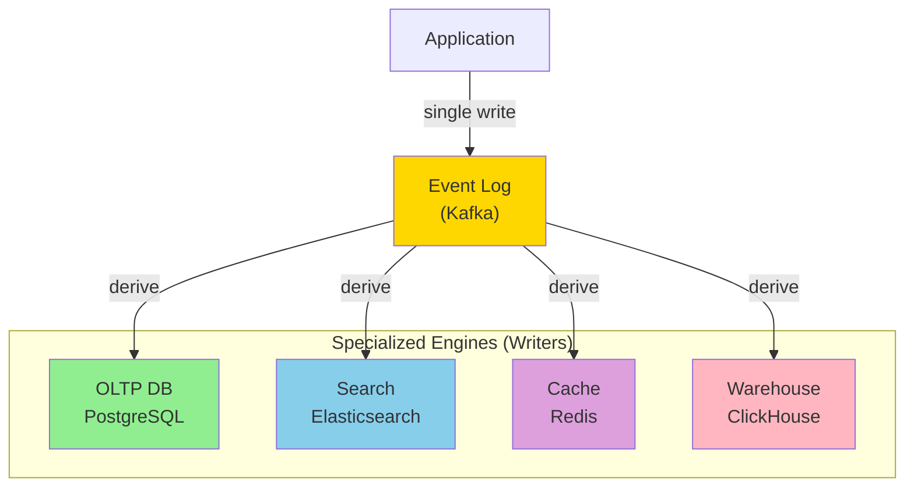

In this picture, the application writes to exactly one place (the log). The log is consumed by multiple specialized engines, each maintaining its own derived data. To "update the search index," the application writes a CDC event to the log; a separate consumer applies that event to Elasticsearch.

This is the **Unix philosophy** applied to data systems: small tools that do one thing well, communicating through a uniform low-level abstraction (the log), composable into larger systems by application code [Kleppmann and Kreps, 2015].

The two approaches are not in opposition. A mature data architecture typically uses **both**:

- Federation for cross-engine analytical queries.
- Unbundling for cross-engine transactional updates.

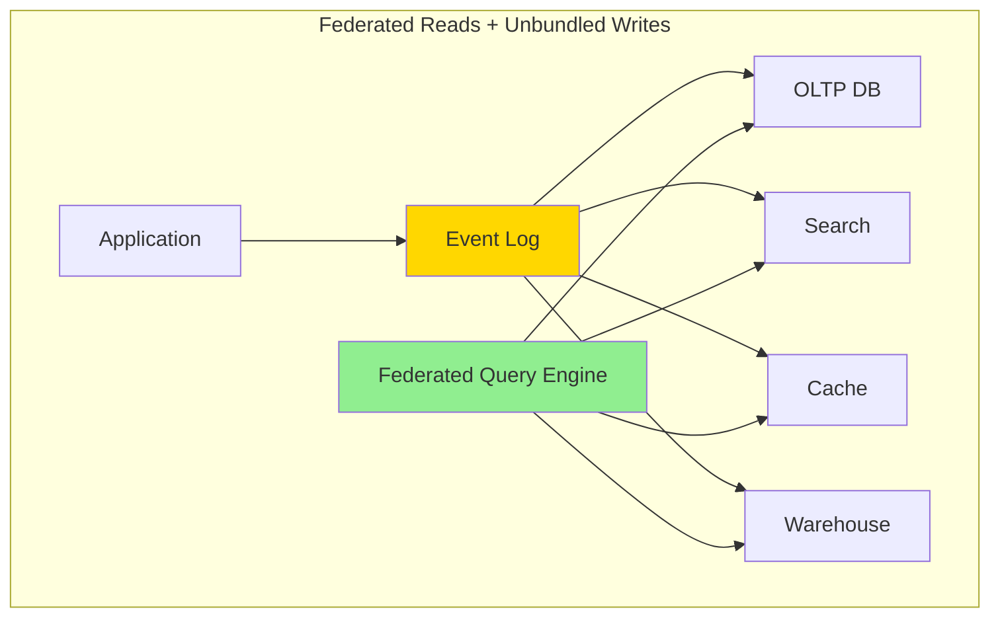

### 3.4 Making Unbundling Work

The hardest problem in unbundled systems is **synchronizing writes across heterogeneous engines**. Distributed transactions (XA, see Chapter 8) are the traditional answer, and they have well-known limitations:

- They require synchronous coordination across all participants.
- They are sensitive to failures: any participant failure aborts the whole transaction.
- They are poorly implemented in many engines, especially newer ones.
- They do not scale across geographic regions.

The log-based approach replaces distributed transactions with **idempotent consumers**. Each consumer:

1. Reads events from the log in order.
2. For each event, performs an idempotent operation on its local engine.
3. Tracks its offset in the log so it can resume after a crash.

The idempotency concept itself is introduced in Chapter 12; a self-contained example consumer is shown below.

```python
class IdempotentDerivedWriter:
    """Writes events to a derived engine in a way that is safe to retry.

    Idempotence is achieved by recording the set of processed event IDs
    and rejecting duplicates. This works across crashes and consumer restarts.
    """
    def __init__(self):
        self.processed = set()
        self.state = {}

    def handle(self, event_id, key, payload):
        if event_id in self.processed:
            return None        # duplicate; skip
        self.state[key] = payload
        self.processed.add(event_id)
        return {"key": key, "payload": payload}
```

The full demo (with `is_idempotent_after_replay` and a duplicate-delivery test) lives in `examples/ch13/idempotent_writer.py`.

The benefit is **loose coupling**: at the system level, asynchronous event streams make the system robust to outages or slow performance of individual consumers. If a consumer is down, the log buffers messages, and the producer and other consumers are unaffected. At the human level, unbundling lets different teams own different consumers, with well-defined interfaces (the log schema) between them.

### 3.5 Unbundled vs Integrated Systems

The right way to think about unbundling is **breadth, not depth**. A specialized database will almost always beat a custom-built system for its particular workload. The argument for unbundling is that no single database serves *all* your workloads, so by composing specialized tools you can serve a wider range of workloads than any single tool.

But if a single tool does everything you need, just use it. The complexity of running several pieces of infrastructure is real: each piece has a learning curve, configuration options, and operational quirks. Building for scale you don't need is premature optimization.

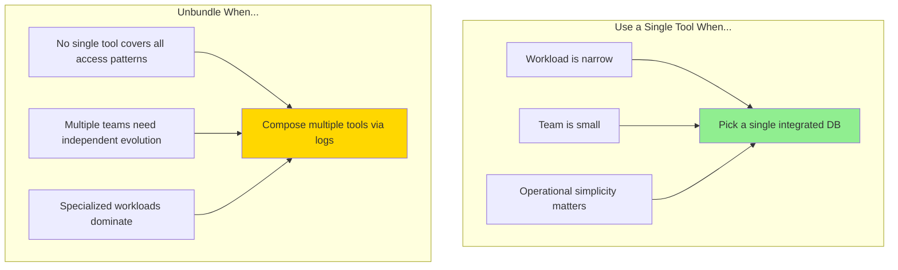

A few signs that unbundling is paying off:

- Your system has clearly distinct access patterns (transactional, analytical, search, recommendation).
- You have specialized tooling for each pattern that you trust.
- You can route writes through a single event log without too much pain.

A few signs that you are over-engineering:

- You are using five tools when two would do.
- Your team cannot operate any of them well.
- You are spending more time on the integration glue than on the application logic.

The trend of the last decade has been in favor of unbundling. Tools like Debezium (CDC), Kafka (event log), Apache Flink (stream processing), and Materialize or Apache Pinot (incremental view maintenance) make unbundling increasingly accessible. But it is a tool, not a religion. Use it where it helps.

---

## 4. Designing Applications Around Dataflow

### 4.1 Application Code as a Derivation Function

Every derived dataset is the output of a transformation. For some transformations, the database can do the work:

- A **secondary index** is built by `CREATE INDEX`.
- A **materialized view** is built by `CREATE MATERIALIZED VIEW`.
- A **full-text index** is built by specialized database functions.

For others, the transformation requires **application-specific code**:

- A **recommendation model** is built by an ML pipeline that does feature engineering, training, and serving.
- A **personalized UI cache** requires knowledge of what fields the UI displays.
- A **notification rule** is application logic that decides when a state change should generate a push notification.

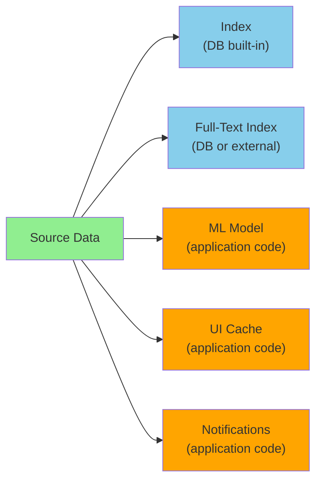

Relational databases do provide mechanisms for running application code (triggers, stored procedures, user-defined functions), but they have never been first-class citizens in database design. The deployment story is weak: there is no good story for dependency management, version control, rolling upgrades, monitoring, or integration with external systems for database-resident code.

Modern deployment tooling (Kubernetes, Docker, Mesos, YARN) is designed exactly for running application code. It does that one thing well. The right architecture is therefore: keep the database focused on storage, and run transformation code as ordinary services in a deployment system.

### 4.2 Separation of Application Code and State

Most web applications today follow a clean separation:

- **Stateless application services** that can be deployed and scaled freely.
- **Stateful databases** that persist everything.

The application is "stateless" in the sense that any request can be routed to any instance, and the instance forgets everything after sending the response. The state lives in the database. This pattern is convenient because stateless services are easy to scale, but it has a hidden cost: **the database becomes a mutable shared variable that can only be read by polling**.

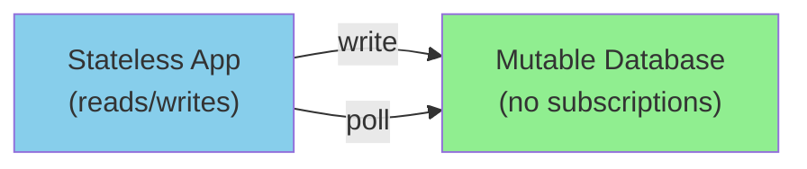

In a spreadsheet, by contrast, you can put a formula in one cell that references other cells, and when the referenced cells change, the formula automatically updates. The spreadsheet has **push-based updates**: the cell is a subscriber to its dependencies.

In most databases, you cannot subscribe to changes. To find out whether data has changed, you poll. Some databases are starting to add change subscriptions (PostgreSQL's `LISTEN`/`NOTIFY`, Debezium's CDC streams, DynamoDB Streams), but it is not yet a universal feature.

The deeper shift is to recognize that the application itself should be modeled as a **stream of state changes**, not as a series of point reads and writes. The database emits a stream of events; the application subscribes to that stream and emits its own stream in response. This is the dataflow model.

> "We believe in the separation of Church and state."
> — Rich Hickey and friends, on keeping application logic out of the database

The joke here is that Alonzo Church invented the lambda calculus, the foundation of functional programming, which has no mutable state. The phrase is a wry acknowledgment that the application should be functional (pure functions over inputs) and the state should live in a different place (the database).

### 4.3 Dataflow: Interplay Between State Changes and Application Code

Once we treat the application as a dataflow, we can describe it cleanly:

- **State changes** are represented as events in a log.
- **Application code** is a set of stream operators that consume one stream and produce another.
- **Derived systems** are the materialized outputs of these operators.

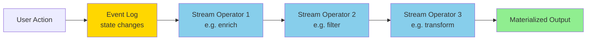

Two properties are essential:

1. **Stable ordering.** When multiple views are derived from the same event log, they must process events in the same order, or they will diverge.
2. **Fault tolerance.** Losing a single message means the derived data goes permanently out of sync with its source. Both delivery and processing must be reliable.

Modern stream processors provide these properties at scale. The application code itself becomes a stream operator, embedded in the dataflow.

### 4.4 Stream Processors and Services

The dominant style of application development today is **service-oriented architecture**: a collection of services that talk to each other over REST APIs. The advantage is organizational: different teams can work on different services with loose coupling.

Stream-based dataflow shares many of the same advantages, but with different semantics. Communication is **asynchronous and one-directional** (a stream of events), not synchronous and request/response.

**Example: currency conversion.** A customer makes a purchase priced in EUR but paid in USD. To convert, the system needs the current EUR/USD exchange rate.

- **Microservices approach**: the purchase handler makes a synchronous HTTP call to a currency service that returns the current rate.
- **Dataflow approach**: the purchase handler subscribes to a stream of exchange-rate updates. It maintains a local table of current rates. When it processes a purchase, it reads the rate from its local table, with no network call.

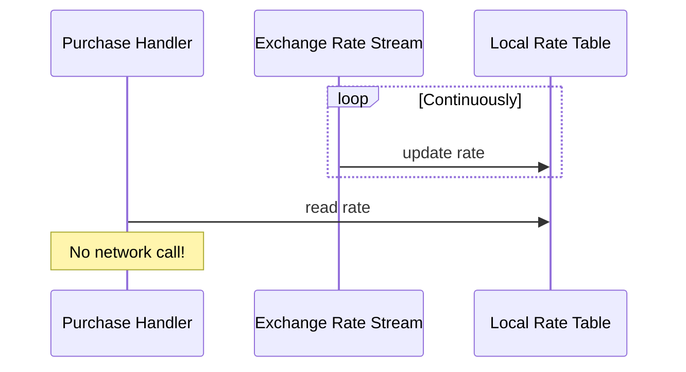

The dataflow approach is faster (no network round-trip), more robust (the rate service can go down without affecting purchases), and naturally handles failures (the rate is just a fact in local state). The only complication is **time-dependent joins**: if you reprocess a historical purchase, the exchange rate that should apply is the rate at the time of the original purchase, not the current rate. To support reprocessing, you need to retain historical rates, not just the latest one.

This is one of many places where stream processing and dataflow thinking pay off. It also illustrates why dataflow is sometimes faster than RPC: **the fastest network call is no network call**.

---

## 5. Observing Derived State

### 5.1 The Write Path and the Read Path

Every derived data system has two sides:

- The **write path** is what happens when data is created or updated. The system processes the event, applies transformations, and updates the derived data.
- The **read path** is what happens when someone queries the system. The system uses the derived data to construct a response.

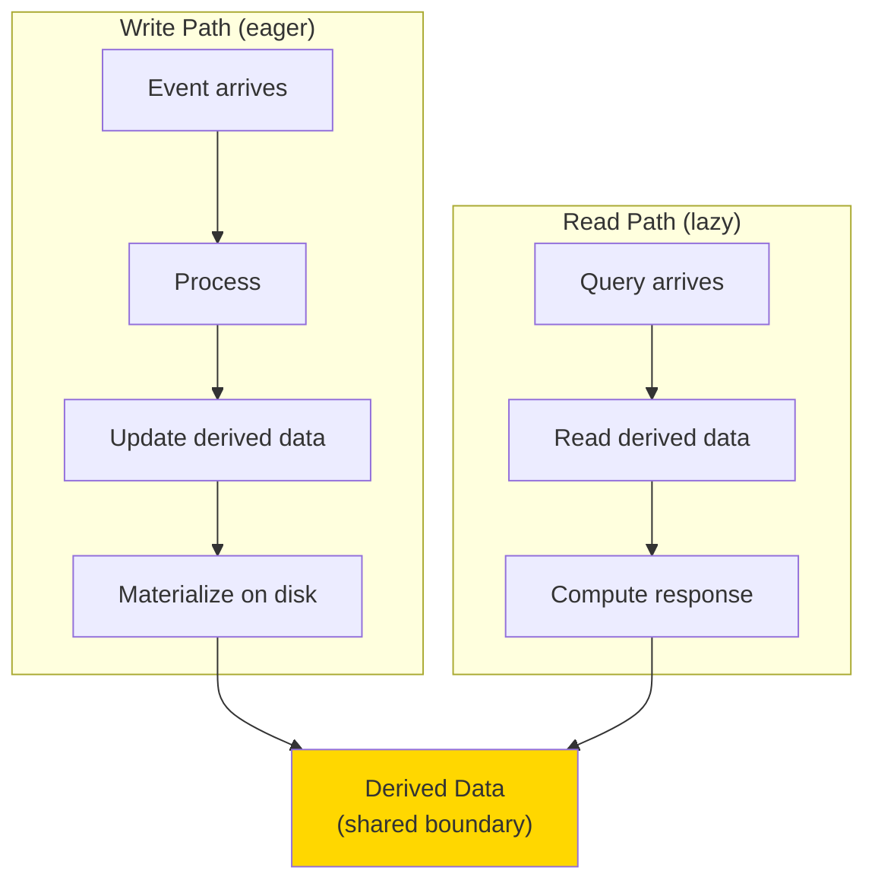

The derived data itself is the boundary between the write path and the read path. The choice of where to draw this boundary is one of the most consequential design decisions in a data system.

**Example: search index.** When a document is added:

- The write path extracts terms, applies stemming, removes stop words, and adds entries to the index.
- The read path takes a query, looks up each term, intersects the result sets, ranks them, and returns the top hits.

The work split is determined by the index. Without an index, the read path would have to scan every document (grep-style), but the write path would have nothing to do. With a precomputed result for every possible query, the read path would just look up the answer, but the write path would be impossibly expensive (there are exponentially many possible queries).

In general, **you trade write-path work for read-path work**: the more you precompute on the write side, the less you compute on the read side.

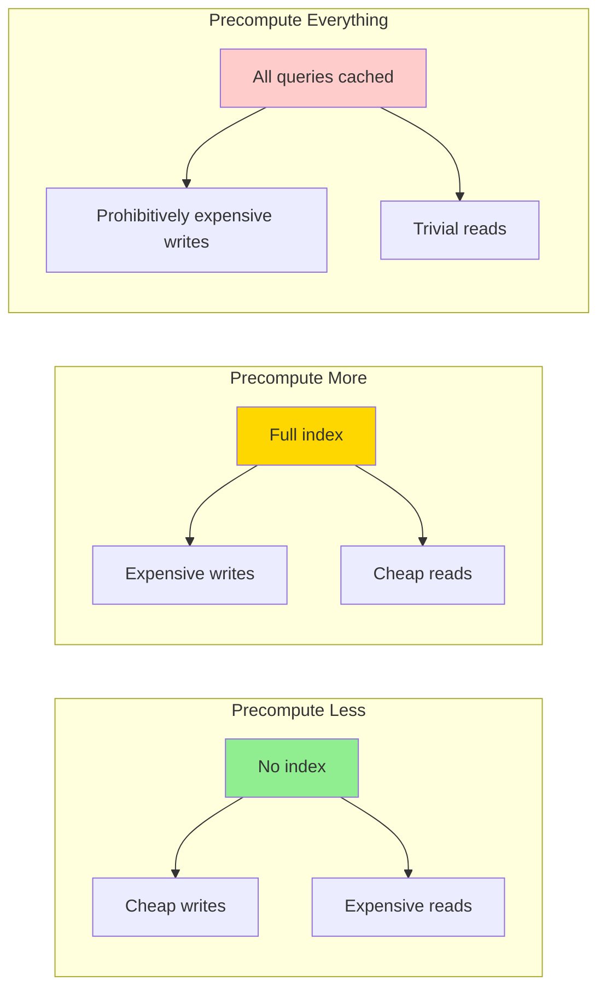

The famous Twitter example from Chapter 2 illustrates this trade-off in practice. For ordinary users, the home timeline is precomputed at write time (a fan-out-on-write approach). For celebrities with millions of followers, the home timeline is computed at read time (a fan-out-on-read approach), because the cost of precomputing for millions of users is prohibitive. The same data structure, same query, but a different placement of the write/read boundary, depending on the user.

### 5.2 Materialized Views and Caching

A **materialized view** is the database's name for a precomputed query result. A **cache** is the application's name for a precomputed query result. They are the same thing: derived data that is updated eagerly on writes, queried on reads.

```mermaid
graph TB
    BASE["Base Tables"]
    VIEW1["Materialized View<br/>(aggregated)"]
    VIEW2["Materialized View<br/>(joined)"]
    CACHE1["App Cache<br/>(per-user)"]
    CACHE2["App Cache<br/>(per-query)"]

    BASE --> VIEW1
    BASE --> VIEW2
    BASE --> CACHE1
    BASE --> CACHE2

    style BASE fill:#90EE90
    style VIEW1 fill:#FFD700
    style VIEW2 fill:#FFD700
    style CACHE1 fill:#87CEEB
    style CACHE2 fill:#87CEEB
```

In all cases, the maintenance story is the same: when the base data changes, the derived data must be updated. The harder the query, the more benefit you get from materialization (because you save the expensive read-time work) and the more pain you suffer from maintenance (because the write-path work grows). Materialized views are introduced in Chapter 11.

Modern incremental view maintenance engines (e.g., Materialize, Noria, Apache Pinot's upsert tables, Apache Calcite's IVM algorithms) keep materialized views in sync as the base data changes, without recomputing everything from scratch.

### 5.3 Stateful, Offline-Capable Clients

The write/read boundary does not have to live inside one datacenter. It can extend all the way to the **end-user device**.

Modern web and mobile applications are increasingly stateful. A single-page JavaScript app maintains UI state in memory and persistent state in `localStorage` or IndexedDB. A mobile app does the same. Both can work offline: edits made while disconnected are queued and synced when the connection returns.

```mermaid
graph LR
    SERVER["Server<br/>(canonical state)"]
    LOG["CDC Event Log"]
    subgraph "Client Devices"
        MOB["Mobile App<br/>(state + queue)"]
        WEB["Web App<br/>(state + queue)"]
    end

    SERVER --> LOG
    LOG -.->|"push updates"| MOB
    LOG -.->|"push updates"| WEB
    MOB -.->|"queue edits when offline"| LOG
    WEB -.->|"queue edits when offline"| LOG

    style SERVER fill:#90EE90
    style LOG fill:#FFD700
    style MOB fill:#87CEEB
    style WEB fill:#87CEEB
```

From the server's perspective, a client is just another consumer of the event log. It has an offset (the last event it has acknowledged), and the server can resume sending events from that offset when the client reconnects. This is the same pattern as a Kafka consumer group, scaled down to a single user.

This is the basis of **local-first software**, a design philosophy where the user's data lives primarily on the user's device, with the server providing backup, sync, and collaboration.

### 5.4 Pushing State Changes to Clients

The HTTP request/response model assumes the client pulls. A browser loads a page, sees the current state, and that state is stale the moment anything changes. RSS feeds are a poor man's workaround: they are still polling.

Modern protocols break out of this:

- **Server-Sent Events (EventSource)** allow a long-lived HTTP connection over which the server pushes events.
- **WebSockets** allow a full bidirectional channel between client and server.
- **WebRTC** allows direct peer-to-peer channels.

```mermaid
sequenceDiagram
    participant C as Client (Mobile/Web)
    participant S as Server

    Note over C,S: HTTP (old): pull only
    C->>S: GET /state
    S-->>C: response
    Note over C,S: time passes...
    Note over C: state is now stale!

    Note over C,S: SSE / WebSocket (new): push
    C->>C: open connection
    loop While connected
        S->>C: event 1
        S->>C: event 2
    end
```

In the dataflow model, **the write path extends all the way to the end user**. The client first pulls its initial state (read path), then subscribes to a stream of changes (write path pushed out). The client-side UI library (React, Elm, SwiftUI) updates the rendered view in response to incoming events, much as a spreadsheet updates a cell when its inputs change.

This produces UIs that are more responsive (no polling delay, no manual refresh) and more robust offline (the queue can absorb changes and replay them when reconnected). The challenge is that the request/response model is so deeply ingrained in our databases, libraries, and frameworks that this shift requires rethinking many layers.

### 5.5 Reads Are Events Too

We have described a system where writes are events but reads are transient. A more radical view is to model **both writes and reads as events**, both flowing through the same stream processing pipeline.

When a read request is treated as an event, the processor can decide how to route it: to a single shard if the data is local, to multiple shards if the query spans the cluster, to a cached result if it is in the materialized view. The response is emitted on an output stream that the client subscribes to.

```mermaid
graph LR
    REQ["Read Request<br/>(as event)"]
    WRITE["Write Event"]
    PROC["Stream Processor"]
    SHARD1["Shard 1"]
    SHARD2["Shard 2"]
    RESP["Response Stream"]

    REQ --> PROC
    WRITE --> PROC
    PROC --> SHARD1
    PROC --> SHARD2
    SHARD1 --> RESP
    SHARD2 --> RESP

    style REQ fill:#FFD700
    style WRITE fill:#90EE90
    style PROC fill:#87CEEB
    style RESP fill:#FFB6C1
```

This framing reveals something fundamental: **serving a query is just a stream-table join**. The read request joins with the current state of the data, producing a response. A one-off read passes through the join and is forgotten; a subscribe is a long-running join with the future state of the data.

**Example: distributed RPC in Storm.** Twitter's Storm system supported a "distributed RPC" mode in which queries were treated as streams and routed to the appropriate shards for execution. The classic example was computing the reach of a URL: "how many distinct users have seen this URL?" This requires combining the follower sets of everyone who posted the URL, which is sharded by user.

**Example: fraud detection.** A purchase comes in. To assess fraud risk, the system needs the reputation scores for the IP address, email address, billing address, and shipping address. Each of these is sharded differently. Routing the query through a stream processor lets the system perform all the joins correctly, in parallel, with the same infrastructure it uses for analytics.

Treating reads as events also enables **better provenance tracking**. If you log every read request that affects a decision, you can reconstruct what the user saw before they made a choice. In an e-commerce context, this could reveal that the predicted shipping date shown to the user materially affected whether they bought the item.

---

## 6. Aiming for Correctness

### 6.1 The End-to-End Argument for Databases

Just because an application uses a database with strong transaction guarantees does not mean the application is correct. Two examples make the point:

1. **A bug in application code** can write garbage to the database. The transactions commit successfully, but the data is wrong.
2. **A duplicate request** (e.g., a user double-clicking "Submit") can cause a non-idempotent operation to run twice. The transactions commit successfully, but the effect is doubled.

The second case is the easier one to analyze. Suppose the operation is "transfer $11 from account A to account B." The transaction looks safe:

```sql
BEGIN;
UPDATE accounts SET balance = balance + 11 WHERE id = B;
UPDATE accounts SET balance = balance - 11 WHERE id = A;
COMMIT;
```

If the user double-submits and the server runs this transaction twice, $22 is transferred. The bug is not in the database; it is in the application code that does not deduplicate.

The fix is an **end-to-end request identifier**: a UUID assigned by the client, attached to the request, propagated all the way to the database, where a uniqueness constraint on the request ID ensures that the operation runs exactly once:

```sql
ALTER TABLE requests ADD UNIQUE (request_id);

BEGIN;
INSERT INTO requests (request_id, from_account, to_account, amount)
VALUES ('0286FDB8-D7E1-423F-B40B-792B3608036C', A, B, 11.00);
UPDATE accounts SET balance = balance + 11 WHERE id = B;
UPDATE accounts SET balance = balance - 11 WHERE id = A;
COMMIT;
```

If the same request ID arrives twice, the second `INSERT` fails on the uniqueness constraint, and the transaction aborts. No double-spend.

### 6.2 The End-to-End Argument

This pattern is an instance of a more general principle, **the end-to-end argument** [Saltzer, Reed, and Clark, 1984]:

> "The function in question can completely and correctly be implemented only with the knowledge and help of the application standing at the endpoints of the communication system. Therefore, providing that questioned function as a feature of the communication system itself is not possible. Sometimes an incomplete version of the function provided by the communication system may be useful as a performance enhancement."

Examples:

- **TCP suppresses duplicate packets**, but it cannot prevent an application from submitting the same logical request twice. Duplicate suppression must be done at the application layer.
- **TLS encrypts data in transit**, but it cannot prevent a malicious server from reading the data after decryption. End-to-end encryption is required for true confidentiality.
- **Ethernet checksums detect packet corruption**, but they cannot detect corruption at the endpoints or on disk. End-to-end checksums are required to detect all corruption.

In data systems, the same logic applies. A database with serializable transactions does not, by itself, prevent duplicate logical requests from being processed twice. A stream processor with exactly-once semantics does not, by itself, prevent a user from double-clicking. The application must add end-to-end deduplication, with request IDs that travel through every layer. Integrity checks at every intermediate layer — Ethernet checksums, disk checksums, database transactions, exactly-once stream pipelines — are individually useful but each is incomplete: only an end-to-end check, applied to the data flowing through the entire pipeline, can catch corruption or duplication that escapes any single layer.

### 6.3 Enforcing Constraints Across Systems

Constraints like uniqueness (a username is unique, an email is unique, two people cannot book the same seat) are usually enforced inside a single database. What happens when the constraint spans multiple systems?

A stream-based uniqueness check on a username claim:

```python
def shard_for(username, num_shards=16):
    """Route by hash of username so all claims for the same name hit one shard."""
    h = int(hashlib.sha256(username.encode()).hexdigest(), 16)
    return h % num_shards

class UsernameShardProcessor:
    """One shard's worth of username state.

    All requests for usernames hashing to the same shard land here,
    so they are processed sequentially. This guarantees a deterministic
    decision on which request wins.
    """
    def __init__(self):
        self.taken = {}     # username -> user_id of winner
        self.processed = set()

    def handle(self, request_id, user_id, username):
        if request_id in self.processed:
            owner = self.taken.get(username)
            return {"accepted": owner == user_id, "reason": "duplicate request"}
        self.processed.add(request_id)
        owner = self.taken.get(username)
        if owner is None or owner == user_id:
            self.taken[username] = user_id
            return {"accepted": True}
        return {"accepted": False, "reason": f"already taken by {owner}"}
```

The full multi-shard driver, with routing and a worked example showing two users racing for the same username, lives in `examples/ch13/username_uniqueness.py`.

The key insight is **routing all conflicting requests to the same shard**, then processing them sequentially on a single thread. Within one shard, the order is total, so the constraint is unambiguous. Across shards, the constraint does not apply, so the shards can be processed in parallel.

This generalizes beyond uniqueness. Any constraint whose conflicting events can be identified (e.g., updates to the same row, attempts to book the same seat) can be enforced by sharding on the conflict key. The stream processor on each shard applies the constraint sequentially. Cross-shard constraints (e.g., a transfer of money involves a payer account, a payee account, and a fees account) are more subtle.

### 6.4 Multi-Shard Request Processing

A payment that involves three shards (payer, payee, fees) is hard for a traditional distributed transaction, because every participant must agree on the order of commits. With derived data and event logs, we can decompose the transaction into per-shard events linked by a request ID:

```mermaid
graph TB
    REQ["Payment Request<br/>request_id=X, amount=$11"]
    SRC["Source Account Shard"]
    DST["Destination Account Shard"]
    FEE["Fees Account Shard"]

    REQ -->|"1. reserve"| SRC
    SRC -->|"2. outgoing payment<br/>request_id=X"| SRC
    SRC -->|"3. incoming payment<br/>request_id=X"| DST
    SRC -->|"3. incoming payment<br/>request_id=X"| FEE
    SRC -->|"4. execute reserve"| SRC

    style REQ fill:#FFD700
    style SRC fill:#90EE90
    style DST fill:#87CEEB
    style FEE fill:#FFB6C1
```

The flow:

1. The client sends the payment request to the source account's shard, including a unique `request_id`.
2. The source-account processor reads the request from its log, checks that the account has sufficient balance, and reserves the funds. It emits three events, each tagged with the same `request_id`:
   - An outgoing-payment event back to the source shard (so the reservation can be executed once the downstream events have been processed).
   - An incoming-payment event to the destination shard.
   - An incoming-payment event to the fees shard.
3. Each downstream shard processes its incoming-payment event, applying it to the local account and recording the `request_id` as seen.
4. When the outgoing-payment event comes back to the source shard, the processor recognizes the `request_id`, executes the reservation, and the transfer is complete.

Atomicity comes from the fact that writing the initial request event to the source shard log is atomic. Once that one event is in the log, all the downstream events will eventually be processed. They may be duplicated, but each downstream processor deduplicates by `request_id`. They may be out of order, but each downstream processor is deterministic and stateful, so it converges to the right answer.

A minimal per-shard reducer for one account:

```python
def apply(state, event):
    """Process one AccountEvent against local state, returning new state."""
    if event.request_id in state.seen_request_ids:
        return state                                  # duplicate; skip
    state.seen_request_ids.add(event.request_id)
    if event.type == "RESERVE" and state.balance >= event.amount:
        state.reservations[event.request_id] = event.amount
        state.balance -= event.amount
    elif event.type == "INCOMING":
        state.balance += event.amount
    elif event.type == "EXECUTE":
        state.reservations.pop(event.request_id, None)
    return state
```

The full walkthrough, with a three-shard demo that traces the events from `r-001` through reserve, two incoming payments, and execute, lives in `examples/ch13/multi_shard_payment.py`.

This pattern works **without an atomic commit protocol**. The cost is that the application is more complex: you must reason about partial states during processing, design for idempotency, and accept that the system is eventually consistent. The benefit is that you can scale across shards, regions, and even organizations without paying the cost of synchronous cross-shard coordination.

### 6.5 Timeliness and Integrity

We have been treating "consistency" as a single concept, but it is really two:

- **Timeliness**: users observe the system in an up-to-date state. If a user reads, they see recent writes.
- **Integrity**: no data loss, no contradictory data, no corruption. The data is correct, even if not necessarily fresh.

```mermaid
graph TB
    CONS["Consistency"]
    CONS --> TIME["Timeliness<br/>('is it fresh?')"]
    CONS --> INT["Integrity<br/>('is it correct?')"]

    style TIME fill:#87CEEB
    style INT fill:#90EE90
```

These two properties are independent. A system can have strong timeliness but weak integrity (e.g., a replicated cache that propagates writes fast but has no schema enforcement). A system can have strong integrity but weak timeliness (e.g., a batch-derived warehouse that is updated nightly but contains validated, reconciled data).

Violations of timeliness are **temporary**: if a user reads stale data, they can wait and try again, and eventually the staleness will resolve itself. This is the entire premise of eventual consistency.

Violations of integrity are **permanent**: if data is corrupted, waiting does not fix it. Explicit repair is needed. ACID transactions are valuable precisely because they protect integrity (atomicity, durability) at the cost of timeliness (synchronous coordination).

The slogan form is:

> Violations of timeliness are allowed under eventual consistency. Violations of integrity result in perpetual inconsistency.

In most applications, integrity matters more than timeliness. A credit card statement can lag by a day or two with no harm done, but if the balance is wrong, the customer has a serious problem. Stream-based dataflow systems make this trade-off explicit: by default they preserve integrity (every event is processed exactly once) without timeliness (consumers are asynchronous). To get timeliness, you have to ask for it explicitly, by making a client wait for an event on an output stream before returning.

---

## 7. Trust, but Verify

### 7.1 Maintaining Integrity in the Face of Software Bugs

All of our discussion so far has assumed that certain things can fail (processes crash, network partitions occur) but other things will not (disks don't silently corrupt data, software has no bugs). These assumptions are encoded in the **system model**.

In reality, faults are not binary. Disks rarely corrupt data, but they do on occasion. Software usually works correctly, but not always. The question is whether rare events are rare enough to ignore. At large enough scale, rare events are routine.

Examples of rare-but-real integrity violations:

- MySQL has historically had bugs that allowed duplicates in unique secondary indexes.
- PostgreSQL's serializable isolation has exhibited write-skew anomalies in past versions.
- CPUs occasionally produce wrong results from arithmetic operations due to hardware faults.

Application code, which receives far less scrutiny than database internals, has even more bugs. Many applications do not even correctly use the integrity features their database provides: foreign-key constraints, unique constraints, transaction boundaries. An empirical study [Bailis et al., 2014] found widespread misuse of database isolation levels in production code.

### 7.2 Designing for Auditability

If we cannot assume that every component is bug-free, we need to be able to **detect** when something has gone wrong, so we can fix it and figure out the root cause.

**Auditing** is the process of checking the integrity of data. It applies not just to financial systems (where auditing is a regulatory requirement) but to any system whose data is too valuable to leave uncorroborated.

```mermaid
graph TB
    PROD["Production System"]
    AUDIT["Audit Process"]
    ALERT["Alert / Report"]

    PROD -->|"read state"| AUDIT
    AUDIT -->|"verify invariants"| AUDIT
    AUDIT -->|"if mismatch"| ALERT

    style PROD fill:#90EE90
    style AUDIT fill:#FFD700
    style ALERT fill:#ffcccc
```

Event-based systems have a natural advantage here. Every state change is represented as an immutable event in a log. The log is the audit trail. Any derived state can be reproduced by replaying the log through the derivation code. If the reproduced state matches the actual state, the system is consistent. If they differ, corruption has occurred.

This is much harder in systems that mutate state in place. If a row in a database is updated, the previous value is gone (or hidden in a write-ahead log that is rotated and discarded). You cannot easily ask "what did this row look like six months ago?" Event-sourced systems preserve that history by design.

A complete audit story has several layers:

1. **Hash chain over the event log.** Each event includes the hash of the previous event, so any tampering with the log is detectable.
2. **Reprocessing of derived state.** Periodically rerun derivation code from the log and compare to the live state.
3. **Cross-checks between derived systems.** If two derived systems are supposed to reflect the same data, sample-check that they agree.

A minimal hash-chained audit log:

```python
import hashlib, json, time
from dataclasses import dataclass, field

@dataclass
class AuditEvent:
    offset: int
    payload: dict
    timestamp: float = field(default_factory=time.time)
    prev_hash: str | None = None
    event_hash: str | None = None

    def finalize(self):
        body = json.dumps({
            "offset": self.offset,
            "payload": self.payload,
            "timestamp": self.timestamp,
            "prev_hash": self.prev_hash,
        }, sort_keys=True).encode()
        self.event_hash = hashlib.sha256(body).hexdigest()
```

The full implementation, with the `AuditLog.append()` / `verify()` methods and a tampering-detection demo, lives in `examples/ch13/audit_log.py`.

### 7.3 Self-Auditing Systems

Large-scale storage systems already do this kind of continuous auditing. HDFS runs background processes that read files, compare them across replicas, and migrate data from disks that look flaky. Amazon S3 similarly audits its own data.

This **trust-but-verify** philosophy is rare in mainstream databases. Most databases trust the disk, trust the memory, trust the operating system, and trust themselves. If corruption occurs, you find out only when a query returns garbage or a checksum fails on read.

The trend in the industry is toward more self-validating systems. Cryptographic tools borrowed from blockchains — **Merkle trees**, hash-linked logs, signed transactions — can verify the integrity of stored data with strong guarantees. **Certificate Transparency** uses these techniques to verify the global log of TLS certificates; the same ideas could verify a database log.

```mermaid
graph LR
    subgraph "Self-Auditing Stack"
        LOG2["Hash-Chained Log"]
        MT["Merkle Tree"]
        SIG["Cryptographic Signatures"]
        VERIFY["Continuous Verifier"]
    end

    LOG2 --> MT
    MT --> SIG
    SIG --> VERIFY

    style LOG2 fill:#FFD700
    style MT fill:#90EE90
    style SIG fill:#87CEEB
    style VERIFY fill:#FFB6C1
```

The cost of these techniques is non-trivial: cryptographic operations are CPU-expensive, and Merkle proofs add bytes to every operation. But for systems whose data is hard to replace (financial records, medical records, government records), the cost is worth it.

---

## 8. Summary

This chapter has been philosophical rather than algorithmic. We have looked at how to compose specialized tools into a coherent system, how to keep that system correct in the face of faults, and how to verify that it remains correct over time. The three pillars — data integration, correctness, and verifiability — all rest on the same substrate: an immutable, append-only event log from which everything else is derived.

```mermaid
graph TB
    subgraph "The Three Pillars"
        P1["Data Integration<br/>via derived data"]
        P2["Correctness<br/>via end-to-end IDs"]
        P3["Verifiability<br/>via audits"]
    end

    P1 --> SYSTEM["Coherent Data System"]
    P2 --> SYSTEM
    P3 --> SYSTEM

    style P1 fill:#90EE90
    style P2 fill:#87CEEB
    style P3 fill:#FFD700
    style SYSTEM fill:#FFB6C1
```

### Key Takeaways

1. **No single tool does everything.** Compose specialized tools, but make the composition principled.
2. **The event log is the central abstraction.** It is the substrate for derived data, the channel for cross-system consistency, and the audit trail for verifiability.
3. **Derived data is asynchronous.** By default, derived systems are eventually consistent. If you need stronger guarantees, add them explicitly (synchronous writes for hot paths, end-to-end request IDs for cross-system operations).
4. **Uniqueness and similar constraints require consensus.** Shard by the conflict key, and process each shard sequentially. This generalizes the single-DB unique constraint to a stream-based system.
5. **End-to-end arguments apply.** Low-level guarantees (TCP duplicate suppression, DB transactions, exactly-once stream processing) are useful but not sufficient. Application-level deduplication, with request IDs that travel through every layer, is what actually prevents double-processing.
6. **Decouple timeliness from integrity.** Integrity (no corruption) matters more than timeliness (no staleness). Event-based systems preserve integrity by default; add timeliness only where needed.
7. **Audit continuously.** Don't trust your own infrastructure blindly. Use hash-chained logs, Merkle trees, and periodic reprocessing to detect corruption.

### What We Did Not Cover

- **Detailed performance tuning** of stream processors and CDC pipelines.
- **Specific tool recommendations** (Debezium, Kafka, Flink, Materialize, etc.) beyond illustrative mentions.
- **Schema management** for evolving event-log formats across an organization.
- **Multi-region and cross-cloud** event replication, which raises its own consistency questions.
- **Operational concerns** like log retention, compaction, partition rebalancing, and exactly-once transactional output.

These are real engineering problems, but they are downstream of the philosophy described here. Once you have decided to treat the event log as the substrate of your system, the rest is implementation.

### Further Reading

- Jay Kreps, "The Log: What Every Software Engineer Should Know About Real-Time Data's Unifying Abstraction" (2013).
- Martin Kleppmann and Jay Kreps, "Kafka, Samza and the Unix Philosophy of Distributed Data" (2015).
- Pat Helland, "Life Beyond Distributed Transactions: An Apostate's Opinion" (CIDR 2007).
- Pat Helland and Dave Campbell, "Building on Quicksand" (CIDR 2009).
- Martin Kleppmann, "Turning the Database Inside-out with Apache Samza" (Strange Loop, 2014).
- Martin Kleppmann, Alastair R. Beresford, and Boerge Svingen, "Online Event Processing: Achieving Consistency Where Distributed Transactions Have Failed" (CACM, 2019).
- Jerome H. Saltzer, David P. Reed, and David D. Clark, "End-to-End Arguments in System Design" (1984).
- Peter Bailis et al., "Coordination Avoidance in Database Systems" (VLDB 2014).
- Kyle Kingsbury, "Jepsen" (jepsen.io).
- Nathan Marz and James Warren, *Big Data* (Manning, 2015) — the lambda architecture.
- Jay Kreps, "Questioning the Lambda Architecture" (2014).
- Adam Bellemare, *Building Event-Driven Microservices*, 2nd ed. (O'Reilly, 2025).
- Charity Majors, "The Accidental DBA" (2016) — on the pervasiveness of silent data corruption.
