# Chapter 14: Doing the Right Thing

## TL;DR

- Data systems make decisions with material effects on people's lives; engineers carry a moral responsibility alongside their technical one.
- Predictive analytics extrapolate from a biased past; algorithms scale and obscure that bias, demanding audit, recourse, and explainability, not just accuracy.
- Surveillance infrastructure has transferred privacy decisions from individuals to companies, often without meaningful consent.
- The GDPR establishes a floor, but regulation alone is insufficient — culture, self-regulation, and minimal data collection matter.
- Minimize what you collect, scope what you store to a stated purpose, and expire it on a known schedule.

---

This final chapter steps back from the technical details of data systems and asks a different kind of question: **just because we *can* build something, should we?** The book argues that engineers of data-intensive applications carry a moral responsibility, because the systems we design make decisions that profoundly affect people's lives, often invisibly and with little recourse.

> "Just as we look back today at the early decades of the industrial age and wonder how our ancestors could have ignored pollution in their rush to build an industrial world, our grandchildren will look back at us during these early decades of the information age and judge us on how we addressed the challenge of data collection and misuse." — Bruce Schneier (cited again in *Remembering the Industrial Revolution*)

Unlike the rest of the book, the concepts here are not fixed or determinate; they require interpretation, which may be subjective. Ethics is not a checklist — it is a participatory and iterative process of reflection, in dialog with the people involved, with accountability for the results.

---

## Why Ethics Matters for Engineers

Engineers are accustomed to thinking about correctness, performance, and reliability. Ethics feels like a different discipline entirely. But the systems we build have direct, material consequences for individuals: they decide who gets a loan, who is invited for a job interview, who gets insurance, who is flagged for extra scrutiny by police, and whose voice is amplified or suppressed in public discourse. These are not abstract harms.

**Example: A self-driving car's accident.** When an autonomous vehicle causes a collision, who is responsible? The owner, the manufacturer, the supplier of the perception model, the regulator who approved it? Algorithms make mistakes too, but unlike humans, they cannot be interrogated, held accountable, or asked to explain themselves.

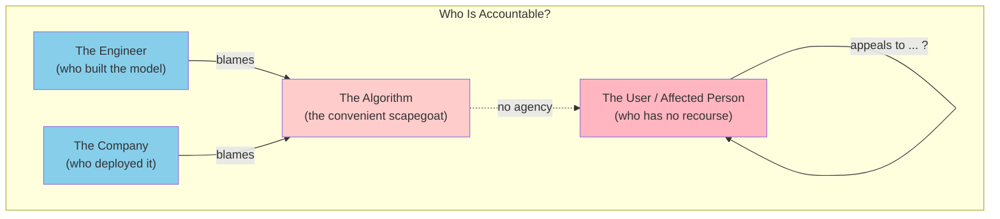

The asymmetry is striking: the affected person often has no clear path to challenge an automated decision, while everyone in the chain of production can deflect responsibility onto the algorithm itself. People should not be able to evade their responsibility by blaming an algorithm.

Other engineering disciplines face similar pressures — civil engineers, chemical engineers, and medical-device engineers all operate in safety-critical domains. Their fields have developed codes of ethics (for example, the **ACM Code of Ethics** and the IEEE Code of Ethics) precisely because the technical community recognized that good engineering is inseparable from moral reasoning. Software engineering has lagged behind on this front.

---

## Predictive Analytics

Predictive analytics is a major reason people are excited about big data and AI. It is also an area fraught with ethical dilemmas.

Using data analysis to predict the weather, or the spread of a disease, is one thing. It is quite another matter to predict whether a convict is likely to reoffend, whether a loan applicant is likely to default, or whether an insurance customer is likely to make expensive claims. The latter have a direct effect on individual people's lives.

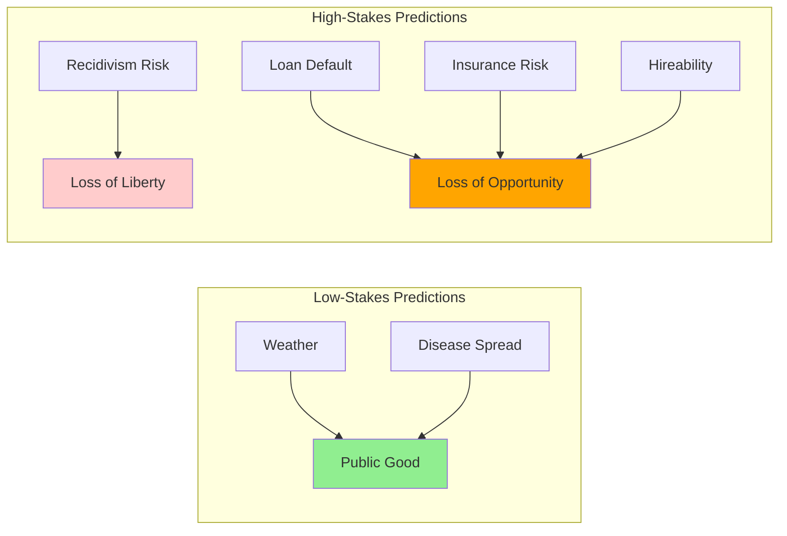

Naturally, payment networks want to prevent fraudulent transactions, banks want to avoid bad loans, airlines want to avoid hijackings, and companies want to avoid hiring ineffective or untrustworthy people. From their point of view, the cost of a missed business opportunity is low, but the cost of a bad loan or a problematic employee is much higher. If in doubt, they are better off saying no.

However, as algorithmic decision making becomes more widespread, a person who has been labeled as risky (accurately or falsely) by an algorithm may accumulate a large number of those "no" decisions. Systematically being excluded from jobs, air travel, insurance, property rental, and financial services is such a large constraint of a person's freedom that it has been called **algorithmic prison** [10].

In countries that respect human rights, the criminal justice system presumes innocence until proven guilty. Automated systems can systematically and arbitrarily exclude a person from participating in society without any proof of guilt and with little chance of appeal. The presumption has been inverted.

### The core concern

The problem is not that algorithms are inherently worse than humans at these tasks. Humans are biased too. The problem is that algorithms *scale* bias in a way that humans do not. A single biased rule applied to a million applicants produces a million harms; a single biased human can only produce so many harms in a working day. And the algorithm's reasoning is opaque, which makes redress harder.

The deeper problem is that **predictive analytics merely extrapolates from the past**. If the past is discriminatory, the system will codify and amplify that discrimination. The only way to produce a fairer future is through moral imagination, which is something only humans can provide. Data and models should be our tools, not our masters.

---

## Bias and Discrimination

Decisions made by an algorithm are not necessarily any better or any worse than those made by a human. Every person has biases, even when they actively try to counteract them, and discriminatory practices can become culturally institutionalized. There is hope that basing decisions on data, rather than subjective and instinctive assessments by people, could be more fair and give a better chance to people who are often overlooked or disadvantaged in the traditional system [11].

When we develop predictive analytics and AI systems, we are not merely automating a human's decision by specifying the rules for when to say yes or no; we are leaving the rules themselves to be inferred from data. However, the patterns learned by these systems are opaque: even if the data indicates a correlation, we may not know why. If the input to an algorithm carries a systematic bias, the system will most likely learn and amplify that bias in its output [12].

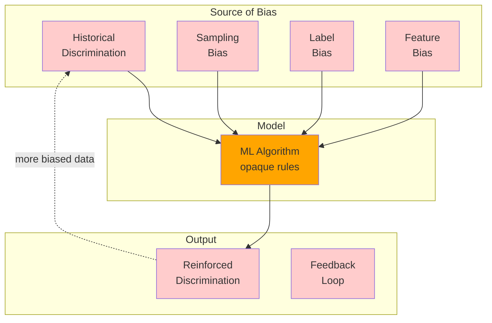

In many countries, anti-discrimination laws prohibit treating people differently depending on **protected traits** such as ethnicity, age, gender, sexuality, disability, or beliefs. Other features of a person's data may be analyzed, but what happens if they are correlated with protected traits?

For example, in racially segregated neighborhoods, a person's postal code — or even their IP address — is a strong predictor of race. Put like this, it seems ridiculous to believe that an algorithm could somehow take biased data as input and produce fair and impartial output from it [13, 14]. Yet this belief is often implied by proponents of data-driven decision making — an attitude satirized as **"machine learning is like money laundering for bias"** [15].

### Real cases

**Example: Amazon's recruiting tool.** In 2018, Reuters reported that Amazon had built an ML system to screen résumés and down-rank women. The system had been trained on résumés received over a 10-year period, which came predominantly from men (reflecting the male dominance of the tech industry). The model learned to associate words like "women's" (as in "women's chess club captain") with lower scores and to downgrade graduates of two all-women's colleges. Amazon ultimately scrapped the tool.

**Example: COMPAS recidivism scoring.** The COMPAS (Correctional Offender Management Profiling for Alternative Sanctions) algorithm used by courts in the United States to predict recidivism was found by ProPublica in 2016 to be significantly more likely to falsely flag Black defendants as future criminals and more likely to falsely flag white defendants as low-risk. The vendor's response was that the algorithm was "color-blind" and that the differences in false-positive rates were a mathematical necessity given different base rates. Both statements can be true simultaneously; the disagreement is about which notion of fairness matters.

**Example: Healthcare algorithms.** A 2019 study published in *Science* found that a widely used healthcare algorithm — designed to identify patients who would benefit from "high-risk care management" programs — exhibited significant racial bias. The algorithm used healthcare costs as a proxy for health needs, but because Black patients historically had less access to care, they had lower costs for the same health conditions. The algorithm systematically under-allocated care-management resources to Black patients.

### Detecting disparate impact

Anti-discrimination law in many jurisdictions (including the US, through the "disparate impact" doctrine established by the Supreme Court in *Griggs v. Duke Power*) considers not only whether the *inputs* to a decision are discriminatory but whether the *outcomes* are. The following code illustrates how a data scientist might test a binary classifier for disparate impact across demographic groups.

```python
"""
disparate_impact.py

Detect whether a model's approval rates differ across protected demographic
groups, even when protected attributes were not used as model inputs.

The 80% rule (also called the "four-fifths rule") is a commonly cited
heuristic from US employment discrimination law: the approval rate for any
group should be at least 80% of the approval rate for the most-favored group.
"""
import numpy as np
import pandas as pd
from typing import Dict


def group_approval_rates(
    predictions: np.ndarray,
    groups: np.ndarray,
) -> pd.DataFrame:
    """
    Compute approval (positive-prediction) rate by demographic group.

    Args:
        predictions: 1 = approved, 0 = rejected
        groups: protected-class membership (e.g., 'male', 'female')

    Returns:
        DataFrame with columns ['group', 'n', 'approval_rate']
    """
    df = pd.DataFrame({"pred": predictions, "group": groups})
    out = (
        df.groupby("group")
          .agg(n=("pred", "size"), approval_rate=("pred", "mean"))
          .reset_index()
    )
    return out


def disparate_impact_ratio(rates: pd.DataFrame) -> Dict[str, float]:
    """
    Return the ratio of each group's approval rate to the maximum rate.
    Values below 0.8 (the four-fifths rule) raise a flag under US EEOC
    guidelines for selection decisions.
    """
    max_rate = rates["approval_rate"].max()
    if max_rate == 0:
        return {}
    rates = rates.copy()
    rates["ratio_to_max"] = rates["approval_rate"] / max_rate
    return dict(zip(rates["group"], rates["ratio_to_max"]))


# --- Example usage with synthetic hiring data ---
if __name__ == "__main__":
    rng = np.random.default_rng(42)
    n = 5000

    # Synthesize a model whose true signal is job-relevant, but where
    # noise and a small historical bias interact to create unequal outcomes.
    true_skill = rng.normal(0, 1, n)
    group = rng.choice(["male", "female", "nonbinary"], size=n, p=[0.5, 0.45, 0.05])
    # Inject a small bias: applicants from group "X" get a tiny score boost
    # that mimics historical advantage.
    bias = np.where(group == "male", 0.0, np.where(group == "female", -0.05, -0.10))
    score = true_skill + bias + rng.normal(0, 0.5, n)

    preds = (score > 0).astype(int)

    rates = group_approval_rates(preds, group)
    print("Approval rates by group:")
    print(rates)

    ratios = disparate_impact_ratio(rates)
    print("\nDisparate impact ratio (vs. best-off group):")
    for g, r in ratios.items():
        flag = " <-- FLAGGED" if r < 0.8 else ""
        print(f"  {g}: {r:.3f}{flag}")
```

Notice that this kind of audit does not require access to the protected attribute at training time. It only requires that the attribute be available at *evaluation* time so that outcomes can be checked across groups. Many ML pipelines discard protected attributes for "fairness" reasons, but that prevents exactly this kind of audit. The chapter would argue that the ability to *measure* disparate impact is a prerequisite for mitigating it.

### What fairness means

There is no single, universally agreed definition of algorithmic fairness, and several of the most prominent definitions are mathematically incompatible. For example:

- **Demographic parity**: The approval rate is the same across groups.
- **Equalized odds**: The true-positive rate and false-positive rate are the same across groups.
- **Predictive parity**: The positive predictive value (precision) is the same across groups.
- **Individual fairness**: Similar individuals receive similar outcomes.

If base rates differ across groups (as they often do for historical reasons), it is mathematically impossible to satisfy all four simultaneously for a non-trivial classifier. Picking which definition to optimize is itself a value judgment and should not be left to the data scientist alone.

---

## Responsibility and Accountability

Automated decision making opens the question of responsibility and accountability [17]. If a human makes a mistake, they can be held accountable, and the person affected by the decision can appeal. Algorithms make mistakes too, but who is accountable when they go wrong [18]?

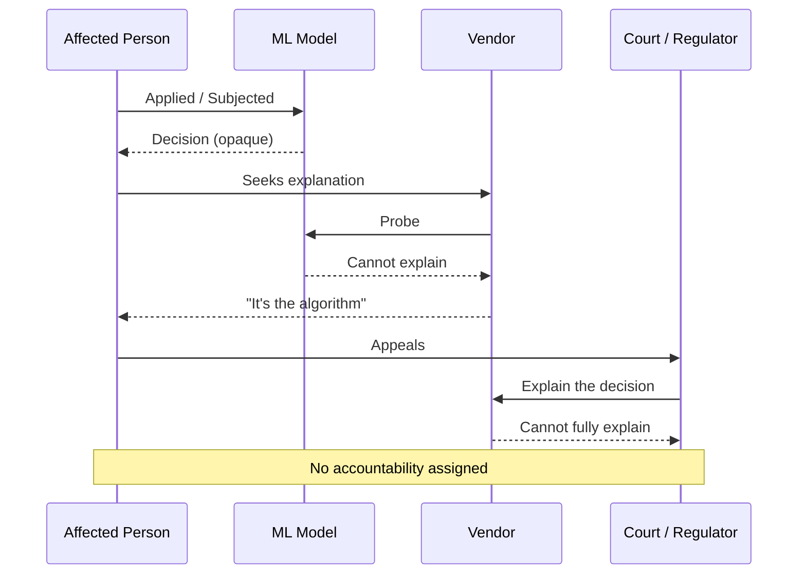

This is not merely a hypothetical problem. Real systems fail in ways that matter:

- **Self-driving cars** cause accidents. The 2018 Uber ATG fatality in Tempe, Arizona raised questions about how the car's perception system failed to classify a pedestrian, what safety-driver expectations should be, and whether the operator's "safety culture" was adequate.
- **Automated credit scoring** systematically discriminates against people of particular races or religions, with little recourse.
- **Healthcare algorithms** make recommendations that, when wrong, can mean misdiagnosis or missed treatment.

If a decision by your ML system comes under judicial review, can you explain to the judge how the algorithm made its decision? If not, you have a serious problem.

### Credit scoring: a precedent

Credit rating agencies are a classic example of collecting data to make decisions about people. A bad credit score makes life difficult, but at least a credit score is normally based on relevant facts about a person's actual borrowing history, and any errors in the record can be corrected (although agencies normally do not make this easy).

ML-based scoring systems, however, typically use a much wider range of inputs and are much more opaque, making it harder to understand how a particular decision has come about and whether someone is being treated in an unfair or discriminatory way [19].

A credit score summarizes **"How did you behave in the past?"**, whereas predictive analytics usually work on the basis of **"Who is similar to you, and how did people like you behave in the past?"** Drawing parallels to others' behavior implies stereotyping — for example, based on where people live (a close proxy for race and socioeconomic class).

If a decision is incorrect because of erroneous data, recourse is almost impossible [17]. And much data is statistical in nature: even if the probability distribution on the whole is correct, individual cases may well be wrong. The average life expectancy in your country may be 80 years, but that doesn't mean you're expected to drop dead on your 80th birthday. From the average and the probability distribution, you can't say much about the age to which one particular person will live. Similarly, the output of a prediction system is probabilistic and may well be wrong in individual cases.

### A blind belief in data is dangerous

A blind belief in the supremacy of data for making decisions is not only delusional but also positively dangerous. As data-driven decision making becomes more widespread, we will need to figure out:

1. How to avoid reinforcing existing biases
2. How to make algorithms accountable and transparent
3. How to fix them when they inevitably make mistakes

We will also need to figure out how to realize the positive potential of data and prevent it from being used to harm people. Analytics can reveal financial and social characteristics of people's lives. On the one hand, this power could be used to focus aid and support to help those who need it most. On the other hand, it is sometimes used by predatory businesses seeking to identify vulnerable people and sell them risky products such as high-cost loans or worthless college degrees [17, 20].

---

## Feedback Loops

Even with predictive applications that have less immediately far-reaching effects on people — such as recommendation systems — there are difficult issues we must confront. When services become good at predicting the content users want to see, they may end up showing people only opinions they already agree with, leading to **echo chambers** in which stereotypes, misinformation, and polarization can breed. The system's outputs shape the inputs it later sees. We are already seeing the impact social media echo chambers can have on election campaigns.

When predictive analytics affect people's lives, particularly pernicious problems arise because of **self-reinforcing feedback loops**.

### Example: credit scores and employment

Consider the case of employers using credit scores to evaluate potential hires. You may be a good worker with a good credit score, but suddenly find yourself in financial difficulties due to a misfortune outside of your control (illness, divorce, an emergency). As you miss payments on your bills, your credit score suffers, and you are less likely to find work. Joblessness pushes you toward poverty, which further worsens your score, making it even harder to find employment [17].

It is a downward spiral due to poisonous assumptions, hidden behind a camouflage of mathematical rigor and data. The model treats the score as a *signal* of trustworthiness, but the score is itself an *outcome* of economic precarity, which the employer's hiring decision then reinforces.

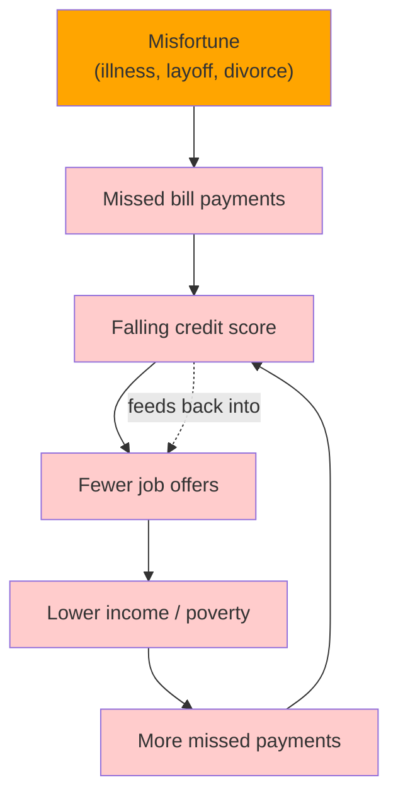

### Example: algorithmic collusion in gas pricing

Economists studying the German retail gasoline market found that when gas stations introduced algorithmic pricing, competition was reduced and prices for consumers went up, because the algorithms learned to collude — not through explicit communication, but through reinforcement learning where each algorithm's best response to the others' prices converged on supra-competitive equilibria [21].

### Example: predictive policing

Predictive policing systems assign officers to areas predicted by the model to have high crime rates. If officers spend more time in those areas, they will naturally make more arrests there. Those arrests feed back into the training data, which confirms (and amplifies) the model's prediction. The result is that policing becomes concentrated in already-policed neighborhoods — typically poor and minority neighborhoods — regardless of where crime actually occurs.

### Systems thinking

We can't always predict when such feedback loops may happen. However, many consequences *can* be predicted by thinking about the entire system (not just the computerized parts, but also the people interacting with it) — an approach known as **systems thinking** [22].

We can try to understand how a data analysis system responds to different behaviors, structures, or characteristics. Does the system reinforce and amplify existing differences between people (e.g., making the rich richer or the poor poorer), or does it try to combat injustice? Even with the best intentions, we must beware of the possibility of unintended consequences.

The tools of systems thinking include:

- Drawing causal-loop diagrams to map feedback structures.
- Identifying **balancing** loops (which resist change) versus **reinforcing** loops (which amplify change).
- Looking for **delays** between cause and effect, which often cause systems to overshoot.
- Modeling the system at multiple levels: technical, organizational, social, and political.

A purely technical analysis of "does the model achieve good predictive accuracy on the test set?" is insufficient. The question is "does deploying this model change the world in ways that make the model's predictions self-fulfilling?"

---

## Privacy and Tracking

Besides the problems of predictive analytics — using data to make automated decisions about people — there are ethical problems with **data collection itself**. What is the relationship between the organizations collecting data and the people whose data is being collected?

When a system stores only data that a user has explicitly entered, because they want the system to store and process it in a certain way, the system is performing a service for the user; the user is the customer. But when a user's activity is tracked and logged as a side effect of other things they are doing, the relationship is less clear. The service no longer just does what the user tells it to do; it takes on interests of its own, which may conflict with the user's interests.

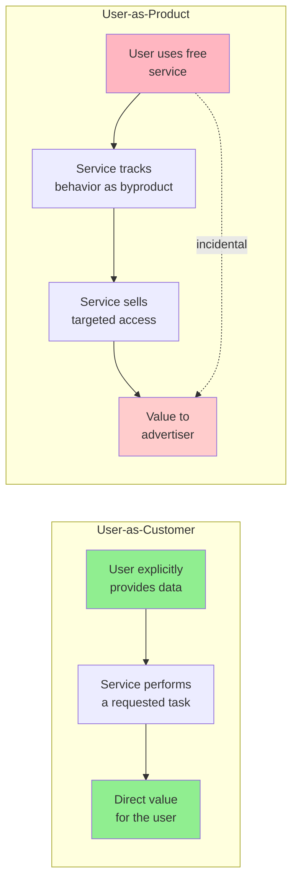

Tracking behavioral data has become increasingly important for user-facing features of many online services:

- Tracking which search results are clicked helps improve search ranking.
- Providing recommendations ("people who liked X also liked Y") helps users discover interesting things.
- A/B tests and user-flow analysis help indicate how a UI might be improved.

Those features require some amount of tracking of user behavior, and users benefit from them.

However, depending on a company's business model, tracking often doesn't stop there. If the service is funded through advertising, the **advertisers are the actual customers**, and the users' interests take second place. Tracking data becomes more detailed, analyses become further-reaching, and data is retained for a long time in order to build up detailed profiles of each person for marketing purposes.

Now the relationship between the company and the user starts looking quite different. The user is given a free service and is coaxed into engaging with it as much as possible. The tracking of the user primarily serves not that individual but rather the needs of the advertisers who are funding the service. This relationship can be appropriately described with a word that has more sinister connotations: **surveillance**.

---

## Surveillance

As a thought experiment, try replacing the word *data* with *surveillance* and observe whether common phrases still sound so good [23]. How about this:

> "In our surveillance-driven organization we collect real-time surveillance streams and store them in our surveillance warehouse. Our surveillance scientists use advanced analytics and surveillance processing in order to derive new insights."

This thought experiment is unusually polemic for this book, but strong words are needed to emphasize the point. In our attempts to make software "eat the world" [24], we have built the greatest mass surveillance infrastructure ever seen. We are rapidly approaching a world in which every inhabited space contains at least one internet-connected microphone, in the form of smartphones, smart TVs, voice-controlled assistant devices, baby monitors, and even children's toys that use cloud-based speech recognition. Many of these devices have a terrible security record [25].

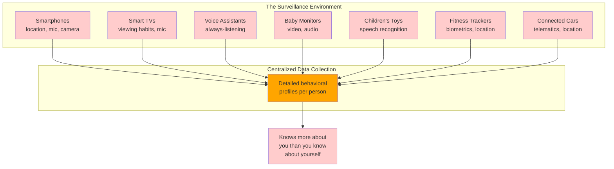

### What is new

What is new compared to the past is that digitization has made it easy to collect large amounts of data about people. Surveillance of our location and movements, our social relationships and communications, our purchases and payments, and our health data has become almost unavoidable. A surveillance organization may end up knowing more about a person than that person knows about themselves — for example, identifying illnesses or economic problems before that individual is aware of them.

Even the most totalitarian and repressive regimes of the past could only dream of putting a microphone in every room and forcing every person to constantly carry a device capable of tracking their location and movements. Yet the benefits we get from digital technology are so great that we now voluntarily accept this state of total surveillance. The difference is just that the data is being collected by corporations to provide us with services, rather than government agencies seeking control [26].

Not all data collection necessarily qualifies as surveillance, but examining it as such can help us understand our relationship with the data collector. Why are we seemingly happy to accept surveillance by corporations?

- Perhaps you feel you have nothing to hide — in other words, you are totally in line with existing power structures, you are not a marginalized minority, and you needn't fear persecution [27]. Not everyone is so fortunate.
- Perhaps it's because the purpose seems benign — it's not overt coercion and conformance, merely better recommendations and more personalized marketing. However, combined with the discussion of predictive analytics, that distinction seems less clear.

We are already seeing behavioral data on car driving, tracked by cars without drivers' consent, affecting their insurance premiums [28], and health insurance coverage that depends on people wearing a fitness tracking device. When surveillance is used to make decisions that hold sway over important aspects of life, such as insurance coverage or employment, it starts to appear less benign. Data analysis can also reveal surprisingly intrusive things — for example, the movement sensor in a smartwatch or fitness tracker can be used to work out what you are typing (e.g., passwords) with fairly good accuracy [29]. Sensor accuracy and algorithms for analysis are only going to get better.

---

## Consent and Freedom of Choice

We might assert that users voluntarily choose to use services that track their activity, agreeing to the terms of service and privacy policy and consenting to data collection. We might even claim that users are receiving a valuable service in return for the data they provide, and that the tracking is necessary in order to provide the service.

Undoubtedly, social networks, search engines, and various other free online services are valuable to users — but this argument has problems.

### Why "consent" often isn't

**First**, we should ask why the tracking is necessary. Some forms of tracking directly feed into improving features for users — for example, tracking the click-through rate on search results can help improve a search engine's result ranking and relevance, and tracking which products customers tend to buy together can help an online shop suggest related products. However, when tracking user interaction for content recommendations, or to build user profiles for advertising purposes, it is less clear whether this is genuinely in the user's interest. Is it necessary only because the ads pay for the service?

**Second**, most users have little knowledge of what data they are feeding into our databases or how it is retained and processed — and most privacy policies do more to obscure than to illuminate. Without understanding what happens to their data, users cannot give meaningful consent. Often, data from one user also says things about other people who are not users of the service and who have not agreed to any terms. The derived datasets discussed in earlier chapters — in which data from the entire user base may have been combined with behavioral tracking and external data sources — are precisely the kinds of data that users cannot meaningfully understand.

```mermaid
graph TB
    A[User clicks "I agree" on a<br/>5,000-word privacy policy] --> B{Understands what<br/>they're consenting to?}
    B -->|Usually no| C[Consent is not<br/>meaningful]
    B -->|Informed minority| D[Consent may be<br/>meaningful]
    C --> E[Data flows to<br/>3rd-party brokers]
    C --> F[Data used for<br/>ad targeting]
    C --> G[Data shared with<br/>government requests]
    D --> H[User retains<br/>some agency]
    style A fill:#87CEEB
    style C fill:#ffcccc
    style E fill:#ffcccc
    style F fill:#ffcccc
    style G fill:#ffcccc
    style H fill:#90EE90
```

Moreover, data is extracted from users through a one-way process, not a relationship with true reciprocity or a fair value exchange. There is no dialogue, no option for users to negotiate how much data they provide and what service they receive in return. The relationship between the service and the user is asymmetric and one-sided; the terms are set by the service, not by the user [30, 31].

### The legal standard: GDPR

In the European Union, the **General Data Protection Regulation (GDPR)** requires that consent must be **"freely given, specific, informed, and unambiguous"** and that the user must be able to **"refuse or withdraw consent without detriment"** — otherwise, it is not considered "freely given." Any request for consent must be written **"in an intelligible and easily accessible form, using clear and plain language,"** and **"silence, pre-ticked boxes or inactivity [do not] constitute consent"** [32].

Consent is not the only basis for lawful processing of personal data under the GDPR. There are also several other bases, including to comply with other legislation or to protect somebody's life. In addition, the **legitimate interest basis** permits certain uses of data (e.g., for fraud prevention) [33] — uses which fraudsters would presumably not consent to. Nevertheless, consent is the most frequently used basis for personal data processing in internet services.

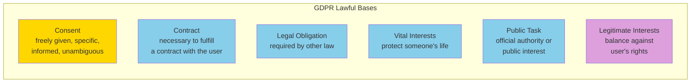

### The illusion of choice

You might argue that a user who does not consent to surveillance can simply choose not to use a service. But this choice is not free either. If a service is so popular that it is "regarded by most people as essential for basic social participation" [30], then it is not reasonable to expect people to opt out of using it — its use is effectively mandatory.

For example, in most Western social communities, it has become the norm to carry a smartphone, to use social networks for socializing, and to use Google for finding information. Especially when a service has network effects, there is a social cost to people choosing not to use it.

Declining to use a service because of its user tracking policies is easier said than done. These platforms are designed specifically to engage users. Many use **game mechanics and tactics common in gambling** to keep users coming back [34]. Even if a user gets past this, declining to engage is an option for only the small number of people who are privileged enough to have the time and knowledge to understand its privacy policy, and who can afford to potentially miss out on social participation or professional opportunities that may have arisen if they had participated in the service. For people in a less privileged position, there is no meaningful freedom of choice; surveillance becomes inescapable.

---

## Privacy and Use of Data

Sometimes people claim that "privacy is dead" on the grounds that some users are willing to post all sorts of things about their lives to social media, sometimes mundane and sometimes deeply personal. However, this claim is false and rests on a misunderstanding of the word *privacy*.

**Having privacy does not mean keeping everything secret; it means having the freedom to choose what to reveal to whom, what to make public, and what to keep secret.**

The right to privacy is a **decision right**: it enables each person to decide where they want to be on the spectrum between secrecy and transparency in each situation [30]. It is an important aspect of a person's freedom and autonomy.

For example, someone who suffers from a rare medical condition might be very happy to provide their private medical data to researchers if it might help the development of treatments. However, this person must have a choice over who may access this data and for what purpose. If information about their condition could hinder their access to medical insurance or employment, they would probably be much more cautious about sharing their data.

### How privacy slips away from the individual

When data is extracted from people through surveillance infrastructure, privacy rights are not necessarily eroded but rather **transferred to the data collector**. Companies that acquire data say, "Trust us to do the right thing with your data," which means that the right to decide what to reveal and what to keep secret is transferred from the individual to the company.

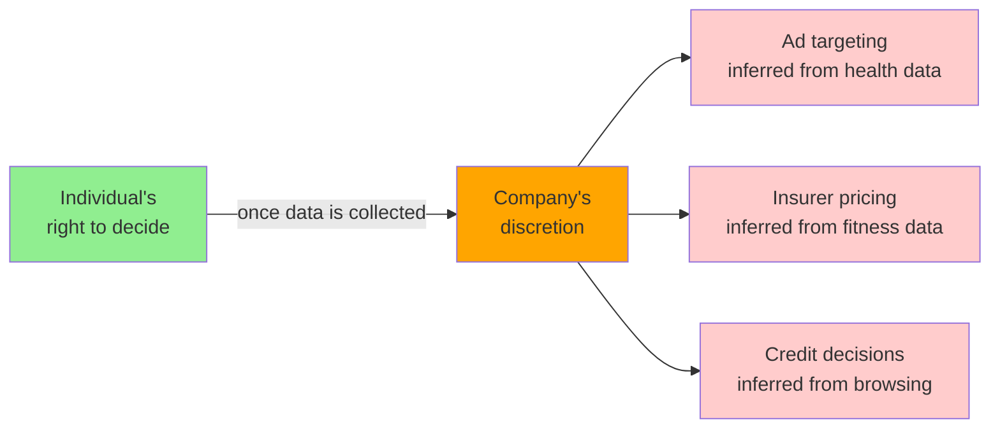

The companies in turn choose to keep much of the outcome of this surveillance secret, because to reveal it would be perceived as creepy and would harm their business model (which relies on knowing more about people than other companies do). Intimate information about users is revealed only indirectly — for example, in the form of tools for targeting advertisements to specific groups of people (such as those suffering from a particular illness).

Even if particular users cannot be personally reidentified from the bucket of people targeted by a particular ad, they have lost their agency about the disclosure of some intimate information. It is not the user who decides what is revealed to whom on the basis of their personal preferences — it is the company that exercises the privacy right with the goal of maximizing its profit.

Many companies want to avoid being perceived as creepy, avoiding the question of how intrusive their data collection actually is and instead focusing on managing user perceptions. And even these perceptions are often managed poorly — for example, something may be factually correct, but if it triggers painful memories, the user may not want to be reminded about it [35].

With any kind of data, we should expect the possibility that it is wrong, undesirable, or inappropriate in some way, and we need to build mechanisms for handling those failures. Whether something is "undesirable" or "inappropriate" is of course down to human judgment; algorithms are oblivious to such notions unless we explicitly program them to respect human needs. As engineers of these systems, we must be humble, accepting and planning for such failings.

Privacy settings that allow a user of an online service to control which aspects of their data other users can see are a starting point for handing back some control to users. However, regardless of the setting, the service itself still has unfettered access to the data and is free to use it in any way permitted by the privacy policy. Even if the service promises not to sell the data to third parties, it usually grants itself unrestricted rights to process and analyze the data internally, often going much further than what is overtly visible to users.

This kind of large-scale transfer of privacy rights from individuals to corporations is **historically unprecedented** [30]. Surveillance has always existed, but it used to be expensive and manual, not scalable and automated. Trust relationships have always existed — for example, between a patient and their doctor, or between a defendant and their attorney — but in these cases the use of data has been strictly governed by ethical, legal, and regulatory constraints. Internet services have made it much easier to amass huge amounts of sensitive information without meaningful consent, and to use it at massive scale without users understanding what is happening to their private data.

### Privacy-preserving techniques (brief)

Where privacy is genuinely required, the field has developed several techniques worth knowing about. Each makes a different trade-off between utility, privacy, and computational cost.

| Approach | Techniques | Idea | Limitation |
|---|---|---|---|
| **Anonymization** | k-anonymity, l-diversity | Generalize or suppress fields so each record is indistinguishable from a group of others | Vulnerable to background-knowledge and skewness attacks; loses utility |
| **Statistical noise** | Differential privacy | Add calibrated noise to query results so inclusion/exclusion of any one person has bounded effect | Requires careful calibration; degrades small-query accuracy |
| **Cryptographic isolation** | Homomorphic encryption, Federated learning | Compute on encrypted data (HE) or train on user devices with only gradients shared (FL) | Extremely expensive compute (HE); gradients can leak training data (FL) |
| **Hardware isolation** | Secure enclaves (TEE) | Compute on plaintext inside hardware-isolated enclaves | Trust shifts to hardware vendor; side-channel attacks |

The chapter does not endorse any single technique as a silver bullet. The right approach is to use the *minimum* amount of data needed for the task, *minimize* retention, and *architect* the system so that less-trusted components see less data.

---

## Data as Assets and Power

Since behavioral data is a byproduct of users interacting with a service, it is sometimes called **"data exhaust"** — suggesting that the data is worthless waste material. Viewed this way, behavioral and predictive analytics can be seen as a form of recycling that extracts value from data that would have otherwise been thrown away.

More correct would be to view it the other way around. From an economic point of view, if targeted advertising is what pays for a service, then the user activity that generates behavioral data could be regarded as a form of labor [36]. One could go even further and argue that the application with which the user interacts is merely a means to lure users into feeding more and more personal information into the surveillance infrastructure [30]. The delightful human creativity and social relationships that often find expression in online services are cynically exploited by the data extraction machine.

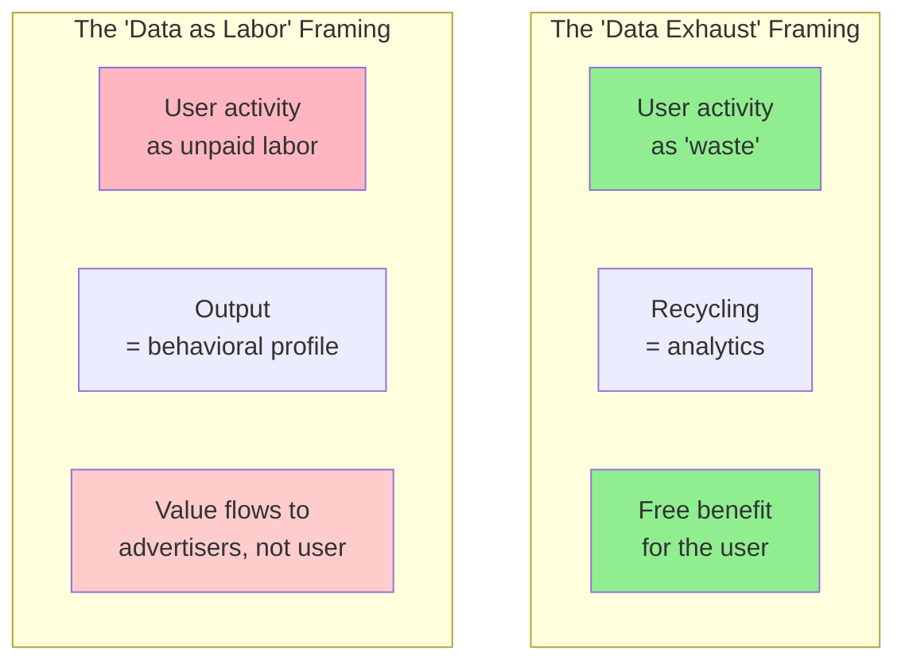

### The asset power structure

Personal data is a valuable asset, as evidenced by the existence of **data brokers** operating in secrecy, purchasing, aggregating, analyzing, and reselling people's personal data, mostly for marketing purposes [20]. Startups are valued by their user numbers, or "eyeballs" — that is, by their surveillance capabilities.

Because the data is valuable, many people want it. Of course, companies want it — that's why they collect it in the first place. But governments want it too, and they may seek to obtain it by means of secret deals, coercion, legal compulsion, or simply theft [37]. When a company goes bankrupt, the personal data it has collected is one of the assets that gets sold. And because data is difficult to secure, breaches happen disconcertingly often.

These observations have led critics to say that data is not just an asset, but a **"toxic asset"** [37], or at least **"hazardous material"** [38]. Maybe data is not the new gold, or the new oil, but rather the new uranium [39]. Even if we think that we are capable of preventing abuse of data, whenever we collect it, we need to balance the benefits with the risk of it falling into the wrong hands. Computer systems may be compromised by criminals or hostile foreign intelligence services, data may be leaked by insiders, the company may fall into the hands of unscrupulous management that does not share our values, or the country may be taken over by a regime that has no qualms about compelling us to hand over the data.

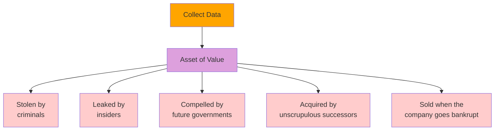

### Designing for political change

As that observation suggests, when collecting data, we need to consider not just today's political environment, but all possible future governments. There is no guarantee that every government elected in the future will respect human rights and civil liberties, and as Bruce Schneier observes: **"It is poor civic hygiene to install technologies that could someday facilitate a police state"** [40].

"Knowledge is power," as the old adage goes. And furthermore, "To scrutinize others while avoiding scrutiny oneself is one of the most important forms of power" [41]. This is why totalitarian governments want surveillance: it gives them the power to control the population. Although today's technology companies are not overtly seeking political power, the data and knowledge they have accumulated — much of it surreptitiously, outside of public oversight — nevertheless gives them a lot of power over our lives [42].

---

## Remembering the Industrial Revolution

Data is the defining feature of the information age. The internet, data storage and processing, and software-driven automation are having a major impact on the global economy and human society. As our daily lives and social organization have been changed by information technology, and will probably continue to radically change in the coming decades, comparisons to the **Industrial Revolution** come to mind [17, 26].

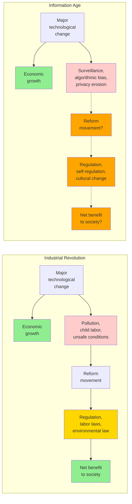

The Industrial Revolution came about through major technological and agricultural advances, and it brought sustained economic growth and significantly improved living standards in the long run — yet it also came with major problems. Pollution of the air (due to smoke and chemical processes) and the water (from industrial and human waste) was dreadful. Factory owners lived in splendor, while urban workers often lived in cramped and unsanitary housing and worked long hours in harsh conditions. Child labor was common, including dangerous and poorly paid work in mines.

It took a long time before safeguards were established, such as environmental protection regulations, safety protocols for workplaces, laws prohibiting child labor, and health inspections for food. Undoubtedly, the cost of doing business increased when factories were no longer allowed to dump their waste into rivers, sell tainted foods, or exploit workers. But society as a whole benefited hugely from these regulations, and few of us would want to return to a time before [17].

### The pollution parallel

Just as the industrial revolution had a dark side that needed to be managed, our transition to the information age has major problems that we need to confront and solve [43, 44]. The collection and use of data is one of those problems. In the words of Bruce Schneier [26]:

> Data is the pollution problem of the information age, and protecting privacy is the environmental challenge. Almost all computers produce information. It stays around, festering. How we deal with it — how we contain it and how we dispose of it — is central to the health of our information economy. Just as we look back today at the early decades of the industrial age and wonder how our ancestors could have ignored pollution in their rush to build an industrial world, our grandchildren will look back at us during these early decades of the information age and judge us on how we addressed the challenge of data collection and misuse.

We should try to make them proud.

This framing is powerful because it suggests that the right response is not to abandon data systems but to develop *environmental* practices around them: data minimization, retention limits, purpose limitation, the right to be forgotten, and so on. These are the analogues of smokestack scrubbers and clean-water acts.

---

## Legislation and Self-Regulation

Data protection laws might be able to help preserve individuals' rights. For example, the GDPR states that personal data must be **"collected for specified, explicit and legitimate purposes and not further processed in a manner that is incompatible with those purposes"** and be **"adequate, relevant and limited to what is necessary in relation to the purposes for which [it is] processed"** [32]. See the *Principles vs. Practice* table at the end of this chapter for how these principles stack up against current industry practice.

However, this principle of **data minimization** runs directly counter to the philosophy of big data, which is to maximize data collection, to combine the collected data with other datasets, and to experiment and explore in order to generate new insights. Exploration means using data for unforeseen purposes, which the GDPR states is the opposite of the "specified and explicit" purposes for which the data must have been collected.

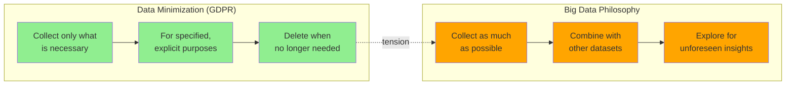

While this regulation has had some effect on the online advertising industry [45], it has been weakly enforced [46] and does not seem to have led to much of a change in culture and practices across the wider tech industry.

### Regulation vs. innovation

Companies that collect lots of data about people broadly oppose regulation as being a burden and a hindrance to innovation. To some extent, that opposition is justified. For example, sharing medical data creates clear risks to privacy but also potential opportunities: how many deaths could be prevented if data analysis were able to help us achieve better diagnostics or find better treatments [47]? Overregulation may prevent such breakthroughs. It is difficult to balance the potential opportunities with the risks [41].

### What is required

Fundamentally, we need a culture shift in the tech industry with regard to personal data. We should stop regarding users as metrics to be optimized, and remember that they are humans who deserve respect, dignity, and agency. We should self-regulate our data collection and processing practices in order to establish and maintain the trust of the people who depend on our software [48]. And we should take it upon ourselves to educate end users about how their data is used rather than keeping them in the dark.

We should allow each individual to maintain their privacy (i.e., their control over their own data) and not steal that control from them through surveillance. Our individual right to control our data is like the natural environment of a national park: if we don't explicitly protect and care for it, it will be destroyed. It will be the tragedy of the commons, and we will all be worse off for it. **Ubiquitous surveillance is not inevitable. We are still able to stop it.**

As a first step, we should not retain data forever, but purge it as soon as it is no longer needed, and minimize what we collect in the first place [48, 49]. **Data you don't have is data that can't be leaked, stolen, or compelled by governments to be handed over.** Overall, culture and attitude changes will be necessary. As people working in technology, if we don't consider the societal impact of our work, we're not doing our job [50].

### Principles vs. practice

The following table summarizes the tension between the principles typically enshrined in regulation and the practices common in industry. Neither column is presented as "correct" — the point is to make the gap explicit so that engineers, managers, and policymakers can discuss where they actually stand.

| Principle | What the principle requires | Common practice | The gap |
|---|---|---|---|
| Purpose limitation | Collect data for a specified, explicit purpose | Collect everything; reuse for any future purpose | Largest gap; entire business model depends on it |
| Data minimization | Collect only what is necessary | Collect exhaustively because storage is cheap | Economic incentives point the wrong way |
| Consent | Freely given, specific, informed, unambiguous | Long unread ToS, dark patterns, pre-ticked boxes | The legal text vs. the lived user experience |
| Right to be forgotten | Delete on request without undue delay | Retention measured in years or forever | Engineering effort is non-trivial; product KPIs fight it |
| Right to explanation | Explain automated decisions in plain language | Models are black-box; explanations approximate | Technically difficult; may be impossible for some model classes |
| Data portability | Provide user data in machine-readable form | Silos make it hard; export formats are partial | Competitive reasons discourage portability |
| Breach notification | Notify users within 72 hours (GDPR) | Quietly patch; disclose only when required by law | Reputational incentives point the wrong way |
| Purpose change | Cannot repurpose data without fresh consent | Repurpose freely under "legitimate interest" | The loophole that swallows the rule |

A culture of ethics is not the same as a checklist. It is the willingness to look at each row of that table and ask: what is our actual practice, what should it be, and what would it take to close the gap?

### A practical starting point for engineers

Without claiming to be exhaustive, here are concrete practices an engineering team can adopt today. They are not substitutes for legal compliance or ethical reflection, but they make the right thing easier to do than not to do.

```python
"""
privacy_minimization.py

Helpers for engineers to enforce privacy minimization as a default,
not as a special-case cleanup pass at the end of a project.

The basic idea: treat personal data as a perishable resource with
a known expiration date and a known allowed set of purposes.
"""
import datetime as dt
from dataclasses import dataclass, field
from enum import Enum
from typing import Any, Dict, List, Optional


class AllowedPurpose(str, Enum):
    SERVICE_DELIVERY = "service_delivery"
    FRAUD_PREVENTION = "fraud_prevention"
    LEGAL_COMPLIANCE = "legal_compliance"
    RESEARCH = "research"  # Typically requires additional consent
    MARKETING = "marketing"  # Typically requires explicit opt-in


@dataclass
class RetentionPolicy:
    """Describes how long a field may be kept and for what purposes."""
    field_name: str
    purposes: List[AllowedPurpose]
    retention_days: int
    # Some fields are required to be deletable on request
    deletable_on_request: bool = True


@dataclass
class PersonalDataRecord:
    """Wrapper that tracks when each field expires and for what purpose."""
    raw: Dict[str, Any]
    policies: List[RetentionPolicy] = field(default_factory=list)
    created_at: dt.datetime = field(default_factory=lambda: dt.datetime.utcnow())

    def is_expired(self, policy: RetentionPolicy, now: Optional[dt.datetime] = None
                   ) -> bool:
        now = now or dt.datetime.utcnow()
        age = now - self.created_at
        return age > dt.timedelta(days=policy.retention_days)

    def collectable_for(self, purpose: AllowedPurpose) -> Dict[str, Any]:
        """Return the subset of fields that may be used for `purpose`."""
        out = {}
        for policy in self.policies:
            if purpose in policy.purposes:
                if policy.field_name in self.raw:
                    out[policy.field_name] = self.raw[policy.field_name]
        return out

    def purge_expired(self, now: Optional[dt.datetime] = None) -> List[str]:
        """Remove fields whose retention period has elapsed. Return names."""
        purged = []
        for policy in self.policies:
            if policy.deletable_on_request and self.is_expired(policy, now):
                if policy.field_name in self.raw:
                    del self.raw[policy.field_name]
                    purged.append(policy.field_name)
        return purged


# --- Example usage ---
if __name__ == "__main__":
    record = PersonalDataRecord(
        raw={
            "email": "alice@example.com",
            "shipping_address": "1 Apple Park Way",
            "raw_click_log": [...],   # very large, very personal
            "billing_token": "tok_xxx",
        },
        policies=[
            RetentionPolicy("email", [AllowedPurpose.SERVICE_DELIVERY,
                                      AllowedPurpose.MARKETING], 365 * 7),
            RetentionPolicy("shipping_address", [AllowedPurpose.SERVICE_DELIVERY], 90),
            RetentionPolicy("raw_click_log", [AllowedPurpose.SERVICE_DELIVERY], 30),
            RetentionPolicy("billing_token", [AllowedPurpose.FRAUD_PREVENTION,
                                              AllowedPurpose.LEGAL_COMPLIANCE],
                            365 * 7, deletable_on_request=False),
        ],
    )

    # What can we use for fraud prevention?
    fraud_view = record.collectable_for(AllowedPurpose.FRAUD_PREVENTION)
    print("Fields usable for fraud prevention:", list(fraud_view))

    # What has expired (assuming we are a year and a day out)?
    future = dt.datetime.utcnow() + dt.timedelta(days=365 + 1)
    purged = record.purge_expired(now=future)
    print("Purged after retention period:", purged)
    print("Remaining fields:", list(record.raw.keys()))
```

This pattern — making data expire automatically, scoping fields to explicit purposes, and computing access views rather than handing out the raw record — is far from a complete solution, but it shifts the default from "keep everything forever" to "keep only what is allowed and only for as long as needed." That shift in default is what the chapter is asking for.

---

## Summary

This brings us to the end of the book. We have covered a lot of ground:

- **In Chapter 1** we contrasted analytical and operational systems, compared the cloud to self-hosting, weighed up distributed and single-node systems, and discussed balancing the needs of your business with the needs of your users.
- **In Chapter 2** we saw how to define several nonfunctional requirements, such as performance, reliability, scalability, and maintainability.
- **In Chapter 3** we explored a spectrum of data models, including the relational, document, and graph models, event sourcing, and DataFrames. We also looked at examples of various query languages, including SQL, Cypher, SPARQL, Datalog, and GraphQL.
- **In Chapter 4** we discussed storage engines for OLTP (LSM-trees and B-trees) and analytics (column-oriented storage), as well as indexes for information retrieval (full-text and vector search).
- **In Chapter 5** we examined different ways of encoding data objects as bytes and how to support evolution as requirements change. We also compared several ways that data flows between processes: via databases, service calls, workflow engines, and event-driven architectures.
- **In Chapter 6** we studied the trade-offs between single-leader, multi-leader, and leaderless replication. We also looked at consistency models such as read-after-write consistency and sync engines that allow clients to work offline.
- **In Chapter 7** we looked at sharding, including strategies for rebalancing, request routing, and secondary indexing.
- **In Chapter 8** we covered transactions, considering durability, how various isolation levels (read committed, snapshot isolation, and serializable) can be achieved, and how atomicity can be ensured in distributed transactions.
- **In Chapter 9** we surveyed fundamental problems that occur in distributed systems (network faults and delays, clock errors, process pauses, crashes) and saw how they make it difficult to correctly implement even something seemingly simple like a lock.
- **In Chapter 10** we went on a deep dive into various forms of consensus and the consistency model (linearizability) it enables.
- **In Chapter 11** we dug into batch processing, building up from simple chains of Unix tools to large-scale distributed batch processors using distributed filesystems or object stores.
- **In Chapter 12** we generalized batch processing to stream processing and discussed the underlying message brokers, CDC, fault tolerance, and processing patterns such as streaming joins.
- **In Chapter 13** we explored a philosophy of streaming systems that allows disparate data systems to be integrated, systems to be evolved, and applications to be scaled more easily.

Finally, in this last chapter, we took a step back and examined some ethical aspects of building data-intensive applications. We saw that although data can be used to do good, it can also do significant harm: making decisions that seriously affect people's lives and are difficult to appeal against, leading to discrimination and exploitation, normalizing surveillance, and exposing intimate information. We also run the risk of data breaches, and we may find that a well-intentioned use of data has unintended consequences.

### Key Takeaways

1. **Predictive analytics extrapolate from the past.** If the past is discriminatory, the model will codify and amplify it. Moral imagination, not bigger models, is what changes outcomes.

2. **Feedback loops are everywhere.** Recommendation systems, predictive policing, credit scoring, and pricing algorithms all create self-reinforcing dynamics. Reason about the *system*, not just the model.

3. **Surveillance is the natural endpoint of "data exhaust" thinking.** Naming the practice honestly is the first step toward changing it.

4. **Consent in the GDPR sense is rarely what users actually experience.** The legal text and the lived UX of a 5,000-word ToS are very different things. Don't conflate them.

5. **Data is a toxic asset — minimize, scope, and expire it.** Collect the minimum, scope every field to an allowed purpose, and let records expire on a known schedule. Data you don't have can't be leaked, stolen, or compelled.

### A short checklist for code review

When reviewing a pull request that touches data collection, model training, or user-facing decisions, the following questions are useful. They are not exhaustive, but they surface issues that are otherwise easy to miss in review.

| Question | Probe |
|---|---|
| Where does this data come from? | Did the user know? Did they consent? |
| How long do we keep it? | Is there an expiration? Is it enforced? |
| Who can see it? | Least-privilege? Logged access? |
| What decisions does it drive? | Reversible? Explainable? Appeallable? |
| Who is harmed if it's wrong? | Worst case? Affected groups? |
| How do we delete it? | Tested? Cascades? |

If your team can't answer one of these for a piece of data in production, that gap is worth raising before the change ships — not after a regulator, a journalist, or a user notices.

### A note on moral imagination

No checklist, regulation, or technical technique can substitute for **moral imagination**: the willingness to look at a system and ask, "Is this the world I want to live in? Would I want to be on the receiving end of this decision? Would I be comfortable if this practice were described on the front page of a newspaper?" If the answer is no, the appropriate response is not to find a clever workaround but to redesign the system. That is the work, and it is unfinished.

### Afterword

Most of this book has been about how to build data systems that work. This chapter has been about how to ensure that the systems we build are *worth* working — that they serve human flourishing rather than merely corporate optimization, that they distribute benefit rather than concentrating harm, and that they leave room for the kind of society we want our children to inherit. The technical questions are easier than the moral ones, but the moral ones are the ones we will be judged on.

Build well. Build carefully. Build for people.

Given the large impact that software and data have on the world, we as engineers must remember that we carry a responsibility to work toward the kind of world that we want to live in: a world that treats people with humanity and respect. **Let's work together toward that goal.**

### Further reading

The chapter cites work from several authors whose books are worth reading in full:

- **Cathy O'Neil**, *Weapons of Math Destruction* — the canonical popular account of how opaque algorithms perpetuate inequality.
- **Bruce Schneier**, *Data and Goliath* — on the surveillance infrastructure we have built and how to resist it.
- **Shoshana Zuboff**, *The Age of Surveillance Capitalism* — the academic foundation for the "data as power" framing.
- **Donella Meadows**, *Thinking in Systems* — the classic primer on feedback loops and systems thinking.
- **Solon Barocas and Andrew Selbst**, *The Big Book of Fairness* (and many papers) — the legal-technical treatment of algorithmic fairness.

The ACM Code of Ethics (2018) is also worth re-reading periodically; it is shorter than you remember and stricter than you expect.

### References (as cited in the chapter)

_Numbers match the source book; gaps reflect citations reused only in the original print edition._

- [1] David Schmudde. "What If Data Is a Bad Idea?" *schmud.de*, August 2024.
- [2] Association for Computing Machinery. "ACM Code of Ethics and Professional Conduct." *acm.org*, 2018.
- [5] Deborah G. Johnson and Mario Verdicchio. "Ethical AI Is Not About AI." *Communications of the ACM*, vol. 66, no. 2, January 2023.
- [10] Bill Davidow. "Welcome to Algorithmic Prison." *theatlantic.com*, February 2014.
- [13] Jesse Emspak. "How a Machine Learns Prejudice." *scientificamerican.com*, December 2016.
- [14] FTC et al. "Joint Statement on Enforcement Efforts Against Discrimination and Bias in Automated Systems." *ftc.gov*, April 2023.
- [15] Maciej Cegłowski. "The Moral Economy of Tech." *idlewords.com*, June 2016.
- [17] Cathy O'Neil. *Weapons of Math Destruction*. Crown, 2016.
- [18] Julia Angwin. "Make Algorithms Accountable." *nytimes.com*, August 2016.
- [21] Stephanie Assad et al. "Algorithmic Pricing and Competition." *Journal of Political Economy*, vol. 132, no. 3, March 2024.
- [22] Donella H. Meadows and Diana Wright. *Thinking in Systems: A Primer*. Chelsea Green, 2008.
- [23] Daniel J. Bernstein. "Listening to a 'big data' / 'data science' talk." *x.com*, May 2015.
- [26] Bruce Schneier. *Data and Goliath*. W. W. Norton, 2015.
- [28] Federal Trade Commission. "FTC Takes Action Against General Motors for Sharing Drivers' Precise Location and Driving Behavior Data Without Consent." *ftc.gov*, January 2025.
- [30] Shoshana Zuboff. "Big Other: Surveillance Capitalism and the Prospects of an Information Civilization." *Journal of Information Technology*, vol. 30, no. 1, April 2015.
- [32] "Regulation (EU) 2016/679" (GDPR), *Official Journal of the European Union*, May 2016.
- [34] Tristan Harris. "How a Handful of Tech Companies Control Billions of Minds Every Day." TED2017.
- [37] Bruce Schneier. "Data Is a Toxic Asset, So Why Not Throw It Out?" *schneier.com*, March 2016.
- [39] Mark Pesce. "Data Is The New Uranium." *theregister.com*, November 2024.
- [40] Bruce Schneier. "Mission Creep: When Everything Is Terrorism." *schneier.com*, July 2013.
- [46] Johnny Ryan. "Don't Be Fooled by Meta's Fine for Data Breaches." *The Economist*, May 2023.
- [47] Jessica Leber. "Your Data Footprint Is Affecting Your Life in Ways You Can't Even Imagine." *fastcompany.com*, March 2016.
- [48] Maciej Cegłowski. "Haunted by Data." *idlewords.com*, October 2015.
- [49] Sam Thielman. "You Are Not What You Read." *theguardian.com*, January 2016.
- [50] Jez Humble. *x.com*, April 2021.